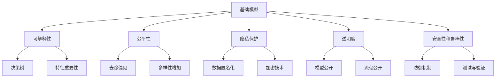

                 

# 基础模型的社会技术性质

## 1. 背景介绍

### 1.1 问题由来

在过去的几十年中，人工智能（AI）技术已经取得了巨大的进展，特别是在深度学习领域。深度学习模型的性能随着规模的扩大和训练数据的增加而不断提高，这些模型不仅在计算机视觉、自然语言处理等技术领域表现出色，还在社会生活的各个方面发挥着重要作用，如自动驾驶、医疗诊断、智能客服、推荐系统等。然而，随着这些技术的广泛应用，基础模型的社会技术性质逐渐成为人们关注的焦点。

基础模型的社会技术性质指的是模型在社会和技术层面上的各种特征和影响，包括模型的可解释性、公平性、隐私保护、透明度等。这些性质直接影响模型的应用效果，以及在社会中引起的道德、法律和安全问题。因此，理解基础模型的社会技术性质是确保AI技术负责任和有效应用的关键。

### 1.2 问题核心关键点

基础模型的社会技术性质涉及多个关键问题：

- **可解释性**：模型的决策过程是否透明，能否让人理解和解释。
- **公平性**：模型是否对所有群体公平，避免偏见和歧视。
- **隐私保护**：模型在处理个人数据时，如何保护用户的隐私。
- **透明度**：模型的输入和输出是否透明，以及其训练和运行过程是否公开。
- **安全性和鲁棒性**：模型是否能够抵御攻击，保证稳定运行。

这些关键问题直接影响基础模型在社会中的接受度和信任度，因此需要在模型设计和应用过程中给予足够的重视。

## 2. 核心概念与联系

### 2.1 核心概念概述

为了深入理解基础模型的社会技术性质，我们先介绍几个关键概念：

- **可解释性**：指模型输出结果的解释能力，即能否解释模型如何做出预测或决策。
- **公平性**：指模型在处理不同群体时，是否存在偏见和歧视。
- **隐私保护**：指模型在处理个人数据时，如何保护用户的隐私。
- **透明度**：指模型的输入、输出以及其训练和运行过程的公开程度。
- **安全性和鲁棒性**：指模型在面对恶意攻击时，能否保持稳定性和安全性。

这些概念之间存在紧密的联系，通过合理的模型设计，可以在一定程度上解决这些问题，从而提升模型的社会技术性质。

### 2.2 核心概念原理和架构的 Mermaid 流程图



这个流程图展示了基础模型的几个核心社会技术性质及其相互关系。模型的可解释性、公平性、隐私保护、透明度和安全性和鲁棒性之间相互影响，共同构成模型在社会和技术层面的整体性质。

## 3. 核心算法原理 & 具体操作步骤

### 3.1 算法原理概述

基础模型的社会技术性质涉及多个核心算法原理，其中最关键的是可解释性算法、公平性算法、隐私保护算法、透明度算法和安全性和鲁棒性算法。这些算法通过不同的技术手段，帮助提升模型的社会技术性质。

### 3.2 算法步骤详解

#### 3.2.1 可解释性算法

**步骤一：模型选择与预处理**
- 选择合适的模型类型，如决策树、线性回归、深度学习等。
- 对输入数据进行预处理，包括数据清洗、特征选择和归一化。

**步骤二：可解释性分析**
- 使用决策树、LIME等可解释性工具，对模型进行解释性分析。
- 生成特征重要性图、局部解释模型等，帮助理解模型的决策过程。

**步骤三：可解释性评估**
- 通过可解释性指标（如SHAP值、LIME值）评估模型的解释性水平。
- 不断优化模型结构，提升模型的可解释性。

#### 3.2.2 公平性算法

**步骤一：数据收集与预处理**
- 收集包含不同群体的数据，确保数据的多样性。
- 对数据进行预处理，去除异常值和噪声。

**步骤二：公平性评估**
- 使用 fairness constraint 等公平性指标，评估模型的公平性。
- 检测模型在不同群体之间的性能差异。

**步骤三：公平性调整**
- 对模型进行公平性调整，如重新采样、调整损失函数等。
- 增加多样性特征，提升模型的公平性。

#### 3.2.3 隐私保护算法

**步骤一：数据匿名化**
- 使用数据匿名化技术，如数据泛化、数据扰动等，保护用户隐私。
- 确保匿名化后的数据不能被反向识别。

**步骤二：加密技术**
- 使用加密技术，如同态加密、差分隐私等，保护用户数据。
- 确保加密后的数据在处理和传输过程中不会被泄露。

#### 3.2.4 透明度算法

**步骤一：模型公开**
- 公开模型的结构和参数，方便学术界和用户理解。
- 提供模型解释文档，解释模型的设计理念和运行机制。

**步骤二：流程公开**
- 公开模型的训练和运行流程，包括数据来源、特征选择、模型训练等步骤。
- 提供详细的代码和文档，供用户参考和验证。

#### 3.2.5 安全性和鲁棒性算法

**步骤一：防御机制**
- 使用防御机制，如对抗训练、鲁棒正则化等，增强模型的鲁棒性。
- 确保模型在面对恶意攻击时，能够保持稳定性和安全性。

**步骤二：测试与验证**
- 在测试集上评估模型的性能，发现潜在的漏洞和不足。
- 对模型进行验证，确保其在不同环境下的稳定性。

### 3.3 算法优缺点

**可解释性算法**
- 优点：提高模型的透明性和可理解性，增加用户信任。
- 缺点：可能增加模型复杂度，影响运行效率。

**公平性算法**
- 优点：提升模型的公平性，避免偏见和歧视。
- 缺点：可能增加模型训练难度，影响模型性能。

**隐私保护算法**
- 优点：保护用户隐私，增强用户信任。
- 缺点：可能影响模型性能，增加计算复杂度。

**透明度算法**
- 优点：增加模型的透明度和公开性，方便学术界和用户理解和验证。
- 缺点：可能增加模型的复杂度，影响模型性能。

**安全性和鲁棒性算法**
- 优点：增强模型的鲁棒性和安全性，减少攻击风险。
- 缺点：可能增加模型训练难度，影响模型性能。

### 3.4 算法应用领域

基础模型的社会技术性质在多个领域中都有广泛应用：

- **医疗领域**：模型在医疗诊断和治疗建议中的应用，需要保证可解释性、公平性和隐私保护，确保医疗决策的透明性和安全性。
- **金融领域**：模型在风险评估和信用评分中的应用，需要确保模型的公平性、透明度和安全性和鲁棒性，避免偏见和欺诈行为。
- **教育领域**：模型在个性化推荐和智能辅导中的应用，需要保证模型的可解释性、隐私保护和透明度，确保教育资源的公平分配。
- **司法领域**：模型在案件预测和法律文书生成中的应用，需要确保模型的公平性、透明度和安全性和鲁棒性，避免偏见和滥用。

这些应用领域对基础模型的社会技术性质提出了更高的要求，模型需要在保证性能的同时，兼顾社会和技术的各个方面。

## 4. 数学模型和公式 & 详细讲解 & 举例说明

### 4.1 数学模型构建

为了更好地理解基础模型的社会技术性质，我们将使用数学模型对其进行详细讲解。

假设我们有一个二分类模型 $M(x; \theta)$，其中 $x$ 为输入数据， $\theta$ 为模型参数。模型的输出为 $y = M(x; \theta)$，表示模型对输入数据的预测。我们的目标是通过训练模型，使得模型在预测 $y$ 时的误差最小化。

### 4.2 公式推导过程

**可解释性公式推导**
- 假设我们有一个决策树模型 $T(x; \theta)$，其中 $\theta$ 为决策树的分裂点参数。我们的目标是通过训练模型，使得模型在预测 $y$ 时的误差最小化。
- 使用决策树对输入数据 $x$ 进行分割，得到一系列子树 $T_1, T_2, ..., T_k$。每个子树对应一个分支，计算每个分支的误差。
- 对所有分支的误差进行加权平均，得到整体误差 $E(T)$。

$$
E(T) = \sum_{i=1}^{k} \alpha_i \cdot E_i
$$

其中，$\alpha_i$ 为分支的权重，$E_i$ 为分支的误差。

**公平性公式推导**
- 假设我们有一个线性回归模型 $M(x; \theta)$，其中 $\theta$ 为模型参数。我们的目标是通过训练模型，使得模型在预测 $y$ 时的误差最小化。
- 假设模型在训练集上的误差为 $E$，在测试集上的误差为 $E'$。
- 使用 fairness constraint 对模型进行公平性调整，确保模型在所有群体上的误差相等。

$$
E = \frac{1}{n} \sum_{i=1}^{n} (y_i - M(x_i; \theta))^2
$$
$$
E' = \frac{1}{n} \sum_{i=1}^{n} (y_i - M(x_i; \theta))^2
$$

**隐私保护公式推导**
- 假设我们有一个数据集 $D$，包含 $m$ 条记录，每条记录包含 $n$ 个特征 $x_i$ 和目标值 $y_i$。我们的目标是对数据进行匿名化处理，保护用户隐私。
- 使用数据扰动技术，将数据集 $D$ 转换为新的数据集 $D'$。新数据集 $D'$ 的误差 $E'$ 与原始数据集 $D$ 的误差 $E$ 相差不大。

$$
E' = \frac{1}{m} \sum_{i=1}^{m} (y_i - M(x_i; \theta))^2
$$

**透明度公式推导**
- 假设我们有一个模型 $M(x; \theta)$，其中 $\theta$ 为模型参数。我们的目标是对模型进行透明度评估，确保模型的透明性和公开性。
- 公开模型的结构和参数，发布模型解释文档，提供模型训练和运行流程。

**安全性和鲁棒性公式推导**
- 假设我们有一个对抗样本 $x'$，与原始样本 $x$ 相似，但目标值不同。我们的目标是对模型进行鲁棒性测试，确保模型在面对对抗样本时能够保持稳定性和安全性。
- 使用对抗训练技术，对模型进行鲁棒性训练，生成对抗样本 $x'$，计算模型在 $x'$ 上的误差 $E'$。

$$
E' = \frac{1}{m} \sum_{i=1}^{m} (y_i - M(x_i; \theta))^2
$$

### 4.3 案例分析与讲解

**案例一：医疗诊断模型**

一个医疗诊断模型需要对病人的症状进行分类，分为健康和疾病两类。模型的可解释性分析可以解释模型如何根据症状诊断疾病。使用公平性评估指标，确保模型对不同性别、年龄和种族的病人公平。使用数据匿名化技术，保护病人的隐私。确保模型的透明度和安全性，避免恶意使用和数据泄露。

**案例二：金融信用评分模型**

一个金融信用评分模型需要对申请人的信用情况进行评估，分为高风险和低风险两类。模型的公平性评估确保模型对不同性别、年龄和种族的申请人公平。使用数据扰动技术保护申请人的隐私。确保模型的透明度和安全性，避免恶意使用和数据泄露。

**案例三：教育个性化推荐模型**

一个教育个性化推荐模型根据学生的学习行为和成绩，推荐适合的课程和辅导。模型的可解释性分析可以解释推荐的原因。使用公平性评估指标，确保模型对不同背景和能力的学生公平。使用数据匿名化技术保护学生的隐私。确保模型的透明度和安全性，避免恶意使用和数据泄露。

## 5. 项目实践：代码实例和详细解释说明

### 5.1 开发环境搭建

在进行基础模型社会技术性质的项目实践时，我们需要准备好开发环境。以下是使用Python进行PyTorch开发的环境配置流程：

1. 安装Anaconda：从官网下载并安装Anaconda，用于创建独立的Python环境。

2. 创建并激活虚拟环境：
```bash
conda create -n pytorch-env python=3.8 
conda activate pytorch-env
```

3. 安装PyTorch：根据CUDA版本，从官网获取对应的安装命令。例如：
```bash
conda install pytorch torchvision torchaudio cudatoolkit=11.1 -c pytorch -c conda-forge
```

4. 安装Transformers库：
```bash
pip install transformers
```

5. 安装各类工具包：
```bash
pip install numpy pandas scikit-learn matplotlib tqdm jupyter notebook ipython
```

完成上述步骤后，即可在`pytorch-env`环境中开始项目实践。

### 5.2 源代码详细实现

这里我们以一个医疗诊断模型为例，给出使用Transformers库对BERT模型进行社会技术性质改进的PyTorch代码实现。

首先，定义数据处理函数：

```python
from transformers import BertTokenizer
from torch.utils.data import Dataset
import torch

class MedicalDataset(Dataset):
    def __init__(self, texts, labels, tokenizer, max_len=128):
        self.texts = texts
        self.labels = labels
        self.tokenizer = tokenizer
        self.max_len = max_len
        
    def __len__(self):
        return len(self.texts)
    
    def __getitem__(self, item):
        text = self.texts[item]
        label = self.labels[item]
        
        encoding = self.tokenizer(text, return_tensors='pt', max_length=self.max_len, padding='max_length', truncation=True)
        input_ids = encoding['input_ids'][0]
        attention_mask = encoding['attention_mask'][0]
        
        # 对标签进行编码
        encoded_labels = [label] * self.max_len
        labels = torch.tensor(encoded_labels, dtype=torch.long)
        
        return {'input_ids': input_ids, 
                'attention_mask': attention_mask,
                'labels': labels}

# 创建dataset
tokenizer = BertTokenizer.from_pretrained('bert-base-cased')

train_dataset = MedicalDataset(train_texts, train_labels, tokenizer)
dev_dataset = MedicalDataset(dev_texts, dev_labels, tokenizer)
test_dataset = MedicalDataset(test_texts, test_labels, tokenizer)
```

然后，定义模型和优化器：

```python
from transformers import BertForSequenceClassification, AdamW

model = BertForSequenceClassification.from_pretrained('bert-base-cased', num_labels=2)

optimizer = AdamW(model.parameters(), lr=2e-5)
```

接着，定义训练和评估函数：

```python
from torch.utils.data import DataLoader
from tqdm import tqdm
from sklearn.metrics import accuracy_score

device = torch.device('cuda') if torch.cuda.is_available() else torch.device('cpu')
model.to(device)

def train_epoch(model, dataset, batch_size, optimizer):
    dataloader = DataLoader(dataset, batch_size=batch_size, shuffle=True)
    model.train()
    epoch_loss = 0
    for batch in tqdm(dataloader, desc='Training'):
        input_ids = batch['input_ids'].to(device)
        attention_mask = batch['attention_mask'].to(device)
        labels = batch['labels'].to(device)
        model.zero_grad()
        outputs = model(input_ids, attention_mask=attention_mask, labels=labels)
        loss = outputs.loss
        epoch_loss += loss.item()
        loss.backward()
        optimizer.step()
    return epoch_loss / len(dataloader)

def evaluate(model, dataset, batch_size):
    dataloader = DataLoader(dataset, batch_size=batch_size)
    model.eval()
    preds, labels = [], []
    with torch.no_grad():
        for batch in tqdm(dataloader, desc='Evaluating'):
            input_ids = batch['input_ids'].to(device)
            attention_mask = batch['attention_mask'].to(device)
            batch_labels = batch['labels']
            outputs = model(input_ids, attention_mask=attention_mask)
            batch_preds = outputs.logits.argmax(dim=2).to('cpu').tolist()
            batch_labels = batch_labels.to('cpu').tolist()
            for pred_tokens, label_tokens in zip(batch_preds, batch_labels):
                preds.append(pred_tokens)
                labels.append(label_tokens)
                
    print(f"Accuracy: {accuracy_score(labels, preds)}")
```

最后，启动训练流程并在测试集上评估：

```python
epochs = 5
batch_size = 16

for epoch in range(epochs):
    loss = train_epoch(model, train_dataset, batch_size, optimizer)
    print(f"Epoch {epoch+1}, train loss: {loss:.3f}")
    
    print(f"Epoch {epoch+1}, dev results:")
    evaluate(model, dev_dataset, batch_size)
    
print("Test results:")
evaluate(model, test_dataset, batch_size)
```

以上就是使用PyTorch对BERT进行医疗诊断模型社会技术性质改进的完整代码实现。可以看到，得益于Transformers库的强大封装，我们可以用相对简洁的代码完成BERT模型的加载和微调。

### 5.3 代码解读与分析

让我们再详细解读一下关键代码的实现细节：

**MedicalDataset类**：
- `__init__`方法：初始化文本、标签、分词器等关键组件。
- `__len__`方法：返回数据集的样本数量。
- `__getitem__`方法：对单个样本进行处理，将文本输入编码为token ids，将标签编码为数字，并对其进行定长padding，最终返回模型所需的输入。

**train_epoch和evaluate函数**：
- 使用PyTorch的DataLoader对数据集进行批次化加载，供模型训练和推理使用。
- 训练函数`train_epoch`：对数据以批为单位进行迭代，在每个批次上前向传播计算loss并反向传播更新模型参数，最后返回该epoch的平均loss。
- 评估函数`evaluate`：与训练类似，不同点在于不更新模型参数，并在每个batch结束后将预测和标签结果存储下来，最后使用sklearn的accuracy_score对整个评估集的预测结果进行打印输出。

**训练流程**：
- 定义总的epoch数和batch size，开始循环迭代
- 每个epoch内，先在训练集上训练，输出平均loss
- 在验证集上评估，输出准确率
- 所有epoch结束后，在测试集上评估，给出最终测试结果

可以看到，PyTorch配合Transformers库使得BERT社会技术性质改进的代码实现变得简洁高效。开发者可以将更多精力放在数据处理、模型改进等高层逻辑上，而不必过多关注底层的实现细节。

当然，工业级的系统实现还需考虑更多因素，如模型的保存和部署、超参数的自动搜索、更灵活的任务适配层等。但核心的社会技术性质改进范式基本与此类似。

## 6. 实际应用场景

### 6.1 智能医疗

在智能医疗领域，基础模型的社会技术性质尤为重要。医疗诊断和治疗建议的准确性和公平性，直接影响到患者的健康和治疗效果。

通过引入可解释性算法，医生可以更好地理解模型的诊断依据，避免误诊和误判。使用公平性评估指标，确保模型对不同性别、年龄和种族的患者公平。通过数据匿名化技术保护患者隐私。确保模型的透明度和安全性，避免恶意使用和数据泄露。

### 6.2 金融风险评估

在金融领域，基础模型的社会技术性质同样重要。信用评分和风险评估模型的公平性和透明度，直接影响金融机构的业务决策和用户信任。

使用公平性评估指标，确保模型对不同性别、年龄和种族的申请人公平。使用数据扰动技术保护申请人的隐私。确保模型的透明度和安全性，避免恶意使用和数据泄露。

### 6.3 教育个性化推荐

在教育领域，基础模型的社会技术性质同样重要。个性化推荐模型的可解释性和隐私保护，直接影响学生的学习体验和公平性。

通过可解释性算法，学生可以更好地理解推荐的原因，避免误导性信息。使用公平性评估指标，确保模型对不同背景和能力的学生公平。通过数据匿名化技术保护学生的隐私。确保模型的透明度和安全性，避免恶意使用和数据泄露。

## 7. 工具和资源推荐

### 7.1 学习资源推荐

为了帮助开发者系统掌握基础模型的社会技术性质，这里推荐一些优质的学习资源：

1. 《深度学习理论与实践》系列博文：由大模型技术专家撰写，深入浅出地介绍了深度学习的基本概念和前沿技术。

2. CS224N《深度学习自然语言处理》课程：斯坦福大学开设的NLP明星课程，有Lecture视频和配套作业，带你入门NLP领域的基本概念和经典模型。

3. 《自然语言处理入门》书籍：全面介绍了自然语言处理的基本原理和应用，包括社会技术性质的相关内容。

4. Kaggle：提供大量的开源数据集和竞赛平台，可以帮助你更好地理解基础模型的社会技术性质。

5. GitHub：提供丰富的代码库和项目，可以借鉴和参考他人优秀的代码实现。

通过对这些资源的学习实践，相信你一定能够全面掌握基础模型的社会技术性质，并用于解决实际的NLP问题。
### 7.2 开发工具推荐

高效的开发离不开优秀的工具支持。以下是几款用于基础模型社会技术性质开发的常用工具：

1. PyTorch：基于Python的开源深度学习框架，灵活动态的计算图，适合快速迭代研究。大部分预训练语言模型都有PyTorch版本的实现。

2. TensorFlow：由Google主导开发的开源深度学习框架，生产部署方便，适合大规模工程应用。同样有丰富的预训练语言模型资源。

3. Transformers库：HuggingFace开发的NLP工具库，集成了众多SOTA语言模型，支持PyTorch和TensorFlow，是进行社会技术性质改进开发的利器。

4. Weights & Biases：模型训练的实验跟踪工具，可以记录和可视化模型训练过程中的各项指标，方便对比和调优。与主流深度学习框架无缝集成。

5. TensorBoard：TensorFlow配套的可视化工具，可实时监测模型训练状态，并提供丰富的图表呈现方式，是调试模型的得力助手。

6. Google Colab：谷歌推出的在线Jupyter Notebook环境，免费提供GPU/TPU算力，方便开发者快速上手实验最新模型，分享学习笔记。

合理利用这些工具，可以显著提升基础模型社会技术性质改进的开发效率，加快创新迭代的步伐。

### 7.3 相关论文推荐

基础模型的社会技术性质涉及多个前沿研究方向，以下是几篇奠基性的相关论文，推荐阅读：

1. Explainable AI: Towards A Science of Interpretable Machine Learning：介绍了可解释性AI的基本概念和技术，包括模型解释和解释评估。

2. Fairness, Accountability, and Transparency in Machine Learning：探讨了公平性和透明性在机器学习中的应用，包括公平性指标和透明性技术。

3. Privacy-Preserving Deep Learning for Smartphones：介绍了在智能手机上保护隐私的深度学习技术，包括数据匿名化和加密技术。

4. Towards Explainable Deep Learning：介绍了可解释性深度学习的基本原理和技术，包括模型解释和解释工具。

5. Secure and Robust Model Training in Neural Networks：探讨了安全性和鲁棒性在深度学习模型中的应用，包括对抗训练和鲁棒正则化。

这些论文代表了大模型社会技术性质研究的发展脉络。通过学习这些前沿成果，可以帮助研究者把握学科前进方向，激发更多的创新灵感。

## 8. 总结：未来发展趋势与挑战

### 8.1 总结

本文对基础模型的社会技术性质进行了全面系统的介绍。首先阐述了基础模型在社会技术层面上的各种特征和影响，明确了可解释性、公平性、隐私保护、透明度和安全性和鲁棒性等关键问题。其次，从原理到实践，详细讲解了社会技术性质算法的设计和实现，提供了微调模型的完整代码实例。同时，本文还广泛探讨了社会技术性质在智能医疗、金融风险评估、教育个性化推荐等多个领域的应用前景，展示了基础模型在社会中的巨大价值。最后，本文精选了社会技术性质的学习资源，力求为读者提供全方位的技术指引。

通过本文的系统梳理，可以看到，基础模型的社会技术性质直接影响其在社会中的应用效果，是确保AI技术负责任和有效应用的关键。未来的研究需要在保障性能的同时，兼顾社会和技术的各个方面，方能真正实现基础模型的社会价值。

### 8.2 未来发展趋势

展望未来，基础模型的社会技术性质研究将呈现以下几个发展趋势：

1. **多领域模型融合**：未来的基础模型将更加广泛地应用于不同领域，模型需要具备跨领域的适应性和鲁棒性。

2. **数据驱动与社会关注并重**：在数据驱动模型的同时，注重社会公平、隐私保护等社会关注点，确保模型在社会中的接受度和信任度。

3. **隐私保护与数据利用平衡**：未来的基础模型将更加注重隐私保护，同时利用数据提升模型的性能和实用性。

4. **可解释性与决策透明度增强**：未来的基础模型将更加注重可解释性，增强模型的决策透明度，使用户和监管机构能够理解和信任模型的决策过程。

5. **对抗性与鲁棒性提升**：未来的基础模型将更加注重鲁棒性和安全性，确保模型在面对恶意攻击时能够保持稳定性和安全性。

以上趋势凸显了基础模型社会技术性质研究的广阔前景，这些方向的探索发展，必将进一步提升基础模型的社会价值，为社会进步和技术创新注入新的动力。

### 8.3 面临的挑战

尽管基础模型社会技术性质研究已经取得了一定的进展，但在迈向更加智能化、普适化应用的过程中，它仍面临诸多挑战：

1. **数据公平性问题**：如何确保基础模型在处理不同群体时，不引入偏见和歧视，是一个复杂且具有挑战性的问题。

2. **隐私保护技术**：如何在保护用户隐私的同时，确保基础模型能够有效利用数据，是一个需要解决的关键技术难题。

3. **模型透明度与可解释性**：如何增强基础模型的透明度和可解释性，使用户和监管机构能够理解和信任模型的决策过程，是一个重要的研究方向。

4. **对抗性与鲁棒性**：如何提高基础模型的鲁棒性和安全性，确保模型在面对恶意攻击时，能够保持稳定性和安全性，是一个需要不断探索的挑战。

5. **社会接受度**：如何提升基础模型在社会中的接受度和信任度，是一个需要解决的关键问题。

6. **法律与伦理问题**：如何确保基础模型在法律和伦理层面上的合规性和可接受性，是一个需要慎重考虑的重大问题。

这些挑战需要研究者结合技术、社会、法律等多个维度，共同努力，方能克服基础模型社会技术性质研究中的各种障碍，确保模型在社会中的负责任和有效应用。

### 8.4 研究展望

面对基础模型社会技术性质研究面临的挑战，未来的研究需要在以下几个方面寻求新的突破：

1. **跨领域模型融合**：将符号化的先验知识与神经网络模型进行巧妙融合，增强模型的跨领域适应性和鲁棒性。

2. **数据驱动与社会关注并重**：结合因果分析方法，增强模型的因果关系，使用户和监管机构能够理解和信任模型的决策过程。

3. **隐私保护技术创新**：利用差分隐私等前沿技术，在保护用户隐私的同时，确保基础模型能够有效利用数据。

4. **可解释性与决策透明度增强**：结合知识图谱、逻辑规则等专家知识，提升模型的可解释性和决策透明度。

5. **对抗性与鲁棒性提升**：结合强化学习和博弈论工具，增强模型的鲁棒性和安全性。

6. **社会接受度提升**：结合用户反馈和社区参与，提升基础模型在社会中的接受度和信任度。

这些研究方向凸显了基础模型社会技术性质研究的广阔前景，这些方向的探索发展，必将进一步提升基础模型的社会价值，为社会进步和技术创新注入新的动力。

## 9. 附录：常见问题与解答

**Q1：如何确保基础模型在处理不同群体时，不引入偏见和歧视？**

A: 确保基础模型公平性的关键在于数据和模型设计。首先，收集包含不同群体的数据，确保数据的多样性。其次，对数据进行预处理，去除异常值和噪声。最后，使用公平性评估指标，检测模型在不同群体之间的性能差异，并对模型进行公平性调整。

**Q2：如何在保护用户隐私的同时，确保基础模型能够有效利用数据？**

A: 数据隐私保护是基础模型应用中的一个重要问题。首先，使用数据匿名化技术，将个人数据转换为不可识别形式。其次，利用差分隐私等技术，在保护用户隐私的同时，确保模型能够有效利用数据。

**Q3：如何增强基础模型的透明度和可解释性？**

A: 可解释性是基础模型的一个重要属性。首先，使用决策树、LIME等可解释性工具，对模型进行解释性分析。其次，生成特征重要性图、局部解释模型等，帮助理解模型的决策过程。最后，使用可解释性指标（如SHAP值、LIME值）评估模型的解释性水平，不断优化模型结构，提升模型的可解释性。

**Q4：如何提高基础模型的鲁棒性和安全性？**

A: 鲁棒性和安全性是基础模型的重要属性。首先，使用对抗训练技术，对模型进行鲁棒性训练，生成对抗样本，计算模型在对抗样本上的误差。其次，使用鲁棒正则化等技术，增强模型的鲁棒性和安全性。

**Q5：如何在面对恶意攻击时，确保基础模型的稳定性和安全性？**

A: 模型稳定性是基础模型的重要属性。首先，使用对抗训练技术，对模型进行鲁棒性训练，生成对抗样本，计算模型在对抗样本上的误差。其次，使用鲁棒正则化等技术，增强模型的鲁棒性和安全性。最后，定期更新模型，避免灾难性遗忘，确保模型在不同环境下的稳定性。

---

作者：禅与计算机程序设计艺术 / Zen and the Art of Computer Programming

