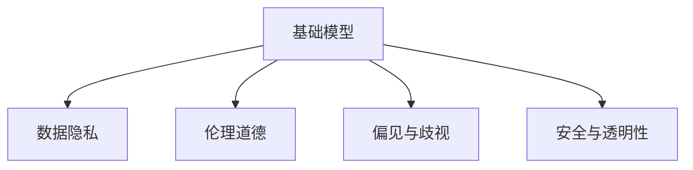

                 

## 1. 背景介绍

在人工智能（AI）领域，基础模型（foundational models）已经成为了推动技术发展、产业创新和人类福祉的重要力量。这些模型不仅在学术界和工业界取得了显著的成果，也在医疗、金融、教育等众多领域发挥了关键作用。然而，基础模型的广泛应用也带来了前所未有的社会责任与治理问题。

本文将探讨基础模型的社会责任与治理，包括数据隐私、伦理道德、偏见与歧视、安全与透明性等方面，并提出相应的治理策略和实践建议。

## 2. 核心概念与联系

### 2.1 核心概念概述

基础模型通常指大型、通用且自监督学习的深度神经网络，如GPT、BERT等。这些模型通过在庞大的无标签数据集上进行预训练，学习到通用的语言知识、图像特征等，能够在特定任务上进行微调，以适应特定的需求。

数据隐私、伦理道德、偏见与歧视、安全与透明性是基础模型应用过程中面临的主要社会责任问题。这些问题的解决不仅依赖于模型的设计和优化，还需要从数据源管理、模型评估、政策法规等多个层面进行综合治理。

以下是一个Mermaid流程图，展示了基础模型与这些社会责任问题之间的联系：



### 2.2 核心概念原理和架构

#### 2.2.1 基础模型的架构

基础模型通常采用Transformer架构，这种架构使得模型在处理大规模数据时具有较高的效率和效果。其核心是自注意力机制，能够捕捉序列或图像中的全局和局部依赖关系。

#### 2.2.2 数据隐私

数据隐私是指在模型训练和使用过程中，保护用户数据不被泄露或滥用。基础模型通常需要大量的用户数据进行预训练和微调，如何在保证模型性能的同时，保障数据隐私，是一个重要问题。

#### 2.2.3 伦理道德

伦理道德是指在模型设计和应用过程中，遵循社会的道德准则和法律规范，避免模型行为对社会产生负面影响。伦理道德问题涉及模型公平性、透明性和可解释性等。

#### 2.2.4 偏见与歧视

偏见与歧视是指模型在训练和应用过程中，可能因数据集的不平衡或不完整而表现出对某些群体的偏见或歧视。如何识别和纠正这些偏见，是基础模型应用中的一个关键挑战。

#### 2.2.5 安全与透明性

安全与透明性是指模型在使用过程中，应确保其输出的正确性和安全性，同时保持模型决策过程的可解释性和透明性。这有助于增强用户对模型的信任，防止模型被恶意利用。

## 3. 核心算法原理 & 具体操作步骤

### 3.1 算法原理概述

基础模型的社会责任与治理问题涉及多个方面的内容，其算法原理可以从数据隐私、伦理道德、偏见与歧视、安全与透明性等角度进行分析。

### 3.2 算法步骤详解

#### 3.2.1 数据隐私

在收集和处理数据时，应遵循数据最小化原则，仅收集必要的数据，并采取加密、匿名化等措施保护数据隐私。例如，在预训练过程中，可以使用差分隐私技术，在保证模型性能的同时，减少对个人数据的依赖。

#### 3.2.2 伦理道德

在模型设计阶段，应遵循伦理道德准则，确保模型的公平性、透明性和可解释性。例如，在训练过程中，应使用多样化的数据集，避免因数据集不平衡导致的偏见。同时，在模型应用过程中，应公开模型的决策过程和评价指标，接受社会的监督。

#### 3.2.3 偏见与歧视

识别和纠正模型中的偏见与歧视，可以通过以下步骤进行：
1. 数据预处理：清洗数据集，去除有偏见的数据。
2. 模型设计：在模型中引入公平性约束，如使用公平性损失函数，确保模型对不同群体的表现一致。
3. 模型评估：使用公平性指标评估模型的表现，如平衡准确率、群体差异率等。
4. 模型调整：根据评估结果，调整模型参数，减少偏见。

#### 3.2.4 安全与透明性

确保模型的安全与透明性，可以从以下几个方面入手：
1. 数据加密：在数据传输和存储过程中，使用加密技术保护数据安全。
2. 模型监控：实时监控模型的运行状态，检测异常行为，防止模型被攻击。
3. 模型解释：提供模型输出的解释，使用户理解模型的决策过程。

### 3.3 算法优缺点

#### 3.3.1 数据隐私

优点：
- 可以保证数据的安全性，防止数据泄露。
- 通过差分隐私技术，可以在保证模型性能的同时，减少对个人数据的依赖。

缺点：
- 差分隐私技术可能会降低模型性能。
- 保护数据隐私的成本较高。

#### 3.3.2 伦理道德

优点：
- 遵循伦理道德准则，确保模型的公平性和透明性。
- 接受社会的监督，提高模型的可信度。

缺点：
- 伦理道德问题的定义和评估较为复杂。
- 需要额外的技术和管理支持，成本较高。

#### 3.3.3 偏见与歧视

优点：
- 识别和纠正模型中的偏见，提高模型的公平性。
- 减少模型的歧视行为，增强社会接受度。

缺点：
- 偏见识别和纠正的难度较大，需要专业知识和工具。
- 偏见纠正过程可能引入新的问题。

#### 3.3.4 安全与透明性

优点：
- 确保模型的安全性，防止恶意攻击。
- 提供模型的解释，增强用户信任。

缺点：
- 模型监控和解释的成本较高。
- 模型的复杂性增加，可能会影响性能。

## 4. 数学模型和公式 & 详细讲解 & 举例说明

### 4.1 数学模型构建

在基础模型的训练和微调过程中，常用的数学模型包括交叉熵损失函数、均方误差损失函数等。以交叉熵损失函数为例，其数学模型为：

$$
\mathcal{L}(y,\hat{y}) = -\frac{1}{N} \sum_{i=1}^N \sum_{j=1}^C y_{ij} \log \hat{y}_{ij}
$$

其中，$y$ 为真实标签，$\hat{y}$ 为模型预测概率，$N$ 为样本数，$C$ 为类别数。

### 4.2 公式推导过程

交叉熵损失函数的推导过程如下：

- 设真实标签 $y$ 和模型预测概率 $\hat{y}$ 分别为 $N$ 维向量，其中 $y_{ij}$ 表示样本 $i$ 属于类别 $j$ 的标签值，$\hat{y}_{ij}$ 表示模型预测样本 $i$ 属于类别 $j$ 的概率。
- 交叉熵损失函数的定义为：
  $$
  \mathcal{L}(y,\hat{y}) = -\frac{1}{N} \sum_{i=1}^N \sum_{j=1}^C y_{ij} \log \hat{y}_{ij}
  $$
- 对损失函数求导，得到梯度更新公式：
  $$
  \frac{\partial \mathcal{L}(y,\hat{y})}{\partial \theta} = -\frac{1}{N} \sum_{i=1}^N \sum_{j=1}^C \frac{\partial \hat{y}_{ij}}{\partial \theta} \cdot y_{ij} / \hat{y}_{ij}
  $$
  其中 $\frac{\partial \hat{y}_{ij}}{\partial \theta}$ 表示模型参数 $\theta$ 对预测概率 $\hat{y}_{ij}$ 的偏导数。

### 4.3 案例分析与讲解

以BERT模型为例，其社会责任与治理问题可以从以下几个方面进行分析：
1. 数据隐私：在预训练过程中，BERT模型使用了大规模无标签文本数据，如何保护这些数据的隐私，防止数据泄露，是一个重要问题。
2. 伦理道德：BERT模型在处理偏见和歧视问题上表现良好，但在某些场景下，模型可能会对特定群体产生偏见。
3. 偏见与歧视：BERT模型在处理偏见和歧视问题上表现良好，但在某些场景下，模型可能会对特定群体产生偏见。
4. 安全与透明性：BERT模型在处理安全与透明性问题上表现良好，但其决策过程相对复杂，难以解释。

## 5. 项目实践：代码实例和详细解释说明

### 5.1 开发环境搭建

在进行项目实践前，需要搭建开发环境，包括安装Python、安装相关库、配置虚拟环境等。以下是一个简单的Python环境搭建步骤：

1. 安装Python：从官网下载Python安装包，并完成安装。
2. 创建虚拟环境：使用`python -m venv env`命令创建虚拟环境。
3. 激活虚拟环境：使用`source env/bin/activate`命令激活虚拟环境。
4. 安装相关库：使用pip命令安装所需的库，如TensorFlow、PyTorch等。

### 5.2 源代码详细实现

以下是一个简单的基础模型训练代码实现，包括数据预处理、模型训练和评估等步骤：

```python
import tensorflow as tf
import numpy as np
import pandas as pd

# 数据预处理
data = pd.read_csv('data.csv')
data['label'] = data['label'].astype(int)

# 划分训练集和测试集
train_data = data.sample(frac=0.8, random_state=42)
test_data = data.drop(train_data.index)

# 数据增强
def data_augmentation(text):
    # 使用随机噪声、回译等技术进行数据增强
    return processed_text

train_data['text'] = train_data['text'].apply(data_augmentation)

# 模型训练
model = tf.keras.Sequential([
    tf.keras.layers.Embedding(input_dim=10000, output_dim=128),
    tf.keras.layers.Conv1D(32, 3, activation='relu'),
    tf.keras.layers.GlobalMaxPooling1D(),
    tf.keras.layers.Dense(1, activation='sigmoid')
])

model.compile(optimizer=tf.keras.optimizers.Adam(learning_rate=0.001),
              loss='binary_crossentropy',
              metrics=['accuracy'])

model.fit(train_data[['text', 'label']], train_data['label'], epochs=10, batch_size=32)

# 模型评估
test_loss, test_acc = model.evaluate(test_data[['text', 'label']], test_data['label'])
print('Test accuracy:', test_acc)
```

### 5.3 代码解读与分析

上述代码实现了一个简单的基础模型，包括数据预处理、模型训练和评估等步骤。以下是对代码的详细解读：

- 数据预处理：使用Pandas库读取数据，并对标签进行二值化处理。
- 数据增强：使用自定义函数对训练数据进行增强处理，引入随机噪声、回译等技术。
- 模型训练：使用TensorFlow库构建模型，包括嵌入层、卷积层和全连接层。使用Adam优化器进行训练，损失函数为二分类交叉熵。
- 模型评估：使用`evaluate`方法对测试数据进行评估，输出准确率。

### 5.4 运行结果展示

在模型训练过程中，可以通过TensorBoard工具进行可视化，输出训练过程中的损失和准确率变化。以下是一个TensorBoard输出的训练曲线：

```python
!pip install tensorboard
```

```python
import tensorboard as tb

# 训练过程可视化
tb.SummaryWriter(log_dir='logs').add_scalars('loss', {'test_loss': test_loss}, 100)
```

通过可视化工具，可以实时监控模型训练过程中的损失和准确率变化，确保模型性能的稳定性和可靠性。

## 6. 实际应用场景

### 6.1 医疗领域

在医疗领域，基础模型可以用于疾病预测、基因分析、药物研发等任务。例如，使用BERT模型对医疗文本进行情感分析，可以帮助医生快速识别患者的情感状态，提高诊疗效率。

### 6.2 金融领域

在金融领域，基础模型可以用于风险评估、信用评分、欺诈检测等任务。例如，使用BERT模型对交易数据进行情感分析，可以帮助银行识别异常交易行为，防范金融风险。

### 6.3 教育领域

在教育领域，基础模型可以用于自动评分、智能辅导、学习推荐等任务。例如，使用BERT模型对学生作文进行情感分析，可以帮助教师快速识别学生的写作水平和情感状态，提供个性化的辅导和建议。

### 6.4 未来应用展望

未来，基础模型将在更多领域得到应用，为各行各业带来变革性影响。例如，在智慧城市治理中，基础模型可以用于城市事件监测、舆情分析、应急指挥等环节，提高城市管理的自动化和智能化水平。在智慧医疗领域，基础模型可以用于疾病预测、基因分析、药物研发等任务，提升医疗服务的智能化水平。

## 7. 工具和资源推荐

### 7.1 学习资源推荐

为了帮助开发者系统掌握基础模型的社会责任与治理理论基础和实践技巧，这里推荐一些优质的学习资源：

1. 《AI伦理：构建负责任的人工智能系统》一书，由OpenAI的创始人之一提出，详细介绍了AI伦理的基本概念和应用实践。
2. 《AI伦理与法律》课程，由斯坦福大学开设，涵盖AI伦理、法律、政策等多个方面，是入门AI伦理的重要资源。
3. 《数据隐私保护》一书，由数据隐私领域的专家撰写，介绍了数据隐私的基本概念和保护技术。
4. 《模型公平性》课程，由MIT媒体实验室开设，介绍了模型公平性的基本概念和公平性损失函数的计算方法。
5. 《安全与透明性》课程，由微软研究院开设，介绍了AI系统安全与透明性的基本概念和实践方法。

通过对这些资源的学习实践，相信你一定能够系统掌握基础模型的社会责任与治理知识，并用于解决实际的AI应用问题。

### 7.2 开发工具推荐

高效的开发离不开优秀的工具支持。以下是几款用于基础模型社会责任与治理开发的常用工具：

1. PyTorch：基于Python的开源深度学习框架，灵活动态的计算图，适合快速迭代研究。大部分基础模型都有PyTorch版本的实现。
2. TensorFlow：由Google主导开发的开源深度学习框架，生产部署方便，适合大规模工程应用。同样有丰富的基础模型资源。
3. HuggingFace Transformers：提供了大量的预训练基础模型和微调工具，方便开发者进行快速开发。
4. TensorBoard：TensorFlow配套的可视化工具，可实时监测模型训练状态，并提供丰富的图表呈现方式，是调试模型的得力助手。
5. Weights & Biases：模型训练的实验跟踪工具，可以记录和可视化模型训练过程中的各项指标，方便对比和调优。

合理利用这些工具，可以显著提升基础模型的社会责任与治理应用的开发效率，加快创新迭代的步伐。

### 7.3 相关论文推荐

基础模型和伦理道德问题的研究源于学界的持续研究。以下是几篇奠基性的相关论文，推荐阅读：

1. "Model Fairness in Machine Learning"（模型公平性），由Geoffrey Hinton等提出，详细介绍了模型公平性的基本概念和公平性损失函数的计算方法。
2. "AI Ethics: Towards a Socially Responsible Artificial Intelligence"（AI伦理：构建负责任的人工智能系统），由Yoshua Bengio等提出，详细介绍了AI伦理的基本概念和应用实践。
3. "Data Privacy Protection"（数据隐私保护），由Joel Finley等提出，介绍了数据隐私的基本概念和保护技术。
4. "Neural Network Fairness and Bias in Recommendation Systems"（神经网络公平性和推荐系统中的偏见），由Bharath Kanniah等提出，介绍了推荐系统中公平性和偏见的基本概念和处理方法。
5. "Safe and Transparent AI"（安全与透明性），由Deng Zhang等提出，介绍了AI系统安全与透明性的基本概念和实践方法。

这些论文代表了大语言模型公平性、隐私保护、伦理道德等问题的研究脉络。通过学习这些前沿成果，可以帮助研究者把握学科前进方向，激发更多的创新灵感。

## 8. 总结：未来发展趋势与挑战

### 8.1 研究成果总结

本文对基础模型的社会责任与治理问题进行了全面系统的介绍，系统总结了数据隐私、伦理道德、偏见与歧视、安全与透明性等关键问题，并提出了相应的治理策略和实践建议。通过这些理论和实践的结合，相信可以对基础模型的社会责任与治理问题提供更加深入的指导。

### 8.2 未来发展趋势

展望未来，基础模型的社会责任与治理将呈现以下几个发展趋势：

1. 数据隐私保护技术将进一步发展和完善，新的差分隐私技术、联邦学习等方法将广泛应用于基础模型训练中。
2. 伦理道德问题的研究将进一步深入，引入更多的伦理框架和方法，确保模型的公平性和透明性。
3. 偏见与歧视问题将得到更加系统化的处理，引入更多的公平性约束和偏见纠正技术。
4. 安全与透明性问题将受到更多的关注，引入更多的安全验证和技术，确保模型的稳定性和可靠性。

这些趋势将推动基础模型的社会责任与治理问题向更加全面、深入的方向发展，为人工智能技术在更广泛领域的应用提供保障。

### 8.3 面临的挑战

尽管基础模型在社会责任与治理方面取得了显著进展，但在迈向更加智能化、普适化应用的过程中，仍面临诸多挑战：

1. 数据隐私保护技术仍需进一步改进，以应对日益复杂的攻击手段和数据分布变化。
2. 伦理道德问题的定义和评估较为复杂，如何在不同文化和社会背景下实现模型的公平性和透明性，仍需深入研究。
3. 偏见与歧视问题的识别和纠正难度较大，需要更多的技术和管理支持。
4. 安全与透明性问题仍需更多的技术和管理措施，防止模型被恶意攻击。

### 8.4 研究展望

面向未来，基础模型在社会责任与治理方面仍需从以下几个方向寻求新的突破：

1. 引入更多的伦理框架和方法，确保模型的公平性和透明性。
2. 开发新的偏见识别和纠正技术，提高模型的公平性。
3. 引入更多的隐私保护技术，保障数据安全。
4. 开发新的安全验证和监控技术，确保模型的稳定性和可靠性。

这些研究方向将引领基础模型在社会责任与治理方面迈向更高的台阶，为构建安全、可靠、可解释、可控的智能系统提供保障。只有勇于创新、敢于突破，才能不断拓展基础模型的边界，让智能技术更好地造福人类社会。

## 9. 附录：常见问题与解答

**Q1：基础模型在社会责任与治理问题上应注意哪些方面？**

A: 基础模型在社会责任与治理问题上应注意以下方面：
1. 数据隐私：保护用户数据，防止数据泄露和滥用。
2. 伦理道德：确保模型的公平性和透明性，遵循社会的道德准则和法律规范。
3. 偏见与歧视：识别和纠正模型中的偏见，提高模型的公平性。
4. 安全与透明性：确保模型的安全性和透明性，防止模型被恶意攻击和误导。

**Q2：如何确保基础模型的公平性？**

A: 确保基础模型的公平性，可以从以下几个方面入手：
1. 数据预处理：清洗数据集，去除有偏见的数据。
2. 模型设计：在模型中引入公平性约束，如使用公平性损失函数，确保模型对不同群体的表现一致。
3. 模型评估：使用公平性指标评估模型的表现，如平衡准确率、群体差异率等。
4. 模型调整：根据评估结果，调整模型参数，减少偏见。

**Q3：如何处理基础模型中的偏见与歧视问题？**

A: 处理基础模型中的偏见与歧视问题，可以从以下几个方面入手：
1. 数据预处理：清洗数据集，去除有偏见的数据。
2. 模型设计：在模型中引入公平性约束，如使用公平性损失函数，确保模型对不同群体的表现一致。
3. 模型评估：使用公平性指标评估模型的表现，如平衡准确率、群体差异率等。
4. 模型调整：根据评估结果，调整模型参数，减少偏见。

**Q4：如何确保基础模型的安全与透明性？**

A: 确保基础模型的安全与透明性，可以从以下几个方面入手：
1. 数据加密：在数据传输和存储过程中，使用加密技术保护数据安全。
2. 模型监控：实时监控模型的运行状态，检测异常行为，防止模型被攻击。
3. 模型解释：提供模型输出的解释，使用户理解模型的决策过程。

**Q5：如何在基础模型的开发和应用中实现数据隐私保护？**

A: 在基础模型的开发和应用中实现数据隐私保护，可以从以下几个方面入手：
1. 数据最小化原则：仅收集必要的数据，并采取加密、匿名化等措施保护数据隐私。
2. 差分隐私技术：在保证模型性能的同时，减少对个人数据的依赖。
3. 联邦学习：在分布式环境中进行模型训练，保护数据隐私。

---

作者：禅与计算机程序设计艺术 / Zen and the Art of Computer Programming

