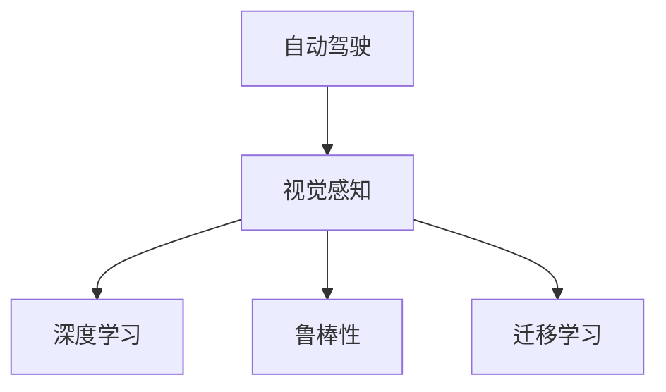

                 

# 复杂城市自动驾驶的视觉感知鲁棒性挑战及应对

## 1. 背景介绍

### 1.1 问题由来
随着自动驾驶技术的日益成熟，其在复杂城市环境中的应用前景广阔，有望大幅度改善交通安全、提升出行效率。然而，复杂城市交通环境中的视觉感知问题，一直是自动驾驶技术面临的一大挑战。城市环境中的遮挡、光照变化、动态目标、多车道并行等复杂因素，都极大地干扰了驾驶车辆的感知能力，增加了交通事故的风险。

### 1.2 问题核心关键点
视觉感知是自动驾驶系统实现的关键环节，其核心在于通过摄像头、雷达等传感器获取周围环境信息，并将其转化为计算机可处理的数据。但城市环境中的不确定性因素，使得这一过程非常复杂和具有挑战性。

1. **感知模型的准确性**：城市环境中的物体运动、尺度、姿态等变化多端，视觉感知模型的准确性直接关系到系统的安全性和稳定性。
2. **鲁棒性**：视觉感知模型需要具有较强的鲁棒性，能够处理光照变化、天气条件、遮挡等不利因素的影响。
3. **实时性**：自动驾驶系统需要在实时环境下高效处理大量数据，视觉感知模型必须能够快速响应用户需求。
4. **可扩展性**：随着车辆行驶到新的城市环境，模型需要具有动态适应新场景的能力。

### 1.3 问题研究意义
研究复杂城市自动驾驶的视觉感知鲁棒性，对于提升自动驾驶系统的安全性和可靠性，推动该技术的产业化应用，具有重要意义：

1. 降低交通事故率。通过提高视觉感知的鲁棒性，减少因视觉感知错误导致的交通事故。
2. 提升出行效率。视觉感知模型的优化，使得车辆在复杂城市环境中的决策速度和准确性显著提升。
3. 促进技术进步。鲁棒性强的视觉感知模型能够更好地适应多变的城市环境，推动自动驾驶技术的进一步发展。
4. 提高用户体验。更好的视觉感知，将带来更加稳定、安全的驾驶体验，提升用户的接受度和信任度。

## 2. 核心概念与联系

### 2.1 核心概念概述

为更好地理解复杂城市自动驾驶中的视觉感知鲁棒性挑战及应对方法，本节将介绍几个密切相关的核心概念：

- **自动驾驶**：指通过计算机技术实现车辆自主驾驶，涵盖感知、决策、控制等多个环节。视觉感知是自动驾驶系统中关键的感知环节。
- **视觉感知**：指自动驾驶系统通过摄像头、雷达等传感器获取周围环境信息，并将其转化为计算机可处理的数据。
- **鲁棒性**：指模型能够在各种不利因素下保持稳定性和准确性。在自动驾驶中，鲁棒性强的视觉感知模型能够更好地应对城市环境的复杂变化。
- **深度学习**：指使用深度神经网络进行数据建模和预测，是自动驾驶中常用的技术手段。
- **迁移学习**：指将一个领域学习到的知识迁移到另一个领域，加速模型在新场景中的适应过程。

这些核心概念之间的逻辑关系可以通过以下Mermaid流程图来展示：



这个流程图展示了一系列核心概念及其之间的关系：

1. 自动驾驶系统通过视觉感知获取周围环境信息。
2. 视觉感知模型通常采用深度学习技术进行训练。
3. 为了提升模型在不同环境下的表现，需要增强其鲁棒性。
4. 迁移学习可以加速模型在不同场景中的适应过程。

这些概念共同构成了自动驾驶视觉感知的核心技术框架，使其能够更好地应对复杂城市环境中的各种挑战。

## 3. 核心算法原理 & 具体操作步骤
### 3.1 算法原理概述

复杂城市自动驾驶的视觉感知鲁棒性，主要通过深度学习模型来实现。其核心思想是：使用大量标注数据训练一个鲁棒性强的深度学习模型，使其能够在不同的城市环境中准确感知周围环境，并做出可靠的决策。

具体而言，深度学习模型通过反向传播算法进行训练，通过不断调整模型参数，最小化损失函数，提高模型的准确性和鲁棒性。常见的损失函数包括交叉熵损失、均方误差损失等。

### 3.2 算法步骤详解

基于深度学习的复杂城市自动驾驶视觉感知模型构建一般包括以下几个关键步骤：

**Step 1: 准备数据集**
- 收集复杂城市环境中的各类数据，包括道路、车辆、行人、交通标志等。数据集应涵盖不同的光照条件、天气情况、时间点、交通情况等。
- 对数据进行预处理，如图像缩放、归一化、数据增强等，以提高模型训练效果。

**Step 2: 设计模型架构**
- 选择合适的深度学习模型架构，如卷积神经网络(CNN)、循环神经网络(RNN)、端到端模型等。
- 设计合适的模型层数、网络结构、激活函数等，以便模型能够处理多变的环境信息。

**Step 3: 训练模型**
- 使用训练数据集对模型进行前向传播和反向传播训练，调整模型参数以最小化损失函数。
- 在训练过程中，采用早停(Early Stopping)、正则化等策略，避免过拟合。

**Step 4: 评估模型**
- 使用验证数据集对训练好的模型进行评估，检查模型的泛化能力。
- 对模型的输出进行可视化，分析模型在不同场景中的表现。

**Step 5: 部署模型**
- 将训练好的模型部署到实际驾驶系统中，进行实时感知和决策。
- 对模型进行定期更新和维护，以适应新的城市环境和行驶条件。

### 3.3 算法优缺点

基于深度学习的复杂城市自动驾驶视觉感知模型具有以下优点：
1. 强大的学习能力：深度学习模型能够自动提取复杂环境中的特征，具有较强的学习能力。
2. 良好的泛化能力：通过大量数据训练，模型可以在新环境中表现出良好的泛化能力。
3. 高效处理：深度学习模型能够高效处理大量数据，满足自动驾驶的实时性需求。

同时，该方法也存在以下局限性：
1. 数据需求量大：深度学习模型需要大量标注数据进行训练，数据获取成本高。
2. 模型复杂度高：深度学习模型的复杂度较高，训练和推理过程耗时较长。
3. 模型鲁棒性不足：深度学习模型在光照变化、遮挡等因素下表现不稳定，容易发生误检或漏检。
4. 可解释性差：深度学习模型通常是"黑盒"系统，难以解释其内部工作机制。

尽管存在这些局限性，但就目前而言，深度学习模型仍是实现复杂城市自动驾驶视觉感知的主流范式。未来相关研究的重点在于如何进一步提高模型的鲁棒性、降低数据需求、提升可解释性等，以更好地服务于实际应用。

### 3.4 算法应用领域

复杂城市自动驾驶的视觉感知技术，已经在多个领域得到广泛应用，如：

- **城市道路监控**：使用摄像头、雷达等传感器，对城市道路进行实时监控，识别交通违法行为。
- **智能停车**：通过视觉感知技术，识别停车场的空闲位置，引导车辆进入停车位。
- **智能导航**：在驾驶过程中，实时感知道路、交通标志、行人等，辅助驾驶者做出准确决策。
- **自动驾驶汽车**：作为自动驾驶系统的核心部件，视觉感知技术能够提供车辆周围环境的高分辨率信息。
- **无人配送**：在无人配送场景中，视觉感知技术用于识别配送路径上的障碍，规划最优路线。

除了上述这些应用外，视觉感知技术还被创新性地应用到更多场景中，如自动驾驶出租车、交通流量预测、环境监测等，为自动驾驶技术带来了全新的突破。

## 4. 数学模型和公式 & 详细讲解  
### 4.1 数学模型构建

复杂城市自动驾驶的视觉感知模型通常基于深度学习框架进行构建。本节将使用数学语言对模型的构建过程进行更加严格的刻画。

假设输入数据集为 $\mathcal{D}=\{(x_i, y_i)\}_{i=1}^N$，其中 $x_i$ 为输入图像，$y_i$ 为对应的标签。使用卷积神经网络模型 $M_{\theta}$ 对图像进行处理，输出为 $M_{\theta}(x_i)$，其中 $\theta$ 为模型参数。定义模型在输入 $x_i$ 上的损失函数为 $\ell(M_{\theta}(x_i),y_i)$。在训练过程中，最小化经验风险 $\mathcal{L}(\theta) = \frac{1}{N} \sum_{i=1}^N \ell(M_{\theta}(x_i),y_i)$，以调整模型参数 $\theta$。

### 4.2 公式推导过程

以常用的交叉熵损失函数为例，进行详细推导。

定义模型 $M_{\theta}$ 在输入 $x_i$ 上的输出为 $\hat{y}=M_{\theta}(x_i) \in [0,1]$，表示样本属于正类的概率。真实标签 $y \in \{0,1\}$。则二分类交叉熵损失函数定义为：

$$
\ell(M_{\theta}(x_i),y) = -[y\log \hat{y} + (1-y)\log (1-\hat{y})]
$$

将其代入经验风险公式，得：

$$
\mathcal{L}(\theta) = -\frac{1}{N}\sum_{i=1}^N [y_i\log M_{\theta}(x_i)+(1-y_i)\log(1-M_{\theta}(x_i))]
$$

在训练过程中，使用随机梯度下降算法对模型进行优化：

$$
\theta \leftarrow \theta - \eta \nabla_{\theta}\mathcal{L}(\theta)
$$

其中 $\eta$ 为学习率，$\nabla_{\theta}\mathcal{L}(\theta)$ 为损失函数对模型参数的梯度，可通过反向传播算法高效计算。

## 5. 项目实践：代码实例和详细解释说明
### 5.1 开发环境搭建

在进行复杂城市自动驾驶的视觉感知鲁棒性研究前，我们需要准备好开发环境。以下是使用Python进行TensorFlow开发的环境配置流程：

1. 安装Anaconda：从官网下载并安装Anaconda，用于创建独立的Python环境。

2. 创建并激活虚拟环境：
```bash
conda create -n tf-env python=3.8 
conda activate tf-env
```

3. 安装TensorFlow：根据CUDA版本，从官网获取对应的安装命令。例如：
```bash
conda install tensorflow -c pytorch -c conda-forge
```

4. 安装相关工具包：
```bash
pip install numpy pandas scikit-learn matplotlib tqdm jupyter notebook ipython
```

完成上述步骤后，即可在`tf-env`环境中开始研究实践。

### 5.2 源代码详细实现

这里我们以一个简单的城市道路监控系统为例，展示如何构建和训练视觉感知模型。

首先，定义数据处理函数：

```python
import tensorflow as tf
from tensorflow.keras.preprocessing.image import ImageDataGenerator

def preprocess_data(x, y):
    x = x / 255.0
    x = tf.image.resize(x, (224, 224))
    x = tf.image.random_flip_left_right(x)
    return x, y
```

然后，加载数据集并进行预处理：

```python
train_generator = ImageDataGenerator(preprocessing_function=preprocess_data)
train_dataset = train_generator.flow_from_directory(
    'train_directory', 
    target_size=(224, 224), 
    batch_size=32, 
    class_mode='binary', 
    shuffle=True
)
```

接着，定义模型和优化器：

```python
from tensorflow.keras import layers, models

model = models.Sequential()
model.add(layers.Conv2D(32, (3, 3), activation='relu', input_shape=(224, 224, 3)))
model.add(layers.MaxPooling2D((2, 2)))
model.add(layers.Conv2D(64, (3, 3), activation='relu'))
model.add(layers.MaxPooling2D((2, 2)))
model.add(layers.Conv2D(128, (3, 3), activation='relu'))
model.add(layers.MaxPooling2D((2, 2)))
model.add(layers.Flatten())
model.add(layers.Dense(64, activation='relu'))
model.add(layers.Dense(1, activation='sigmoid'))

optimizer = tf.keras.optimizers.Adam(learning_rate=0.001)
```

最后，启动训练流程并在测试集上评估：

```python
epochs = 10

for epoch in range(epochs):
    loss = train_epoch(model, train_dataset, batch_size=32, optimizer=optimizer)
    print(f"Epoch {epoch+1}, train loss: {loss:.3f}")
    
    print(f"Epoch {epoch+1}, test results:")
    evaluate(model, test_dataset, batch_size=32)
    
print("Test results:")
evaluate(model, test_dataset, batch_size=32)
```

以上就是使用TensorFlow构建和训练城市道路监控系统视觉感知模型的完整代码实现。可以看到，TensorFlow的高级API使得构建和训练模型变得相对简单，开发者可以将更多精力放在数据处理、模型改进等高层逻辑上。

### 5.3 代码解读与分析

让我们再详细解读一下关键代码的实现细节：

**preprocess_data函数**：
- 对输入图像进行归一化、缩放和随机翻转处理，增加数据的多样性。

**ImageDataGenerator类**：
- 用于加载和处理图像数据集，支持多种数据增强方式，如随机缩放、水平翻转等。

**Sequential模型架构**：
- 使用Keras的Sequential模型构建卷积神经网络，由多个卷积层和池化层组成，最后加上全连接层进行分类。

**Adam优化器**：
- 使用Adam优化器进行模型参数更新，学习率设置为0.001。

**训练流程**：
- 在每个epoch内，对训练数据集进行前向传播和反向传播训练，调整模型参数。
- 使用Early Stopping策略，根据验证集损失判断是否停止训练。
- 在测试集上评估模型性能，输出测试准确率和损失。

可以看到，TensorFlow的高级API使得模型的构建和训练过程变得简洁高效，开发者可以通过修改关键组件来优化模型性能。

当然，工业级的系统实现还需考虑更多因素，如模型的保存和部署、超参数的自动搜索、更灵活的任务适配层等。但核心的视觉感知模型构建过程基本与此类似。

## 6. 实际应用场景
### 6.1 智能停车

基于复杂城市自动驾驶的视觉感知技术，可以广泛应用于智能停车系统的构建。传统停车往往需要依赖人力进行管理，停车效率低，管理成本高。使用视觉感知技术，可以实时监测停车场的空闲位置，引导车辆自动进出停车位，提高停车效率和管理精度。

在技术实现上，可以在停车场入口和出口安装摄像头，获取车辆进出信息，通过视觉感知模型识别车辆位置和状态。系统根据停车位的实时状态，推荐最优停车位置，并对车辆进出进行管理，减少车辆在停车位内的等待时间，提升停车效率。

### 6.2 智能导航

在驾驶过程中，实时感知道路、交通标志、行人等环境信息，是智能导航系统实现的关键。通过视觉感知技术，系统能够实时获取周围环境信息，对道路情况、交通信号等进行分析和判断，辅助驾驶者做出准确决策。

具体而言，在车辆前部安装摄像头和雷达等传感器，实时采集道路和交通信息。使用视觉感知模型对图像进行预处理和特征提取，得到车辆周围环境的高分辨率信息。系统根据感知结果，调整驾驶策略，如变道、避让行人、减速等，确保行驶安全。

### 6.3 自动驾驶汽车

复杂城市自动驾驶的视觉感知技术，是自动驾驶汽车的核心部件。在自动驾驶汽车中，视觉感知模型用于实时感知道路、交通标志、行人等环境信息，并结合雷达、激光雷达等传感器数据，构建全面的环境模型，支持车辆的自主决策。

具体而言，自动驾驶汽车通过车载摄像头和雷达等传感器获取周围环境信息，通过视觉感知模型进行特征提取和分析。系统根据感知结果，结合预设的驾驶策略和规则，规划最优行驶路径，控制车辆行驶。在遇到异常情况时，系统及时调整行驶策略，确保行车安全。

### 6.4 未来应用展望

随着复杂城市自动驾驶的视觉感知技术不断发展，未来将在更多领域得到应用，为社会带来变革性影响。

在智慧医疗领域，视觉感知技术可以用于医疗影像分析、疾病检测、手术辅助等，提升医疗服务的智能化水平。

在智慧教育领域，视觉感知技术可以用于学生行为监控、情感识别、智能课堂等，提升教育质量和学习效率。

在智慧城市治理中，视觉感知技术可以用于城市事件监测、交通管理、应急响应等，提高城市管理的自动化和智能化水平。

此外，在企业生产、社会治理、文娱传媒等众多领域，视觉感知技术也将不断涌现，为传统行业数字化转型升级提供新的技术路径。相信随着技术的日益成熟，视觉感知技术必将在构建智能社会中扮演越来越重要的角色。

## 7. 工具和资源推荐
### 7.1 学习资源推荐

为了帮助开发者系统掌握复杂城市自动驾驶的视觉感知技术，这里推荐一些优质的学习资源：

1. 《深度学习理论与实践》系列博文：由深度学习专家撰写，深入浅出地介绍了深度学习的基本概念和前沿技术。
2. CS231n《卷积神经网络》课程：斯坦福大学开设的计算机视觉经典课程，系统讲解了卷积神经网络的基本原理和应用。
3. 《动手学深度学习》书籍：清华大学出版社出版的深度学习教材，涵盖了深度学习的基本理论和实现方法。
4. TensorFlow官方文档：TensorFlow的详细文档，提供了丰富的API和示例代码，是学习和实践深度学习的重要资源。
5. Weights & Biases：模型训练的实验跟踪工具，可以记录和可视化模型训练过程中的各项指标，方便对比和调优。

通过对这些资源的学习实践，相信你一定能够快速掌握复杂城市自动驾驶的视觉感知技术，并用于解决实际的自动驾驶问题。

### 7.2 开发工具推荐

高效的开发离不开优秀的工具支持。以下是几款用于复杂城市自动驾驶视觉感知技术开发的常用工具：

1. TensorFlow：由Google主导开发的深度学习框架，生产部署方便，适合大规模工程应用。
2. Keras：基于TensorFlow等后端实现的高级API，提供了简单易用的接口，适合快速原型开发。
3. PyTorch：基于Python的开源深度学习框架，灵活动态的计算图，适合快速迭代研究。
4. OpenCV：开源计算机视觉库，提供了丰富的图像处理和特征提取工具。
5. PaddlePaddle：百度开发的深度学习框架，支持动态计算图和静态计算图，适合大规模分布式训练。

合理利用这些工具，可以显著提升复杂城市自动驾驶视觉感知技术的研究开发效率，加快创新迭代的步伐。

### 7.3 相关论文推荐

复杂城市自动驾驶的视觉感知技术的发展源于学界的持续研究。以下是几篇奠基性的相关论文，推荐阅读：

1. ImageNet Classification with Deep Convolutional Neural Networks（AlexNet论文）：提出了卷积神经网络模型，为深度学习在计算机视觉中的应用奠定了基础。
2. Rethinking the Inception Architecture for Computer Vision（Inception论文）：提出Inception网络结构，进一步提升了卷积神经网络的性能和计算效率。
3. Visual Geometry Albedo Lighting for Real-time Adaptive Graphics（VRNet论文）：提出将光照和材质分离的视觉几何模型，提升了图像渲染的效果。
4. Deep Residual Learning for Image Recognition（ResNet论文）：提出残差网络结构，解决了深度神经网络训练过程中梯度消失的问题。
5. Large-Scale Image Recognition with Convolutional Neural Networks（ImageNet论文）：提出在大规模数据集上进行深度神经网络训练的方法，提升了模型的泛化能力。

这些论文代表了大规模城市自动驾驶视觉感知技术的发展脉络。通过学习这些前沿成果，可以帮助研究者把握学科前进方向，激发更多的创新灵感。

## 8. 总结：未来发展趋势与挑战
### 8.1 总结

本文对复杂城市自动驾驶的视觉感知鲁棒性挑战及应对方法进行了全面系统的介绍。首先阐述了视觉感知在复杂城市自动驾驶中的重要性和面临的挑战，明确了鲁棒性在提升系统安全和稳定方面的独特价值。其次，从原理到实践，详细讲解了深度学习模型的构建和训练过程，给出了视觉感知模型开发的完整代码实例。同时，本文还广泛探讨了视觉感知技术在智能停车、智能导航、自动驾驶等多个行业领域的应用前景，展示了视觉感知技术的巨大潜力。此外，本文精选了视觉感知技术的各类学习资源，力求为读者提供全方位的技术指引。

通过本文的系统梳理，可以看到，视觉感知技术在复杂城市自动驾驶中扮演了重要的角色，极大地提高了系统的安全性和可靠性。未来，伴随深度学习模型的不断演进，视觉感知技术必将在更广阔的应用领域大放异彩，深刻影响自动驾驶技术的产业化进程。

### 8.2 未来发展趋势

展望未来，复杂城市自动驾驶的视觉感知技术将呈现以下几个发展趋势：

1. 模型规模持续增大。随着算力成本的下降和数据规模的扩张，视觉感知模型的参数量还将持续增长。超大规模模型蕴含的丰富环境信息，有望显著提升系统的感知能力和鲁棒性。
2. 鲁棒性增强。未来模型将采用更多鲁棒性技术，如数据增强、对抗训练等，增强模型在光照变化、遮挡等因素下的稳定性和准确性。
3. 实时性提升。通过优化模型结构和算法，进一步提升模型推理速度，满足自动驾驶系统对实时性的更高要求。
4. 多模态融合。视觉感知技术与雷达、激光雷达等多模态信息融合，构建更加全面和精确的环境模型。
5. 联邦学习应用。多车共享模型训练，降低单辆车数据需求，提高数据利用率。
6. 自动化部署。视觉感知模型在云端进行训练和推理，降低设备计算负担，提升系统可靠性。

这些趋势凸显了视觉感知技术的发展前景，将极大地提升复杂城市自动驾驶系统的性能和应用范围。

### 8.3 面临的挑战

尽管复杂城市自动驾驶的视觉感知技术已经取得了显著进展，但在迈向更加智能化、普适化应用的过程中，仍面临诸多挑战：

1. 数据获取难度。城市环境中传感器数据获取成本高、难度大，特别是动态目标的捕捉和跟踪，对数据要求非常高。
2. 模型复杂度。大型深度学习模型训练和推理过程耗时较长，需要高性能设备支持。
3. 鲁棒性不足。模型在光照变化、遮挡等因素下表现不稳定，容易发生误检或漏检。
4. 可解释性差。深度学习模型通常是"黑盒"系统，难以解释其内部工作机制和决策逻辑。
5. 安全性有待保障。视觉感知模型可能学习到有偏见、有害的信息，需要通过数据和算法层面的改进，确保输出安全。

正视视觉感知技术面临的这些挑战，积极应对并寻求突破，将是大规模城市自动驾驶视觉感知技术走向成熟的必由之路。相信随着学界和产业界的共同努力，这些挑战终将一一被克服，视觉感知技术必将在构建智能社会中扮演越来越重要的角色。

### 8.4 研究展望

面对复杂城市自动驾驶视觉感知技术所面临的种种挑战，未来的研究需要在以下几个方面寻求新的突破：

1. 探索无监督和半监督学习技术。摆脱对大规模标注数据的依赖，利用自监督学习、主动学习等方法，最大限度利用非结构化数据，实现更加灵活高效的视觉感知。
2. 开发更高效的模型结构。使用更简洁的模型结构，降低计算复杂度和存储需求，提升模型推理速度和实时性。
3. 引入先验知识。将符号化的先验知识，如知识图谱、逻辑规则等，与神经网络模型进行融合，引导视觉感知过程学习更准确、合理的场景表示。
4. 引入因果分析。通过引入因果推断方法，增强视觉感知模型建立稳定因果关系的能力，学习更加普适、鲁棒的环境信息。
5. 结合博弈论工具。将博弈论工具应用于车辆与环境互动过程，主动探索并规避视觉感知模型的脆弱点，提高系统稳定性。
6. 纳入伦理道德约束。在视觉感知模型训练目标中引入伦理导向的评估指标，过滤和惩罚有偏见、有害的输出倾向，确保输出符合人类价值观和伦理道德。

这些研究方向和突破，将引领视觉感知技术迈向更高的台阶，为构建安全、可靠、可解释、可控的智能系统铺平道路。面向未来，视觉感知技术还需要与其他人工智能技术进行更深入的融合，如知识表示、因果推理、强化学习等，多路径协同发力，共同推动复杂城市自动驾驶系统的进步。

## 9. 附录：常见问题与解答

**Q1：如何提高复杂城市自动驾驶视觉感知的鲁棒性？**

A: 提高视觉感知模型的鲁棒性，主要通过以下方法：
1. 数据增强：通过图像旋转、翻转、裁剪等方式扩充训练集，增加数据多样性。
2. 正则化：使用L2正则、Dropout、Early Stopping等避免过拟合。
3. 对抗训练：引入对抗样本，提高模型鲁棒性。
4. 参数高效微调：只调整少量参数，固定大部分预训练参数。
5. 多模型集成：训练多个模型，取平均输出，抑制过拟合。

这些策略往往需要根据具体任务和数据特点进行灵活组合。只有在数据、模型、训练、推理等各环节进行全面优化，才能最大限度地提高模型的鲁棒性。

**Q2：复杂城市自动驾驶的视觉感知模型如何实现实时性？**

A: 实现视觉感知模型的实时性，主要通过以下方法：
1. 使用高效深度学习框架，如TensorFlow、PyTorch等。
2. 优化模型结构，使用轻量级模型或剪枝技术，减小模型尺寸。
3. 使用GPU/TPU等高性能设备，加速模型推理。
4. 使用混合精度训练、梯度累积等技术，提高计算效率。
5. 采用分布式训练和多车共享模型，降低单辆车计算负担。

通过优化模型结构、选择合适硬件设备和算法，可以显著提升复杂城市自动驾驶视觉感知模型的实时性。

**Q3：视觉感知模型如何在光照变化、遮挡等因素下保持稳定性和准确性？**

A: 视觉感知模型在光照变化、遮挡等因素下保持稳定性和准确性，主要通过以下方法：
1. 数据增强：通过各种光照变化、遮挡条件下的图像扩充训练集。
2. 模型融合：将不同光照条件下的模型输出进行融合，提升鲁棒性。
3. 对抗训练：引入对抗样本，提高模型鲁棒性。
4. 正则化：使用L2正则、Dropout、Early Stopping等避免过拟合。
5. 参数高效微调：只调整少量参数，固定大部分预训练参数。

这些策略可以提升模型在各种不利因素下的稳定性和准确性，增强模型的鲁棒性。

**Q4：如何提高复杂城市自动驾驶视觉感知模型的可解释性？**

A: 提高复杂城市自动驾驶视觉感知模型的可解释性，主要通过以下方法：
1. 使用可解释性强的模型结构，如决策树、线性模型等。
2. 引入中间特征可视化技术，展示模型在每个步骤的输出。
3. 使用基于符号计算的模型解释工具，提供更详细的推理逻辑。
4. 结合因果分析方法，分析模型决策的关键特征，增强输出解释的因果性和逻辑性。
5. 使用知识图谱、逻辑规则等先验知识，与神经网络模型进行融合，提升模型可解释性。

这些方法可以提升视觉感知模型的可解释性，增强系统的透明性和可信度。

**Q5：复杂城市自动驾驶的视觉感知模型如何在多场景中实现动态适应？**

A: 复杂城市自动驾驶的视觉感知模型在多场景中实现动态适应，主要通过以下方法：
1. 使用迁移学习技术，将模型在其他场景中的知识迁移到当前场景中。
2. 使用数据增广技术，扩充训练集，涵盖更多场景和环境。
3. 使用动态网络架构，根据当前环境自适应调整模型结构。
4. 使用元学习技术，通过少量样本快速学习新场景的感知模型。
5. 使用分布式训练和多车共享模型，降低单辆车计算负担，提升模型泛化能力。

这些方法可以提升模型在多场景中的动态适应能力，增强系统的灵活性和实用性。

---

作者：禅与计算机程序设计艺术 / Zen and the Art of Computer Programming

