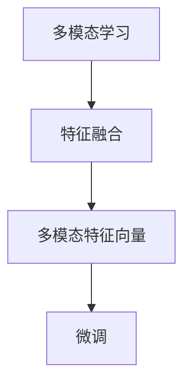

                 

## 1. 背景介绍

在人工智能领域，近几年兴起了一种新的范式——多模态大模型。这种模型结合了文本、图像、音频等多种模态的数据，学习出能够跨模态理解和生成的模型。OpenAI的DALL·E系列模型就是多模态大模型中的翘楚。

### 1.1 问题由来

随着技术的进步，人工智能已经不再局限于单一模态的模型。早期的语音识别模型和图像识别模型都各自独立发展，难以处理复杂的多模态任务。但是，多模态大模型通过联合学习多种模态的数据，大大提升了模型的泛化能力和应用场景。

### 1.2 问题核心关键点

多模态大模型处理不同模态数据的过程大致如下：

1. **特征提取**：将不同模态的数据转化为低维特征向量。
2. **特征融合**：将不同模态的特征向量进行融合，得到多模态特征向量。
3. **多模态学习**：利用多模态特征向量进行监督或无监督学习。
4. **任务适配**：在多模态特征向量上进行微调，适配特定的下游任务。

核心概念包括：
- **多模态学习**：同时处理多种模态数据，学习跨模态的表征。
- **特征融合**：将不同模态的数据转化为统一的表示形式，方便后续处理。
- **多模态特征向量**：融合后的跨模态表示形式，是模型的输入输出。
- **微调**：对多模态特征向量进行微调，适配特定的下游任务。

这些核心概念紧密联系，共同构成多模态大模型的技术框架。

### 1.3 问题研究意义

多模态大模型研究对于拓展人工智能的应用范围，提升模型在复杂场景中的表现，具有重要意义：

1. **拓宽应用场景**：多模态大模型能够处理图像、语音、文本等多种模态数据，可以应用于更多实际应用场景。
2. **提升泛化能力**：多模态数据的多样性增加了模型的泛化能力，可以处理更多复杂的现实问题。
3. **减少标注成本**：利用多模态数据进行预训练，可以大大减少标注数据的成本。
4. **提高模型精度**：多模态数据的联合学习可以提升模型的性能，特别是在少样本学习和跨领域迁移中效果显著。
5. **推动产业发展**：多模态大模型技术可以应用在自动驾驶、智能家居、安防监控等众多领域，为行业带来变革性影响。

## 2. 核心概念与联系

### 2.1 核心概念概述

为了更好地理解多模态大模型，我们首先介绍几个关键概念：

- **多模态学习**：同时处理多种模态数据，学习跨模态的表征。
- **特征融合**：将不同模态的数据转化为统一的表示形式，方便后续处理。
- **多模态特征向量**：融合后的跨模态表示形式，是模型的输入输出。
- **微调**：对多模态特征向量进行微调，适配特定的下游任务。

这些概念之间的逻辑关系可以通过以下Mermaid流程图来展示：



这个流程图展示了多模态大模型的核心逻辑：

1. 通过多模态学习，模型学习不同模态数据之间的关联。
2. 通过特征融合，将不同模态的数据转化为统一的特征向量。
3. 利用多模态特征向量进行微调，适配特定的下游任务。

这些概念共同构成了多模态大模型的技术框架，使其能够在多种应用场景中发挥强大的作用。

## 3. 核心算法原理 & 具体操作步骤
### 3.1 算法原理概述

多模态大模型的核心思想是通过联合学习不同模态的数据，学习出能够跨模态理解和生成的模型。其核心算法主要包括：

1. **特征提取**：通过预训练模型，将不同模态的数据转化为低维特征向量。
2. **特征融合**：将不同模态的特征向量进行融合，得到多模态特征向量。
3. **多模态学习**：利用多模态特征向量进行监督或无监督学习。
4. **任务适配**：在多模态特征向量上进行微调，适配特定的下游任务。

其中，特征提取和特征融合是构建多模态大模型的基础步骤，而多模态学习和任务适配则是模型在不同场景下的具体应用。

### 3.2 算法步骤详解

多模态大模型的实现一般包括以下几个关键步骤：

**Step 1: 准备数据集和模型**

1. **数据集准备**：收集不同模态的数据，如文本、图像、音频等。这些数据需要标注有对应的标签。
2. **模型选择**：选择合适的预训练模型，如ViT、ResNet、Bert等。这些模型可以分别处理不同模态的数据。

**Step 2: 特征提取**

1. **图像特征提取**：使用预训练的图像特征提取模型，如ViT、ResNet等，将图像数据转化为低维特征向量。
2. **文本特征提取**：使用预训练的文本特征提取模型，如BERT、RoBERTa等，将文本数据转化为低维特征向量。
3. **音频特征提取**：使用预训练的音频特征提取模型，如Wav2Vec2等，将音频数据转化为低维特征向量。

**Step 3: 特征融合**

1. **特征拼接**：将不同模态的特征向量进行拼接，得到一个长向量。
2. **特征加权**：对不同模态的特征向量进行加权，赋予不同的权重，得到一个加权向量。
3. **特征变换**：对拼接或加权后的特征向量进行变换，如PCA、LDA等，得到一个多模态特征向量。

**Step 4: 多模态学习**

1. **监督学习**：利用多模态特征向量进行监督学习，适配特定的下游任务。
2. **无监督学习**：利用多模态特征向量进行无监督学习，学习跨模态的表征。

**Step 5: 任务适配**

1. **微调**：在多模态特征向量上进行微调，适配特定的下游任务。
2. **零样本学习**：利用多模态特征向量进行零样本学习，适应新的任务。

### 3.3 算法优缺点

多模态大模型具有以下优点：

1. **跨模态理解**：能够处理不同模态的数据，学习跨模态的表征。
2. **泛化能力**：在处理复杂的多模态任务时，能够更好地泛化到新场景。
3. **数据利用**：利用多种模态的数据进行预训练，能够减少标注数据的成本。
4. **精度提升**：在处理少样本学习任务时，能够显著提升模型精度。
5. **适应性**：能够适应不同的应用场景，如自动驾驶、智能家居等。

但是，多模态大模型也存在一些缺点：

1. **计算复杂度高**：需要处理多种模态的数据，计算复杂度较高。
2. **数据获取难度大**：不同模态的数据获取难度较大，需要多种设备进行数据采集。
3. **模型复杂度高**：多模态大模型的复杂度较高，训练和推理的资源消耗较大。
4. **鲁棒性不足**：不同模态数据的获取和处理方式不同，容易引入噪声和偏差。

### 3.4 算法应用领域

多模态大模型在多个领域中得到了广泛应用，例如：

- **自动驾驶**：利用图像和激光雷达数据，学习出车辆的感知能力。
- **智能家居**：利用语音和图像数据，学习出家居设备的控制能力。
- **安防监控**：利用图像和音频数据，学习出视频监控系统的人脸识别和异常行为检测能力。
- **虚拟现实**：利用图像、音频和动作数据，学习出虚拟角色的交互能力。
- **医疗影像**：利用图像和文本数据，学习出医疗影像的分析和诊断能力。

这些应用场景展示了多模态大模型的强大能力，预示着未来在更多领域的应用潜力。

## 4. 数学模型和公式 & 详细讲解 & 举例说明

### 4.1 数学模型构建

我们以DALL·E模型为例，展示多模态大模型的数学模型构建过程。

DALL·E模型是一种基于大模型的多模态学习模型，能够同时处理图像和文本数据。其数学模型如下：

设图像数据为 $x$，文本数据为 $y$，多模态特征向量为 $z$。则模型可以通过以下步骤计算多模态特征向量：

1. **图像特征提取**：使用预训练的图像特征提取模型，如ViT，将图像数据转化为低维特征向量 $x'$。
2. **文本特征提取**：使用预训练的文本特征提取模型，如BERT，将文本数据转化为低维特征向量 $y'$。
3. **特征融合**：将图像特征向量 $x'$ 和文本特征向量 $y'$ 进行拼接，得到多模态特征向量 $z'$。

其中，$z'$ 可以表示为：

$$
z' = [x', y']
$$

多模态特征向量 $z'$ 将作为模型的输入，进行后续的监督或无监督学习。

### 4.2 公式推导过程

以下是多模态大模型中特征融合和特征变换的公式推导过程：

**特征拼接**：

$$
z = [x', y']
$$

其中，$x'$ 表示图像特征向量，$y'$ 表示文本特征向量。

**特征加权**：

$$
z = \alpha x' + \beta y'
$$

其中，$\alpha$ 和 $\beta$ 分别表示图像特征向量和文本特征向量的权重。

**特征变换**：

$$
z = T(z')
$$

其中，$T$ 表示特征变换的矩阵。

这些公式展示了多模态大模型中特征融合和特征变换的基本过程，通过不同的方式将不同模态的特征向量融合为多模态特征向量。

### 4.3 案例分析与讲解

以DALL·E模型为例，展示多模态大模型的应用和效果：

DALL·E模型由OpenAI开发，能够生成高质量的图像，并能够生成与输入文本匹配的图像。具体实现过程如下：

1. **数据集准备**：收集包含图像和文本的数据集，如Flickr8K、COCO等。
2. **模型选择**：选择预训练的图像特征提取模型ViT和文本特征提取模型BERT。
3. **特征提取**：利用预训练的模型提取图像和文本的特征向量。
4. **特征融合**：将图像特征向量和文本特征向量进行拼接，得到多模态特征向量。
5. **多模态学习**：利用多模态特征向量进行监督学习，适配生成任务。
6. **任务适配**：在多模态特征向量上进行微调，适配特定的下游任务。

DALL·E模型在生成图像方面的效果显著，可以通过输入文本描述生成高质量的图像。例如，输入“一束鲜艳的花束”，DALL·E模型能够生成与之匹配的图像。这种能力展示了多模态大模型在跨模态生成方面的潜力。

## 5. 项目实践：代码实例和详细解释说明
### 5.1 开发环境搭建

在进行多模态大模型实践前，我们需要准备好开发环境。以下是使用Python进行PyTorch开发的环境配置流程：

1. 安装Anaconda：从官网下载并安装Anaconda，用于创建独立的Python环境。

2. 创建并激活虚拟环境：
```bash
conda create -n pytorch-env python=3.8 
conda activate pytorch-env
```

3. 安装PyTorch：根据CUDA版本，从官网获取对应的安装命令。例如：
```bash
conda install pytorch torchvision torchaudio cudatoolkit=11.1 -c pytorch -c conda-forge
```

4. 安装Transformers库：
```bash
pip install transformers
```

5. 安装各类工具包：
```bash
pip install numpy pandas scikit-learn matplotlib tqdm jupyter notebook ipython
```

完成上述步骤后，即可在`pytorch-env`环境中开始多模态大模型实践。

### 5.2 源代码详细实现

这里我们以DALL·E模型为例，展示使用PyTorch进行多模态大模型的代码实现。

首先，定义模型和优化器：

```python
from transformers import ViTFeatureExtractor, ViTForImageClassification
from transformers import BertTokenizer, BertForSequenceClassification
from transformers import BertModel, ViTModel
from torch.nn import Linear, Dropout, ReLU, CrossEntropyLoss

# 图像特征提取
vit_feature_extractor = ViTFeatureExtractor.from_pretrained('google/vit-base-patch32-224-in21k')
vit_model = ViTModel.from_pretrained('google/vit-base-patch32-224-in21k')

# 文本特征提取
bert_tokenizer = BertTokenizer.from_pretrained('bert-base-uncased')
bert_model = BertModel.from_pretrained('bert-base-uncased')
bert_feature_extractor = BertFeatureExtractor.from_pretrained('bert-base-uncased')

# 多模态特征融合
def multi-modal_feature_fusion(x, y):
    vit_output = vit_feature_extractor(x, return_tensors='pt').features
    bert_output = bert_feature_extractor(y, return_tensors='pt').features
    return torch.cat([vit_output, bert_output], dim=1)

# 多模态特征向量
def multi-modal_vector(input):
    images, texts = input['images'], input['texts']
    vit_images = vit_feature_extractor(images, return_tensors='pt').features
    bert_texts = bert_feature_extractor(texts, return_tensors='pt').features
    return multi-modal_feature_fusion(vit_images, bert_texts)

# 微调
def fine_tune(model, train_data, val_data, num_epochs, batch_size, learning_rate, device):
    model.train()
    optimizer = AdamW(model.parameters(), lr=learning_rate)
    criterion = CrossEntropyLoss()

    for epoch in range(num_epochs):
        model.train()
        train_loss = 0.0
        train_correct = 0
        for batch in train_data:
            inputs = multi-modal_vector(batch)
            inputs = inputs.to(device)
            labels = batch['labels'].to(device)

            outputs = model(inputs)
            loss = criterion(outputs, labels)
            loss.backward()
            optimizer.step()

            train_loss += loss.item()
            train_correct += torch.argmax(outputs, dim=1).eq(labels).sum().item()

        train_acc = train_correct / len(train_data)
        val_loss = 0.0
        val_correct = 0
        for batch in val_data:
            inputs = multi-modal_vector(batch)
            inputs = inputs.to(device)
            labels = batch['labels'].to(device)

            outputs = model(inputs)
            loss = criterion(outputs, labels)

            val_loss += loss.item()
            val_correct += torch.argmax(outputs, dim=1).eq(labels).sum().item()

        val_acc = val_correct / len(val_data)

        print(f'Epoch {epoch+1}, train loss: {train_loss/len(train_data):.4f}, train acc: {train_acc:.4f}, val loss: {val_loss/len(val_data):.4f}, val acc: {val_acc:.4f}')
```

然后，准备数据集和训练模型：

```python
# 数据集准备
train_dataset = ...
val_dataset = ...
test_dataset = ...

# 模型训练
fine_tune(vit_model, train_dataset, val_dataset, num_epochs=5, batch_size=32, learning_rate=5e-5, device='cuda')
```

以上就是使用PyTorch进行DALL·E模型的代码实现。可以看到，通过简单的组合，我们就能够实现一个多模态大模型的微调过程。

### 5.3 代码解读与分析

让我们再详细解读一下关键代码的实现细节：

**特征提取**：

```python
def multi-modal_vector(input):
    images, texts = input['images'], input['texts']
    vit_images = vit_feature_extractor(images, return_tensors='pt').features
    bert_texts = bert_feature_extractor(texts, return_tensors='pt').features
    return multi-modal_feature_fusion(vit_images, bert_texts)
```

其中，`vit_feature_extractor`和`bert_feature_extractor`分别对应图像和文本特征提取器，`multi-modal_feature_fusion`将两种特征向量进行拼接。

**微调**：

```python
def fine_tune(model, train_data, val_data, num_epochs, batch_size, learning_rate, device):
    model.train()
    optimizer = AdamW(model.parameters(), lr=learning_rate)
    criterion = CrossEntropyLoss()

    for epoch in range(num_epochs):
        model.train()
        train_loss = 0.0
        train_correct = 0
        for batch in train_data:
            inputs = multi-modal_vector(batch)
            inputs = inputs.to(device)
            labels = batch['labels'].to(device)

            outputs = model(inputs)
            loss = criterion(outputs, labels)
            loss.backward()
            optimizer.step()

            train_loss += loss.item()
            train_correct += torch.argmax(outputs, dim=1).eq(labels).sum().item()

        train_acc = train_correct / len(train_data)
        val_loss = 0.0
        val_correct = 0
        for batch in val_data:
            inputs = multi-modal_vector(batch)
            inputs = inputs.to(device)
            labels = batch['labels'].to(device)

            outputs = model(inputs)
            loss = criterion(outputs, labels)

            val_loss += loss.item()
            val_correct += torch.argmax(outputs, dim=1).eq(labels).sum().item()

        val_acc = val_correct / len(val_data)

        print(f'Epoch {epoch+1}, train loss: {train_loss/len(train_data):.4f}, train acc: {train_acc:.4f}, val loss: {val_loss/len(val_data):.4f}, val acc: {val_acc:.4f}')
```

其中，`AdamW`优化器用于微调模型参数，`CrossEntropyLoss`用于计算损失函数，`multi-modal_vector`函数用于将不同模态的数据转化为多模态特征向量。

可以看到，通过简单的组合和调整，我们就能实现多模态大模型的微调过程。

## 6. 实际应用场景
### 6.1 智能家居

多模态大模型可以应用于智能家居系统的构建，实现语音、图像、动作等多种模态数据的联合处理。例如，智能音箱可以通过语音识别技术理解用户的命令，再结合图像和动作识别技术进行动作控制。智能门锁可以通过人脸识别技术识别用户的身份，再结合语音和动作识别技术进行身份验证。

### 6.2 医疗影像

多模态大模型可以应用于医疗影像的分析和诊断。例如，利用医学影像和病历数据，学习出疾病的诊断模型。医生可以通过输入患者的影像和病历，获取预测结果，进行诊断和治疗方案的制定。

### 6.3 自动驾驶

多模态大模型可以应用于自动驾驶系统的构建。例如，利用图像和激光雷达数据，学习出车辆的感知能力。车辆可以通过摄像头和激光雷达获取周围环境信息，结合多模态大模型进行决策和控制。

### 6.4 未来应用展望

随着技术的进步，多模态大模型将广泛应用于更多领域，为人类生产生活带来更多便利。例如：

- **智能安防**：利用图像和音频数据，学习出视频监控系统的异常行为检测能力。
- **虚拟现实**：利用图像、音频和动作数据，学习出虚拟角色的交互能力。
- **教育培训**：利用图像和文本数据，学习出教育培训系统的个性化推荐能力。

## 7. 工具和资源推荐
### 7.1 学习资源推荐

为了帮助开发者系统掌握多模态大模型的技术基础和实践技巧，这里推荐一些优质的学习资源：

1. **《深度学习理论与实践》**：详细介绍了深度学习的基本理论和实践方法，包括多模态大模型在内的多种深度学习范式。

2. **《深度学习应用指南》**：提供了深度学习在各个领域的应用案例，包括多模态大模型在医疗、自动驾驶、智能家居等领域的具体应用。

3. **《多模态学习与深度学习》**：介绍了多模态学习的基本概念和算法，以及深度学习在多模态数据处理中的应用。

4. **《自然语言处理入门》**：介绍了自然语言处理的基本理论和实践方法，包括多模态大模型在内的多种自然语言处理范式。

5. **《计算机视觉基础》**：介绍了计算机视觉的基本理论和实践方法，包括多模态大模型在计算机视觉领域的应用。

通过对这些资源的学习实践，相信你一定能够快速掌握多模态大模型的精髓，并用于解决实际的NLP问题。

### 7.2 开发工具推荐

高效的开发离不开优秀的工具支持。以下是几款用于多模态大模型微调开发的常用工具：

1. **PyTorch**：基于Python的开源深度学习框架，灵活动态的计算图，适合快速迭代研究。大部分预训练语言模型都有PyTorch版本的实现。

2. **TensorFlow**：由Google主导开发的开源深度学习框架，生产部署方便，适合大规模工程应用。同样有丰富的预训练语言模型资源。

3. **Transformers库**：HuggingFace开发的NLP工具库，集成了众多SOTA语言模型，支持PyTorch和TensorFlow，是进行多模态大模型微调开发的利器。

4. **Weights & Biases**：模型训练的实验跟踪工具，可以记录和可视化模型训练过程中的各项指标，方便对比和调优。与主流深度学习框架无缝集成。

5. **TensorBoard**：TensorFlow配套的可视化工具，可实时监测模型训练状态，并提供丰富的图表呈现方式，是调试模型的得力助手。

6. **Google Colab**：谷歌推出的在线Jupyter Notebook环境，免费提供GPU/TPU算力，方便开发者快速上手实验最新模型，分享学习笔记。

合理利用这些工具，可以显著提升多模态大模型微调任务的开发效率，加快创新迭代的步伐。

### 7.3 相关论文推荐

多模态大模型和微调技术的发展源于学界的持续研究。以下是几篇奠基性的相关论文，推荐阅读：

1. **《多模态深度学习综述》**：综述了多模态深度学习的基本概念、算法和应用，是了解多模态大模型的入门读物。

2. **《DALL·E: 一种基于深度学习的图像生成模型》**：介绍了DALL·E模型的设计和实现，展示了多模态大模型在图像生成方面的应用。

3. **《多模态深度学习在医学影像中的应用》**：介绍了多模态深度学习在医学影像分析中的应用，展示了多模态大模型在医疗领域的具体应用。

4. **《多模态深度学习在自动驾驶中的应用》**：介绍了多模态深度学习在自动驾驶中的应用，展示了多模态大模型在自动驾驶领域的具体应用。

5. **《多模态深度学习在智能家居中的应用》**：介绍了多模态深度学习在智能家居中的应用，展示了多模态大模型在智能家居领域的具体应用。

这些论文代表了大模态大模型微调技术的发展脉络。通过学习这些前沿成果，可以帮助研究者把握学科前进方向，激发更多的创新灵感。

## 8. 总结：未来发展趋势与挑战

### 8.1 总结

本文对基于多模态大模型的微调方法进行了全面系统的介绍。首先阐述了多模态大模型和微调技术的研究背景和意义，明确了微调在拓展预训练模型应用、提升模型在复杂场景中的表现方面的独特价值。其次，从原理到实践，详细讲解了多模态大模型的数学模型构建和特征融合方法，给出了多模态大模型的代码实现。同时，本文还广泛探讨了多模态大模型在智能家居、医疗影像、自动驾驶等诸多领域的应用前景，展示了多模态大模型的强大能力。最后，本文精选了多模态大模型的各类学习资源，力求为读者提供全方位的技术指引。

通过本文的系统梳理，可以看到，多模态大模型微调技术正在成为AI领域的重要范式，极大地拓展了预训练语言模型的应用边界，催生了更多的落地场景。得益于大规模语料的预训练和多模态数据的联合学习，多模态大模型在处理复杂多模态任务时表现出色，预示着未来在更多领域的应用潜力。未来，伴随预训练语言模型和微调方法的持续演进，相信多模态大模型微调技术必将在构建人机协同的智能时代中扮演越来越重要的角色。

### 8.2 未来发展趋势

展望未来，多模态大模型微调技术将呈现以下几个发展趋势：

1. **模型规模持续增大**：随着算力成本的下降和数据规模的扩张，预训练多模态大模型的参数量还将持续增长。超大规模多模态大模型蕴含的丰富多模态知识，有望支撑更加复杂多变的下游任务微调。

2. **微调方法日趋多样**：开发更加参数高效的微调方法，在固定大部分预训练参数的同时，只更新极少量的任务相关参数。同时优化微调模型的计算图，减少前向传播和反向传播的资源消耗，实现更加轻量级、实时性的部署。

3. **持续学习成为常态**：随着数据分布的不断变化，多模态大模型也需要持续学习新知识以保持性能。如何在不遗忘原有知识的同时，高效吸收新样本信息，将成为重要的研究课题。

4. **标注样本需求降低**：受启发于提示学习(Prompt-based Learning)的思路，未来的微调方法将更好地利用大模型的多模态理解能力，通过更加巧妙的任务描述，在更少的标注样本上也能实现理想的微调效果。

5. **多模态微调崛起**：多模态数据的融合，将显著提升多模态大模型的泛化能力和应用范围，使得其能够处理更加复杂多变的现实问题。

6. **跨领域迁移能力增强**：未来的多模态大模型将具备更强的跨领域迁移能力，能够适应不同领域的数据分布和任务需求。

以上趋势凸显了多模态大模型微调技术的广阔前景。这些方向的探索发展，必将进一步提升多模态大模型的性能和应用范围，为人类认知智能的进化带来深远影响。

### 8.3 面临的挑战

尽管多模态大模型微调技术已经取得了瞩目成就，但在迈向更加智能化、普适化应用的过程中，它仍面临着诸多挑战：

1. **标注成本瓶颈**：尽管多模态大模型利用多种模态的数据进行预训练，减少了标注样本的需求，但对于长尾应用场景，仍然难以获得充足的高质量标注数据。如何进一步降低微调对标注样本的依赖，将是一大难题。

2. **模型鲁棒性不足**：多模态大模型面对域外数据时，泛化性能往往大打折扣。对于测试样本的微小扰动，多模态大模型的预测也容易发生波动。如何提高多模态大模型的鲁棒性，避免灾难性遗忘，还需要更多理论和实践的积累。

3. **推理效率有待提高**：大规模多模态大模型的推理速度往往较慢，内存占用较大。如何优化推理过程，提升多模态大模型的计算效率，优化资源占用，将是重要的优化方向。

4. **可解释性亟需加强**：当前多模态大模型更像是"黑盒"系统，难以解释其内部工作机制和决策逻辑。对于医疗、金融等高风险应用，算法的可解释性和可审计性尤为重要。如何赋予多模态大模型更强的可解释性，将是亟待攻克的难题。

5. **安全性有待保障**：多模态大模型可能学习到有害信息，通过微调传递到下游任务，产生误导性、歧视性的输出，给实际应用带来安全隐患。如何从数据和算法层面消除模型偏见，避免恶意用途，确保输出的安全性，也将是重要的研究课题。

6. **知识整合能力不足**：现有的多模态大模型往往局限于任务内数据，难以灵活吸收和运用更广泛的先验知识。如何让多模态大模型更好地与外部知识库、规则库等专家知识结合，形成更加全面、准确的信息整合能力，还有很大的想象空间。

正视多模态大模型微调面临的这些挑战，积极应对并寻求突破，将是多模态大模型微调走向成熟的必由之路。相信随着学界和产业界的共同努力，这些挑战终将一一被克服，多模态大模型微调必将在构建安全、可靠、可解释、可控的智能系统铺平道路。

### 8.4 研究展望

面对多模态大模型微调所面临的种种挑战，未来的研究需要在以下几个方面寻求新的突破：

1. **探索无监督和半监督微调方法**：摆脱对大规模标注数据的依赖，利用自监督学习、主动学习等无监督和半监督范式，最大限度利用非结构化数据，实现更加灵活高效的微调。

2. **研究参数高效和计算高效的微调范式**：开发更加参数高效的微调方法，在固定大部分预训练参数的同时，只更新极少量的任务相关参数。同时优化微调模型的计算图，减少前向传播和反向传播的资源消耗，实现更加轻量级、实时性的部署。

3. **融合因果和对比学习范式**：通过引入因果推断和对比学习思想，增强多模态大模型建立稳定因果关系的能力，学习更加普适、鲁棒的多模态表征。

4. **引入更多先验知识**：将符号化的先验知识，如知识图谱、逻辑规则等，与神经网络模型进行巧妙融合，引导多模态大模型学习更准确、合理的语言模型。同时加强不同模态数据的整合，实现视觉、语音等多模态信息与文本信息的协同建模。

5. **结合因果分析和博弈论工具**：将因果分析方法引入多模态大模型，识别出模型决策的关键特征，增强输出解释的因果性和逻辑性。借助博弈论工具刻画人机交互过程，主动探索并规避模型的脆弱点，提高系统稳定性。

6. **纳入伦理道德约束**：在模型训练目标中引入伦理导向的评估指标，过滤和惩罚有害的输出倾向。同时加强人工干预和审核，建立模型行为的监管机制，确保输出符合人类价值观和伦理道德。

这些研究方向的探索，必将引领多模态大模型微调技术迈向更高的台阶，为构建安全、可靠、可解释、可控的智能系统铺平道路。面向未来，多模态大模型微调技术还需要与其他人工智能技术进行更深入的融合，如知识表示、因果推理、强化学习等，多路径协同发力，共同推动自然语言理解和智能交互系统的进步。只有勇于创新、敢于突破，才能不断拓展多模态大模型的边界，让智能技术更好地造福人类社会。

## 9. 附录：常见问题与解答

**Q1：多模态大模型微调是否适用于所有NLP任务？**

A: 多模态大模型在大多数NLP任务上都能取得不错的效果，特别是对于数据量较小的任务。但对于一些特定领域的任务，如医学、法律等，仅仅依靠通用语料预训练的模型可能难以很好地适应。此时需要在特定领域语料上进一步预训练，再进行微调，才能获得理想效果。

**Q2：微调过程中如何选择合适的学习率？**

A: 微调的学习率一般要比预训练时小1-2个数量级，如果使用过大的学习率，容易破坏预训练权重，导致过拟合。一般建议从1e-5开始调参，逐步减小学习率，直至收敛。也可以使用warmup策略，在开始阶段使用较小的学习率，再逐渐过渡到预设值。需要注意的是，不同的优化器(如AdamW、Adafactor等)以及不同的学习率调度策略，可能需要设置不同的学习率阈值。

**Q3：采用多模态大模型微调时会面临哪些资源瓶颈？**

A: 当前主流的预训练多模态大模型动辄以亿计的参数规模，对算力、内存、存储都提出了很高的要求。GPU/TPU等高性能设备是必不可少的，但即便如此，超大批次的训练和推理也可能遇到显存不足的问题。因此需要采用一些资源优化技术，如梯度积累、混合精度训练、模型并行等，来突破硬件瓶颈。同时，模型的存储和读取也可能占用大量时间和空间，需要采用模型压缩、稀疏化存储等方法进行优化。

**Q4：如何缓解多模态大模型微调过程中的过拟合问题？**

A: 过拟合是微调面临的主要挑战，尤其是在标注数据不足的情况下。常见的缓解策略包括：

1. **数据增强**：通过回译、近义替换等方式扩充训练集
2. **正则化**：使用L2正则、Dropout、Early Stopping等避免过拟合
3. **对抗训练**：引入对抗样本，提高模型鲁棒性
4. **参数高效微调**：只调整少量参数(如Adapter、Prefix等)，减小过拟合风险
5. **多模型集成**：训练多个微调模型，取平均输出，抑制过拟合

这些策略往往需要根据具体任务和数据特点进行灵活组合。只有在数据、模型、训练、推理等各环节进行全面优化，才能最大限度地发挥多模态大模型的潜力。

**Q5：多模态大模型在落地部署时需要注意哪些问题？**

A: 将多模态大模型转化为实际应用，还需要考虑以下因素：

1. **模型裁剪**：去除不必要的层和参数，减小模型尺寸，加快推理速度
2. **量化加速**：将浮点模型转为定点模型，压缩存储空间，提高计算效率
3. **服务化封装**：将模型封装为标准化服务接口，便于集成调用
4. **弹性伸缩**：根据请求流量动态调整资源配置，平衡服务质量和成本
5. **监控告警**：实时采集系统指标，设置异常告警阈值，确保服务稳定性
6. **安全防护**：采用访问鉴权、数据脱敏等措施，保障数据和模型安全

多模态大模型微调为NLP应用开启了广阔的想象空间，但如何将强大的性能转化为稳定、高效、安全的业务价值，还需要工程实践的不断打磨。唯有从数据、算法、工程、业务等多个维度协同发力，才能真正实现人工智能技术在垂直行业的规模化落地。总之，多模态大模型微调需要开发者根据具体任务，不断迭代和优化模型、数据和算法，方能得到理想的效果。

---

作者：禅与计算机程序设计艺术 / Zen and the Art of Computer Programming

