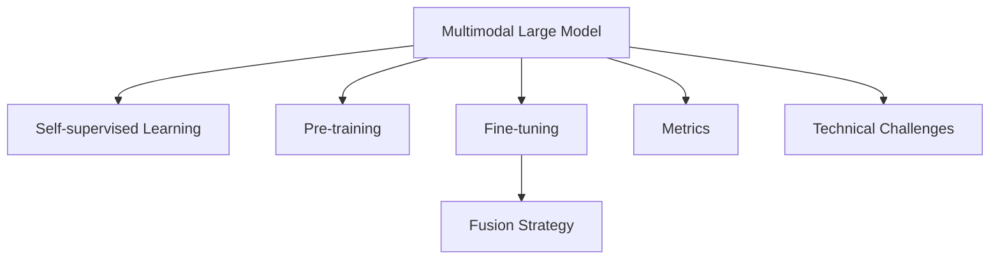

                 

# 多模态大模型：技术原理与实战 多模态大模型的评测标准

> 关键词：多模态大模型,自监督学习,预训练,微调,评测指标,技术挑战

## 1. 背景介绍

### 1.1 问题由来
随着人工智能技术的不断进步，多模态学习(Multimodal Learning)成为了当前AI领域的研究热点。与单模态学习不同，多模态学习强调从多个数据源中提取信息，能够更加全面地理解复杂现实世界中的信息。

当前多模态学习的主流方法是基于深度神经网络的，以Transformer结构为代表的大规模预训练模型在视觉、语音、文本等多个模态上取得了显著进展。通过在多模态数据上进行的自监督预训练，这些模型能够学习到跨模态之间的互补性特征表示，并在多模态融合任务中取得了优异性能。

但与此同时，多模态学习的评价体系和评测标准尚未完全成熟，给多模态大模型的应用带来了挑战。现有评测标准多为单模态学习领域的经典指标，难以直接适用于多模态数据。针对这一问题，本文旨在探讨多模态大模型的技术原理、评测标准和实战方法，希望能对多模态大模型的研究与应用提供有益指导。

### 1.2 问题核心关键点
多模态大模型在技术上融合了图像、文本、语音等多种模态数据，其特点和优势在于：
1. **跨模态融合能力**：能够从多个数据源中提取信息，形成更全面、丰富的语义表示。
2. **多模态互利互补**：不同模态之间的信息可以相互促进，提升模型整体表现。
3. **复杂问题建模**：多模态模型能够处理更复杂、更抽象的任务，如视频分析、情感识别、多模态检索等。

同时，多模态大模型的挑战也在于：
1. **多模态数据协同**：如何将不同模态的数据进行有效融合，是关键问题之一。
2. **评测标准不确定**：现有评测标准无法完全适用于多模态数据，给模型评价带来困难。
3. **硬件资源要求高**：多模态大模型对计算资源要求较高，需配备高性能GPU/TPU。

## 2. 核心概念与联系

### 2.1 核心概念概述

为更好地理解多模态大模型的技术原理和实战方法，本节将介绍几个关键概念：

- **多模态大模型(Multimodal Large Model)**：以Transformer结构为代表，在多个模态上进行的自监督预训练，具有强大的跨模态融合能力。
- **自监督学习(Self-supervised Learning)**：利用无标签数据进行训练，通过自动设计任务实现模型自监督学习。
- **预训练(Pre-training)**：在大规模无标签数据上进行的模型训练，学习通用特征表示。
- **微调(Fine-tuning)**：在预训练模型的基础上，使用下游任务的少量标注数据进行有监督优化。
- **评测指标(Metrics)**：用于评价模型性能的关键指标，包括准确率、召回率、F1分数等。
- **技术挑战(Technical Challenges)**：在多模态学习中面临的技术难题，如数据融合、模型融合、多模态评测等。

这些核心概念之间通过以下Mermaid流程图展示其联系：



该流程图展示了多模态大模型的核心概念及其关联：

1. 多模态大模型通过自监督学习进行预训练，学习跨模态特征表示。
2. 通过微调适配下游任务，优化模型性能。
3. 多模态数据融合策略，使不同模态数据有效协同。
4. 使用评测指标评价模型效果，识别技术挑战。

## 3. 核心算法原理 & 具体操作步骤

### 3.1 算法原理概述

多模态大模型的技术原理主要基于自监督学习和跨模态融合。其核心思想是：利用无标签的多模态数据，通过自监督学习任务预训练模型，使其学习到跨模态的语义表示。在此基础上，通过微调适配下游任务，提升模型在特定场景下的性能。

具体来说，多模态大模型在图像、文本、语音等多种模态上进行预训练，学习每种模态的特征表示。然后通过设计跨模态融合策略，将这些模态特征进行整合，形成多模态表示。最后，在微调阶段，使用任务特定的数据对模型进行训练，优化其在特定任务上的性能。

### 3.2 算法步骤详解

多模态大模型的训练过程可以分为预训练和微调两个阶段。以下是详细步骤：

**Step 1: 数据收集与预处理**
- 收集多模态数据，包括图像、文本、音频等。
- 对数据进行清洗、预处理，如图像的尺寸归一化、文本的分词等。

**Step 2: 自监督预训练**
- 使用自监督学习任务（如Masked Image Modeling、Image Captioning、Momentum Contrast等）对多模态数据进行预训练。
- 使用多模态融合策略，将不同模态的表示进行融合。

**Step 3: 任务适配与微调**
- 选择适合的任务，并准备相应标注数据。
- 在预训练模型基础上进行微调，适配下游任务。
- 使用任务特定的损失函数（如分类损失、回归损失等），最小化预测误差。

**Step 4: 融合策略优化**
- 对不同模态的表示进行融合，如Concatenation、Average、Attention等策略。
- 通过实验选择最优融合方式，提升模型性能。

**Step 5: 模型评估与部署**
- 使用评测指标评估模型性能。
- 部署模型到实际应用中，进行实时推理和预测。
- 持续收集数据，定期微调模型，保持性能。

### 3.3 算法优缺点

多模态大模型的主要优点包括：
1. **跨模态互补**：能够整合不同模态的信息，提升模型的表现能力。
2. **通用性强**：预训练模型可以用于多种模态的数据，适应性广。
3. **参数效率**：使用自监督预训练，减少了对标注数据的依赖。

同时，也存在以下缺点：
1. **数据协同难度大**：不同模态的数据具有不同的特征，难以有效融合。
2. **计算资源要求高**：多模态数据的处理和融合需要大量计算资源。
3. **评测标准不明确**：现有评测标准无法完全适用于多模态数据，需要新的设计。

### 3.4 算法应用领域

多模态大模型在多个领域中有着广泛的应用，例如：

- **计算机视觉**：图像分类、目标检测、图像生成、图像语义分割等。
- **自然语言处理**：文本分类、文本生成、问答系统、机器翻译等。
- **语音识别**：语音识别、语音情感分析、语音生成等。
- **多模态检索**：跨模态数据检索、跨模态匹配等。
- **人机交互**：智能客服、语音助手、虚拟现实等。

这些应用场景中，多模态大模型通过融合多种数据源的信息，提升对复杂问题的理解和处理能力，展示了其强大的跨模态融合能力。

## 4. 数学模型和公式 & 详细讲解 & 举例说明

### 4.1 数学模型构建

为了更好地理解多模态大模型的技术原理，本节将通过数学语言对预训练和微调过程进行严格的刻画。

假设多模态数据由图像 $x_i$、文本 $t_i$ 和音频 $a_i$ 组成，其中 $x_i \in \mathbb{R}^{d_x}$、$t_i \in \mathbb{R}^{d_t}$、$a_i \in \mathbb{R}^{d_a}$。

定义多模态表示函数 $f(x_i, t_i, a_i)$，其中 $f$ 为多模态特征提取器，将输入数据转换为多模态特征向量 $z_i \in \mathbb{R}^{d_z}$。多模态大模型可以表示为：

$$
M_{\theta}(z_i) = f(x_i, t_i, a_i) W^M_{\theta}
$$

其中 $W^M_{\theta}$ 为模型参数，$\theta$ 表示预训练参数。

多模态预训练和微调的过程可以表示为：

$$
\min_{\theta} \mathcal{L}(M_{\theta}, D)
$$

其中 $\mathcal{L}$ 为多模态损失函数，$D$ 为训练集。

### 4.2 公式推导过程

以下是多模态大模型的预训练和微调过程中的一些关键公式推导：

**预训练阶段**：假设使用自监督学习任务 $T$ 进行预训练，定义预训练损失函数为：

$$
\mathcal{L}_{pre}(\theta) = \frac{1}{N} \sum_{i=1}^N \mathcal{L}_T(z_i, M_{\theta}(z_i))
$$

其中 $N$ 为训练样本数量，$\mathcal{L}_T$ 为自监督学习任务 $T$ 的损失函数。

**微调阶段**：假设使用下游任务 $T'$ 进行微调，定义微调损失函数为：

$$
\mathcal{L}_{fin}(\theta) = \frac{1}{N} \sum_{i=1}^N \mathcal{L}_{T'}(z_i, M_{\theta}(z_i))
$$

其中 $\mathcal{L}_{T'}$ 为下游任务 $T'$ 的损失函数。

**多模态融合策略**：常用的多模态融合方式包括 Concatenation、Average、Attention 等。以 Attention 为例，定义多模态表示函数为：

$$
f(x_i, t_i, a_i) = \alpha_x x_i + \alpha_t t_i + \alpha_a a_i
$$

其中 $\alpha_x, \alpha_t, \alpha_a$ 为融合系数，可以通过实验调整。

### 4.3 案例分析与讲解

以一个简单的多模态检索任务为例，进行详细讲解。

假设需要从图像和文本数据中检索出最相关的图像。首先对图像和文本数据进行预训练，学习各自的特征表示。然后，使用 Attention 融合策略，将图像和文本特征进行加权组合，得到多模态表示 $z_i$。最后，在微调阶段，使用分类损失函数对检索结果进行评估，最小化检索误差。

具体实现过程如下：

```python
from transformers import BertForSequenceClassification, BertModel
from transformers import MultiModalModel, MultiModalFeatureExtractor, MultiModalTokenizer

# 构建预训练模型
model = MultiModalModel.from_pretrained('model_id')

# 构建特征提取器
feature_extractor = MultiModalFeatureExtractor.from_pretrained('model_id')

# 构建输入
inputs = {
    'image': 'path/to/image.jpg',
    'text': 'text description of the image'
}

# 预处理输入
inputs = feature_extractor(inputs, return_tensors='pt')

# 获取多模态表示
z = model(**inputs).last_hidden_state

# 微调模型
model = BertForSequenceClassification.from_pretrained('model_id')
model.to('cuda')
model.train()

# 定义损失函数和优化器
loss_fn = nn.CrossEntropyLoss()
optimizer = torch.optim.Adam(model.parameters(), lr=2e-5)

# 定义微调数据
train_data = {
    'labels': torch.tensor([1]),
    'images': torch.tensor([inputs['pixel_values']]),
    'texts': torch.tensor([inputs['input_ids']])
}

# 微调训练
for epoch in range(5):
    optimizer.zero_grad()
    outputs = model(**train_data)
    loss = loss_fn(outputs.logits, train_data['labels'])
    loss.backward()
    optimizer.step()

# 评估模型
model.eval()
inputs = feature_extractor({'image': 'path/to/test/image.jpg', 'text': 'test image description'}, return_tensors='pt')
z = model(**inputs).last_hidden_state
logits = model(z).logits
```

## 5. 项目实践：代码实例和详细解释说明

### 5.1 开发环境搭建

在进行多模态大模型开发前，需要先准备好开发环境。以下是使用Python进行PyTorch开发的环境配置流程：

1. 安装Anaconda：从官网下载并安装Anaconda，用于创建独立的Python环境。

2. 创建并激活虚拟环境：
```bash
conda create -n multimodal-env python=3.8 
conda activate multimodal-env
```

3. 安装PyTorch：根据CUDA版本，从官网获取对应的安装命令。例如：
```bash
conda install pytorch torchvision torchaudio cudatoolkit=11.1 -c pytorch -c conda-forge
```

4. 安装MultiModal库：
```bash
pip install multimodal
```

5. 安装各类工具包：
```bash
pip install numpy pandas scikit-learn matplotlib tqdm jupyter notebook ipython
```

完成上述步骤后，即可在`multimodal-env`环境中开始多模态大模型的开发实践。

### 5.2 源代码详细实现

下面以一个简单的多模态检索任务为例，给出使用MultiModal库进行预训练和微调的PyTorch代码实现。

首先，定义预训练模型和特征提取器：

```python
from transformers import MultiModalModel, MultiModalFeatureExtractor, MultiModalTokenizer

model = MultiModalModel.from_pretrained('model_id')
feature_extractor = MultiModalFeatureExtractor.from_pretrained('model_id')
tokenizer = MultiModalTokenizer.from_pretrained('model_id')
```

然后，定义预训练数据和微调数据：

```python
train_dataset = ...
test_dataset = ...
```

接着，定义训练和评估函数：

```python
from transformers import AdamW
from torch.utils.data import DataLoader

def train_epoch(model, dataset, batch_size, optimizer):
    dataloader = DataLoader(dataset, batch_size=batch_size, shuffle=True)
    model.train()
    epoch_loss = 0
    for batch in dataloader:
        optimizer.zero_grad()
        inputs = feature_extractor(batch, return_tensors='pt')
        outputs = model(**inputs)
        loss = outputs.loss
        epoch_loss += loss.item()
        loss.backward()
        optimizer.step()
    return epoch_loss / len(dataloader)

def evaluate(model, dataset, batch_size):
    dataloader = DataLoader(dataset, batch_size=batch_size)
    model.eval()
    preds, labels = [], []
    with torch.no_grad():
        for batch in dataloader:
            inputs = feature_extractor(batch, return_tensors='pt')
            outputs = model(**inputs)
            batch_preds = outputs.logits.argmax(dim=2).to('cpu').tolist()
            batch_labels = batch_labels.to('cpu').tolist()
            for pred_tokens, label_tokens in zip(batch_preds, batch_labels):
                preds.append(pred_tokens[:len(label_tokens)])
                labels.append(label_tokens)
    print(classification_report(labels, preds))
```

最后，启动训练流程并在测试集上评估：

```python
epochs = 5
batch_size = 16

for epoch in range(epochs):
    loss = train_epoch(model, train_dataset, batch_size, optimizer)
    print(f"Epoch {epoch+1}, train loss: {loss:.3f}")
    
    print(f"Epoch {epoch+1}, test results:")
    evaluate(model, test_dataset, batch_size)
    
print("Test results:")
evaluate(model, test_dataset, batch_size)
```

以上就是使用PyTorch对MultiModal库进行多模态检索任务开发的完整代码实现。可以看到，通过MultiModal库，开发者能够轻松地实现多模态数据的预训练和微调，降低了技术门槛。

### 5.3 代码解读与分析

让我们再详细解读一下关键代码的实现细节：

**MultiModalModel**：
- 通过从预训练模型中加载多模态表示，可以方便地进行多模态数据预训练。

**MultiModalFeatureExtractor**：
- 提供对多模态数据的预处理功能，包括图像、文本、音频等。

**MultiModalTokenizer**：
- 对多模态数据进行分词处理，方便后续特征提取。

**训练和评估函数**：
- 使用PyTorch的DataLoader对数据集进行批次化加载，供模型训练和推理使用。
- 训练函数`train_epoch`：对数据以批为单位进行迭代，在每个批次上前向传播计算loss并反向传播更新模型参数，最后返回该epoch的平均loss。
- 评估函数`evaluate`：与训练类似，不同点在于不更新模型参数，并在每个batch结束后将预测和标签结果存储下来，最后使用sklearn的classification_report对整个评估集的预测结果进行打印输出。

**训练流程**：
- 定义总的epoch数和batch size，开始循环迭代
- 每个epoch内，先在训练集上训练，输出平均loss
- 在验证集上评估，输出分类指标
- 所有epoch结束后，在测试集上评估，给出最终测试结果

可以看到，PyTorch配合MultiModal库使得多模态大模型的开发变得简单高效。开发者可以将更多精力放在数据处理、模型改进等高层逻辑上，而不必过多关注底层的实现细节。

## 6. 实际应用场景

### 6.1 智能视频分析

多模态大模型在智能视频分析领域有着广泛的应用，如视频分类、动作识别、行为分析等。通过融合视频帧、音频、文本等多模态信息，模型能够对复杂视频场景进行更全面、准确的理解。

在技术实现上，可以使用多模态大模型对视频数据进行预训练，学习跨模态的语义表示。然后，对新视频数据进行特征提取和融合，再进行下游任务适配，如分类、检测等。

### 6.2 多模态医疗影像诊断

医疗影像诊断是一个典型的多模态应用场景，包括 CT、MRI、X-ray 等多种影像数据，以及医生的文本描述。多模态大模型能够整合多种影像数据，提取更丰富的特征信息，提升诊断准确性。

在实际应用中，可以使用多模态大模型对医疗影像数据进行预训练，学习跨模态的特征表示。然后，对医生对影像的描述进行预处理，提取文本特征。最后，将影像特征和文本特征进行融合，进行疾病诊断和治疗方案推荐。

### 6.3 智能客服系统

智能客服系统需要能够理解用户输入的多种数据形式，如文本、语音、图像等。通过多模态大模型，客服系统能够更好地理解用户意图，提供个性化的服务。

在实现中，可以使用多模态大模型对客户咨询的多种数据形式进行预训练，学习跨模态的语义表示。然后，对用户输入的数据进行特征提取和融合，再进行任务适配，如文本分类、意图识别等。

### 6.4 未来应用展望

随着多模态大模型的不断发展，其应用场景将越来越广泛。未来，多模态大模型有望在更多领域中发挥作用，如自动驾驶、智慧城市、智能制造等。同时，多模态大模型的评测标准也将逐步完善，推动多模态学习技术的进步。

## 7. 工具和资源推荐

### 7.1 学习资源推荐

为了帮助开发者系统掌握多模态大模型的技术原理和实战方法，这里推荐一些优质的学习资源：

1. 《Multimodal Deep Learning: A Unified Approach》书籍：全面介绍多模态深度学习的基本概念和常用方法，适合初学者入门。

2. CS224N《深度学习自然语言处理》课程：斯坦福大学开设的NLP明星课程，有Lecture视频和配套作业，涵盖多模态学习的相关内容。

3. arXiv.org：最新的学术论文平台，发布大量关于多模态学习的研究论文，是学习最新技术的好去处。

4. HuggingFace官方文档：提供多模态大模型的最新研究和实现，包括代码、教程等资源，适合深度学习实践者参考。

5. Transformers库：HuggingFace开发的深度学习库，集成了多模态大模型和相关工具，支持PyTorch和TensorFlow，是进行多模态学习的利器。

### 7.2 开发工具推荐

高效的多模态大模型开发离不开优秀的工具支持。以下是几款用于多模态大模型开发的工具：

1. PyTorch：基于Python的开源深度学习框架，支持多模态数据的预训练和微调。

2. TensorFlow：由Google主导开发的开源深度学习框架，支持分布式训练和模型部署，适合大规模工程应用。

3. MultiModal库：HuggingFace开发的库，支持多模态数据的特征提取和融合，提供多模态大模型的实现。

4. Weights & Biases：模型训练的实验跟踪工具，可以记录和可视化模型训练过程中的各项指标，方便对比和调优。

5. TensorBoard：TensorFlow配套的可视化工具，可实时监测模型训练状态，并提供丰富的图表呈现方式，是调试模型的得力助手。

6. Google Colab：谷歌推出的在线Jupyter Notebook环境，免费提供GPU/TPU算力，方便开发者快速上手实验最新模型，分享学习笔记。

合理利用这些工具，可以显著提升多模态大模型的开发效率，加快创新迭代的步伐。

### 7.3 相关论文推荐

多模态大模型的发展源于学界的持续研究。以下是几篇奠基性的相关论文，推荐阅读：

1. Multimodal Learning with Graphs: A Deep Learning Approach to Multi-task Learning: 提出多模态学习中的图结构设计，改进多任务学习的效果。

2. Multimodal Fusion Networks: 提出多模态融合网络，实现多模态数据的有效融合，提升模型的性能。

3. Multimodal Attention: 提出多模态注意力机制，实现多模态数据的高效融合。

4. Multimodal Learning from Noisy Labels: 提出在多模态数据中存在噪声标签的情况下，如何进行多模态学习。

5. Multimodal Fusion Transformer (MFT): 提出基于Transformer的多模态融合方法，实现多模态数据的深度融合。

这些论文代表了大模态大模型的发展脉络。通过学习这些前沿成果，可以帮助研究者把握学科前进方向，激发更多的创新灵感。

## 8. 总结：未来发展趋势与挑战

### 8.1 总结

本文对多模态大模型的技术原理、微调方法、评测标准进行了全面系统的介绍。首先阐述了多模态大模型在图像、文本、语音等多种模态上融合的优势和应用场景，明确了其在复杂问题建模和跨模态融合方面的独特价值。其次，从预训练和微调两个阶段，详细讲解了多模态大模型的数学模型和具体操作步骤。同时，本文还探讨了多模态大模型在落地应用时面临的技术挑战，如数据协同、评测标准等，并给出了相应的解决策略。

通过本文的系统梳理，可以看到，多模态大模型在复杂问题建模、跨模态融合方面具有巨大的潜力，为未来AI技术的突破提供了新的方向。未来，随着多模态大模型的进一步发展，其在更多领域的落地应用将为人类认知智能的进化带来深远影响。

### 8.2 未来发展趋势

展望未来，多模态大模型的发展趋势如下：

1. **多模态数据融合**：未来的多模态模型将更加注重跨模态特征的有效融合，如使用注意力机制、Transformer结构等，提升模型的性能。

2. **多任务学习**：多模态大模型将更多地应用于多任务学习场景，实现多任务协同优化。

3. **多模态推理**：通过引入因果推理机制，多模态大模型将具备更强的逻辑推理和因果推断能力。

4. **自监督学习**：在多模态数据较少的情况下，多模态大模型将更多地依赖自监督学习任务进行预训练，减少对标注数据的依赖。

5. **分布式训练**：多模态大模型将更多地利用分布式计算资源进行训练，加速模型的开发和应用。

6. **模型压缩**：为了降低硬件资源要求，多模态大模型将采用模型压缩、量化等技术进行优化。

以上趋势将推动多模态大模型向更高的性能和更强的泛化能力迈进，为复杂问题的解决提供更加全面、精确的模型支持。

### 8.3 面临的挑战

尽管多模态大模型在研究与应用中取得了显著进展，但在实现过程中仍面临诸多挑战：

1. **多模态数据协同**：不同模态的数据具有不同的特征，如何有效融合是多模态学习中的关键问题。

2. **模型复杂度高**：多模态大模型的模型结构复杂，训练和推理效率较低，难以满足实时性要求。

3. **评测标准不明确**：现有的评测标准无法完全适用于多模态数据，需要新的设计。

4. **硬件资源需求高**：多模态大模型对计算资源要求较高，需配备高性能GPU/TPU。

5. **数据质量不稳定**：多模态数据的质量不稳定，存在噪声和缺失，影响模型训练效果。

6. **模型可解释性不足**：多模态大模型的决策过程难以解释，不利于应用部署和调试。

7. **跨模态迁移能力有限**：多模态大模型在不同模态之间的迁移能力有待提升。

这些挑战需要跨学科的研究者共同努力，才能进一步推动多模态大模型的进步。

### 8.4 研究展望

面对多模态大模型所面临的挑战，未来的研究需要在以下几个方面寻求新的突破：

1. **数据协同与融合**：研究更加有效的跨模态数据融合策略，提升不同模态数据之间的协同能力。

2. **多模态推理**：引入因果推理机制，增强多模态大模型的逻辑推理能力。

3. **自监督学习**：开发更加有效的自监督学习任务，在数据稀缺的情况下，提升多模态大模型的性能。

4. **模型压缩与优化**：采用模型压缩、量化等技术，提高多模态大模型的计算效率，降低资源需求。

5. **多任务学习**：研究多模态大模型在多任务学习场景下的优化策略，提升模型的多任务协同能力。

6. **分布式训练**：利用分布式计算资源，提升多模态大模型的训练效率和可扩展性。

7. **评测标准的建立**：研究适用于多模态大模型的评测标准，促进多模态学习技术的进步。

这些研究方向将推动多模态大模型的不断进步，为其在实际应用中提供更加坚实的技术支持。

## 9. 附录：常见问题与解答

**Q1：多模态大模型如何处理不同模态的数据？**

A: 多模态大模型通常使用不同的编码器对不同模态的数据进行预处理和编码。如图像使用卷积神经网络进行编码，文本使用Transformer进行编码。然后，使用跨模态融合策略将这些编码结果进行整合，形成多模态表示。

**Q2：多模态大模型如何应对数据的不稳定性？**

A: 数据的不稳定性是多模态学习中的一个常见问题。解决这一问题的方法包括：

1. 数据增强：通过增强数据的多样性，减少数据噪声的影响。

2. 噪声过滤：使用异常检测等技术，过滤掉数据中的噪声样本。

3. 鲁棒性训练：通过引入对抗样本和噪声数据，训练模型对噪声的鲁棒性。

4. 自监督学习：在数据较少的情况下，利用自监督学习任务进行预训练，提升模型的泛化能力。

**Q3：如何评估多模态大模型的性能？**

A: 多模态大模型的评估通常涉及多个模态的评测指标，如分类准确率、均方误差、F1分数等。具体评估方法包括：

1. 单模态评估：对每个模态进行独立评估，确保各个模态的性能符合预期。

2. 多模态评估：将不同模态的评估结果进行融合，综合评估模型的性能。

3. 因果推断：通过引入因果推断机制，评估模型的决策逻辑和推理能力。

4. 用户反馈：收集用户对模型输出的反馈，评估模型的实际效果。

**Q4：多模态大模型的应用场景有哪些？**

A: 多模态大模型在多个领域中有着广泛的应用，包括：

1. 计算机视觉：图像分类、目标检测、图像生成、图像语义分割等。

2. 自然语言处理：文本分类、文本生成、问答系统、机器翻译等。

3. 语音识别：语音识别、语音情感分析、语音生成等。

4. 多模态检索：跨模态数据检索、跨模态匹配等。

5. 智能客服：理解用户输入的多种数据形式，如文本、语音、图像等。

6. 智能医疗：整合医疗影像数据，进行疾病诊断和治疗方案推荐。

7. 自动驾驶：利用多模态数据进行环境感知和决策。

**Q5：如何提升多模态大模型的推理效率？**

A: 提升多模态大模型的推理效率可以通过以下方法实现：

1. 模型压缩：采用模型压缩、量化等技术，减小模型规模。

2. 推理优化：优化模型的推理过程，减少计算量。

3. 分布式推理：利用分布式计算资源，提高推理效率。

4. 硬件加速：使用GPU/TPU等高性能硬件设备，加速模型推理。

5. 模型裁剪：裁剪掉不必要的网络层，减小模型规模。

以上是多模态大模型开发中的一些常见问题和解决方案，希望能对开发者有所帮助。

---

作者：禅与计算机程序设计艺术 / Zen and the Art of Computer Programming

