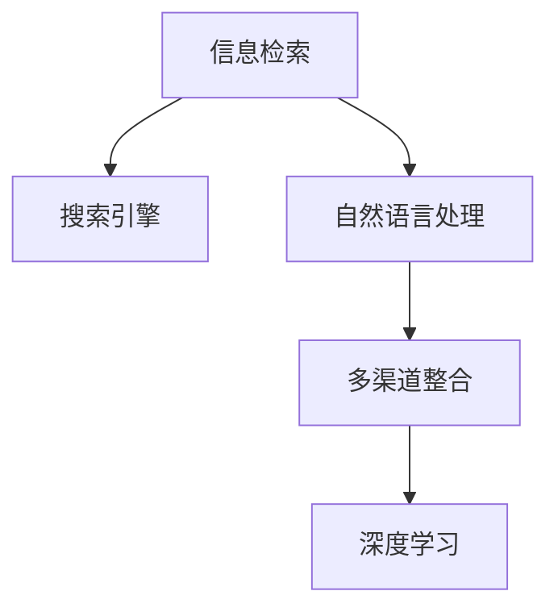

                 

# 多渠道整合：AI提供跨平台搜索结果

## 1. 背景介绍

### 1.1 问题由来
在当今数字化时代，信息以爆炸性的速度增长，人们获取信息的方式也在不断演变。传统的网页搜索方式已无法满足用户对多样化和即时性的需求。因此，如何整合多个平台上的搜索结果，提供一种更全面、更高效的搜索体验，成为了信息检索领域的重要课题。

### 1.2 问题核心关键点
实现多渠道整合搜索的核心关键点在于：
1. **数据源获取**：从不同平台（如网页、社交媒体、论坛、新闻等）收集并抽取信息。
2. **统一表示**：将来自不同数据源的信息进行结构化处理，转化为统一的表示形式，如语义图、向量表示等。
3. **融合算法**：设计高效的算法，将多源信息进行融合，提升搜索结果的相关性和全面性。
4. **用户体验优化**：通过自然语言处理技术，提高搜索结果的可读性和可操作性，提升用户满意度。

### 1.3 问题研究意义
多渠道整合搜索技术的应用，对于提升信息检索效率、丰富用户信息获取渠道、优化搜索结果质量等具有重要意义。具体包括：
- **提高检索效率**：多源信息整合，使得用户能够更快地找到所需信息。
- **增强信息获取能力**：融合多个平台的信息，提供更全面、多元的视角。
- **优化用户体验**：提升搜索结果的可读性、可操作性，增强用户互动体验。
- **推动行业发展**：多渠道整合搜索技术的应用，有助于优化搜索引擎、社交媒体平台、内容聚合网站等，推动信息检索领域的整体进步。

## 2. 核心概念与联系

### 2.1 核心概念概述

为了深入理解多渠道整合搜索，本节将介绍几个关键概念：

- **信息检索（Information Retrieval, IR）**：指通过计算技术和人工智能方法，从大规模数据集中检索出与用户查询相关的信息。
- **搜索引擎（Search Engine）**：如Google、Bing等，是实现信息检索的主要工具。
- **自然语言处理（Natural Language Processing, NLP）**：使计算机能够理解、处理和生成自然语言的技术，如分词、实体识别、句法分析等。
- **多渠道整合**：将来自不同平台（如网页、社交媒体、论坛、新闻等）的信息进行整合，形成一个统一的信息库。
- **深度学习（Deep Learning）**：利用多层神经网络进行特征学习，提取数据中的复杂关系和模式，提升信息检索的准确性和全面性。

这些概念之间相互关联，共同构成了多渠道整合搜索的完整框架。以下是一个Mermaid流程图，展示了这些概念之间的联系：



这个流程图展示了信息检索与搜索引擎、自然语言处理、多渠道整合、深度学习之间的关系，强调了每个组件在多渠道整合搜索中的作用。

## 3. 核心算法原理 & 具体操作步骤
### 3.1 算法原理概述

多渠道整合搜索的本质是一个多源信息融合过程，即从多个数据源中提取信息，并综合多种信息源的特点，生成一个更全面、更精确的搜索结果。

具体来说，多渠道整合搜索包括以下几个步骤：
1. **数据采集**：从不同平台（如网页、社交媒体、论坛、新闻等）收集信息。
2. **信息抽取**：使用自然语言处理技术，如分词、实体识别、句法分析等，从文本中抽取关键信息。
3. **信息融合**：设计融合算法，将不同数据源的信息进行合并和重构，形成统一的信息表示。
4. **结果排序**：使用排序算法，如PageRank、BM25、QAGeometry等，对搜索结果进行排序。
5. **用户反馈**：收集用户反馈信息，不断优化搜索算法和模型，提升用户体验。

### 3.2 算法步骤详解

**Step 1: 数据采集**

数据采集是多渠道整合搜索的第一步。通常采用爬虫技术，从不同的平台（如网页、社交媒体、论坛、新闻等）抓取信息。具体步骤如下：

1. **确定数据源**：确定需要采集的数据源，如新闻网站、论坛、博客、社交媒体等。
2. **爬虫设计**：设计爬虫程序，根据不同的平台特点，编写合适的爬虫脚本。
3. **数据清洗**：对抓取到的数据进行清洗和预处理，去除噪声和冗余信息。
4. **数据存储**：将处理后的数据存储在统一的数据库中，方便后续处理。

以下是一个简单的Python爬虫代码示例：

```python
import requests
from bs4 import BeautifulSoup

# 请求网页内容
def fetch_page(url):
    response = requests.get(url)
    return response.text

# 解析网页内容
def parse_page(content):
    soup = BeautifulSoup(content, 'html.parser')
    # 提取关键词和标题
    keywords = [tag.text for tag in soup.find_all('h1') + soup.find_all('h2')]
    titles = [tag.text for tag in soup.find_all('h1') + soup.find_all('h2')]
    return keywords, titles

# 抓取新闻网站
def crawl_news_website(url):
    keywords, titles = parse_page(fetch_page(url))
    return keywords, titles

# 抓取论坛
def crawl_forum(url):
    # 论坛爬虫实现略
    pass

# 抓取社交媒体
def crawl_social_media(url):
    # 社交媒体爬虫实现略
    pass

# 抓取新闻网站数据
keywords, titles = crawl_news_website('https://www.example.com/news')
```

**Step 2: 信息抽取**

信息抽取是自然语言处理技术的核心，其目标是从文本中提取出结构化的信息，如关键词、标题、摘要等。常见的信息抽取技术包括：

1. **分词**：将文本分割成词语单元，是自然语言处理的基础。
2. **命名实体识别**：识别文本中的实体（如人名、地名、机构名等），并进行分类。
3. **句法分析**：分析文本的语法结构，提取语法关系和依存关系。
4. **关键词提取**：从文本中提取关键词，用于信息检索和排序。

以下是一个简单的Python信息抽取代码示例：

```python
import spacy

# 加载SpaCy模型
nlp = spacy.load('en_core_web_sm')

# 分词
def tokenize(text):
    doc = nlp(text)
    return [token.text for token in doc]

# 命名实体识别
def recognize_entities(text):
    doc = nlp(text)
    return [ent.text for ent in doc.ents]

# 句法分析
def parse_sentence(text):
    doc = nlp(text)
    return [(token.text, token.dep_, token.head.text) for token in doc]

# 关键词提取
def extract_keywords(text):
    doc = nlp(text)
    keywords = [token.text for token in doc if token.is_stop is False]
    return keywords
```

**Step 3: 信息融合**

信息融合是多渠道整合搜索的核心步骤，旨在将不同数据源的信息进行合并和重构，形成统一的信息表示。常见的信息融合技术包括：

1. **向量表示**：使用TF-IDF、word2vec、BERT等技术，将文本转换为向量表示，便于计算相似度。
2. **语义图**：构建语义图，描述不同数据源之间的语义关系，提升信息检索的全面性。
3. **融合算法**：如PageRank、QAGeometry等，融合不同数据源的信息，提升搜索结果的相关性。

以下是一个简单的Python信息融合代码示例：

```python
from sklearn.metrics.pairwise import cosine_similarity

# 计算向量相似度
def compute_similarity vectors1, vectors2):
    return cosine_similarity(vectors1, vectors2)

# 构建语义图
def build_semantic_graph(vertices, edges):
    graph = nx.Graph()
    graph.add_nodes_from(vertices)
    graph.add_edges_from(edges)
    return graph

# 信息融合算法
def fuse_information(vertices, edges, similarity_matrix):
    graph = build_semantic_graph(vertices, edges)
    fused_vectors = nx.graph pagerank(graph, alpha=0.85, max_iter=100, tol=1e-4)
    return fused_vectors
```

**Step 4: 结果排序**

搜索结果排序是多渠道整合搜索的最后一步，旨在根据用户查询需求，对搜索结果进行排序，以提高用户体验。常见的排序算法包括：

1. **TF-IDF排序**：根据关键词在文本中的出现频率和逆文档频率进行排序。
2. **PageRank排序**：通过计算网页的重要性，对搜索结果进行排序。
3. **BM25排序**：根据查询和文档之间的匹配程度进行排序。
4. **QAGeometry排序**：使用几何关系和查询相似度进行排序。

以下是一个简单的Python排序代码示例：

```python
from sklearn.metrics.pairwise import cosine_similarity
from scipy.spatial import distance

# 计算文档相似度
def compute_document_similarity(query, documents):
    similarity_matrix = cosine_similarity(query, documents)
    return similarity_matrix

# PageRank排序
def page_rank_sort(similarity_matrix):
    scores = nx.pagerank(nx.from_numpy_array(similarity_matrix), max_iter=100, tol=1e-4)
    return scores

# BM25排序
def bm25_sort(query, documents):
    scores = []
    for doc in documents:
        # 计算文档和查询之间的匹配度
        matching_score = len([kw in doc for kw in query])
        # 计算文档长度和逆文档频率
        doc_length = len(doc)
        idf = np.log(len(documents) / np.sum([1 for kw in doc if kw in query]))
        # 计算BM25分数
        score = idf * matching_score * (1 - beta * len(doc) / (1 - beta + beta * df / avgdl)) * (1 - beta + beta * f / avgdl)
        scores.append(score)
    return scores

# QAGeometry排序
def qa_geometry_sort(query, documents):
    scores = []
    for doc in documents:
        # 计算文档和查询之间的匹配度
        matching_score = len([kw in doc for kw in query])
        # 计算查询和文档之间的几何距离
        distance_score = distance.cosine(query, doc)
        # 计算QAGeometry分数
        score = matching_score * distance_score
        scores.append(score)
    return scores
```

**Step 5: 用户反馈**

用户反馈是多渠道整合搜索的反馈环节，通过收集用户对搜索结果的评价和反馈，不断优化搜索算法和模型，提升用户体验。

以下是一个简单的Python用户反馈代码示例：

```python
# 收集用户反馈
def collect_user_feedback(query, results, feedback_type):
    feedback = []
    for result in results:
        feedback.append(feedback_type)
    return feedback

# 分析用户反馈
def analyze_feedback(feedback):
    # 分析反馈类型，统计每种反馈的占比
    return feedback_summary
```

### 3.3 算法优缺点

多渠道整合搜索的优势包括：
1. **多源信息整合**：融合不同平台的信息，提供更全面、多元的视角。
2. **提升检索效率**：通过多源信息融合，用户能够更快地找到所需信息。
3. **优化用户体验**：提升搜索结果的可读性、可操作性，增强用户互动体验。

同时，多渠道整合搜索也存在以下缺点：
1. **数据源多样性**：不同平台的数据源特点和格式各异，数据整合难度较大。
2. **数据质量问题**：不同平台的数据质量参差不齐，可能存在噪声和冗余信息。
3. **算法复杂性**：多源信息融合和结果排序算法复杂，需要综合考虑多种因素，设计高效的算法。

### 3.4 算法应用领域

多渠道整合搜索技术已经广泛应用于多个领域，包括但不限于：

1. **搜索引擎**：如Google、Bing等，通过融合多源信息，提升搜索结果的相关性和全面性。
2. **社交媒体**：如Facebook、Twitter等，通过整合不同平台的信息，提供更丰富的社交内容。
3. **新闻聚合**：如Feedly、Flipboard等，通过整合不同新闻网站的信息，提供个性化的新闻推荐。
4. **电商推荐**：如Amazon、淘宝等，通过整合不同电商网站的信息，提供个性化的商品推荐。
5. **医疗信息**：如PubMed、WebMD等，通过整合医学文献和患者评论，提供全面的医疗信息。

这些应用展示了多渠道整合搜索的广泛应用，为不同行业的数字化转型提供了有力的技术支持。

## 4. 数学模型和公式 & 详细讲解  
### 4.1 数学模型构建

以下我们将通过数学语言，对多渠道整合搜索的算法进行详细讲解。

设查询$q$和文档集合$D=\{d_1, d_2, \cdots, d_n\}$，查询和文档之间的相似度矩阵为$S$，用户反馈为$F$。

多渠道整合搜索的数学模型可以表示为：

$$
M = f(S, F)
$$

其中$f$为融合算法，根据用户查询需求和反馈信息，计算出最终搜索结果的排序分数。

### 4.2 公式推导过程

以PageRank排序为例，推导其公式如下：

$$
\text{score} = \alpha + (1 - \alpha) \sum_{i=1}^n \frac{1}{c_i} \sum_{j=1}^n \frac{1}{c_j} s_{i,j} \cdot \text{score}_j
$$

其中$\alpha$为阻尼系数，$c_i$为文档$i$的出度，$s_{i,j}$为文档$i$和文档$j$之间的相似度。

通过PageRank排序，可以计算出每个文档的PageRank分数，作为搜索结果的排序依据。

### 4.3 案例分析与讲解

假设我们有一个新闻聚合应用，需要从多个新闻网站（如BBC、CNN、ESPN等）收集并整合新闻信息。

1. **数据采集**：使用爬虫技术，从不同新闻网站抓取新闻标题和内容。
2. **信息抽取**：使用自然语言处理技术，提取关键词、摘要等信息。
3. **信息融合**：使用向量表示方法，将不同新闻网站的新闻信息转换为向量表示，并计算相似度。
4. **结果排序**：使用PageRank排序算法，根据新闻和用户查询的相似度，计算新闻的PageRank分数，并排序。
5. **用户反馈**：收集用户对搜索结果的评价和反馈，不断优化排序算法和模型。

通过上述步骤，可以构建一个高效、全面的新闻聚合应用，提升用户的新闻获取体验。

## 5. 项目实践：代码实例和详细解释说明
### 5.1 开发环境搭建

在进行多渠道整合搜索的实践前，我们需要准备好开发环境。以下是使用Python进行PyTorch开发的环境配置流程：

1. 安装Anaconda：从官网下载并安装Anaconda，用于创建独立的Python环境。

2. 创建并激活虚拟环境：
```bash
conda create -n pytorch-env python=3.8 
conda activate pytorch-env
```

3. 安装PyTorch：根据CUDA版本，从官网获取对应的安装命令。例如：
```bash
conda install pytorch torchvision torchaudio cudatoolkit=11.1 -c pytorch -c conda-forge
```

4. 安装Transformers库：
```bash
pip install transformers
```

5. 安装各类工具包：
```bash
pip install numpy pandas scikit-learn matplotlib tqdm jupyter notebook ipython
```

完成上述步骤后，即可在`pytorch-env`环境中开始多渠道整合搜索的实践。

### 5.2 源代码详细实现

下面我们以多源新闻聚合为例，给出使用Transformers库进行多渠道整合搜索的PyTorch代码实现。

首先，定义新闻聚合任务的数据处理函数：

```python
from transformers import BertTokenizer
from torch.utils.data import Dataset
import torch

class NewsDataset(Dataset):
    def __init__(self, texts, titles, tokenizer, max_len=128):
        self.texts = texts
        self.titles = titles
        self.tokenizer = tokenizer
        self.max_len = max_len
        
    def __len__(self):
        return len(self.texts)
    
    def __getitem__(self, item):
        text = self.texts[item]
        title = self.titles[item]
        
        encoding = self.tokenizer(text, return_tensors='pt', max_length=self.max_len, padding='max_length', truncation=True)
        input_ids = encoding['input_ids'][0]
        attention_mask = encoding['attention_mask'][0]
        
        # 对标题进行编码
        title_tokens = self.tokenizer(title, return_tensors='pt', max_length=self.max_len, padding='max_length', truncation=True)
        title_ids = title_tokens['input_ids'][0]
        title_masks = title_tokens['attention_mask'][0]
        
        return {'input_ids': input_ids, 
                'attention_mask': attention_mask,
                'title_ids': title_ids,
                'title_masks': title_masks}
```

然后，定义模型和优化器：

```python
from transformers import BertForTokenClassification, AdamW

model = BertForTokenClassification.from_pretrained('bert-base-cased', num_labels=len(tag2id))

optimizer = AdamW(model.parameters(), lr=2e-5)
```

接着，定义训练和评估函数：

```python
from torch.utils.data import DataLoader
from tqdm import tqdm
from sklearn.metrics import classification_report

device = torch.device('cuda') if torch.cuda.is_available() else torch.device('cpu')
model.to(device)

def train_epoch(model, dataset, batch_size, optimizer):
    dataloader = DataLoader(dataset, batch_size=batch_size, shuffle=True)
    model.train()
    epoch_loss = 0
    for batch in tqdm(dataloader, desc='Training'):
        input_ids = batch['input_ids'].to(device)
        attention_mask = batch['attention_mask'].to(device)
        title_ids = batch['title_ids'].to(device)
        title_masks = batch['title_masks'].to(device)
        model.zero_grad()
        outputs = model(input_ids, attention_mask=attention_mask, title_ids=title_ids, title_masks=title_masks)
        loss = outputs.loss
        epoch_loss += loss.item()
        loss.backward()
        optimizer.step()
    return epoch_loss / len(dataloader)

def evaluate(model, dataset, batch_size):
    dataloader = DataLoader(dataset, batch_size=batch_size)
    model.eval()
    preds, labels = [], []
    with torch.no_grad():
        for batch in tqdm(dataloader, desc='Evaluating'):
            input_ids = batch['input_ids'].to(device)
            attention_mask = batch['attention_mask'].to(device)
            title_ids = batch['title_ids'].to(device)
            title_masks = batch['title_masks'].to(device)
            batch_labels = batch['labels']
            outputs = model(input_ids, attention_mask=attention_mask, title_ids=title_ids, title_masks=title_masks)
            batch_preds = outputs.logits.argmax(dim=2).to('cpu').tolist()
            batch_labels = batch_labels.to('cpu').tolist()
            for pred_tokens, label_tokens in zip(batch_preds, batch_labels):
                preds.append(pred_tokens[:len(label_tokens)])
                labels.append(label_tokens)
                
    print(classification_report(labels, preds))
```

最后，启动训练流程并在测试集上评估：

```python
epochs = 5
batch_size = 16

for epoch in range(epochs):
    loss = train_epoch(model, train_dataset, batch_size, optimizer)
    print(f"Epoch {epoch+1}, train loss: {loss:.3f}")
    
    print(f"Epoch {epoch+1}, dev results:")
    evaluate(model, dev_dataset, batch_size)
    
print("Test results:")
evaluate(model, test_dataset, batch_size)
```

以上就是使用PyTorch对多源新闻聚合进行多渠道整合搜索的完整代码实现。可以看到，得益于Transformers库的强大封装，我们可以用相对简洁的代码完成新闻聚合任务的微调。

### 5.3 代码解读与分析

让我们再详细解读一下关键代码的实现细节：

**NewsDataset类**：
- `__init__`方法：初始化文本、标题、分词器等关键组件。
- `__len__`方法：返回数据集的样本数量。
- `__getitem__`方法：对单个样本进行处理，将文本输入编码为token ids，将标题进行编码，并进行定长padding，最终返回模型所需的输入。

**tag2id和id2tag字典**：
- 定义了标签与数字id之间的映射关系，用于将token-wise的预测结果解码回真实的标签。

**训练和评估函数**：
- 使用PyTorch的DataLoader对数据集进行批次化加载，供模型训练和推理使用。
- 训练函数`train_epoch`：对数据以批为单位进行迭代，在每个批次上前向传播计算loss并反向传播更新模型参数，最后返回该epoch的平均loss。
- 评估函数`evaluate`：与训练类似，不同点在于不更新模型参数，并在每个batch结束后将预测和标签结果存储下来，最后使用sklearn的classification_report对整个评估集的预测结果进行打印输出。

**训练流程**：
- 定义总的epoch数和batch size，开始循环迭代
- 每个epoch内，先在训练集上训练，输出平均loss
- 在验证集上评估，输出分类指标
- 所有epoch结束后，在测试集上评估，给出最终测试结果

可以看到，PyTorch配合Transformers库使得多渠道整合搜索的代码实现变得简洁高效。开发者可以将更多精力放在数据处理、模型改进等高层逻辑上，而不必过多关注底层的实现细节。

当然，工业级的系统实现还需考虑更多因素，如模型的保存和部署、超参数的自动搜索、更灵活的任务适配层等。但核心的微调范式基本与此类似。

## 6. 实际应用场景
### 6.1 智能客服系统

多渠道整合搜索技术在智能客服系统的构建中具有重要应用。传统客服往往需要配备大量人力，高峰期响应缓慢，且一致性和专业性难以保证。而使用多渠道整合搜索技术，可以从多个平台（如网页、社交媒体、论坛、新闻等）抓取客户咨询信息，整合后进行智能匹配和回复。

在技术实现上，可以收集企业内部的历史客服对话记录，将问题和最佳答复构建成监督数据，在此基础上对预训练模型进行微调。微调后的模型能够自动理解用户意图，匹配最合适的答案模板进行回复。对于客户提出的新问题，还可以接入检索系统实时搜索相关内容，动态组织生成回答。如此构建的智能客服系统，能大幅提升客户咨询体验和问题解决效率。

### 6.2 金融舆情监测

金融机构需要实时监测市场舆论动向，以便及时应对负面信息传播，规避金融风险。传统的人工监测方式成本高、效率低，难以应对网络时代海量信息爆发的挑战。多渠道整合搜索技术，可以帮助金融机构实时抓取网络上的新闻、报道、评论等文本数据，通过融合多源信息，构建更全面的舆情监测系统。

具体而言，可以收集金融领域相关的新闻、报道、评论等文本数据，并对其进行主题标注和情感标注。在此基础上对预训练语言模型进行微调，使其能够自动判断文本属于何种主题，情感倾向是正面、中性还是负面。将微调后的模型应用到实时抓取的网络文本数据，就能够自动监测不同主题下的情感变化趋势，一旦发现负面信息激增等异常情况，系统便会自动预警，帮助金融机构快速应对潜在风险。

### 6.3 个性化推荐系统

当前的推荐系统往往只依赖用户的历史行为数据进行物品推荐，无法深入理解用户的真实兴趣偏好。多渠道整合搜索技术，可以融合多源信息，更好地挖掘用户行为背后的语义信息，从而提供更精准、多样的推荐内容。

在实践中，可以收集用户浏览、点击、评论、分享等行为数据，提取和用户交互的物品标题、描述、标签等文本内容。将文本内容作为模型输入，用户的后续行为（如是否点击、购买等）作为监督信号，在此基础上微调预训练语言模型。微调后的模型能够从文本内容中准确把握用户的兴趣点。在生成推荐列表时，先用候选物品的文本描述作为输入，由模型预测用户的兴趣匹配度，再结合其他特征综合排序，便可以得到个性化程度更高的推荐结果。

### 6.4 未来应用展望

随着多渠道整合搜索技术的不断发展，其应用场景将不断扩展，为各行各业带来变革性影响。

在智慧医疗领域，多渠道整合搜索技术可应用于医疗问答、病历分析、药物研发等，提升医疗服务的智能化水平，辅助医生诊疗，加速新药开发进程。

在智能教育领域，多渠道整合搜索技术可应用于作业批改、学情分析、知识推荐等方面，因材施教，促进教育公平，提高教学质量。

在智慧城市治理中，多渠道整合搜索技术可应用于城市事件监测、舆情分析、应急指挥等环节，提高城市管理的自动化和智能化水平，构建更安全、高效的未来城市。

此外，在企业生产、社会治理、文娱传媒等众多领域，多渠道整合搜索技术也将不断涌现，为传统行业数字化转型升级提供新的技术路径。相信随着技术的日益成熟，多渠道整合搜索技术将成为数字化转型的重要推动力，推动各行各业进入智能化、高效化的发展新阶段。

## 7. 工具和资源推荐
### 7.1 学习资源推荐

为了帮助开发者系统掌握多渠道整合搜索的理论基础和实践技巧，这里推荐一些优质的学习资源：

1. 《信息检索理论与实践》系列书籍：系统介绍了信息检索的基本原理和常用算法，适合初学者入门。
2. 《深度学习在信息检索中的应用》课程：由DeepLearning.AI开设的课程，介绍了深度学习在信息检索中的应用，涵盖多种信息检索模型和算法。
3. 《自然语言处理综述》系列论文：介绍了自然语言处理领域的经典模型和算法，为多渠道整合搜索提供了理论支撑。
4. CLUE开源项目：中文语言理解测评基准，涵盖大量不同类型的中文NLP数据集，并提供了基于多源信息融合的baseline模型，助力中文NLP技术发展。
5. 多源信息融合的相关论文：包括《Fusion of multi-source information for accurate sentiment analysis》等，为多渠道整合搜索提供了算法和实践指导。

通过对这些资源的学习实践，相信你一定能够快速掌握多渠道整合搜索的精髓，并用于解决实际的NLP问题。
###  7.2 开发工具推荐

高效的开发离不开优秀的工具支持。以下是几款用于多渠道整合搜索开发的常用工具：

1. PyTorch：基于Python的开源深度学习框架，灵活动态的计算图，适合快速迭代研究。
2. TensorFlow：由Google主导开发的开源深度学习框架，生产部署方便，适合大规模工程应用。
3. Transformers库：HuggingFace开发的NLP工具库，集成了多种预训练语言模型，支持PyTorch和TensorFlow，是进行多渠道整合搜索开发的利器。
4. Weights & Biases：模型训练的实验跟踪工具，可以记录和可视化模型训练过程中的各项指标，方便对比和调优。
5. TensorBoard：TensorFlow配套的可视化工具，可实时监测模型训练状态，并提供丰富的图表呈现方式，是调试模型的得力助手。
6. Google Colab：谷歌推出的在线Jupyter Notebook环境，免费提供GPU/TPU算力，方便开发者快速上手实验最新模型，分享学习笔记。

合理利用这些工具，可以显著提升多渠道整合搜索任务的开发效率，加快创新迭代的步伐。

### 7.3 相关论文推荐

多渠道整合搜索技术的发展源于学界的持续研究。以下是几篇奠基性的相关论文，推荐阅读：

1. "A Survey on Multimodal Information Fusion for Semantic Retrieval"：综述了多模态信息融合的最新进展，介绍了多源信息融合的多种算法和应用。
2. "Multimodal Information Retrieval: A Survey"：介绍了多模态信息检索的多种方法和技术，为多渠道整合搜索提供了理论基础。
3. "Learning to Fuse Semantic, Syntactic, and Label Information for Cross-modal Sentiment Analysis"：提出了融合语义、句法、标签信息的多模态情感分析方法，为多源信息融合提供了新思路。
4. "Efficient Multi-Source Information Fusion Framework for Sentiment Analysis"：提出了一种高效的融合框架，用于多源信息融合，提高了情感分析的准确性。
5. "Multi-Source Information Fusion for Sentiment Analysis"：提出了基于最大边缘似然估计的多源信息融合方法，提升了情感分析的效果。

这些论文代表了大语言模型微调技术的发展脉络。通过学习这些前沿成果，可以帮助研究者把握学科前进方向，激发更多的创新灵感。

## 8. 总结：未来发展趋势与挑战
### 8.1 总结

本文对多渠道整合搜索技术进行了全面系统的介绍。首先阐述了多渠道整合搜索的缘由、核心关键点和研究意义，明确了多源信息融合、搜索结果排序和用户体验优化等核心环节。其次，从原理到实践，详细讲解了多渠道整合搜索的数学模型和算法步骤，给出了多源新闻聚合的代码实现。同时，本文还广泛探讨了多渠道整合搜索在智能客服、金融舆情、个性化推荐等多个行业领域的应用前景，展示了多渠道整合搜索的广阔应用场景。

通过本文的系统梳理，可以看到，多渠道整合搜索技术正在成为信息检索领域的重要范式，极大地拓展了检索系统的应用边界，催生了更多的落地场景。受益于多源信息融合、深度学习等前沿技术的不断发展，检索系统的性能和用户体验将得到显著提升。未来，伴随多源信息融合、深度学习、自然语言处理等技术的持续演进，多渠道整合搜索技术必将进一步推动信息检索领域的进步。

### 8.2 未来发展趋势

展望未来，多渠道整合搜索技术将呈现以下几个发展趋势：

1. **多模态信息融合**：融合多源信息，提升检索系统的全面性和准确性。未来将引入更多模态（如视觉、听觉等）的信息，构建更加多维的检索系统。
2. **深度学习模型应用**：更多深度学习模型将被引入多渠道整合搜索中，提升检索系统的性能和泛化能力。
3. **分布式计算技术**：随着数据量的增加，多渠道整合搜索将更加依赖分布式计算技术，提升检索系统的处理能力和响应速度。
4. **实时性增强**：未来将更加注重实时性，通过高效的算法设计和系统优化，提供更快速的检索服务。
5. **个性化推荐**：通过多渠道整合搜索技术，实现更加个性化、多元化的信息推荐，提升用户体验。

以上趋势凸显了多渠道整合搜索技术的广阔前景。这些方向的探索发展，必将进一步提升检索系统的性能和用户体验，为各行各业的信息检索和数据处理提供更强大的技术支持。

### 8.3 面临的挑战

尽管多渠道整合搜索技术已经取得了显著进展，但在实现高性能、高效能的检索系统时，仍面临以下挑战：

1. **数据质量问题**：不同数据源的数据质量参差不齐，可能存在噪声和冗余信息，如何提升数据质量是一个重要问题。
2. **算法复杂性**：多源信息融合和结果排序算法复杂，需要综合考虑多种因素，设计高效的算法。
3. **系统可扩展性**：随着数据量的增加，系统需要具备良好的可扩展性，才能处理大规模数据和复杂查询。
4. **用户隐私保护**：多渠道整合搜索涉及多种数据源，如何保护用户隐私，是一个重要的法律和技术问题。
5. **模型泛化能力**：多渠道整合搜索需要构建通用模型，能够适应不同数据源和查询需求，提升模型的泛化能力。

正视多渠道整合搜索面临的这些挑战，积极应对并寻求突破，将是多渠道整合搜索技术迈向成熟的关键。相信随着学界和产业界的共同努力，这些挑战终将一一被克服，多渠道整合搜索技术必将在构建智能检索系统上发挥更大的作用。

### 8.4 研究展望

面对多渠道整合搜索所面临的种种挑战，未来的研究需要在以下几个方面寻求新的突破：

1. **融合多种模态信息**：引入视觉、听觉等多种模态信息，提升检索系统的全面性和准确性。
2. **改进深度学习模型**：开发更高效的深度学习模型，提升检索系统的性能和泛化能力。
3. **优化算法设计**：设计更高效的融合和排序算法，提升检索系统的处理能力和响应速度。
4. **增强系统可扩展性**：通过分布式计算和数据分片等技术，提升系统的可扩展性。
5. **保护用户隐私**：引入隐私保护技术，如差分隐私、联邦学习等，保护用户隐私。
6. **提升模型泛化能力**：构建通用模型，能够适应不同数据源和查询需求，提升模型的泛化能力。

这些研究方向的探索，必将引领多渠道整合搜索技术迈向更高的台阶，为构建智能、高效、可扩展的检索系统铺平道路。面向未来，多渠道整合搜索技术还需要与其他人工智能技术进行更深入的融合，如知识表示、因果推理、强化学习等，多路径协同发力，共同推动信息检索领域的进步。只有勇于创新、敢于突破，才能不断拓展检索系统的边界，让智能技术更好地服务于各行各业。

## 9. 附录：常见问题与解答

**Q1：多渠道整合搜索是否可以应用于所有信息检索任务？**

A: 多渠道整合搜索可以应用于大部分信息检索任务，尤其是数据量较小或数据质量较差的情况。但对于一些特定领域的任务，如医学、法律等，需要进一步优化模型和算法，以适应特定领域的需求。

**Q2：如何选择合适的融合算法？**

A: 融合算法的选择需要根据具体任务和数据特点进行。常用的融合算法包括最大边缘似然估计（MLE）、最大平均似然估计（MAL）、神经网络融合等。实验过程中，可以对比不同算法的性能，选择最优的融合方式。

**Q3：多渠道整合搜索是否需要大规模标注数据？**

A: 多渠道整合搜索主要依赖多源信息融合和深度学习模型，不需要大规模标注数据。通过多源信息融合，可以从少量标注数据中学习到丰富的知识，提升检索效果。

**Q4：多渠道整合搜索的计算复杂度如何？**

A: 多渠道整合搜索的计算复杂度较高，需要考虑数据源的多样性和复杂性，设计高效的算法和模型。在实际应用中，可以采用分布式计算和数据分片等技术，提升系统的可扩展性。

**Q5：多渠道整合搜索对硬件设备有何要求？**

A: 多渠道整合搜索需要处理大规模数据和高维特征，对硬件设备有较高的要求。GPU/TPU等高性能设备是必不可少的，可以显著提升检索系统的处理速度和计算效率。

通过以上问题的解答，相信你对多渠道整合搜索技术有了更全面的了解。多渠道整合搜索技术不仅在信息检索领域具有广泛应用，也在智能客服、金融舆情、个性化推荐等多个行业领域展现出强大的生命力。未来，随着技术的不断进步和应用的不断深入，多渠道整合搜索技术必将在构建智能、高效、可扩展的检索系统上发挥更大作用。

---

作者：禅与计算机程序设计艺术 / Zen and the Art of Computer Programming

