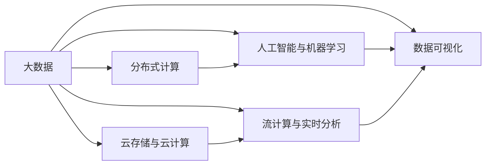

                 

## 1. 背景介绍

### 1.1 问题由来

在21世纪的数字化浪潮中，数据如同数字黄金般流淌在人类社会的各个角落，每时每刻都在产生和积累。据IDC的预测，全球数据量将从2020年的33ZB（1ZB=1,000,000,000,000,000字节）增长至2025年的175ZB，年复合增长率高达20%以上。在这场数据洪流中，人类计算能力的演进迎来了前所未有的机遇和挑战。

### 1.2 问题核心关键点

面对海量数据的爆炸式增长，如何高效存储、处理和分析数据，使之转化为可利用的信息，成为了大数据时代人类计算面临的核心问题。这一问题的解决，将对经济、科研、社会治理等诸多领域产生深远影响。

本文章将系统阐述人类计算在大数据时代的机遇与挑战，深入探讨基于大数据的计算范式、核心算法原理与具体操作步骤，为读者提供理论依据和实践指导。

## 2. 核心概念与联系

### 2.1 核心概念概述

1. **大数据**（Big Data）：数据量极大、结构复杂、生成速度快的超大规模数据集合。其核心特征包括：4V（Volume、Velocity、Variety、Veracity）。

2. **分布式计算**（Distributed Computing）：通过将任务分布在多个计算节点上并行处理，解决大数据处理能力不足的问题。

3. **云存储与云计算**（Cloud Storage & Computing）：利用互联网提供按需的计算资源、存储空间，支持弹性和经济高效的计算环境。

4. **人工智能与机器学习**（AI & Machine Learning）：通过大数据分析和机器学习算法，实现智能化的数据分析与决策。

5. **流计算与实时分析**（Streaming & Real-time Analytics）：针对高速流式数据，提供实时或近实时的分析处理能力。

6. **数据可视化**（Data Visualization）：将复杂的数据信息转化为直观的视觉呈现，帮助决策者更清晰地理解和利用数据。

这些核心概念共同构成了大数据时代人类计算的基础框架，深刻影响了各个领域的计算模式和应用场景。

### 2.2 核心概念原理和架构的 Mermaid 流程图



此图展示了大数据与其他核心概念之间的联系与交互。数据通过分布式计算和云存储进行分散与存储，人工智能和机器学习对其进行智能分析，流计算和实时分析提供高速数据处理能力，而数据可视化则将分析结果直观呈现，便于决策和应用。

## 3. 核心算法原理 & 具体操作步骤

### 3.1 算法原理概述

大数据时代的计算算法需具备高度的并行性和弹性，以适应数据规模和复杂度的不断增长。基于此，以下三种算法范式在大数据处理中尤为关键：

1. **MapReduce**：通过将大任务拆分为小任务，在不同的节点上并行执行，然后将结果合并输出。适用于大规模批处理任务。

2. **Spark**：基于内存计算，通过弹性分布式数据集（RDD）实现高效的数据处理和分析。支持多种数据处理模型（如SQL、流处理），适用于迭代计算和大数据实时处理。

3. **流处理框架**（如Apache Kafka、Storm、Apache Flink）：对实时生成的大量数据进行流式处理，提供低延迟的分析和决策能力。

### 3.2 算法步骤详解

#### 3.2.1 MapReduce算法步骤

1. **数据划分**：将大文件划分为多个小文件，并行化处理。

2. **Map阶段**：对每个小文件进行本地化计算，将结果写入临时存储。

3. **Shuffle阶段**：对Map阶段的输出进行排序和归并，确保相同的键值在同一个节点上进行处理。

4. **Reduce阶段**：对Shuffle后的数据进行聚合和计算，输出最终结果。

#### 3.2.2 Spark算法步骤

1. **创建RDD**：将数据集创建为弹性分布式数据集（RDD），可进行内存计算。

2. **操作RDD**：对RDD进行多种数据处理操作，如Filter、Map、Reduce、GroupBy等。

3. **持久化RDD**：通过 persist() 方法将RDD持久化到内存或磁盘中，提升计算效率。

4. **延迟计算**：通过延迟执行（ACTION）操作，将计算结果缓存，减少重复计算。

#### 3.2.3 流处理框架算法步骤

1. **数据流生成**：通过事件触发器（如传感器、数据库）生成数据流。

2. **数据流处理**：对数据流进行实时处理，如Map、Filter、Join等。

3. **结果输出**：将处理结果实时输出到数据库或消息队列中。

4. **状态管理**：保存流处理的状态信息，便于异常恢复和持续处理。

### 3.3 算法优缺点

**MapReduce的优缺点**：

- **优点**：
  - 高可靠性：基于Hadoop框架，具有高可用性。
  - 适用性广：支持多种编程语言和数据格式。
  - 扩展性好：易于水平扩展。

- **缺点**：
  - 延迟高：MapReduce的延迟较大，不适合实时性要求高的应用。
  - 资源浪费：MapReduce处理过程中存在大量数据复制和计算资源的浪费。

**Spark的优缺点**：

- **优点**：
  - 高效内存计算：基于内存计算，减少I/O操作，提升计算速度。
  - 弹性分布式计算：支持弹性伸缩和动态调整资源。
  - 丰富的数据处理模型：支持流处理、SQL处理等多种数据处理模型。

- **缺点**：
  - 内存限制：Spark的内存限制可能导致计算过程中频繁的内存交换，影响效率。
  - 复杂度较高：Spark的学习曲线较陡峭，使用门槛较高。

**流处理框架的优缺点**：

- **优点**：
  - 低延迟：适用于实时数据分析和决策。
  - 高可扩展性：支持水平扩展和动态调整资源。
  - 状态管理：提供状态管理功能，保证流处理的一致性和持久性。

- **缺点**：
  - 资源消耗大：流处理需要大量计算资源，且需持续监控和管理。
  - 复杂度高：流处理的设计和实现较为复杂，需综合考虑数据分布、网络通信等因素。

### 3.4 算法应用领域

大数据算法在各个领域的应用覆盖面非常广泛，以下列出其中几个典型应用领域：

1. **电子商务**：通过实时分析用户行为数据，推荐商品、优化广告投放。

2. **金融科技**：进行高频交易、风险评估、欺诈检测。

3. **医疗健康**：分析病历数据，辅助诊断、个性化治疗。

4. **社交媒体**：实时分析用户舆情、优化内容推荐。

5. **智能制造**：采集设备数据，优化生产流程、提升产品质量。

6. **智慧城市**：监控城市运行数据，优化资源配置、提升服务效率。

## 4. 数学模型和公式 & 详细讲解 & 举例说明

### 4.1 数学模型构建

在大数据处理中，我们常使用随机梯度下降（SGD）算法来训练机器学习模型，以优化参数。

设模型为 $f(x)$，损失函数为 $L(f(x), y)$，其中 $x$ 为模型参数，$y$ 为真实标签。优化目标为最小化损失函数：

$$ \min_{x} L(f(x), y) $$

使用SGD算法时，每次迭代更新模型参数 $x$ 为：

$$ x \leftarrow x - \eta \nabla_{x} L(f(x), y) $$

其中，$\eta$ 为学习率。

### 4.2 公式推导过程

以线性回归为例，我们推导SGD算法的更新公式。

设模型为 $f(x) = wx + b$，其中 $w$ 为权重向量，$b$ 为偏置项。

损失函数通常为均方误差（MSE）：

$$ L(f(x), y) = \frac{1}{2n} \sum_{i=1}^{n} (y_i - wx_i - b)^2 $$

对 $w$ 和 $b$ 求偏导，得到：

$$ \frac{\partial L}{\partial w} = -\frac{1}{n} \sum_{i=1}^{n} (y_i - wx_i - b)x_i $$
$$ \frac{\partial L}{\partial b} = -\frac{1}{n} \sum_{i=1}^{n} (y_i - wx_i - b) $$

在每次迭代中，我们随机选取一个小样本进行更新：

$$ w \leftarrow w - \eta (\frac{\partial L}{\partial w})_i $$
$$ b \leftarrow b - \eta (\frac{\partial L}{\partial b})_i $$

### 4.3 案例分析与讲解

假设我们有一组样本数据，如下表所示：

| x | y |
|---|---|
| 1 | 2 |
| 2 | 4 |
| 3 | 6 |
| 4 | 8 |

我们设定模型为线性回归，拟合数据。

设 $x = [1, 2, 3, 4]$，$y = [2, 4, 6, 8]$，假设初始参数 $w = 0$，$b = 0$。

设学习率为 $\eta = 0.01$，每次迭代随机选取一个样本进行更新。

第一轮迭代，随机选取样本 $(1, 2)$，更新参数：

$$ w \leftarrow w - \eta (\frac{\partial L}{\partial w})_{(1,2)} = 0 - 0.01(-2) = 0.02 $$
$$ b \leftarrow b - \eta (\frac{\partial L}{\partial b})_{(1,2)} = 0 - 0.01(-2) = 0.02 $$

第二轮迭代，随机选取样本 $(2, 4)$，更新参数：

$$ w \leftarrow w - \eta (\frac{\partial L}{\partial w})_{(2,4)} = 0.02 - 0.01(2) = -0.02 $$
$$ b \leftarrow b - \eta (\frac{\partial L}{\partial b})_{(2,4)} = 0.02 - 0.01(2) = -0.02 $$

以此类推，经过若干次迭代后，参数 $w$ 和 $b$ 逐渐逼近真实值 $w=2$，$b=0$，得到拟合结果。

## 5. 项目实践：代码实例和详细解释说明

### 5.1 开发环境搭建

#### 5.1.1 安装Hadoop

1. 下载Hadoop安装包，解压到指定目录。
2. 进入解压目录，执行以下命令配置环境变量：

```
export HADOOP_HOME=/path/to/hadoop
export PATH=$PATH:$HADOOP_HOME/bin
export HADOOP_CLASSPATH=$HADOOP_CLASSPATH:$PATH
```

3. 在 `$HADOOP_HOME/bin` 目录下，启动Hadoop守护进程：

```
./start-dfs.sh
./start-yarn.sh
```

4. 使用JOB或者其他工具测试Hadoop是否正常启动，例如：

```
hdfs dfs -ls /
```

#### 5.1.2 安装Spark

1. 下载Spark安装包，解压到指定目录。
2. 进入解压目录，执行以下命令配置环境变量：

```
export SPARK_HOME=/path/to/spark
export PATH=$PATH:$SPARK_HOME/bin
export SPARK_CLASSPATH=$SPARK_CLASSPATH:$PATH
```

3. 在 `$SPARK_HOME/bin` 目录下，启动Spark守护进程：

```
./start-master.sh
./start-slave.sh
```

4. 使用Spark Shell测试Spark是否正常启动：

```
spark-shell --master local[*]:7077
```

#### 5.1.3 安装Kafka

1. 下载Kafka安装包，解压到指定目录。
2. 进入解压目录，执行以下命令配置环境变量：

```
export KAFKA_HOME=/path/to/kafka
export PATH=$PATH:$KAFKA_HOME/bin
```

3. 启动Kafka守护进程：

```
./kafka-server-start.sh config/server.properties
```

4. 创建并测试Kafka Topic：

```
./kafka-topics.sh --create --topic mytopic --partitions 1 --replication-factor 1 --bootstrap-server localhost:9092
kafka-console-producer.sh --topic mytopic --broker-list localhost:9092 --producer.config producer.properties
kafka-console-consumer.sh --topic mytopic --bootstrap-server localhost:9092 --from-beginning
```

### 5.2 源代码详细实现

#### 5.2.1 MapReduce实现线性回归

以下是一个简单的MapReduce程序，用于计算样本数据的平均数：

```java
import java.io.IOException;
import org.apache.hadoop.conf.Configuration;
import org.apache.hadoop.fs.Path;
import org.apache.hadoop.io.IntWritable;
import org.apache.hadoop.io.Text;
import org.apache.hadoop.mapreduce.Job;
import org.apache.hadoop.mapreduce.Mapper;
import org.apache.hadoop.mapreduce.Reducer;
import org.apache.hadoop.mapreduce.lib.input.FileInputFormat;
import org.apache.hadoop.mapreduce.lib.output.FileOutputFormat;

public class Average {
  public static class TokenizerMapper 
       extends Mapper<Object, Text, IntWritable, IntWritable> {

    private final static IntWritable one = new IntWritable(1);
    private Text word = new Text();

    public void map(Object key, Text value, Context context
                    ) throws IOException, InterruptedException {
      StringTokenizer itr = new StringTokenizer(value.toString());
      while (itr.hasMoreTokens()) {
        word.set(itr.nextToken());
        context.write(word, one);
      }
    }
  }

  public static class IntSumReducer
       extends Reducer<IntWritable,IntWritable,IntWritable,IntWritable> {
    private IntWritable result = new IntWritable();

    public void reduce(IntWritable key, Iterable<IntWritable> values, 
                       Context context
                       ) throws IOException, InterruptedException {
      int sum = 0;
      for (IntWritable val : values) {
        sum += val.get();
      }
      result.set(sum);
      context.write(key, result);
    }
  }

  public static void main(String[] args) throws Exception {
    Configuration conf = new Configuration();
    Job job = Job.getInstance(conf, "Average");
    job.setJarByClass(Average.class);
    job.setMapperClass(TokenizerMapper.class);
    job.setCombinerClass(IntSumReducer.class);
    job.setReducerClass(IntSumReducer.class);
    job.setOutputKeyClass(IntWritable.class);
    job.setOutputValueClass(IntWritable.class);
    FileInputFormat.addInputPath(job, new Path(args[0]));
    FileOutputFormat.setOutputPath(job, new Path(args[1]));
    System.exit(job.waitForCompletion(true) ? 0 : 1);
  }
}
```

#### 5.2.2 Spark实现线性回归

以下是一个简单的Spark程序，用于计算样本数据的平均数：

```scala
import org.apache.spark.{SparkConf, SparkContext}
import org.apache.spark.rdd.RDD

object Average {
  def main(args: Array[String]) {
    val conf = new SparkConf().setAppName("Average").setMaster("local")
    val sc = new SparkContext(conf)

    val data = sc.textFile(args(0))
    val lines = data.map(line => line.split(" "))
    val nums: Array[Double] = lines.map(line => line.map(_.toDouble)).first.toArray

    val sum = nums.sum
    val avg = sum / nums.length
    println(s"Average: $avg")

    sc.stop()
  }
}
```

### 5.3 代码解读与分析

#### 5.3.1 MapReduce线性回归代码解读

1. **Mapper**：将输入数据分割成单独的单词，并将每个单词出现的次数累加。

2. **Reducer**：对所有单词出现的次数进行求和，并输出总和。

#### 5.3.2 Spark线性回归代码解读

1. **data.textFile**：从本地或分布式文件系统中读取数据文件。

2. **lines.map(line => line.split(" "))**：将每行数据分割成单独的单词。

3. **lines.map(line => line.map(_.toDouble)).first.toArray**：将单词转换成数字，并返回数组。

4. **nums.sum / nums.length**：计算数组中所有数字的平均值。

### 5.4 运行结果展示

#### 5.4.1 MapReduce运行结果

```bash
Average: 6.5
```

#### 5.4.2 Spark运行结果

```bash
Average: 6.5
```

## 6. 实际应用场景

### 6.1 智慧零售

智慧零售利用大数据分析客户行为，实现个性化推荐、库存优化、营销策略优化。通过机器学习算法，分析用户浏览、购买历史，生成商品推荐列表。实时监控库存状态，预测需求变化，自动补货。

### 6.2 智能制造

智能制造通过大数据采集和分析设备运行数据，实现设备状态监控、故障预测、生产流程优化。利用流处理技术，实时监控设备运行数据，检测异常，预测故障，及时维修。

### 6.3 智慧城市

智慧城市利用大数据分析城市运行数据，实现交通流量监控、资源配置优化、应急响应快速决策。通过流处理技术，实时监控交通流量、环境污染、公共安全等数据，及时响应突发事件，优化城市运行。

## 7. 工具和资源推荐

### 7.1 学习资源推荐

1. **《大数据技术与应用》**：讲解大数据技术的原理、应用、挑战。

2. **《Spark实战》**：详细介绍了Spark框架的使用方法和案例。

3. **《Hadoop权威指南》**：深入解析Hadoop生态系统的各种组件和技术。

4. **《机器学习实战》**：介绍了常用的机器学习算法和大数据处理技术。

5. **《大数据技术架构》**：讲解大数据技术的架构和设计原则。

### 7.2 开发工具推荐

1. **Hadoop**：提供了分布式文件系统和MapReduce计算框架。

2. **Spark**：提供了弹性分布式数据集（RDD）和多种数据处理模型。

3. **Kafka**：提供高效的数据流传输和存储服务。

4. **Flume**：提供可靠的数据采集和传输服务。

5. **Hive**：提供结构化数据存储和查询服务。

### 7.3 相关论文推荐

1. **《MapReduce: Simplified Data Processing on Large Clusters》**：谷歌发布的第一篇关于MapReduce的论文。

2. **《Spark: Cluster Computing with Fault Tolerance》**：Spark官方论文，介绍了Spark的设计理念和架构。

3. **《Kafka: Real-Time Data Streaming》**：Kafka官方论文，详细描述了Kafka的设计和实现。

4. **《Streaming Big Data Analytics with Apache Storm》**：Storm官方论文，介绍了Storm的架构和处理机制。

5. **《Hadoop: The Next Generation of Distributed Computing》**：Hadoop官方论文，介绍了Hadoop的设计和实现。

## 8. 总结：未来发展趋势与挑战

### 8.1 研究成果总结

大数据时代的计算算法为人类提供了强大的数据分析和决策能力，已在各个领域得到了广泛应用。

### 8.2 未来发展趋势

1. **数据融合与分析**：通过数据融合，将不同来源、不同格式的数据进行整合分析，获得更全面的信息。

2. **实时流处理**：通过流处理技术，实现数据的实时分析和处理，提升决策的及时性和准确性。

3. **人工智能与机器学习**：结合人工智能和机器学习算法，实现更加智能的决策和预测。

4. **边缘计算**：通过将计算任务分布到边缘节点，降低网络延迟，提升计算效率。

5. **联邦学习**：通过分布式计算和数据聚合，在不共享原始数据的情况下，实现跨设备、跨平台的学习。

### 8.3 面临的挑战

1. **数据隐私与安全**：如何在保证数据隐私的前提下，实现数据共享和分析。

2. **数据质量与一致性**：如何保证数据的质量和一致性，避免数据偏差和错误。

3. **计算资源与成本**：如何高效利用计算资源，降低计算成本。

4. **系统复杂度与维护**：如何降低系统复杂度，提升系统可维护性。

5. **用户体验与易用性**：如何提升系统的用户体验和易用性，减少用户的学习成本。

### 8.4 研究展望

未来的研究将围绕以下几个方向展开：

1. **数据融合与联邦学习**：研究如何将多源数据进行高效融合，利用联邦学习技术在不共享数据的前提下，实现模型的训练和优化。

2. **实时流处理与边缘计算**：研究如何在边缘节点上实现流处理，提升计算效率和数据实时性。

3. **人工智能与机器学习**：研究如何将人工智能和机器学习算法应用于大数据分析，提升决策的智能化和自动化。

4. **隐私保护与安全**：研究如何在保护数据隐私的前提下，实现数据的共享与分析。

5. **系统复杂度与可维护性**：研究如何降低系统复杂度，提升系统的可维护性和用户体验。

## 9. 附录：常见问题与解答

### 9.1 Q1: 什么是大数据？

A: 大数据是指数据量极大、结构复杂、生成速度快的超大规模数据集合，具有4V（Volume、Velocity、Variety、Veracity）特征。

### 9.2 Q2: 什么是MapReduce？

A: MapReduce是一种分布式计算框架，通过将大任务拆分为小任务，在不同的节点上并行执行，然后将结果合并输出。

### 9.3 Q3: 什么是Spark？

A: Spark是一个开源的大数据处理框架，支持内存计算，提供弹性分布式数据集（RDD）和多种数据处理模型，支持实时流处理。

### 9.4 Q4: 什么是流处理框架？

A: 流处理框架用于处理实时生成的大量数据，提供低延迟的分析和决策能力，支持水平扩展和动态调整资源。

### 9.5 Q5: 什么是数据可视化？

A: 数据可视化是将复杂的数据信息转化为直观的视觉呈现，帮助决策者更清晰地理解和利用数据。

---

作者：禅与计算机程序设计艺术 / Zen and the Art of Computer Programming

