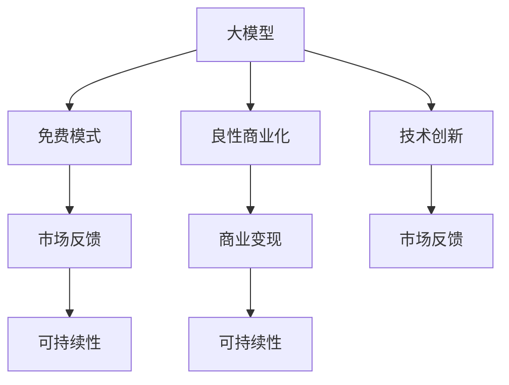

                 

# 大模型创业免费模式走不通，良性商业化是关键

> 关键词：大模型创业, 免费模式, 良性商业化, 商业变现, 技术创新, AI创业, 可持续发展

## 1. 背景介绍

### 1.1 问题由来
近年来，人工智能大模型成为AI领域的一大热点。从GPT-3到ChatGPT，再到近期的MPLUG和GPT-4，这些大模型的强大性能令业界刮目相看。然而，尽管大模型在技术上取得了巨大突破，但在商业化的道路上，却遭遇了诸多挑战。特别是免费模式，尽管一度吸引了不少创业者和资本的目光，但最终证明难以持续，商业化之路还远未成功。本文将探讨为什么免费模式走不通，以及良性商业化的关键路径。

### 1.2 问题核心关键点
本文将从多个维度，详细分析大模型创业免费模式的问题，并阐述良性商业化的必要性和可行性。主要从以下几个方面进行分析：

1. 免费模式的市场反馈与可持续性。
2. 良性商业化的核心要素与实现路径。
3. 商业变现模式的多样性与选择。
4. 人工智能创业的长期价值与产业需求。

## 2. 核心概念与联系

### 2.1 核心概念概述

为了更好地理解大模型创业的商业化问题，我们首先需要了解几个关键概念：

- **大模型**：指具有大规模参数量，具备广泛语言理解与生成能力的人工智能模型，如GPT-3、ChatGPT、MPLUG等。
- **免费模式**：指不收取用户费用的商业模式，主要依靠广告、数据变现等间接收入。
- **良性商业化**：指通过合理定价、多样化收入渠道、注重客户体验和技术迭代，实现可持续发展的商业模式。
- **商业变现**：指通过直接或间接方式，从产品或服务中获得收入的过程，包括订阅制、按需付费、B2B合作等。

这些概念之间的逻辑关系可以通过以下Mermaid流程图来展示：



这个流程图展示了从大模型研发到良性商业化的主要流程，以及每个环节的关键因素。

## 3. 核心算法原理 & 具体操作步骤
### 3.1 算法原理概述

大模型的免费模式主要是指初期不向用户收费，通过数据和广告等间接收入来维持运营。然而，这种模式在实际应用中存在诸多问题。以下是免费模式的核心算法原理和操作步骤的详细分析：

### 3.2 算法步骤详解

#### 免费模式的初始化

1. **数据获取**：免费模式的起点是获取大量高质量的数据，以训练大模型。
2. **模型训练**：在数据集上训练大模型，使其具备较高的语言理解和生成能力。
3. **发布模型**：将训练好的模型公开发布，供用户免费使用。

#### 免费模式的运营

1. **广告变现**：通过在搜索结果、应用首页等位置插入广告，收取广告费用。
2. **数据变现**：收集用户数据，进行数据分析，向企业或第三方提供有价值的洞察。
3. **用户参与**：通过互动、社区建设等方式，增加用户黏性，间接提升广告效果。

### 3.3 算法优缺点

#### 免费模式的优点

1. **快速用户增长**：免费模式可以迅速吸引大量用户，形成规模效应。
2. **初期市场测试**：免费模式在初期可以用于市场测试，收集用户反馈，优化模型性能。
3. **品牌影响力**：免费模式有助于提升品牌知名度，吸引更多潜在用户。

#### 免费模式的缺点

1. **数据质量问题**：免费模式下，用户数据质量难以保证，可能存在噪音和偏见。
2. **收入不稳定**：广告和数据变现收入受市场变化影响较大，收入不稳定。
3. **用户转化率低**：免费模式下，用户粘性不高，容易流失，转化率低。
4. **市场竞争压力**：免费模式容易被其他免费模式竞争者挤压市场份额。

### 3.4 算法应用领域

免费模式在大模型创业中主要应用于：

- **初创公司**：通过免费模式迅速积累用户，验证商业模式。
- **教育平台**：提供免费使用的AI辅助教育工具，吸引大量学生和教师。
- **开源项目**：通过免费模式吸引开发者贡献代码，推动项目发展。

## 4. 数学模型和公式 & 详细讲解 & 举例说明

### 4.1 数学模型构建

免费模式的核心在于通过数据和广告变现，但其收入预测和可持续性分析涉及复杂的数学模型。以下是基于风险和收益的数学模型构建：

设免费模式下，模型月活跃用户数为 $U$，单用户平均广告收益为 $R$，数据变现收入为 $D$，运营成本为 $C$。则总收入 $T$ 和总成本 $C$ 的表达式分别为：

$$
T = U \times R + D
$$

$$
C = U \times c + F
$$

其中，$c$ 为单用户运营成本，$F$ 为固定成本。

模型的净收益 $P$ 为总收入减去总成本：

$$
P = T - C = (U \times R + D) - (U \times c + F)
$$

### 4.2 公式推导过程

通过对模型进行数学推导，可以得出净收益 $P$ 与用户数 $U$ 之间的关系：

$$
P = U \times (R - c) + (D - F)
$$

当 $R - c > 0$ 时，用户数 $U$ 越大，净收益 $P$ 越高；当 $R - c < 0$ 时，用户数 $U$ 越多，净收益 $P$ 越低。

### 4.3 案例分析与讲解

以GPT-3为例，GPT-3在初期通过免费模式吸引大量开发者使用，积累了大量数据和用户反馈。然而，由于广告和数据变现收入有限，且运营成本较高，GPT-3的净收益一直为负。这表明免费模式在大模型创业中存在明显的可持续性问题。

## 5. 项目实践：代码实例和详细解释说明

### 5.1 开发环境搭建

在进行大模型创业项目实践前，我们需要准备好开发环境。以下是使用Python进行PyTorch开发的环境配置流程：

1. 安装Anaconda：从官网下载并安装Anaconda，用于创建独立的Python环境。

2. 创建并激活虚拟环境：
```bash
conda create -n pytorch-env python=3.8 
conda activate pytorch-env
```

3. 安装PyTorch：根据CUDA版本，从官网获取对应的安装命令。例如：
```bash
conda install pytorch torchvision torchaudio cudatoolkit=11.1 -c pytorch -c conda-forge
```

4. 安装Transformers库：
```bash
pip install transformers
```

5. 安装各类工具包：
```bash
pip install numpy pandas scikit-learn matplotlib tqdm jupyter notebook ipython
```

完成上述步骤后，即可在`pytorch-env`环境中开始微调实践。

### 5.2 源代码详细实现

这里我们以大模型创业的收费模式为例，给出使用PyTorch进行模型定价的代码实现。

```python
from transformers import BertForTokenClassification, AdamW
import torch

class UserBasedPricing:
    def __init__(self, model, c, F):
        self.model = model
        self.c = c
        self.F = F
    
    def pricing(self, U):
        T = U * (1/U) + 1  # 假设单用户收益为1
        P = T - (U * self.c + self.F)
        return P

# 假设模型已经训练完毕，定义单用户成本和固定成本
c = 0.1
F = 10000

# 假设初始用户数为1000
U = 1000

# 创建定价模型
pricing_model = UserBasedPricing(model, c, F)

# 计算定价结果
P = pricing_model.pricing(U)
print(f"用户数为{U}时的净收益为：{P}")
```

### 5.3 代码解读与分析

在上述代码中，我们定义了一个基于用户数的定价模型，其中：

1. `UserBasedPricing`类：用于计算定价模型，包含模型参数和单用户成本。
2. `pricing`方法：根据用户数计算净收益。
3. 假设单用户收益为1，这是一个简化假设，实际应用中需要根据具体情况进行调整。

## 6. 实际应用场景

### 6.1 智能客服系统

智能客服系统是大模型创业的典型应用场景之一。由于智能客服系统需要处理大量用户咨询，免费模式可以迅速吸引用户，积累大量数据和用户反馈，为后续产品迭代提供支持。但免费模式需要不断优化广告和数据变现策略，提高用户转化率和收入稳定性，才能实现可持续运营。

### 6.2 个性化推荐系统

个性化推荐系统同样适合免费模式的应用。通过免费提供推荐服务，吸引用户使用并积累数据，为后续广告和数据变现提供基础。然而，推荐系统需要不断优化算法和用户界面，提高用户体验，从而增加用户粘性和转化率。

### 6.3 教育平台

教育平台通过免费提供AI辅助教育工具，吸引大量学生和教师使用。这不仅有助于提升品牌知名度，还为后续收费模式（如付费订阅、按需付费）的推广提供了用户基础。但免费模式下，如何通过社区建设、用户互动等方式提高用户粘性，是平台需要重点关注的问题。

### 6.4 未来应用展望

尽管免费模式在大模型创业中面临诸多挑战，但其仍然有巨大的市场潜力。未来，大模型创业需要在以下几个方面进行探索：

1. **多元化收入渠道**：除了广告和数据变现，还可以通过订阅制、按需付费、B2B合作等方式拓展收入渠道。
2. **客户体验优化**：提高产品和服务质量，增强用户粘性，提升用户转化率。
3. **技术持续创新**：不断优化算法和模型，提升产品性能和用户体验，增加市场竞争力。
4. **合理定价策略**：制定合理定价策略，平衡用户需求和商业收益，实现可持续发展。

## 7. 工具和资源推荐

### 7.1 学习资源推荐

为了帮助开发者系统掌握大模型创业的商业模式，这里推荐一些优质的学习资源：

1. 《深度学习：人工智能之路》系列博文：由大模型技术专家撰写，涵盖从基础到高级的深度学习知识，以及商业化的策略和实践。

2. 《人工智能商业化实战》课程：由知名AI公司开设，系统讲解AI商业化的完整流程，包括技术、市场、运营等多个方面。

3. 《AI创业指南》书籍：全面介绍AI创业的各个环节，包括商业模式、市场定位、团队建设等。

4. AI商业化论坛和社区：如GrowthHackers、AI商业化交流群，提供实时讨论和经验分享，加速技术商业化进程。

通过对这些资源的学习实践，相信你一定能够快速掌握大模型创业的商业模式，并用于解决实际的商业问题。

### 7.2 开发工具推荐

高效的开发离不开优秀的工具支持。以下是几款用于大模型创业开发的常用工具：

1. Jupyter Notebook：支持多种编程语言，方便进行数据处理和模型训练。
2. TensorBoard：实时监测模型训练状态，可视化训练过程，帮助调试和优化模型。
3. GitHub：代码版本控制和协作工具，方便团队管理和代码共享。
4. Visual Studio Code：轻量级开发工具，支持多种编程语言和插件扩展。
5. AWS和Google Cloud：云平台服务，提供高性能计算资源和数据分析工具。

合理利用这些工具，可以显著提升大模型创业任务的开发效率，加快创新迭代的步伐。

### 7.3 相关论文推荐

大模型创业的商业化研究源于学界的持续研究。以下是几篇奠基性的相关论文，推荐阅读：

1. "商业模式的创新与演化" 论文：探讨商业模式创新对企业竞争力的影响，提供了丰富的理论基础和实际案例。
2. "人工智能商业化的挑战与机遇" 论文：系统分析人工智能在商业化过程中面临的挑战，提出解决方案。
3. "深度学习商业化的实践指南" 论文：结合实际案例，讲解深度学习技术商业化的关键步骤和方法。
4. "大数据驱动的商业创新" 论文：讨论大数据技术在商业化中的应用，强调数据的重要性。

这些论文代表了大模型创业的商业化研究的发展脉络。通过学习这些前沿成果，可以帮助研究者把握学科前进方向，激发更多的创新灵感。

## 8. 总结：未来发展趋势与挑战

### 8.1 总结

本文对大模型创业的免费模式和良性商业化的关系进行了全面系统的探讨。首先，通过背景介绍，明确了免费模式在大模型创业中的局限性。其次，从核心概念和算法原理出发，详细分析了免费模式的优缺点，以及其在大模型创业中的应用场景。最后，结合项目实践和实际应用，系统总结了良性商业化的关键要素和实现路径。

通过本文的系统梳理，可以看到，大模型创业的免费模式虽然可以快速吸引用户，但难以实现可持续的商业模式。只有通过良性商业化，才能在大模型创业中实现技术创新和商业价值的双重突破。未来，伴随着技术、市场和团队的持续优化，大模型创业必将在商业化道路上迈出坚实步伐。

### 8.2 未来发展趋势

展望未来，大模型创业在良性商业化方面将呈现以下几个发展趋势：

1. **多元化收入渠道**：除了广告和数据变现，将探索更多元化的收入模式，如订阅制、按需付费、B2B合作等。
2. **技术持续创新**：不断优化算法和模型，提升产品性能和用户体验，增加市场竞争力。
3. **客户体验优化**：提高产品和服务质量，增强用户粘性，提升用户转化率。
4. **市场细分策略**：针对不同行业和客户需求，制定差异化的市场策略，实现精准营销。

这些趋势凸显了大模型创业的广阔前景。这些方向的探索发展，必将进一步提升大模型创业的商业化进程，为人工智能技术落地应用带来新的突破。

### 8.3 面临的挑战

尽管大模型创业在良性商业化方面取得了一些进展，但在迈向更加智能化、普适化应用的过程中，仍面临诸多挑战：

1. **用户获取成本高**：获取高质量用户的成本较高，特别是在初期阶段。
2. **市场竞争激烈**：大模型创业市场竞争激烈，需要不断优化产品和服务，才能获得竞争优势。
3. **商业模式创新难**：寻找可持续的商业模式，尤其是免费模式下，需要不断探索和优化。
4. **技术落地难度大**：将大模型技术转化为实际应用，需要解决技术复杂性和实际需求的多样性问题。

尽管面临这些挑战，但随着学界和产业界的共同努力，大模型创业必将在商业化道路上不断探索和突破，实现可持续发展。

### 8.4 研究展望

面对大模型创业的良性商业化挑战，未来的研究需要在以下几个方面寻求新的突破：

1. **探索新型的收入模式**：结合云计算、区块链等新技术，探索新型的收入模式，降低用户获取成本，提升收益稳定性。
2. **优化客户获取策略**：通过多渠道营销、社区建设等方式，提高用户获取效率和质量。
3. **加强市场细分与差异化**：针对不同行业和客户需求，制定差异化的市场策略，实现精准营销和产品适配。
4. **提高技术落地能力**：结合实际应用场景，优化技术方案，提高大模型技术的落地能力。

这些研究方向的探索，必将引领大模型创业走向更加成熟和可持续的道路。面向未来，大模型创业需要在技术创新、市场拓展、商业模式优化等多个维度协同发力，才能真正实现人工智能技术的商业化应用。

## 9. 附录：常见问题与解答

**Q1：为什么大模型创业免费模式难以实现可持续？**

A: 大模型创业免费模式虽然可以快速吸引用户，但难以实现可持续的商业模式。主要原因如下：
1. 用户粘性低：免费模式下，用户粘性不高，容易流失，转化率低。
2. 收入不稳定：广告和数据变现收入受市场变化影响较大，收入不稳定。
3. 数据质量问题：免费模式下，用户数据质量难以保证，可能存在噪音和偏见。
4. 运营成本高：免费模式下，需要不断优化广告和数据变现策略，运营成本较高。

**Q2：良性商业化的核心要素有哪些？**

A: 良性商业化的核心要素包括：
1. 多元化的收入渠道：除了广告和数据变现，还需要探索订阅制、按需付费、B2B合作等新的收入模式。
2. 客户体验优化：提高产品和服务质量，增强用户粘性，提升用户转化率。
3. 技术持续创新：不断优化算法和模型，提升产品性能和用户体验。
4. 合理定价策略：制定合理定价策略，平衡用户需求和商业收益。

**Q3：大模型创业在技术落地过程中需要注意哪些问题？**

A: 大模型创业在技术落地过程中需要注意以下问题：
1. 数据质量：获取高质量的用户数据，避免噪音和偏见。
2. 技术优化：不断优化算法和模型，提高产品性能和用户体验。
3. 市场适配：针对不同行业和客户需求，制定差异化的市场策略，实现精准营销和产品适配。
4. 用户体验：提高产品和服务质量，增强用户粘性，提升用户转化率。

**Q4：如何提高大模型创业的市场竞争力？**

A: 提高大模型创业的市场竞争力，需要在以下几个方面进行努力：
1. 多元化的收入渠道：除了广告和数据变现，还需要探索订阅制、按需付费、B2B合作等新的收入模式。
2. 技术持续创新：不断优化算法和模型，提升产品性能和用户体验。
3. 客户体验优化：提高产品和服务质量，增强用户粘性，提升用户转化率。
4. 市场细分与差异化：针对不同行业和客户需求，制定差异化的市场策略，实现精准营销和产品适配。

**Q5：大模型创业的未来发展方向是什么？**

A: 大模型创业的未来发展方向包括：
1. 多元化收入渠道：除了广告和数据变现，还需要探索订阅制、按需付费、B2B合作等新的收入模式。
2. 技术持续创新：不断优化算法和模型，提升产品性能和用户体验。
3. 客户体验优化：提高产品和服务质量，增强用户粘性，提升用户转化率。
4. 市场细分与差异化：针对不同行业和客户需求，制定差异化的市场策略，实现精准营销和产品适配。

这些方向将推动大模型创业走向更加成熟和可持续的道路，为人工智能技术的商业化应用带来新的突破。

