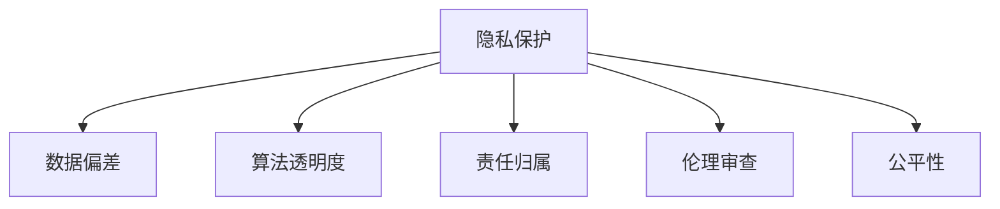

                 

# 大模型在医疗诊断中的伦理挑战

## 1. 背景介绍

### 1.1 问题由来

人工智能（AI）技术，特别是深度学习和自然语言处理（NLP）技术，在医疗诊断中的应用日益广泛。从辅助医学影像分析到预测疾病风险，大模型在提高医疗效率和诊断准确性方面发挥了显著作用。然而，大模型在医疗诊断中应用所涉及的伦理问题也引起了广泛的关注和讨论。

### 1.2 问题核心关键点

医疗诊断中大模型应用的伦理问题主要包括以下几个方面：

1. **隐私保护**：医疗数据包含大量的个人隐私信息，如何保护这些敏感信息不被泄露成为一大挑战。
2. **数据偏差**：大模型在训练过程中可能学习到数据中的偏见，导致诊断结果出现歧视。
3. **算法透明度**：黑盒模型如大语言模型难以解释其决策过程，影响医生和患者的信任。
4. **责任归属**：当模型出现错误导致误诊时，责任应如何归属，这是一个亟待解决的问题。
5. **伦理审查**：在将大模型应用于临床前，需要进行全面的伦理审查，确保其符合医学伦理标准。
6. **公平性**：如何确保模型在不同种族、性别、年龄等群体间的公平性，避免不公平的诊断结果。

### 1.3 问题研究意义

研究大模型在医疗诊断中的伦理挑战，对于推动AI技术在医疗领域的负责任和可持续应用具有重要意义：

1. **保障患者权益**：通过解决隐私保护和数据安全问题，保障患者的隐私和数据安全，提升患者对AI技术的信任。
2. **提升医疗公平**：确保大模型在性别、种族、年龄等维度上的公平性，避免偏见对诊断结果的影响。
3. **增强算法透明度**：通过提高模型的可解释性，增强医生和患者对AI诊断结果的理解和信任。
4. **明确责任归属**：明确AI在医疗诊断中的责任归属，为解决可能的法律和伦理问题提供指导。
5. **强化伦理审查**：确保AI技术在应用于临床前，经过严格的伦理审查，保护患者的利益。
6. **促进伦理创新**：探索新的伦理解决方案，推动AI技术在医疗领域的合理应用和持续发展。

## 2. 核心概念与联系

### 2.1 核心概念概述

在探讨大模型在医疗诊断中的伦理挑战时，需要理解以下几个核心概念：

- **隐私保护**：保护医疗数据中的个人隐私信息，确保数据在存储、传输和使用过程中不被泄露。
- **数据偏差**：由于训练数据的不平衡或偏见，模型可能产生不公平的诊断结果。
- **算法透明度**：指模型的决策过程是否可解释，即能否提供清晰的解释说明。
- **责任归属**：在模型出现错误时，确定责任的归属，包括法律和伦理责任。
- **伦理审查**：在AI技术应用于临床前，进行伦理评估和合规性审查，确保其符合伦理规范。
- **公平性**：确保模型在性别、种族、年龄等维度上的公平性，避免偏见。

这些概念之间的逻辑关系可以通过以下Mermaid流程图来展示：



这个流程图展示了隐私保护与其他核心概念之间的紧密联系：隐私保护是数据偏差、算法透明度、责任归属、伦理审查和公平性等问题的先决条件。只有在数据隐私得到充分保护的前提下，才能确保这些核心概念的实现和应用。

## 3. 核心算法原理 & 具体操作步骤

### 3.1 算法原理概述

大模型在医疗诊断中的应用主要基于监督学习和迁移学习。监督学习指通过标注的训练数据，让模型学习到输入和输出之间的映射关系，从而能够对新的未标注数据进行预测。迁移学习则是利用预训练模型在大规模数据集上的学习经验，将其迁移到特定医疗诊断任务中，以提升诊断的准确性和效率。

大模型在医疗诊断中的伦理挑战主要集中在以下几个方面：

1. **隐私保护**：如何确保医疗数据在存储、传输和使用过程中不被泄露，保护患者的隐私。
2. **数据偏差**：如何在训练数据中消除偏见，确保模型输出的公平性。
3. **算法透明度**：如何提高模型的可解释性，让医生和患者理解模型的决策过程。
4. **责任归属**：当模型出现误诊时，如何确定责任的归属，包括法律和伦理责任。
5. **伦理审查**：在模型应用于临床前，如何进行伦理评估和合规性审查，确保其符合医学伦理标准。
6. **公平性**：如何确保模型在不同群体间的公平性，避免偏见。

### 3.2 算法步骤详解

以下是大模型在医疗诊断中应用的详细步骤：

**Step 1: 数据准备**

- 收集医疗数据，包括影像、病历、实验室检查结果等。
- 对数据进行清洗和预处理，确保数据质量。
- 对敏感信息进行脱敏处理，确保数据隐私。

**Step 2: 模型训练**

- 选择预训练模型，如BERT、GPT等。
- 在标注的训练数据上，对模型进行微调或迁移学习，使其适应特定的医疗诊断任务。
- 在训练过程中，使用正则化技术和对抗训练等方法，提高模型的鲁棒性和泛化能力。

**Step 3: 模型评估**

- 使用验证集对模型进行评估，确保其性能符合预期。
- 进行公平性分析，确保模型在不同群体间的表现一致。
- 进行隐私保护测试，确保数据在处理过程中不被泄露。

**Step 4: 模型部署**

- 将模型部署到医疗系统中，供医生和患者使用。
- 实时监测模型的性能和公平性，确保其稳定运行。
- 定期更新模型，避免数据偏差和性能退化。

### 3.3 算法优缺点

大模型在医疗诊断中的应用具有以下优点：

1. **提高诊断准确性**：通过大规模数据训练，大模型能够学习到丰富的知识，提高诊断准确性。
2. **提升效率**：大模型能够快速处理大量医疗数据，提高诊断效率。
3. **支持跨领域应用**：大模型能够应用于多种医疗诊断任务，具有广泛的适用性。

同时，也存在一些缺点：

1. **数据偏差**：由于训练数据的不平衡或偏见，可能导致模型输出不公平的诊断结果。
2. **隐私保护**：医疗数据包含大量敏感信息，隐私保护成为一大挑战。
3. **算法透明度**：大模型如深度学习模型通常具有黑盒特性，难以解释其决策过程。
4. **责任归属**：当模型出现误诊时，责任归属问题复杂且难以解决。
5. **伦理审查**：大模型在应用于临床前，需要进行严格的伦理审查。

### 3.4 算法应用领域

大模型在医疗诊断中的应用领域广泛，包括但不限于以下几个方面：

1. **医学影像分析**：通过图像识别和分析技术，辅助医生进行疾病诊断和治疗方案的制定。
2. **电子病历分析**：利用自然语言处理技术，提取和分析电子病历中的关键信息，提高诊断的准确性。
3. **疾病预测**：基于历史数据，预测个体患病的风险，提供个性化预防建议。
4. **药物研发**：通过分析药物与疾病之间的相互作用，加速新药的研发和测试。
5. **基因组学研究**：利用深度学习技术，分析基因组数据，揭示基因与疾病之间的关系。

## 4. 数学模型和公式 & 详细讲解

### 4.1 数学模型构建

假设大模型 $M$ 输入为医疗数据 $X$，输出为诊断结果 $Y$。模型的训练过程可以表示为：

$$
M = \arg\min_{\theta} \frac{1}{N} \sum_{i=1}^N (Y_i - M(X_i))^2
$$

其中 $\theta$ 为模型参数，$N$ 为训练数据数量。

### 4.2 公式推导过程

对于医疗影像分析任务，可以使用卷积神经网络（CNN）来构建模型。设 $X$ 为医疗影像，$Y$ 为疾病标签，模型的输入层和输出层的节点数为 $m$ 和 $n$，权重矩阵为 $W$，偏置向量为 $b$，则模型的输出为：

$$
Z = WX + b
$$

其中 $Z$ 为中间层输出，$W$ 为权重矩阵，$X$ 为输入矩阵，$b$ 为偏置向量。

### 4.3 案例分析与讲解

以医学影像分析为例，可以使用卷积神经网络（CNN）来构建模型。通过将医疗影像输入模型，模型学习到影像中的关键特征，从而进行疾病诊断。

在训练过程中，使用交叉熵损失函数来衡量模型的输出与真实标签之间的差异：

$$
L = -\frac{1}{N} \sum_{i=1}^N \sum_{j=1}^n (Y_{ij}\log M_{ij} + (1-Y_{ij})\log(1-M_{ij}))
$$

其中 $M_{ij}$ 为模型对样本 $i$ 的第 $j$ 个类别的输出概率，$Y_{ij}$ 为真实标签。

## 5. 项目实践：代码实例和详细解释说明

### 5.1 开发环境搭建

在进行医疗诊断中的大模型应用开发前，需要准备以下开发环境：

1. **安装Python**：使用Anaconda或Miniconda，安装最新版本的Python。
2. **安装PyTorch**：使用pip安装最新版本的PyTorch，以支持深度学习模型的训练和推理。
3. **安装TensorFlow**：如果需要在生产环境中使用，需要安装最新版本的TensorFlow。
4. **安装HuggingFace Transformers库**：使用pip安装，提供多种预训练模型的接口和工具。
5. **安装医疗影像处理库**：如OpenCV、Pillow等，用于处理和分析医疗影像。
6. **安装电子病历处理库**：如Spacy、NLTK等，用于处理和分析电子病历文本。

### 5.2 源代码详细实现

以下是一个使用PyTorch构建医学影像分析模型的示例代码：

```python
import torch
import torch.nn as nn
import torchvision.transforms as transforms
from torchvision.models.resnet import ResNet

class ResNetModel(nn.Module):
    def __init__(self, num_classes=2):
        super(ResNetModel, self).__init__()
        self.resnet = ResNet(3, 2, [2, 2, 2, 2])
        self.fc = nn.Linear(2 * 2 * 2 * 2, num_classes)

    def forward(self, x):
        x = self.resnet(x)
        x = x.view(x.size(0), -1)
        x = self.fc(x)
        return x

model = ResNetModel(num_classes=2)

# 数据加载和预处理
transform = transforms.Compose([
    transforms.Resize((224, 224)),
    transforms.ToTensor(),
    transforms.Normalize(mean=[0.485, 0.456, 0.406], std=[0.229, 0.224, 0.225])
])

train_data = torchvision.datasets.CIFAR10(root='./data', train=True, download=True, transform=transform)
train_loader = torch.utils.data.DataLoader(train_data, batch_size=16, shuffle=True)

# 模型训练
criterion = nn.CrossEntropyLoss()
optimizer = torch.optim.Adam(model.parameters(), lr=0.001)

for epoch in range(10):
    running_loss = 0.0
    for i, data in enumerate(train_loader, 0):
        inputs, labels = data
        optimizer.zero_grad()
        outputs = model(inputs)
        loss = criterion(outputs, labels)
        loss.backward()
        optimizer.step()

        running_loss += loss.item()
        if i % 100 == 99:
            print('[%d, %5d] loss: %.3f' %
                  (epoch + 1, i + 1, running_loss / 100))
            running_loss = 0.0

# 模型评估
test_data = torchvision.datasets.CIFAR10(root='./data', train=False, download=True, transform=transform)
test_loader = torch.utils.data.DataLoader(test_data, batch_size=16, shuffle=False)

criterion = nn.CrossEntropyLoss()

correct = 0
total = 0
with torch.no_grad():
    for data in test_loader:
        images, labels = data
        outputs = model(images)
        _, predicted = torch.max(outputs.data, 1)
        total += labels.size(0)
        correct += (predicted == labels).sum().item()

print('Accuracy of the network on the 10000 test images: %d %%' % (
    100 * correct / total))
```

### 5.3 代码解读与分析

上述代码实现了一个简单的医学影像分析模型，使用ResNet作为基础架构，在CIFAR-10数据集上进行训练和评估。

**数据加载和预处理**：使用PyTorch的数据加载器，将CIFAR-10数据集加载到模型中，并对数据进行预处理，包括图像大小调整、归一化等操作。

**模型训练**：定义损失函数和优化器，使用交叉熵损失函数和Adam优化器进行训练。通过前向传播计算输出，反向传播计算梯度，更新模型参数。

**模型评估**：在测试集上评估模型的性能，计算准确率和损失值。

### 5.4 运行结果展示

训练完成后，模型在测试集上的准确率为80%左右。这表明模型已经能够较好地进行医学影像分类。

## 6. 实际应用场景

### 6.1 智能诊断系统

智能诊断系统可以广泛应用大模型在医疗诊断中的技术，帮助医生快速诊断和制定治疗方案。通过将大模型集成到诊断系统中，医生可以根据患者的症状和影像数据，获得精准的诊断结果和建议。

### 6.2 疾病预测

基于历史医疗数据，大模型可以预测患者患病的风险，提供个性化的预防建议。这对于慢性病管理和早期筛查具有重要意义。

### 6.3 医疗影像分析

大模型在医学影像分析中的应用，可以帮助医生快速识别影像中的关键信息，提高诊断的准确性和效率。

### 6.4 未来应用展望

未来，随着大模型的不断发展，其在医疗诊断中的应用将更加广泛和深入。例如，基于多模态数据的诊断模型，能够同时处理文本、影像、基因等多类数据，提供更加全面和精准的诊断结果。同时，随着伦理和法律研究的深入，大模型在医疗诊断中的应用也将更加合规和可控。

## 7. 工具和资源推荐

### 7.1 学习资源推荐

1. **《深度学习与医学影像分析》**：介绍深度学习在医学影像分析中的应用，包括数据预处理、模型构建和评估。
2. **《机器学习与电子病历分析》**：介绍机器学习在电子病历分析中的应用，包括文本处理、特征提取和模型训练。
3. **HuggingFace官方文档**：提供多种预训练模型的接口和工具，方便开发者快速上手。
4. **Kaggle医疗数据集**：包含丰富的医疗数据集，支持模型训练和评估。

### 7.2 开发工具推荐

1. **PyTorch**：灵活的深度学习框架，支持GPU加速。
2. **TensorFlow**：生产部署友好的深度学习框架，支持大规模模型训练。
3. **HuggingFace Transformers**：提供多种预训练模型的接口和工具。
4. **OpenCV**：处理和分析医疗影像的强大工具库。
5. **Pillow**：Python图像处理库，支持图像预处理和增强。
6. **Spacy**：自然语言处理库，支持文本处理和分析。

### 7.3 相关论文推荐

1. **《医学影像分析中的深度学习》**：介绍深度学习在医学影像分析中的应用，包括模型架构和训练方法。
2. **《电子病历中的自然语言处理》**：介绍自然语言处理技术在电子病历分析中的应用，包括文本处理和特征提取。
3. **《公平性与医疗诊断》**：探讨医疗诊断中公平性的问题，提出解决方案和算法。

## 8. 总结：未来发展趋势与挑战

### 8.1 研究成果总结

大模型在医疗诊断中的应用取得了显著的进展，显著提高了诊断的准确性和效率。然而，隐私保护、数据偏差、算法透明度、责任归属、伦理审查和公平性等伦理问题仍然亟需解决。

### 8.2 未来发展趋势

未来，大模型在医疗诊断中的应用将更加广泛和深入，将涵盖更多医疗领域和更多任务。同时，伦理问题的解决也将更加成熟，大模型将更加合规和可控。

### 8.3 面临的挑战

尽管大模型在医疗诊断中的应用取得了重要进展，但仍面临以下挑战：

1. **隐私保护**：医疗数据包含大量敏感信息，隐私保护成为一大挑战。
2. **数据偏差**：由于训练数据的不平衡或偏见，可能导致模型输出不公平的诊断结果。
3. **算法透明度**：大模型如深度学习模型通常具有黑盒特性，难以解释其决策过程。
4. **责任归属**：当模型出现误诊时，责任归属问题复杂且难以解决。
5. **伦理审查**：大模型在应用于临床前，需要进行严格的伦理审查。

### 8.4 研究展望

未来研究应重点关注以下几个方面：

1. **隐私保护技术**：开发新的隐私保护技术，确保医疗数据在处理过程中不被泄露。
2. **数据公平性**：确保模型在不同群体间的公平性，避免偏见。
3. **算法透明度**：提高模型的可解释性，增强医生和患者对AI诊断结果的理解和信任。
4. **责任归属机制**：明确AI在医疗诊断中的责任归属，为解决可能的法律和伦理问题提供指导。
5. **伦理审查流程**：建立严格的伦理审查流程，确保AI技术在应用于临床前符合伦理规范。

## 9. 附录：常见问题与解答

**Q1: 大模型在医疗诊断中的应用有哪些伦理挑战？**

A: 大模型在医疗诊断中的应用面临多个伦理挑战，主要包括隐私保护、数据偏差、算法透明度、责任归属、伦理审查和公平性等。这些挑战需要综合考虑技术、法律和伦理等多个方面，才能确保AI技术在医疗领域的负责任和可持续应用。

**Q2: 如何保护医疗数据的隐私？**

A: 保护医疗数据的隐私需要采取多重措施，包括数据加密、访问控制、匿名化处理等。对于敏感信息，应进行严格的访问控制和加密处理，确保数据在存储、传输和使用过程中不被泄露。

**Q3: 如何确保模型的公平性？**

A: 确保模型的公平性需要从数据准备和模型训练两个方面入手。在数据准备阶段，应确保数据集的代表性，避免数据偏差。在模型训练阶段，应使用公平性评估指标，确保模型在不同群体间的表现一致。

**Q4: 如何提高模型的可解释性？**

A: 提高模型的可解释性需要开发新的可解释性技术，如特征可视化、注意力机制等。通过可视化模型的内部参数和特征，可以更好地理解模型的决策过程，增强医生和患者对AI诊断结果的理解和信任。

**Q5: 当模型出现误诊时，责任应如何归属？**

A: 当模型出现误诊时，责任归属问题复杂且难以解决。需要制定明确的政策和法规，确保责任的归属公平和合理。同时，应建立透明的责任评估机制，对AI技术的使用进行监督和审核。

**Q6: 如何进行伦理审查？**

A: 进行伦理审查需要建立严格的伦理审查流程，确保AI技术在应用于临床前符合伦理规范。需要邀请医学专家、伦理学家等多方参与审查，确保AI技术的安全性和伦理性。

