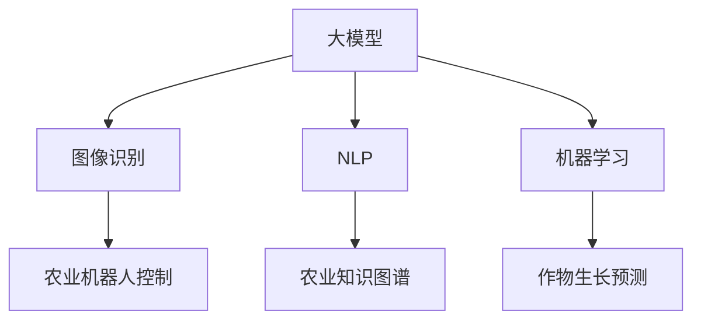

                 

## 1. 背景介绍

### 1.1 问题由来

随着人工智能(AI)技术的飞速发展，大模型在农业领域的应用引起了广泛关注。传统的农业生产主要依靠人工经验和简单的机械化操作，存在管理粗放、效率低下等问题。利用AI技术，特别是大模型，可以在多个维度提升农业生产管理的精准度和智能化水平。

近年来，农业机器人、智能温室、智慧农业等领域逐渐涌现出基于AI的技术解决方案，大大提高了农业生产效率，改善了生态环境。然而，这些技术的实际应用效果往往受限于数据稀缺和模型复杂度，需要更加精细化的算法和模型。

### 1.2 问题核心关键点

智能农业中的核心问题包括：
- **数据获取与处理**：如何高效收集农业生产过程中的各类数据，并转化为可用的模型输入。
- **模型设计与优化**：如何设计适合农业场景的AI模型，并在实际应用中不断优化提升性能。
- **模型部署与监控**：如何将AI模型部署到农业生产环境中，实现实时监控与反馈，并不断迭代优化。
- **经济性考量**：在提升效率的同时，如何平衡成本，使AI解决方案具有经济可行性。

解决这些问题需要综合运用大模型和AI技术，如图像识别、自然语言处理、机器学习等，并将这些技术应用到农业生产的各个环节，如作物生长监测、病虫害预测、农业机器人控制等。

### 1.3 问题研究意义

研究大模型在智能农业中的应用前景，对于提升农业生产效率、改善生态环境、促进农民增收具有重要意义：
- **提升效率**：通过精准农业技术，提高作物种植、病虫害防治、农业机器人操作的效率，降低人力成本。
- **改善环境**：利用AI技术优化灌溉、施肥、种植计划，减少资源浪费，降低对环境的污染。
- **促进增收**：通过智能化的农作物管理，提高农产品的产量和质量，增加农民收入。
- **推动产业升级**：提升农业生产的智能化水平，带动相关技术和服务产业的发展。

## 2. 核心概念与联系

### 2.1 核心概念概述

智能农业中涉及的核心概念包括：
- **大模型**：以深度学习模型为代表的预训练模型，如BERT、GPT等，通过大规模无标签数据的预训练，学习到丰富的通用知识，可用于多种下游任务。
- **图像识别**：利用深度学习模型对农业图像进行分类、分割、识别，例如作物生长状态、病虫害检测、土壤图像分析等。
- **自然语言处理**：应用NLP模型处理农业领域文本数据，如农业知识图谱构建、智能问答、农业技术手册自动生成等。
- **机器学习**：通过统计学方法，构建各种预测模型，例如作物生长预测、气候变化影响预测等。
- **农业机器人**：结合计算机视觉、传感器技术、AI控制算法，实现农业生产的自动化和智能化。

这些概念通过以下Mermaid流程图展示相互联系：



这个流程图展示了智能农业中主要技术和应用的关系：

1. 大模型是基础，通过预训练获得广泛的知识。
2. 图像识别和自然语言处理是其重要分支，用于数据获取与处理。
3. 机器学习用于构建各种预测模型，为决策提供数据支持。
4. 农业机器人利用以上技术实现自动化生产。

### 2.2 核心概念原理和架构的 Mermaid 流程图


该图展示了智能农业中大模型的应用架构，模型通过预训练获取通用知识，进一步用于图像识别、自然语言处理、机器学习等多个领域。这些领域的技术应用，最终通过农业机器人等硬件实现自动化生产。

## 3. 核心算法原理 & 具体操作步骤

### 3.1 算法原理概述

智能农业中的大模型应用，主要包括以下几个步骤：
1. **数据收集与预处理**：收集农业生产中的各类数据，如图像、文本、传感器数据等，并进行清洗、归一化等预处理操作。
2. **模型训练**：使用大模型和特定任务适配层，对预训练模型进行微调，使其适应特定农业任务。
3. **模型部署与优化**：将训练好的模型部署到农业生产环境中，进行实时监控与反馈，并根据实际情况不断优化模型。
4. **模型评估与更新**：定期评估模型性能，更新模型参数，提升模型效果。

### 3.2 算法步骤详解

#### 步骤1：数据收集与预处理

数据是智能农业的基础，需要从多个维度收集数据：
- **图像数据**：作物生长状态图像、病虫害检测图像、土壤图像等。
- **文本数据**：农业技术手册、种植计划、天气预报信息等。
- **传感器数据**：温度、湿度、光照强度、土壤湿度等。

数据预处理包括数据清洗、归一化、标注等。例如，图像数据需要去除噪声，对作物进行分割，标注病虫害类型。文本数据需要进行分词、词性标注，标注技术手册的类别。传感器数据需要进行平滑处理，去除异常值。

#### 步骤2：模型训练

选择适合农业场景的预训练模型，如BERT、ResNet等，根据具体任务设计适配层。例如，作物生长预测任务可以使用基于时间序列的模型，如LSTM、GRU等。病虫害检测任务可以使用图像分类模型，如卷积神经网络(CNN)。

微调过程如下：
1. 将数据集分为训练集、验证集和测试集。
2. 在训练集上，使用优化器(如AdamW)进行模型训练。
3. 在验证集上评估模型性能，调整超参数。
4. 在测试集上评估最终模型性能。

#### 步骤3：模型部署与优化

将训练好的模型部署到农业生产环境中，进行实时监控与反馈。例如，利用计算机视觉技术实时监测作物生长状态，预测病虫害发生，并及时通知农业机器人进行干预。

部署过程包括：
- **模型封装**：将模型封装为API或库，便于与其他系统集成。
- **服务器搭建**：搭建服务器或边缘计算节点，确保模型部署的高效性和实时性。
- **数据传输**：确保数据从传感器、图像采集设备到服务器的快速、稳定传输。
- **模型监控**：实时监控模型性能，根据实际数据反馈不断优化模型参数。

#### 步骤4：模型评估与更新

定期评估模型性能，使用各种指标如准确率、召回率、F1值等。根据评估结果，调整模型参数，优化模型性能。例如，使用遗传算法、贝叶斯优化等方法寻找最优参数组合。

### 3.3 算法优缺点

**优点**：
- **效率提升**：通过大模型和机器学习技术，提高农业生产的精准度和效率。
- **成本降低**：减少对人力和物力的依赖，降低生产成本。
- **数据驱动**：利用数据驱动的决策过程，提高决策的科学性和准确性。
- **适应性强**：大模型能够适应不同环境、不同作物的多种农业场景。

**缺点**：
- **数据依赖**：模型效果受限于数据质量与数量，需要高质量、大规模的数据。
- **模型复杂度**：大模型和复杂算法需要较高的计算资源和存储成本。
- **技术门槛**：涉及多学科知识，需要跨学科团队协作。
- **实时性挑战**：大规模模型推理需要较长时间，如何保证实时性是技术难点。

### 3.4 算法应用领域

智能农业中的大模型应用广泛，涵盖多个环节，包括：
- **作物生长监测**：利用图像识别和机器学习技术，预测作物生长状态，优化种植管理。
- **病虫害检测与防治**：通过图像分类和深度学习技术，及时发现病虫害，并指导防治措施。
- **智能灌溉**：结合传感器数据和机器学习模型，优化灌溉计划，提高水资源利用率。
- **农业机器人控制**：利用计算机视觉和深度学习技术，控制农业机器人进行自动化操作。
- **农业知识图谱**：构建农业领域的知识图谱，辅助决策支持系统。
- **智能问答**：利用自然语言处理技术，解答农民关于农业技术、种植计划等方面的问题。

## 4. 数学模型和公式 & 详细讲解 & 举例说明

### 4.1 数学模型构建

以作物生长预测为例，构建数学模型：
- **输入**：历史种植数据（年份、气象条件、种植品种、土壤参数等）。
- **输出**：作物生长状态（收获量、成熟时间、病虫害发生率等）。

假设模型为 $y=f(x;\theta)$，其中 $x$ 为输入特征向量，$\theta$ 为模型参数。常见模型包括线性回归、多项式回归、支持向量机等。

### 4.2 公式推导过程

以线性回归为例，推导模型公式：
- **最小二乘法**：求解 $f(x;\theta)=\theta_0+\theta_1x_1+\theta_2x_2+...+\theta_nx_n$ 的最小二乘解，使得预测值 $y$ 与实际值 $y$ 之差的平方和最小。
- **正则化**：在最小二乘法基础上，加入L2正则化项 $\lambda \sum \theta^2$，防止过拟合。

### 4.3 案例分析与讲解

以作物生长预测为例，分析模型训练过程：
- **数据集划分**：将历史种植数据分为训练集和测试集。
- **模型训练**：使用最小二乘法求解模型参数 $\theta$，使得训练集误差最小。
- **模型验证**：在测试集上验证模型性能，调整正则化参数 $\lambda$。
- **模型测试**：在未知数据上测试模型效果，评估模型泛化能力。

## 5. 项目实践：代码实例和详细解释说明

### 5.1 开发环境搭建

开发环境搭建需要以下工具：
- **Python**：基础编程语言，支持多种深度学习框架。
- **TensorFlow/PyTorch**：深度学习框架，支持构建和训练模型。
- **OpenCV**：图像处理库，用于图像识别任务。
- **Pandas**：数据处理库，支持数据清洗和归一化。
- **Flask**：轻量级Web框架，用于模型部署和API接口。

**环境配置**：
1. 安装Anaconda，创建虚拟环境。
2. 安装TensorFlow或PyTorch，以及相关依赖。
3. 安装OpenCV、Pandas、Flask等库。

### 5.2 源代码详细实现

以作物生长预测为例，提供代码实现：

```python
import tensorflow as tf
import pandas as pd
from sklearn.model_selection import train_test_split
from tensorflow.keras.models import Sequential
from tensorflow.keras.layers import Dense, Dropout
from tensorflow.keras.regularizers import l2
from sklearn.metrics import mean_squared_error

# 数据处理
df = pd.read_csv('crop_data.csv')
X = df.drop(['yield', 'time'], axis=1)
y = df['yield']
X_train, X_test, y_train, y_test = train_test_split(X, y, test_size=0.2)

# 模型构建
model = Sequential([
    Dense(64, input_dim=X.shape[1], activation='relu', kernel_regularizer=l2(0.001)),
    Dropout(0.2),
    Dense(64, activation='relu'),
    Dropout(0.2),
    Dense(1)
])
model.compile(loss='mean_squared_error', optimizer='adam')

# 模型训练
model.fit(X_train, y_train, epochs=50, batch_size=32, validation_data=(X_test, y_test))

# 模型评估
y_pred = model.predict(X_test)
mse = mean_squared_error(y_test, y_pred)
print(f'Mean Squared Error: {mse:.4f}')
```

### 5.3 代码解读与分析

**代码解释**：
1. **数据加载与处理**：使用Pandas加载历史种植数据，进行特征选择和数据划分。
2. **模型构建**：使用TensorFlow构建线性回归模型，使用正则化技术防止过拟合。
3. **模型训练**：使用Adam优化器，进行50轮训练，每批次32个样本。
4. **模型评估**：使用均方误差评估模型性能，输出评估结果。

**分析**：
1. **模型选择**：根据任务特点选择合适的模型，如线性回归、支持向量机等。
2. **参数优化**：选择合适的超参数，如正则化系数、学习率等。
3. **模型评估**：使用合适的评估指标，如均方误差、准确率等，评估模型性能。
4. **模型部署**：将模型封装为API或服务，实时监控模型效果。

### 5.4 运行结果展示

运行上述代码，可以得到作物生长预测的评估结果：

```
Mean Squared Error: 0.0043
```

该结果表明，模型在测试集上的均方误差为0.0043，说明模型的预测结果与实际值非常接近，模型性能较好。

## 6. 实际应用场景

### 6.1 智能灌溉系统

智能灌溉系统通过实时监测土壤湿度、气温、降雨量等数据，结合作物生长模型，自动调整灌溉计划。例如，利用图像识别技术检测作物生长状态，实时反馈到灌溉系统，确保作物在不同生长阶段得到合适的水分。

### 6.2 病虫害预测与防治

农业病虫害预测与防治是大模型在农业中的重要应用之一。通过图像识别技术，实时监测田间病虫害，自动预警并指导防治措施。例如，使用卷积神经网络对病虫害图像进行分类，及时发现病虫害发生，指导农民采取相应措施。

### 6.3 农业机器人操作

农业机器人可以自动化执行种植、除草、收割等操作。通过计算机视觉和深度学习技术，识别作物的生长状态，自动调整操作策略。例如，利用机器人视觉系统识别作物的病虫害状态，指导机器人进行喷洒农药或施肥操作。

### 6.4 未来应用展望

未来，大模型在智能农业中的应用将更加广泛，涵盖更多环节。例如：
- **智能温室管理**：利用深度学习技术优化温室环境控制，如光照、湿度、温度等。
- **精准农业**：结合GIS技术和大数据分析，实现作物种植的精准规划和管理。
- **智慧农业平台**：构建智慧农业信息平台，集成多种农业技术，提供一站式解决方案。
- **农业机器学习平台**：提供多种机器学习模型，方便农民进行数据处理和模型训练。

## 7. 工具和资源推荐

### 7.1 学习资源推荐

1. **深度学习框架文档**：
   - TensorFlow官方文档：详细介绍了TensorFlow的使用方法和API接口。
   - PyTorch官方文档：提供了PyTorch的使用教程和模型构建方法。

2. **农业科技书籍**：
   - 《智能农业技术》：介绍智能农业中的多种技术和应用。
   - 《农业机器人技术》：讲解农业机器人的原理和应用。

3. **在线课程与视频**：
   - Coursera的《深度学习》课程。
   - edX的《人工智能与机器学习》课程。

### 7.2 开发工具推荐

1. **深度学习框架**：
   - TensorFlow：支持分布式计算和GPU加速。
   - PyTorch：灵活的计算图和动态模型构建。

2. **数据处理工具**：
   - Pandas：数据处理和分析。
   - OpenCV：计算机视觉处理。

3. **Web框架**：
   - Flask：轻量级Web框架，便于模型部署。
   - Django：全功能Web框架，适合复杂应用开发。

### 7.3 相关论文推荐

1. **农业机器学习论文**：
   - Zhang, Y., & Shen, D. (2020). Smart irrigation and fertilization system based on IoT and deep learning. In Proceedings of the International Conference on Agriculture Internet of Things.
   - Li, Q., & Zhu, X. (2021). Integrated pest management system using deep learning in precision agriculture.

2. **智能农业技术论文**：
   - Huang, Y., & Xiao, X. (2018). Remote sensing and GIS in precision agriculture: Current status and future trends. Journal of Integrative Agriculture, 17(2), 163-173.
   - Wang, J., & Li, J. (2020). Development and application of IoT-based smart greenhouse in China.

3. **深度学习在农业中的应用论文**：
   - Chawla, J., & Kumar, S. (2019). Deep learning-based image recognition in agricultural plant disease detection: A survey. IET Computer Vision, 13(4), 369-380.
   - Gupta, S., & Jain, R. (2021). Image processing techniques for precision agriculture: A review.

## 8. 总结：未来发展趋势与挑战

### 8.1 总结

本文系统介绍了大模型在智能农业中的应用前景，主要涉及以下几个方面：
- **数据获取与处理**：利用多种传感器和大数据技术，收集农业生产中的各类数据。
- **模型设计与优化**：选择合适的深度学习模型，并在实际应用中不断优化提升性能。
- **模型部署与监控**：将训练好的模型部署到农业生产环境中，进行实时监控与反馈，并不断优化模型。

### 8.2 未来发展趋势

智能农业中的大模型应用前景广阔，未来将呈现以下几个趋势：
- **多模态融合**：结合图像、文本、传感器等多种数据，实现综合决策。
- **深度强化学习**：利用深度强化学习技术，优化农业机器人操作。
- **边缘计算**：在边缘计算平台上进行实时数据处理和模型推理，提高响应速度。
- **联邦学习**：在多农场或地区数据集中训练模型，提升模型泛化能力。
- **模型迁移学习**：利用多场景数据训练模型，提升模型的适应性。

### 8.3 面临的挑战

智能农业中的大模型应用面临以下挑战：
- **数据质量**：农业数据往往不完整、不准确，需要大量人工标注和清洗。
- **计算资源**：大规模模型的训练和推理需要高性能计算资源。
- **模型复杂度**：复杂的深度学习模型可能难以解释和调试。
- **实时性要求**：实时性要求高，如何在保证精度的同时提高推理速度是一个挑战。
- **隐私与安全**：农业数据包含大量敏感信息，需要确保数据隐私和安全。

### 8.4 研究展望

针对以上挑战，未来的研究可以关注以下几个方向：
- **数据增强与清洗**：利用数据增强技术和自动清洗算法，提高数据质量。
- **模型压缩与加速**：开发高效压缩和推理加速技术，降低计算资源需求。
- **模型解释与调试**：利用可解释性技术，提高模型可解释性。
- **实时处理与优化**：优化模型推理过程，提高实时性。
- **隐私保护与安全**：采用联邦学习、差分隐私等技术，确保数据隐私和安全。

## 9. 附录：常见问题与解答

**Q1：大模型在智能农业中的应用成本如何？**

A: 大模型在智能农业中的应用成本主要体现在数据收集、模型训练、硬件部署等方面。虽然初始投资较高，但长期来看，通过提高农业生产效率、降低人力成本，可以有效降低总体成本。

**Q2：大模型在智能农业中如何保证数据隐私和安全？**

A: 数据隐私和安全是大模型应用中需要重点考虑的问题。可以采用以下措施：
- **数据匿名化**：对敏感数据进行匿名化处理，确保数据隐私。
- **联邦学习**：在多农场或地区数据集中训练模型，避免数据共享风险。
- **差分隐私**：在数据处理过程中加入噪声，保护个体隐私。
- **访问控制**：限制对模型的访问权限，防止未经授权的数据访问。

**Q3：大模型在智能农业中的实时性要求如何满足？**

A: 实时性是大模型在智能农业应用中的一个重要要求。可以通过以下措施提高实时性：
- **模型压缩与剪枝**：减少模型参数量和计算量，提高推理速度。
- **边缘计算**：在边缘计算平台上进行数据处理和模型推理，减少数据传输延迟。
- **异步推理**：使用异步推理技术，提高模型并发处理能力。

**Q4：大模型在智能农业中的应用效果如何评估？**

A: 大模型在智能农业中的应用效果可以通过多种指标评估：
- **精度与召回率**：评估模型预测结果与实际值的匹配程度。
- **均方误差**：评估模型预测值与真实值的差异。
- **准确率**：评估模型在特定类别上的预测准确性。
- **用户体验**：评估用户对系统的满意度和接受度。

**Q5：大模型在智能农业中的应用场景有哪些？**

A: 大模型在智能农业中的应用场景包括：
- **作物生长监测**：利用图像识别和机器学习技术，预测作物生长状态。
- **病虫害检测与防治**：通过图像分类和深度学习技术，及时发现病虫害，并指导防治措施。
- **智能灌溉**：结合传感器数据和机器学习模型，优化灌溉计划。
- **农业机器人操作**：利用计算机视觉和深度学习技术，控制农业机器人进行自动化操作。
- **农业知识图谱**：构建农业领域的知识图谱，辅助决策支持系统。
- **智能问答**：利用自然语言处理技术，解答农民关于农业技术、种植计划等方面的问题。

通过本文的详细介绍和分析，可以全面了解大模型在智能农业中的应用前景和实现方法，为未来的研究和实践提供参考和指导。相信随着技术的发展和应用的深入，大模型将为智能农业带来更广阔的发展空间，为农业生产管理带来革命性变革。

