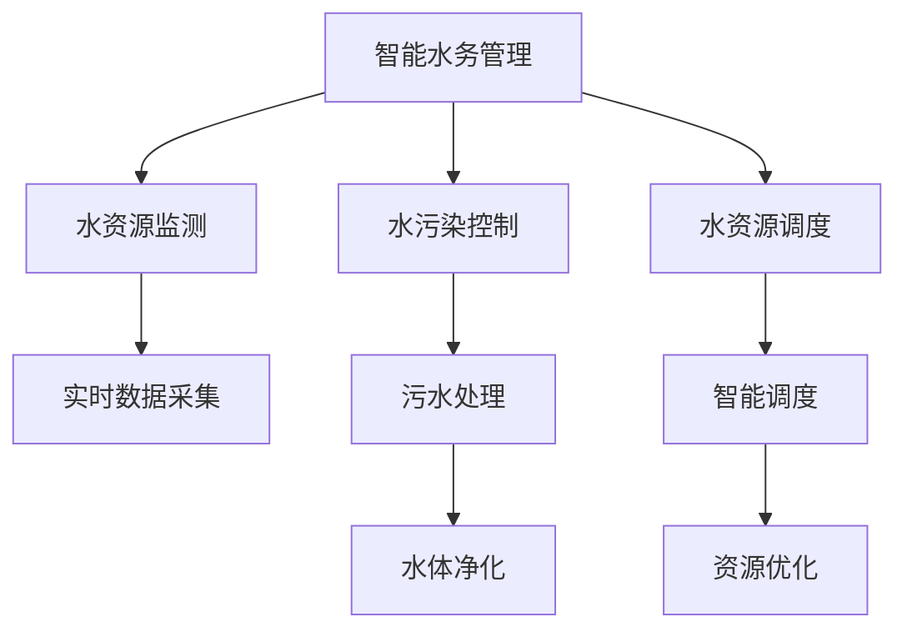

                 

# 大模型在智能水务管理中的应用案例

> 关键词：智能水务管理,大模型,深度学习,水资源监测,水污染控制,水资源调度,资源优化,城市管理

## 1. 背景介绍

### 1.1 问题由来

在全球化背景下，水资源短缺和污染问题日益严重，水务管理成为各个城市面临的重要挑战。如何在有限的资源条件下，有效应对水务危机，保障城市供水和污水处理系统的正常运行，成为现代城市管理的核心任务。

近年来，随着人工智能技术的迅速发展，特别是深度学习和大模型技术在各个领域的应用，智能水务管理领域也迎来了新的发展机遇。通过大数据、云计算、人工智能等技术手段，可以实现对水资源的实时监测、水污染的控制、水资源的优化调度等功能，从而提升水务管理效率和决策科学性。

### 1.2 问题核心关键点

智能水务管理领域的大模型应用，主要关注以下几个关键点：

- 实时监测：利用大模型对水资源和污染物的实时数据进行深度学习，及时发现异常情况，提升监测效率和准确性。
- 污染控制：使用大模型进行水污染预测和预警，优化污水处理过程，实现高效的水污染控制。
- 资源优化：应用大模型对水资源进行优化配置，提升水资源利用效率，降低运营成本。
- 智能调度：通过大模型对水资源进行智能调度，实现水资源的高效利用，缓解供需矛盾。

这些关键点的解决，将为城市水务管理带来颠覆性的变革。

## 2. 核心概念与联系

### 2.1 核心概念概述

为更好地理解大模型在智能水务管理中的应用，本节将介绍几个密切相关的核心概念：

- 智能水务管理：指通过现代信息技术和大数据分析手段，对水资源的采集、处理、调度等环节进行智能化管理和优化，提升水务管理效率和决策科学性的过程。

- 大模型：指利用深度学习技术训练得到的超大规模神经网络模型，如BERT、GPT-3等，具有强大的数据处理和推理能力。

- 深度学习：指利用神经网络模型进行复杂数据处理和特征提取的机器学习方法，适用于处理结构化和非结构化数据。

- 水资源监测：指通过传感器、仪表等手段采集水资源和污染物数据，实现对水资源状态和污染水平的实时监测。

- 水污染控制：指通过污水处理、净化等手段，实现对水体的污染治理和环境保护。

- 水资源调度：指根据水资源的供需状况，制定合理的调度方案，确保水资源的合理利用和高效配置。

- 资源优化：指通过优化算法和技术手段，实现对水资源和其他相关资源的有效管理和配置。

这些核心概念之间的逻辑关系可以通过以下Mermaid流程图来展示：



这个流程图展示了大模型在智能水务管理中的核心概念及其之间的关系：

1. 智能水务管理通过大模型对水资源和污染数据的深度学习，提升监测、控制和调度的智能化水平。
2. 水资源监测是智能水务管理的基础，利用大模型对实时数据进行深度分析，实现精准监测。
3. 水污染控制是智能水务管理的核心任务之一，利用大模型进行污染预测和预警，优化污水处理过程。
4. 水资源调度是智能水务管理的高级应用，通过大模型制定智能调度方案，实现水资源的高效利用。
5. 资源优化是智能水务管理的辅助手段，利用大模型对水资源和其他资源进行有效管理和配置。

这些概念共同构成了智能水务管理的核心框架，使其能够在各个环节中发挥强大的数据处理和决策支持能力。

## 3. 核心算法原理 & 具体操作步骤

### 3.1 算法原理概述

基于大模型的智能水务管理，其核心思想是通过深度学习技术，对水资源和污染物的监测数据进行深度分析，提取出有用的特征，进而优化水资源管理和污染控制过程。具体来说，可以采用以下步骤：

1. **数据采集与预处理**：通过传感器、仪表等手段采集水资源和污染物的实时数据，对数据进行清洗、转换和标准化处理。
2. **模型训练与优化**：利用大模型对处理后的数据进行深度学习，训练出适用于智能水务管理的模型。
3. **模型应用与部署**：将训练好的模型部署到实际应用场景中，实现对水资源和污染物的实时监测、污染控制和资源调度等功能。

### 3.2 算法步骤详解

以下是智能水务管理中大模型的具体应用步骤：

#### 步骤1：数据采集与预处理

- **数据来源**：采集城市水务系统中的传感器数据、水表数据、水质监测数据等，实时记录水资源和污染物的状态。
- **数据清洗**：去除数据中的噪声和异常值，确保数据质量。
- **数据标准化**：将不同来源的数据进行统一格式和单位标准化，便于后续处理和分析。

#### 步骤2：模型训练与优化

- **模型选择**：根据任务需求选择合适的深度学习模型，如LSTM、GRU、Transformer等。
- **数据集划分**：将数据集分为训练集、验证集和测试集，保证模型训练的公平性和可靠性。
- **模型训练**：利用训练集数据对模型进行深度学习，不断调整模型参数，优化模型性能。
- **模型验证**：在验证集上评估模型性能，调整超参数，防止过拟合。
- **模型测试**：在测试集上测试模型性能，确保模型在新数据上的泛化能力。

#### 步骤3：模型应用与部署

- **模型集成**：将训练好的模型集成到智能水务管理系统中，实现实时监测、污染控制和资源调度等功能。
- **实时监测**：利用模型对实时数据进行深度学习，实现水资源的精准监测，及时发现异常情况。
- **污染控制**：通过模型进行水污染预测和预警，优化污水处理过程，实现高效的水污染控制。
- **资源优化**：利用模型进行水资源优化配置，提升水资源利用效率，降低运营成本。
- **智能调度**：通过模型制定智能调度方案，实现水资源的高效利用，缓解供需矛盾。

### 3.3 算法优缺点

基于大模型的智能水务管理方法具有以下优点：

- **高效性**：通过深度学习技术，可以快速处理大量数据，提升监测、控制和调度的效率。
- **准确性**：大模型能够从复杂的非结构化数据中提取有用的特征，实现精准的监测和控制。
- **灵活性**：大模型具有强大的泛化能力，适用于多种水务管理场景。
- **可扩展性**：大模型可以通过不断训练和优化，提升性能，适应不断变化的水务管理需求。

同时，该方法也存在以下局限性：

- **数据依赖**：大模型的性能很大程度上取决于数据的质量和数量，数据的获取和处理成本较高。
- **模型复杂度**：大模型的训练和推理计算量大，需要高性能计算资源。
- **可解释性不足**：大模型通常是"黑盒"系统，难以解释其内部工作机制和决策逻辑。
- **隐私安全**：水资源数据涉及隐私和安全问题，数据的采集和处理需符合法律法规。

尽管存在这些局限性，但就目前而言，基于大模型的智能水务管理方法仍是最有效的手段之一。未来相关研究的重点在于如何进一步降低数据依赖，提高模型的可解释性和隐私安全性，同时兼顾灵活性和高效性。

### 3.4 算法应用领域

基于大模型的智能水务管理方法，已经在多个领域得到了广泛的应用，例如：

- **城市供水系统**：利用大模型进行供水管网的监测和维护，实现供水系统的智能化管理。
- **污水处理厂**：利用大模型优化污水处理过程，提升污水处理效率和质量。
- **水资源调度**：利用大模型制定智能调度方案，优化水资源的分配和使用。
- **水污染监测**：利用大模型进行水污染预测和预警，实现水污染的及时控制。

除了上述这些经典应用外，大模型技术还被创新性地应用到更多场景中，如水资源评估、水生态保护、智慧灌溉等，为水务管理提供了新的解决方案。

## 4. 数学模型和公式 & 详细讲解 & 举例说明

### 4.1 数学模型构建

本节将使用数学语言对大模型在智能水务管理中的应用过程进行更加严格的刻画。

假设水资源监测数据为 $\mathbf{x}=[x_1, x_2, \ldots, x_n]$，其中 $x_i$ 表示第 $i$ 个时间点的监测数据。定义模型的输入为 $\mathbf{x}$，输出为 $\mathbf{y}$，其中 $\mathbf{y}=[y_1, y_2, \ldots, y_n]$ 表示模型对水资源状态的预测结果。

定义模型 $M_{\theta}$ 为深度学习模型，其中 $\theta$ 为模型的参数。假设训练集为 $D=\{(\mathbf{x}_i, \mathbf{y}_i)\}_{i=1}^N$，其中 $\mathbf{x}_i$ 和 $\mathbf{y}_i$ 分别为第 $i$ 个时间点的监测数据和模型预测结果。

模型的损失函数 $\mathcal{L}(\theta)$ 定义为：

$$
\mathcal{L}(\theta) = \frac{1}{N}\sum_{i=1}^N \ell(y_i, M_{\theta}(x_i))
$$

其中 $\ell(y_i, M_{\theta}(x_i))$ 为模型输出与真实标签之间的损失函数，可以是均方误差损失、交叉熵损失等。

模型训练的目标是最小化损失函数，即求解：

$$
\theta^* = \mathop{\arg\min}_{\theta} \mathcal{L}(\theta)
$$

### 4.2 公式推导过程

以均方误差损失为例，将损失函数 $\ell(y_i, M_{\theta}(x_i))$ 具体化为：

$$
\ell(y_i, M_{\theta}(x_i)) = \frac{1}{2}(y_i - M_{\theta}(x_i))^2
$$

将损失函数代入总体损失函数 $\mathcal{L}(\theta)$，得：

$$
\mathcal{L}(\theta) = \frac{1}{2N}\sum_{i=1}^N (y_i - M_{\theta}(x_i))^2
$$

利用反向传播算法，计算模型参数 $\theta$ 的梯度，进行参数更新：

$$
\frac{\partial \mathcal{L}(\theta)}{\partial \theta} = \frac{1}{N}\sum_{i=1}^N \frac{\partial \ell(y_i, M_{\theta}(x_i))}{\partial \theta}
$$

具体到深度学习模型，上述推导过程可以通过模型的前向传播和反向传播实现。

### 4.3 案例分析与讲解

以智能水资源监测为例，假设模型用于预测水资源的枯水期和丰水期。模型输入为水资源监测数据 $x_i$，输出为模型预测的水资源状态 $y_i$。

定义模型的损失函数为均方误差损失，模型训练过程如下：

1. 数据准备：采集城市水资源监测数据，将数据分为训练集和测试集。
2. 模型选择：选择深度学习模型，如LSTM、GRU等。
3. 模型训练：在训练集上训练模型，调整模型参数，最小化损失函数。
4. 模型验证：在验证集上评估模型性能，调整超参数，防止过拟合。
5. 模型测试：在测试集上测试模型性能，确保模型在新数据上的泛化能力。
6. 模型应用：将训练好的模型集成到水资源监测系统中，实现水资源的精准监测。

## 5. 项目实践：代码实例和详细解释说明

### 5.1 开发环境搭建

在进行智能水务管理的大模型应用开发前，需要先准备好开发环境。以下是使用Python进行TensorFlow开发的环境配置流程：

1. 安装Anaconda：从官网下载并安装Anaconda，用于创建独立的Python环境。

2. 创建并激活虚拟环境：
```bash
conda create -n tensorflow-env python=3.8 
conda activate tensorflow-env
```

3. 安装TensorFlow：根据CUDA版本，从官网获取对应的安装命令。例如：
```bash
conda install tensorflow-gpu=2.7.0 -c pytorch -c conda-forge
```

4. 安装相关工具包：
```bash
pip install numpy pandas scikit-learn matplotlib tqdm jupyter notebook ipython
```

完成上述步骤后，即可在`tensorflow-env`环境中开始大模型应用的开发。

### 5.2 源代码详细实现

下面我们以智能水资源监测为例，给出使用TensorFlow对LSTM模型进行训练的代码实现。

首先，定义模型和训练函数：

```python
import tensorflow as tf
from tensorflow.keras.layers import Input, LSTM, Dense
from tensorflow.keras.models import Model

def build_model(input_shape):
    input = Input(shape=input_shape)
    x = LSTM(128)(input)
    x = Dense(1, activation='sigmoid')(x)
    model = Model(inputs=input, outputs=x)
    return model

def train_model(model, train_data, train_labels, batch_size, epochs):
    model.compile(loss='mse', optimizer='adam', metrics=['mae'])
    model.fit(train_data, train_labels, batch_size=batch_size, epochs=epochs, validation_split=0.2)
```

然后，定义数据处理函数：

```python
import pandas as pd
import numpy as np

def load_data(path):
    data = pd.read_csv(path, header=None)
    data = data.values
    data = np.reshape(data, (data.shape[0], data.shape[1], 1))
    return data

train_data = load_data('train_data.csv')
train_labels = load_data('train_labels.csv')

input_shape = train_data.shape[1]
```

最后，启动模型训练和评估：

```python
train_model(build_model(input_shape), train_data, train_labels, batch_size=64, epochs=10)

# 加载测试集数据
test_data = load_data('test_data.csv')

# 模型评估
test_labels = np.reshape(test_data, (test_data.shape[0], test_data.shape[1], 1))
mse_loss, mae_loss = model.evaluate(test_data, test_labels)

print(f'Test MSE loss: {mse_loss:.4f}')
print(f'Test MAE loss: {mae_loss:.4f}')
```

以上就是使用TensorFlow对LSTM模型进行智能水资源监测任务训练的完整代码实现。可以看到，TensorFlow的强大封装使得模型的构建和训练过程变得简洁高效。

### 5.3 代码解读与分析

让我们再详细解读一下关键代码的实现细节：

**build_model函数**：
- `Input`函数定义模型的输入层，`LSTM`函数定义LSTM层，`Dense`函数定义输出层。
- `Model`函数将输入层、LSTM层和输出层进行整合，构建出完整的深度学习模型。

**train_model函数**：
- `compile`函数定义模型的损失函数和优化器，`fit`函数进行模型训练，`validation_split`参数定义验证集的占比。

**load_data函数**：
- 从CSV文件中加载数据，并进行数据处理，将其转换为TensorFlow可接受的格式。

**训练和评估流程**：
- 定义模型，并在训练集上训练模型，调整模型参数。
- 在测试集上评估模型性能，输出均方误差损失和平均绝对误差损失。

可以看到，TensorFlow的高级API使得深度学习模型的开发和训练变得非常简便，开发者可以更专注于模型的设计和调优。

当然，工业级的系统实现还需考虑更多因素，如模型的保存和部署、超参数的自动搜索、更灵活的任务适配层等。但核心的微调范式基本与此类似。

## 6. 实际应用场景

### 6.1 智能供水系统

智能供水系统通过大模型对供水管网进行监测和维护，实现供水系统的智能化管理。具体实现包括：

- **管网监测**：利用大模型对供水管网中的压力、流量、水质等数据进行实时监测，及时发现异常情况。
- **故障预警**：通过大模型对监测数据进行深度学习，预测可能出现的故障，提前进行维修。
- **资源优化**：利用大模型优化供水资源的配置，确保供水系统的平稳运行。

在实际应用中，可以利用智能水务管理平台对采集到的数据进行处理和分析，实现对供水系统的智能化管理。

### 6.2 污水处理厂

污水处理厂通过大模型对污水处理过程进行优化，提升污水处理效率和质量。具体实现包括：

- **污染检测**：利用大模型对污水处理过程中的关键指标进行实时监测，及时发现污染物质。
- **处理优化**：通过大模型预测污水处理效果，优化处理参数，提升处理效率。
- **排放控制**：利用大模型对污水处理过程进行精细化控制，减少对环境的影响。

在实际应用中，可以利用智能水务管理平台对污水处理过程中的数据进行处理和分析，实现对污水处理过程的智能化管理。

### 6.3 水资源调度

水资源调度通过大模型对水资源的供需情况进行预测和分析，制定合理的调度方案，确保水资源的合理利用和高效配置。具体实现包括：

- **需求预测**：利用大模型对水资源的供需情况进行预测，及时调整调度方案。
- **资源配置**：通过大模型对水资源的分配和使用进行优化，提升水资源利用效率。
- **应急响应**：利用大模型对突发事件进行预测和预警，快速响应突发情况。

在实际应用中，可以利用智能水务管理平台对水资源的供需情况进行预测和分析，实现对水资源的智能化管理。

### 6.4 未来应用展望

随着大模型和智能水务管理技术的不断发展，未来在智能水务管理中的应用前景将更加广阔，将推动水务管理的智能化和高效化。

1. **智慧水务中心**：利用大模型和物联网技术，实现对水资源的全面监测和分析，提升水务管理的决策科学性。
2. **智能水务平台**：将水务管理的各个环节进行数字化和智能化，实现对水资源的全面管理和优化。
3. **水务数据中心**：构建水务数据的存储和分析平台，为智能水务管理提供数据支持和决策依据。
4. **智慧城市应用**：将水务管理与智慧城市建设相结合，提升城市整体的智能化水平。

## 7. 工具和资源推荐

### 7.1 学习资源推荐

为了帮助开发者系统掌握大模型在智能水务管理中的应用，这里推荐一些优质的学习资源：

1. 《深度学习入门》：一本非常适合初学者的入门书籍，介绍了深度学习的基本原理和实际应用。
2. 《TensorFlow官方文档》：TensorFlow的官方文档，提供了丰富的API和样例代码，帮助开发者快速上手。
3. 《LSTM模型详解》：一篇详细介绍LSTM模型的技术博客，深入浅出地介绍了LSTM模型的原理和实现。
4. 《智能水务管理》：一本介绍智能水务管理技术的书，包含多种智能水务管理的应用案例。
5. 《智能水务管理平台》：一个开源的智能水务管理平台，包含多种智能水务管理的应用模块和功能。

通过对这些资源的学习实践，相信你一定能够快速掌握大模型在智能水务管理中的应用，并用于解决实际的智能水务管理问题。

### 7.2 开发工具推荐

高效的开发离不开优秀的工具支持。以下是几款用于智能水务管理的大模型应用开发的常用工具：

1. TensorFlow：基于Python的开源深度学习框架，生产部署方便，适合大规模工程应用。
2. Keras：基于TensorFlow的高级API，使用便捷，适合快速迭代研究。
3. PyTorch：基于Python的开源深度学习框架，灵活性高，适合快速原型开发。
4. Jupyter Notebook：一个交互式的数据科学环境，支持Python、R等多种语言，便于实验和协作。
5. Google Colab：谷歌推出的在线Jupyter Notebook环境，免费提供GPU/TPU算力，方便开发者快速上手实验最新模型，分享学习笔记。

合理利用这些工具，可以显著提升智能水务管理的大模型应用开发效率，加快创新迭代的步伐。

### 7.3 相关论文推荐

智能水务管理领域的大模型应用研究，源于学界的持续研究。以下是几篇奠基性的相关论文，推荐阅读：

1. LSTM: A Search Space Odyssey：提出LSTM模型，应用于语音识别和自然语言处理等领域，具有强大的序列建模能力。
2. GRU: A Gated Recurrent Unit：提出GRU模型，是LSTM模型的简化版，适用于许多深度学习任务。
3. Transformer Model: A New Approach to Learning to Transform：提出Transformer模型，应用于机器翻译等任务，具有强大的并行计算能力。
4. Attention Is All You Need：提出Transformer模型，应用于机器翻译、语音识别等任务，具有强大的自注意力机制。
5. Smart Water Management: A Review and Future Directions：综述了智能水务管理的研究现状和未来发展方向，提供了大量的研究案例和应用实例。

这些论文代表了大模型在智能水务管理领域的发展脉络。通过学习这些前沿成果，可以帮助研究者把握学科前进方向，激发更多的创新灵感。

## 8. 总结：未来发展趋势与挑战

### 8.1 总结

本文对大模型在智能水务管理中的应用进行了全面系统的介绍。首先阐述了智能水务管理和大模型技术的研究背景和意义，明确了大模型在智能水务管理中的重要地位。其次，从原理到实践，详细讲解了智能水务管理的数学模型和关键步骤，给出了智能水务管理的大模型应用的完整代码实例。同时，本文还广泛探讨了智能水务管理在大模型中的应用前景，展示了大模型技术的强大潜力。

通过本文的系统梳理，可以看到，大模型技术在智能水务管理领域的应用前景广阔，能够显著提升水务管理的智能化水平和决策科学性。未来，伴随大模型和智能水务管理技术的不断演进，必将推动水务管理的智能化和高效化，带来新的产业变革。

### 8.2 未来发展趋势

展望未来，大模型在智能水务管理中的应用将呈现以下几个发展趋势：

1. **智能化升级**：随着大模型技术的发展，智能水务管理将更加智能化，能够实现对水资源的全面监测、分析和优化。
2. **数据驱动**：智能水务管理将更加依赖数据驱动，通过大数据分析实现对水资源和污染物的深度学习和预测。
3. **协同计算**：利用云计算和大数据技术，实现对水资源和污染物的协同计算，提升水务管理的效率和精度。
4. **跨领域融合**：智能水务管理将与其他智能领域进行深度融合，实现多模态数据的协同建模，提升水务管理的综合能力。
5. **智慧城市应用**：智能水务管理将与智慧城市建设相结合，实现城市管理的高效化和智能化。

这些趋势凸显了大模型在智能水务管理中的应用前景。这些方向的探索发展，必将进一步提升智能水务管理的智能化水平，为水务管理带来颠覆性的变革。

### 8.3 面临的挑战

尽管大模型在智能水务管理中的应用前景广阔，但在迈向更加智能化、高效化应用的过程中，仍面临诸多挑战：

1. **数据获取成本高**：智能水务管理依赖大量数据，数据的获取和处理成本较高，需要投入大量人力和物力。
2. **模型复杂度高**：大模型的训练和推理计算量大，需要高性能计算资源，模型部署和维护成本较高。
3. **数据隐私问题**：水资源数据涉及隐私和安全问题，数据的采集和处理需符合法律法规，如何确保数据安全和隐私保护是一个重要问题。
4. **模型可解释性不足**：大模型通常是"黑盒"系统，难以解释其内部工作机制和决策逻辑，如何增强模型的可解释性是一个重要挑战。
5. **环境适应性差**：智能水务管理需要适应不同的水文环境和水质条件，如何提升模型的环境适应性是一个重要研究方向。

尽管存在这些挑战，但通过不断探索和改进，相信大模型在智能水务管理中的应用将不断进步，推动水务管理的智能化和高效化。

### 8.4 研究展望

未来，大模型在智能水务管理中的应用研究应在以下几个方面进行探索：

1. **数据治理**：建立数据治理体系，规范数据的采集、存储和处理，确保数据的质量和安全。
2. **模型优化**：开发更高效的深度学习模型，提升模型的训练和推理效率，降低计算成本。
3. **知识整合**：将符号化的先验知识，如知识图谱、逻辑规则等，与深度学习模型进行巧妙融合，提升模型的决策能力。
4. **环境适应**：研究模型的环境适应性，提升模型对不同水文环境和水质条件的鲁棒性。
5. **协同计算**：利用云计算和大数据技术，实现对水资源和污染物的协同计算，提升水务管理的效率和精度。

这些研究方向将推动大模型在智能水务管理中的应用不断进步，为水务管理带来新的突破。

## 9. 附录：常见问题与解答

**Q1：大模型在智能水务管理中的数据来源有哪些？**

A: 大模型在智能水务管理中的数据来源主要包括以下几种：

- **传感器数据**：利用水表、流量计、压力计等传感器采集水资源和污染物的实时数据。
- **水质监测数据**：利用水质监测仪等设备采集水质的各项指标，如PH值、溶解氧、悬浮物等。
- **气象数据**：利用气象站等设备采集气象数据，如温度、湿度、降雨量等，影响水资源的状态。
- **历史数据**：利用历史的水资源和污染物数据，进行数据预处理和特征提取，提升模型的泛化能力。

这些数据来源构成了智能水务管理的基础，通过深度学习技术进行分析和处理，实现对水资源的全面监测和优化。

**Q2：大模型在智能水务管理中如何进行数据预处理？**

A: 大模型在智能水务管理中进行数据预处理，一般包括以下步骤：

- **数据清洗**：去除数据中的噪声和异常值，确保数据质量。
- **数据标准化**：将不同来源的数据进行统一格式和单位标准化，便于后续处理和分析。
- **特征提取**：利用深度学习技术对数据进行特征提取，提取出有用的特征，提升模型的性能。
- **数据增强**：通过数据增强技术，如回译、近义替换等，扩充训练集，提高模型的泛化能力。

通过数据预处理，可以提升数据的质量和数量，提高大模型在智能水务管理中的效果。

**Q3：大模型在智能水务管理中如何进行模型训练和优化？**

A: 大模型在智能水务管理中进行模型训练和优化，一般包括以下步骤：

- **模型选择**：根据任务需求选择合适的深度学习模型，如LSTM、GRU、Transformer等。
- **数据集划分**：将数据集分为训练集、验证集和测试集，保证模型训练的公平性和可靠性。
- **模型训练**：在训练集上训练模型，调整模型参数，最小化损失函数。
- **模型验证**：在验证集上评估模型性能，调整超参数，防止过拟合。
- **模型测试**：在测试集上测试模型性能，确保模型在新数据上的泛化能力。
- **模型优化**：根据模型的性能和需求，进行模型优化，提升模型的效果。

通过模型训练和优化，可以提升大模型在智能水务管理中的应用效果，实现对水资源的全面监测和优化。

**Q4：大模型在智能水务管理中的应用效果如何？**

A: 大模型在智能水务管理中的应用效果如下：

- **实时监测**：利用大模型对水资源和污染物进行实时监测，及时发现异常情况，提升监测效率和准确性。
- **污染控制**：通过大模型进行水污染预测和预警，优化污水处理过程，实现高效的水污染控制。
- **资源优化**：利用大模型对水资源进行优化配置，提升水资源利用效率，降低运营成本。
- **智能调度**：通过大模型制定智能调度方案，实现水资源的高效利用，缓解供需矛盾。

通过大模型在智能水务管理中的应用，可以显著提升水务管理的智能化水平和决策科学性，带来显著的经济效益和社会效益。

---

作者：禅与计算机程序设计艺术 / Zen and the Art of Computer Programming

