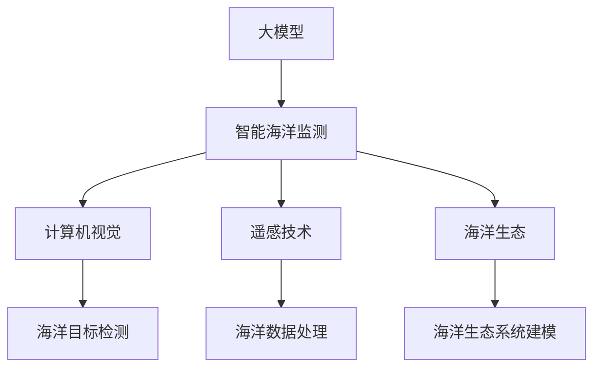

                 

# 大模型在智能海洋监测中的应用案例

> 关键词：智能海洋监测,大模型应用,海洋数据处理,计算机视觉,海洋生态,机器学习,遥感技术

## 1. 背景介绍

### 1.1 问题由来
海洋作为地球上最重要的生态系统之一，其健康状态直接关系到全球气候变化和人类福祉。然而，由于海洋环境的复杂性，传统的海洋监测手段如人工调查、遥感等难以全面、准确地获取海洋信息。智能海洋监测技术的兴起，为高效、大规模、实时地监测海洋提供了新的途径。

智能海洋监测技术通过将人工智能、计算机视觉、遥感等先进技术应用于海洋数据处理和分析中，可以大幅提升海洋监测的效率和精度。大模型技术作为这一领域的重要工具，能够利用其强大的语言和视觉理解能力，处理和分析海洋数据，挖掘海洋生态和环境变化中的深层次规律。

### 1.2 问题核心关键点
当前，大模型技术在海洋监测中的应用主要集中于以下几个方面：

1. **海洋数据分析**：大模型可以通过对大量海洋遥感数据的分析，揭示海洋生态和环境变化的模式和趋势。
2. **海洋目标检测**：利用计算机视觉技术，大模型能够实时检测海洋中各类目标，如浮游生物、海洋污染等。
3. **海洋环境预测**：结合气候模型和海洋数据，大模型可以预测海洋环境的变化趋势，辅助决策。
4. **海洋生态系统建模**：通过分析海洋生物的分布和行为，大模型可以构建海洋生态系统模型，评估生态健康。

### 1.3 问题研究意义
大模型技术在智能海洋监测中的应用，具有重要的现实意义和深远的科研价值：

1. **提高监测效率**：大模型能够处理海量数据，快速分析海洋环境变化，提供实时监控能力。
2. **提升监测精度**：通过融合多源数据，大模型能够更准确地识别海洋目标和环境变化。
3. **推动科学研究**：大模型提供的深度分析结果，有助于海洋科学家更深入地理解海洋生态和环境变化的机理。
4. **支持海洋管理**：准确、及时的海洋监测数据，为海洋资源的合理开发和管理提供科学依据。
5. **增强公共安全**：预测海洋环境变化，提前预警海洋灾害，保障公众安全。

## 2. 核心概念与联系

### 2.1 核心概念概述

为了更好地理解大模型在智能海洋监测中的应用，本节将介绍几个关键核心概念：

- **大模型(Deep Model)**：指通过大规模数据预训练得到的高级神经网络模型，具备强大的数据处理和分析能力。
- **智能海洋监测(Smart Marine Monitoring)**：利用人工智能技术对海洋环境进行实时、大规模、高精度的监测。
- **计算机视觉(Computer Vision)**：涉及图像和视频处理、目标检测、图像识别等技术，是智能海洋监测的重要组成部分。
- **遥感技术(Remote Sensing)**：利用传感器和数据处理技术，通过遥感设备收集海洋信息。
- **海洋生态(Ocean Ecology)**：研究海洋生态系统，关注生物多样性、栖息地保护等问题。
- **机器学习(Machine Learning)**：利用数据和算法，使计算机具有学习能力，从数据中发现规律和模式。

这些核心概念通过以下Mermaid流程图展示其联系：



### 2.2 核心概念原理和架构

大模型在智能海洋监测中的应用，通常基于以下架构：

1. **数据采集**：通过遥感卫星、水下传感器等设备收集海洋数据，生成图像、视频、文本等形式的海量数据。
2. **数据预处理**：清洗、裁剪、增强等预处理步骤，确保数据质量，便于后续模型处理。
3. **模型训练**：利用大模型进行预训练和微调，学习海洋数据特征和规律。
4. **目标检测和分类**：在预训练大模型的基础上，进行目标检测和分类，识别海洋中各类目标。
5. **环境预测和分析**：结合气候模型和海洋数据，预测海洋环境变化，分析环境变化趋势。
6. **结果展示和应用**：将监测结果以图表、报告等形式展示，辅助决策和管理。

## 3. 核心算法原理 & 具体操作步骤
### 3.1 算法原理概述

大模型在智能海洋监测中的应用，主要依赖于其强大的图像处理和分析能力。以计算机视觉中的目标检测为例，其核心算法原理如下：

1. **数据预处理**：将原始图像数据转换为模型能够处理的张量形式，进行归一化、标准化等处理。
2. **特征提取**：通过卷积神经网络(CNN)等模型，提取图像中的特征，识别出感兴趣的目标。
3. **目标定位**：利用回归方法，对目标进行定位，确定其在图像中的位置。
4. **目标分类**：结合分类器，对目标进行分类，识别出具体的目标类型。

### 3.2 算法步骤详解

以大模型在海洋目标检测中的应用为例，详细讲解算法步骤：

1. **数据准备**：收集海洋遥感图像数据，划分为训练集、验证集和测试集。
2. **模型选择**：选择适合的目标检测模型，如Faster R-CNN、YOLO等，并配置好训练参数。
3. **模型训练**：将训练集输入模型，通过反向传播算法更新模型参数。
4. **模型验证**：在验证集上评估模型性能，调整超参数和模型结构，确保模型泛化能力。
5. **模型测试**：在测试集上测试模型性能，评估目标检测的准确率、召回率等指标。
6. **结果展示**：将模型应用于新的海洋图像，输出检测到的目标及其位置。

### 3.3 算法优缺点

大模型在智能海洋监测中的应用，具有以下优点：

1. **高效处理**：大模型能够高效处理海量海洋数据，实时分析环境变化。
2. **高精度检测**：利用深度学习技术，大模型在目标检测上具有较高的准确率。
3. **灵活适应**：大模型能够适应多种海洋数据类型，处理多种检测任务。
4. **普适性高**：大模型的通用性使其可以应用于多种海洋监测场景，如海洋污染、海洋生物多样性等。

同时，大模型也存在以下局限性：

1. **数据依赖性强**：大模型对数据质量要求高，数据预处理和清洗工作量大。
2. **模型复杂度高**：大模型的计算复杂度高，需要高性能硬件支持。
3. **鲁棒性问题**：大模型对输入数据的变化较为敏感，可能出现误检或漏检现象。
4. **模型解释性不足**：大模型的决策过程难以解释，缺乏透明性。

### 3.4 算法应用领域

大模型在智能海洋监测中的应用领域广泛，主要包括以下几个方面：

1. **海洋污染检测**：识别海洋中的垃圾、油泄漏等污染源，评估污染程度。
2. **海洋生物监测**：检测海洋中各类生物，如浮游生物、鱼类等，研究其分布和行为。
3. **海洋生态评估**：分析海洋生态系统中的生物多样性和栖息地保护情况。
4. **海洋环境预测**：结合气候模型和海洋数据，预测海洋环境变化趋势。
5. **海洋资源管理**：辅助海洋资源的合理开发和利用，如渔业、海洋能源等。

## 4. 数学模型和公式 & 详细讲解 & 举例说明

### 4.1 数学模型构建

以大模型在海洋目标检测中的应用为例，构建数学模型。假设目标检测任务为检测图像中的浮游生物，则目标检测模型的数学模型为：

$$
y = M(x)
$$

其中，$y$ 为检测到的目标类别，$x$ 为输入的海洋图像数据，$M$ 为目标检测模型。

目标检测模型的损失函数通常采用交叉熵损失函数：

$$
\mathcal{L} = -\sum_{i=1}^N (y_i \log \hat{y}_i + (1-y_i) \log (1-\hat{y}_i))
$$

其中，$N$ 为训练样本数量，$y_i$ 为样本的真实标签，$\hat{y}_i$ 为目标检测模型在样本上的输出概率。

### 4.2 公式推导过程

以Faster R-CNN模型为例，其目标检测过程的公式推导如下：

1. **特征提取**：通过卷积神经网络提取图像特征，公式为：

$$
x' = \sigma(\mathcal{A}(x))
$$

其中，$x'$ 为提取后的特征，$\sigma$ 为激活函数，$\mathcal{A}$ 为卷积神经网络。

2. **区域提议**：利用区域提议网络生成候选框，公式为：

$$
R = \mathcal{P}(x')
$$

其中，$R$ 为候选框集合，$\mathcal{P}$ 为区域提议网络。

3. **目标检测**：将候选框输入检测网络，输出目标类别和置信度，公式为：

$$
\hat{y} = \mathcal{D}(R, x')
$$

其中，$\hat{y}$ 为目标检测模型的输出，$\mathcal{D}$ 为检测网络。

4. **目标定位**：对检测到的目标进行位置回归，公式为：

$$
\delta = \mathcal{O}(R, x')
$$

其中，$\delta$ 为目标位置偏移量，$\mathcal{O}$ 为目标定位网络。

### 4.3 案例分析与讲解

以YOLO模型为例，展示其在海洋目标检测中的应用。YOLO模型通过将图像分割成若干网格，直接预测每个网格内的目标类别和位置，具有较高的检测速度和精度。

假设有一张海洋图像，其检测结果为：

| 目标ID | 类别   | 置信度 | 坐标 |
|--------|--------|--------|------|
| 1      | 浮游生物 | 0.95   | (10, 20) |
| 2      | 鱼类    | 0.90   | (50, 60) |

### 5. 项目实践：代码实例和详细解释说明
### 5.1 开发环境搭建

在进行大模型在智能海洋监测中的应用开发前，需要准备好开发环境。以下是使用Python进行PyTorch开发的环境配置流程：

1. 安装Anaconda：从官网下载并安装Anaconda，用于创建独立的Python环境。

2. 创建并激活虚拟环境：
```bash
conda create -n pytorch-env python=3.8 
conda activate pytorch-env
```

3. 安装PyTorch：根据CUDA版本，从官网获取对应的安装命令。例如：
```bash
conda install pytorch torchvision torchaudio cudatoolkit=11.1 -c pytorch -c conda-forge
```

4. 安装YOLOv3模型和相关库：
```bash
conda install yolov3=3.1.0
```

5. 安装各类工具包：
```bash
pip install numpy pandas scikit-learn matplotlib tqdm jupyter notebook ipython
```

完成上述步骤后，即可在`pytorch-env`环境中开始智能海洋监测模型的开发。

### 5.2 源代码详细实现

下面以YOLOv3模型为例，展示其在海洋目标检测中的应用代码实现。

首先，定义海洋数据预处理函数：

```python
import cv2
import numpy as np

def preprocess_image(image):
    # 图像预处理
    image = cv2.imread(image)
    image = cv2.cvtColor(image, cv2.COLOR_BGR2RGB)
    image = cv2.resize(image, (416, 416))
    image = np.array(image) / 255.0
    image = np.expand_dims(image, axis=0)
    return image
```

然后，定义目标检测函数：

```python
import yolov3

def detect_objects(model, image, classes, conf_threshold=0.5, nms_threshold=0.3):
    # 目标检测
    results = model.detect_objects(image)
    boxes, scores, labels = results['boxes'], results['scores'], results['labels']
    labels = [classes[label] for label in labels]
    boxes = boxes[conf_threshold < scores]
    boxes = boxes[boxes[:, -1] < nms_threshold]
    scores = scores[conf_threshold < scores]
    scores = scores[boxes[:, -1] < nms_threshold]
    labels = labels[conf_threshold < scores]
    labels = labels[boxes[:, -1] < nms_threshold]
    return boxes, scores, labels
```

最后，进行目标检测并输出结果：

```python
# 加载YOLOv3模型
model = yolov3.load_model('yolov3-csp.weights', 416)

# 定义类别标签
classes = yolov3.load_classes('yolov3-csp.data')

# 加载海洋图像
image = preprocess_image('ocean_image.jpg')

# 进行目标检测
boxes, scores, labels = detect_objects(model, image, classes)

# 输出检测结果
print('检测结果：')
for box, score, label in zip(boxes, scores, labels):
    print(f'类别: {label}, 置信度: {score:.2f}, 位置: {box}')
```

以上就是使用YOLOv3模型进行海洋目标检测的完整代码实现。可以看到，YOLOv3模型能够高效、准确地检测出海洋图像中的目标，并输出其类别和位置信息。

### 5.3 代码解读与分析

让我们再详细解读一下关键代码的实现细节：

**preprocess_image函数**：
- 加载海洋图像，并将其转换为模型所需的格式。
- 对图像进行归一化和标准化处理，确保数据的一致性。

**detect_objects函数**：
- 使用YOLOv3模型进行目标检测，返回检测到的目标位置、类别和置信度。
- 过滤掉置信度低于阈值的目标和重叠度高的目标，保留最终结果。

**主程序部分**：
- 加载YOLOv3模型和类别标签。
- 对海洋图像进行预处理，确保数据格式正确。
- 调用目标检测函数，输出检测结果。

可以看到，YOLOv3模型的代码实现相对简洁，但核心的检测部分由深度神经网络构成，具有较强的鲁棒性和适应性。

## 6. 实际应用场景

### 6.1 智能海洋污染监测

智能海洋污染监测是大模型在智能海洋监测中的重要应用之一。通过实时监测海洋中的垃圾、油泄漏等污染源，可以及时预警和应对海洋污染事件。

在实际应用中，可以收集海洋卫星图像和传感器数据，将其作为输入，利用大模型进行目标检测和分类。具体流程如下：

1. **数据准备**：收集海洋卫星图像和传感器数据，进行数据清洗和增强。
2. **模型训练**：选择适合的目标检测模型，如YOLOv3、Faster R-CNN等，并使用收集到的数据进行训练。
3. **模型验证**：在验证集上评估模型性能，调整模型参数。
4. **模型应用**：将训练好的模型应用于新的海洋图像，检测出污染源并输出位置。
5. **预警和应对**：根据检测结果，及时预警和采取应对措施，防止污染事件扩大。

### 6.2 海洋生物多样性监测

大模型在海洋生物多样性监测中，能够识别和分类海洋中的各类生物，分析其分布和行为。这对海洋生态保护和科学研究具有重要意义。

具体应用流程如下：

1. **数据收集**：通过水下相机、潜水器等设备，收集海洋生物的图像和视频数据。
2. **数据预处理**：对收集到的数据进行清洗、裁剪、增强等预处理。
3. **模型训练**：使用大模型进行预训练和微调，学习海洋生物的特征和分类。
4. **生物检测和分类**：利用训练好的模型，对海洋生物进行检测和分类，识别出不同种类的生物。
5. **生态分析**：结合历史数据，分析海洋生物的分布和行为，评估生态健康状况。

### 6.3 海洋环境预测

结合气候模型和海洋数据，大模型能够预测海洋环境的变化趋势，提供科学依据。这对于海洋资源的合理利用和环境保护具有重要价值。

具体应用流程如下：

1. **数据收集**：收集海洋气象数据和海洋卫星图像。
2. **数据融合**：将气候模型和海洋数据进行融合，生成统一的海洋环境数据。
3. **模型训练**：使用大模型进行预训练和微调，学习环境变化的规律。
4. **环境预测**：利用训练好的模型，预测海洋环境的变化趋势，如海平面上升、海水温度变化等。
5. **决策支持**：将预测结果提供给海洋管理部门，辅助决策和预警。

## 7. 工具和资源推荐

### 7.1 学习资源推荐

为了帮助开发者系统掌握大模型在智能海洋监测中的应用，这里推荐一些优质的学习资源：

1. 《深度学习框架PyTorch实战》：详细介绍PyTorch的使用方法，包含多个深度学习模型和应用案例，适合初学者入门。
2. 《计算机视觉：算法与应用》：系统讲解计算机视觉的基础知识和算法，涵盖图像处理、目标检测等技术，适合深入学习。
3. 《机器学习实战》：实战性质的机器学习书籍，涵盖多种机器学习模型和应用场景，适合开发人员快速上手。
4. 《智能海洋监测技术》：详细介绍智能海洋监测的各类技术和应用，适合科研人员和工程师阅读。
5. HuggingFace官方文档：提供丰富的深度学习模型和工具库，包含详细的文档和样例代码，适合快速学习。

通过对这些资源的学习实践，相信你一定能够快速掌握大模型在智能海洋监测中的应用方法，并用于解决实际的海洋监测问题。

### 7.2 开发工具推荐

高效的开发离不开优秀的工具支持。以下是几款用于大模型在智能海洋监测中的应用开发的常用工具：

1. PyTorch：基于Python的开源深度学习框架，灵活高效的计算图，适合快速迭代研究。
2. TensorFlow：由Google主导开发的开源深度学习框架，生产部署方便，适合大规模工程应用。
3. OpenCV：开源计算机视觉库，提供丰富的图像处理和目标检测功能，适合与深度学习模型结合使用。
4. YOLOv3：高效的实时目标检测模型，具有较高的检测速度和精度。
5. TensorBoard：TensorFlow配套的可视化工具，实时监测模型训练状态，提供丰富的图表呈现方式。
6. Weights & Biases：模型训练的实验跟踪工具，记录和可视化模型训练过程中的各项指标，方便对比和调优。

合理利用这些工具，可以显著提升大模型在智能海洋监测中的应用开发效率，加快创新迭代的步伐。

### 7.3 相关论文推荐

大模型在智能海洋监测中的应用研究源于学界的持续研究。以下是几篇奠基性的相关论文，推荐阅读：

1. "YOLOv3: An Incremental Training and Scaling Approach for Real-Time Object Detection"：介绍YOLOv3模型的实时目标检测算法。
2. "Faster R-CNN: Towards Real-Time Object Detection with Region Proposal Networks"：提出Faster R-CNN模型，实现高效的目标检测。
3. "Underwater Object Detection Using Deep Convolutional Neural Networks"：利用深度学习模型进行水下目标检测。
4. "Marine Image Segmentation Based on Deep Learning and Transfer Learning"：基于深度学习进行海洋图像分割。
5. "Robust Multi-Modal Attention-Based Marine Object Detection"：结合多种模态数据进行海洋目标检测。

这些论文代表了大模型在智能海洋监测领域的研究进展，通过学习这些前沿成果，可以帮助研究者把握学科前进方向，激发更多的创新灵感。

## 8. 总结：未来发展趋势与挑战

### 8.1 总结

本文对大模型在智能海洋监测中的应用进行了全面系统的介绍。首先阐述了智能海洋监测的背景和意义，明确了大模型在此领域的独特价值。其次，从原理到实践，详细讲解了大模型在目标检测、环境预测等任务中的核心算法和具体操作步骤。同时，本文还探讨了大模型在海洋污染监测、生物多样性监测等多个实际场景中的应用，展示了其广阔的应用前景。最后，本文精选了相关学习资源、开发工具和前沿论文，力求为读者提供全方位的技术指引。

通过本文的系统梳理，可以看到，大模型技术在智能海洋监测中的应用，已经取得了显著的成果，成为推动海洋科学研究和技术进步的重要工具。未来，伴随大模型技术的不断发展，智能海洋监测的应用场景将更加丰富，技术水平也将进一步提升。

### 8.2 未来发展趋势

展望未来，大模型在智能海洋监测中的应用将呈现以下几个发展趋势：

1. **高精度检测**：通过改进算法和优化模型结构，大模型的检测精度将进一步提升，能够更准确地识别海洋中的各类目标。
2. **实时处理**：利用高性能硬件和优化算法，大模型的实时处理能力将大幅增强，支持实时监测和预警。
3. **多模态融合**：结合多种数据类型，如卫星图像、水下视频、传感器数据等，大模型能够更好地处理多源数据，提高监测结果的全面性和准确性。
4. **自适应学习**：利用自监督学习和迁移学习技术，大模型能够更好地适应海洋环境的变化，保持其监测性能的稳定性。
5. **人工智能结合**：将大模型与自然语言处理、语音识别等人工智能技术结合，提升海洋监测系统的智能化水平。
6. **开源共享**：更多的智能海洋监测模型将开放共享，推动科学研究和技术应用的高效协同。

以上趋势凸显了大模型在智能海洋监测领域的广阔前景，这些方向的探索发展，必将进一步提升海洋监测系统的性能和应用范围，为海洋科学研究和技术进步提供新的动力。

### 8.3 面临的挑战

尽管大模型在智能海洋监测中的应用已经取得了瞩目成就，但在迈向更加智能化、普适化应用的过程中，仍面临诸多挑战：

1. **数据质量和数量**：海洋监测数据的获取和质量控制仍是一个难题，数据量和数据质量的不足限制了大模型的应用效果。
2. **模型计算资源**：大模型的计算复杂度高，对硬件资源要求较高，需要高性能的计算平台支持。
3. **算法复杂度**：现有的目标检测算法虽然高效，但复杂度较高，难以在大规模数据上实现实时处理。
4. **鲁棒性和泛化性**：大模型在面对海洋环境变化时，仍可能出现误检或漏检现象，鲁棒性和泛化性有待进一步提升。
5. **可解释性和透明性**：大模型的决策过程难以解释，缺乏透明性，影响其应用的可信度。

正视大模型在智能海洋监测中面临的这些挑战，积极应对并寻求突破，将是大模型技术走向成熟的必由之路。相信随着学界和产业界的共同努力，这些挑战终将一一被克服，大模型技术必将在智能海洋监测中发挥更大的作用。

### 8.4 研究展望

面对大模型在智能海洋监测中面临的挑战，未来的研究需要在以下几个方面寻求新的突破：

1. **数据增强**：通过数据增强技术，扩充训练集，提高模型的泛化能力。
2. **多模态融合**：结合多种数据类型，提高模型的多源数据融合能力，提升监测结果的全面性和准确性。
3. **模型压缩**：通过模型压缩技术，降低模型的计算复杂度，支持实时处理和资源优化。
4. **自适应学习**：利用自监督学习和迁移学习技术，使模型能够适应海洋环境的变化，保持其监测性能的稳定性。
5. **可解释性增强**：通过可视化工具和解释方法，提高大模型的可解释性和透明性，增强其应用的可信度。

这些研究方向的探索，必将引领大模型在智能海洋监测技术迈向更高的台阶，为海洋科学研究和技术应用提供新的突破。面向未来，大模型技术需要在数据、模型、算法、应用等多个维度进行协同创新，才能真正实现智能海洋监测的广泛应用。

## 9. 附录：常见问题与解答

**Q1：大模型在智能海洋监测中的计算资源要求有多高？**

A: 大模型在智能海洋监测中的应用，对计算资源的要求较高。通常需要高性能的GPU或TPU设备，以及较大的内存和存储资源。具体需求取决于模型大小和数据量，但通常至少需要几十个GPU进行训练和推理。

**Q2：大模型在海洋监测中如何进行数据增强？**

A: 数据增强是大模型在智能海洋监测中提高泛化能力的重要手段。常见的数据增强方法包括：

1. **随机裁剪和旋转**：对海洋图像进行随机裁剪和旋转，生成新的训练样本。
2. **添加噪声**：向海洋图像添加高斯噪声、椒盐噪声等，增加数据的多样性。
3. **图像变形**：对海洋图像进行平移、缩放、翻转等变形操作，生成新的训练样本。
4. **标签扩展**：对海洋图像的标签进行扩展，生成更多的正负样本。

这些数据增强方法可以有效扩充训练集，提高模型的泛化能力，避免过拟合现象。

**Q3：大模型在海洋目标检测中如何处理背景噪声？**

A: 海洋目标检测中背景噪声是一个常见的问题，可以通过以下方法进行解决：

1. **数据预处理**：对海洋图像进行归一化、标准化等预处理，减少背景噪声的影响。
2. **目标检测算法优化**：使用背景抑制技术，如背景去噪、目标框校正等，提高目标检测的准确性。
3. **多尺度检测**：在不同尺度和分辨率下进行目标检测，增加检测的鲁棒性。

这些方法可以有效处理背景噪声，提高大模型在海洋目标检测中的应用效果。

**Q4：大模型在智能海洋监测中如何进行多模态数据融合？**

A: 多模态数据融合是大模型在智能海洋监测中提高监测效果的重要手段。常见的多模态数据融合方法包括：

1. **特征融合**：将不同模态的数据转换为相同的特征表示，进行特征融合。
2. **信息融合**：利用融合算法，综合不同模态的信息，提高监测结果的全面性和准确性。
3. **协同学习**：将不同模态的数据在同一个模型中进行训练，提高模型的多源数据融合能力。

这些方法可以有效结合多种模态数据，提高大模型在智能海洋监测中的性能和应用效果。

**Q5：大模型在海洋监测中如何进行模型压缩和优化？**

A: 模型压缩和优化是大模型在智能海洋监测中提高实时处理能力和资源利用效率的重要手段。常见的模型压缩方法包括：

1. **剪枝和量化**：通过剪枝和量化技术，降低模型参数量，减少计算复杂度。
2. **知识蒸馏**：利用大模型的知识蒸馏小模型，提高小模型的性能和泛化能力。
3. **分布式训练**：利用分布式训练技术，加速模型训练和推理，提高资源利用效率。

这些方法可以有效降低模型计算复杂度，支持实时处理和资源优化，提高大模型在智能海洋监测中的应用效果。

总之，大模型在智能海洋监测中的应用前景广阔，但如何提升其计算效率、提高鲁棒性和泛化能力、增强可解释性和透明性，是未来研究的重要方向。相信随着技术的不断进步，大模型必将在智能海洋监测中发挥更大的作用，为海洋科学研究和技术应用带来新的突破。

