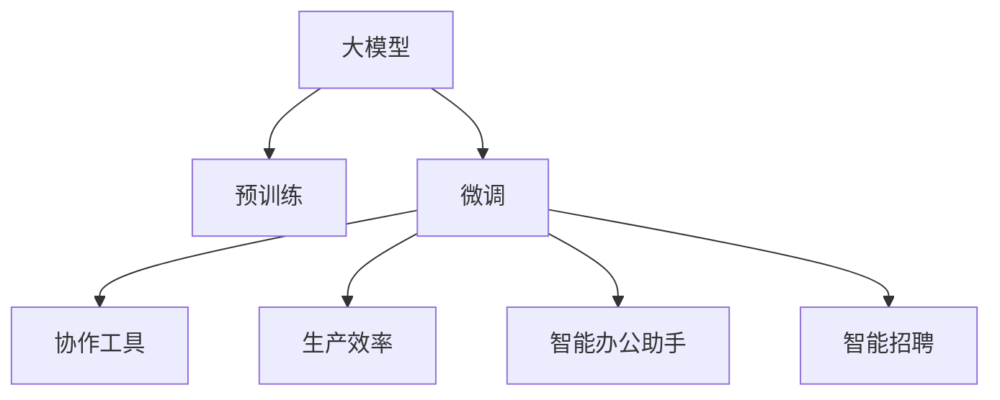

                 

# 大模型在远程办公中的应用探索

> 关键词：大模型,远程办公,协作工具,生产效率,智能办公,智能招聘,智能办公助手,自动化办公

## 1. 背景介绍

### 1.1 问题由来

随着全球经济数字化、智能化转型加速，远程办公已经成为企业的重要选择。然而，疫情期间的突发需求放大了现有远程办公工具的不足，如缺乏高效协作机制、沟通效率低下、办公体验不佳等问题。为解决这些问题，企业正在寻找更智能、高效、便捷的远程办公解决方案。

在这样的背景下，人工智能，尤其是大模型的应用，成为了新的热点。大模型凭借其强大的语言理解能力、生成能力和推理能力，可以帮助企业打造智能化的远程办公生态。具体而言，大模型可以应用于协作工具、生产效率提升、智能办公助手、智能招聘等多个领域，为企业提供自动化办公、智能调度、智能招聘等新工具，从而大幅度提高远程办公的效率和体验。

## 2. 核心概念与联系

### 2.1 核心概念概述

为更好地理解大模型在远程办公中的应用，本节将介绍几个密切相关的核心概念：

- 大模型(Large Model)：指使用深度学习技术训练的大规模神经网络模型，通常具有数十亿个参数。通过在大量数据上预训练，大模型具备了强大的自然语言理解和生成能力。

- 预训练(Pre-training)：指在大规模无标签文本数据上，通过自监督学习任务对大模型进行预训练的过程。大模型通过预训练学习到了通用的语言表示，能够被广泛应用于多种下游任务。

- 微调(Fine-tuning)：指在预训练大模型的基础上，通过有监督学习任务对其进行微调，以适应特定的应用场景。微调可以在预训练模型的基础上调整部分或全部参数，以提升模型在特定任务上的表现。

- 自然语言处理(NLP)：指使用计算机技术处理和分析自然语言，包括文本分类、文本生成、机器翻译等任务。大模型在NLP领域取得了巨大的成功，其强大的自然语言处理能力使其能够更好地支持远程办公的应用场景。

- 协作工具(Collaboration Tools)：指帮助远程办公员工进行有效沟通和协作的工具，如聊天工具、会议工具、文件共享工具等。大模型可以辅助协作工具提供智能推荐、会议记录、自动生成会议纪要等功能。

- 生产效率(Productivity)：指在远程办公中提高工作效率、降低工作成本、提升工作满意度的能力。大模型可以帮助员工自动化办公流程、智能调度任务，从而提高生产效率。

- 智能办公助手(Intelligent Office Assistant)：指使用大模型技术构建的，能够辅助员工完成日常办公任务、智能决策的AI助手。如智能日程安排、智能邮件处理、智能问题解答等。

- 智能招聘(Intelligent Recruitment)：指使用大模型技术进行人才匹配、简历筛选、面试模拟等招聘流程自动化，提升招聘效率和质量。

这些核心概念之间的逻辑关系可以通过以下Mermaid流程图来展示：



这个流程图展示了大模型在远程办公中的核心概念及其相互关系：

1. 大模型通过预训练获得基础能力。
2. 微调可以在特定任务上优化大模型的性能，如协作工具、生产效率提升、智能办公助手、智能招聘等。
3. 协作工具、生产效率、智能办公助手和智能招聘等应用，都需要大模型在特定场景下的微调。
4. 这些应用场景中，大模型通过提供智能化的辅助功能，进一步提升了远程办公的效率和体验。

## 3. 核心算法原理 & 具体操作步骤
### 3.1 算法原理概述

基于大模型的远程办公应用，本质上是一个有监督的微调过程。其核心思想是：将预训练的大模型作为基础，通过在特定任务上微调，使其能够更好地适应远程办公的具体需求。

具体来说，假设预训练模型为 $M_{\theta}$，其中 $\theta$ 为预训练得到的模型参数。给定远程办公相关的特定任务 $T$ 的标注数据集 $D=\{(x_i, y_i)\}_{i=1}^N$，其中 $x_i$ 表示任务输入（如聊天内容、会议记录等），$y_i$ 表示任务的输出（如回复内容、会议纪要等）。微调的目标是找到最优的模型参数 $\hat{\theta}$，使得 $M_{\hat{\theta}}$ 在特定任务 $T$ 上表现最佳。

形式化地，我们有：

$$
\hat{\theta} = \mathop{\arg\min}_{\theta} \mathcal{L}(M_{\theta}, D)
$$

其中 $\mathcal{L}$ 为针对任务 $T$ 设计的损失函数，通常包括交叉熵损失、均方误差损失等。

通过梯度下降等优化算法，微调过程不断更新模型参数 $\theta$，最小化损失函数 $\mathcal{L}$，使得模型输出逼近真实标签。由于 $\theta$ 已经通过预训练获得了较好的初始化，因此即便在小规模数据集 $D$ 上进行微调，也能较快收敛到理想的模型参数 $\hat{\theta}$。

### 3.2 算法步骤详解

基于大模型的远程办公应用一般包括以下几个关键步骤：

**Step 1: 准备预训练模型和数据集**
- 选择合适的预训练语言模型 $M_{\theta}$ 作为初始化参数，如 BERT、GPT 等。
- 准备远程办公相关的标注数据集 $D$，划分为训练集、验证集和测试集。一般要求标注数据与预训练数据的分布不要差异过大。

**Step 2: 添加任务适配层**
- 根据任务类型，在预训练模型顶层设计合适的输出层和损失函数。
- 对于聊天机器人，通常使用基于自回归的模型，如 GPT 系列模型。
- 对于智能会议系统，可以使用基于自编码的模型，如 BERT。
- 对于智能招聘系统，可以设计分类、匹配等任务适配层。

**Step 3: 设置微调超参数**
- 选择合适的优化算法及其参数，如 AdamW、SGD 等，设置学习率、批大小、迭代轮数等。
- 设置正则化技术及强度，包括权重衰减、Dropout、Early Stopping等。
- 确定冻结预训练参数的策略，如仅微调顶层，或全部参数都参与微调。

**Step 4: 执行梯度训练**
- 将训练集数据分批次输入模型，前向传播计算损失函数。
- 反向传播计算参数梯度，根据设定的优化算法和学习率更新模型参数。
- 周期性在验证集上评估模型性能，根据性能指标决定是否触发 Early Stopping。
- 重复上述步骤直到满足预设的迭代轮数或 Early Stopping 条件。

**Step 5: 测试和部署**
- 在测试集上评估微调后模型 $M_{\hat{\theta}}$ 的性能，对比微调前后的精度提升。
- 使用微调后的模型对新样本进行推理预测，集成到实际的应用系统中。
- 持续收集新的数据，定期重新微调模型，以适应数据分布的变化。

以上是基于大模型的远程办公应用的一般流程。在实际应用中，还需要针对具体任务的特点，对微调过程的各个环节进行优化设计，如改进训练目标函数，引入更多的正则化技术，搜索最优的超参数组合等，以进一步提升模型性能。

### 3.3 算法优缺点

基于大模型的远程办公微调方法具有以下优点：
1. 简单高效。只需准备少量标注数据，即可对预训练模型进行快速适配，获得较大的性能提升。
2. 通用适用。适用于各种远程办公任务，包括聊天、会议、招聘等，设计简单的任务适配层即可实现微调。
3. 参数高效。利用参数高效微调技术，在固定大部分预训练权重不变的情况下，仍可取得不错的提升。
4. 效果显著。在学术界和工业界的诸多任务上，基于微调的方法已经刷新了最先进的性能指标。

同时，该方法也存在一定的局限性：
1. 依赖标注数据。微调的效果很大程度上取决于标注数据的质量和数量，获取高质量标注数据的成本较高。
2. 迁移能力有限。当目标任务与预训练数据的分布差异较大时，微调的性能提升有限。
3. 负面效果传递。预训练模型的固有偏见、有害信息等，可能通过微调传递到下游任务，造成负面影响。
4. 可解释性不足。微调模型的决策过程通常缺乏可解释性，难以对其推理逻辑进行分析和调试。

尽管存在这些局限性，但就目前而言，基于大模型微调的方法仍是大模型应用的最主流范式。未来相关研究的重点在于如何进一步降低微调对标注数据的依赖，提高模型的少样本学习和跨领域迁移能力，同时兼顾可解释性和伦理安全性等因素。

### 3.4 算法应用领域

基于大模型的远程办公应用广泛覆盖了以下领域：

- **协作工具**：如聊天机器人、会议纪要生成器等，帮助员工高效沟通、协作。
- **生产效率提升**：如智能调度系统、任务管理工具等，优化远程办公流程，提升生产效率。
- **智能办公助手**：如智能日程安排、智能邮件处理、智能问题解答等，辅助员工完成日常办公任务。
- **智能招聘**：如简历筛选系统、面试模拟系统等，提升招聘效率和质量。
- **自动化办公**：如文档生成、数据分析、财务处理等，减少人工操作，降低办公成本。
- **安全监控**：如网络安全监控、异常行为检测等，保障远程办公的安全性。

除了这些经典应用外，大模型还可能被创新性地应用到更多场景中，如智能会议翻译、智能合同审核、智能客服等，为远程办公带来更多便利和可能性。

## 4. 数学模型和公式 & 详细讲解  
### 4.1 数学模型构建

本节将使用数学语言对基于大模型的远程办公应用过程进行更加严格的刻画。

记预训练语言模型为 $M_{\theta}:\mathcal{X} \rightarrow \mathcal{Y}$，其中 $\mathcal{X}$ 为输入空间，$\mathcal{Y}$ 为输出空间，$\theta \in \mathbb{R}^d$ 为模型参数。假设远程办公相关的标注数据集为 $D=\{(x_i, y_i)\}_{i=1}^N$，其中 $x_i \in \mathcal{X}, y_i \in \mathcal{Y}$。

定义模型 $M_{\theta}$ 在数据样本 $(x,y)$ 上的损失函数为 $\ell(M_{\theta}(x),y)$，则在数据集 $D$ 上的经验风险为：

$$
\mathcal{L}(\theta) = \frac{1}{N} \sum_{i=1}^N \ell(M_{\theta}(x_i),y_i)
$$

微调的优化目标是最小化经验风险，即找到最优参数：

$$
\theta^* = \mathop{\arg\min}_{\theta} \mathcal{L}(\theta)
$$

在实践中，我们通常使用基于梯度的优化算法（如SGD、Adam等）来近似求解上述最优化问题。设 $\eta$ 为学习率，$\lambda$ 为正则化系数，则参数的更新公式为：

$$
\theta \leftarrow \theta - \eta \nabla_{\theta}\mathcal{L}(\theta) - \eta\lambda\theta
$$

其中 $\nabla_{\theta}\mathcal{L}(\theta)$ 为损失函数对参数 $\theta$ 的梯度，可通过反向传播算法高效计算。

### 4.2 公式推导过程

以下我们以智能会议系统为例，推导损失函数及其梯度的计算公式。

假设模型 $M_{\theta}$ 在输入 $x$ 上的输出为 $\hat{y}=M_{\theta}(x) \in [0,1]$，表示样本属于正类的概率。真实标签 $y \in \{0,1\}$。则二分类交叉熵损失函数定义为：

$$
\ell(M_{\theta}(x),y) = -[y\log \hat{y} + (1-y)\log (1-\hat{y})]
$$

将其代入经验风险公式，得：

$$
\mathcal{L}(\theta) = -\frac{1}{N}\sum_{i=1}^N [y_i\log M_{\theta}(x_i)+(1-y_i)\log(1-M_{\theta}(x_i))]
$$

根据链式法则，损失函数对参数 $\theta_k$ 的梯度为：

$$
\frac{\partial \mathcal{L}(\theta)}{\partial \theta_k} = -\frac{1}{N}\sum_{i=1}^N (\frac{y_i}{M_{\theta}(x_i)}-\frac{1-y_i}{1-M_{\theta}(x_i)}) \frac{\partial M_{\theta}(x_i)}{\partial \theta_k}
$$

其中 $\frac{\partial M_{\theta}(x_i)}{\partial \theta_k}$ 可进一步递归展开，利用自动微分技术完成计算。

在得到损失函数的梯度后，即可带入参数更新公式，完成模型的迭代优化。重复上述过程直至收敛，最终得到适应远程办公任务的最优模型参数 $\theta^*$。

## 5. 项目实践：代码实例和详细解释说明
### 5.1 开发环境搭建

在进行远程办公应用实践前，我们需要准备好开发环境。以下是使用Python进行PyTorch开发的环境配置流程：

1. 安装Anaconda：从官网下载并安装Anaconda，用于创建独立的Python环境。

2. 创建并激活虚拟环境：
```bash
conda create -n pytorch-env python=3.8 
conda activate pytorch-env
```

3. 安装PyTorch：根据CUDA版本，从官网获取对应的安装命令。例如：
```bash
conda install pytorch torchvision torchaudio cudatoolkit=11.1 -c pytorch -c conda-forge
```

4. 安装Transformers库：
```bash
pip install transformers
```

5. 安装各类工具包：
```bash
pip install numpy pandas scikit-learn matplotlib tqdm jupyter notebook ipython
```

完成上述步骤后，即可在`pytorch-env`环境中开始远程办公应用实践。

### 5.2 源代码详细实现

下面我以智能会议系统为例，给出使用Transformers库对BERT模型进行微调的PyTorch代码实现。

首先，定义智能会议系统的数据处理函数：

```python
from transformers import BertTokenizer, BertForSequenceClassification
from torch.utils.data import Dataset
import torch

class MeetingDataset(Dataset):
    def __init__(self, texts, labels, tokenizer, max_len=128):
        self.texts = texts
        self.labels = labels
        self.tokenizer = tokenizer
        self.max_len = max_len
        
    def __len__(self):
        return len(self.texts)
    
    def __getitem__(self, item):
        text = self.texts[item]
        label = self.labels[item]
        
        encoding = self.tokenizer(text, return_tensors='pt', max_length=self.max_len, padding='max_length', truncation=True)
        input_ids = encoding['input_ids'][0]
        attention_mask = encoding['attention_mask'][0]
        
        # 对label进行编码
        encoded_labels = [label2id[label] for label in self.labels] 
        encoded_labels.extend([label2id['O']] * (self.max_len - len(encoded_labels)))
        labels = torch.tensor(encoded_labels, dtype=torch.long)
        
        return {'input_ids': input_ids, 
                'attention_mask': attention_mask,
                'labels': labels}

# 标签与id的映射
label2id = {'O': 0, 'Meeting': 1, 'Call': 2, 'Presentation': 3, 'Conference': 4}
id2label = {v: k for k, v in label2id.items()}

# 创建dataset
tokenizer = BertTokenizer.from_pretrained('bert-base-cased')

train_dataset = MeetingDataset(train_texts, train_labels, tokenizer)
dev_dataset = MeetingDataset(dev_texts, dev_labels, tokenizer)
test_dataset = MeetingDataset(test_texts, test_labels, tokenizer)
```

然后，定义模型和优化器：

```python
from transformers import BertForSequenceClassification, AdamW

model = BertForSequenceClassification.from_pretrained('bert-base-cased', num_labels=len(label2id))

optimizer = AdamW(model.parameters(), lr=2e-5)
```

接着，定义训练和评估函数：

```python
from torch.utils.data import DataLoader
from tqdm import tqdm
from sklearn.metrics import classification_report

device = torch.device('cuda') if torch.cuda.is_available() else torch.device('cpu')
model.to(device)

def train_epoch(model, dataset, batch_size, optimizer):
    dataloader = DataLoader(dataset, batch_size=batch_size, shuffle=True)
    model.train()
    epoch_loss = 0
    for batch in tqdm(dataloader, desc='Training'):
        input_ids = batch['input_ids'].to(device)
        attention_mask = batch['attention_mask'].to(device)
        labels = batch['labels'].to(device)
        model.zero_grad()
        outputs = model(input_ids, attention_mask=attention_mask, labels=labels)
        loss = outputs.loss
        epoch_loss += loss.item()
        loss.backward()
        optimizer.step()
    return epoch_loss / len(dataloader)

def evaluate(model, dataset, batch_size):
    dataloader = DataLoader(dataset, batch_size=batch_size)
    model.eval()
    preds, labels = [], []
    with torch.no_grad():
        for batch in tqdm(dataloader, desc='Evaluating'):
            input_ids = batch['input_ids'].to(device)
            attention_mask = batch['attention_mask'].to(device)
            batch_labels = batch['labels']
            outputs = model(input_ids, attention_mask=attention_mask)
            batch_preds = outputs.logits.argmax(dim=2).to('cpu').tolist()
            batch_labels = batch_labels.to('cpu').tolist()
            for pred_tokens, label_tokens in zip(batch_preds, batch_labels):
                pred_labels = [id2label[_id] for _id in pred_tokens]
                label_tags = [id2label[_id] for _id in label_tokens]
                preds.append(pred_labels[:len(label_tags)])
                labels.append(label_tags)
                
    print(classification_report(labels, preds))
```

最后，启动训练流程并在测试集上评估：

```python
epochs = 5
batch_size = 16

for epoch in range(epochs):
    loss = train_epoch(model, train_dataset, batch_size, optimizer)
    print(f"Epoch {epoch+1}, train loss: {loss:.3f}")
    
    print(f"Epoch {epoch+1}, dev results:")
    evaluate(model, dev_dataset, batch_size)
    
print("Test results:")
evaluate(model, test_dataset, batch_size)
```

以上就是使用PyTorch对BERT进行智能会议系统微调的完整代码实现。可以看到，得益于Transformers库的强大封装，我们可以用相对简洁的代码完成BERT模型的加载和微调。

### 5.3 代码解读与分析

让我们再详细解读一下关键代码的实现细节：

**MeetingDataset类**：
- `__init__`方法：初始化文本、标签、分词器等关键组件。
- `__len__`方法：返回数据集的样本数量。
- `__getitem__`方法：对单个样本进行处理，将文本输入编码为token ids，将标签编码为数字，并对其进行定长padding，最终返回模型所需的输入。

**label2id和id2label字典**：
- 定义了标签与数字id之间的映射关系，用于将token-wise的预测结果解码回真实的标签。

**训练和评估函数**：
- 使用PyTorch的DataLoader对数据集进行批次化加载，供模型训练和推理使用。
- 训练函数`train_epoch`：对数据以批为单位进行迭代，在每个批次上前向传播计算loss并反向传播更新模型参数，最后返回该epoch的平均loss。
- 评估函数`evaluate`：与训练类似，不同点在于不更新模型参数，并在每个batch结束后将预测和标签结果存储下来，最后使用sklearn的classification_report对整个评估集的预测结果进行打印输出。

**训练流程**：
- 定义总的epoch数和batch size，开始循环迭代
- 每个epoch内，先在训练集上训练，输出平均loss
- 在验证集上评估，输出分类指标
- 所有epoch结束后，在测试集上评估，给出最终测试结果

可以看到，PyTorch配合Transformers库使得BERT微调的代码实现变得简洁高效。开发者可以将更多精力放在数据处理、模型改进等高层逻辑上，而不必过多关注底层的实现细节。

当然，工业级的系统实现还需考虑更多因素，如模型的保存和部署、超参数的自动搜索、更灵活的任务适配层等。但核心的微调范式基本与此类似。

## 6. 实际应用场景
### 6.1 智能聊天机器人

智能聊天机器人是远程办公中不可或缺的工具，能够帮助员工快速处理日常沟通事务。大模型通过微调，可以适应特定领域的对话需求，提供更加高效、智能的聊天体验。

具体而言，可以收集企业内部的历史聊天记录，将问题和最佳答复构建成监督数据，在此基础上对预训练对话模型进行微调。微调后的聊天机器人能够自动理解用户意图，匹配最合适的答复模板进行回复。对于用户提出的新问题，还可以接入检索系统实时搜索相关内容，动态组织生成回答。如此构建的聊天机器人，能大幅提升用户咨询体验和问题解决效率。

### 6.2 智能日程安排

在远程办公中，时间管理至关重要。大模型可以帮助员工自动化进行日程安排，提高办公效率。通过微调，大模型能够理解自然语言描述的任务，自动生成日程计划、会议提醒等，并能够动态调整日程安排以适应实际变化。例如，在输入“我明天上午9点和张三开会，下午3点参加产品发布会”后，大模型可以自动生成日程安排，并在会议开始前10分钟发送提醒。

### 6.3 智能邮件处理

远程办公中，邮件处理也是一项重要任务。大模型通过微调，可以辅助员工进行邮件分类、智能回复、邮件摘要等操作。通过微调，大模型能够理解邮件内容，自动分类邮件类型，生成回复模板，甚至直接生成邮件摘要。例如，在输入“你约的客户下周来开会，请务必准备演示材料”后，大模型可以自动生成回复邮件，并在日程安排中标注重要事项。

### 6.4 智能问题解答

大模型还可以用于辅助员工解决日常工作中遇到的各类问题。通过微调，大模型能够理解问题描述，自动生成相关答案，甚至在出现不明确或歧义时，向员工推荐更具体的问题解决方案。例如，在输入“如何计算产品收益？”后，大模型可以自动生成答案，并在需要时提供详细的计算步骤或链接。

### 6.5 智能会议系统

大模型还可以应用于智能会议系统，帮助员工高效组织和管理会议。通过微调，大模型能够理解会议议程、参会人员等信息，自动生成会议纪要、提醒参会人员、自动安排会议设备等。例如，在输入“下周二下午2点，与张三、李四讨论新项目方案”后，大模型可以自动生成会议提醒，并在会议结束自动生成会议纪要，方便后续查阅和跟踪。

### 6.6 智能招聘系统

大模型在智能招聘系统中也有广泛应用。通过微调，大模型能够自动进行简历筛选、面试模拟、人才匹配等操作，提升招聘效率和质量。例如，在输入“我们需要一位有5年以上项目管理经验、精通Python的工程师”后，大模型可以自动筛选出符合条件的简历，并生成面试问题。

### 6.7 自动化办公

大模型还可以应用于自动化办公领域，帮助员工自动化完成文档生成、数据分析、财务处理等任务。通过微调，大模型能够理解自然语言描述，自动生成文档模板、数据分析报告、财务报表等，提高办公效率和准确性。例如，在输入“生成一份季度销售报告”后，大模型可以自动生成包含图表、数据的销售报告，并在生成过程中进行数据验证和格式化处理。

## 7. 工具和资源推荐
### 7.1 学习资源推荐

为了帮助开发者系统掌握大模型在远程办公中的应用，这里推荐一些优质的学习资源：

1. 《Transformers: From Discrete to Continuous Transformers》系列博文：由大模型技术专家撰写，深入浅出地介绍了Transformers原理、BERT模型、微调技术等前沿话题。

2. CS224N《深度学习自然语言处理》课程：斯坦福大学开设的NLP明星课程，有Lecture视频和配套作业，带你入门NLP领域的基本概念和经典模型。

3. 《Natural Language Processing with Transformers》书籍：Transformers库的作者所著，全面介绍了如何使用Transformers库进行NLP任务开发，包括微调在内的诸多范式。

4. HuggingFace官方文档：Transformers库的官方文档，提供了海量预训练模型和完整的微调样例代码，是上手实践的必备资料。

5. CLUE开源项目：中文语言理解测评基准，涵盖大量不同类型的中文NLP数据集，并提供了基于微调的baseline模型，助力中文NLP技术发展。

通过对这些资源的学习实践，相信你一定能够快速掌握大模型在远程办公中的应用技巧，并用于解决实际的NLP问题。
###  7.2 开发工具推荐

高效的开发离不开优秀的工具支持。以下是几款用于大模型在远程办公中应用的常用工具：

1. PyTorch：基于Python的开源深度学习框架，灵活动态的计算图，适合快速迭代研究。大部分预训练语言模型都有PyTorch版本的实现。

2. TensorFlow：由Google主导开发的开源深度学习框架，生产部署方便，适合大规模工程应用。同样有丰富的预训练语言模型资源。

3. Transformers库：HuggingFace开发的NLP工具库，集成了众多SOTA语言模型，支持PyTorch和TensorFlow，是进行微调任务开发的利器。

4. Weights & Biases：模型训练的实验跟踪工具，可以记录和可视化模型训练过程中的各项指标，方便对比和调优。与主流深度学习框架无缝集成。

5. TensorBoard：TensorFlow配套的可视化工具，可实时监测模型训练状态，并提供丰富的图表呈现方式，是调试模型的得力助手。

6. Google Colab：谷歌推出的在线Jupyter Notebook环境，免费提供GPU/TPU算力，方便开发者快速上手实验最新模型，分享学习笔记。

合理利用这些工具，可以显著提升大模型在远程办公应用的开发效率，加快创新迭代的步伐。

### 7.3 相关论文推荐

大模型在远程办公领域的应用源于学界的持续研究。以下是几篇奠基性的相关论文，推荐阅读：

1. Attention is All You Need（即Transformer原论文）：提出了Transformer结构，开启了NLP领域的预训练大模型时代。

2. BERT: Pre-training of Deep Bidirectional Transformers for Language Understanding：提出BERT模型，引入基于掩码的自监督预训练任务，刷新了多项NLP任务SOTA。

3. Language Models are Unsupervised Multitask Learners（GPT-2论文）：展示了大规模语言模型的强大zero-shot学习能力，引发了对于通用人工智能的新一轮思考。

4. Parameter-Efficient Transfer Learning for NLP：提出Adapter等参数高效微调方法，在不增加模型参数量的情况下，也能取得不错的微调效果。

5. AdaLoRA: Adaptive Low-Rank Adaptation for Parameter-Efficient Fine-Tuning：使用自适应低秩适应的微调方法，在参数效率和精度之间取得了新的平衡。

这些论文代表了大模型在远程办公领域的研究方向。通过学习这些前沿成果，可以帮助研究者把握学科前进方向，激发更多的创新灵感。

## 8. 总结：未来发展趋势与挑战

### 8.1 总结

本文对基于大模型的远程办公应用进行了全面系统的介绍。首先阐述了大模型和微调技术的研究背景和意义，明确了大模型在远程办公中提供的强大功能和性能提升。其次，从原理到实践，详细讲解了微调的数学原理和关键步骤，给出了远程办公应用的完整代码实例。同时，本文还广泛探讨了大模型在协作工具、生产效率提升、智能办公助手、智能招聘等多个领域的应用前景，展示了其广泛的适用性和潜在的巨大价值。此外，本文精选了远程办公应用的各类学习资源，力求为读者提供全方位的技术指引。

通过本文的系统梳理，可以看到，基于大模型的远程办公应用已经在多个方面展现了其独特的优势，极大地提升了远程办公的效率和体验。未来，伴随大模型技术的持续演进，远程办公系统必将在自动化、智能化、协作化等方面迈向新的高度，成为构建高效、智能、灵活办公环境的重要支撑。

### 8.2 未来发展趋势

展望未来，大模型在远程办公领域的应用将呈现以下几个发展趋势：

1. 智能办公助手普及化。大模型技术将进一步提升智能办公助手的智能化水平，使其能够更好地辅助员工完成日常办公任务，如智能日程安排、智能邮件处理、智能问题解答等。

2. 协作工具智能化。大模型将广泛应用于协作工具，提升远程团队沟通效率和协作质量，如智能聊天机器人、智能会议系统、智能项目管理工具等。

3. 自动化办公普及化。大模型将广泛应用于自动化办公领域，如文档生成、数据分析、财务处理等，帮助企业降低人工成本，提高办公效率。

4. 智能招聘系统成熟化。大模型在智能招聘系统中的应用将更加成熟，能够自动进行简历筛选、面试模拟、人才匹配等操作，提升招聘效率和质量。

5. 多模态应用多样化。大模型将广泛应用于多模态应用场景，如智能视频会议、智能语音识别等，提升远程办公的多模态交互体验。

6. 跨领域迁移能力提升。大模型将具备更强的跨领域迁移能力，能够在不同任务和场景中快速适配，提供更广泛的应用可能性。

这些趋势将进一步拓展大模型在远程办公中的应用边界，为构建高效、智能、灵活的办公环境提供更多可能性。

### 8.3 面临的挑战

尽管大模型在远程办公中的应用前景广阔，但在迈向更加智能化、普适化应用的过程中，它仍面临着诸多挑战：

1. 标注成本瓶颈。虽然大模型微调能够在一定程度上降低标注成本，但对于长尾应用场景，仍需要收集大量的高质量标注数据，标注成本仍较高。如何进一步降低微调对标注样本的依赖，将是一大难题。

2. 模型鲁棒性不足。当前大模型在面对域外数据时，泛化性能往往大打折扣。对于测试样本的微小扰动，大模型的预测也容易发生波动。如何提高大模型的鲁棒性，避免灾难性遗忘，还需要更多理论和实践的积累。

3. 推理效率有待提高。大规模语言模型虽然精度高，但在实际部署时往往面临推理速度慢、内存占用大等效率问题。如何在保证性能的同时，简化模型结构，提升推理速度，优化资源占用，将是重要的优化方向。

4. 可解释性亟需加强。当前大模型通常缺乏可解释性，难以解释其内部工作机制和决策逻辑。对于医疗、金融等高风险应用，算法的可解释性和可审计性尤为重要。如何赋予大模型更强的可解释性，将是亟待攻克的难题。

5. 安全性有待保障。大模型可能学习到有偏见、有害的信息，通过微调传递到下游任务，产生误导性、歧视性的输出，给实际应用带来安全隐患。如何从数据和算法层面消除模型偏见，避免恶意用途，确保输出的安全性，也将是重要的研究课题。

6. 知识整合能力不足。现有的微调模型往往局限于任务内数据，难以灵活吸收和运用更广泛的先验知识。如何让微调过程更好地与外部知识库、规则库等专家知识结合，形成更加全面、准确的信息整合能力，还有很大的想象空间。

正视大模型在远程办公应用中面临的这些挑战，积极应对并寻求突破，将是大模型技术走向成熟的重要标志。相信随着学界和产业界的共同努力，这些挑战终将一一被克服，大模型必将在构建高效、智能、灵活的办公环境中扮演越来越重要的角色。

### 8.4 研究展望

面向未来，大模型在远程办公领域的应用需要从以下几个方面进行深入研究：

1. 探索无监督和半监督微调方法。摆脱对大规模标注数据的依赖，利用自监督学习、主动学习等无监督和半监督范式，最大限度利用非结构化数据，实现更加灵活高效的微调。

2. 研究参数高效和计算高效的微调范式。开发更加参数高效的微调方法，在固定大部分预训练参数的同时，只更新极少量的任务相关参数。同时优化微调模型的计算图，减少前向传播和反向传播的资源消耗，实现更加轻量级、实时性的部署。

3. 融合因果和对比学习范式。通过引入因果推断和对比学习思想，增强大模型建立稳定因果关系的能力，学习更加普适、鲁棒的语言表征，从而提升模型泛化性和抗干扰能力。

4. 引入更多先验知识。将符号化的先验知识，如知识图谱、逻辑规则等，与神经网络模型进行巧妙融合，引导微调过程学习更准确、合理的语言模型。同时加强不同模态数据的整合，实现视觉、语音等多模态信息与文本信息的协同建模。

5. 结合因果分析和博弈论工具。将因果分析方法引入大模型，识别出模型决策的关键特征，增强输出解释的因果性和逻辑性。借助博弈论工具刻画人机交互过程，主动探索并规避模型的脆弱点，提高系统稳定性。

6. 纳入伦理道德约束。在模型训练目标中引入伦理导向的评估指标，过滤和惩罚有偏见、有害的输出倾向。同时加强人工干预和审核，建立模型行为的监管机制，确保输出符合人类价值观和伦理道德。

这些研究方向将引领大模型在远程办公领域的应用不断突破，为构建安全、可靠、可解释、可控的智能系统提供新的方向和思路。面向未来，大模型在远程办公领域的研究还需要与其他人工智能技术进行更深入的融合，如知识表示、因果推理、强化学习等，多路径协同发力，共同推动远程办公系统的进步。只有勇于创新、敢于突破，才能不断拓展大模型在远程办公中的应用边界，让智能技术更好地造福人类社会。

## 9. 附录：常见问题与解答
**Q1：大模型微调能否适用于所有远程办公任务？**

A: 大模型微调在大多数远程办公任务上都能取得不错的效果，特别是对于数据量较小的任务。但对于一些特定领域的任务，如医学、法律等，仅仅依靠通用语料预训练的模型可能难以很好地适应。此时需要在特定领域语料上进一步预训练，再进行微调，才能获得理想效果。此外，对于一些需要时效性、个性化很强的任务，如对话、推荐等，微调方法也需要针对性的改进优化。

**Q2：大模型微调过程中如何选择合适的学习率？**

A: 大模型微调的学习率一般要比预训练时小1-2个数量级，如果使用过大的学习率，容易破坏预训练权重，导致过拟合。一般建议从1e-5开始调参，逐步减小学习率，直至收敛。也可以使用warmup策略，在开始阶段使用较小的学习率，再逐渐过渡到预设值。需要注意的是，不同的优化器(如AdamW、Adafactor等)以及不同的学习率调度策略，可能需要设置不同的学习率阈值。

**Q3：大模型微调在远程办公应用中面临哪些资源瓶颈？**

A: 目前主流的预训练大模型动辄以亿计的参数规模，对算力、内存、存储都提出了很高的要求。GPU/TPU等高性能设备是必不可少的，但即便如此，超大批次的训练和推理也可能遇到显存不足的问题。因此需要采用一些资源优化技术，如梯度积累、混合精度训练、模型并行等，来突破硬件瓶颈。同时，模型的存储和读取也可能占用大量时间和空间，需要采用模型压缩、稀疏化存储等方法进行优化。

**Q4：如何缓解大模型微调过程中的过拟合问题？**

A: 过拟合是微调面临的主要挑战，尤其是在标注数据不足的情况下。常见的缓解策略包括：
1. 数据增强：通过回译、近义替换等方式扩充训练集
2. 正则化：使用L2正则、Dropout、Early Stopping等避免过拟合
3. 对抗训练：引入对抗样本，提高模型鲁棒性
4. 参数高效微调：只调整少量参数(如Adapter、Prefix等)，减小过拟合风险
5. 多模型集成：训练多个微调模型，取平均输出，抑制过拟合

这些策略往往需要根据具体任务和数据特点进行灵活组合。只有在数据、模型、训练、推理等各环节进行全面优化，才能最大限度地发挥大模型微调的威力。

**Q5：大模型在远程办公中的应用场景有哪些？**

A: 大模型在远程办公中的应用场景非常广泛，包括协作工具、生产效率提升、智能办公助手、智能招聘等。具体而言：
1. 协作工具：如聊天机器人、会议纪要生成器等，帮助员工高效沟通、协作。
2. 生产效率提升：如智能调度系统、任务管理工具等，优化远程办公流程，提升生产效率。
3. 智能办公助手：如智能日程安排、智能邮件处理、智能问题解答等，辅助员工完成日常办公任务。
4. 智能招聘：如简历筛选系统、面试模拟系统等，提升招聘效率和质量。
5. 自动化办公：如文档生成、数据分析、财务处理等，减少人工操作，降低办公成本。
6. 安全监控：如网络安全监控、异常行为检测等，保障远程办公的安全性。

这些应用场景覆盖了远程办公的多个方面，展示了大模型在提升办公效率、优化办公体验、保障办公安全等方面的巨大潜力。

**Q6：大模型在远程办公中如何实现智能化？**

A: 大模型在远程办公中的智能化主要通过微调实现。具体而言，可以收集企业内部的历史数据，如聊天记录、会议纪要、邮件等，构建监督数据集。在此基础上对大模型进行微调，使其能够自动理解文本内容，生成智能回复、会议纪要、日程安排等。例如，通过微调，大模型可以自动识别用户意图，匹配最合适的回复模板；自动生成会议纪要，并在会议结束后自动归档；自动分析邮件内容，生成智能回复模板等。这些智能化的功能极大地提升了远程办公的效率和体验。

**Q7：大模型在远程办公中的应用面临哪些挑战？**

A: 尽管大模型在远程办公中的应用前景广阔，但在迈向更加智能化、普适化应用的过程中，它仍面临着诸多挑战：
1. 标注成本瓶颈。虽然大模型微调能够在一定程度上降低标注成本，但对于长尾应用场景，仍需要收集大量的高质量标注数据，标注成本仍较高。如何进一步降低微调对标注样本的依赖，将是一大难题。
2. 模型鲁棒性不足。当前大模型在面对域外数据时，泛化性能往往大打折扣。对于测试样本的微小扰动，大模型的预测也容易发生波动。如何提高大模型的鲁棒性，避免灾难性遗忘，还需要更多理论和实践的积累。
3. 推理效率有待提高。大规模语言模型虽然精度高，但在实际部署时往往面临推理速度慢、内存占用大等效率问题。如何在保证性能的同时，简化模型结构，提升推理速度，优化资源占用，将是重要的优化方向。
4. 可解释性亟需加强。当前大模型通常缺乏可解释性，难以解释其内部工作机制和决策逻辑。对于医疗、金融等高风险应用，算法的可解释性和可审计性尤为重要。如何赋予大模型更强的可解释性，将是亟待攻克的难题。
5. 安全性有待保障。大模型可能学习到有偏见、有害的信息，通过微调传递到下游任务，产生误导性、歧视性的输出，给实际应用带来安全隐患。如何从数据和算法层面消除模型偏见，避免恶意用途，确保输出的安全性，也将是重要的研究课题。
6. 知识整合能力不足。现有的微调模型往往局限于任务内数据，难以灵活吸收和运用更广泛的先验知识。如何让微调过程更好地与外部知识库、规则库等专家知识结合，形成更加全面、准确的信息整合能力，还有很大的想象空间。

正视大模型在远程办公应用中面临的这些挑战，积极应对并寻求突破，将是大模型技术走向成熟的重要标志。相信随着学界和产业界的共同努力，这些挑战终将一一被克服，大模型必将在构建高效、智能、灵活的办公环境中扮演越来越重要的角色。

综上所述，大模型在远程办公中的应用具有广阔的前景，但也面临着标注数据、模型鲁棒性、推理效率、可解释性、安全性等多方面的挑战。通过不断优化微调方法，引入更多先验知识，提升模型的跨领域迁移能力，大模型必将在未来的远程办公应用中发挥更大的作用，

