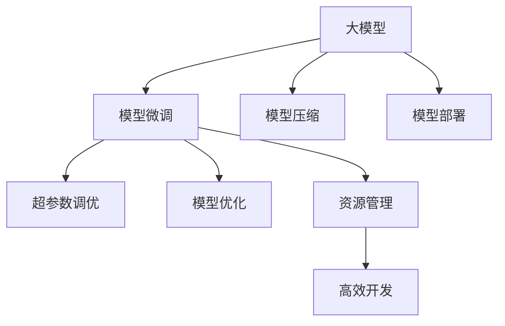

                 

# 大模型应用开发的实用技术

> 关键词：大模型,应用开发,实用技术,深度学习,计算机视觉,自然语言处理,NLP,模型部署,模型压缩,模型微调,超参数调优,模型优化,资源管理,软件架构,高效开发,高性能计算

## 1. 背景介绍

### 1.1 问题由来
近年来，深度学习技术的快速发展，尤其是大模型（Large Models）的涌现，极大地推动了计算机视觉（Computer Vision, CV）和自然语言处理（Natural Language Processing, NLP）领域的进步。例如，OpenAI的GPT系列、Google的BERT等模型在多个NLP任务上取得了SOTA（State-of-The-Art）的成绩，展示了其强大的通用语言能力。然而，随着模型规模的增大，其应用复杂性也随之增加，这对开发者提出了更高的要求。

面对这一挑战，业内专家提出了大模型应用开发的实用技术，包括但不限于模型微调、模型压缩、模型部署等。本文将系统介绍这些实用技术，帮助开发者在实际应用中高效、安全地使用大模型，以推动AI技术在各行各业中的应用和落地。

### 1.2 问题核心关键点
大模型应用开发的实用技术主要包括：

- **模型微调(Fine-Tuning)**：在大模型基础上针对特定任务进行微调，以提高模型性能。
- **模型压缩(Pruning and Quantization)**：减少模型参数和计算量，提升模型部署效率。
- **模型部署(Deployment)**：将模型部署到生产环境，提供稳定、高效的服务。
- **超参数调优(Hyperparameter Tuning)**：通过调整模型参数优化模型性能。
- **模型优化(Optimization)**：优化模型计算图，提升推理速度和稳定性。
- **资源管理(Resource Management)**：管理模型计算资源，确保模型高效运行。
- **高效开发(Effective Development)**：使用先进的开发工具和技术，提升模型开发效率。

这些技术是确保大模型在实际应用中发挥最大效能的关键。

## 2. 核心概念与联系

### 2.1 核心概念概述

为更好地理解大模型应用开发的实用技术，本节将介绍几个密切相关的核心概念：

- **大模型(Large Models)**：具有数百万或数十亿个参数的深度神经网络，如BERT、GPT-3、ResNet等，这些模型在预训练后可以在特定任务上进行微调。
- **模型微调(Fine-Tuning)**：在大模型基础上，通过有标签数据对其进行微调，以适应特定任务，提升模型性能。
- **模型压缩(Pruning and Quantization)**：通过剪枝、量化等技术减少模型参数和计算量，降低模型部署的资源需求。
- **模型部署(Deployment)**：将训练好的模型部署到服务器、边缘设备或移动端，提供稳定、高效的服务。
- **超参数调优(Hyperparameter Tuning)**：通过调整学习率、批大小、正则化强度等超参数，优化模型性能。
- **模型优化(Optimization)**：优化模型的计算图，提升推理速度和稳定性，例如使用自动微分和静态图优化技术。
- **资源管理(Resource Management)**：管理模型计算资源，如GPU、内存等，确保模型高效运行。
- **高效开发(Effective Development)**：使用先进的开发工具和技术，如TensorFlow、PyTorch等框架，提升模型开发效率。

这些核心概念之间的逻辑关系可以通过以下Mermaid流程图来展示：



这个流程图展示了大模型应用开发的实用技术的主要流程：

1. 大模型通过预训练学习通用的语言知识，可在特定任务上进行微调。
2. 模型压缩可以减小模型参数和计算量，提升部署效率。
3. 模型部署将训练好的模型部署到实际应用环境，提供服务。
4. 超参数调优通过调整模型参数优化性能。
5. 模型优化提升推理速度和稳定性。
6. 资源管理确保模型高效运行。
7. 高效开发提升模型开发效率。

这些概念共同构成了大模型应用开发的框架，使开发者能够利用这些技术在实际应用中充分发挥大模型的效能。

## 3. 核心算法原理 & 具体操作步骤
### 3.1 算法原理概述

大模型应用开发的实用技术核心在于如何高效地利用大模型的预训练知识和多任务学习，以适应不同应用场景和提升性能。以模型微调为例，其核心思想是：在大模型的基础上，利用少量有标签数据进行有监督训练，优化模型参数，使其在特定任务上表现优异。

具体而言，假设大模型为 $M_{\theta}$，其中 $\theta$ 为模型参数。给定特定任务 $T$ 的标注数据集 $D=\{(x_i, y_i)\}_{i=1}^N$，微调的目标是找到新的模型参数 $\hat{\theta}$，使得：

$$
\hat{\theta}=\mathop{\arg\min}_{\theta} \mathcal{L}(M_{\theta},D)
$$

其中 $\mathcal{L}$ 为针对任务 $T$ 设计的损失函数，用于衡量模型预测输出与真实标签之间的差异。常见的损失函数包括交叉熵损失、均方误差损失等。

### 3.2 算法步骤详解

基于模型微调的核心思想，本节将详细讲解模型微调的具体操作步骤：

**Step 1: 准备预训练模型和数据集**
- 选择合适的预训练语言模型 $M_{\theta}$ 作为初始化参数，如 BERT、GPT等。
- 准备特定任务 $T$ 的标注数据集 $D$，划分为训练集、验证集和测试集。一般要求标注数据与预训练数据的分布不要差异过大。

**Step 2: 设计任务适配层**
- 根据任务类型，在预训练模型顶层设计合适的输出层和损失函数。
- 对于分类任务，通常在顶层添加线性分类器和交叉熵损失函数。
- 对于生成任务，通常使用语言模型的解码器输出概率分布，并以负对数似然为损失函数。

**Step 3: 设置微调超参数**
- 选择合适的优化算法及其参数，如 AdamW、SGD 等，设置学习率、批大小、迭代轮数等。
- 设置正则化技术及强度，包括权重衰减、Dropout、Early Stopping 等。
- 确定冻结预训练参数的策略，如仅微调顶层，或全部参数都参与微调。

**Step 4: 执行梯度训练**
- 将训练集数据分批次输入模型，前向传播计算损失函数。
- 反向传播计算参数梯度，根据设定的优化算法和学习率更新模型参数。
- 周期性在验证集上评估模型性能，根据性能指标决定是否触发 Early Stopping。
- 重复上述步骤直到满足预设的迭代轮数或 Early Stopping 条件。

**Step 5: 测试和部署**
- 在测试集上评估微调后模型 $M_{\hat{\theta}}$ 的性能，对比微调前后的精度提升。
- 使用微调后的模型对新样本进行推理预测，集成到实际的应用系统中。
- 持续收集新的数据，定期重新微调模型，以适应数据分布的变化。

以上就是基于模型微调的主要操作步骤。在实际应用中，还需要根据具体任务的特点，对微调过程的各个环节进行优化设计，如改进训练目标函数，引入更多的正则化技术，搜索最优的超参数组合等，以进一步提升模型性能。

### 3.3 算法优缺点

模型微调的核心算法具有以下优点：

- **简单高效**：仅需准备少量标注数据，即可对预训练模型进行快速适配，获得较大的性能提升。
- **通用适用**：适用于各种NLP下游任务，包括分类、匹配、生成等，设计简单的任务适配层即可实现微调。
- **参数高效**：利用参数高效微调技术，在固定大部分预训练权重不变的情况下，仍可取得不错的提升。
- **效果显著**：在学术界和工业界的诸多任务上，基于微调的方法已经刷新了最先进的性能指标。

同时，该算法也存在一定的局限性：

- **依赖标注数据**：微调的效果很大程度上取决于标注数据的质量和数量，获取高质量标注数据的成本较高。
- **迁移能力有限**：当目标任务与预训练数据的分布差异较大时，微调的性能提升有限。
- **可解释性不足**：微调模型的决策过程通常缺乏可解释性，难以对其推理逻辑进行分析和调试。

尽管存在这些局限性，但就目前而言，基于监督学习的微调方法仍是大模型应用开发的主流范式。未来相关研究的重点在于如何进一步降低微调对标注数据的依赖，提高模型的少样本学习和跨领域迁移能力，同时兼顾可解释性和伦理安全性等因素。

### 3.4 算法应用领域

模型微调技术已经在多个领域得到了广泛的应用，包括但不限于：

- **自然语言处理(NLP)**：如情感分析、文本分类、命名实体识别等。通过微调使模型学习文本-标签映射，提升模型对特定任务的理解能力。
- **计算机视觉(CV)**：如目标检测、图像分类、语义分割等。通过微调使模型学习图像-类别映射，提升模型对视觉信息的理解能力。
- **语音识别(Speech Recognition)**：如语音识别、语音生成等。通过微调使模型学习语音-文本映射，提升模型对语音信号的理解能力。
- **推荐系统(Recommendation Systems)**：如商品推荐、内容推荐等。通过微调使模型学习用户-商品/内容映射，提升推荐准确性。
- **智能对话系统(Chatbots)**：如客户服务、智能助手等。通过微调使模型学习对话历史-回复映射，提升智能对话系统的互动性。

除了这些经典任务外，模型微调技术还被创新性地应用到更多场景中，如知识图谱构建、信息检索、多模态学习等，为不同领域的智能化应用提供了新的技术路径。

## 4. 数学模型和公式 & 详细讲解 & 举例说明

### 4.1 数学模型构建

为了更好地理解模型微调的数学原理，本节将使用数学语言对模型微调过程进行更加严格的刻画。

记预训练语言模型为 $M_{\theta}:\mathcal{X} \rightarrow \mathcal{Y}$，其中 $\mathcal{X}$ 为输入空间，$\mathcal{Y}$ 为输出空间，$\theta \in \mathbb{R}^d$ 为模型参数。假设微调任务的训练集为 $D=\{(x_i,y_i)\}_{i=1}^N, x_i \in \mathcal{X}, y_i \in \mathcal{Y}$。

定义模型 $M_{\theta}$ 在数据样本 $(x,y)$ 上的损失函数为 $\ell(M_{\theta}(x),y)$，则在数据集 $D$ 上的经验风险为：

$$
\mathcal{L}(\theta) = \frac{1}{N} \sum_{i=1}^N \ell(M_{\theta}(x_i),y_i)
$$

微调的优化目标是最小化经验风险，即找到最优参数：

$$
\theta^* = \mathop{\arg\min}_{\theta} \mathcal{L}(\theta)
$$

在实践中，我们通常使用基于梯度的优化算法（如SGD、Adam等）来近似求解上述最优化问题。设 $\eta$ 为学习率，$\lambda$ 为正则化系数，则参数的更新公式为：

$$
\theta \leftarrow \theta - \eta \nabla_{\theta}\mathcal{L}(\theta) - \eta\lambda\theta
$$

其中 $\nabla_{\theta}\mathcal{L}(\theta)$ 为损失函数对参数 $\theta$ 的梯度，可通过反向传播算法高效计算。

### 4.2 公式推导过程

以下我们以二分类任务为例，推导交叉熵损失函数及其梯度的计算公式。

假设模型 $M_{\theta}$ 在输入 $x$ 上的输出为 $\hat{y}=M_{\theta}(x) \in [0,1]$，表示样本属于正类的概率。真实标签 $y \in \{0,1\}$。则二分类交叉熵损失函数定义为：

$$
\ell(M_{\theta}(x),y) = -[y\log \hat{y} + (1-y)\log (1-\hat{y})]
$$

将其代入经验风险公式，得：

$$
\mathcal{L}(\theta) = -\frac{1}{N}\sum_{i=1}^N [y_i\log M_{\theta}(x_i)+(1-y_i)\log(1-M_{\theta}(x_i))]
$$

根据链式法则，损失函数对参数 $\theta_k$ 的梯度为：

$$
\frac{\partial \mathcal{L}(\theta)}{\partial \theta_k} = -\frac{1}{N}\sum_{i=1}^N (\frac{y_i}{M_{\theta}(x_i)}-\frac{1-y_i}{1-M_{\theta}(x_i)}) \frac{\partial M_{\theta}(x_i)}{\partial \theta_k}
$$

其中 $\frac{\partial M_{\theta}(x_i)}{\partial \theta_k}$ 可进一步递归展开，利用自动微分技术完成计算。

在得到损失函数的梯度后，即可带入参数更新公式，完成模型的迭代优化。重复上述过程直至收敛，最终得到适应下游任务的最优模型参数 $\theta^*$。

### 4.3 案例分析与讲解

为了更好地理解模型微调的数学原理，以下我们以二分类任务为例，通过具体的案例分析与讲解，进一步说明模型微调的数学推导过程。

假设我们有一个二分类任务，即判断一张图片是否包含人脸。我们选取了一个公开的数据集，包含10,000张图片，其中5,000张包含人脸，5,000张不包含人脸。我们决定使用预训练的ResNet模型作为基础模型，对其进行微调。

**Step 1: 准备预训练模型和数据集**
- 我们选择ResNet-50作为预训练模型。
- 准备公开数据集，并划分为训练集、验证集和测试集。

**Step 2: 设计任务适配层**
- 由于这是一个二分类任务，我们在ResNet顶层添加一个全连接层，并使用 sigmoid 函数进行输出。
- 损失函数选择二元交叉熵损失。

**Step 3: 设置微调超参数**
- 使用 AdamW 优化器，设置学习率为1e-3。
- 设置正则化强度为0.001。

**Step 4: 执行梯度训练**
- 将训练集数据分批次输入模型，前向传播计算损失函数。
- 反向传播计算参数梯度，根据 AdamW 更新模型参数。
- 周期性在验证集上评估模型性能，根据准确率决定是否触发 Early Stopping。
- 重复上述步骤直到满足预设的迭代轮数或 Early Stopping 条件。

**Step 5: 测试和部署**
- 在测试集上评估微调后模型 $M_{\hat{\theta}}$ 的性能，对比微调前后的精度提升。
- 使用微调后的模型对新样本进行推理预测，集成到实际的应用系统中。

以上步骤展示了如何基于模型微调解决一个具体的计算机视觉问题。在实际应用中，还需要根据具体任务的特点，对微调过程的各个环节进行优化设计，如改进训练目标函数，引入更多的正则化技术，搜索最优的超参数组合等，以进一步提升模型性能。

## 5. 项目实践：代码实例和详细解释说明

### 5.1 开发环境搭建

在进行模型微调实践前，我们需要准备好开发环境。以下是使用Python进行TensorFlow开发的环境配置流程：

1. 安装Anaconda：从官网下载并安装Anaconda，用于创建独立的Python环境。

2. 创建并激活虚拟环境：
```bash
conda create -n tf-env python=3.8 
conda activate tf-env
```

3. 安装TensorFlow：根据CUDA版本，从官网获取对应的安装命令。例如：
```bash
conda install tensorflow==2.8
```

4. 安装相关依赖：
```bash
pip install numpy scipy matplotlib scikit-learn tensorflow_datasets
```

完成上述步骤后，即可在`tf-env`环境中开始模型微调实践。

### 5.2 源代码详细实现

这里我们以图像分类为例，使用TensorFlow进行模型微调。具体代码实现如下：

```python
import tensorflow as tf
from tensorflow.keras import layers
from tensorflow.keras.datasets import cifar10

# 加载数据集
(x_train, y_train), (x_test, y_test) = cifar10.load_data()

# 数据预处理
x_train = x_train / 255.0
x_test = x_test / 255.0

# 定义模型
model = tf.keras.Sequential([
    layers.Conv2D(32, (3, 3), activation='relu', input_shape=(32, 32, 3)),
    layers.MaxPooling2D((2, 2)),
    layers.Conv2D(64, (3, 3), activation='relu'),
    layers.MaxPooling2D((2, 2)),
    layers.Conv2D(128, (3, 3), activation='relu'),
    layers.MaxPooling2D((2, 2)),
    layers.Flatten(),
    layers.Dense(10, activation='softmax')
])

# 编译模型
model.compile(optimizer='adam', loss='sparse_categorical_crossentropy', metrics=['accuracy'])

# 训练模型
model.fit(x_train, y_train, epochs=10, validation_data=(x_test, y_test))

# 评估模型
model.evaluate(x_test, y_test)
```

这段代码实现了一个简单的卷积神经网络模型，用于对CIFAR-10数据集进行分类任务微调。具体步骤如下：

1. 加载数据集并进行数据预处理。
2. 定义模型结构，包含卷积层、池化层、全连接层等。
3. 编译模型，选择合适的优化器和损失函数。
4. 训练模型，使用训练集进行迭代训练。
5. 在测试集上评估模型性能。

### 5.3 代码解读与分析

让我们再详细解读一下关键代码的实现细节：

**数据预处理**：
- 将像素值归一化到0-1之间，增强模型对输入数据的敏感度。
- 使用`cifar10.load_data()`加载数据集，并划分为训练集和测试集。

**模型定义**：
- 使用`tf.keras.Sequential`定义模型结构，包含多个卷积层、池化层和全连接层。
- 在顶层使用`Dense`层，输出10个类别，对应CIFAR-10数据集中的10个类别。

**模型编译**：
- 使用`model.compile()`方法，设置优化器为Adam，损失函数为交叉熵，评价指标为准确率。

**模型训练**：
- 使用`model.fit()`方法，对模型进行10轮迭代训练。
- 在每个epoch结束时，模型在验证集上进行性能评估，判断是否停止训练。

**模型评估**：
- 使用`model.evaluate()`方法，在测试集上评估模型性能，输出准确率。

可以看到，TensorFlow提供了非常便捷的工具和API，使得模型微调的代码实现变得简洁高效。开发者可以将更多精力放在模型架构和超参数调整上，而不必过多关注底层的实现细节。

当然，工业级的系统实现还需考虑更多因素，如模型的保存和部署、超参数的自动搜索、更灵活的任务适配层等。但核心的微调范式基本与此类似。

## 6. 实际应用场景

### 6.1 智能医疗诊断

基于大模型微调的技术，智能医疗诊断系统能够高效地利用电子病历、医学影像等数据，进行疾病诊断和辅助诊疗。例如，将医生对病人病历的描述和影像数据作为输入，使用预训练的BERT模型进行微调，可以自动判断病人的病情和可能的治疗方案。

在技术实现上，可以收集大量的电子病历和医学影像数据，标注医生对这些数据的诊断结果，在此基础上对BERT模型进行微调。微调后的模型能够自动理解病人症状描述，并从医学知识库中提取相关信息，进行疾病诊断和治疗方案推荐。

### 6.2 智能交通管理

智能交通管理系统通过实时监控交通数据，利用大模型进行交通流量预测和事故预警。例如，将交通摄像头拍摄的实时视频数据输入模型，使用预训练的YOLO或Faster R-CNN模型进行微调，可以实时检测交通异常，如交通事故、拥堵等，并及时发出预警。

在技术实现上，可以收集大量的交通视频数据，标注其中的交通事件，在此基础上对YOLO或Faster R-CNN模型进行微调。微调后的模型能够实时分析交通视频数据，检测出交通事件，并进行分类和预警。

### 6.3 智能推荐系统

智能推荐系统通过分析用户的历史行为数据，利用大模型进行商品或内容推荐。例如，将用户的浏览、购买、评分等行为数据输入模型，使用预训练的Transformer模型进行微调，可以自动生成推荐结果，提升用户满意度。

在技术实现上，可以收集用户的行为数据，标注用户对不同商品或内容的兴趣程度，在此基础上对Transformer模型进行微调。微调后的模型能够根据用户的行为数据，自动生成个性化的推荐结果。

### 6.4 未来应用展望

随着大模型微调技术的不断发展，其在更多领域的应用前景将更加广阔。

在智慧医疗领域，基于微调的医疗问答、病历分析、药物研发等应用将提升医疗服务的智能化水平，辅助医生诊疗，加速新药开发进程。

在智能交通领域，基于微调的交通流量预测、事故预警等应用将提升城市交通管理的智能化水平，优化交通资源配置。

在智能推荐领域，基于微调的个性化推荐系统将提升电商、社交媒体等平台的用户体验和运营效率。

此外，在金融、教育、政府等众多领域，基于大模型微调的人工智能应用也将不断涌现，为传统行业带来新的变革和突破。相信随着技术的日益成熟，微调技术将成为人工智能落地应用的重要范式，推动人工智能技术在各行各业中的应用和落地。

## 7. 工具和资源推荐
### 7.1 学习资源推荐

为了帮助开发者系统掌握大模型应用开发的实用技术，这里推荐一些优质的学习资源：

1. **《深度学习基础》课程**：由DeepLearning.AI开设的深度学习基础课程，从基础知识到实践技巧，全面覆盖深度学习领域的核心内容。

2. **《TensorFlow官方文档》**：TensorFlow的官方文档，提供了丰富的API接口和样例代码，是学习和使用TensorFlow的重要参考资料。

3. **《PyTorch官方文档》**：PyTorch的官方文档，提供了丰富的API接口和样例代码，是学习和使用PyTorch的重要参考资料。

4. **《自然语言处理入门》书籍**：详细介绍自然语言处理的基础知识和常用技术，如分词、词向量、文本分类等。

5. **《计算机视觉基础》书籍**：详细介绍计算机视觉的基础知识和常用技术，如图像处理、目标检测、图像分割等。

6. **Kaggle竞赛**：通过参与Kaggle竞赛，实战练习大模型微调技术，提升模型开发能力。

通过对这些资源的学习实践，相信你一定能够快速掌握大模型应用开发的实用技术，并用于解决实际的NLP和CV问题。

### 7.2 开发工具推荐

高效的开发离不开优秀的工具支持。以下是几款用于大模型微调开发的常用工具：

1. **TensorFlow**：Google主导开发的深度学习框架，支持分布式计算和动态图，适合大规模工程应用。

2. **PyTorch**：Facebook主导开发的深度学习框架，灵活易用，支持动态图，适合研究原型开发。

3. **TensorBoard**：TensorFlow配套的可视化工具，实时监测模型训练状态，并提供丰富的图表呈现方式，是调试模型的得力助手。

4. **Weights & Biases**：模型训练的实验跟踪工具，可以记录和可视化模型训练过程中的各项指标，方便对比和调优。

5. **GitHub**：全球最大的代码托管平台，方便开发者分享和协作，查找和学习优秀的代码实现。

合理利用这些工具，可以显著提升大模型微调任务的开发效率，加快创新迭代的步伐。

### 7.3 相关论文推荐

大模型微调技术的发展源于学界的持续研究。以下是几篇奠基性的相关论文，推荐阅读：

1. **《ImageNet Classification with Deep Convolutional Neural Networks》**：AlexNet论文，介绍了使用深度卷积神经网络进行图像分类任务的微调方法。

2. **《Transformer: Attentions Are All You Need》**：Transformer论文，提出了Transformer模型，成为当前NLP领域的主流架构。

3. **《BERT: Pre-training of Deep Bidirectional Transformers for Language Understanding》**：BERT论文，提出了预训练语言模型BERT，刷新了多项NLP任务SOTA。

4. **《Adaptive Low-Rank Adaptation for Parameter-Efficient Fine-Tuning》**：ALBERT论文，提出了Adaptive Low-Rank Adaptation技术，提高微调模型的参数效率。

5. **《BERT: Pre-training of Deep Bidirectional Transformers for Language Understanding》**：BERT论文，提出了预训练语言模型BERT，刷新了多项NLP任务SOTA。

这些论文代表了大模型微调技术的发展脉络。通过学习这些前沿成果，可以帮助研究者把握学科前进方向，激发更多的创新灵感。

## 8. 总结：未来发展趋势与挑战

### 8.1 总结

本文对大模型应用开发的实用技术进行了全面系统的介绍。首先阐述了大模型在各个领域的应用背景和意义，明确了微调在提升模型性能、实现快速部署等方面的重要价值。其次，从原理到实践，详细讲解了模型微调的具体操作步骤，提供了完整的代码实现和解释说明。同时，本文还广泛探讨了微调技术在智能医疗、智能交通、智能推荐等多个行业领域的应用前景，展示了微调范式的巨大潜力。此外，本文精选了微调技术的各类学习资源，力求为读者提供全方位的技术指引。

通过本文的系统梳理，可以看到，基于模型微调的大模型应用开发技术正在成为NLP和CV领域的重要范式，极大地提升了模型开发和应用效率，推动了AI技术在各行各业中的应用和落地。未来，伴随预训练语言模型和微调方法的持续演进，相信大模型在NLP和CV领域的应用将更加广泛和深入，为人类生产生活带来新的变革。

### 8.2 未来发展趋势

展望未来，大模型微调技术将呈现以下几个发展趋势：

1. **模型规模持续增大**：随着算力成本的下降和数据规模的扩张，预训练语言模型的参数量还将持续增长。超大规模语言模型蕴含的丰富语言知识，有望支撑更加复杂多变的下游任务微调。

2. **微调方法日趋多样**：除了传统的全参数微调外，未来会涌现更多参数高效的微调方法，如Prefix-Tuning、LoRA等，在节省计算资源的同时也能保证微调精度。

3. **持续学习成为常态**：随着数据分布的不断变化，微调模型也需要持续学习新知识以保持性能。如何在不遗忘原有知识的同时，高效吸收新样本信息，将成为重要的研究课题。

4. **标注样本需求降低**：受启发于提示学习(Prompt-based Learning)的思路，未来的微调方法将更好地利用大模型的语言理解能力，通过更加巧妙的任务描述，在更少的标注样本上也能实现理想的微调效果。

5. **多模态微调崛起**：当前的微调主要聚焦于纯文本数据，未来会进一步拓展到图像、视频、语音等多模态数据微调。多模态信息的融合，将显著提升语言模型对现实世界的理解和建模能力。

6. **模型通用性增强**：经过海量数据的预训练和多任务学习的微调，未来的语言模型将具备更强大的常识推理和跨领域迁移能力，逐步迈向通用人工智能(AGI)的目标。

以上趋势凸显了大模型微调技术的广阔前景。这些方向的探索发展，必将进一步提升大模型在NLP和CV领域的应用范围和性能，为构建人机协同的智能系统铺平道路。

### 8.3 面临的挑战

尽管大模型微调技术已经取得了瞩目成就，但在迈向更加智能化、普适化应用的过程中，它仍面临着诸多挑战：

1. **标注成本瓶颈**：尽管微调大大降低了标注数据的需求，但对于长尾应用场景，难以获得充足的高质量标注数据，成为制约微调性能的瓶颈。如何进一步降低微调对标注样本的依赖，将是一大难题。

2. **模型鲁棒性不足**：当前微调模型面对域外数据时，泛化性能往往大打折扣。对于测试样本的微小扰动，微调模型的预测也容易发生波动。如何提高微调模型的鲁棒性，避免灾难性遗忘，还需要更多理论和实践的积累。

3. **推理效率有待提高**：大规模语言模型虽然精度高，但在实际部署时往往面临推理速度慢、内存占用大等效率问题。如何在保证性能的同时，简化模型结构，提升推理速度，优化资源占用，将是重要的优化方向。

4. **可解释性亟需加强**：当前微调模型更像是"黑盒"系统，难以解释其内部工作机制和决策逻辑。对于医疗、金融等高风险应用，算法的可解释性和可审计性尤为重要。如何赋予微调模型更强的可解释性，将是亟待攻克的难题。

5. **安全性有待保障**。预训练语言模型难免会学习到有偏见、有害的信息，通过微调传递到下游任务，产生误导性、歧视性的输出，给实际应用带来安全隐患。如何从数据和算法层面消除模型偏见，避免恶意用途，确保输出的安全性，也将是重要的研究课题。

6. **知识整合能力不足**：现有的微调模型往往局限于任务内数据，难以灵活吸收和运用更广泛的先验知识。如何让微调过程更好地与外部知识库、规则库等专家知识结合，形成更加全面、准确的信息整合能力，还有很大的想象空间。

正视微调面临的这些挑战，积极应对并寻求突破，将是大模型微调走向成熟的必由之路。相信随着学界和产业界的共同努力，这些挑战终将一一被克服，大模型微调必将在构建安全、可靠、可解释、可控的智能系统铺平道路。

### 8.4 未来突破

面对大模型微调所面临的种种挑战，未来的研究需要在以下几个方面寻求新的突破：

1. **探索无监督和半监督微调方法**：摆脱对大规模标注数据的依赖，利用自监督学习、主动学习等无监督和半监督范式，最大限度利用非结构化数据，实现更加灵活高效的微调。

2. **研究参数高效和计算高效的微调范式**：开发更加参数高效的微调方法，在固定大部分预训练参数的情况下，只更新极少量的任务相关参数。同时优化微调模型的计算图，减少前向传播和反向传播的资源消耗，实现更加轻量级、实时性的部署。

3. **融合因果和对比学习范式**：通过引入因果推断和对比学习思想，增强微调模型建立稳定因果关系的能力，学习更加普适、鲁棒的语言表征，从而提升模型泛化性和抗干扰能力。

4. **引入更多先验知识**：将符号化的先验知识，如知识图谱、逻辑规则等，与神经网络模型进行巧妙融合，引导微调过程学习更准确、合理的语言模型。同时加强不同模态数据的整合，实现视觉、语音等多模态信息与文本信息的协同建模。

5. **结合因果分析和博弈论工具**：将因果分析方法引入微调模型，识别出模型决策的关键特征，增强输出解释的因果性和逻辑性。借助博弈论工具刻画人机交互过程，主动探索并规避模型的脆弱点，提高系统稳定性。

6. **纳入伦理道德约束**：在模型训练目标中引入伦理导向的评估指标，过滤和惩罚有偏见、有害的输出倾向。同时加强人工干预和审核，建立模型行为的监管机制，确保输出符合人类价值观和伦理道德。

这些研究方向的探索，必将引领大模型微调技术迈向更高的台阶，为构建安全、可靠、可解释、可控的智能系统铺平道路。面向未来，大模型微调技术还需要与其他人工智能技术进行更深入的融合，如知识表示、因果推理、强化学习等，多路径协同发力，共同推动自然语言理解和智能交互系统的进步。只有勇于创新、敢于突破，才能不断拓展语言模型的边界，让智能技术更好地造福人类社会。

## 9. 附录：常见问题与解答

**Q1：大模型微调是否适用于所有NLP任务？**

A: 大模型微调在大多数NLP任务上都能取得不错的效果，特别是对于数据量较小的任务。但对于一些特定领域的任务，如医学、法律等，仅仅依靠通用语料预训练的模型可能难以很好地适应。此时需要在特定领域语料上进一步预训练，再进行微调，才能获得理想效果。此外，对于一些需要时效性、个性化很强的任务，如对话、推荐等，微调方法也需要针对性的改进优化。

**Q2：微调过程中如何选择合适的学习率？**

A: 微调的学习率一般要比预训练时小1-2个数量级，如果使用过大的学习率，容易破坏预训练权重，导致过拟合。一般建议从1e-5开始调参，逐步减小学习率，直至收敛。也可以使用warmup策略，在开始阶段使用较小的学习率，再逐渐过渡到预设值。需要注意的是，不同的优化器(如AdamW、Adafactor等)以及不同的学习率调度策略，可能需要设置不同的学习率阈值。

**Q3：采用大模型微调时会面临哪些资源瓶颈？**

A: 目前主流的预训练大模型动辄以亿计的参数规模，对算力、内存、存储都提出了很高的要求。GPU/TPU等高性能设备是必不可少的，但即便如此，超大批次的训练和推理也可能遇到显存不足的问题。因此需要采用一些资源优化技术，如梯度积累、混合精度训练、模型并行等，来突破硬件瓶颈。同时，模型的存储和读取也可能占用大量时间和空间，需要采用模型压缩、稀疏化存储等方法进行优化。

**Q4：如何缓解微调过程中的过拟合问题？**

A: 过拟合是微调面临的主要挑战，尤其是在标注数据不足的情况下。常见的缓解策略包括：
1. 数据增强：通过回译、近义替换等方式扩充训练集
2. 正则化：使用L2正则、Dropout、Early Stopping 等避免过拟合
3. 对抗训练：引入对抗样本，提高模型鲁棒性
4. 参数高效微调：只调整少量参数(如Adapter、Prefix等)，减小过拟合风险
5. 多模型集成：训练多个微调模型，取平均输出，抑制过拟合

这些策略往往需要根据具体任务和数据特点进行灵活组合。只有在数据、模型、训练、推理等各环节进行全面优化，才能最大限度地发挥大模型微调的威力。

**Q5：模型微调在落地部署时需要注意哪些问题？**

A: 将微调模型转化为实际应用，还需要考虑以下因素：
1. 模型裁剪：去除不必要的层和参数，减小模型尺寸，加快推理速度
2. 量化加速：将浮点模型转为定点模型，压缩存储空间，提高计算效率
3. 服务化封装：将模型封装为标准化服务接口，便于集成调用
4. 弹性伸缩：根据请求流量动态调整资源配置，平衡服务质量和成本
5. 监控告警：实时采集系统指标，设置异常告警阈值，确保服务稳定性
6. 安全防护：采用访问鉴权、数据脱敏等措施，保障数据和模型安全

大模型微调为NLP应用开启了广阔的想象空间，但如何将强大的性能转化为稳定、高效的服务价值，还需要工程实践的不断打磨。唯有从数据、算法、工程、业务等多个维度协同发力，才能真正实现人工智能技术在垂直行业的规模化落地。总之，微调需要开发者根据具体任务，不断迭代和优化模型、数据和算法，方能得到理想的效果。

---

作者：禅与计算机程序设计艺术 / Zen and the Art of Computer Programming

