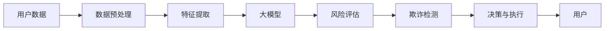

                 

# 大模型时代的创业者创业心路历程：困惑、突破与成长

> 关键词：人工智能，创业，大模型，技术壁垒，市场机会，团队协作，商业化，创新

## 1. 背景介绍

### 1.1 问题由来

在当今这个信息技术飞速发展的时代，人工智能(AI)特别是大模型技术正在成为科技创新的前沿领域。然而，对于许多创业者来说，尤其是那些致力于将AI技术商业化应用的创业者而言，如何在充满不确定性的市场中找寻机会、应对挑战、实现突破，是一个极为复杂且极具挑战性的问题。本文旨在通过分享一些大模型时代创业者的真实心路历程，探讨他们在面对各种困境时的策略与思考，以及如何逐步突破自我、实现成长的路径。

### 1.2 问题核心关键点

在大模型时代的创业过程中，有几个核心关键点值得注意：
- **技术壁垒**：深度学习和自然语言处理技术的复杂性带来了巨大的技术门槛，如何突破这些壁垒是创业成功的关键。
- **市场机会**：虽然大模型技术潜力巨大，但如何精准把握市场机会，找到商业化的切入点同样至关重要。
- **团队协作**：AI创业通常需要跨学科、多功能的团队协作，如何组建和管理高效的团队是创业成功的保障。
- **商业化**：如何将AI技术转化为实际的市场产品，实现商业模式闭环，是创业成功的最终目的。
- **创新**：不断探索新的技术方向和应用场景，才能在激烈的竞争中保持领先。

这些关键点不仅构成了大模型时代创业的挑战，也反映了其独特的机会。在本文中，我们将通过具体案例，深入剖析这些核心点，并探讨创业者的心路历程。

## 2. 核心概念与联系

### 2.1 核心概念概述

- **人工智能(AI)**：一种通过模拟人类智能过程，使机器能够自主地进行学习、推理、决策等任务的计算机科学分支。
- **大模型(Large Model)**：指具有数十亿甚至数百亿参数的深度学习模型，如GPT-3、BERT等，它们在大规模无监督数据上进行预训练，具备强大的语言处理能力。
- **深度学习(Deep Learning)**：一种通过多层神经网络进行学习，以实现复杂任务处理的机器学习方法。
- **自然语言处理(NLP)**：AI的一个分支，专注于使机器能够理解、处理和生成人类语言。
- **创业**：通过创新和冒险，创立并运营一家初创公司，实现商业价值的过程。

### 2.2 核心概念原理和架构的 Mermaid 流程图

```mermaid
graph LR
    A[人工智能(AI)] --> B[深度学习(Deep Learning)]
    B --> C[自然语言处理(NLP)]
    C --> D[大模型(Large Model)]
    D --> E[创业]
    E --> F[技术壁垒]
    E --> G[市场机会]
    E --> H[团队协作]
    E --> I[商业化]
    E --> J[创新]
```

这个流程图展示了从人工智能到创业的路径，以及每个环节中的关键概念。

## 3. 核心算法原理 & 具体操作步骤

### 3.1 算法原理概述

在大模型时代，创业者的核心任务是利用这些大模型技术，解决现实问题，实现商业化应用。这通常涉及以下几个步骤：

1. **需求分析**：确定目标市场的需求和痛点。
2. **模型选择与适配**：选择合适的大模型，并根据需求进行微调或定制。
3. **算法开发**：开发核心算法，实现模型的具体应用。
4. **产品构建**：构建实际可用的产品或服务。
5. **市场推广**：将产品推向市场，实现商业化。

### 3.2 算法步骤详解

1. **需求分析**：
   - **市场调研**：通过调研和访谈，了解目标用户群体的需求和期望。
   - **问题定义**：明确需要解决的具体问题，如文本分类、对话系统、知识图谱构建等。
   - **可行性分析**：评估技术的可行性、资源需求及潜在收益。

2. **模型选择与适配**：
   - **模型选择**：根据问题的性质选择适合的预训练模型，如BERT、GPT等。
   - **微调与定制**：在少量标注数据上对模型进行微调，或通过迁移学习、微调优化，使其更适应具体任务。

3. **算法开发**：
   - **算法设计**：设计适用于特定任务的算法，如基于图神经网络的知识图谱构建算法。
   - **模型训练**：使用GPU/TPU等高性能设备，进行模型训练，优化算法性能。

4. **产品构建**：
   - **界面设计**：设计直观易用的用户界面，提供良好的用户体验。
   - **功能实现**：实现模型在产品中的集成，确保系统性能和稳定性。
   - **部署上线**：将产品部署至服务器或云平台，提供可靠的服务。

5. **市场推广**：
   - **营销策略**：制定市场推广策略，通过社交媒体、博客、合作等方式推广产品。
   - **用户反馈**：收集用户反馈，不断优化产品功能和服务。
   - **业务扩展**：通过用户口碑和市场验证，扩大产品用户基础和市场份额。

### 3.3 算法优缺点

#### 优点：

- **高效**：大模型提供的基础能力可以显著提高开发效率，减少从头开始开发的时间成本。
- **通用性**：大模型具备处理多种任务的能力，可以灵活应对各种市场需求。
- **可扩展性**：模型规模可大可小，可以根据需求灵活调整。

#### 缺点：

- **技术门槛高**：深度学习和NLP技术复杂，需要团队具备相关专业知识。
- **资源需求大**：模型训练和部署需要高性能计算资源和存储设备。
- **数据依赖**：模型的性能很大程度上依赖于训练数据的质量和数量，数据获取成本较高。

### 3.4 算法应用领域

大模型技术在多个领域都有广泛应用，如：

- **智能客服**：使用大模型进行情感分析、意图识别等，提供智能客服解决方案。
- **金融风控**：利用大模型进行欺诈检测、信用评估等，提升金融风控能力。
- **健康医疗**：通过大模型进行疾病预测、症状诊断等，辅助医疗决策。
- **智能推荐**：使用大模型进行个性化推荐，提升用户体验。
- **内容创作**：利用大模型生成文本、图像、视频等内容，丰富数字内容生态。

## 4. 数学模型和公式 & 详细讲解

### 4.1 数学模型构建

在大模型应用中，常见的数学模型包括：

- **神经网络模型**：如卷积神经网络(CNN)、循环神经网络(RNN)、Transformer等。
- **损失函数**：如交叉熵损失、均方误差损失等。
- **优化器**：如Adam、SGD等。

### 4.2 公式推导过程

以简单的二分类任务为例，假设模型输出为 $\hat{y}=\sigma(Wx+b)$，其中 $W$ 和 $b$ 为模型参数，$\sigma$ 为激活函数。目标是最小化交叉熵损失函数 $\ell(\hat{y},y)=-y\log\hat{y}-(1-y)\log(1-\hat{y})$。使用梯度下降算法进行优化，得到模型参数更新公式：

$$
W \leftarrow W - \eta \nabla_W \ell(Wx+b,y)
$$

$$
b \leftarrow b - \eta \nabla_b \ell(Wx+b,y)
$$

其中 $\eta$ 为学习率，$\nabla_W$ 和 $\nabla_b$ 分别为损失函数对 $W$ 和 $b$ 的偏导数。

### 4.3 案例分析与讲解

以情感分析为例，假设输入文本为 "I love this product!"，输出为正类别。训练数据为 (输入文本, 输出标签)，通过梯度下降算法更新模型参数，使得模型输出趋近于真实标签。

## 5. 项目实践：代码实例和详细解释说明

### 5.1 开发环境搭建

1. **环境准备**：
   - **操作系统**：推荐使用Linux或macOS系统，以避免兼容性问题。
   - **开发工具**：Python 3.x，TensorFlow 2.x，PyTorch。

2. **环境配置**：
   - **虚拟环境**：使用Python的虚拟环境工具创建隔离的环境，如`venv`或`conda`。
   - **依赖安装**：安装必要的依赖包，如TensorFlow、Keras、NumPy等。

3. **开发环境测试**：
   - **测试安装**：通过简单的测试代码，确认所有依赖包正常工作。

### 5.2 源代码详细实现

以下是一个使用TensorFlow构建简单情感分析模型的示例代码：

```python
import tensorflow as tf
from tensorflow.keras import layers

# 定义模型
model = tf.keras.Sequential([
    layers.Embedding(input_dim=10000, output_dim=128),
    layers.LSTM(64),
    layers.Dense(1, activation='sigmoid')
])

# 编译模型
model.compile(optimizer='adam', loss='binary_crossentropy', metrics=['accuracy'])

# 训练模型
model.fit(train_dataset, epochs=10, validation_data=val_dataset)
```

### 5.3 代码解读与分析

- **数据准备**：使用Keras的数据集API，准备训练集和验证集。
- **模型构建**：使用Keras的Sequential模型，包含Embedding层、LSTM层和输出层。
- **模型编译**：使用Adam优化器和交叉熵损失函数编译模型。
- **模型训练**：使用fit方法训练模型，指定训练轮数和验证集。

### 5.4 运行结果展示

训练过程中，可以观察到模型在验证集上的准确率和损失函数的变化，如图：

```python
import matplotlib.pyplot as plt

# 绘制训练过程图
plt.plot(history.history['accuracy'], label='train')
plt.plot(history.history['val_accuracy'], label='val')
plt.title('Model accuracy')
plt.xlabel('Epoch')
plt.ylabel('Accuracy')
plt.legend()
plt.show()

plt.plot(history.history['loss'], label='train')
plt.plot(history.history['val_loss'], label='val')
plt.title('Model loss')
plt.xlabel('Epoch')
plt.ylabel('Loss')
plt.legend()
plt.show()
```

## 6. 实际应用场景

### 6.1 智能客服系统

智能客服系统是大模型应用的一个重要场景。通过微调大模型，可以构建能够理解自然语言、提供实时反馈的智能客服。以下是一个简单的智能客服系统架构图：

```mermaid
graph LR
    A[用户] --> B[智能客服系统]
    B --> C[自然语言理解(NLU)]
    C --> D[意图识别]
    D --> E[知识库查询]
    E --> F[智能回复]
    F --> G[反馈处理]
    G --> H[用户]
```

该系统通过自然语言理解模块(NLU)将用户输入转化为结构化数据，意图识别模块提取用户意图，知识库查询模块检索相关信息，智能回复模块生成回复，反馈处理模块收集用户反馈，不断优化系统性能。

### 6.2 金融风控

在金融领域，大模型可以用于风险评估和欺诈检测。以下是一个基于大模型的金融风控系统架构图：



该系统通过数据预处理、特征提取和训练大模型，对用户数据进行风险评估和欺诈检测，辅助决策与执行。

### 6.3 健康医疗

在健康医疗领域，大模型可以用于疾病预测和症状诊断。以下是一个基于大模型的健康医疗系统架构图：


该系统通过数据预处理、特征提取和训练大模型，对患者数据进行疾病预测和症状诊断，提供治疗建议。

## 7. 工具和资源推荐

### 7.1 学习资源推荐

- **在线课程**：Coursera、Udacity等平台提供的人工智能和深度学习课程。
- **书籍**：《深度学习》、《自然语言处理综论》等经典书籍。
- **博客和社区**：Kaggle、GitHub、Stack Overflow等社区平台。

### 7.2 开发工具推荐

- **开发框架**：TensorFlow、PyTorch、Keras等深度学习框架。
- **项目管理工具**：Git、Jira、Trello等工具。
- **文档管理工具**：Confluence、Google Docs等工具。

### 7.3 相关论文推荐

- **论文1**：《Attention is All You Need》（即Transformer原论文）。
- **论文2**：《BERT: Pre-training of Deep Bidirectional Transformers for Language Understanding》。
- **论文3**：《Language Models are Unsupervised Multitask Learners》（GPT-2论文）。
- **论文4**：《Parameter-Efficient Transfer Learning for NLP》。
- **论文5**：《AdaLoRA: Adaptive Low-Rank Adaptation for Parameter-Efficient Fine-Tuning》。

## 8. 总结：未来发展趋势与挑战

### 8.1 研究成果总结

- **技术进步**：深度学习和自然语言处理技术的不断进步，使得大模型在多个领域取得了显著成效。
- **商业模式创新**：AI技术的商业化应用，开辟了新的商业模式和市场机会。
- **人才需求增加**：AI创业对跨学科人才的需求不断增加，促进了相关教育和人才培养。

### 8.2 未来发展趋势

- **技术融合**：AI与物联网、区块链、边缘计算等技术的融合，将进一步拓展应用场景。
- **数据驱动**：大数据和云计算的发展，为AI应用提供了更多数据和计算资源。
- **伦理和隐私**：随着AI应用的深入，伦理和隐私问题变得愈发重要，社会对AI的接受度和信任度将影响其发展。

### 8.3 面临的挑战

- **技术壁垒**：大模型的复杂性要求创业团队具备较高的技术门槛。
- **市场竞争**：随着AI应用的普及，市场竞争将更加激烈。
- **商业化难度**：AI技术的商业化应用需要克服多种障碍，如用户接受度、商业模式等。
- **数据安全**：AI应用涉及大量敏感数据，数据安全和隐私保护是必须解决的问题。

### 8.4 研究展望

- **算法的优化**：进一步优化算法，提高模型性能和效率。
- **应用场景的拓展**：探索AI在更多领域的应用场景，如智能家居、智慧城市等。
- **伦理和社会责任**：加强AI伦理和社会责任研究，构建健康可持续的AI发展环境。

## 9. 附录：常见问题与解答

**Q1：如何评估大模型在特定任务上的性能？**

A: 大模型的性能评估通常采用精度、召回率、F1分数等指标。对于分类任务，可以使用混淆矩阵、ROC曲线等方法评估模型性能。

**Q2：如何优化大模型的训练过程？**

A: 优化大模型的训练过程可以从以下几个方面入手：
- **数据增强**：使用数据增强技术扩充训练集，提升模型泛化能力。
- **正则化**：引入L2正则化、Dropout等技术，防止过拟合。
- **超参数调优**：通过网格搜索、随机搜索等方法，找到最优的超参数组合。
- **模型剪枝**：通过剪枝技术减少模型参数，提高模型效率。

**Q3：如何选择合适的大模型进行微调？**

A: 选择合适的大模型进行微调需要考虑以下几个因素：
- **任务类型**：根据任务类型选择合适的预训练模型，如文本分类使用BERT，图像识别使用ResNet。
- **数据规模**：根据数据规模选择合适的模型规模，如大规模数据使用大模型，小规模数据使用小模型。
- **计算资源**：根据计算资源选择适合的模型架构，如GPT-2/3，BERT-base/large等。

**Q4：如何处理模型在大规模数据上的训练效率问题？**

A: 处理模型在大规模数据上的训练效率问题可以从以下几个方面入手：
- **分布式训练**：使用分布式训练技术，加速模型训练过程。
- **硬件加速**：使用GPU/TPU等高性能计算设备，提升模型训练速度。
- **算法优化**：优化算法，如使用更高效的优化器、引入混合精度训练等。

**Q5：如何保护大模型的知识产权？**

A: 保护大模型的知识产权可以通过以下几个方面入手：
- **专利申请**：及时申请相关技术的专利保护。
- **商业秘密**：将核心算法和模型作为商业秘密保护。
- **开源许可**：通过开源许可协议，确保知识产权的安全。

---

作者：禅与计算机程序设计艺术 / Zen and the Art of Computer Programming

