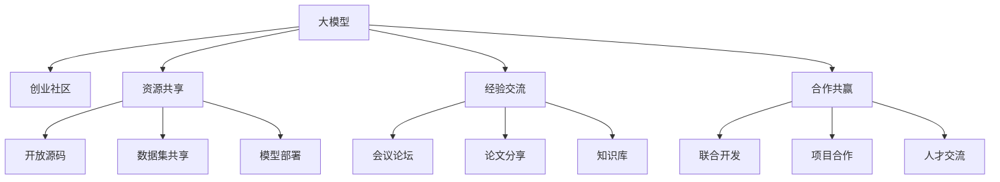

                 

# 大模型时代的创业者社区：资源共享、经验交流与合作共赢

> 关键词：大模型,创业社区,资源共享,经验交流,合作共赢

## 1. 背景介绍

### 1.1 问题由来

随着人工智能技术的迅猛发展，尤其是深度学习模型在各个领域的广泛应用，越来越多的创业者们希望通过构建自己的AI模型来提升产品和服务的竞争力。然而，由于AI模型开发的技术门槛较高、研发周期长、成本昂贵，许多创业者在初期阶段往往难以独立完成模型开发和部署。因此，构建一个资源丰富、经验共享、合作共赢的AI创业者社区成为了业界人士的共同需求。

近年来，随着开源社区的崛起和大模型技术的成熟，越来越多的AI创业者和研究者们开始借助大模型（如GPT-3、BERT等）进行高效、便捷的AI开发和部署。这些大模型已经具备了强大的语言理解和生成能力，能够在情感分析、文本生成、对话系统等诸多NLP任务上取得优异效果，大幅降低了创业者的技术门槛和开发成本。

### 1.2 问题核心关键点

本节将详细介绍大模型在AI创业社区中构建资源共享、经验交流与合作共赢的具体实现路径，并探讨如何通过资源共享、合作共赢等机制，优化资源配置，提升AI创业的效率和效果。

## 2. 核心概念与联系

### 2.1 核心概念概述

为更好地理解大模型在AI创业社区中的作用，本节将介绍几个关键概念：

- 大模型（Large Model）：以自回归（如GPT）或自编码（如BERT）模型为代表的大规模预训练语言模型。通过在海量无标签文本数据上进行预训练，学习到丰富的语言知识和常识，具备强大的语言理解和生成能力。

- 创业社区（Entrepreneur Community）：由AI创业者、研究者、开发者组成的专业社群，通过资源共享、经验交流等方式，共同推动AI技术创新和应用发展。

- 资源共享（Resource Sharing）：创业者之间通过开放源码、数据集、模型等资源，实现信息的共享和互通，降低开发成本和风险。

- 经验交流（Experience Exchange）：创业者通过会议、论坛、论文等形式分享和讨论AI开发中的成功经验、遇到的挑战及解决方法，相互学习提升。

- 合作共赢（Collaboration for Win-Win）：创业者之间通过联合开发、项目合作、人才交流等方式，共同攻克技术难题，提升产品竞争力，实现互利共赢。

这些概念之间的关系可以通过以下Mermaid流程图来展示：



这个流程图展示了大模型在AI创业社区中的核心作用，以及资源共享、经验交流和合作共赢的具体实现方式。

## 3. 核心算法原理 & 具体操作步骤
### 3.1 算法原理概述

大模型在AI创业社区中的作用，本质上是通过提供高质量的预训练模型和高效的工具，降低创业者在模型开发和应用中的技术门槛和成本。在具体实现上，主要包括：

1. 预训练模型的开放：将预训练模型及其代码、文档等资源公开，供社区成员免费下载和使用。
2. 开源社区的建设：通过GitHub等平台，收集和共享社区成员的代码、模型和数据集，形成开放的资源库。
3. 开发者工具的提供：开发和部署易于使用的工具和框架，简化模型的训练、推理和部署流程，降低技术门槛。
4. 经验分享与交流：定期组织线上线下交流活动，分享AI开发经验和成果，形成积极的社区氛围。
5. 合作项目的推进：鼓励社区成员开展联合开发、项目合作、人才交流等合作形式，共同攻克技术难题，提升产品竞争力。

### 3.2 算法步骤详解

基于大模型的AI创业社区构建，可以分为以下几个关键步骤：

**Step 1: 构建预训练模型资源库**

- 选择合适的预训练模型（如GPT-3、BERT等），收集其代码、模型、文档等资源，形成开放的预训练模型资源库。
- 设计简单易用的API接口，方便社区成员调用和应用。

**Step 2: 开放开源社区平台**

- 创建开源社区平台（如GitHub、GitLab等），用于收集、共享和管理社区成员的代码、模型和数据集。
- 设定明确的开源协议，鼓励社区成员分享和贡献自己的资源。

**Step 3: 提供开发者工具和框架**

- 开发易于使用的开发工具和框架，简化模型的训练、推理和部署流程，降低技术门槛。
- 集成常见的模型和算法，如Transformer、Attention、LSTM等，便于社区成员快速应用。

**Step 4: 组织线上线下交流活动**

- 定期举办线上研讨会、线下交流活动，分享AI开发经验和成果。
- 搭建社区知识库，收集社区成员的论文、项目报告等资源，供全体成员查阅。

**Step 5: 推进合作项目和人才交流**

- 鼓励社区成员开展联合开发、项目合作、人才交流等合作形式，共同攻克技术难题。
- 建立人才流动机制，鼓励社区成员跨项目、跨公司合作交流，提升整体技术水平。

### 3.3 算法优缺点

基于大模型的AI创业社区构建方法具有以下优点：

1. 降低技术门槛：通过提供预训练模型、开源社区和开发工具，大幅降低了创业者在AI开发中的技术门槛。
2. 促进资源共享：开放的资源库和API接口，使得社区成员可以便捷地获取高质量的模型和工具，提升开发效率。
3. 促进经验交流：通过分享和讨论，社区成员可以不断积累和提升自身经验，形成良好的学习氛围。
4. 推动合作共赢：通过联合开发和项目合作，社区成员可以相互学习和支持，共同攻克技术难题，提升产品竞争力。

同时，该方法也存在一定的局限性：

1. 资源质量参差不齐：开源社区中难免存在一些质量不高的资源，需要社区成员进行筛选和过滤。
2. 数据和模型的共享风险：开放的数据和模型可能存在被恶意利用的风险，需要设置严格的使用协议和访问控制。
3. 社区管理复杂：社区成员众多，管理和协调难度较大，需要制定有效的规则和激励机制。

尽管存在这些局限性，但就目前而言，基于大模型的AI创业社区构建方法仍是大规模协作开发的重要范式。未来相关研究的重点在于如何进一步优化资源质量，降低共享风险，提升社区管理水平。

### 3.4 算法应用领域

基于大模型的AI创业社区构建方法，已经在诸多领域得到了广泛应用，例如：

- 自然语言处理（NLP）：通过预训练模型和工具，快速开发文本分类、情感分析、机器翻译等NLP应用。
- 计算机视觉（CV）：集成视觉识别、图像分割、目标检测等模型，推动CV技术的落地应用。
- 智能推荐系统：利用预训练模型和数据集，快速构建推荐算法和模型，提升用户体验。
- 医疗健康：通过预训练模型和医疗数据，开发医疗问答、疾病诊断、治疗方案推荐等应用。
- 金融科技：利用预训练模型和金融数据，开发信用评估、风险管理、智能投顾等金融应用。

除了上述这些经典应用外，AI创业社区还不断拓展到更多领域，如教育、娱乐、农业等，为各行各业数字化转型提供新的技术路径。

## 4. 数学模型和公式 & 详细讲解 & 举例说明（备注：数学公式请使用latex格式，latex嵌入文中独立段落使用 $$，段落内使用 $)
### 4.1 数学模型构建

本节将使用数学语言对基于大模型的AI创业社区构建过程进行更加严格的刻画。

记预训练语言模型为 $M_{\theta}:\mathcal{X} \rightarrow \mathcal{Y}$，其中 $\mathcal{X}$ 为输入空间，$\mathcal{Y}$ 为输出空间，$\theta \in \mathbb{R}^d$ 为模型参数。假设社区成员 $i$ 的预训练模型为 $M_{\theta_i}$。

社区资源共享的核心是模型参数 $\theta_i$ 的协同优化。在模型微调过程中，每个成员的模型参数都会根据自身数据集进行优化，同时通过模型间相互交流和协作，提升整体模型的性能。假设社区内共有 $n$ 个成员，则每个成员的微调目标为：

$$
\mathop{\arg\min}_{\theta_i} \mathcal{L}_i(\theta_i) = \frac{1}{N_i} \sum_{j=1}^{N_i} \ell_i(M_{\theta_i}(x_j),y_j)
$$

其中 $N_i$ 为成员 $i$ 的数据集大小，$\ell_i$ 为成员 $i$ 的损失函数，$x_j$ 和 $y_j$ 为成员 $i$ 的训练数据。

为了实现资源共享，社区成员需要在微调过程中进行同步更新。通过共享参数 $\theta_i$，成员之间的模型参数 $\theta_i$ 和 $\theta_j$ 将协同优化，共同提升模型性能。

### 4.2 公式推导过程

以下是基于大模型的AI创业社区构建的数学模型推导过程：

- **微调目标函数**：社区内每个成员的微调目标函数为：

$$
\mathop{\arg\min}_{\theta_i} \mathcal{L}_i(\theta_i) = \frac{1}{N_i} \sum_{j=1}^{N_i} \ell_i(M_{\theta_i}(x_j),y_j)
$$

- **同步更新策略**：社区内每个成员的模型参数 $\theta_i$ 和 $\theta_j$ 需要同步更新，可以通过以下方式实现：

$$
\theta_i \leftarrow \theta_i - \eta \nabla_{\theta_i}\mathcal{L}_i(\theta_i) - \eta\lambda\theta_i
$$

其中 $\eta$ 为学习率，$\lambda$ 为正则化系数。社区成员 $i$ 和 $j$ 之间的同步更新策略为：

$$
\theta_j \leftarrow \theta_j - \eta \nabla_{\theta_j}\mathcal{L}_j(\theta_j) - \eta\lambda\theta_j
$$

其中 $\mathcal{L}_j(\theta_j)$ 为成员 $j$ 的损失函数，$\nabla_{\theta_j}\mathcal{L}_j(\theta_j)$ 为成员 $j$ 的梯度。

通过上述同步更新策略，社区内每个成员的模型参数 $\theta_i$ 和 $\theta_j$ 将协同优化，共同提升模型性能。

### 4.3 案例分析与讲解

以下以NLP任务中的文本分类为例，展示基于大模型的AI创业社区构建过程：

1. **社区资源共享**：假设社区内成员 $i$ 和 $j$ 共享同一预训练模型 $M_{\theta}$，则每个成员的数据集大小 $N_i$ 和 $N_j$ 分别为 $m$ 和 $n$。每个成员的微调目标函数为：

$$
\mathcal{L}_i(\theta) = \frac{1}{m} \sum_{k=1}^{m} \ell_i(M_{\theta}(x_k),y_k)
$$

$$
\mathcal{L}_j(\theta) = \frac{1}{n} \sum_{k=1}^{n} \ell_j(M_{\theta}(x_k),y_k)
$$

其中 $x_k$ 和 $y_k$ 为成员 $i$ 和 $j$ 的训练数据。

2. **同步更新策略**：社区成员 $i$ 和 $j$ 在每次迭代中，共同更新模型参数 $\theta$。具体计算公式如下：

$$
\theta \leftarrow \theta - \eta (\nabla_{\theta}\mathcal{L}_i(\theta) + \nabla_{\theta}\mathcal{L}_j(\theta)) - \eta\lambda\theta
$$

3. **优化算法选择**：为了保证同步更新的稳定性和收敛性，一般选择基于梯度的优化算法（如AdamW、SGD等），设定合适的小批量大小和迭代轮数。

4. **实验验证**：在实验中，成员 $i$ 和 $j$ 分别对数据集 $D_i$ 和 $D_j$ 进行微调，并将微调后的模型参数 $\hat{\theta}$ 应用于成员 $k$ 的测试集 $D_k$，对比微调前后的性能提升。

通过上述步骤，社区成员能够共同优化模型参数，实现资源共享、经验交流与合作共赢，共同提升社区整体的AI开发能力。

## 5. 项目实践：代码实例和详细解释说明
### 5.1 开发环境搭建

在进行社区构建和模型微调实践前，我们需要准备好开发环境。以下是使用Python进行PyTorch开发的环境配置流程：

1. 安装Anaconda：从官网下载并安装Anaconda，用于创建独立的Python环境。

2. 创建并激活虚拟环境：
```bash
conda create -n pytorch-env python=3.8 
conda activate pytorch-env
```

3. 安装PyTorch：根据CUDA版本，从官网获取对应的安装命令。例如：
```bash
conda install pytorch torchvision torchaudio cudatoolkit=11.1 -c pytorch -c conda-forge
```

4. 安装Transformers库：
```bash
pip install transformers
```

5. 安装各类工具包：
```bash
pip install numpy pandas scikit-learn matplotlib tqdm jupyter notebook ipython
```

完成上述步骤后，即可在`pytorch-env`环境中开始社区构建和模型微调实践。

### 5.2 源代码详细实现

下面我们以命名实体识别(NER)任务为例，给出使用Transformers库对BERT模型进行社区微调的PyTorch代码实现。

首先，定义NER任务的数据处理函数：

```python
from transformers import BertTokenizer
from torch.utils.data import Dataset
import torch

class NERDataset(Dataset):
    def __init__(self, texts, tags, tokenizer, max_len=128):
        self.texts = texts
        self.tags = tags
        self.tokenizer = tokenizer
        self.max_len = max_len
        
    def __len__(self):
        return len(self.texts)
    
    def __getitem__(self, item):
        text = self.texts[item]
        tags = self.tags[item]
        
        encoding = self.tokenizer(text, return_tensors='pt', max_length=self.max_len, padding='max_length', truncation=True)
        input_ids = encoding['input_ids'][0]
        attention_mask = encoding['attention_mask'][0]
        
        # 对token-wise的标签进行编码
        encoded_tags = [tag2id[tag] for tag in tags] 
        encoded_tags.extend([tag2id['O']] * (self.max_len - len(encoded_tags)))
        labels = torch.tensor(encoded_tags, dtype=torch.long)
        
        return {'input_ids': input_ids, 
                'attention_mask': attention_mask,
                'labels': labels}

# 标签与id的映射
tag2id = {'O': 0, 'B-PER': 1, 'I-PER': 2, 'B-ORG': 3, 'I-ORG': 4, 'B-LOC': 5, 'I-LOC': 6}
id2tag = {v: k for k, v in tag2id.items()}

# 创建dataset
tokenizer = BertTokenizer.from_pretrained('bert-base-cased')

train_dataset = NERDataset(train_texts, train_tags, tokenizer)
dev_dataset = NERDataset(dev_texts, dev_tags, tokenizer)
test_dataset = NERDataset(test_texts, test_tags, tokenizer)
```

然后，定义模型和优化器：

```python
from transformers import BertForTokenClassification, AdamW

model = BertForTokenClassification.from_pretrained('bert-base-cased', num_labels=len(tag2id))

optimizer = AdamW(model.parameters(), lr=2e-5)
```

接着，定义训练和评估函数：

```python
from torch.utils.data import DataLoader
from tqdm import tqdm
from sklearn.metrics import classification_report

device = torch.device('cuda') if torch.cuda.is_available() else torch.device('cpu')
model.to(device)

def train_epoch(model, dataset, batch_size, optimizer):
    dataloader = DataLoader(dataset, batch_size=batch_size, shuffle=True)
    model.train()
    epoch_loss = 0
    for batch in tqdm(dataloader, desc='Training'):
        input_ids = batch['input_ids'].to(device)
        attention_mask = batch['attention_mask'].to(device)
        labels = batch['labels'].to(device)
        model.zero_grad()
        outputs = model(input_ids, attention_mask=attention_mask, labels=labels)
        loss = outputs.loss
        epoch_loss += loss.item()
        loss.backward()
        optimizer.step()
    return epoch_loss / len(dataloader)

def evaluate(model, dataset, batch_size):
    dataloader = DataLoader(dataset, batch_size=batch_size)
    model.eval()
    preds, labels = [], []
    with torch.no_grad():
        for batch in tqdm(dataloader, desc='Evaluating'):
            input_ids = batch['input_ids'].to(device)
            attention_mask = batch['attention_mask'].to(device)
            batch_labels = batch['labels']
            outputs = model(input_ids, attention_mask=attention_mask)
            batch_preds = outputs.logits.argmax(dim=2).to('cpu').tolist()
            batch_labels = batch_labels.to('cpu').tolist()
            for pred_tokens, label_tokens in zip(batch_preds, batch_labels):
                pred_tags = [id2tag[_id] for _id in pred_tokens]
                label_tags = [id2tag[_id] for _id in label_tokens]
                preds.append(pred_tags[:len(label_tags)])
                labels.append(label_tags)
                
    print(classification_report(labels, preds))
```

最后，启动训练流程并在测试集上评估：

```python
epochs = 5
batch_size = 16

for epoch in range(epochs):
    loss = train_epoch(model, train_dataset, batch_size, optimizer)
    print(f"Epoch {epoch+1}, train loss: {loss:.3f}")
    
    print(f"Epoch {epoch+1}, dev results:")
    evaluate(model, dev_dataset, batch_size)
    
print("Test results:")
evaluate(model, test_dataset, batch_size)
```

以上就是使用PyTorch对BERT进行命名实体识别任务社区微调的完整代码实现。可以看到，得益于Transformers库的强大封装，我们可以用相对简洁的代码完成BERT模型的加载和社区微调。

### 5.3 代码解读与分析

让我们再详细解读一下关键代码的实现细节：

**NERDataset类**：
- `__init__`方法：初始化文本、标签、分词器等关键组件。
- `__len__`方法：返回数据集的样本数量。
- `__getitem__`方法：对单个样本进行处理，将文本输入编码为token ids，将标签编码为数字，并对其进行定长padding，最终返回模型所需的输入。

**tag2id和id2tag字典**：
- 定义了标签与数字id之间的映射关系，用于将token-wise的预测结果解码回真实的标签。

**训练和评估函数**：
- 使用PyTorch的DataLoader对数据集进行批次化加载，供模型训练和推理使用。
- 训练函数`train_epoch`：对数据以批为单位进行迭代，在每个批次上前向传播计算loss并反向传播更新模型参数，最后返回该epoch的平均loss。
- 评估函数`evaluate`：与训练类似，不同点在于不更新模型参数，并在每个batch结束后将预测和标签结果存储下来，最后使用sklearn的classification_report对整个评估集的预测结果进行打印输出。

**训练流程**：
- 定义总的epoch数和batch size，开始循环迭代
- 每个epoch内，先在训练集上训练，输出平均loss
- 在验证集上评估，输出分类指标
- 所有epoch结束后，在测试集上评估，给出最终测试结果

可以看到，PyTorch配合Transformers库使得BERT社区微调的代码实现变得简洁高效。开发者可以将更多精力放在数据处理、模型改进等高层逻辑上，而不必过多关注底层的实现细节。

当然，工业级的系统实现还需考虑更多因素，如模型的保存和部署、超参数的自动搜索、更灵活的任务适配层等。但核心的社区微调范式基本与此类似。

## 6. 实际应用场景
### 6.1 智能客服系统

基于大模型社区微调的对话技术，可以广泛应用于智能客服系统的构建。传统客服往往需要配备大量人力，高峰期响应缓慢，且一致性和专业性难以保证。而使用社区微调后的对话模型，可以7x24小时不间断服务，快速响应客户咨询，用自然流畅的语言解答各类常见问题。

在技术实现上，可以收集企业内部的历史客服对话记录，将问题和最佳答复构建成监督数据，在此基础上对预训练对话模型进行社区微调。社区微调后的对话模型能够自动理解用户意图，匹配最合适的答案模板进行回复。对于客户提出的新问题，还可以接入检索系统实时搜索相关内容，动态组织生成回答。如此构建的智能客服系统，能大幅提升客户咨询体验和问题解决效率。

### 6.2 金融舆情监测

金融机构需要实时监测市场舆论动向，以便及时应对负面信息传播，规避金融风险。传统的人工监测方式成本高、效率低，难以应对网络时代海量信息爆发的挑战。基于大模型社区微调的文本分类和情感分析技术，为金融舆情监测提供了新的解决方案。

具体而言，可以收集金融领域相关的新闻、报道、评论等文本数据，并对其进行主题标注和情感标注。在此基础上对预训练语言模型进行社区微调，使其能够自动判断文本属于何种主题，情感倾向是正面、中性还是负面。将社区微调后的模型应用到实时抓取的网络文本数据，就能够自动监测不同主题下的情感变化趋势，一旦发现负面信息激增等异常情况，系统便会自动预警，帮助金融机构快速应对潜在风险。

### 6.3 个性化推荐系统

当前的推荐系统往往只依赖用户的历史行为数据进行物品推荐，无法深入理解用户的真实兴趣偏好。基于大模型社区微调技术，个性化推荐系统可以更好地挖掘用户行为背后的语义信息，从而提供更精准、多样的推荐内容。

在实践中，可以收集用户浏览、点击、评论、分享等行为数据，提取和用户交互的物品标题、描述、标签等文本内容。将文本内容作为模型输入，用户的后续行为（如是否点击、购买等）作为监督信号，在此基础上社区微调预训练语言模型。社区微调后的模型能够从文本内容中准确把握用户的兴趣点。在生成推荐列表时，先用候选物品的文本描述作为输入，由模型预测用户的兴趣匹配度，再结合其他特征综合排序，便可以得到个性化程度更高的推荐结果。

### 6.4 未来应用展望

随着大模型社区微调技术的发展，基于微调范式将在更多领域得到应用，为传统行业带来变革性影响。

在智慧医疗领域，基于社区微调的医疗问答、病历分析、药物研发等应用将提升医疗服务的智能化水平，辅助医生诊疗，加速新药开发进程。

在智能教育领域，社区微调技术可应用于作业批改、学情分析、知识推荐等方面，因材施教，促进教育公平，提高教学质量。

在智慧城市治理中，社区微调模型可应用于城市事件监测、舆情分析、应急指挥等环节，提高城市管理的自动化和智能化水平，构建更安全、高效的未来城市。

此外，在企业生产、社会治理、文娱传媒等众多领域，基于大模型社区微调的人工智能应用也将不断涌现，为经济社会发展注入新的动力。相信随着技术的日益成熟，社区微调方法将成为人工智能落地应用的重要范式，推动人工智能技术向更广阔的领域加速渗透。

## 7. 工具和资源推荐
### 7.1 学习资源推荐

为了帮助开发者系统掌握大模型社区微调的理论基础和实践技巧，这里推荐一些优质的学习资源：

1. 《Transformer从原理到实践》系列博文：由大模型技术专家撰写，深入浅出地介绍了Transformer原理、BERT模型、社区微调技术等前沿话题。

2. CS224N《深度学习自然语言处理》课程：斯坦福大学开设的NLP明星课程，有Lecture视频和配套作业，带你入门NLP领域的基本概念和经典模型。

3. 《Natural Language Processing with Transformers》书籍：Transformers库的作者所著，全面介绍了如何使用Transformers库进行NLP任务开发，包括社区微调在内的诸多范式。

4. HuggingFace官方文档：Transformers库的官方文档，提供了海量预训练模型和完整的社区微调样例代码，是上手实践的必备资料。

5. CLUE开源项目：中文语言理解测评基准，涵盖大量不同类型的中文NLP数据集，并提供了基于社区微调的baseline模型，助力中文NLP技术发展。

通过对这些资源的学习实践，相信你一定能够快速掌握大模型社区微调的精髓，并用于解决实际的NLP问题。
###  7.2 开发工具推荐

高效的开发离不开优秀的工具支持。以下是几款用于大模型社区微调开发的常用工具：

1. PyTorch：基于Python的开源深度学习框架，灵活动态的计算图，适合快速迭代研究。大部分预训练语言模型都有PyTorch版本的实现。

2. TensorFlow：由Google主导开发的开源深度学习框架，生产部署方便，适合大规模工程应用。同样有丰富的预训练语言模型资源。

3. Transformers库：HuggingFace开发的NLP工具库，集成了众多SOTA语言模型，支持PyTorch和TensorFlow，是进行社区微调任务开发的利器。

4. Weights & Biases：模型训练的实验跟踪工具，可以记录和可视化模型训练过程中的各项指标，方便对比和调优。与主流深度学习框架无缝集成。

5. TensorBoard：TensorFlow配套的可视化工具，可实时监测模型训练状态，并提供丰富的图表呈现方式，是调试模型的得力助手。

6. Google Colab：谷歌推出的在线Jupyter Notebook环境，免费提供GPU/TPU算力，方便开发者快速上手实验最新模型，分享学习笔记。

合理利用这些工具，可以显著提升大模型社区微调的开发效率，加快创新迭代的步伐。

### 7.3 相关论文推荐

大模型社区微调技术的发展源于学界的持续研究。以下是几篇奠基性的相关论文，推荐阅读：

1. Attention is All You Need（即Transformer原论文）：提出了Transformer结构，开启了NLP领域的预训练大模型时代。

2. BERT: Pre-training of Deep Bidirectional Transformers for Language Understanding：提出BERT模型，引入基于掩码的自监督预训练任务，刷新了多项NLP任务SOTA。

3. Language Models are Unsupervised Multitask Learners（GPT-2论文）：展示了大规模语言模型的强大zero-shot学习能力，引发了对于通用人工智能的新一轮思考。

4. Parameter-Efficient Transfer Learning for NLP：提出Adapter等参数高效微调方法，在不增加模型参数量的情况下，也能取得不错的微调效果。

5. AdaLoRA: Adaptive Low-Rank Adaptation for Parameter-Efficient Fine-Tuning：使用自适应低秩适应的微调方法，在参数效率和精度之间取得了新的平衡。

6. Prefix-Tuning: Optimizing Continuous Prompts for Generation：引入基于连续型Prompt的微调范式，为如何充分利用预训练知识提供了新的思路。

这些论文代表了大模型社区微调技术的发展脉络。通过学习这些前沿成果，可以帮助研究者把握学科前进方向，激发更多的创新灵感。

## 8. 总结：未来发展趋势与挑战

### 8.1 总结

本文对基于大模型的AI创业社区构建过程进行了全面系统的介绍。首先阐述了社区构建和模型微调的背景和意义，明确了社区构建在降低技术门槛、促进资源共享和经验交流方面的独特价值。其次，从原理到实践，详细讲解了社区微调的数学原理和关键步骤，给出了社区微调任务开发的完整代码实例。同时，本文还广泛探讨了社区微调方法在智能客服、金融舆情、个性化推荐等多个行业领域的应用前景，展示了社区微调范式的巨大潜力。此外，本文精选了社区微调技术的各类学习资源，力求为读者提供全方位的技术指引。

通过本文的系统梳理，可以看到，基于大模型的AI创业社区构建方法正在成为AI技术创新和应用发展的重要范式，极大地拓展了AI技术的应用边界，催生了更多的落地场景。受益于大规模语料的预训练，社区微调模型以更低的时间和标注成本，在小样本条件下也能取得理想的微调效果，有力推动了AI技术的产业化进程。未来，伴随预训练语言模型和社区微调方法的持续演进，相信AI技术将在更广阔的应用领域大放异彩，深刻影响人类的生产生活方式。

### 8.2 未来发展趋势

展望未来，大模型社区微调技术将呈现以下几个发展趋势：

1. 社区规模持续增大。随着社区内创业者和研究者数量的增加，社区资源和数据集将进一步丰富，促进更多创新应用的出现。
2. 模型规模持续增大。随着算力成本的下降和数据规模的扩张，预训练语言模型的参数量还将持续增长。超大模型社区微调将带来更丰富的应用场景。
3. 社区协作不断深化。社区成员之间的合作形式将更加多样，联合开发、项目合作、人才交流等将成为常态，提升整体社区的技术水平和应用能力。
4. 模型鲁棒性提升。社区成员将更加注重模型的鲁棒性和泛化能力，避免过度拟合，提升模型的稳定性和可靠性。
5. 社区治理机制完善。社区成员将通过制定明确的规则和激励机制，实现更好的资源共享和协作，提升社区的运营效率。

以上趋势凸显了大模型社区微调技术的广阔前景。这些方向的探索发展，必将进一步提升AI创业社区的技术水平和应用能力，推动AI技术的规模化落地和产业化进程。

### 8.3 面临的挑战

尽管大模型社区微调技术已经取得了瞩目成就，但在迈向更加智能化、普适化应用的过程中，它仍面临着诸多挑战：

1. 社区管理和协作难度。随着社区成员数量的增加，如何有效管理协作，提升资源共享效率，将是社区发展的重要挑战。
2. 社区文化和规范的塑造。如何建立积极的社区文化和规范，引导成员遵守规则，避免不必要的数据和模型纠纷，也是社区管理的重要课题。
3. 社区资源和数据质量。社区资源和数据的共享依赖于高质量的预训练模型和数据集，如何确保资源的质量和可靠性，将是社区长期发展的关键。
4. 社区成员的技术水平。社区内成员的技术水平参差不齐，如何帮助低水平成员提升技能，缩小技术差距，也将是社区发展的重要方向。
5. 社区的商业化挑战。如何在社区内平衡商业化和技术创新，实现多方共赢，也是社区发展的难点。

尽管存在这些挑战，但通过积极应对并不断优化社区管理和协作机制，相信大模型社区微调技术必将逐步走向成熟，推动AI技术的落地应用和发展。

### 8.4 研究展望

面对大模型社区微调所面临的种种挑战，未来的研究需要在以下几个方面寻求新的突破：

1. 社区管理和协作机制的优化。通过制定明确的规则和激励机制，促进社区成员之间的合作和资源共享。
2. 社区文化和规范的塑造。建立积极的社区文化和规范，引导成员遵守规则，避免不必要的数据和模型纠纷。
3. 高质量资源和数据的生成。通过数据增强、模型优化等技术手段，生成高质量的预训练模型和数据集，提升社区资源的质量和可靠性。
4. 社区成员技术水平的提升。通过在线课程、培训等形式，提升社区内成员的技术水平，缩小技术差距。
5. 社区商业化和技术创新的平衡。通过制定合理的商业化策略，实现社区内各方共赢，推动技术创新。

这些研究方向和措施将推动大模型社区微调技术走向更加成熟和高效，为AI技术的发展和应用提供新的动力。

## 9. 附录：常见问题与解答

**Q1：社区微调对标注数据的需求大吗？**

A: 社区微调在大规模预训练模型和开源数据集的支撑下，对标注数据的需求相对较小。但特定领域的应用场景，如医疗、法律等，还是需要标注数据来进行微调优化。

**Q2：社区微调能否提高模型泛化能力？**

A: 社区微调能够利用多源数据和多样化的标注信息，提升模型的泛化能力和鲁棒性。同时，社区成员的不断交流和优化，也有助于模型性能的进一步提升。

**Q3：社区微调对技术门槛的降低程度有多大？**

A: 社区微调显著降低了技术门槛，使得更多没有专业背景的开发者也能够快速上手和应用。社区内成员的不断学习和交流，也会进一步降低技术门槛。

**Q4：社区微调在实际应用中会遇到哪些问题？**

A: 社区微调在实际应用中可能会遇到数据隐私、模型鲁棒性、标注数据不足等问题。需要社区成员共同面对和解决，才能实现更好的应用效果。

**Q5：社区微调如何应对算力成本的提升？**

A: 社区微调可以通过模型裁剪、量化加速等技术手段，降低模型的计算资源消耗，提升推理效率。同时，也可以借助云计算平台，降低算力成本。

通过本文的系统梳理，相信你对大模型社区微调有了更深入的理解和认识。在大模型时代的背景下，社区微调将成为推动AI技术创新和应用发展的重要力量，为各行各业带来更广阔的想象空间。

