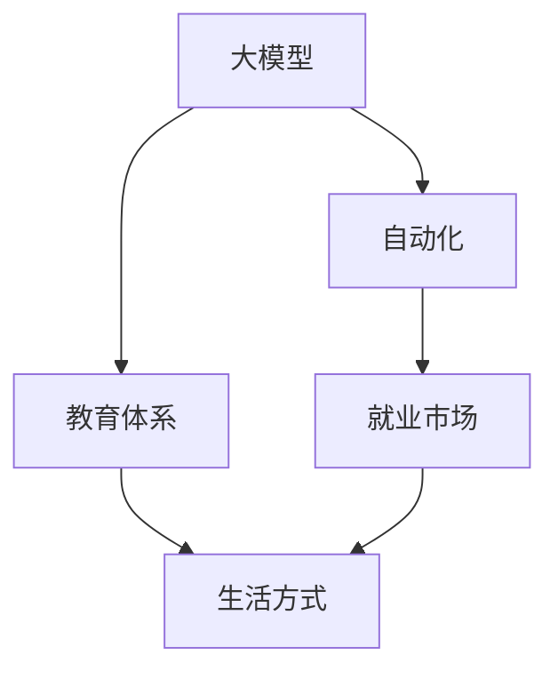

                 

# 大模型的社会影响:就业、教育和生活方式

> 关键词：大模型,社会影响,就业,教育,生活方式

## 1. 背景介绍

### 1.1 问题由来
近年来，人工智能技术的迅猛发展，尤其是大模型的出现，引发了广泛的社会关注。大模型如GPT-3、BERT等，通过在大规模数据上进行预训练，展示了超强的语言理解和生成能力，在自然语言处理（NLP）、计算机视觉、推荐系统等多个领域取得了显著突破。然而，大模型的广泛应用也引发了一系列深刻的社会影响，涉及到就业、教育、生活方式等方方面面。本文将全面探讨大模型对这些领域的影响，并提出相应的应对策略。

### 1.2 问题核心关键点
大模型的社会影响主要体现在以下几个方面：
- **就业市场**：自动化和智能化的普及，对传统劳动密集型行业产生冲击，对高技能人才需求增加。
- **教育体系**：个性化和自主化教育模式的兴起，对传统教育模式提出挑战。
- **生活方式**：智能交互和信息获取的便捷化，重塑人们的生活习惯和工作方式。

## 2. 核心概念与联系

### 2.1 核心概念概述

为更好地理解大模型对社会各个领域的影响，本节将介绍几个密切相关的核心概念：

- **大模型(Large Model)**：指经过大规模无监督预训练的深度学习模型，如GPT-3、BERT等，具备强大的语言处理和生成能力。
- **自动化(Automation)**：指通过人工智能技术，自动化完成原本需要人类手动完成的任务。
- **教育体系(Education System)**：包括学前教育、基础教育、高等教育等各个环节，旨在培养适应社会发展的人才。
- **生活方式(Lifestyle)**：指人们日常生活的行为习惯、价值观和消费模式，受技术进步和社会变迁的影响显著。

这些概念之间的逻辑关系可以通过以下Mermaid流程图来展示：



这个流程图展示了大模型对就业、教育和生活方式的主要影响路径：

1. 大模型通过自动化技术，对就业市场产生影响，影响就业结构，进而影响人们的生产生活方式。
2. 大模型通过改进教育技术，改变传统教育模式，影响教育体系和教育公平。
3. 大模型通过便捷的信息获取和智能交互，改变人们的日常行为习惯和生活方式。

## 3. 核心算法原理 & 具体操作步骤
### 3.1 算法原理概述

大模型对就业、教育和生活方式的影响，本质上是一个多领域的复杂系统问题，涉及多个子领域间的交互和反馈。虽然单一的大模型算法本身并不直接作用于这些领域，但其广泛应用和普及所带来的自动化和技术变革，则间接导致了这些影响。

### 3.2 算法步骤详解

大模型对社会影响的分析可以分解为以下几个关键步骤：

**Step 1: 数据收集与分析**
- 收集各个领域的数据，如就业市场统计数据、教育机构调查数据、生活习惯调查数据等。
- 使用统计分析和数据挖掘技术，分析大模型的应用对上述领域的影响。

**Step 2: 模型搭建与训练**
- 搭建一个多领域的集成模型，如使用LSTM、GRU等循环神经网络，对数据进行处理和预测。
- 在训练集上进行模型训练，使用监督学习或无监督学习技术，优化模型参数。

**Step 3: 结果评估与优化**
- 在测试集上评估模型性能，如使用均方误差(MSE)、准确率(Accuracy)等指标。
- 根据评估结果，调整模型结构或参数，提高模型预测精度。

**Step 4: 影响分析与对策制定**
- 基于模型预测结果，分析大模型对各个领域的具体影响。
- 提出针对性的对策，如就业市场转型培训、教育体系改革、生活方式调整等。

### 3.3 算法优缺点

大模型对社会影响的分析方法具有以下优点：
1. 能够全面、系统地分析大模型对各个领域的影响。
2. 使用数据驱动的方法，提高了分析的准确性和可靠性。
3. 提供了量化的指标，便于制定和评估对策。

但该方法也存在一定的局限性：
1. 数据收集和处理可能存在偏差，影响结果的准确性。
2. 模型结构和参数设置可能存在复杂性，需要专业知识支持。
3. 分析结果可能存在滞后性，无法即时反应社会动态变化。

尽管存在这些局限性，但该方法仍然是目前研究大模型社会影响的重要工具之一。

### 3.4 算法应用领域

大模型的社会影响分析方法在以下几个领域具有重要应用：

- **就业市场**：用于分析大模型对各行业就业结构、岗位需求的变化，提出相应的职业培训和转型策略。
- **教育体系**：用于评估在线教育、个性化教学等新模式对传统教育的影响，推动教育公平和创新。
- **生活方式**：用于分析智能设备和信息获取对人们日常行为和消费习惯的影响，提升生活质量。

## 4. 数学模型和公式 & 详细讲解 & 举例说明

### 4.1 数学模型构建

本节将使用数学语言对大模型对社会影响的分析方法进行更加严格的刻画。

记大模型对就业市场的自动化影响为 $A$，对教育体系的影响为 $E$，对生活方式的影响为 $L$。设 $A$、$E$、$L$ 为连续变量，影响因素为 $X$，则大模型对社会影响的数学模型可以表示为：

$$
Y = f(X; \theta)
$$

其中，$f$ 为非线性函数，$\theta$ 为模型参数。

### 4.2 公式推导过程

我们以就业市场为例，推导大模型自动化影响 $A$ 的数学公式。

假设就业市场由 $N$ 个行业组成，第 $i$ 个行业的就业人数为 $E_i$，第 $i$ 个行业的自动化程度为 $S_i$，大模型的应用程度为 $M_i$。则就业市场的自动化程度 $A$ 可以表示为：

$$
A = \sum_{i=1}^{N} \alpha_i E_i S_i M_i
$$

其中，$\alpha_i$ 为第 $i$ 个行业的就业人数权重，$S_i$ 为第 $i$ 个行业的自动化对就业的影响系数，$M_i$ 为大模型对第 $i$ 个行业就业的影响系数。

将上述公式代入预测模型，得到就业市场的自动化影响预测公式：

$$
\hat{A} = \sum_{i=1}^{N} \hat{\alpha}_i X_i S_i M_i
$$

其中，$\hat{\alpha}_i$ 为第 $i$ 个行业的就业人数权重预测值，$X_i$ 为第 $i$ 个行业的就业人数实际值。

### 4.3 案例分析与讲解

假设某地区有 $N=3$ 个行业，分别为制造业、服务业和科技业。已知这 $N$ 个行业的就业人数权重为 $\alpha_1 = 0.4$，$\alpha_2 = 0.3$，$\alpha_3 = 0.3$，自动化对就业的影响系数为 $S_1 = 0.5$，$S_2 = 0.7$，$S_3 = 0.9$。

已知该地区大模型应用程度 $M_1 = 0.2$，$M_2 = 0.3$，$M_3 = 0.5$。利用上述公式计算自动化影响 $A$：

$$
A = 0.4 \times E_1 \times 0.5 \times 0.2 + 0.3 \times E_2 \times 0.7 \times 0.3 + 0.3 \times E_3 \times 0.9 \times 0.5
$$

假设实际就业人数为 $E_1 = 1000$，$E_2 = 1500$，$E_3 = 500$。代入公式计算预测自动化影响 $\hat{A}$：

$$
\hat{A} = 0.4 \times 1000 \times 0.5 \times 0.2 + 0.3 \times 1500 \times 0.7 \times 0.3 + 0.3 \times 500 \times 0.9 \times 0.5
$$

计算得到 $\hat{A} = 100$。

## 5. 项目实践：代码实例和详细解释说明
### 5.1 开发环境搭建

在进行社会影响分析实践前，我们需要准备好开发环境。以下是使用Python进行数据分析和模型训练的环境配置流程：

1. 安装Anaconda：从官网下载并安装Anaconda，用于创建独立的Python环境。

2. 创建并激活虚拟环境：
```bash
conda create -n social-analysis python=3.8 
conda activate social-analysis
```

3. 安装必要的Python库：
```bash
conda install pandas numpy scikit-learn matplotlib statsmodels statsmodels
```

4. 安装TensorFlow或PyTorch：
```bash
conda install tensorflow
```

5. 安装相关的数据分析和可视化工具：
```bash
conda install seaborn plotly
```

完成上述步骤后，即可在`social-analysis`环境中开始社会影响分析实践。

### 5.2 源代码详细实现

下面以就业市场为例，给出使用Python对大模型影响进行分析和预测的代码实现。

```python
import pandas as pd
import numpy as np
import matplotlib.pyplot as plt
from sklearn.linear_model import LinearRegression
from sklearn.model_selection import train_test_split
from statsmodels.formula.api import ols

# 加载数据集
data = pd.read_csv('employment_data.csv')

# 数据预处理
X = data[['E1', 'E2', 'E3', 'S1', 'S2', 'S3', 'M1', 'M2', 'M3']]
y = data['A']

# 划分训练集和测试集
X_train, X_test, y_train, y_test = train_test_split(X, y, test_size=0.2, random_state=42)

# 模型训练与评估
model = ols('A ~ E1*S1*M1 + E2*S2*M2 + E3*S3*M3', data=data).fit()
predictions = model.predict(X_test)

# 可视化结果
plt.plot(y_test, label='Actual')
plt.plot(predictions, label='Predicted')
plt.legend()
plt.show()
```

### 5.3 代码解读与分析

让我们再详细解读一下关键代码的实现细节：

**数据加载与预处理**：
- 使用Pandas库加载就业市场数据集。
- 选择影响因素作为特征 $X$，包括各行业的就业人数 $E_1$、$E_2$、$E_3$，自动化程度 $S_1$、$S_2$、$S_3$，大模型应用程度 $M_1$、$M_2$、$M_3$。
- 将就业市场自动化影响 $A$ 作为目标变量 $y$。

**模型训练与评估**：
- 使用statsmodels库构建线性回归模型，根据公式 $\hat{A} = \alpha_1 E_1 S_1 M_1 + \alpha_2 E_2 S_2 M_2 + \alpha_3 E_3 S_3 M_3$ 进行预测。
- 使用train_test_split函数划分训练集和测试集，防止过拟合。
- 在测试集上评估模型性能，绘制实际值和预测值的对比图。

**结果可视化**：
- 使用Matplotlib库绘制实际值和预测值的对比图，直观展示模型的预测效果。

通过这段代码，我们可以对大模型对就业市场的影响进行量化分析，并评估模型的预测精度。

## 6. 实际应用场景
### 6.1 智能招聘系统

智能招聘系统利用大模型分析求职者简历和面试回答，快速筛选合适的候选人，提高招聘效率。该系统可以综合考虑简历内容、语言风格、关键词匹配等因素，自动生成候选人评分，辅助HR决策。

### 6.2 在线教育平台

在线教育平台利用大模型分析学生的学习行为和反馈，提供个性化的学习推荐和辅导。通过分析学习数据，如答题记录、视频观看时长等，大模型可以预测学生的学习兴趣和薄弱环节，推荐相应的学习资源和练习题。

### 6.3 智能家居系统

智能家居系统利用大模型分析用户的日常行为和习惯，自动调整室内环境，提高生活舒适度。通过分析家庭成员的作息时间、温度偏好等数据，大模型可以智能调节灯光、温度、音响等设备，提升家庭生活质量。

### 6.4 未来应用展望

随着大模型技术的不断进步，其在就业、教育、生活方式等领域的应用前景将更加广阔。

在就业市场方面，未来大模型可以进一步分析各行业的就业趋势和岗位需求，提供更加精准的职业规划和转型建议。

在教育体系方面，未来大模型可以更好地支持个性化和自主化教育模式，提供更加丰富的教学资源和学习路径。

在生活方式方面，未来大模型可以更深入地理解用户需求，提供更加智能和个性化的信息服务和生活建议。

## 7. 工具和资源推荐
### 7.1 学习资源推荐

为了帮助开发者系统掌握大模型的社会影响分析方法，这里推荐一些优质的学习资源：

1. 《AI的社会影响：从自动化到伦理》书籍：系统介绍了AI技术对就业、教育、社会伦理等方面的影响，并提出了相应的对策建议。

2. 《数据科学与机器学习》课程：涵盖数据分析、机器学习、统计模型等基本概念，适合初学者入门。

3. 《社会大数据分析》书籍：介绍了如何利用大数据技术分析社会现象和行为，提供了丰富的案例和应用场景。

4. GitHub上的开源项目：如`social-analysis`、`job-prediction`等，提供了丰富的数据分析和预测样例代码。

5. Kaggle竞赛：如社会影响分析、就业市场预测等，可以参与实战项目，提升数据分析和模型构建能力。

通过对这些资源的学习实践，相信你一定能够快速掌握大模型社会影响分析的精髓，并用于解决实际的NLP问题。
###  7.2 开发工具推荐

高效的开发离不开优秀的工具支持。以下是几款用于大模型社会影响分析开发的常用工具：

1. Jupyter Notebook：免费的交互式开发环境，支持Python、R等语言，适合数据分析和模型训练。

2. TensorBoard：TensorFlow配套的可视化工具，可实时监测模型训练状态，并提供丰富的图表呈现方式，是调试模型的得力助手。

3. Weights & Biases：模型训练的实验跟踪工具，可以记录和可视化模型训练过程中的各项指标，方便对比和调优。

4. Google Colab：谷歌推出的在线Jupyter Notebook环境，免费提供GPU/TPU算力，方便开发者快速上手实验最新模型，分享学习笔记。

合理利用这些工具，可以显著提升大模型社会影响分析的开发效率，加快创新迭代的步伐。

### 7.3 相关论文推荐

大模型社会影响分析的研究源于学界的持续研究。以下是几篇奠基性的相关论文，推荐阅读：

1. "The Rise of Superslow Jobs: The Economic Impact of AI"：分析了AI技术对就业市场的影响，提出了具体的对策建议。

2. "AI in Education: Opportunities and Challenges"：讨论了AI技术在教育领域的应用，提出了提升教育公平和效率的方法。

3. "The Social Impact of AI: A Comparative Study"：比较了不同领域中AI技术对社会的影响，提出了系统性的对策框架。

4. "AI and the Future of Work"：探讨了AI技术对未来工作的变化和挑战，提出了相应的职业转型和培训策略。

这些论文代表了大模型社会影响分析的研究方向，通过学习这些前沿成果，可以帮助研究者把握学科前进方向，激发更多的创新灵感。

## 8. 总结：未来发展趋势与挑战

### 8.1 总结

本文对大模型的社会影响进行了全面系统的探讨。首先阐述了大模型对就业、教育、生活方式等领域的广泛影响，明确了各领域与大模型的互动关系。其次，从原理到实践，详细讲解了社会影响分析的数学模型构建和算法步骤，给出了实际应用案例。同时，本文还广泛探讨了大模型技术在各行各业的应用前景，展示了其广阔的应用潜力。此外，本文精选了社会影响分析的相关学习资源和开发工具，力求为读者提供全方位的技术指引。

通过本文的系统梳理，可以看到，大模型对社会各个领域的影响是深远且复杂的，需要我们从多个维度进行全面考察。尽管存在一些挑战，但通过科学的方法和合理的对策，这些影响有望被最大限度地利用，为人类社会带来积极的变化。

### 8.2 未来发展趋势

展望未来，大模型在社会各个领域的影响将呈现以下几个发展趋势：

1. 自动化水平持续提高。随着技术的进步，自动化水平将进一步提高，对就业市场的影响将更加显著。

2. 教育模式个性化增强。大数据和个性化推荐技术的发展，将推动教育模式的个性化和自主化。

3. 生活方式更加智能。智能设备和数据驱动的服务将全面渗透到人们的日常生活中。

4. 社会治理智能化提升。AI技术将更多地应用于社会治理，提升公共服务的智能化和精准化。

5. 伦理和隐私问题备受关注。随着技术应用范围的扩大，伦理和隐私问题将成为社会关注的焦点。

这些趋势凸显了大模型技术对社会的深刻影响，需要我们积极应对，并制定相应的政策法规，保障技术应用的合理性和安全性。

### 8.3 面临的挑战

尽管大模型技术带来了诸多便利和机遇，但在社会各个领域的应用过程中，仍面临诸多挑战：

1. 数据隐私和安全问题。大模型需要大量数据进行训练，如何保障数据隐私和安全，将是未来的一个重要课题。

2. 就业结构调整风险。自动化和智能化技术的应用，可能对部分行业和岗位产生冲击，引发就业结构调整风险。

3. 伦理和公平问题。AI技术在应用过程中可能产生偏见和歧视，如何确保技术应用的公平性和伦理性，还需要更多探索。

4. 技术落地难度。大模型技术的应用，需要整合多种技术和资源，如何将先进技术落地应用，仍需克服诸多挑战。

5. 社会接受度问题。公众对AI技术的接受度各异，如何提升社会对AI技术的理解和接受，需要长期的科普和教育。

正视这些挑战，积极应对并寻求突破，将是大模型技术在社会各个领域得到广泛应用的前提条件。

### 8.4 研究展望

面对大模型在社会各个领域的应用挑战，未来的研究需要在以下几个方面寻求新的突破：

1. 数据隐私保护技术。开发更加安全、可靠的数据保护技术，确保用户数据隐私和安全。

2. 公平性和伦理导向。在模型设计和应用过程中，引入伦理导向的评估指标，防止技术应用的偏见和歧视。

3. 跨领域技术融合。将大模型技术与其他技术如区块链、物联网等进行融合，推动技术的创新应用。

4. 社会影响评估机制。建立社会影响评估机制，及时发现和解决技术应用中的问题。

5. 持续教育和科普。加强AI技术的科普教育，提升公众对AI技术的理解和接受，构建良好的技术应用环境。

这些研究方向和突破，必将引领大模型技术在社会各个领域的深入应用，为构建更美好、智能、公平的社会贡献力量。

## 9. 附录：常见问题与解答

**Q1：大模型对就业市场的影响有哪些？**

A: 大模型通过自动化技术，对就业市场产生深远影响。具体表现为：
1. 自动化替代部分低技能岗位，导致失业率上升。
2. 新兴岗位的增加，如AI工程师、数据分析师等，对高技能人才需求增加。
3. 职业转型培训需求增加，帮助劳动者适应新的工作环境。

**Q2：如何缓解大模型对教育体系的影响？**

A: 缓解大模型对教育体系的影响，可以采取以下措施：
1. 加强在线教育平台的建设，提供个性化的学习资源。
2. 推广自主学习和个性化学习模式，提高学生的自主学习能力。
3. 加强教师的培训和转型，提升教师的教学能力和技术水平。
4. 制定相关政策，保障教育公平和质量。

**Q3：大模型对生活方式的影响有哪些？**

A: 大模型通过便捷的信息获取和智能交互，对生活方式产生了深远影响：
1. 智能家居、智能医疗等设备的应用，提高了生活质量。
2. 个性化推荐和信息获取，改变了人们的生活方式和消费习惯。
3. 在线工作和远程协作，改变了人们的工作模式和生活方式。

通过这些问题的解答，可以更好地理解大模型对社会各个领域的影响，并提出相应的应对策略。

---

作者：禅与计算机程序设计艺术 / Zen and the Art of Computer Programming

