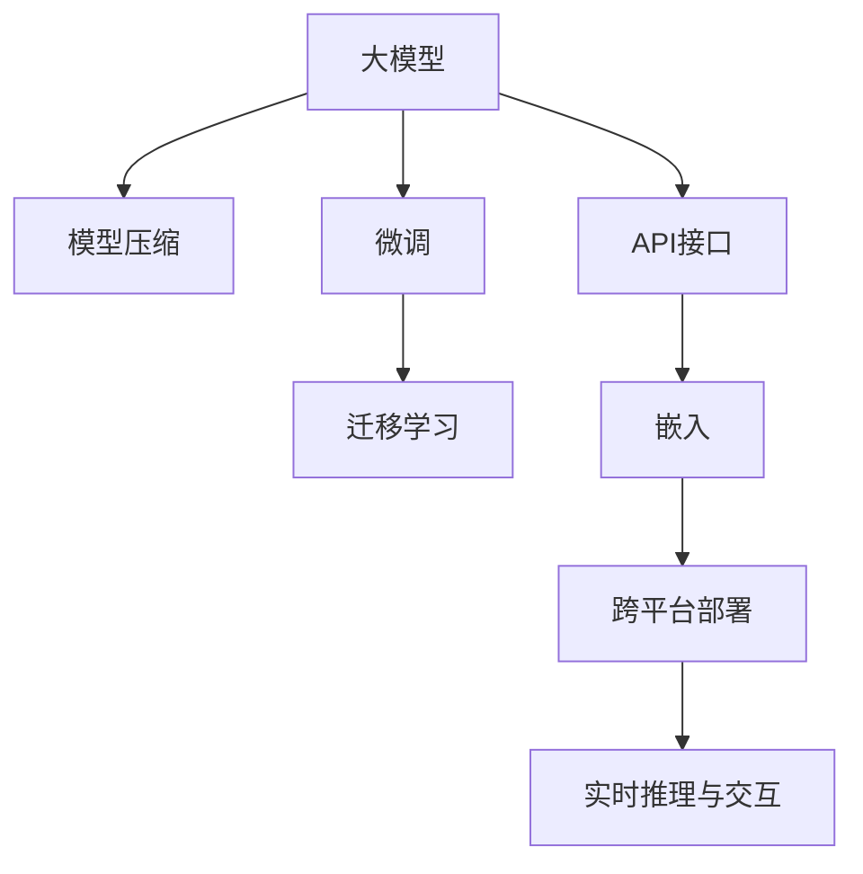

                 

## 1. 背景介绍

### 1.1 问题由来
在大数据和人工智能快速发展的今天，个人工作流的智能化已逐渐成为现代办公的重要趋势。大模型作为近年来AI技术中的重要一环，在自然语言处理（NLP）、计算机视觉（CV）、语音识别等领域展现出强大的能力。然而，如何将大模型的能力有效地集成到个人工作流中，仍是一大挑战。大模型通常拥有数十亿参数，训练成本高，计算量大，且在使用时对硬件设施要求较高。这些因素限制了其在个人工作流中的广泛应用。

### 1.2 问题核心关键点
针对以上问题，本文旨在探讨如何高效地将大模型的能力集成到个人工作流中，提供几个关键点：
1. **模型压缩与裁剪**：通过模型压缩与裁剪技术，降低模型的大小和计算资源需求。
2. **微调与迁移学习**：利用微调与迁移学习技术，快速适应新任务，提升模型性能。
3. **API与嵌入**：通过API接口和嵌入技术，将大模型无缝集成到现有的工具和应用中。
4. **跨平台部署与优化**：在多个平台（如桌面、移动、云端等）上进行模型部署，并优化其性能和资源占用。
5. **实时推理与交互**：实现实时推理和交互，提升用户体验和系统响应速度。

### 1.3 问题研究意义
研究大模型能力在个人工作流中的集成，对推动AI技术在个人办公和生产中的应用具有重要意义：

1. **提升效率**：将大模型的能力集成到个人工作流中，可以显著提高工作效率，减少重复劳动，使个人更专注于创造性工作。
2. **降低成本**：通过模型压缩和裁剪技术，降低训练和推理成本，使更多人能够负担得起并使用AI技术。
3. **增强决策支持**：利用大模型的多模态感知能力和预测能力，为个人决策提供强有力的支持。
4. **促进创新**：大模型可以支持个性化定制，提供定制化解决方案，促进创新思维和创造力。
5. **提升竞争力**：具备AI技能的工作者将更具有竞争力，为个人职业生涯发展带来更多机遇。

## 2. 核心概念与联系

### 2.1 核心概念概述

为更好地理解如何将大模型能力集成到个人工作流中，本节将介绍几个密切相关的核心概念：

- **大模型(Large Model)**：指具有数十亿参数的深度学习模型，如BERT、GPT-3、T5等。这类模型通常在大规模无标签数据上进行自监督预训练，学习到丰富的语言和视觉知识。
- **模型压缩(Model Compression)**：通过模型裁剪、量化、剪枝等技术，降低模型大小和计算资源需求。
- **微调(Fine-Tuning)**：指在大模型的基础上，通过有标签数据进行有监督训练，使模型适应新任务。
- **迁移学习(Transfer Learning)**：利用已在大规模数据上预训练的模型，在小规模数据上继续训练，提升模型在新任务上的性能。
- **API接口(API Interface)**：用于在应用程序间进行数据和服务的交互，支持跨平台集成。
- **嵌入(Embedding)**：将大模型的能力嵌入到现有工具或应用中，提升其智能水平。

这些核心概念之间的逻辑关系可以通过以下Mermaid流程图来展示：



这个流程图展示了大模型能力的核心概念及其之间的关系：

1. 大模型通过预训练获得基础能力。
2. 模型压缩技术可以降低大模型的资源需求。
3. 微调和迁移学习可以提升大模型在新任务上的性能。
4. API接口支持跨平台集成。
5. 嵌入技术可以提升现有工具和应用的智能水平。
6. 跨平台部署和实时推理支持在不同环境下的高效应用。

这些概念共同构成了大模型能力在个人工作流中的集成框架，使其能够在各种场景下发挥强大的智能效能。通过理解这些核心概念，我们可以更好地把握大模型应用的方向和方法。

## 3. 核心算法原理 & 具体操作步骤
### 3.1 算法原理概述

将大模型的能力集成到个人工作流中，本质上是一个模型压缩、微调与嵌入的过程。其核心思想是：在大模型的基础上，通过模型压缩技术降低计算资源需求，利用微调技术适应新任务，同时通过API接口和嵌入技术，将大模型的能力无缝集成到现有的工具和应用中。

形式化地，假设大模型为 $M_{\theta}$，其中 $\theta$ 为大模型的初始参数。在个人工作流中，需要处理的任务为 $T$。我们的目标是找到模型参数 $\hat{\theta}$，使得：

$$
\hat{\theta}=\mathop{\arg\min}_{\theta} \mathcal{L}(M_{\theta},T)
$$

其中 $\mathcal{L}$ 为目标任务 $T$ 的损失函数，用于衡量模型预测输出与真实标签之间的差异。通过梯度下降等优化算法，微调过程不断更新模型参数 $\theta$，最小化损失函数 $\mathcal{L}$，使得模型输出逼近真实标签。

### 3.2 算法步骤详解

将大模型能力集成到个人工作流中，一般包括以下几个关键步骤：

**Step 1: 准备大模型与数据集**
- 选择合适的预训练大模型 $M_{\theta}$，如BERT、GPT等。
- 准备目标任务 $T$ 的标注数据集 $D$，划分为训练集、验证集和测试集。

**Step 2: 模型压缩与裁剪**
- 对大模型进行模型压缩，如剪枝、量化、蒸馏等，降低模型大小和计算资源需求。
- 根据需要裁剪部分层，只保留对特定任务有帮助的层，减少需优化的参数。

**Step 3: 微调与迁移学习**
- 利用目标任务的标注数据集 $D$ 进行有监督微调，调整模型参数以适应新任务。
- 如果目标任务与预训练数据的分布差异较大，可以考虑先在小规模数据上做迁移学习，提升模型在新任务上的泛化能力。

**Step 4: API接口与嵌入**
- 将微调后的模型封装为标准化的API接口，支持跨平台集成。
- 将大模型的能力嵌入到现有的工具和应用中，提升其智能水平。

**Step 5: 跨平台部署与优化**
- 在多个平台（如桌面、移动、云端等）上进行模型部署，并优化其性能和资源占用。
- 利用多线程、异步调用等技术，提升模型推理速度和系统响应速度。

**Step 6: 实时推理与交互**
- 实现实时推理，支持用户即时交互，提升用户体验。
- 利用缓存技术、模型推理优化等手段，保证系统高效稳定。

### 3.3 算法优缺点

将大模型能力集成到个人工作流中的方法具有以下优点：
1. **计算效率高**：通过模型压缩与裁剪技术，降低了模型计算资源需求，提高了推理效率。
2. **适应性强**：微调和迁移学习技术可以快速适应新任务，提升模型性能。
3. **跨平台易用**：API接口和嵌入技术使得模型可以无缝集成到现有工具和应用中，支持跨平台使用。
4. **用户体验佳**：实时推理和交互技术提升了用户体验，支持即时反馈和互动。

同时，该方法也存在一定的局限性：
1. **模型复杂度受限**：过度压缩和裁剪可能会丢失部分模型能力，影响性能。
2. **数据质量依赖**：微调和迁移学习依赖高质量的标注数据，数据质量不足会导致模型性能下降。
3. **可解释性差**：深度模型缺乏可解释性，难以理解其内部工作机制。
4. **硬件需求高**：大模型的计算和推理需要高性能硬件支持，部署和维护成本较高。

尽管存在这些局限性，但就目前而言，将大模型能力集成到个人工作流中仍是一种高效且实用的方法。未来相关研究的重点在于如何进一步降低计算需求，提升模型可解释性，并探索更多灵活的跨平台集成方式。

### 3.4 算法应用领域

将大模型能力集成到个人工作流中，已经在诸多领域得到应用，例如：

- **办公自动化**：如文档智能摘要、自动化报表生成、智能日程安排等，提升办公效率。
- **个人学习与教育**：如智能推荐系统、个性化学习路径规划、智能作业批改等，提供个性化教育服务。
- **医疗诊断**：如医学图像分析、疾病预测、药物研发等，提升医疗诊断准确性和效率。
- **金融投资**：如市场趋势预测、风险评估、智能投顾等，提供量化投资支持。
- **智能家居**：如语音控制、智能客服、设备联动等，提升家居智能化水平。

除了上述这些经典应用外，大模型能力集成还在更多场景中得到创新性的应用，如个性化推荐、智能写作、情感分析等，为个人工作流带来了全新的变革。随着预训练模型和集成技术的持续演进，相信大模型能力将在更广泛的领域得到应用，深刻影响个人生产生活方式。

## 4. 数学模型和公式 & 详细讲解  
### 4.1 数学模型构建

本节将使用数学语言对大模型能力集成到个人工作流的过程进行更加严格的刻画。

记预训练大模型为 $M_{\theta}$，其中 $\theta$ 为大模型的初始参数。假设目标任务 $T$ 的训练集为 $D=\{(x_i,y_i)\}_{i=1}^N, x_i \in \mathcal{X}, y_i \in \mathcal{Y}$。

定义模型 $M_{\theta}$ 在输入 $x$ 上的输出为 $\hat{y}=M_{\theta}(x)$，则模型在目标任务 $T$ 上的损失函数为：

$$
\mathcal{L}(\theta) = -\frac{1}{N}\sum_{i=1}^N \ell(\hat{y},y_i)
$$

其中 $\ell$ 为目标任务 $T$ 的损失函数，用于衡量模型预测输出与真实标签之间的差异。

在得到损失函数后，即可带入优化算法进行模型微调，最小化损失函数 $\mathcal{L}$，使得模型输出逼近真实标签。通过梯度下降等优化算法，不断更新模型参数 $\theta$，直至模型收敛。

### 4.2 公式推导过程

以下我们以二分类任务为例，推导微调过程的损失函数及其梯度的计算公式。

假设模型 $M_{\theta}$ 在输入 $x$ 上的输出为 $\hat{y}=M_{\theta}(x)$，表示样本属于正类的概率。真实标签 $y \in \{0,1\}$。则二分类交叉熵损失函数定义为：

$$
\ell(\hat{y},y) = -[y\log \hat{y} + (1-y)\log (1-\hat{y})]
$$

将其代入经验风险公式，得：

$$
\mathcal{L}(\theta) = -\frac{1}{N}\sum_{i=1}^N [y_i\log M_{\theta}(x_i)+(1-y_i)\log(1-M_{\theta}(x_i))]
$$

根据链式法则，损失函数对参数 $\theta_k$ 的梯度为：

$$
\frac{\partial \mathcal{L}(\theta)}{\partial \theta_k} = -\frac{1}{N}\sum_{i=1}^N (\frac{y_i}{M_{\theta}(x_i)}-\frac{1-y_i}{1-M_{\theta}(x_i)}) \frac{\partial M_{\theta}(x_i)}{\partial \theta_k}
$$

其中 $\frac{\partial M_{\theta}(x_i)}{\partial \theta_k}$ 可进一步递归展开，利用自动微分技术完成计算。

在得到损失函数的梯度后，即可带入优化算法进行模型微调，最小化损失函数 $\mathcal{L}$，使得模型输出逼近真实标签。

### 4.3 案例分析与讲解

我们以智能推荐系统为例，进行具体分析：

假设目标任务为推荐系统，模型需要学习用户对不同商品的评分。在训练集上，每个样本 $(x_i, y_i)$ 包含用户对商品 $x_i$ 的评分 $y_i$，以及用户的历史评分记录 $x_i$。

首先，对大模型进行裁剪和量化，以减少计算资源需求。接着，利用目标任务的标注数据集进行微调，调整模型参数以适应推荐任务。具体而言：

1. **模型裁剪**：去除模型中对推荐任务无用的层和参数，保留包含评分预测的顶层，以减少计算量和内存占用。
2. **量化技术**：将浮点模型转为定点模型，压缩存储空间，提高计算效率。
3. **微调过程**：在推荐数据集上，利用评分作为标签，最小化损失函数 $\mathcal{L}$，更新模型参数。

微调后的模型可以嵌入到现有推荐系统中，如电商平台、在线视频平台等，提升推荐系统的个性化和精准度。

## 5. 项目实践：代码实例和详细解释说明
### 5.1 开发环境搭建

在进行大模型能力集成到个人工作流中的实践前，我们需要准备好开发环境。以下是使用Python进行PyTorch开发的环境配置流程：

1. 安装Anaconda：从官网下载并安装Anaconda，用于创建独立的Python环境。

2. 创建并激活虚拟环境：
```bash
conda create -n pytorch-env python=3.8 
conda activate pytorch-env
```

3. 安装PyTorch：根据CUDA版本，从官网获取对应的安装命令。例如：
```bash
conda install pytorch torchvision torchaudio cudatoolkit=11.1 -c pytorch -c conda-forge
```

4. 安装各类工具包：
```bash
pip install numpy pandas scikit-learn matplotlib tqdm jupyter notebook ipython
```

完成上述步骤后，即可在`pytorch-env`环境中开始实践。

### 5.2 源代码详细实现

下面我们以推荐系统为例，给出使用PyTorch进行大模型能力集成的PyTorch代码实现。

首先，定义推荐任务的数据处理函数：

```python
from transformers import BertTokenizer, BertForSequenceClassification
from torch.utils.data import Dataset, DataLoader
import torch

class RecommendDataset(Dataset):
    def __init__(self, texts, scores, tokenizer, max_len=128):
        self.texts = texts
        self.scores = scores
        self.tokenizer = tokenizer
        self.max_len = max_len
        
    def __len__(self):
        return len(self.texts)
    
    def __getitem__(self, item):
        text = self.texts[item]
        score = self.scores[item]
        
        encoding = self.tokenizer(text, return_tensors='pt', max_length=self.max_len, padding='max_length', truncation=True)
        input_ids = encoding['input_ids'][0]
        attention_mask = encoding['attention_mask'][0]
        
        # 对评分进行编码
        encoded_score = score / 5
        encoded_score = [encoded_score] * self.max_len
        labels = torch.tensor(encoded_score, dtype=torch.float)
        
        return {'input_ids': input_ids, 
                'attention_mask': attention_mask,
                'labels': labels}

# 准备推荐数据集
tokenizer = BertTokenizer.from_pretrained('bert-base-cased')

train_dataset = RecommendDataset(train_texts, train_scores, tokenizer)
dev_dataset = RecommendDataset(dev_texts, dev_scores, tokenizer)
test_dataset = RecommendDataset(test_texts, test_scores, tokenizer)
```

然后，定义模型和优化器：

```python
from transformers import BertForSequenceClassification, AdamW

model = BertForSequenceClassification.from_pretrained('bert-base-cased', num_labels=1)

optimizer = AdamW(model.parameters(), lr=2e-5)
```

接着，定义训练和评估函数：

```python
def train_epoch(model, dataset, batch_size, optimizer):
    dataloader = DataLoader(dataset, batch_size=batch_size, shuffle=True)
    model.train()
    epoch_loss = 0
    for batch in dataloader:
        input_ids = batch['input_ids'].to(device)
        attention_mask = batch['attention_mask'].to(device)
        labels = batch['labels'].to(device)
        model.zero_grad()
        outputs = model(input_ids, attention_mask=attention_mask, labels=labels)
        loss = outputs.loss
        epoch_loss += loss.item()
        loss.backward()
        optimizer.step()
    return epoch_loss / len(dataloader)

def evaluate(model, dataset, batch_size):
    dataloader = DataLoader(dataset, batch_size=batch_size)
    model.eval()
    preds, labels = [], []
    with torch.no_grad():
        for batch in dataloader:
            input_ids = batch['input_ids'].to(device)
            attention_mask = batch['attention_mask'].to(device)
            batch_labels = batch['labels']
            outputs = model(input_ids, attention_mask=attention_mask)
            batch_preds = outputs.logits.argmax(dim=1).to('cpu').tolist()
            batch_labels = batch_labels.to('cpu').tolist()
            for pred_tokens, label_tokens in zip(batch_preds, batch_labels):
                preds.append(pred_tokens)
                labels.append(label_tokens)
                
    print(classification_report(labels, preds))
```

最后，启动训练流程并在测试集上评估：

```python
epochs = 5
batch_size = 16

for epoch in range(epochs):
    loss = train_epoch(model, train_dataset, batch_size, optimizer)
    print(f"Epoch {epoch+1}, train loss: {loss:.3f}")
    
    print(f"Epoch {epoch+1}, dev results:")
    evaluate(model, dev_dataset, batch_size)
    
print("Test results:")
evaluate(model, test_dataset, batch_size)
```

以上就是使用PyTorch对BERT进行推荐系统任务集成的完整代码实现。可以看到，得益于Transformers库的强大封装，我们可以用相对简洁的代码完成BERT模型的加载和集成。

### 5.3 代码解读与分析

让我们再详细解读一下关键代码的实现细节：

**RecommendDataset类**：
- `__init__`方法：初始化文本、评分、分词器等关键组件。
- `__len__`方法：返回数据集的样本数量。
- `__getitem__`方法：对单个样本进行处理，将文本输入编码为token ids，将评分编码为数字，并对其进行定长padding，最终返回模型所需的输入。

**模型和优化器**：
- 使用BertForSequenceClassification对大模型进行裁剪，保留包含评分预测的顶层。
- 使用AdamW优化器进行微调，调整模型参数以适应推荐任务。

**训练和评估函数**：
- 使用PyTorch的DataLoader对数据集进行批次化加载，供模型训练和推理使用。
- 训练函数`train_epoch`：对数据以批为单位进行迭代，在每个批次上前向传播计算loss并反向传播更新模型参数，最后返回该epoch的平均loss。
- 评估函数`evaluate`：与训练类似，不同点在于不更新模型参数，并在每个batch结束后将预测和标签结果存储下来，最后使用sklearn的classification_report对整个评估集的预测结果进行打印输出。

**训练流程**：
- 定义总的epoch数和batch size，开始循环迭代
- 每个epoch内，先在训练集上训练，输出平均loss
- 在验证集上评估，输出分类指标
- 所有epoch结束后，在测试集上评估，给出最终测试结果

可以看到，PyTorch配合Transformers库使得BERT集成到推荐系统中的代码实现变得简洁高效。开发者可以将更多精力放在数据处理、模型改进等高层逻辑上，而不必过多关注底层的实现细节。

当然，工业级的系统实现还需考虑更多因素，如模型的保存和部署、超参数的自动搜索、更灵活的任务适配层等。但核心的集成范式基本与此类似。

## 6. 实际应用场景
### 6.1 智能办公系统

大模型能力集成到个人工作流中，已在智能办公系统中得到广泛应用。传统的办公系统往往需要人工输入和处理大量信息，效率低下且易出错。利用大模型进行文档智能摘要、自动化报表生成、智能日程安排等操作，可以显著提升办公效率和准确性。

在技术实现上，可以收集企业内部的各种文档、报表、邮件等文本数据，将用户行为和反馈作为监督信号，对预训练大模型进行微调。微调后的模型能够自动识别文档类型，提取关键信息，生成摘要和推荐，提高办公自动化水平。

### 6.2 个人学习系统

大模型能力集成到个人学习系统中，可以帮助用户进行个性化学习和智能辅导。传统的学习系统依赖于人工设计和调整，难以满足个性化需求。通过大模型进行智能推荐和动态评估，可以为用户提供更加贴合其兴趣和能力的个性化学习路径，提升学习效率。

在实践中，可以收集用户的浏览历史、答题记录等数据，构建用户画像。利用微调后的推荐模型，实时推送相关学习资源和习题，并根据用户反馈不断优化推荐策略。通过大模型进行作业批改和智能评估，可以提供及时的反馈和指导，帮助用户更好地掌握知识点。

### 6.3 智能医疗系统

大模型能力集成到智能医疗系统中，可以为医生诊断和治疗提供支持。传统的医疗系统依赖于医生的经验和技术，存在主观性和局限性。通过大模型进行医学图像分析、疾病预测、药物研发等操作，可以提供更客观和全面的诊断和治疗建议，提高医疗服务质量。

在实践中，可以收集大量的医学图像和病例数据，对大模型进行微调，使其能够自动识别病变区域和病理类型。微调后的模型可以嵌入到医疗影像分析系统中，帮助医生快速诊断疾病，并根据病理数据推荐治疗方案。同时，通过大模型进行药物研发，可以预测药物的效果和副作用，缩短新药开发周期。

### 6.4 未来应用展望

随着大模型能力在个人工作流中的集成技术的不断发展，其在更多领域的应用前景将更加广阔：

1. **智慧制造**：利用大模型进行生产数据分析和预测，提升生产效率和质量。
2. **智能交通**：通过大模型进行交通流量预测和智能调度，提升交通管理水平。
3. **智能教育**：通过大模型进行智能推荐和学习评估，提升教育质量和个性化水平。
4. **智能家居**：利用大模型进行语音识别和场景分析，提升家居智能化水平。
5. **智能金融**：通过大模型进行市场分析和风险预测，提供智能投顾服务。

这些方向的发展，将进一步推动AI技术在个人生产生活中的应用，为社会带来更加智能化、高效化的服务。

## 7. 工具和资源推荐
### 7.1 学习资源推荐

为了帮助开发者系统掌握大模型能力在个人工作流中的集成的理论基础和实践技巧，这里推荐一些优质的学习资源：

1. 《Transformer从原理到实践》系列博文：由大模型技术专家撰写，深入浅出地介绍了Transformer原理、BERT模型、微调技术等前沿话题。

2. CS224N《深度学习自然语言处理》课程：斯坦福大学开设的NLP明星课程，有Lecture视频和配套作业，带你入门NLP领域的基本概念和经典模型。

3. 《Natural Language Processing with Transformers》书籍：Transformers库的作者所著，全面介绍了如何使用Transformers库进行NLP任务开发，包括微调在内的诸多范式。

4. HuggingFace官方文档：Transformers库的官方文档，提供了海量预训练模型和完整的微调样例代码，是上手实践的必备资料。

5. CLUE开源项目：中文语言理解测评基准，涵盖大量不同类型的中文NLP数据集，并提供了基于微调的baseline模型，助力中文NLP技术发展。

通过对这些资源的学习实践，相信你一定能够快速掌握大模型能力在个人工作流中的集成的精髓，并用于解决实际的NLP问题。
###  7.2 开发工具推荐

高效的开发离不开优秀的工具支持。以下是几款用于大模型能力集成到个人工作流中的常用工具：

1. PyTorch：基于Python的开源深度学习框架，灵活动态的计算图，适合快速迭代研究。大部分预训练语言模型都有PyTorch版本的实现。

2. TensorFlow：由Google主导开发的开源深度学习框架，生产部署方便，适合大规模工程应用。同样有丰富的预训练语言模型资源。

3. Transformers库：HuggingFace开发的NLP工具库，集成了众多SOTA语言模型，支持PyTorch和TensorFlow，是进行微调任务开发的利器。

4. Weights & Biases：模型训练的实验跟踪工具，可以记录和可视化模型训练过程中的各项指标，方便对比和调优。与主流深度学习框架无缝集成。

5. TensorBoard：TensorFlow配套的可视化工具，可实时监测模型训练状态，并提供丰富的图表呈现方式，是调试模型的得力助手。

6. Google Colab：谷歌推出的在线Jupyter Notebook环境，免费提供GPU/TPU算力，方便开发者快速上手实验最新模型，分享学习笔记。

合理利用这些工具，可以显著提升大模型能力集成到个人工作流中的开发效率，加快创新迭代的步伐。

### 7.3 相关论文推荐

大模型能力在个人工作流中的集成的研究源于学界的持续研究。以下是几篇奠基性的相关论文，推荐阅读：

1. Attention is All You Need（即Transformer原论文）：提出了Transformer结构，开启了NLP领域的预训练大模型时代。

2. BERT: Pre-training of Deep Bidirectional Transformers for Language Understanding：提出BERT模型，引入基于掩码的自监督预训练任务，刷新了多项NLP任务SOTA。

3. Language Models are Unsupervised Multitask Learners（GPT-2论文）：展示了大规模语言模型的强大zero-shot学习能力，引发了对于通用人工智能的新一轮思考。

4. Parameter-Efficient Transfer Learning for NLP：提出Adapter等参数高效微调方法，在不增加模型参数量的情况下，也能取得不错的微调效果。

5. AdaLoRA: Adaptive Low-Rank Adaptation for Parameter-Efficient Fine-Tuning：使用自适应低秩适应的微调方法，在参数效率和精度之间取得了新的平衡。

这些论文代表了大模型能力集成的发展脉络。通过学习这些前沿成果，可以帮助研究者把握学科前进方向，激发更多的创新灵感。

## 8. 总结：未来发展趋势与挑战

### 8.1 总结

本文对大模型能力在个人工作流中的集成方法进行了全面系统的介绍。首先阐述了大模型能力集成的研究背景和意义，明确了集成技术在提升办公效率、降低成本、提供决策支持等方面的独特价值。其次，从原理到实践，详细讲解了集成的数学原理和关键步骤，给出了集成任务开发的完整代码实例。同时，本文还广泛探讨了集成方法在智能办公、个人学习、智能医疗等多个领域的应用前景，展示了集成的巨大潜力。此外，本文精选了集成的各类学习资源，力求为读者提供全方位的技术指引。

通过本文的系统梳理，可以看到，大模型能力集成到个人工作流中，正在成为办公自动化、教育智能化、医疗辅助等领域的重要技术手段，极大地提升了工作效率和智能化水平。得益于大模型技术的进步，集成的成本正在逐步降低，应用场景不断扩展，未来必将在更多领域得到广泛应用。

### 8.2 未来发展趋势

展望未来，大模型能力在个人工作流中的集成将呈现以下几个发展趋势：

1. **计算资源优化**：随着硬件技术的发展和模型压缩技术的进步，大模型的计算资源需求将进一步降低，使得更多用户能够负担得起并使用。
2. **模型通用性提升**：通过跨领域迁移学习，大模型将在更多任务上展现出通用性，提高集成应用的覆盖面和灵活性。
3. **实时推理与交互增强**：通过缓存技术和模型优化，实现更高效的实时推理和交互，提升用户体验。
4. **跨平台集成深化**：在多个平台（如桌面、移动、云端等）上进行集成，支持不同场景下的应用需求。
5. **可解释性与透明度增强**：引入可解释性技术，增强集成系统的透明度和可控性，降低安全风险。
6. **融合更多先验知识**：将知识图谱、逻辑规则等专家知识与大模型结合，提升集成的智能水平和决策能力。

这些趋势凸显了大模型能力集成技术的广阔前景。这些方向的探索发展，必将进一步提升集成系统的性能和应用范围，为各行各业带来更深远的影响。

### 8.3 面临的挑战

尽管大模型能力在个人工作流中的集成技术已经取得了瞩目成就，但在迈向更加智能化、普适化应用的过程中，它仍面临着诸多挑战：

1. **硬件资源需求**：大模型能力集成需要高性能硬件支持，部署和维护成本较高，限制了其在低成本环境中的应用。
2. **数据质量依赖**：微调和迁移学习依赖高质量的标注数据，数据质量不足会导致集成性能下降。
3. **可解释性不足**：深度模型缺乏可解释性，难以理解其内部工作机制和决策逻辑，增加了集成系统的复杂性。
4. **安全与隐私问题**：集成系统涉及大量用户数据，如何保护用户隐私和数据安全是一大挑战。
5. **跨平台兼容性**：不同平台之间的集成可能存在兼容性问题，需要设计合理的跨平台接口和协议。
6. **实时性能瓶颈**：实时推理和交互对性能要求高，需要优化模型结构和推理算法，保证系统高效稳定。

尽管存在这些挑战，但通过持续的研究和优化，大模型能力在个人工作流中的集成必将在各个领域得到广泛应用，提升工作效率和生活质量。

### 8.4 研究展望

面向未来，大模型能力在个人工作流中的集成研究需要在以下几个方面寻求新的突破：

1. **无监督与半监督集成**：探索无监督和半监督学习范式，降低对标注数据的依赖，扩展集成应用场景。
2. **零样本与少样本集成**：利用大模型的多模态感知能力和先验知识，实现零样本和少样本集成，减少数据收集和标注成本。
3. **跨模态集成**：融合视觉、语音、文本等多模态数据，提升集成系统的感知能力和智能化水平。
4. **知识图谱与规则融合**：将知识图谱、逻辑规则等专家知识与大模型结合，提升集成系统的决策能力和知识整合能力。
5. **可解释性增强**：引入可解释性技术，提升集成系统的透明度和可控性，增强用户信任和应用可靠性。
6. **隐私保护与数据安全**：引入隐私保护和数据安全技术，保护用户隐私和数据安全，确保集成系统可靠运行。

这些研究方向将引领大模型能力在个人工作流中的集成技术迈向更高的台阶，为构建智能化、高效化、安全化的工作流系统提供新的思路和方案。面向未来，大模型能力集成技术需与其他人工智能技术进行更深入的融合，协同发力，共同推动人工智能技术在个人生产生活中的应用和普及。只有不断创新、不断突破，才能真正实现人工智能技术在个人工作流中的广泛应用，为社会带来更深远的变革。

## 9. 附录：常见问题与解答

**Q1：大模型能力集成过程中，如何处理数据不平衡问题？**

A: 数据不平衡是集成过程中常见的问题，可以采用以下方法进行解决：
1. **过采样与欠采样**：在少数类别上过采样或欠采样，使得各类别的样本数量相近。
2. **数据增强**：对少数类别进行数据增强，增加样本多样性，提升模型泛化能力。
3. **模型加权**：在训练过程中，对少数类别的样本给予更高权重，提升模型对少数类别的关注度。
4. **多模型集成**：训练多个集成模型，取平均或加权平均输出，缓解数据不平衡带来的影响。

通过合理的数据处理策略，可以有效提升集成系统的性能和稳定性。

**Q2：大模型能力集成后，如何保证模型的实时推理速度？**

A: 保证模型的实时推理速度，需要优化模型结构和推理算法，具体措施包括：
1. **模型剪枝**：去除冗余参数，减少模型大小，提升推理速度。
2. **量化技术**：将浮点模型转为定点模型，压缩存储空间，提高计算效率。
3. **异步推理**：使用异步调用技术，并行处理多个推理任务，提升系统响应速度。
4. **缓存机制**：引入缓存机制，避免重复计算，提高推理效率。
5. **硬件加速**：利用GPU、TPU等高性能硬件，加速模型推理和计算。

通过以上优化措施，可以显著提升集成系统的实时推理速度和响应性能。

**Q3：大模型能力集成后，如何提升模型的可解释性？**

A: 提升模型的可解释性，可以采取以下方法：
1. **特征重要性分析**：利用SHAP、LIME等工具，分析模型输入与输出的关系，解释模型决策过程。
2. **解释性模型**：引入可解释性模型，如线性模型、决策树等，结合大模型进行集成。
3. **可视化技术**：利用可视化工具，展示模型推理过程中的关键节点和中间结果，增强可解释性。
4. **交互式界面**：开发交互式界面，使用户能够直观地理解模型输出和决策依据。

通过以上方法，可以提升大模型能力集成系统的透明度和可控性，增强用户信任和系统可靠性。

**Q4：大模型能力集成后，如何优化跨平台兼容性？**

A: 优化跨平台兼容性，可以采取以下措施：
1. **标准化接口**：设计标准化的API接口，支持不同平台之间的集成。
2. **跨平台工具**：使用跨平台工具，如Flask、FastAPI等，构建跨平台服务。
3. **平台适配**：针对不同平台（如桌面、移动、云端等）进行平台适配，优化用户体验。
4. **异构系统协同**：利用异构系统协同技术，实现不同平台之间的数据共享和信息交互。
5. **跨平台监控**：实现跨平台监控和告警，及时发现和解决兼容性问题。

通过以上措施，可以有效提升大模型能力集成系统的跨平台兼容性和稳定性。

**Q5：大模型能力集成后，如何保证系统的安全性？**

A: 保证系统的安全性，需要采取以下措施：
1. **访问控制**：实现访问控制和身份认证，确保系统安全性。
2. **数据加密**：对用户数据进行加密存储和传输，保护用户隐私。
3. **异常检测**：引入异常检测技术，及时发现和防御恶意攻击。
4. **安全加固**：加强系统加固和安全漏洞修补，提升系统安全性。
5. **合规与法规遵从**：遵守相关法律法规，保护用户隐私和数据安全。

通过以上措施，可以有效提升大模型能力集成系统的安全性，确保系统可靠运行。

---

作者：禅与计算机程序设计艺术 / Zen and the Art of Computer Programming

