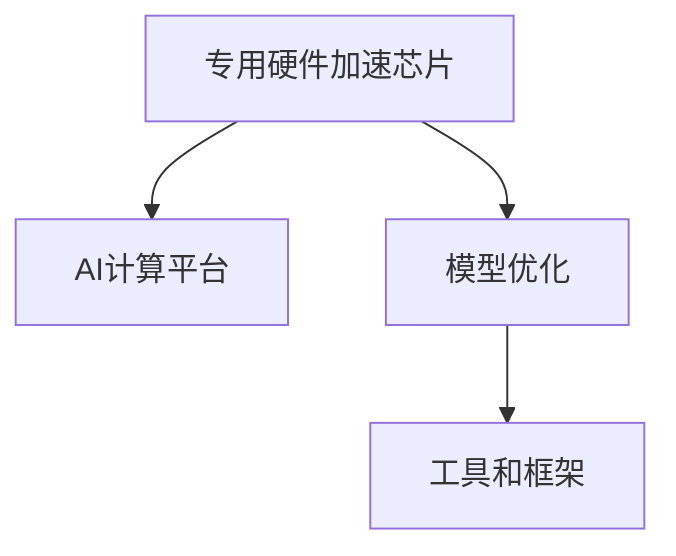

                 

## 1. 背景介绍

随着深度学习技术在人工智能领域的广泛应用，计算资源的需求急剧增长。传统的基于通用CPU和GPU的计算平台，已经难以满足大规模AI模型的计算需求。为应对这一挑战，专用硬件加速芯片（如TPU、FPGA、ASIC等）应运而生。这些芯片在特定任务上拥有更高的计算效率和更低的能耗，成为AI计算的重要硬件支持。

### 1.1 问题由来
现代深度学习模型，尤其是大规模预训练模型（如BERT、GPT），具有数十亿参数量，需要大量的计算资源。传统的通用CPU和GPU虽然可以完成计算任务，但资源利用率较低，能耗和成本较高。相比之下，专用硬件加速芯片具有更高的并行计算能力和更高的能效比，能够显著降低计算成本，加速AI模型的训练和推理过程。

### 1.2 问题核心关键点
1. **专用硬件加速芯片**：TPU、FPGA、ASIC等专用硬件加速芯片，是专为深度学习模型设计的计算平台。这些芯片可以提供高并行度、高精度的计算能力。
2. **AI计算平台**：包括GPU、TPU、ASIC等，能够支持大规模深度学习模型的训练和推理。
3. **模型优化**：针对特定硬件平台，对深度学习模型进行优化，使其能够高效运行。
4. **工具和框架**：TensorFlow、PyTorch等深度学习框架，提供了丰富的模型和芯片优化工具。

### 1.3 问题研究意义
研究专用硬件加速芯片在大模型计算中的应用，对于提升AI计算效率、降低计算成本、推动AI技术在各个行业的应用具有重要意义：

1. **提升计算效率**：专用硬件加速芯片在特定任务上具有更高的计算效率，能够显著加速AI模型的训练和推理过程。
2. **降低计算成本**：专用硬件加速芯片能够提高能效比，降低计算能耗和成本，使AI技术更容易落地应用。
3. **加速AI技术应用**：专用硬件加速芯片可以支持各种AI模型，推动AI技术在医疗、金融、交通、制造等各行业的广泛应用。
4. **提升创新能力**：专用硬件加速芯片提供了更加强大的计算能力，支持更加复杂的深度学习模型和算法，推动AI技术的持续创新。

## 2. 核心概念与联系

### 2.1 核心概念概述

为更好地理解专用硬件加速芯片在大模型计算中的应用，本节将介绍几个密切相关的核心概念：

- **专用硬件加速芯片**：如TPU、FPGA、ASIC等，是专为深度学习模型设计的计算平台，具有高并行度、高精度的计算能力。
- **AI计算平台**：包括GPU、TPU、ASIC等，能够支持大规模深度学习模型的训练和推理。
- **模型优化**：针对特定硬件平台，对深度学习模型进行优化，使其能够高效运行。
- **工具和框架**：如TensorFlow、PyTorch等，提供了丰富的模型和芯片优化工具。

这些概念之间的逻辑关系可以通过以下Mermaid流程图来展示：



这个流程图展示专用硬件加速芯片、AI计算平台、模型优化工具之间的关联：

1. 专用硬件加速芯片是AI计算的核心硬件平台，提供了高并行度的计算能力。
2. AI计算平台支持大规模深度学习模型的训练和推理，是模型优化的基础。
3. 模型优化工具提供了针对特定硬件平台的模型优化方法，以提高模型的运行效率。

这些概念共同构成了专用硬件加速芯片在大模型计算中的应用框架，使得模型能够在特定的硬件平台上高效运行。

## 3. 核心算法原理 & 具体操作步骤

### 3.1 算法原理概述

专用硬件加速芯片在大模型计算中的应用，主要基于深度学习模型的算法原理和优化策略。通过针对特定硬件平台的优化，提升模型的计算效率和能效比。

### 3.2 算法步骤详解

1. **选择合适的硬件平台**：
   - 根据任务需求，选择合适的硬件平台，如TPU、FPGA、ASIC等。
   - 评估不同平台的计算性能、功耗、价格等因素，选择最优的硬件平台。

2. **模型适配和优化**：
   - 将深度学习模型适配到选择的硬件平台。
   - 针对硬件平台的特点，对模型进行优化，如调整网络结构、修改激活函数等。

3. **编写模型代码**：
   - 在选定的深度学习框架上，编写适配硬件平台的模型代码。
   - 使用相应的工具和库，将模型编译为目标硬件平台可执行的代码。

4. **训练和推理**：
   - 使用优化后的模型在硬件平台上进行训练和推理。
   - 实时监测计算性能和能耗，及时调整模型和硬件参数。

### 3.3 算法优缺点

专用硬件加速芯片在大模型计算中的应用，具有以下优点：

1. **高效计算能力**：专用硬件加速芯片在特定任务上具有更高的计算效率，能够显著加速AI模型的训练和推理过程。
2. **低能耗**：专用硬件加速芯片能够提高能效比，降低计算能耗和成本。
3. **高性能**：专用硬件加速芯片提供了高并行度的计算能力，能够支持大规模深度学习模型的训练和推理。

同时，该方法也存在一些缺点：

1. **硬件成本高**：专用硬件加速芯片的成本较高，购买和维护成本较高。
2. **开发复杂**：适配不同硬件平台需要开发和优化模型的过程较复杂。
3. **应用范围有限**：特定硬件平台的应用范围有限，不能支持所有的深度学习模型和任务。

### 3.4 算法应用领域

专用硬件加速芯片在大模型计算中的应用，已经在以下几个领域得到了广泛应用：

- **大规模深度学习模型的训练**：如BERT、GPT等大模型的训练，能够显著提升训练速度和效率。
- **自然语言处理(NLP)**：如语言模型、机器翻译、情感分析等任务的加速计算。
- **计算机视觉**：如图像分类、目标检测、图像生成等任务的加速计算。
- **语音识别**：如语音识别、语音合成等任务的加速计算。
- **医疗健康**：如医学影像分析、基因序列分析等任务的加速计算。

除了上述这些应用领域外，专用硬件加速芯片还将在更多领域得到应用，为AI技术的发展提供更强大的硬件支持。

## 4. 数学模型和公式 & 详细讲解 & 举例说明

### 4.1 数学模型构建

在大模型计算中，深度学习模型通常采用神经网络结构，如卷积神经网络(CNN)、循环神经网络(RNN)、Transformer等。这些模型通过参数的学习，能够自动提取数据的特征，并用于分类、回归、生成等任务。

### 4.2 公式推导过程

以Transformer模型为例，其计算过程包括以下步骤：

1. 自注意力机制(self-attention)：计算模型输入序列中每个位置的向量表示，该表示基于输入序列中所有位置的向量计算得到。
2. 前馈神经网络(Feed-Forward Network, FFN)：将自注意力机制得到的向量表示，经过一层全连接神经网络进行非线性变换。
3. 残差连接(Residual Connection)：将自注意力机制和FFN的输出进行加法运算，得到最终的向量表示。

这些计算过程可以表示为数学公式：

$$
\text{Attention(Q,K,V)} = \text{Softmax}(QK^T)/\sqrt{d_k} \cdot V
$$

$$
\text{FFN}(x) = \text{MLP}(x) = x + \text{GELU}(\text{FFN}(x))
$$

$$
\text{Residual Connection}(x_1, x_2) = \text{x}_1 + \text{x}_2
$$

其中，$d_k$ 为注意力机制的键向量维度，GELU为激活函数，MLP为全连接层。

### 4.3 案例分析与讲解

以BERT模型为例，其在大模型计算中的应用流程如下：

1. **预训练**：使用大规模无标签数据对模型进行预训练，学习通用的语言表示。
2. **微调**：在大规模标注数据上对模型进行微调，适应特定任务。
3. **推理**：在测试数据上对模型进行推理，输出预测结果。

## 5. 项目实践：代码实例和详细解释说明

### 5.1 开发环境搭建

在进行大模型计算的实践前，我们需要准备好开发环境。以下是使用Python进行TensorFlow开发的环境配置流程：

1. 安装Anaconda：从官网下载并安装Anaconda，用于创建独立的Python环境。

2. 创建并激活虚拟环境：
```bash
conda create -n tensorflow-env python=3.8 
conda activate tensorflow-env
```

3. 安装TensorFlow：根据CUDA版本，从官网获取对应的安装命令。例如：
```bash
conda install tensorflow==2.6 -c tensorflow -c conda-forge
```

4. 安装各类工具包：
```bash
pip install numpy pandas scikit-learn matplotlib tqdm jupyter notebook ipython
```

完成上述步骤后，即可在`tensorflow-env`环境中开始大模型计算的实践。

### 5.2 源代码详细实现

下面我们以BERT模型在TPU上进行微调的PyTorch代码实现为例：

首先，定义模型和优化器：

```python
from transformers import BertTokenizer, BertForSequenceClassification
from transformers import Trainer, TrainingArguments
from transformers import TPUStrategy, XLAStrategy
import torch
import tensorflow as tf

tokenizer = BertTokenizer.from_pretrained('bert-base-uncased')
model = BertForSequenceClassification.from_pretrained('bert-base-uncased', num_labels=2)

strategy = TPUStrategy(
    tpu='')
training_args = TrainingArguments(
    output_dir="./results",
    per_device_train_batch_size=32,
    per_device_eval_batch_size=64,
    num_train_epochs=3,
    learning_rate=2e-5,
    weight_decay=0.01,
    logging_steps=1000,
    evaluation_strategy="epoch")

trainer = Trainer(
    model=model,
    args=training_args,
    strategy=strategy,
    train_dataset=train_dataset,
    eval_dataset=test_dataset)
```

然后，进行模型微调：

```python
trainer.train()
trainer.evaluate()
```

以上代码实现了BERT模型在TPU上的微调。通过使用`TPUStrategy`和`Trainer`，可以非常方便地进行模型训练和评估。

### 5.3 代码解读与分析

让我们再详细解读一下关键代码的实现细节：

**BertTokenizer和BertForSequenceClassification**：
- `BertTokenizer`：用于将输入文本转换为模型所需的token ids。
- `BertForSequenceClassification`：用于实现BERT模型的分类任务，其中`num_labels`参数指定分类标签的数量。

**TPUStrategy**：
- `TPUStrategy`：用于指定TPU作为计算平台，并进行相关的参数设置。
- `strategy`参数设置为空字符串，表示使用本地的TPU。

**TrainingArguments**：
- `TrainingArguments`：用于指定训练参数，如输出目录、批次大小、训练轮数、学习率等。

**Trainer**：
- `Trainer`：用于封装模型训练和评估的逻辑，并利用`TPUStrategy`进行分布式训练。
- `trainer.train()`：在TPU上训练模型。
- `trainer.evaluate()`：在测试集上评估模型性能。

### 5.4 运行结果展示

在运行代码后，可以在输出目录中查看训练和评估结果，如训练损失、验证损失、测试损失等指标。

## 6. 实际应用场景

### 6.1 智能推荐系统

智能推荐系统是当前互联网应用的重要组成部分，其核心在于推荐算法的优化和效率提升。在大模型计算的支持下，推荐系统可以实现更加个性化、高效的推荐。

具体而言，可以在用户的浏览历史、点击行为等数据上，训练大规模深度学习模型，实时计算用户的兴趣偏好，从而进行个性化推荐。同时，通过在TPU等专用硬件加速芯片上进行计算，能够显著提升推荐系统的响应速度和计算效率，提升用户体验。

### 6.2 图像识别

图像识别是计算机视觉领域的重要任务之一，广泛应用于医疗、安防、自动驾驶等领域。在大模型计算的支持下，图像识别模型可以处理更复杂、更高效的计算任务。

具体而言，可以在大规模图像数据上，训练深度学习模型，如卷积神经网络、Transformer等，以提升图像识别的准确率和速度。同时，通过在GPU、TPU等专用硬件加速芯片上进行计算，可以显著提高图像识别的处理效率和能效比，推动图像识别技术在更多领域的广泛应用。

### 6.3 自然语言处理

自然语言处理是AI领域的重要分支，广泛应用于机器翻译、情感分析、智能问答等领域。在大模型计算的支持下，NLP模型可以实现更加高效、准确的计算。

具体而言，可以在大规模文本数据上，训练深度学习模型，如BERT、GPT等，以提升自然语言处理的性能。同时，通过在TPU等专用硬件加速芯片上进行计算，可以显著提升NLP模型的计算效率和响应速度，推动NLP技术在更多领域的广泛应用。

### 6.4 未来应用展望

随着深度学习技术的发展，专用硬件加速芯片在大模型计算中的应用将越来越广泛。未来，预计会有更多种类的专用硬件加速芯片，如FPGA、ASIC等，应用于不同的深度学习任务。同时，大模型计算技术也将更加成熟，推动AI技术在各个行业的应用和发展。

## 7. 工具和资源推荐

### 7.1 学习资源推荐

为了帮助开发者掌握大模型计算的理论基础和实践技巧，这里推荐一些优质的学习资源：

1. **《深度学习》课程**：斯坦福大学开设的深度学习课程，讲解深度学习的基础知识和常用模型。
2. **TensorFlow官方文档**：TensorFlow的官方文档，提供丰富的深度学习框架和工具。
3. **Transformers官方文档**：Transformers库的官方文档，介绍多种预训练语言模型和微调方法。
4. **GitHub开源项目**：如HuggingFace的Transformers、OpenAI的GPT系列等，提供丰富的开源资源和代码示例。
5. **在线课程**：如Coursera、Udacity等在线平台上的深度学习和AI课程，提供系统化的学习内容。

### 7.2 开发工具推荐

高效的开发离不开优秀的工具支持。以下是几款用于大模型计算开发的常用工具：

1. **PyTorch**：基于Python的开源深度学习框架，灵活便捷，适合快速迭代研究。
2. **TensorFlow**：由Google主导开发的开源深度学习框架，功能强大，适合大规模工程应用。
3. **TensorBoard**：TensorFlow配套的可视化工具，可以实时监测模型训练状态，并提供丰富的图表呈现方式。
4. **Weights & Biases**：模型训练的实验跟踪工具，可以记录和可视化模型训练过程中的各项指标，方便对比和调优。
5. **Jupyter Notebook**：交互式编程环境，支持Python代码的快速执行和调试。

合理利用这些工具，可以显著提升大模型计算的开发效率，加快创新迭代的步伐。

### 7.3 相关论文推荐

大模型计算技术的发展源于学界的持续研究。以下是几篇奠基性的相关论文，推荐阅读：

1. **《ImageNet Classification with Deep Convolutional Neural Networks》**：AlexNet论文，提出了卷积神经网络架构，开启了计算机视觉领域深度学习应用。
2. **《Bert: Pre-training of Deep Bidirectional Transformers for Language Understanding》**：BERT论文，提出了基于掩码自监督预训练的深度语言模型。
3. **《Google's EfficientNet: Rethinking Model Scaling for Convolutional Neural Networks》**：EfficientNet论文，提出了更高效的网络设计方法，提升了模型的计算效率和性能。
4. **《Large-Scale Transformer Network for Machine Translation》**：Transformer论文，提出了Transformer架构，提升了机器翻译的性能和效率。

这些论文代表了大模型计算技术的发展脉络。通过学习这些前沿成果，可以帮助研究者把握学科前进方向，激发更多的创新灵感。

## 8. 总结：未来发展趋势与挑战

### 8.1 研究成果总结

大模型计算技术在大规模深度学习模型的训练和推理中，已经展现出巨大的潜力和优势。通过在专用硬件加速芯片上进行计算，显著提升了计算效率和能效比，推动了AI技术在各个行业的应用和发展。

### 8.2 未来发展趋势

展望未来，大模型计算技术将呈现以下几个发展趋势：

1. **更高效的硬件平台**：未来将有更多种类的专用硬件加速芯片，如FPGA、ASIC等，应用于不同的深度学习任务。这些芯片将提供更高的计算效率和更低的能耗。
2. **更智能的软件工具**：未来将有更多深度学习框架和工具，支持自动化的模型优化和训练调度，提升大模型计算的效率和灵活性。
3. **更广泛的应用场景**：未来将有更多领域将大模型计算技术应用于AI系统的开发和优化，推动AI技术在各个行业的发展。
4. **更强大的模型能力**：未来将有更多种类的深度学习模型，提升大模型计算的能力和性能。

### 8.3 面临的挑战

尽管大模型计算技术已经取得了显著的进展，但在实际应用中，仍面临一些挑战：

1. **硬件成本高**：专用硬件加速芯片的成本较高，购买和维护成本较高，限制了其大规模应用。
2. **开发复杂**：适配不同硬件平台需要开发和优化模型的过程较复杂，增加了开发难度。
3. **计算资源有限**：大规模深度学习模型需要大量的计算资源，限制了其在一些小规模设备上的应用。
4. **数据质量要求高**：大规模深度学习模型对数据质量的要求较高，数据收集和标注的难度较大。

### 8.4 研究展望

未来，大模型计算技术需要在以下几个方面寻求新的突破：

1. **降低硬件成本**：开发更高效、更经济的专用硬件加速芯片，降低大模型计算的成本和能耗。
2. **简化开发流程**：开发更智能、更灵活的深度学习框架和工具，简化大模型计算的开发和优化过程。
3. **优化计算资源**：开发更高效、更灵活的计算资源调度算法，提升大模型计算的资源利用率。
4. **提升数据质量**：开发更智能的数据收集和标注工具，提升数据质量，降低数据收集和标注的难度。

这些研究方向的探索，必将引领大模型计算技术迈向更高的台阶，为AI技术的发展提供更强大的硬件支持。

## 9. 附录：常见问题与解答

**Q1: 大模型计算与通用计算有何不同？**

A: 大模型计算的主要区别在于其计算任务的特殊性。通用计算通常处理数据量较小、计算复杂度较低的问题，而大模型计算则处理大规模深度学习模型的训练和推理任务，具有更高的计算复杂度和数据量。因此，需要针对专用硬件加速芯片进行优化。

**Q2: 如何选择适合的大模型计算平台？**

A: 选择大模型计算平台需要考虑以下几个因素：
1. 计算需求：根据计算任务的规模和复杂度，选择适合的平台。
2. 能效比：选择能效比高的平台，降低计算成本。
3. 成本：考虑平台的硬件成本和维护成本。
4. 可扩展性：选择可扩展性好的平台，方便未来扩展。

**Q3: 大模型计算的资源需求有哪些？**

A: 大模型计算对资源的需求主要包括：
1. 计算资源：如GPU、TPU、FPGA等专用硬件加速芯片。
2. 存储资源：用于存储大规模深度学习模型的参数和数据。
3. 内存资源：用于存储计算过程中的中间数据。

**Q4: 大模型计算的优化方法有哪些？**

A: 大模型计算的优化方法主要包括：
1. 模型优化：如网络结构优化、激活函数优化等，提升模型性能。
2. 硬件优化：如并行计算优化、资源调度优化等，提升计算效率。
3. 软件优化：如自动微分、自动并行化等，提升计算效率。

**Q5: 大模型计算的未来趋势是什么？**

A: 大模型计算的未来趋势包括：
1. 更高效的硬件平台：未来将有更多种类的专用硬件加速芯片，提升计算效率和能效比。
2. 更智能的软件工具：未来将有更多深度学习框架和工具，支持自动化模型优化和训练调度。
3. 更广泛的应用场景：未来将有更多领域将大模型计算技术应用于AI系统的开发和优化。
4. 更强大的模型能力：未来将有更多种类的深度学习模型，提升大模型计算的能力和性能。

---

作者：禅与计算机程序设计艺术 / Zen and the Art of Computer Programming

