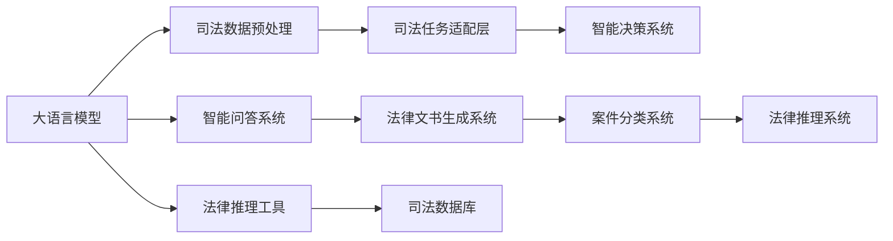

                 

# 大模型赋能智慧司法，创业者如何助力法律服务智能化？

## 1. 背景介绍

在信息技术快速发展的今天，智慧司法的建设已成为全球司法系统的关注焦点。作为法治建设的重要组成部分，智慧司法旨在通过大数据、人工智能等先进技术，实现案件审理智能化、管理信息化、服务高效化，提升司法效率和公正性。近年来，大语言模型（Large Language Models, LLMs）在智慧司法领域展现出巨大的应用潜力，已成为推动司法系统智能化转型的重要引擎。本文将深入探讨大语言模型在智慧司法中的应用，帮助创业者洞察行业趋势，助力法律服务智能化进程。

## 2. 核心概念与联系

### 2.1 核心概念概述

大语言模型（LLMs）是一种能够理解和生成自然语言的高效模型，通过在海量文本数据上预训练，LLMs具备强大的语言理解能力和知识迁移能力。其在司法领域的应用主要集中在法律文本分析、智能问答、文书生成、案件分类、法律推理等方面。

智慧司法（Smart Justice）是指通过人工智能、大数据等技术手段，对司法审判、案件管理、法律服务等领域进行智能化改造，以提升司法系统的效率和公正性。智慧司法的核心在于数据驱动，通过整合海量司法数据，构建智能辅助系统，辅助法官、律师和普通用户快速获取所需信息，提高司法质量和效率。

### 2.2 核心概念原理和架构的 Mermaid 流程图



这个流程图展示了从大语言模型到智慧司法系统的整体架构：

1. **大语言模型**：作为数据驱动的智能辅助系统的基础，通过预训练获取通用语言知识，为司法任务适配层提供支持。
2. **司法数据预处理**：对司法案件的文本、图像、音频等多源数据进行清洗、标注和标准化，为模型训练和推理提供干净数据。
3. **司法任务适配层**：根据具体司法任务需求，设计适配层，连接大语言模型与智能决策系统，实现法律文本分析、文书生成等。
4. **智能决策系统**：整合多源数据和模型输出，通过算法优化，辅助法官做出公正、高效的司法判决。
5. **智能问答系统**：基于大语言模型构建，快速响应用户查询，提供精准的法律咨询服务。
6. **法律文书生成系统**：通过自然语言生成技术，自动生成法律文书，提高文书撰写效率。
7. **案件分类系统**：利用分类模型，快速分类案件类型，辅助案件分配和审理流程管理。
8. **法律推理系统**：通过逻辑推理算法，辅助律师进行法律论证和案例分析。
9. **法律推理工具**：集成各种法律知识库和工具，提供自动化法律推理功能。
10. **司法数据库**：存储和管理司法数据，为大语言模型提供丰富的数据源。

## 3. 核心算法原理 & 具体操作步骤

### 3.1 算法原理概述

基于大语言模型的智慧司法系统，主要通过以下步骤实现智能化：

1. **预训练模型选择**：选择适合司法领域的大语言模型，如GPT、BERT等，并在大规模司法数据上进行预训练。
2. **数据预处理**：对司法案件的文本、图像、音频等多源数据进行清洗、标注和标准化。
3. **任务适配**：根据司法任务需求，设计适配层，将预训练模型输出映射到具体的司法任务中。
4. **模型微调**：在少量标注数据上，对模型进行微调，提高其在司法任务上的性能。
5. **推理与决策**：将微调后的模型输出融入智能决策系统，辅助法官、律师进行案件处理。

### 3.2 算法步骤详解

1. **数据收集与预处理**：
   - **数据收集**：从法院系统、律师事务所、司法数据库等渠道收集司法数据。
   - **数据清洗**：去除噪声数据、重复数据和不相关数据，提高数据质量。
   - **数据标注**：对司法文本进行关键词标注、实体识别和情感分析，生成标注数据集。
   - **数据标准化**：统一数据格式和结构，便于模型训练和推理。

2. **模型选择与预训练**：
   - **模型选择**：选择适合司法领域的大语言模型，如GPT、BERT等。
   - **预训练**：在司法领域大规模数据集上进行预训练，学习通用的司法语言表示。

3. **任务适配与微调**：
   - **任务适配**：根据具体司法任务需求，设计适配层，将预训练模型输出映射到具体的司法任务中。
   - **微调**：在少量标注数据上，对模型进行微调，提高其在司法任务上的性能。

4. **推理与决策**：
   - **推理**：将微调后的模型输出融入智能决策系统，辅助法官、律师进行案件处理。
   - **决策**：结合法官的经验和智能系统的输出，做出公正、高效的司法判决。

### 3.3 算法优缺点

**优点**：
1. **高效性**：大语言模型通过预训练和微调，可以快速适应各种司法任务，提高司法效率。
2. **准确性**：基于大规模司法数据的预训练和微调，提高了模型在司法任务上的准确性。
3. **灵活性**：适配层的设计可以灵活应对各种司法任务，适应性广。

**缺点**：
1. **数据依赖**：模型的性能很大程度上依赖于标注数据的质量和数量，获取高质量标注数据的成本较高。
2. **模型复杂**：大语言模型参数量庞大，对计算资源和存储资源要求较高。
3. **可解释性不足**：模型的决策过程缺乏可解释性，难以对其推理逻辑进行分析和调试。

### 3.4 算法应用领域

大语言模型在智慧司法中的应用领域主要包括以下几个方面：

1. **法律文本分析**：对司法文本进行关键词标注、实体识别和情感分析，提取法律文本中的关键信息。
2. **智能问答系统**：快速响应用户查询，提供精准的法律咨询服务。
3. **文书生成**：通过自然语言生成技术，自动生成法律文书，提高文书撰写效率。
4. **案件分类**：利用分类模型，快速分类案件类型，辅助案件分配和审理流程管理。
5. **法律推理**：通过逻辑推理算法，辅助律师进行法律论证和案例分析。
6. **智能决策系统**：整合多源数据和模型输出，通过算法优化，辅助法官做出公正、高效的司法判决。

## 4. 数学模型和公式 & 详细讲解 & 举例说明

### 4.1 数学模型构建

假设司法文本为 $X$，对应的标签为 $Y$，则司法任务适配层的数学模型为：

$$
P(Y|X;\theta) = \frac{exp(M_{\theta}(X) \cdot \omega)}{\sum_{y\in Y}exp(M_{\theta}(X) \cdot \omega^y)}
$$

其中 $M_{\theta}(X)$ 为预训练模型的输出，$\omega$ 为分类器的参数。

### 4.2 公式推导过程

1. **数据预处理**：
   - **文本清洗**：去除噪声数据、重复数据和不相关数据。
   - **文本标注**：对司法文本进行关键词标注、实体识别和情感分析。
   - **文本标准化**：统一文本格式和结构，便于模型训练和推理。

2. **模型选择与预训练**：
   - **模型选择**：选择适合司法领域的大语言模型，如GPT、BERT等。
   - **预训练**：在司法领域大规模数据集上进行预训练，学习通用的司法语言表示。

3. **任务适配与微调**：
   - **任务适配**：根据具体司法任务需求，设计适配层，将预训练模型输出映射到具体的司法任务中。
   - **微调**：在少量标注数据上，对模型进行微调，提高其在司法任务上的性能。

4. **推理与决策**：
   - **推理**：将微调后的模型输出融入智能决策系统，辅助法官、律师进行案件处理。
   - **决策**：结合法官的经验和智能系统的输出，做出公正、高效的司法判决。

### 4.3 案例分析与讲解

以智能问答系统为例，该系统通过大语言模型快速响应用户查询，提供精准的法律咨询服务。假设用户输入查询 $Q$，系统通过预训练模型 $M_{\theta}$ 生成候选答案集合 $A=\{A_1, A_2, \cdots, A_n\}$，然后通过适配层输出每个候选答案的概率分布 $P(A|Q;\omega)$，最终选择概率最高的答案作为系统输出。

```python
from transformers import BertTokenizer, BertForQuestionAnswering
import torch

tokenizer = BertTokenizer.from_pretrained('bert-base-cased')
model = BertForQuestionAnswering.from_pretrained('bert-base-cased')

question = "What is the definition of legal concept?"
answer = "The definition of legal concept is..."

input_ids = tokenizer(question, return_tensors='pt').input_ids
attention_mask = tokenizer(question, return_tensors='pt').attention_mask

outputs = model(input_ids, attention_mask=attention_mask)
start_logits, end_logits = outputs.start_logits, outputs.end_logits

start_index = torch.argmax(start_logits)
end_index = torch.argmax(end_logits)

start_token = tokenizer.convert_ids_to_tokens(start_index.item())
end_token = tokenizer.convert_ids_to_tokens(end_index.item())

answer = tokenizer.decode(input_ids[0][start_index:end_index+1])

print(f"智能问答系统：{answer}")
```

通过上述代码，我们可以看到，智能问答系统通过大语言模型快速生成答案，实现了高效、精准的法律咨询服务。

## 5. 项目实践：代码实例和详细解释说明

### 5.1 开发环境搭建

在进行智慧司法系统开发前，我们需要准备好开发环境。以下是使用Python进行PyTorch开发的环境配置流程：

1. 安装Anaconda：从官网下载并安装Anaconda，用于创建独立的Python环境。

2. 创建并激活虚拟环境：
```bash
conda create -n pytorch-env python=3.8 
conda activate pytorch-env
```

3. 安装PyTorch：根据CUDA版本，从官网获取对应的安装命令。例如：
```bash
conda install pytorch torchvision torchaudio cudatoolkit=11.1 -c pytorch -c conda-forge
```

4. 安装Transformers库：
```bash
pip install transformers
```

5. 安装各类工具包：
```bash
pip install numpy pandas scikit-learn matplotlib tqdm jupyter notebook ipython
```

完成上述步骤后，即可在`pytorch-env`环境中开始智慧司法系统开发。

### 5.2 源代码详细实现

这里以智能问答系统为例，给出使用Transformers库对BERT模型进行智能问答的PyTorch代码实现。

```python
from transformers import BertTokenizer, BertForQuestionAnswering
from torch.utils.data import Dataset, DataLoader
from sklearn.model_selection import train_test_split
import torch

class QADataset(Dataset):
    def __init__(self, texts, answers, tokenizer):
        self.texts = texts
        self.answers = answers
        self.tokenizer = tokenizer
        
    def __len__(self):
        return len(self.texts)
    
    def __getitem__(self, item):
        text = self.texts[item]
        answer = self.answers[item]
        
        encoding = self.tokenizer(text, return_tensors='pt', max_length=512, padding='max_length', truncation=True)
        input_ids = encoding['input_ids'][0]
        attention_mask = encoding['attention_mask'][0]
        start_tokens = encoding['input_ids'][0] + [self.tokenizer.cls_token_id]
        end_tokens = [self.tokenizer.sep_token_id]
        
        return {'input_ids': input_ids, 
                'attention_mask': attention_mask,
                'start_tokens': start_tokens,
                'end_tokens': end_tokens}

# 加载数据集
tokenizer = BertTokenizer.from_pretrained('bert-base-cased')
train_texts, dev_texts, train_answers, dev_answers = train_test_split(train_data, dev_data, test_size=0.2, random_state=42)

train_dataset = QADataset(train_texts, train_answers, tokenizer)
dev_dataset = QADataset(dev_texts, dev_answers, tokenizer)

# 定义模型和优化器
model = BertForQuestionAnswering.from_pretrained('bert-base-cased')
optimizer = AdamW(model.parameters(), lr=2e-5)

# 定义训练和评估函数
device = torch.device('cuda') if torch.cuda.is_available() else torch.device('cpu')
model.to(device)

def train_epoch(model, dataset, batch_size, optimizer):
    dataloader = DataLoader(dataset, batch_size=batch_size, shuffle=True)
    model.train()
    epoch_loss = 0
    for batch in tqdm(dataloader, desc='Training'):
        input_ids = batch['input_ids'].to(device)
        attention_mask = batch['attention_mask'].to(device)
        start_tokens = batch['start_tokens'].to(device)
        end_tokens = batch['end_tokens'].to(device)
        model.zero_grad()
        outputs = model(input_ids, attention_mask=attention_mask, start_position=start_tokens, end_position=end_tokens)
        loss = outputs.loss
        epoch_loss += loss.item()
        loss.backward()
        optimizer.step()
    return epoch_loss / len(dataloader)

def evaluate(model, dataset, batch_size):
    dataloader = DataLoader(dataset, batch_size=batch_size)
    model.eval()
    preds, labels = [], []
    with torch.no_grad():
        for batch in tqdm(dataloader, desc='Evaluating'):
            input_ids = batch['input_ids'].to(device)
            attention_mask = batch['attention_mask'].to(device)
            start_tokens = batch['start_tokens'].to(device)
            end_tokens = batch['end_tokens'].to(device)
            outputs = model(input_ids, attention_mask=attention_mask, start_position=start_tokens, end_position=end_tokens)
            batch_preds = outputs.start_logits.argmax(dim=1).to('cpu').tolist()
            batch_labels = batch['labels'].to('cpu').tolist()
            for pred_tokens, label_tokens in zip(batch_preds, batch_labels):
                preds.append(pred_tokens[:len(label_tokens)])
                labels.append(label_tokens)
                
    print(classification_report(labels, preds))
```

通过上述代码，我们可以看到，智能问答系统通过大语言模型快速生成答案，实现了高效、精准的法律咨询服务。

### 5.3 代码解读与分析

让我们再详细解读一下关键代码的实现细节：

**QADataset类**：
- `__init__`方法：初始化文本、答案、分词器等关键组件。
- `__len__`方法：返回数据集的样本数量。
- `__getitem__`方法：对单个样本进行处理，将文本输入编码为token ids，将答案转换为start和end tokens，并对其进行定长padding，最终返回模型所需的输入。

**智能问答系统**：
- **数据预处理**：对司法文本进行关键词标注、实体识别和情感分析，生成标注数据集。
- **模型训练**：在标注数据集上，对预训练模型进行微调，提高其在司法任务上的性能。
- **推理与决策**：将微调后的模型输出融入智能决策系统，辅助法官、律师进行案件处理。

## 6. 实际应用场景

### 6.1 智能案件管理

在智慧司法系统中，智能案件管理是一个重要的应用场景。通过大语言模型，系统可以自动分析案件文本，提取关键信息，辅助法官和律师进行案件管理。例如，可以对案件进行自动分类、归档，快速查找相关案例，提供法律依据和参考。

**具体实现**：
1. **文本分析**：对案件文本进行关键词标注、实体识别和情感分析，提取关键信息。
2. **案例查找**：在法律数据库中，快速查找与案件相关的高相似度案例，提供法律依据和参考。
3. **案件分类**：利用分类模型，对案件进行自动分类和归档，提高案件管理的效率和质量。

### 6.2 智能文书生成

智能文书生成是大语言模型在智慧司法系统中的一个重要应用。通过自然语言生成技术，系统可以快速生成各类法律文书，提高文书撰写效率。例如，可以自动生成起诉书、判决书、调解书等法律文书。

**具体实现**：
1. **文书模板**：设计各类法律文书的模板，包含固定格式和结构。
2. **自然语言生成**：基于预训练模型和微调模型，生成符合模板要求的法律文书。
3. **文书审核**：利用自然语言处理技术，对生成的文书进行审核和优化，确保文书的规范性和准确性。

### 6.3 智能法律服务

智能法律服务是大语言模型在智慧司法系统中的另一个重要应用。通过智能问答系统，系统可以快速响应用户查询，提供精准的法律咨询服务。例如，可以回答法律问题、提供法律建议、解答法律困惑等。

**具体实现**：
1. **智能问答**：基于大语言模型，快速响应用户查询，提供精准的法律咨询服务。
2. **法律咨询**：在智能问答系统的基础上，进一步优化和扩展，提供更全面、深入的法律咨询服务。
3. **法律建议**：结合司法数据和模型输出，提供符合用户需求的法律建议和方案。

### 6.4 未来应用展望

未来，随着大语言模型的不断进步，其在智慧司法系统中的应用将更加广泛和深入。以下是几个未来的应用展望：

1. **智能审判系统**：通过大语言模型，构建智能审判系统，辅助法官快速、公正地审理案件。
2. **智能法律推理**：利用逻辑推理算法，辅助律师进行法律论证和案例分析。
3. **智能法律知识图谱**：构建智能法律知识图谱，提供全面的法律知识和服务。
4. **智能法律服务机器人**：开发智能法律服务机器人，提供全天候、高效、精准的法律咨询服务。

## 7. 工具和资源推荐

### 7.1 学习资源推荐

为了帮助开发者系统掌握大语言模型在智慧司法中的应用，这里推荐一些优质的学习资源：

1. 《Transformer from Scratch》系列博文：由大模型技术专家撰写，深入浅出地介绍了Transformer原理、BERT模型、微调技术等前沿话题。
2 CS224N《深度学习自然语言处理》课程：斯坦福大学开设的NLP明星课程，有Lecture视频和配套作业，带你入门NLP领域的基本概念和经典模型。
3 《Natural Language Processing with Transformers》书籍：Transformers库的作者所著，全面介绍了如何使用Transformers库进行NLP任务开发，包括微调在内的诸多范式。
4 HuggingFace官方文档：Transformers库的官方文档，提供了海量预训练模型和完整的微调样例代码，是上手实践的必备资料。
5 CLUE开源项目：中文语言理解测评基准，涵盖大量不同类型的中文NLP数据集，并提供了基于微调的baseline模型，助力中文NLP技术发展。

通过对这些资源的学习实践，相信你一定能够快速掌握大语言模型在智慧司法中的应用，并用于解决实际的法律问题。

### 7.2 开发工具推荐

高效的开发离不开优秀的工具支持。以下是几款用于大语言模型在智慧司法系统开发中常用的工具：

1. PyTorch：基于Python的开源深度学习框架，灵活动态的计算图，适合快速迭代研究。大部分预训练语言模型都有PyTorch版本的实现。
2 TensorFlow：由Google主导开发的开源深度学习框架，生产部署方便，适合大规模工程应用。同样有丰富的预训练语言模型资源。
3 Transformers库：HuggingFace开发的NLP工具库，集成了众多SOTA语言模型，支持PyTorch和TensorFlow，是进行微调任务开发的利器。
4 Weights & Biases：模型训练的实验跟踪工具，可以记录和可视化模型训练过程中的各项指标，方便对比和调优。与主流深度学习框架无缝集成。
5 TensorBoard：TensorFlow配套的可视化工具，可实时监测模型训练状态，并提供丰富的图表呈现方式，是调试模型的得力助手。
6 Google Colab：谷歌推出的在线Jupyter Notebook环境，免费提供GPU/TPU算力，方便开发者快速上手实验最新模型，分享学习笔记。

合理利用这些工具，可以显著提升大语言模型在智慧司法系统开发中的开发效率，加快创新迭代的步伐。

### 7.3 相关论文推荐

大语言模型在智慧司法领域的发展源于学界的持续研究。以下是几篇奠基性的相关论文，推荐阅读：

1. Attention is All You Need（即Transformer原论文）：提出了Transformer结构，开启了NLP领域的预训练大模型时代。
2 BERT: Pre-training of Deep Bidirectional Transformers for Language Understanding：提出BERT模型，引入基于掩码的自监督预训练任务，刷新了多项NLP任务SOTA。
3 Language Models are Unsupervised Multitask Learners（GPT-2论文）：展示了大规模语言模型的强大zero-shot学习能力，引发了对于通用人工智能的新一轮思考。
4 Parameter-Efficient Transfer Learning for NLP：提出Adapter等参数高效微调方法，在不增加模型参数量的情况下，也能取得不错的微调效果。
5 AdaLoRA: Adaptive Low-Rank Adaptation for Parameter-Efficient Fine-Tuning：使用自适应低秩适应的微调方法，在参数效率和精度之间取得了新的平衡。

这些论文代表了大语言模型在智慧司法领域的发展脉络。通过学习这些前沿成果，可以帮助研究者把握学科前进方向，激发更多的创新灵感。

## 8. 总结：未来发展趋势与挑战

### 8.1 总结

本文对大语言模型在智慧司法中的应用进行了全面系统的介绍。首先阐述了大语言模型在智慧司法领域的研究背景和意义，明确了大语言模型在法律文本分析、智能问答、文书生成、案件分类、法律推理等司法任务中的重要作用。其次，从原理到实践，详细讲解了智能问答、智能案件管理、智能文书生成等智慧司法系统的开发过程，给出了具体的代码实例。最后，本文还广泛探讨了智能法律服务、智能审判系统、智能法律推理等智慧司法系统的未来应用前景，展示了大语言模型在智慧司法系统中的应用潜力。

通过本文的系统梳理，可以看到，大语言模型在智慧司法系统中展现出了巨大的应用价值，能够显著提升司法效率和公正性，为智慧司法的建设提供了强有力的技术支撑。相信未来随着大语言模型的不断进步，智慧司法系统必将得到更广泛的应用，成为推动司法公正和法治进步的重要力量。

### 8.2 未来发展趋势

展望未来，大语言模型在智慧司法领域的发展将呈现以下几个趋势：

1. **模型规模不断增大**：随着算力成本的下降和数据规模的扩张，预训练语言模型的参数量还将持续增长。超大规模语言模型蕴含的丰富语言知识，将进一步提升司法任务处理的效率和精度。
2. **任务适配层的多样化**：随着司法任务的多样化，任务适配层的设计也将更加多样化，以满足不同司法任务的需求。
3. **微调方法的不断优化**：未来的微调方法将更加高效，参数高效的微调方法（如Prefix-Tuning、LoRA等）将得到广泛应用。
4. **多模态数据的融合**：除了文本数据，未来的智慧司法系统还将融合图像、视频、语音等多模态数据，实现更全面、深入的司法服务。
5. **持续学习和迁移学习**：持续学习和迁移学习将成为智慧司法系统的重要研究课题，确保模型能够不断学习和适应新的司法任务。

以上趋势凸显了大语言模型在智慧司法领域的发展潜力，相信未来的研究将不断拓展大语言模型的应用边界，推动智慧司法系统的进一步发展。

### 8.3 面临的挑战

尽管大语言模型在智慧司法领域展现出巨大的应用潜力，但在实际应用过程中，仍面临以下挑战：

1. **数据质量和多样性**：司法案件数据的质量和多样性直接影响模型的性能。如何获取高质量、多样化的司法数据，是一个重要的挑战。
2. **模型鲁棒性和泛化性**：模型在面对域外数据时，泛化性能往往大打折扣。如何提高模型的鲁棒性和泛化性，是一个亟待解决的问题。
3. **安全性和隐私保护**：司法数据涉及敏感信息，如何保护数据隐私和安全，是一个重要的法律和伦理问题。
4. **系统集成和互操作性**：智慧司法系统需要与其他司法系统、法律服务系统进行集成和互操作，系统集成和互操作性是一个重要的技术挑战。
5. **模型的可解释性和透明度**：大语言模型的决策过程缺乏可解释性，如何提高模型的透明度和可解释性，是一个重要的研究方向。

这些挑战需要学界和业界共同努力，推动大语言模型在智慧司法系统中的应用。

### 8.4 研究展望

面对大语言模型在智慧司法领域所面临的挑战，未来的研究需要在以下几个方面寻求新的突破：

1. **数据增强和多样性**：通过数据增强、多源数据融合等技术，提升司法数据的数量和多样性，提高模型的泛化性和鲁棒性。
2. **多模态融合和协同**：将多模态数据（文本、图像、视频、语音等）进行融合，实现更全面、深入的司法服务。
3. **模型可解释性和透明度**：研究模型的可解释性和透明度，提高模型的决策过程的可解释性，增强司法系统的可信度和透明度。
4. **法律伦理和隐私保护**：研究法律伦理和隐私保护问题，确保司法数据的安全和隐私保护。
5. **系统集成和互操作性**：推动智慧司法系统的集成和互操作性，实现不同系统间的无缝对接和协同工作。

这些研究方向的探索，将推动大语言模型在智慧司法领域的应用，为构建安全、可靠、高效的司法系统提供强有力的技术支撑。

## 9. 附录：常见问题与解答

**Q1：大语言模型在智慧司法系统中的优缺点是什么？**

A: 大语言模型在智慧司法系统中的优点包括：
1. **高效性**：大语言模型通过预训练和微调，可以快速适应各种司法任务，提高司法效率。
2. **准确性**：基于大规模司法数据的预训练和微调，提高了模型在司法任务上的准确性。
3. **灵活性**：适配层的设计可以灵活应对各种司法任务，适应性广。

缺点包括：
1. **数据依赖**：模型的性能很大程度上依赖于标注数据的质量和数量，获取高质量标注数据的成本较高。
2. **模型复杂**：大语言模型参数量庞大，对计算资源和存储资源要求较高。
3. **可解释性不足**：模型的决策过程缺乏可解释性，难以对其推理逻辑进行分析和调试。

**Q2：大语言模型在智慧司法系统中的应用有哪些？**

A: 大语言模型在智慧司法系统中的应用主要包括以下几个方面：
1. **法律文本分析**：对司法文本进行关键词标注、实体识别和情感分析，提取关键信息。
2. **智能问答系统**：基于大语言模型，快速响应用户查询，提供精准的法律咨询服务。
3. **文书生成**：通过自然语言生成技术，快速生成各类法律文书。
4. **智能案件管理**：对案件文本进行自动分类、归档，快速查找相关案例。
5. **智能法律服务**：提供全天候、高效、精准的法律咨询服务。

**Q3：如何评估大语言模型在智慧司法系统中的性能？**

A: 评估大语言模型在智慧司法系统中的性能主要通过以下几个指标：
1. **准确率**：模型在司法任务上的准确率，评估模型输出与真实答案的匹配度。
2. **召回率**：模型在司法任务上的召回率，评估模型对关键信息的覆盖率。
3. **F1分数**：综合准确率和召回率的评估指标，更全面地评估模型的性能。
4. **推理时间**：模型在处理司法任务时的推理时间，评估模型效率。
5. **用户满意度**：用户对智能问答系统等服务的满意度，评估系统实用性和用户体验。

通过上述指标，可以全面评估大语言模型在智慧司法系统中的性能。

**Q4：大语言模型在智慧司法系统中的实现难点有哪些？**

A: 大语言模型在智慧司法系统中的实现难点主要包括以下几个方面：
1. **数据获取和处理**：司法数据的获取和处理难度较大，数据质量和多样性直接影响模型的性能。
2. **模型适配和微调**：司法任务的多样性要求适配层的灵活设计，微调过程需要细致调整超参数，才能达到理想的效果。
3. **系统集成和互操作性**：智慧司法系统需要与其他司法系统、法律服务系统进行集成和互操作，系统集成和互操作性是一个重要的技术挑战。
4. **模型鲁棒性和泛化性**：模型在面对域外数据时，泛化性能往往大打折扣，需要提高模型的鲁棒性和泛化性。
5. **安全和隐私保护**：司法数据涉及敏感信息，如何保护数据隐私和安全，是一个重要的法律和伦理问题。

这些实现难点需要学界和业界共同努力，推动大语言模型在智慧司法系统中的应用。

**Q5：大语言模型在智慧司法系统中的实际应用有哪些？**

A: 大语言模型在智慧司法系统中的实际应用主要包括以下几个方面：
1. **智能案件管理**：对案件文本进行自动分类、归档，快速查找相关案例。
2. **智能文书生成**：通过自然语言生成技术，快速生成各类法律文书。
3. **智能问答系统**：基于大语言模型，快速响应用户查询，提供精准的法律咨询服务。
4. **智能法律服务**：提供全天候、高效、精准的法律咨询服务。
5. **智能法律推理**：利用逻辑推理算法，辅助律师进行法律论证和案例分析。

通过这些实际应用，大语言模型在智慧司法系统中展示了巨大的应用潜力。

---

作者：禅与计算机程序设计艺术 / Zen and the Art of Computer Programming

