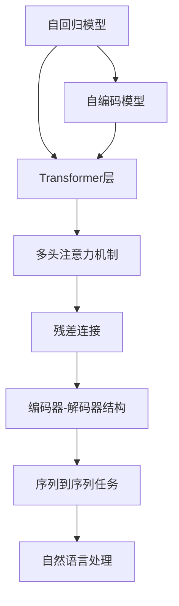

                 

# 大规模语言模型从理论到实践 编码器和解码器结构

> 关键词：大规模语言模型,自回归模型,自编码模型,Transformer,编码器,解码器,Transformer层,多头注意力机制

## 1. 背景介绍

### 1.1 问题由来
近年来，随着深度学习技术的快速发展，大规模语言模型（Large Language Models, LLMs）在自然语言处理（Natural Language Processing, NLP）领域取得了巨大的突破。这些模型通过在海量无标签文本数据上进行预训练，学习到了丰富的语言知识和常识，具备强大的语言理解和生成能力。

然而，由于预训练语料的广泛性和泛化能力的不足，这些通用的大语言模型在特定领域应用时，效果往往难以达到实际应用的要求。因此，如何针对特定任务进行大模型微调，提升模型性能，成为了当前大语言模型研究和应用的一个热点问题。本文聚焦于大语言模型的结构和理论基础，特别是编码器和解码器的设计，帮助读者理解大语言模型的工作原理和优化方向。

### 1.2 问题核心关键点
目前，大语言模型的主要结构包括自回归模型和自编码模型。自回归模型如GPT系列，通过生成先前的文本预测后续文本；自编码模型如BERT，通过预测掩码后的文本恢复完整文本。这些模型通过多层Transformer层实现，具有高效处理长文本、并行计算能力强等特点。

Transformer层是构成大语言模型的核心组件，具有多头注意力机制和残差连接，能够同时捕捉文本中的全局和局部信息。通过优化Transformer层的结构和参数，可以有效提升模型的语言理解和生成能力。

## 2. 核心概念与联系

### 2.1 核心概念概述

为更好地理解大语言模型的结构和理论基础，本节将介绍几个密切相关的核心概念：

- 自回归模型（Auto-Regressive Model）：指在生成文本时，模型先预测文本的下一个词或下一个字符，再根据这个预测结果预测下一个词或字符，如此迭代生成整个文本。代表模型有GPT、XLNet等。
- 自编码模型（Auto-Encoder Model）：指在预测时，模型先随机掩码部分文本，再通过预测未掩码部分文本来恢复原始文本。代表模型有BERT、ELECTRA等。
- Transformer层：是构成大语言模型的基本模块，具有多头注意力机制和残差连接，能够高效处理长序列数据。
- 多头注意力机制（Multi-Head Attention）：指模型同时关注不同位置的信息，通过多头矩阵分解来捕捉不同方面的信息。
- 残差连接（Residual Connection）：指模型在每个层中保留原始输入，通过加和的方式实现残差连接，帮助梯度更有效地传递。
- 编码器-解码器结构（Encoder-Decoder Architecture）：指模型将输入编码成隐层表示，再通过解码器生成输出文本的结构，用于序列到序列的任务，如翻译、摘要等。

这些核心概念之间的逻辑关系可以通过以下Mermaid流程图来展示：



这个流程图展示了大语言模型的核心概念及其之间的关系：

1. 自回归模型和自编码模型均由Transformer层构成。
2. Transformer层通过多头注意力机制和残差连接，能够高效处理长文本。
3. 多头注意力机制使模型同时关注不同位置的信息，捕捉复杂语义。
4. 残差连接帮助梯度传递，提升模型训练效果。
5. 编码器-解码器结构用于序列到序列的任务，如翻译、摘要等。

这些概念共同构成了大语言模型的学习框架，使其能够在各种场景下发挥强大的语言理解和生成能力。通过理解这些核心概念，我们可以更好地把握大语言模型的工作原理和优化方向。

## 3. 核心算法原理 & 具体操作步骤
### 3.1 算法原理概述

大语言模型的核心算法原理主要围绕Transformer层的设计展开。Transformer层通过多头注意力机制和残差连接，实现了高效且强大的语言表示能力。

Transformer层包括编码器和解码器两部分，分别用于输入序列的编码和输出序列的生成。在编码器中，每个位置的信息可以通过多头注意力机制与所有其他位置的信息进行交互，形成全局视角；在解码器中，每个位置的信息可以依据前一个位置的信息进行预测，形成自回归视角。

自回归模型和自编码模型的主要区别在于生成文本的顺序不同，但都依赖于Transformer层的结构。在自回归模型中，模型先预测下一个词，再根据这个预测结果预测下一个词，如此迭代生成整个文本；在自编码模型中，模型先随机掩码部分文本，再通过预测未掩码部分文本来恢复原始文本。

### 3.2 算法步骤详解

大语言模型的训练主要分为预训练和微调两个阶段：

**Step 1: 准备预训练数据**
- 收集大规模无标签文本数据，作为预训练语料。
- 使用自监督学习任务，如语言建模、掩码语言建模等，训练模型。

**Step 2: 定义模型结构**
- 选择自回归模型或自编码模型，确定编码器和解码器的结构。
- 定义Transformer层的结构，包括多头注意力机制和残差连接。
- 设计任务适配层，用于特定任务的处理。

**Step 3: 设置训练参数**
- 选择合适的优化器及其参数，如Adam、SGD等，设置学习率、批大小、迭代轮数等。
- 设置正则化技术及强度，包括权重衰减、Dropout等。
- 确定冻结预训练参数的策略，如仅微调顶层，或全部参数都参与微调。

**Step 4: 执行预训练**
- 使用预训练数据集，将模型输入序列作为输入，输出序列作为标签。
- 前向传播计算预测输出，反向传播计算梯度，优化模型参数。
- 周期性在验证集上评估模型性能，根据性能指标决定是否触发Early Stopping。
- 重复上述步骤直至模型收敛。

**Step 5: 微调特定任务**
- 收集目标任务的少量标注数据，作为微调数据集。
- 冻结预训练参数，只微调任务适配层。
- 使用微调数据集，执行有监督学习优化模型性能。
- 周期性在验证集上评估模型性能，根据性能指标决定是否触发Early Stopping。
- 重复上述步骤直至满足预设的迭代轮数或Early Stopping条件。

### 3.3 算法优缺点

大语言模型的算法具有以下优点：
1. 高效处理长文本：Transformer层的多头注意力机制能够同时捕捉文本中的全局和局部信息，处理长文本时效率更高。
2. 并行计算能力强：Transformer层的并行计算结构使得模型在大规模数据集上的训练速度更快。
3. 可扩展性强：大语言模型可以通过增加层数和参数量来扩展模型规模，提升性能。
4. 强大的语言表示能力：通过预训练和微调，大语言模型能够学习到丰富的语言知识和常识，具备强大的语言理解和生成能力。

同时，该算法也存在一定的局限性：
1. 数据依赖性强：预训练和微调都需要大规模无标签或少量标注数据，数据获取成本高。
2. 模型复杂度高：大语言模型的参数量巨大，训练和推理需要高性能硬件支持。
3. 训练时间较长：模型规模越大，训练时间越长，需要更多的计算资源。
4. 内存占用高：大语言模型的存储和计算过程需要大量内存，存在内存瓶颈。

尽管存在这些局限性，但就目前而言，基于Transformer的大语言模型仍是大规模语言处理任务的主流范式。未来相关研究的重点在于如何进一步优化模型结构和算法，降低资源消耗，提高模型的泛化能力和可解释性。

### 3.4 算法应用领域

基于Transformer的大语言模型已经在多个NLP领域得到了广泛应用，例如：

- 文本分类：如情感分析、主题分类、意图识别等。
- 命名实体识别：识别文本中的人名、地名、机构名等特定实体。
- 关系抽取：从文本中抽取实体之间的语义关系。
- 问答系统：对自然语言问题给出答案。
- 机器翻译：将源语言文本翻译成目标语言。
- 文本摘要：将长文本压缩成简短摘要。
- 对话系统：使机器能够与人自然对话。

除了上述这些经典任务外，大语言模型也被创新性地应用到更多场景中，如可控文本生成、常识推理、代码生成、数据增强等，为NLP技术带来了全新的突破。随着预训练模型和微调方法的不断进步，相信NLP技术将在更广阔的应用领域大放异彩。

## 4. 数学模型和公式 & 详细讲解
### 4.1 数学模型构建

大语言模型的数学模型主要由Transformer层的结构定义组成。

记编码器-解码器结构的大语言模型为 $M_{\theta}(x, y)$，其中 $x$ 为输入序列，$y$ 为输出序列，$\theta$ 为模型参数。模型结构如下：

$$
M_{\theta}(x, y) = (\text{Encoder}(x) + \text{Decoder}(\text{Encoder}(x))) + \text{Task Adapter}(\text{Decoder}(\text{Encoder}(x)))
$$

其中，$\text{Encoder}$ 和 $\text{Decoder}$ 分别代表编码器和解码器，$\text{Task Adapter}$ 代表任务适配层，用于特定任务的处理。

编码器和解码器的结构如下：

$$
\text{Encoder}(x) = \text{Encoder Layer}_n(\text{Encoder Layer}_{n-1}(... \text{Encoder Layer}_2(\text{Encoder Layer}_1(x))) )
$$

$$
\text{Decoder}(y) = \text{Decoder Layer}_n(\text{Decoder Layer}_{n-1}(... \text{Decoder Layer}_2(\text{Decoder Layer}_1(y))) )
$$

其中，$\text{Encoder Layer}_i$ 和 $\text{Decoder Layer}_i$ 代表第 $i$ 个Transformer层，$n$ 为Transformer层的数量。

Transformer层的结构如下：

$$
\text{Transformer Layer} = \text{Multi-Head Self-Attention}(\text{Feed-Forward Network})
$$

$$
\text{Multi-Head Self-Attention}(Q, K, V) = \text{Concat}(\text{Attention Heads})\text{Softmax}(\text{Attention Scores})V
$$

其中，$Q, K, V$ 分别代表多头注意力机制的查询、键、值向量，$\text{Attention Heads}$ 代表多头矩阵分解，$\text{Softmax}$ 代表注意力权重计算，$\text{Feed-Forward Network}$ 代表前馈神经网络。

### 4.2 公式推导过程

以下我们以自回归模型为例，推导Transformer层的数学模型及其推导过程。

假设编码器-解码器结构的大语言模型为 $M_{\theta}(x, y)$，其中 $x$ 为输入序列，$y$ 为输出序列，$\theta$ 为模型参数。模型的输入序列 $x = \{x_1, x_2, ..., x_T\}$，输出序列 $y = \{y_1, y_2, ..., y_{T'}\}$，其中 $T$ 为输入序列长度，$T'$ 为输出序列长度。

假设Transformer层的数量为 $n$，每个Transformer层的结构如下：

$$
\text{Encoder Layer}_i = (\text{Multi-Head Self-Attention}(Q^{(i)}, K^{(i)}, V^{(i)}) + \text{Residual Connection})(\text{Feed-Forward Network})
$$

其中，$Q^{(i)}, K^{(i)}, V^{(i)}$ 分别代表第 $i$ 个Transformer层的查询、键、值向量。

整个编码器的计算过程如下：

$$
\text{Encoder}(x) = \text{Encoder Layer}_1(\text{Encoder Layer}_0(x)) + \text{Residual Connection}
$$

$$
\text{Encoder Layer}_i = (\text{Multi-Head Self-Attention}(Q^{(i-1)}, K^{(i-1)}, V^{(i-1)}) + \text{Residual Connection})(\text{Feed-Forward Network})
$$

其中，$\text{Encoder Layer}_0$ 代表输入序列的编码。

整个解码器的计算过程如下：

$$
\text{Decoder}(y) = \text{Decoder Layer}_1(\text{Decoder Layer}_0(y)) + \text{Residual Connection}
$$

$$
\text{Decoder Layer}_i = (\text{Multi-Head Self-Attention}(Q^{(i-1)}, K^{(i-1)}, V^{(i-1)}) + \text{Residual Connection})(\text{Feed-Forward Network})
$$

其中，$\text{Decoder Layer}_0$ 代表输出序列的解码。

任务适配层的计算过程如下：

$$
\text{Task Adapter}(\text{Decoder}(\text{Encoder}(x))) = (\text{Linear Layer})(\text{Softmax Layer})(\text{Output Layer})
$$

其中，$\text{Linear Layer}$ 代表线性变换，$\text{Softmax Layer}$ 代表概率计算，$\text{Output Layer}$ 代表特定任务的输出。

整个模型的计算过程如下：

$$
M_{\theta}(x, y) = (\text{Encoder}(x) + \text{Decoder}(\text{Encoder}(x))) + \text{Task Adapter}(\text{Decoder}(\text{Encoder}(x)))
$$

$$
\text{Encoder}(x) = \text{Encoder Layer}_n(\text{Encoder Layer}_{n-1}(... \text{Encoder Layer}_2(\text{Encoder Layer}_1(x))) )
$$

$$
\text{Decoder}(y) = \text{Decoder Layer}_n(\text{Decoder Layer}_{n-1}(... \text{Decoder Layer}_2(\text{Decoder Layer}_1(y))) )
$$

$$
\text{Task Adapter}(\text{Decoder}(\text{Encoder}(x))) = (\text{Linear Layer})(\text{Softmax Layer})(\text{Output Layer})
$$

以上推导展示了大语言模型的数学模型及其结构，有助于读者理解模型的工作原理。

## 5. 项目实践：代码实例和详细解释说明
### 5.1 开发环境搭建

在进行大语言模型实践前，我们需要准备好开发环境。以下是使用Python进行PyTorch开发的环境配置流程：

1. 安装Anaconda：从官网下载并安装Anaconda，用于创建独立的Python环境。

2. 创建并激活虚拟环境：
```bash
conda create -n pytorch-env python=3.8 
conda activate pytorch-env
```

3. 安装PyTorch：根据CUDA版本，从官网获取对应的安装命令。例如：
```bash
conda install pytorch torchvision torchaudio cudatoolkit=11.1 -c pytorch -c conda-forge
```

4. 安装Transformers库：
```bash
pip install transformers
```

5. 安装各类工具包：
```bash
pip install numpy pandas scikit-learn matplotlib tqdm jupyter notebook ipython
```

完成上述步骤后，即可在`pytorch-env`环境中开始大语言模型实践。

### 5.2 源代码详细实现

这里我们以使用GPT-2模型进行文本生成的例子来说明大语言模型的实现。

首先，定义文本生成任务的数据处理函数：

```python
from transformers import GPT2Tokenizer
from torch.utils.data import Dataset
import torch

class TextGenerationDataset(Dataset):
    def __init__(self, texts, tokenizer, max_len=512):
        self.texts = texts
        self.tokenizer = tokenizer
        self.max_len = max_len
        
    def __len__(self):
        return len(self.texts)
    
    def __getitem__(self, item):
        text = self.texts[item]
        
        encoding = self.tokenizer(text, return_tensors='pt', max_length=self.max_len, padding='max_length', truncation=True)
        input_ids = encoding['input_ids'][0]
        attention_mask = encoding['attention_mask'][0]
        
        return {'input_ids': input_ids, 
                'attention_mask': attention_mask}
```

然后，定义模型和优化器：

```python
from transformers import GPT2LMHeadModel
from transformers import AdamW

model = GPT2LMHeadModel.from_pretrained('gpt2')
optimizer = AdamW(model.parameters(), lr=2e-5)
```

接着，定义训练和评估函数：

```python
from torch.utils.data import DataLoader
from tqdm import tqdm
from sklearn.metrics import perplexity_score

device = torch.device('cuda') if torch.cuda.is_available() else torch.device('cpu')
model.to(device)

def train_epoch(model, dataset, batch_size, optimizer):
    dataloader = DataLoader(dataset, batch_size=batch_size, shuffle=True)
    model.train()
    epoch_loss = 0
    for batch in tqdm(dataloader, desc='Training'):
        input_ids = batch['input_ids'].to(device)
        attention_mask = batch['attention_mask'].to(device)
        model.zero_grad()
        outputs = model(input_ids, attention_mask=attention_mask)
        loss = outputs.loss
        epoch_loss += loss.item()
        loss.backward()
        optimizer.step()
    return epoch_loss / len(dataloader)

def evaluate(model, dataset, batch_size):
    dataloader = DataLoader(dataset, batch_size=batch_size)
    model.eval()
    epoch_loss = 0
    for batch in tqdm(dataloader, desc='Evaluating'):
        input_ids = batch['input_ids'].to(device)
        attention_mask = batch['attention_mask'].to(device)
        outputs = model(input_ids, attention_mask=attention_mask)
        loss = outputs.loss
        epoch_loss += loss.item()
        
    print('Evaluation perplexity:', perplexity_score(dataset, outputs.logits))
```

最后，启动训练流程并在测试集上评估：

```python
epochs = 5
batch_size = 16

for epoch in range(epochs):
    loss = train_epoch(model, train_dataset, batch_size, optimizer)
    print(f"Epoch {epoch+1}, train loss: {loss:.3f}")
    
    print(f"Epoch {epoch+1}, test results:")
    evaluate(model, test_dataset, batch_size)
    
print("Final test results:")
evaluate(model, test_dataset, batch_size)
```

以上就是使用PyTorch对GPT-2进行文本生成任务的大语言模型实践代码。可以看到，得益于Transformers库的强大封装，我们可以用相对简洁的代码完成GPT-2模型的加载和训练。

### 5.3 代码解读与分析

让我们再详细解读一下关键代码的实现细节：

**TextGenerationDataset类**：
- `__init__`方法：初始化文本数据、分词器等关键组件。
- `__len__`方法：返回数据集的样本数量。
- `__getitem__`方法：对单个样本进行处理，将文本输入编码为token ids，进行定长padding。

**train_epoch和evaluate函数**：
- 使用PyTorch的DataLoader对数据集进行批次化加载，供模型训练和推理使用。
- 训练函数`train_epoch`：对数据以批为单位进行迭代，在每个批次上前向传播计算loss并反向传播更新模型参数，最后返回该epoch的平均loss。
- 评估函数`evaluate`：与训练类似，不同点在于不更新模型参数，并在每个batch结束后将预测结果存储下来，最后使用sklearn的perplexity_score对整个评估集的预测结果进行打印输出。

**训练流程**：
- 定义总的epoch数和batch size，开始循环迭代
- 每个epoch内，先在训练集上训练，输出平均loss
- 在测试集上评估，输出perplexity_score
- 所有epoch结束后，在测试集上评估，给出最终测试结果

可以看到，PyTorch配合Transformers库使得GPT-2模型的训练和评估代码实现变得简洁高效。开发者可以将更多精力放在数据处理、模型改进等高层逻辑上，而不必过多关注底层的实现细节。

当然，工业级的系统实现还需考虑更多因素，如模型的保存和部署、超参数的自动搜索、更灵活的任务适配层等。但核心的Transformer层结构及其训练过程，基本与此类似。

## 6. 实际应用场景
### 6.1 智能客服系统

基于大语言模型微调的对话技术，可以广泛应用于智能客服系统的构建。传统客服往往需要配备大量人力，高峰期响应缓慢，且一致性和专业性难以保证。而使用微调后的对话模型，可以7x24小时不间断服务，快速响应客户咨询，用自然流畅的语言解答各类常见问题。

在技术实现上，可以收集企业内部的历史客服对话记录，将问题和最佳答复构建成监督数据，在此基础上对预训练对话模型进行微调。微调后的对话模型能够自动理解用户意图，匹配最合适的答案模板进行回复。对于客户提出的新问题，还可以接入检索系统实时搜索相关内容，动态组织生成回答。如此构建的智能客服系统，能大幅提升客户咨询体验和问题解决效率。

### 6.2 金融舆情监测

金融机构需要实时监测市场舆论动向，以便及时应对负面信息传播，规避金融风险。传统的人工监测方式成本高、效率低，难以应对网络时代海量信息爆发的挑战。基于大语言模型微调的文本分类和情感分析技术，为金融舆情监测提供了新的解决方案。

具体而言，可以收集金融领域相关的新闻、报道、评论等文本数据，并对其进行主题标注和情感标注。在此基础上对预训练语言模型进行微调，使其能够自动判断文本属于何种主题，情感倾向是正面、中性还是负面。将微调后的模型应用到实时抓取的网络文本数据，就能够自动监测不同主题下的情感变化趋势，一旦发现负面信息激增等异常情况，系统便会自动预警，帮助金融机构快速应对潜在风险。

### 6.3 个性化推荐系统

当前的推荐系统往往只依赖用户的历史行为数据进行物品推荐，无法深入理解用户的真实兴趣偏好。基于大语言模型微调技术，个性化推荐系统可以更好地挖掘用户行为背后的语义信息，从而提供更精准、多样的推荐内容。

在实践中，可以收集用户浏览、点击、评论、分享等行为数据，提取和用户交互的物品标题、描述、标签等文本内容。将文本内容作为模型输入，用户的后续行为（如是否点击、购买等）作为监督信号，在此基础上微调预训练语言模型。微调后的模型能够从文本内容中准确把握用户的兴趣点。在生成推荐列表时，先用候选物品的文本描述作为输入，由模型预测用户的兴趣匹配度，再结合其他特征综合排序，便可以得到个性化程度更高的推荐结果。

### 6.4 未来应用展望

随着大语言模型和微调方法的不断发展，基于微调范式将在更多领域得到应用，为传统行业带来变革性影响。

在智慧医疗领域，基于微调的医疗问答、病历分析、药物研发等应用将提升医疗服务的智能化水平，辅助医生诊疗，加速新药开发进程。

在智能教育领域，微调技术可应用于作业批改、学情分析、知识推荐等方面，因材施教，促进教育公平，提高教学质量。

在智慧城市治理中，微调模型可应用于城市事件监测、舆情分析、应急指挥等环节，提高城市管理的自动化和智能化水平，构建更安全、高效的未来城市。

此外，在企业生产、社会治理、文娱传媒等众多领域，基于大模型微调的人工智能应用也将不断涌现，为经济社会发展注入新的动力。相信随着技术的日益成熟，微调方法将成为人工智能落地应用的重要范式，推动人工智能技术在垂直行业的规模化落地。

## 7. 工具和资源推荐
### 7.1 学习资源推荐

为了帮助开发者系统掌握大语言模型微调的理论基础和实践技巧，这里推荐一些优质的学习资源：

1. 《Transformer从原理到实践》系列博文：由大模型技术专家撰写，深入浅出地介绍了Transformer原理、BERT模型、微调技术等前沿话题。

2. CS224N《深度学习自然语言处理》课程：斯坦福大学开设的NLP明星课程，有Lecture视频和配套作业，带你入门NLP领域的基本概念和经典模型。

3. 《Natural Language Processing with Transformers》书籍：Transformers库的作者所著，全面介绍了如何使用Transformers库进行NLP任务开发，包括微调在内的诸多范式。

4. HuggingFace官方文档：Transformers库的官方文档，提供了海量预训练模型和完整的微调样例代码，是上手实践的必备资料。

5. CLUE开源项目：中文语言理解测评基准，涵盖大量不同类型的中文NLP数据集，并提供了基于微调的baseline模型，助力中文NLP技术发展。

通过对这些资源的学习实践，相信你一定能够快速掌握大语言模型微调的精髓，并用于解决实际的NLP问题。
###  7.2 开发工具推荐

高效的开发离不开优秀的工具支持。以下是几款用于大语言模型微调开发的常用工具：

1. PyTorch：基于Python的开源深度学习框架，灵活动态的计算图，适合快速迭代研究。大部分预训练语言模型都有PyTorch版本的实现。

2. TensorFlow：由Google主导开发的开源深度学习框架，生产部署方便，适合大规模工程应用。同样有丰富的预训练语言模型资源。

3. Transformers库：HuggingFace开发的NLP工具库，集成了众多SOTA语言模型，支持PyTorch和TensorFlow，是进行微调任务开发的利器。

4. Weights & Biases：模型训练的实验跟踪工具，可以记录和可视化模型训练过程中的各项指标，方便对比和调优。与主流深度学习框架无缝集成。

5. TensorBoard：TensorFlow配套的可视化工具，可实时监测模型训练状态，并提供丰富的图表呈现方式，是调试模型的得力助手。

6. Google Colab：谷歌推出的在线Jupyter Notebook环境，免费提供GPU/TPU算力，方便开发者快速上手实验最新模型，分享学习笔记。

合理利用这些工具，可以显著提升大语言模型微调任务的开发效率，加快创新迭代的步伐。

### 7.3 相关论文推荐

大语言模型和微调技术的发展源于学界的持续研究。以下是几篇奠基性的相关论文，推荐阅读：

1. Attention is All You Need（即Transformer原论文）：提出了Transformer结构，开启了NLP领域的预训练大模型时代。

2. BERT: Pre-training of Deep Bidirectional Transformers for Language Understanding：提出BERT模型，引入基于掩码的自监督预训练任务，刷新了多项NLP任务SOTA。

3. Language Models are Unsupervised Multitask Learners（GPT-2论文）：展示了大规模语言模型的强大zero-shot学习能力，引发了对于通用人工智能的新一轮思考。

4. Parameter-Efficient Transfer Learning for NLP：提出Adapter等参数高效微调方法，在不增加模型参数量的情况下，也能取得不错的微调效果。

5. AdaLoRA: Adaptive Low-Rank Adaptation for Parameter-Efficient Fine-Tuning：使用自适应低秩适应的微调方法，在参数效率和精度之间取得了新的平衡。

这些论文代表了大语言模型微调技术的发展脉络。通过学习这些前沿成果，可以帮助研究者把握学科前进方向，激发更多的创新灵感。

## 8. 总结：未来发展趋势与挑战

### 8.1 总结

本文对基于Transformer层的大语言模型的结构和理论基础进行了全面系统的介绍。首先阐述了大语言模型和微调技术的研究背景和意义，明确了微调在拓展预训练模型应用、提升下游任务性能方面的独特价值。其次，从原理到实践，详细讲解了Transformer层的数学模型和计算过程，给出了微调任务开发的完整代码实例。同时，本文还广泛探讨了微调方法在智能客服、金融舆情、个性化推荐等多个行业领域的应用前景，展示了微调范式的巨大潜力。

通过本文的系统梳理，可以看到，基于Transformer层的大语言模型已成为NLP领域的重要范式，极大地拓展了预训练语言模型的应用边界，催生了更多的落地场景。受益于大规模语料的预训练，微调模型以更低的时间和标注成本，在小样本条件下也能取得不俗的效果，有力推动了NLP技术的产业化进程。未来，伴随预训练语言模型和微调方法的持续演进，相信NLP技术将在更广阔的应用领域大放异彩，深刻影响人类的生产生活方式。

### 8.2 未来发展趋势

展望未来，大语言模型微调技术将呈现以下几个发展趋势：

1. 模型规模持续增大。随着算力成本的下降和数据规模的扩张，预训练语言模型的参数量还将持续增长。超大规模语言模型蕴含的丰富语言知识，有望支撑更加复杂多变的下游任务微调。

2. 微调方法日趋多样。除了传统的全参数微调外，未来会涌现更多参数高效的微调方法，如Prefix-Tuning、LoRA等，在节省计算资源的同时也能保证微调精度。

3. 持续学习成为常态。随着数据分布的不断变化，微调模型也需要持续学习新知识以保持性能。如何在不遗忘原有知识的同时，高效吸收新样本信息，将成为重要的研究课题。

4. 标注样本需求降低。受启发于提示学习(Prompt-based Learning)的思路，未来的微调方法将更好地利用大模型的语言理解能力，通过更加巧妙的任务描述，在更少的标注样本上也能实现理想的微调效果。

5. 多模态微调崛起。当前的微调主要聚焦于纯文本数据，未来会进一步拓展到图像、视频、语音等多模态数据微调。多模态信息的融合，将显著提升语言模型对现实世界的理解和建模能力。

6. 模型通用性增强。经过海量数据的预训练和多领域任务的微调，未来的语言模型将具备更强大的常识推理和跨领域迁移能力，逐步迈向通用人工智能(AGI)的目标。

以上趋势凸显了大语言模型微调技术的广阔前景。这些方向的探索发展，必将进一步提升NLP系统的性能和应用范围，为人类认知智能的进化带来深远影响。

### 8.3 面临的挑战

尽管大语言模型微调技术已经取得了瞩目成就，但在迈向更加智能化、普适化应用的过程中，它仍面临着诸多挑战：

1. 标注成本瓶颈。虽然微调大大降低了标注数据的需求，但对于长尾应用场景，难以获得充足的高质量标注数据，成为制约微调性能的瓶颈。如何进一步降低微调对标注样本的依赖，将是一大难题。

2. 模型鲁棒性不足。当前微调模型面对域外数据时，泛化性能往往大打折扣。对于测试样本的微小扰动，微调模型的预测也容易发生波动。如何提高微调模型的鲁棒性，避免灾难性遗忘，还需要更多理论和实践的积累。

3. 推理效率有待提高。大规模语言模型虽然精度高，但在实际部署时往往面临推理速度慢、内存占用大等效率问题。如何在保证性能的同时，简化模型结构，提升推理速度，优化资源占用，将是重要的优化方向。

4. 可解释性亟需加强。当前微调模型更像是"黑盒"系统，难以解释其内部工作机制和决策逻辑。对于医疗、金融等高风险应用，算法的可解释性和可审计性尤为重要。如何赋予微调模型更强的可解释性，将是亟待攻克的难题。

5. 安全性有待保障。预训练语言模型难免会学习到有偏见、有害的信息，通过微调传递到下游任务，产生误导性、歧视性的输出，给实际应用带来安全隐患。如何从数据和算法层面消除模型偏见，避免恶意用途，确保输出的安全性，也将是重要的研究课题。

6. 知识整合能力不足。现有的微调模型往往局限于任务内数据，难以灵活吸收和运用更广泛的先验知识。如何让微调过程更好地与外部知识库、规则库等专家知识结合，形成更加全面、准确的信息整合能力，还有很大的想象空间。

正视微调面临的这些挑战，积极应对并寻求突破，将是大语言模型微调走向成熟的必由之路。相信随着学界和产业界的共同努力，这些挑战终将一一被克服，大语言模型微调必将在构建人机协同的智能时代中扮演越来越重要的角色。

### 8.4 未来突破

面对大语言模型微调所面临的种种挑战，未来的研究需要在以下几个方面寻求新的突破：

1. 探索无监督和半监督微调方法。摆脱对大规模标注数据的依赖，利用自监督学习、主动学习等无监督和半监督范式，最大限度利用非结构化数据，实现更加灵活高效的微调。

2. 研究参数高效和计算高效的微调范式。开发更加参数高效的微调方法，在固定大部分预训练参数的同时，只更新极少量的任务相关参数。同时优化微调模型的计算图，减少前向传播和反向传播的资源消耗，实现更加轻量级、实时性的部署。

3. 融合因果和对比学习范式。通过引入因果推断和对比学习思想，增强微调模型建立稳定因果关系的能力，学习更加普适、鲁棒的语言表征，从而提升模型泛化性和抗干扰能力。

4. 引入更多先验知识。将符号化的先验知识，如知识图谱、逻辑规则等，与神经网络模型进行巧妙融合，引导微调过程学习更准确、合理的语言模型。同时加强不同模态数据的整合，实现视觉、语音等多模态信息与文本信息的协同建模。

5. 结合因果分析和博弈论工具。将因果分析方法引入微调模型，识别出模型决策的关键特征，增强输出解释的因果性和逻辑性。借助博弈论工具刻画人机交互过程，主动探索并规避模型的脆弱点，提高系统稳定性。

6. 纳入伦理道德约束。在模型训练目标中引入伦理导向的评估指标，过滤和惩罚有偏见、有害的输出倾向。同时加强人工干预和审核，建立模型行为的监管机制，确保输出符合人类价值观和伦理道德。

这些研究方向的探索，必将引领大语言模型微调技术迈向更高的台阶，为构建安全、可靠、可解释、可控的智能系统铺平道路。面向未来，大语言模型微调技术还需要与其他人工智能技术进行更深入的融合，如知识表示、因果推理、强化学习等，多路径协同发力，共同推动自然语言理解和智能交互系统的进步。只有勇于创新、敢于突破，才能不断拓展语言模型的边界，让智能技术更好地造福人类社会。

## 9. 附录：常见问题与解答

**Q1：大语言模型微调是否适用于所有NLP任务？**

A: 大语言模型微调在大多数NLP任务上都能取得不错的效果，特别是对于数据量较小的任务。但对于一些特定领域的任务，如医学、法律等，仅仅依靠通用语料预训练的模型可能难以很好地适应。此时需要在特定领域语料上进一步预训练，再进行微调，才能获得理想效果。此外，对于一些需要时效性、个性化很强的任务，如对话、推荐等，微调方法也需要针对性的改进优化。

**Q2：微调过程中如何选择合适的学习率？**

A: 微调的学习率一般要比预训练时小1-2个数量级，如果使用过大的学习率，容易破坏预训练权重，导致过拟合。一般建议从1e-5开始调参，逐步减小学习率，直至收敛。也可以使用warmup策略，在开始阶段使用较小的学习率，再逐渐过渡到预设值。需要注意的是，不同的优化器(如AdamW、Adafactor等)以及不同的学习率调度策略，可能需要设置不同的学习率阈值。

**Q3：采用大模型微调时会面临哪些资源瓶颈？**

A: 目前主流的预训练大模型动辄以亿计的参数规模，对算力、内存、存储都提出了很高的要求。GPU/TPU等高性能设备是必不可少的，但即便如此，超大批次的训练和推理也可能遇到显存不足的问题。因此需要采用一些资源优化技术，如梯度积累、混合精度训练、模型并行等，来突破硬件瓶颈。同时，模型的存储和读取也可能占用大量时间和空间，需要采用模型压缩、稀疏化存储等方法进行优化。

**Q4：如何缓解微调过程中的过拟合问题？**

A: 过拟合是微调面临的主要挑战，尤其是在标注数据不足的情况下。常见的缓解策略包括：
1. 数据增强：通过回译、近义替换等方式扩充训练集
2. 正则化：使用L2正则、Dropout、Early Stopping等避免过拟合
3. 对抗训练：引入对抗样本，提高模型鲁棒性
4. 参数高效微调：只调整少量参数(如Adapter、Prefix等)，减小过拟合风险
5. 多模型集成：训练多个微调模型，取平均输出，抑制过拟合

这些策略往往需要根据具体任务和数据特点进行灵活组合。只有在数据、模型、训练、推理等各环节进行全面优化，才能最大限度地发挥大模型微调的威力。

**Q5：微调模型在落地部署时需要注意哪些问题？**

A: 将微调模型转化为实际应用，还需要考虑以下因素：
1. 模型裁剪：去除不必要的层和参数，减小模型尺寸，加快推理速度
2. 量化加速：将浮点模型转为定点模型，压缩存储空间，提高计算效率
3. 服务化封装：将模型封装为标准化服务接口，便于集成调用
4. 弹性伸缩：根据请求流量动态调整资源配置，平衡服务质量和成本
5. 监控告警：实时采集系统指标，设置异常告警阈值，确保服务稳定性
6. 安全防护：采用访问鉴权、数据脱敏等措施，保障数据和模型安全

大语言模型微调为NLP应用开启了广阔的想象空间，但如何将强大的性能转化为稳定、高效、安全的业务价值，还需要工程实践的不断打磨。唯有从数据、算法、工程、业务等多个维度协同发力，才能真正实现人工智能技术在垂直行业的规模化落地。总之，微调需要开发者根据具体任务，不断迭代和优化模型、数据和算法，方能得到理想的效果。

---

作者：禅与计算机程序设计艺术 / Zen and the Art of Computer Programming

