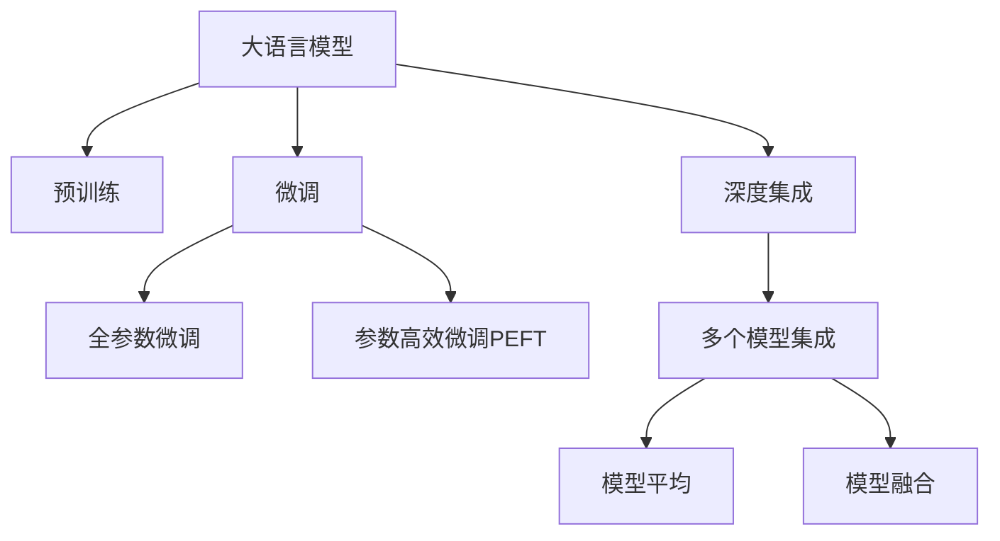

                 

# 大语言模型原理与工程实践：混合微调策略

> 关键词：大语言模型,混合微调,迁移学习,混合模型,深度学习,深度集成,自然语言处理(NLP)

## 1. 背景介绍

### 1.1 问题由来

在深度学习技术飞速发展的背景下，大语言模型(如BERT、GPT-2等)在自然语言处理(NLP)领域取得了令人瞩目的成果。这些模型通过在海量无标签文本上进行预训练，学习到了广泛的语言知识，能够在众多NLP任务中表现出色。然而，预训练模型的泛化能力有限，面对特定领域的应用，效果仍然不尽人意。为此，研究人员提出并实施了大语言模型的微调方法，以在特定任务上进一步提升模型的性能。

然而，传统的全参数微调方法存在计算资源消耗大、易过拟合等问题，这在实际应用中并不现实。因此，混合微调策略应运而生，它通过结合预训练与微调的不同策略，在保持模型泛化能力的同时，减少对计算资源的依赖，降低过拟合风险。本文将详细探讨混合微调策略，并结合实例进行阐释。

## 2. 核心概念与联系

### 2.1 核心概念概述

为更好地理解混合微调策略，我们先介绍几个关键概念：

- 大语言模型(Large Language Model, LLM)：指通过大规模无标签文本数据进行预训练，学习到广泛语言知识并具备较强通用性的语言模型。

- 预训练(Pre-training)：指在大规模无标签文本数据上，通过自监督学习任务训练通用语言模型的过程。常见的预训练任务包括自回归语言建模、掩码语言建模等。

- 微调(Fine-tuning)：指在预训练模型的基础上，使用下游任务的少量标注数据，通过有监督学习优化模型在特定任务上的性能。

- 混合微调(Hybrid Fine-tuning)：指在预训练模型的基础上，采用预训练与微调的不同策略组合，实现更高效、更灵活的模型适配。

- 深度集成(Deep Ensemble)：指通过训练多个微调模型，并组合它们的多元输出，提升模型的整体性能。

这些概念之间的联系可以通过以下Mermaid流程图来展示：



这个流程图展示了预训练、微调和混合微调、深度集成之间的逻辑关系：

1. 大语言模型通过预训练获得基础能力。
2. 微调是对预训练模型进行任务特定的优化，可以分为全参数微调和参数高效微调（PEFT）。
3. 混合微调结合预训练和微调的不同策略，实现更高效、更灵活的模型适配。
4. 深度集成通过训练多个微调模型，并组合它们的多元输出，提升模型的整体性能。

这些核心概念共同构成了混合微调策略的理论基础，有助于我们理解其工作原理和优化方向。

## 3. 核心算法原理 & 具体操作步骤

### 3.1 算法原理概述

混合微调策略的核心思想是结合预训练与微调的不同策略，提升模型的泛化能力和适应性。通常情况下，混合微调包括以下两种策略：

- 基于预训练模型的迁移学习：利用预训练模型学到的语言表示，通过少量标注数据对模型进行微调，以适应特定任务的需求。
- 参数高效微调(Parameter-Efficient Fine-Tuning, PEFT)：在微调过程中，只更新预训练模型的顶层或特定层的参数，而保持大部分预训练参数不变。

混合微调策略的优化目标是在保证模型性能的前提下，尽可能减少计算资源和标注数据的消耗。

### 3.2 算法步骤详解

混合微调策略的实现步骤通常包括以下几个关键环节：

**Step 1: 准备预训练模型和数据集**

1. 选择合适的预训练语言模型 $M_{\theta}$ 作为初始化参数，如BERT、GPT-2等。
2. 准备下游任务 $T$ 的标注数据集 $D$，划分为训练集、验证集和测试集。一般要求标注数据与预训练数据的分布不要差异过大。

**Step 2: 设计微调策略**

1. 根据任务类型，选择基于预训练模型的迁移学习或参数高效微调。
2. 对于迁移学习，可以在预训练模型的顶层添加合适的输出层和损失函数。对于分类任务，通常添加线性分类器和交叉熵损失函数；对于生成任务，则使用语言模型的解码器输出概率分布，并以负对数似然为损失函数。
3. 对于参数高效微调，可以在微调时仅更新顶层或特定层的参数，并以较小的学习率更新全部或部分的模型参数。

**Step 3: 设置微调超参数**

1. 选择合适的优化算法及其参数，如AdamW、SGD等，设置学习率、批大小、迭代轮数等。
2. 设置正则化技术及强度，包括权重衰减、Dropout、Early Stopping等。
3. 确定冻结预训练参数的策略，如仅微调顶层，或全部参数都参与微调。

**Step 4: 执行梯度训练**

1. 将训练集数据分批次输入模型，前向传播计算损失函数。
2. 反向传播计算参数梯度，根据设定的优化算法和学习率更新模型参数。
3. 周期性在验证集上评估模型性能，根据性能指标决定是否触发Early Stopping。
4. 重复上述步骤直到满足预设的迭代轮数或Early Stopping条件。

**Step 5: 测试和部署**

1. 在测试集上评估微调后模型 $M_{\hat{\theta}}$ 的性能，对比微调前后的精度提升。
2. 使用微调后的模型对新样本进行推理预测，集成到实际的应用系统中。
3. 持续收集新的数据，定期重新微调模型，以适应数据分布的变化。

以上是混合微调策略的一般流程。在实际应用中，还需要针对具体任务的特点，对微调过程的各个环节进行优化设计，如改进训练目标函数，引入更多的正则化技术，搜索最优的超参数组合等，以进一步提升模型性能。

### 3.3 算法优缺点

混合微调策略具有以下优点：

1. 减少计算资源消耗：通过参数高效微调，只更新少量模型参数，避免了全参数微调的高计算资源消耗。
2. 降低过拟合风险：通过迁移学习，利用预训练模型的泛化能力，减少了微调过程中的过拟合风险。
3. 提升模型泛化能力：通过混合微调，将预训练模型的通用知识和下游任务的特定知识相结合，提升了模型的泛化能力。

同时，混合微调策略也存在以下局限性：

1. 迁移学习的效果受预训练数据质量影响较大：预训练数据质量和多样性不足，可能导致迁移学习效果不佳。
2. 参数高效微调的效果依赖于模型设计：参数高效微调需要选择合适的模型结构和微调策略，才能取得理想的性能。
3. 混合微调的整体效率可能低于全参数微调：混合微调的策略组合可能比全参数微调更复杂，导致实际应用中的效率下降。

尽管存在这些局限性，混合微调策略仍然是一种在特定应用场景中表现优异的大语言模型微调方法。通过合理设计预训练和微调的策略组合，混合微调可以在计算资源和标注数据有限的情况下，取得较理想的性能。

### 3.4 算法应用领域

混合微调策略在NLP领域已经得到了广泛的应用，覆盖了几乎所有常见任务，例如：

- 文本分类：如情感分析、主题分类、意图识别等。通过混合微调，模型可以更好地理解文本中的语义信息，提高分类准确率。
- 命名实体识别：识别文本中的人名、地名、机构名等特定实体。混合微调使得模型能够更好地适应特定领域的实体命名规则。
- 关系抽取：从文本中抽取实体之间的语义关系。通过迁移学习，模型能够利用预训练模型学到的通用知识，提升抽取精度。
- 问答系统：对自然语言问题给出答案。混合微调使得模型能够更好地理解问题中的语义信息，生成更准确的答案。
- 机器翻译：将源语言文本翻译成目标语言。混合微调可以提升模型的语言转换能力，提高翻译质量。
- 文本摘要：将长文本压缩成简短摘要。混合微调可以使得模型更好地捕捉文本中的关键信息，生成高质量的摘要。
- 对话系统：使机器能够与人自然对话。混合微调可以使得模型更好地理解上下文信息，生成更符合语境的回答。

除了上述这些经典任务外，混合微调策略还被创新性地应用到更多场景中，如可控文本生成、常识推理、代码生成、数据增强等，为NLP技术带来了全新的突破。随着预训练模型和混合微调方法的不断进步，相信NLP技术将在更广阔的应用领域大放异彩。

## 4. 数学模型和公式 & 详细讲解 & 举例说明

### 4.1 数学模型构建

本节将使用数学语言对混合微调策略的数学原理进行更加严格的刻画。

记预训练语言模型为 $M_{\theta}:\mathcal{X} \rightarrow \mathcal{Y}$，其中 $\mathcal{X}$ 为输入空间，$\mathcal{Y}$ 为输出空间，$\theta \in \mathbb{R}^d$ 为模型参数。假设微调任务的训练集为 $D=\{(x_i,y_i)\}_{i=1}^N, x_i \in \mathcal{X}, y_i \in \mathcal{Y}$。

定义模型 $M_{\theta}$ 在输入 $x$ 上的损失函数为 $\ell(M_{\theta}(x),y)$，则在数据集 $D$ 上的经验风险为：

$$
\mathcal{L}(\theta) = \frac{1}{N} \sum_{i=1}^N \ell(M_{\theta}(x_i),y_i)
$$

混合微调策略的核心在于将预训练模型的泛化能力和微调的特定化能力相结合。假设通过预训练学到的通用知识为 $M_{\phi}$，其中 $\phi$ 为预训练得到的模型参数。通过混合微调，模型 $M_{\theta}$ 可以表示为：

$$
M_{\theta}(x) = \mathrm{softmax}(f_\phi(M_{\phi}(x)) + f_\theta(M_{\theta}(x)))
$$

其中 $f_\phi$ 和 $f_\theta$ 分别为预训练模型和微调模型的可微函数。在微调过程中，$M_{\theta}$ 通过 $f_\theta$ 对输入 $x$ 进行处理，并在 $f_\phi$ 的基础上，利用预训练模型学到的语言表示进行细化。

### 4.2 公式推导过程

以下我们以二分类任务为例，推导混合微调的损失函数及其梯度的计算公式。

假设模型 $M_{\theta}$ 在输入 $x$ 上的输出为 $\hat{y}=M_{\theta}(x) \in [0,1]$，表示样本属于正类的概率。真实标签 $y \in \{0,1\}$。定义预训练模型的输出为 $\hat{y}_{\phi}=M_{\phi}(x)$，则混合微调的输出为：

$$
\hat{y} = \mathrm{softmax}(\hat{y}_{\phi} + M_{\theta}(x))
$$

因此，混合微调的损失函数为：

$$
\ell(M_{\theta}(x),y) = -[y\log \hat{y} + (1-y)\log (1-\hat{y})]
$$

通过前向传播计算损失函数，其梯度为：

$$
\nabla_{\theta}\mathcal{L}(\theta) = \nabla_{\theta}(\mathrm{softmax}(\hat{y}_{\phi} + M_{\theta}(x))) \nabla_{\theta}\ell(M_{\theta}(x),y)
$$

通过链式法则，可以进一步推导出损失函数对预训练模型参数 $\phi$ 的梯度：

$$
\nabla_{\phi}\mathcal{L}(\theta) = \nabla_{\phi}(\hat{y}_{\phi}) \nabla_{\theta}\mathcal{L}(\theta)
$$

其中 $\nabla_{\phi}(\hat{y}_{\phi})$ 为预训练模型的输出对参数 $\phi$ 的梯度，可以通过反向传播算法计算。

在得到损失函数对参数 $\theta$ 和 $\phi$ 的梯度后，即可带入参数更新公式，完成模型的迭代优化。重复上述过程直至收敛，最终得到适应下游任务的最优模型参数 $\theta^*$ 和 $\phi^*$。

### 4.3 案例分析与讲解

在实践中，我们以情感分析任务为例，解释混合微调策略的应用。假设我们使用BERT模型进行情感分析任务的微调。首先，在预训练BERT模型的基础上，添加一个线性分类器作为微调模型的顶层，使用交叉熵损失函数进行微调。然后，在微调过程中，仅更新顶层分类器的权重，保持BERT模型的预训练参数不变。

具体步骤如下：

1. 准备数据集：收集标注好的情感分析数据集，分为训练集、验证集和测试集。
2. 加载预训练BERT模型：使用Transformers库加载预训练的BERT模型。
3. 添加顶层分类器：在BERT模型的顶层添加线性分类器，使用交叉熵损失函数进行微调。
4. 设置优化器：选择AdamW优化器，设置合适的学习率和批大小。
5. 执行梯度训练：将训练集数据分批次输入模型，前向传播计算损失函数。反向传播计算参数梯度，根据设定的优化算法和学习率更新模型参数。周期性在验证集上评估模型性能，根据性能指标决定是否触发Early Stopping。
6. 测试和部署：在测试集上评估微调后的模型性能，对比微调前后的精度提升，并使用微调后的模型对新样本进行推理预测。

## 5. 项目实践：代码实例和详细解释说明

### 5.1 开发环境搭建

在进行混合微调实践前，我们需要准备好开发环境。以下是使用Python进行PyTorch开发的环境配置流程：

1. 安装Anaconda：从官网下载并安装Anaconda，用于创建独立的Python环境。

2. 创建并激活虚拟环境：
```bash
conda create -n pytorch-env python=3.8 
conda activate pytorch-env
```

3. 安装PyTorch：根据CUDA版本，从官网获取对应的安装命令。例如：
```bash
conda install pytorch torchvision torchaudio cudatoolkit=11.1 -c pytorch -c conda-forge
```

4. 安装Transformers库：
```bash
pip install transformers
```

5. 安装各类工具包：
```bash
pip install numpy pandas scikit-learn matplotlib tqdm jupyter notebook ipython
```

完成上述步骤后，即可在`pytorch-env`环境中开始混合微调实践。

### 5.2 源代码详细实现

下面我以情感分析任务为例，给出使用Transformers库对BERT模型进行混合微调的PyTorch代码实现。

首先，定义情感分析任务的数据处理函数：

```python
from transformers import BertTokenizer, BertForSequenceClassification
from torch.utils.data import Dataset, DataLoader
import torch

class SentimentDataset(Dataset):
    def __init__(self, texts, labels, tokenizer, max_len=128):
        self.texts = texts
        self.labels = labels
        self.tokenizer = tokenizer
        self.max_len = max_len
        
    def __len__(self):
        return len(self.texts)
    
    def __getitem__(self, item):
        text = self.texts[item]
        label = self.labels[item]
        
        encoding = self.tokenizer(text, return_tensors='pt', max_length=self.max_len, padding='max_length', truncation=True)
        input_ids = encoding['input_ids'][0]
        attention_mask = encoding['attention_mask'][0]
        
        # 对label进行one-hot编码
        encoded_label = torch.tensor([label], dtype=torch.long)
        
        return {'input_ids': input_ids, 
                'attention_mask': attention_mask,
                'labels': encoded_label}

# 加载预训练BERT模型和分词器
model = BertForSequenceClassification.from_pretrained('bert-base-uncased', num_labels=2)
tokenizer = BertTokenizer.from_pretrained('bert-base-uncased')
```

然后，定义混合微调的训练和评估函数：

```python
from sklearn.metrics import classification_report

device = torch.device('cuda') if torch.cuda.is_available() else torch.device('cpu')
model.to(device)

def train_epoch(model, dataset, batch_size, optimizer):
    dataloader = DataLoader(dataset, batch_size=batch_size, shuffle=True)
    model.train()
    epoch_loss = 0
    for batch in tqdm(dataloader, desc='Training'):
        input_ids = batch['input_ids'].to(device)
        attention_mask = batch['attention_mask'].to(device)
        labels = batch['labels'].to(device)
        model.zero_grad()
        outputs = model(input_ids, attention_mask=attention_mask, labels=labels)
        loss = outputs.loss
        epoch_loss += loss.item()
        loss.backward()
        optimizer.step()
    return epoch_loss / len(dataloader)

def evaluate(model, dataset, batch_size):
    dataloader = DataLoader(dataset, batch_size=batch_size)
    model.eval()
    preds, labels = [], []
    with torch.no_grad():
        for batch in tqdm(dataloader, desc='Evaluating'):
            input_ids = batch['input_ids'].to(device)
            attention_mask = batch['attention_mask'].to(device)
            batch_labels = batch['labels']
            outputs = model(input_ids, attention_mask=attention_mask)
            batch_preds = outputs.logits.argmax(dim=1).to('cpu').tolist()
            batch_labels = batch_labels.to('cpu').tolist()
            for pred, label in zip(batch_preds, batch_labels):
                preds.append(pred)
                labels.append(label)
                
    print(classification_report(labels, preds))
```

最后，启动训练流程并在测试集上评估：

```python
epochs = 5
batch_size = 16

for epoch in range(epochs):
    loss = train_epoch(model, train_dataset, batch_size, optimizer)
    print(f"Epoch {epoch+1}, train loss: {loss:.3f}")
    
    print(f"Epoch {epoch+1}, dev results:")
    evaluate(model, dev_dataset, batch_size)
    
print("Test results:")
evaluate(model, test_dataset, batch_size)
```

以上就是使用PyTorch对BERT进行情感分析任务混合微调的完整代码实现。可以看到，得益于Transformers库的强大封装，我们可以用相对简洁的代码完成BERT模型的加载和混合微调。

### 5.3 代码解读与分析

让我们再详细解读一下关键代码的实现细节：

**SentimentDataset类**：
- `__init__`方法：初始化文本、标签、分词器等关键组件。
- `__len__`方法：返回数据集的样本数量。
- `__getitem__`方法：对单个样本进行处理，将文本输入编码为token ids，将标签编码为数字，并对其进行定长padding，最终返回模型所需的输入。

**模型选择与加载**：
- 使用`BertForSequenceClassification`类加载预训练的BERT模型，并设置分类标签数。

**训练和评估函数**：
- 使用PyTorch的DataLoader对数据集进行批次化加载，供模型训练和推理使用。
- 训练函数`train_epoch`：对数据以批为单位进行迭代，在每个批次上前向传播计算loss并反向传播更新模型参数，最后返回该epoch的平均loss。
- 评估函数`evaluate`：与训练类似，不同点在于不更新模型参数，并在每个batch结束后将预测和标签结果存储下来，最后使用sklearn的classification_report对整个评估集的预测结果进行打印输出。

**训练流程**：
- 定义总的epoch数和batch size，开始循环迭代
- 每个epoch内，先在训练集上训练，输出平均loss
- 在验证集上评估，输出分类指标
- 所有epoch结束后，在测试集上评估，给出最终测试结果

可以看到，PyTorch配合Transformers库使得BERT混合微调的代码实现变得简洁高效。开发者可以将更多精力放在数据处理、模型改进等高层逻辑上，而不必过多关注底层的实现细节。

当然，工业级的系统实现还需考虑更多因素，如模型的保存和部署、超参数的自动搜索、更灵活的任务适配层等。但核心的混合微调范式基本与此类似。

## 6. 实际应用场景
### 6.1 智能客服系统

基于混合微调的对话技术，可以广泛应用于智能客服系统的构建。传统客服往往需要配备大量人力，高峰期响应缓慢，且一致性和专业性难以保证。而使用混合微调的对话模型，可以7x24小时不间断服务，快速响应客户咨询，用自然流畅的语言解答各类常见问题。

在技术实现上，可以收集企业内部的历史客服对话记录，将问题和最佳答复构建成监督数据，在此基础上对预训练对话模型进行混合微调。混合微调后的对话模型能够自动理解用户意图，匹配最合适的答案模板进行回复。对于客户提出的新问题，还可以接入检索系统实时搜索相关内容，动态组织生成回答。如此构建的智能客服系统，能大幅提升客户咨询体验和问题解决效率。

### 6.2 金融舆情监测

金融机构需要实时监测市场舆论动向，以便及时应对负面信息传播，规避金融风险。传统的人工监测方式成本高、效率低，难以应对网络时代海量信息爆发的挑战。基于混合微调的文本分类和情感分析技术，为金融舆情监测提供了新的解决方案。

具体而言，可以收集金融领域相关的新闻、报道、评论等文本数据，并对其进行主题标注和情感标注。在此基础上对预训练语言模型进行混合微调，使其能够自动判断文本属于何种主题，情感倾向是正面、中性还是负面。将混合微调后的模型应用到实时抓取的网络文本数据，就能够自动监测不同主题下的情感变化趋势，一旦发现负面信息激增等异常情况，系统便会自动预警，帮助金融机构快速应对潜在风险。

### 6.3 个性化推荐系统

当前的推荐系统往往只依赖用户的历史行为数据进行物品推荐，无法深入理解用户的真实兴趣偏好。基于混合微调的大语言模型，个性化推荐系统可以更好地挖掘用户行为背后的语义信息，从而提供更精准、多样的推荐内容。

在实践中，可以收集用户浏览、点击、评论、分享等行为数据，提取和用户交互的物品标题、描述、标签等文本内容。将文本内容作为模型输入，用户的后续行为（如是否点击、购买等）作为监督信号，在此基础上混合微调预训练语言模型。混合微调后的模型能够从文本内容中准确把握用户的兴趣点。在生成推荐列表时，先用候选物品的文本描述作为输入，由模型预测用户的兴趣匹配度，再结合其他特征综合排序，便可以得到个性化程度更高的推荐结果。

### 6.4 未来应用展望

随着混合微调策略和大语言模型的不断发展，基于混合微调的大语言模型将在更多领域得到应用，为传统行业带来变革性影响。

在智慧医疗领域，基于混合微调的医疗问答、病历分析、药物研发等应用将提升医疗服务的智能化水平，辅助医生诊疗，加速新药开发进程。

在智能教育领域，混合微调技术可应用于作业批改、学情分析、知识推荐等方面，因材施教，促进教育公平，提高教学质量。

在智慧城市治理中，混合微调模型可应用于城市事件监测、舆情分析、应急指挥等环节，提高城市管理的自动化和智能化水平，构建更安全、高效的未来城市。

此外，在企业生产、社会治理、文娱传媒等众多领域，基于混合微调的人工智能应用也将不断涌现，为经济社会发展注入新的动力。相信随着技术的日益成熟，混合微调方法将成为人工智能落地应用的重要范式，推动人工智能技术在垂直行业的规模化落地。

## 7. 工具和资源推荐
### 7.1 学习资源推荐

为了帮助开发者系统掌握混合微调策略的理论基础和实践技巧，这里推荐一些优质的学习资源：

1. 《Transformer from Principles to Practice》系列博文：由大模型技术专家撰写，深入浅出地介绍了Transformer原理、BERT模型、混合微调技术等前沿话题。

2. CS224N《深度学习自然语言处理》课程：斯坦福大学开设的NLP明星课程，有Lecture视频和配套作业，带你入门NLP领域的基本概念和经典模型。

3. 《Natural Language Processing with Transformers》书籍：Transformers库的作者所著，全面介绍了如何使用Transformers库进行NLP任务开发，包括混合微调在内的诸多范式。

4. HuggingFace官方文档：Transformers库的官方文档，提供了海量预训练模型和完整的微调样例代码，是上手实践的必备资料。

5. CLUE开源项目：中文语言理解测评基准，涵盖大量不同类型的中文NLP数据集，并提供了基于混合微调的baseline模型，助力中文NLP技术发展。

通过对这些资源的学习实践，相信你一定能够快速掌握混合微调策略的精髓，并用于解决实际的NLP问题。
###  7.2 开发工具推荐

高效的开发离不开优秀的工具支持。以下是几款用于混合微调开发的常用工具：

1. PyTorch：基于Python的开源深度学习框架，灵活动态的计算图，适合快速迭代研究。大部分预训练语言模型都有PyTorch版本的实现。

2. TensorFlow：由Google主导开发的开源深度学习框架，生产部署方便，适合大规模工程应用。同样有丰富的预训练语言模型资源。

3. Transformers库：HuggingFace开发的NLP工具库，集成了众多SOTA语言模型，支持PyTorch和TensorFlow，是进行混合微调任务开发的利器。

4. Weights & Biases：模型训练的实验跟踪工具，可以记录和可视化模型训练过程中的各项指标，方便对比和调优。与主流深度学习框架无缝集成。

5. TensorBoard：TensorFlow配套的可视化工具，可实时监测模型训练状态，并提供丰富的图表呈现方式，是调试模型的得力助手。

6. Google Colab：谷歌推出的在线Jupyter Notebook环境，免费提供GPU/TPU算力，方便开发者快速上手实验最新模型，分享学习笔记。

合理利用这些工具，可以显著提升混合微调任务的开发效率，加快创新迭代的步伐。

### 7.3 相关论文推荐

混合微调策略和大语言模型的发展源于学界的持续研究。以下是几篇奠基性的相关论文，推荐阅读：

1. Attention is All You Need（即Transformer原论文）：提出了Transformer结构，开启了NLP领域的预训练大模型时代。

2. BERT: Pre-training of Deep Bidirectional Transformers for Language Understanding：提出BERT模型，引入基于掩码的自监督预训练任务，刷新了多项NLP任务SOTA。

3. Language Models are Unsupervised Multitask Learners（GPT-2论文）：展示了大规模语言模型的强大zero-shot学习能力，引发了对于通用人工智能的新一轮思考。

4. Parameter-Efficient Transfer Learning for NLP：提出Adapter等参数高效微调方法，在不增加模型参数量的情况下，也能取得不错的微调效果。

5. Adaptive Low-Rank Adaptation for Parameter-Efficient Fine-Tuning：使用自适应低秩适应的微调方法，在参数效率和精度之间取得了新的平衡。

这些论文代表了大语言模型混合微调技术的发展脉络。通过学习这些前沿成果，可以帮助研究者把握学科前进方向，激发更多的创新灵感。

## 8. 总结：未来发展趋势与挑战

### 8.1 总结

本文对基于混合微调策略的大语言模型微调方法进行了全面系统的介绍。首先阐述了混合微调策略的研究背景和意义，明确了混合微调在拓展预训练模型应用、提升下游任务性能方面的独特价值。其次，从原理到实践，详细讲解了混合微调策略的数学原理和关键步骤，给出了混合微调任务开发的完整代码实例。同时，本文还广泛探讨了混合微调方法在智能客服、金融舆情、个性化推荐等多个行业领域的应用前景，展示了混合微调范式的巨大潜力。此外，本文精选了混合微调技术的各类学习资源，力求为读者提供全方位的技术指引。

通过本文的系统梳理，可以看到，基于混合微调策略的大语言模型微调方法正在成为NLP领域的重要范式，极大地拓展了预训练语言模型的应用边界，催生了更多的落地场景。受益于大规模语料的预训练，混合微调模型以更低的时间和标注成本，在小样本条件下也能取得不俗的效果，有力推动了NLP技术的产业化进程。未来，伴随预训练语言模型和混合微调方法的不断进步，相信NLP技术将在更广阔的应用领域大放异彩，深刻影响人类的生产生活方式。

### 8.2 未来发展趋势

展望未来，混合微调策略将呈现以下几个发展趋势：

1. 模型规模持续增大。随着算力成本的下降和数据规模的扩张，预训练语言模型的参数量还将持续增长。超大规模语言模型蕴含的丰富语言知识，有望支撑更加复杂多变的下游任务混合微调。

2. 混合微调方法日趋多样。除了传统的混合微调外，未来会涌现更多参数高效和计算高效的混合微调方法，如Adapter、LoRA等，在节省计算资源的同时也能保证混合微调精度。

3. 持续学习成为常态。随着数据分布的不断变化，混合微调模型也需要持续学习新知识以保持性能。如何在不遗忘原有知识的同时，高效吸收新样本信息，将成为重要的研究课题。

4. 标注样本需求降低。受启发于提示学习(Prompt-based Learning)的思路，未来的混合微调方法将更好地利用大模型的语言理解能力，通过更加巧妙的任务描述，在更少的标注样本上也能实现理想的混合微调效果。

5. 少样本学习得到关注。对于少样本学习，混合微调策略可以更好地利用预训练模型的泛化能力，在少量标注数据下，通过微调进一步提升模型性能。

6. 多模态混合微调崛起。当前的混合微调主要聚焦于纯文本数据，未来会进一步拓展到图像、视频、语音等多模态数据混合微调。多模态信息的融合，将显著提升语言模型对现实世界的理解和建模能力。

以上趋势凸显了混合微调策略和大语言模型的广阔前景。这些方向的探索发展，必将进一步提升混合微调模型的性能和应用范围，为构建人机协同的智能系统铺平道路。面向未来，混合微调技术还需要与其他人工智能技术进行更深入的融合，如知识表示、因果推理、强化学习等，多路径协同发力，共同推动自然语言理解和智能交互系统的进步。只有勇于创新、敢于突破，才能不断拓展语言模型的边界，让智能技术更好地造福人类社会。

### 8.3 面临的挑战

尽管混合微调策略已经取得了瞩目成就，但在迈向更加智能化、普适化应用的过程中，它仍面临着诸多挑战：

1. 标注成本瓶颈。尽管混合微调降低了对标注数据的需求，但对于长尾应用场景，难以获得充足的高质量标注数据，成为制约混合微调性能的瓶颈。如何进一步降低混合微调对标注样本的依赖，将是一大难题。

2. 模型鲁棒性不足。当前混合微调模型面对域外数据时，泛化性能往往大打折扣。对于测试样本的微小扰动，混合微调模型的预测也容易发生波动。如何提高混合微调模型的鲁棒性，避免灾难性遗忘，还需要更多理论和实践的积累。

3. 推理效率有待提高。尽管混合微调模型精度高，但在实际部署时往往面临推理速度慢、内存占用大等效率问题。如何在保证性能的同时，简化模型结构，提升推理速度，优化资源占用，将是重要的优化方向。

4. 可解释性亟需加强。当前混合微调模型更像是"黑盒"系统，难以解释其内部工作机制和决策逻辑。对于医疗、金融等高风险应用，算法的可解释性和可审计性尤为重要。如何赋予混合微调模型更强的可解释性，将是亟待攻克的难题。

5. 安全性有待保障。预训练语言模型难免会学习到有偏见、有害的信息，通过混合微调传递到下游任务，产生误导性、歧视性的输出，给实际应用带来安全隐患。如何从数据和算法层面消除模型偏见，避免恶意用途，确保输出的安全性，也将是重要的研究课题。

6. 知识整合能力不足。现有的混合微调模型往往局限于任务内数据，难以灵活吸收和运用更广泛的先验知识。如何让混合微调过程更好地与外部知识库、规则库等专家知识结合，形成更加全面、准确的信息整合能力，还有很大的想象空间。

正视混合微调面临的这些挑战，积极应对并寻求突破，将是大语言模型混合微调走向成熟的必由之路。相信随着学界和产业界的共同努力，这些挑战终将一一被克服，混合微调方法必将在构建安全、可靠、可解释、可控的智能系统铺平道路。面向未来，混合微调技术还需要与其他人工智能技术进行更深入的融合，如知识表示、因果推理、强化学习等，多路径协同发力，共同推动自然语言理解和智能交互系统的进步。只有勇于创新、敢于突破，才能不断拓展语言模型的边界，让智能技术更好地造福人类社会。

### 8.4 研究展望

面对混合微调策略和大语言模型面临的诸多挑战，未来的研究需要在以下几个方面寻求新的突破：

1. 探索无监督和半监督混合微调方法。摆脱对大规模标注数据的依赖，利用自监督学习、主动学习等无监督和半监督范式，最大限度利用非结构化数据，实现更加灵活高效的混合微调。

2. 研究参数高效和计算高效的混合微调范式。开发更加参数高效的混合微调方法，在固定大部分预训练参数的同时，只更新极少量的任务相关参数。同时优化混合微调模型的计算图，减少前向传播和反向传播的资源消耗，实现更加轻量级、实时性的部署。

3. 融合因果和对比学习范式。通过引入因果推断和对比学习思想，增强混合微调模型建立稳定因果关系的能力，学习更加普适、鲁棒的语言表征，从而提升模型泛化性和抗干扰能力。

4. 引入更多先验知识。将符号化的先验知识，如知识图谱、逻辑规则等，与神经网络模型进行巧妙融合，引导混合微调过程学习更准确、合理的语言模型。同时加强不同模态数据的整合，实现视觉、语音等多模态信息与文本信息的协同建模。

5. 结合因果分析和博弈论工具。将因果分析方法引入混合微调模型，识别出模型决策的关键特征，增强输出解释的因果性和逻辑性。借助博弈论工具刻画人机交互过程，主动探索并规避模型的脆弱点，提高系统稳定性。

6. 纳入伦理道德约束。在混合微调模型的训练目标中引入伦理导向的评估指标，过滤和惩罚有偏见、有害的输出倾向。同时加强人工干预和审核，建立模型行为的监管机制，确保输出符合人类价值观和伦理道德。

这些研究方向的探索，必将引领混合微调策略和大语言模型微调技术迈向更高的台阶，为构建安全、可靠、可解释、可控的智能系统铺平道路。面向未来，混合微调技术还需要与其他人工智能技术进行更深入的融合，如知识表示、因果推理、强化学习等，多路径协同发力，共同推动自然语言理解和智能交互系统的进步。只有勇于创新、敢于突破，才能不断拓展语言模型的边界，让智能技术更好地造福人类社会。

## 9. 附录：常见问题与解答

**Q1：混合微调策略与全参数微调有何不同？**

A: 混合微调策略是在预训练模型的基础上，采用预训练与微调的不同策略组合，实现更高效、更灵活的模型适配。与全参数微调相比，混合微调策略具有以下优点：

1. 减少计算资源消耗：通过参数高效微调，只更新少量模型参数，避免了全参数微调的高计算资源消耗。
2. 降低过拟合风险：通过迁移学习，利用预训练模型的泛化能力，减少了微调过程中的过拟合风险。
3. 提升模型泛化能力：通过混合微调，将预训练模型的通用知识和下游任务的特定知识相结合，提升了模型的泛化能力。

**Q2：混合微调策略如何处理长尾数据问题？**

A: 长尾数据问题是混合微调策略面临的常见挑战。为应对这一问题，可以采用以下几种方法：

1. 数据增强：通过数据扩充、回译等方式丰富训练集，增加长尾数据的覆盖。
2. 迁移学习：利用预训练模型的泛化能力，通过迁移学习在少量标注数据上微调模型。
3. 半监督学习：结合少量标注数据和大量无标签数据进行训练，提升模型在长尾数据上的性能。
4. 元学习：使用少量样本学习元知识，通过元知识指导长尾数据的微调过程。

**Q3：混合微调策略的模型平均方法有哪些优缺点？**

A: 模型平均方法是混合微调中常用的一种技术，通过训练多个微调模型并取平均值，可以提升模型的整体性能。其主要优点包括：

1. 降低过拟合风险：通过训练多个模型，可以降低单模型的过拟合风险。
2. 提升泛化能力：多个模型的平均输出可以更好地泛化到未见过的数据上。
3. 提供多样性：多个模型提供了多样化的推理路径，可以提高系统的鲁棒性和可靠性。

但其缺点也不容忽视：

1. 增加计算资源消耗：训练和平均多个模型需要更多的计算资源。
2. 复杂度增加：模型的训练和推理过程变得更加复杂。
3. 数据依赖性增加：模型的性能高度依赖于训练数据的质量和多样性。

因此，模型平均方法需要在实际应用中根据具体情况进行权衡，选择合适的模型数量和平均策略。

**Q4：混合微调策略在多语言模型上的应用效果如何？**

A: 混合微调策略在多语言模型上同样有效，可以应用于多种语言的任务微调。由于多语言模型通常具有相似的架构和预训练过程，混合微调策略的原理和实现方式与单语言模型类似，因此可以直接应用于多语言任务。例如，可以针对不同语言的文本数据进行混合微调，提升多语言模型的性能。

然而，多语言模型面临更大的数据和标注资源需求，需要额外考虑语言间的迁移学习、多语言数据对齐等问题。因此，在实际应用中，需要结合多语言任务的特点进行相应的优化调整。

**Q5：混合微调策略在NLP任务中的应用前景如何？**

A: 混合微调策略在NLP任务中具有广泛的应用前景。除了传统的文本分类、命名实体识别、关系抽取等任务外，混合微调策略还可以应用于对话系统、机器翻译、文本摘要、问答系统等复杂任务。例如，可以结合预训练语言模型的通用语言知识和下游任务的特定知识，实现更加精准、高效的NLP系统。

在实际应用中，混合微调策略需要根据具体的任务需求进行优化设计，选择合适的模型结构和微调策略，以获得最佳的性能提升。

---

作者：禅与计算机程序设计艺术 / Zen and the Art of Computer Programming

