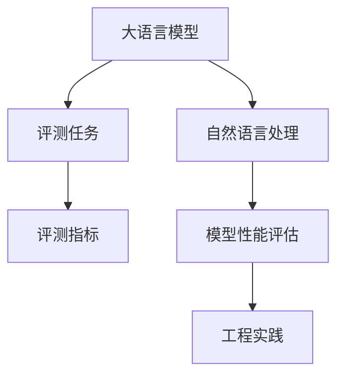

                 

# 大语言模型原理与工程实践：评测任务

> 关键词：大语言模型,评测任务,评测指标,自然语言处理,NLP,模型性能评估,工程实践

## 1. 背景介绍

### 1.1 问题由来

随着深度学习技术在自然语言处理(NLP)领域不断进步，大语言模型(Large Language Model, LLM)如BERT、GPT等成为了研究的热点。这些模型通过在大量文本数据上进行预训练，学习到了丰富的语言知识，具备了强大的语言生成和理解能力。但如何评估这些模型的性能，是学术界和工业界共同关注的难点。

### 1.2 问题核心关键点

大语言模型性能的评估主要依赖于各种评测任务。评测任务是通过比较模型在特定数据集上的表现，来评估其语言理解和生成能力的指标体系。一个好的评测任务应当具有良好的可解释性、可操作性、可重复性和公平性，能够全面反映模型在不同维度上的表现，从而为模型的改进和优化提供方向。

### 1.3 问题研究意义

评测任务在NLP领域具有重要意义：
1. 衡量模型能力：通过评测任务可以直观地评估模型在不同场景下的表现，衡量其语言理解、生成、推理等能力。
2. 指导模型优化：评测任务提供的数据驱动反馈，指导模型训练和调优，提升模型效果。
3. 促进技术创新：推动学术界和工业界关注新方法和技术，加速NLP领域的发展。
4. 应用验证：评测任务在模型训练后进行验证，确保模型在实际应用中的可靠性和有效性。
5. 构建标准：评测任务有助于构建行业标准，促进NLP技术的标准化和规范化。

## 2. 核心概念与联系

### 2.1 核心概念概述

为了更好地理解评测任务在大语言模型中的应用，本节将介绍几个关键概念：

- **大语言模型**：通过大规模预训练学习到通用语言表示的模型，具备强大的语言生成和理解能力，如BERT、GPT等。
- **评测任务**：用于评估模型语言理解和生成能力的任务，如问答、文本分类、机器翻译等。
- **评测指标**：用于衡量模型在特定任务上的表现，如精确度、召回率、F1值等。
- **自然语言处理**：涉及语言信息的获取、处理、理解、生成和应用的人工智能技术，包括文本分析、语音识别、语言生成等。
- **模型性能评估**：通过各类评测任务和指标，评估模型在不同维度上的表现。
- **工程实践**：将学术研究转化为实际应用的工程过程，包括数据处理、模型训练、系统集成等。

这些概念之间的逻辑关系可以通过以下Mermaid流程图来展示：



这个流程图展示了大语言模型评测任务的研究脉络：

1. 大语言模型通过预训练获得通用语言表示。
2. 评测任务为评估模型在不同应用场景的表现。
3. 评测指标提供模型性能的量化指标。
4. 模型性能评估通过指标体系对模型进行全面评估。
5. 工程实践将评估结果用于模型的改进和优化。

## 3. 核心算法原理 & 具体操作步骤

### 3.1 算法原理概述

大语言模型的评测任务本质上是一个有监督学习的过程。其核心思想是：利用预训练模型的输出，通过对比模型与真人或优秀人类表现之间的差异，来评估模型的性能。

形式化地，假设评测任务为 $T$，给定数据集 $D=\{(x_i,y_i)\}_{i=1}^N, x_i \in \mathcal{X}, y_i \in \mathcal{Y}$，其中 $\mathcal{X}$ 为输入空间，$\mathcal{Y}$ 为输出空间，$\{y_i\}$ 为标注数据。评测任务的目标是找到最优的模型 $M^*$，使得模型在 $D$ 上的预测 $\hat{y}$ 与真实标签 $y_i$ 的差距最小化。

通常，评测任务可以通过设定不同的损失函数 $\mathcal{L}(y,\hat{y})$，如交叉熵损失、均方误差损失等，来量化模型与标注数据之间的差异。例如，对于文本分类任务，可以选择交叉熵损失：

$$
\mathcal{L}(y,\hat{y}) = -\sum_{i=1}^N [y_i\log \hat{y}_i + (1-y_i)\log(1-\hat{y}_i)]
$$

### 3.2 算法步骤详解

基于评测任务的算法主要包括以下几个关键步骤：

**Step 1: 选择评测任务和数据集**
- 根据具体需求选择适合的评测任务，如问答、分类、生成等。
- 收集对应任务的数据集，划分为训练集、验证集和测试集。一般要求数据集具有代表性，涵盖不同难度、不同领域的样本。

**Step 2: 设计评估指标**
- 根据评测任务的特点，设计合适的评估指标，如精确度、召回率、F1值、BLEU值等。
- 考虑多指标综合评估，如使用F1值作为最终指标。

**Step 3: 构建模型和评测流程**
- 选择合适的预训练模型，加载模型参数。
- 定义输入和输出格式，设置评测任务的目标函数和损失函数。
- 设置评估指标，实现模型在测试集上的评测流程。

**Step 4: 训练和评估模型**
- 对模型进行训练，使用训练集数据更新模型参数。
- 在验证集上调整模型参数，防止过拟合。
- 在测试集上评估模型性能，输出评测指标。

**Step 5: 分析和优化模型**
- 根据测试集上的表现，分析模型不足，识别关键问题。
- 调整模型结构或参数，优化模型性能。
- 重复训练和评估过程，直到达到预期效果。

### 3.3 算法优缺点

基于评测任务的大语言模型评估方法具有以下优点：
1. 数据驱动：评测任务提供了具体的评估指标，可以量化模型性能。
2. 全面评估：评测任务覆盖不同场景，可以全面反映模型在不同维度上的表现。
3. 可操作性强：评测任务设计为具体的软件实现，易于工程实践。
4. 评估结果可信：评测任务使用标准数据集和评价指标，评估结果具有较强的可信度。

但该方法也存在一些局限性：
1. 数据获取困难：一些评测任务需要构建特定数据集，获取高质量标注数据较为困难。
2. 标注成本高：标注数据需要专家手动标注，成本较高。
3. 依赖人工：评测任务需要人工设置评估指标和流程，存在人为偏差。
4. 动态变化：数据分布可能随时间变化，导致模型性能下降。
5. 模型复杂：复杂模型可能需要复杂评测流程，难以快速迭代。

尽管存在这些局限性，基于评测任务的方法仍然是评估大语言模型性能的主流范式。未来相关研究的重点在于如何降低评测任务的成本，提高评测方法的自动化和可扩展性。

### 3.4 算法应用领域

评测任务在大语言模型的多个应用领域都得到了广泛应用，包括但不限于以下领域：

- 文本分类：如情感分析、主题分类、意图识别等。评测任务可以包括分类精确度、召回率、F1值等。
- 命名实体识别：识别文本中的人名、地名、机构名等特定实体。评测任务可以包括命名实体识别精确度、召回率、F1值等。
- 问答系统：对自然语言问题给出答案。评测任务可以包括BLEU值、精确度、召回率等。
- 机器翻译：将源语言文本翻译成目标语言。评测任务可以包括BLEU值、Rouge值等。
- 文本摘要：将长文本压缩成简短摘要。评测任务可以包括BLEU值、Rouge值等。
- 对话系统：使机器能够与人自然对话。评测任务可以包括BLEU值、CoLIN-ACL值等。

除了上述这些经典任务外，评测任务还被创新性地应用到更多场景中，如可控文本生成、常识推理、代码生成、数据增强等，为NLP技术带来了全新的突破。随着评测任务的不断演进，相信NLP技术将在更广阔的应用领域大放异彩。

## 4. 数学模型和公式 & 详细讲解 & 举例说明

### 4.1 数学模型构建

基于评测任务的大语言模型评估，通常需要构建一个形式化的数学模型。假设评测任务为分类任务，输入为文本 $x$，输出为标签 $y$，模型为 $M$，输出为预测标签 $\hat{y}$。则模型在样本 $(x,y)$ 上的损失函数为：

$$
\mathcal{L}(x,y) = -[y\log \hat{y}_i + (1-y)\log(1-\hat{y}_i)]
$$

其中 $\hat{y}_i$ 为模型在 $x$ 上的预测标签，$y$ 为真实标签。目标是最小化损失函数，即找到最优的模型参数 $\theta$：

$$
\theta^* = \mathop{\arg\min}_{\theta} \sum_{i=1}^N \mathcal{L}(x_i,y_i)
$$

### 4.2 公式推导过程

为了更好地理解评测任务，以下我们将以文本分类为例，推导交叉熵损失函数及其梯度的计算公式。

假设模型 $M_{\theta}$ 在输入 $x$ 上的输出为 $\hat{y}=M_{\theta}(x)$，其中 $\hat{y}$ 为预测标签概率分布。定义模型在样本 $(x,y)$ 上的损失函数为 $\ell(x,y)$，则在数据集 $D$ 上的经验风险为：

$$
\mathcal{L}(\theta) = \frac{1}{N} \sum_{i=1}^N \ell(x_i,y_i)
$$

对于二分类任务，可以选择交叉熵损失：

$$
\ell(x,y) = -[y\log \hat{y} + (1-y)\log(1-\hat{y})]
$$

将其代入经验风险公式，得：

$$
\mathcal{L}(\theta) = -\frac{1}{N}\sum_{i=1}^N [y_i\log \hat{y}_i + (1-y_i)\log(1-\hat{y}_i)]
$$

根据链式法则，损失函数对参数 $\theta_k$ 的梯度为：

$$
\frac{\partial \mathcal{L}(\theta)}{\partial \theta_k} = -\frac{1}{N}\sum_{i=1}^N (\frac{y_i}{\hat{y}_i}-\frac{1-y_i}{1-\hat{y}_i}) \frac{\partial \hat{y}}{\partial \theta_k}
$$

其中 $\frac{\partial \hat{y}}{\partial \theta_k}$ 可进一步递归展开，利用自动微分技术完成计算。

### 4.3 案例分析与讲解

假设我们有一个文本分类任务，数据集包含两组文本，分别标注为“正面”和“负面”。使用BERT预训练模型作为基线，定义交叉熵损失，并使用SGD优化器进行训练。

首先，加载数据集并进行预处理：

```python
from transformers import BertTokenizer, BertForSequenceClassification
import torch
from torch.utils.data import DataLoader, Dataset
from sklearn.model_selection import train_test_split

class TextDataset(Dataset):
    def __init__(self, texts, labels, tokenizer):
        self.texts = texts
        self.labels = labels
        self.tokenizer = tokenizer
        
    def __len__(self):
        return len(self.texts)
    
    def __getitem__(self, item):
        text = self.texts[item]
        label = self.labels[item]
        encoding = self.tokenizer(text, return_tensors='pt')
        return {'input_ids': encoding['input_ids'][0], 'attention_mask': encoding['attention_mask'][0], 'labels': torch.tensor(label, dtype=torch.long)}

# 定义数据集
tokenizer = BertTokenizer.from_pretrained('bert-base-cased')
train_texts, dev_texts, train_labels, dev_labels = train_test_split(train_data, test_size=0.2, random_state=42)
train_dataset = TextDataset(train_texts, train_labels, tokenizer)
dev_dataset = TextDataset(dev_texts, dev_labels, tokenizer)

# 定义模型和优化器
model = BertForSequenceClassification.from_pretrained('bert-base-cased', num_labels=2)
optimizer = torch.optim.SGD(model.parameters(), lr=2e-5)

# 训练模型
device = torch.device('cuda' if torch.cuda.is_available() else 'cpu')
model.to(device)
for epoch in range(10):
    model.train()
    total_loss = 0
    for batch in DataLoader(train_dataset, batch_size=16, shuffle=True):
        input_ids = batch['input_ids'].to(device)
        attention_mask = batch['attention_mask'].to(device)
        labels = batch['labels'].to(device)
        optimizer.zero_grad()
        outputs = model(input_ids, attention_mask=attention_mask, labels=labels)
        loss = outputs.loss
        total_loss += loss.item()
        loss.backward()
        optimizer.step()
    print(f'Epoch {epoch+1}, loss: {total_loss/N}')
    
# 评估模型
model.eval()
total_loss = 0
correct = 0
with torch.no_grad():
    for batch in DataLoader(dev_dataset, batch_size=16, shuffle=False):
        input_ids = batch['input_ids'].to(device)
        attention_mask = batch['attention_mask'].to(device)
        labels = batch['labels'].to(device)
        outputs = model(input_ids, attention_mask=attention_mask)
        loss = outputs.loss
        total_loss += loss.item()
        logits = outputs.logits.argmax(dim=1)
        correct += (logits == labels).sum().item()
print(f'Dev accuracy: {correct/len(dev_dataset)}')
```

可以看到，通过以上代码实现，我们利用BERT模型在文本分类任务上进行微调，并使用交叉熵损失进行评估。这种形式化的评估方法，可以客观地反映模型的分类能力，并指导后续的模型优化和改进。

## 5. 项目实践：代码实例和详细解释说明

### 5.1 开发环境搭建

在进行评测任务实践前，我们需要准备好开发环境。以下是使用Python进行PyTorch开发的环境配置流程：

1. 安装Anaconda：从官网下载并安装Anaconda，用于创建独立的Python环境。

2. 创建并激活虚拟环境：
```bash
conda create -n pytorch-env python=3.8 
conda activate pytorch-env
```

3. 安装PyTorch：根据CUDA版本，从官网获取对应的安装命令。例如：
```bash
conda install pytorch torchvision torchaudio cudatoolkit=11.1 -c pytorch -c conda-forge
```

4. 安装Transformers库：
```bash
pip install transformers
```

5. 安装各类工具包：
```bash
pip install numpy pandas scikit-learn matplotlib tqdm jupyter notebook ipython
```

完成上述步骤后，即可在`pytorch-env`环境中开始评测任务实践。

### 5.2 源代码详细实现

下面我们以命名实体识别(NER)任务为例，给出使用Transformers库对BERT模型进行评测任务的PyTorch代码实现。

首先，定义NER任务的数据处理函数：

```python
from transformers import BertTokenizer
from torch.utils.data import Dataset
import torch

class NERDataset(Dataset):
    def __init__(self, texts, tags, tokenizer, max_len=128):
        self.texts = texts
        self.tags = tags
        self.tokenizer = tokenizer
        self.max_len = max_len
        
    def __len__(self):
        return len(self.texts)
    
    def __getitem__(self, item):
        text = self.texts[item]
        tags = self.tags[item]
        
        encoding = self.tokenizer(text, return_tensors='pt', max_length=self.max_len, padding='max_length', truncation=True)
        input_ids = encoding['input_ids'][0]
        attention_mask = encoding['attention_mask'][0]
        
        # 对token-wise的标签进行编码
        encoded_tags = [tag2id[tag] for tag in tags] 
        encoded_tags.extend([tag2id['O']] * (self.max_len - len(encoded_tags)))
        labels = torch.tensor(encoded_tags, dtype=torch.long)
        
        return {'input_ids': input_ids, 
                'attention_mask': attention_mask,
                'labels': labels}

# 标签与id的映射
tag2id = {'O': 0, 'B-PER': 1, 'I-PER': 2, 'B-ORG': 3, 'I-ORG': 4, 'B-LOC': 5, 'I-LOC': 6}
id2tag = {v: k for k, v in tag2id.items()}

# 创建dataset
tokenizer = BertTokenizer.from_pretrained('bert-base-cased')

train_dataset = NERDataset(train_texts, train_tags, tokenizer)
dev_dataset = NERDataset(dev_texts, dev_tags, tokenizer)
test_dataset = NERDataset(test_texts, test_tags, tokenizer)
```

然后，定义模型和优化器：

```python
from transformers import BertForTokenClassification, AdamW

model = BertForTokenClassification.from_pretrained('bert-base-cased', num_labels=len(tag2id))

optimizer = AdamW(model.parameters(), lr=2e-5)
```

接着，定义训练和评估函数：

```python
from torch.utils.data import DataLoader
from tqdm import tqdm
from sklearn.metrics import classification_report

device = torch.device('cuda') if torch.cuda.is_available() else torch.device('cpu')
model.to(device)

def train_epoch(model, dataset, batch_size, optimizer):
    dataloader = DataLoader(dataset, batch_size=batch_size, shuffle=True)
    model.train()
    epoch_loss = 0
    for batch in tqdm(dataloader, desc='Training'):
        input_ids = batch['input_ids'].to(device)
        attention_mask = batch['attention_mask'].to(device)
        labels = batch['labels'].to(device)
        model.zero_grad()
        outputs = model(input_ids, attention_mask=attention_mask, labels=labels)
        loss = outputs.loss
        epoch_loss += loss.item()
        loss.backward()
        optimizer.step()
    return epoch_loss / len(dataloader)

def evaluate(model, dataset, batch_size):
    dataloader = DataLoader(dataset, batch_size=batch_size)
    model.eval()
    preds, labels = [], []
    with torch.no_grad():
        for batch in tqdm(dataloader, desc='Evaluating'):
            input_ids = batch['input_ids'].to(device)
            attention_mask = batch['attention_mask'].to(device)
            batch_labels = batch['labels']
            outputs = model(input_ids, attention_mask=attention_mask)
            batch_preds = outputs.logits.argmax(dim=2).to('cpu').tolist()
            batch_labels = batch_labels.to('cpu').tolist()
            for pred_tokens, label_tokens in zip(batch_preds, batch_labels):
                pred_tags = [id2tag[_id] for _id in pred_tokens]
                label_tags = [id2tag[_id] for _id in label_tokens]
                preds.append(pred_tags[:len(label_tags)])
                labels.append(label_tags)
                
    print(classification_report(labels, preds))
```

最后，启动训练流程并在测试集上评估：

```python
epochs = 5
batch_size = 16

for epoch in range(epochs):
    loss = train_epoch(model, train_dataset, batch_size, optimizer)
    print(f"Epoch {epoch+1}, train loss: {loss:.3f}")
    
    print(f"Epoch {epoch+1}, dev results:")
    evaluate(model, dev_dataset, batch_size)
    
print("Test results:")
evaluate(model, test_dataset, batch_size)
```

以上就是使用PyTorch对BERT进行命名实体识别任务评测任务的完整代码实现。可以看到，得益于Transformers库的强大封装，我们可以用相对简洁的代码完成BERT模型的评测。

### 5.3 代码解读与分析

让我们再详细解读一下关键代码的实现细节：

**NERDataset类**：
- `__init__`方法：初始化文本、标签、分词器等关键组件。
- `__len__`方法：返回数据集的样本数量。
- `__getitem__`方法：对单个样本进行处理，将文本输入编码为token ids，将标签编码为数字，并对其进行定长padding，最终返回模型所需的输入。

**tag2id和id2tag字典**：
- 定义了标签与数字id之间的映射关系，用于将token-wise的预测结果解码回真实的标签。

**训练和评估函数**：
- 使用PyTorch的DataLoader对数据集进行批次化加载，供模型训练和推理使用。
- 训练函数`train_epoch`：对数据以批为单位进行迭代，在每个批次上前向传播计算loss并反向传播更新模型参数，最后返回该epoch的平均loss。
- 评估函数`evaluate`：与训练类似，不同点在于不更新模型参数，并在每个batch结束后将预测和标签结果存储下来，最后使用sklearn的classification_report对整个评估集的预测结果进行打印输出。

**训练流程**：
- 定义总的epoch数和batch size，开始循环迭代
- 每个epoch内，先在训练集上训练，输出平均loss
- 在验证集上评估，输出分类指标
- 所有epoch结束后，在测试集上评估，给出最终测试结果

可以看到，PyTorch配合Transformers库使得BERT评测任务的代码实现变得简洁高效。开发者可以将更多精力放在数据处理、模型改进等高层逻辑上，而不必过多关注底层的实现细节。

当然，工业级的系统实现还需考虑更多因素，如模型的保存和部署、超参数的自动搜索、更灵活的任务适配层等。但核心的评测范式基本与此类似。

## 6. 实际应用场景
### 6.1 智能客服系统

基于大语言模型评测任务的智能客服系统，可以广泛应用于智能客服系统的构建。传统客服往往需要配备大量人力，高峰期响应缓慢，且一致性和专业性难以保证。而使用评测任务评估的对话模型，可以7x24小时不间断服务，快速响应客户咨询，用自然流畅的语言解答各类常见问题。

在技术实现上，可以收集企业内部的历史客服对话记录，将问题和最佳答复构建成监督数据，在此基础上对预训练对话模型进行评测。评测任务可以包括BLEU值、CoLIN-ACL值等，用于评估模型与真人对话的相似度。微调后的对话模型能够自动理解用户意图，匹配最合适的答案模板进行回复。对于客户提出的新问题，还可以接入检索系统实时搜索相关内容，动态组织生成回答。如此构建的智能客服系统，能大幅提升客户咨询体验和问题解决效率。

### 6.2 金融舆情监测

金融机构需要实时监测市场舆论动向，以便及时应对负面信息传播，规避金融风险。传统的人工监测方式成本高、效率低，难以应对网络时代海量信息爆发的挑战。基于大语言模型评测任务的文本分类和情感分析技术，为金融舆情监测提供了新的解决方案。

具体而言，可以收集金融领域相关的新闻、报道、评论等文本数据，并对其进行主题标注和情感标注。在此基础上对预训练语言模型进行评测，使其能够自动判断文本属于何种主题，情感倾向是正面、中性还是负面。将评测任务评估的模型应用到实时抓取的网络文本数据，就能够自动监测不同主题下的情感变化趋势，一旦发现负面信息激增等异常情况，系统便会自动预警，帮助金融机构快速应对潜在风险。

### 6.3 个性化推荐系统

当前的推荐系统往往只依赖用户的历史行为数据进行物品推荐，无法深入理解用户的真实兴趣偏好。基于大语言模型评测任务的个性化推荐系统，可以更好地挖掘用户行为背后的语义信息，从而提供更精准、多样的推荐内容。

在实践中，可以收集用户浏览、点击、评论、分享等行为数据，提取和用户交互的物品标题、描述、标签等文本内容。将文本内容作为模型输入，用户的后续行为（如是否点击、购买等）作为监督信号，在此基础上评测预训练语言模型。评测任务可以包括分类精确度、召回率、F1值等，用于评估模型的推荐效果。微调后的模型能够从文本内容中准确把握用户的兴趣点。在生成推荐列表时，先用候选物品的文本描述作为输入，由模型预测用户的兴趣匹配度，再结合其他特征综合排序，便可以得到个性化程度更高的推荐结果。

### 6.4 未来应用展望

随着大语言模型评测任务的不断发展，基于评测任务的范式将在更多领域得到应用，为传统行业带来变革性影响。

在智慧医疗领域，基于评测任务的医疗问答、病历分析、药物研发等应用将提升医疗服务的智能化水平，辅助医生诊疗，加速新药开发进程。

在智能教育领域，评测任务可应用于作业批改、学情分析、知识推荐等方面，因材施教，促进教育公平，提高教学质量。

在智慧城市治理中，评测任务可应用于城市事件监测、舆情分析、应急指挥等环节，提高城市管理的自动化和智能化水平，构建更安全、高效的未来城市。

此外，在企业生产、社会治理、文娱传媒等众多领域，基于大语言模型评测任务的智能应用也将不断涌现，为NLP技术带来新的突破。相信随着技术的日益成熟，评测任务方法将成为人工智能落地应用的重要范式，推动人工智能技术在垂直行业的规模化落地。

## 7. 工具和资源推荐
### 7.1 学习资源推荐

为了帮助开发者系统掌握大语言模型评测任务的理论基础和实践技巧，这里推荐一些优质的学习资源：

1. 《Transformer从原理到实践》系列博文：由大模型技术专家撰写，深入浅出地介绍了Transformer原理、BERT模型、评测任务等前沿话题。

2. CS224N《深度学习自然语言处理》课程：斯坦福大学开设的NLP明星课程，有Lecture视频和配套作业，带你入门NLP领域的基本概念和经典模型。

3. 《Natural Language Processing with Transformers》书籍：Transformers库的作者所著，全面介绍了如何使用Transformers库进行NLP任务开发，包括评测任务在内的诸多范式。

4. HuggingFace官方文档：Transformers库的官方文档，提供了海量预训练模型和完整的评测任务样例代码，是上手实践的必备资料。

5. CLUE开源项目：中文语言理解测评基准，涵盖大量不同类型的中文NLP数据集，并提供了基于评测任务的baseline模型，助力中文NLP技术发展。

通过对这些资源的学习实践，相信你一定能够快速掌握大语言模型评测任务的精髓，并用于解决实际的NLP问题。
###  7.2 开发工具推荐

高效的开发离不开优秀的工具支持。以下是几款用于大语言模型评测任务开发的常用工具：

1. PyTorch：基于Python的开源深度学习框架，灵活动态的计算图，适合快速迭代研究。大部分预训练语言模型都有PyTorch版本的实现。

2. TensorFlow：由Google主导开发的开源深度学习框架，生产部署方便，适合大规模工程应用。同样有丰富的预训练语言模型资源。

3. Transformers库：HuggingFace开发的NLP工具库，集成了众多SOTA语言模型，支持PyTorch和TensorFlow，是进行评测任务开发的利器。

4. Weights & Biases：模型训练的实验跟踪工具，可以记录和可视化模型训练过程中的各项指标，方便对比和调优。与主流深度学习框架无缝集成。

5. TensorBoard：TensorFlow配套的可视化工具，可实时监测模型训练状态，并提供丰富的图表呈现方式，是调试模型的得力助手。

6. Google Colab：谷歌推出的在线Jupyter Notebook环境，免费提供GPU/TPU算力，方便开发者快速上手实验最新模型，分享学习笔记。

合理利用这些工具，可以显著提升大语言模型评测任务的开发效率，加快创新迭代的步伐。

### 7.3 相关论文推荐

大语言模型评测任务在大语言模型研究和应用中扮演了重要角色。以下是几篇奠基性的相关论文，推荐阅读：

1. Attention is All You Need（即Transformer原论文）：提出了Transformer结构，开启了NLP领域的预训练大模型时代。

2. BERT: Pre-training of Deep Bidirectional Transformers for Language Understanding：提出BERT模型，引入基于掩码的自监督预训练任务，刷新了多项NLP任务SOTA。

3. Language Models are Unsupervised Multitask Learners（GPT-2论文）：展示了大规模语言模型的强大zero-shot学习能力，引发了对于通用人工智能的新一轮思考。

4. Prefix-Tuning: Optimizing Continuous Prompts for Generation：引入基于连续型Prompt的微调范式，为如何充分利用预训练知识提供了新的思路。

5. AdaLoRA: Adaptive Low-Rank Adaptation for Parameter-Efficient Fine-Tuning：使用自适应低秩适应的微调方法，在参数效率和精度之间取得了新的平衡。

这些论文代表了大语言模型评测任务的发展脉络。通过学习这些前沿成果，可以帮助研究者把握学科前进方向，激发更多的创新灵感。

## 8. 总结：未来发展趋势与挑战

### 8.1 总结

本文对基于评测任务的大语言模型评估方法进行了全面系统的介绍。首先阐述了大语言模型评测任务的研究背景和意义，明确了评测任务在大语言模型性能评估中的重要性。其次，从原理到实践，详细讲解了评测任务的数学原理和关键步骤，给出了评测任务开发的完整代码实例。同时，本文还广泛探讨了评测任务在智能客服、金融舆情、个性化推荐等多个行业领域的应用前景，展示了评测任务范式的巨大潜力。此外，本文精选了评测任务的各类学习资源，力求为读者提供全方位的技术指引。

通过本文的系统梳理，可以看到，基于评测任务的方法是大语言模型评估的核心范式，极大地拓展了预训练语言模型的应用边界，催生了更多的落地场景。受益于大规模语料的预训练，评测任务评估的模型在标注数据不足的情况下也能取得理想的效果，有效推动了NLP技术的产业化进程。未来，伴随评测任务和评估指标的不断演进，相信NLP技术将在更广阔的应用领域大放异彩，深刻影响人类的生产生活方式。

### 8.2 未来发展趋势

展望未来，大语言模型评测任务将呈现以下几个发展趋势：

1. 数据驱动的评估：随着数据获取手段和质量提升，基于大规模无标注数据的评估方法将逐渐成为主流。

2. 自动化评估：通过深度学习模型自动评估其他模型的性能，减少人工干预，提高评估效率。

3. 多指标综合评估：综合使用精确度、召回率、F1值、BLEU值等多种评估指标，全面评估模型能力。

4. 分布式评估：分布式训练和评估系统，可以高效处理大规模模型和数据集。

5. 实时评估：实时评估技术，可以实时监测模型性能变化，及时调整优化策略。

6. 元学习评估：通过元学习，学习通用的评估方法，提升评估模型的泛化能力。

以上趋势凸显了大语言模型评测任务的广阔前景。这些方向的探索发展，必将进一步提升NLP系统的性能和应用范围，为人类认知智能的进化带来深远影响。

### 8.3 面临的挑战

尽管大语言模型评测任务已经取得了瞩目成就，但在迈向更加智能化、普适化应用的过程中，它仍面临着诸多挑战：

1. 评估数据获取难度：部分评测任务需要大规模标注数据，数据获取难度大。

2. 模型复杂度提高：随着模型规模的增大，评估任务的复杂度也随之增加。

3. 评估方法公平性：部分评估方法可能存在偏差，影响评估结果的公平性。

4. 多模态评估难题：如何高效评估多模态数据，是一个亟待解决的问题。

5. 结果可解释性：部分评估结果难以解释，影响评估的可信度和可接受性。

6. 动态评估问题：数据分布可能随时间变化，评估模型需要动态调整。

尽管存在这些挑战，大语言模型评测任务的研究仍在不断进步，相信未来能够解决这些问题，并推动NLP技术的发展。

### 8.4 研究展望

面对大语言模型评测任务所面临的挑战，未来的研究需要在以下几个方面寻求新的突破：

1. 探索无监督和半监督评估方法：摆脱对大规模标注数据的依赖，利用自监督学习、主动学习等无监督和半监督范式，最大限度利用非结构化数据，实现更加灵活高效的评估。

2. 研究自动化评估方法：通过深度学习模型自动评估其他模型的性能，减少人工干预，提高评估效率。

3. 引入更多评估指标：综合使用精确度、召回率、F1值、BLEU值等多种评估指标，全面评估模型能力。

4. 融合因果和对比学习范式：通过引入因果推断和对比学习思想，增强评估模型建立稳定因果关系的能力，学习更加普适、鲁棒的语言表征。

5. 结合因果分析和博弈论工具：将因果分析方法引入评估模型，识别出模型决策的关键特征，增强输出解释的因果性和逻辑性。

6. 纳入伦理道德约束：在评估目标中引入伦理导向的评估指标，过滤和惩罚有偏见、有害的输出倾向。

这些研究方向的探索，必将引领大语言模型评测任务技术迈向更高的台阶，为构建安全、可靠、可解释、可控的智能系统铺平道路。面向未来，大语言模型评测任务需要与其他人工智能技术进行更深入的融合，如知识表示、因果推理、强化学习等，多路径协同发力，共同推动自然语言理解和智能交互系统的进步。只有勇于创新、敢于突破，才能不断拓展语言模型的边界，让智能技术更好地造福人类社会。

## 9. 附录：常见问题与解答

**Q1：如何选择合适的评估指标？**

A: 评估指标的选择应根据具体任务而定。例如，对于分类任务，常用精确度、召回率、F1值等；对于序列生成任务，常用BLEU值、ROUGE值等。同时，可以考虑多指标综合评估，如使用F1值作为最终指标。

**Q2：评估任务和评估指标之间的关系是什么？**

A: 评估任务和评估指标是相辅相成的。评估任务用于衡量模型在不同场景下的表现，而评估指标则是评估任务的具体量化指标。例如，对于问答系统任务，可以使用BLEU值作为评估指标；对于机器翻译任务，可以使用BLEU值、ROUGE值等。

**Q3：如何处理评估任务中的类别不平衡问题？**

A: 类别不平衡问题在评估任务中很常见。可以使用一些技巧来缓解，如重采样、过采样、欠采样等，调整训练集和测试集的类别分布。同时，也可以引入微调参数或权重调整等方法，以减少类别不平衡的影响。

**Q4：在评估任务中，模型性能不提升，该如何优化？**

A: 如果模型在评估任务中性能不提升，可以从以下几个方面进行优化：
1. 增加训练数据：增加更多的标注数据，提升模型的泛化能力。
2. 调整模型结构：尝试不同的模型结构或参数设置，优化模型的表现。
3. 引入正则化：使用L2正则、Dropout等正则化技术，避免过拟合。
4. 调整超参数：重新调整学习率、批大小等超参数，寻找最优配置。
5. 模型集成：使用模型集成方法，如Bagging、Boosting等，提升模型性能。

这些优化策略需要根据具体情况灵活运用，以达到最佳的评估效果。

**Q5：在评估任务中，模型性能波动较大，该如何处理？**

A: 模型性能波动较大的问题，可以从以下几个方面进行优化：
1. 数据增强：通过回译、近义替换等方式扩充训练集，增加数据多样性。
2. 对抗训练：引入对抗样本，提高模型的鲁棒性。
3. 模型裁剪：去除不必要的层和参数，减小模型尺寸，加快推理速度。
4. 动态调整：根据模型性能，动态调整超参数，如学习率、批大小等。

这些优化策略可以帮助模型更好地适应数据分布的变化，稳定模型性能。

---

作者：禅与计算机程序设计艺术 / Zen and the Art of Computer Programming

