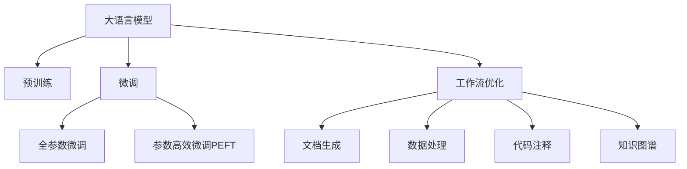

                 

## 1. 背景介绍

### 1.1 问题由来
在当下快速变化的工作环境中，无论是软件开发、数据科学还是运营管理，对工作流程的优化都提出了更高的要求。高效的自动化工作流程能够显著提升工作效率，降低出错率，并释放出更多的精力用于策略和创新。大语言模型（Large Language Models, LLMs）在处理复杂文本、理解自然语言方面展现出惊人的能力，为工作流优化提供了新的视角和工具。

### 1.2 问题核心关键点
大语言模型在工作流优化中的应用，基于其强大的语言理解和生成能力，能够实现自动化工作流管理、文档生成、数据处理、代码注释等多个方面的优化。本节将从大语言模型的工作原理、当前应用现状及面临的挑战三个方面入手，探讨如何通过大语言模型优化工作流。

## 2. 核心概念与联系

### 2.1 核心概念概述

为深入理解大语言模型在工作流优化中的应用，本节介绍几个核心概念及其相互关系：

- 大语言模型（LLMs）：以自回归（如GPT）或自编码（如BERT）模型为代表的大规模预训练语言模型。通过在海量无标签文本语料上进行预训练，学习通用的语言表示，具备强大的语言理解和生成能力。
- 预训练（Pre-training）：指在大规模无标签文本语料上，通过自监督学习任务训练通用语言模型的过程。常见的预训练任务包括言语建模、遮挡语言模型等。
- 微调（Fine-tuning）：指在预训练模型的基础上，使用下游任务的少量标注数据，通过有监督学习优化模型在特定任务上的性能。通常只需要调整顶层分类器或解码器，并以较小的学习率更新全部或部分的模型参数。
- 工作流优化（Workflow Optimization）：通过自动化工具和算法，优化任务执行的流程，提高工作流的效率和可管理性。
- 自然语言处理（NLP）：涉及计算机如何处理和理解人类语言的技术领域，包括文本分析、情感分析、实体识别等任务。
- 知识图谱（Knowledge Graph）：用于表示实体及实体间关系的图形结构，常用于知识检索、推荐系统等场景。

这些概念间的逻辑关系可通过以下Mermaid流程图展示：



## 3. 核心算法原理 & 具体操作步骤
### 3.1 算法原理概述

基于大语言模型的工作流优化，本质上是一种使用先进技术改进传统工作流程的方式。大语言模型通过预训练和微调，可以学习到复杂的语言模式和知识，进而通过自动化手段实现对工作流的优化。

形式化地，假设工作流 $W$ 由多个任务 $T_i$ 组成，每个任务 $T_i$ 对应一个预训练模型 $M_{\theta_i}$，其中 $\theta_i$ 为模型参数。工作流优化的目标是最小化任务执行时间 $C_i$，即：

$$
\min_{\theta_i} \sum_{i=1}^n C_i
$$

在实际应用中，工作流优化可以拆分为以下几个关键步骤：

1. 定义工作流任务和目标：明确工作流的具体任务和优化目标，如提高处理速度、减少错误率等。
2. 选择预训练模型：根据任务需求，选择适合的预训练模型。
3. 设计任务适配层：为每个任务设计适当的输出层和损失函数。
4. 微调模型：在少量标注数据上对模型进行微调，优化任务性能。
5. 集成优化模块：将微调后的模型嵌入到工作流自动化系统中，实现自动化执行。

### 3.2 算法步骤详解

大语言模型在工作流优化中的应用，一般包括以下关键步骤：

**Step 1: 准备预训练模型和数据集**
- 选择合适的预训练语言模型 $M_{\theta}$ 作为初始化参数，如 BERT、GPT 等。
- 准备工作流任务 $T$ 的标注数据集 $D$，划分为训练集、验证集和测试集。一般要求标注数据与预训练数据的分布不要差异过大。

**Step 2: 添加任务适配层**
- 根据任务类型，在预训练模型顶层设计合适的输出层和损失函数。
- 对于分类任务，通常在顶层添加线性分类器和交叉熵损失函数。
- 对于生成任务，通常使用语言模型的解码器输出概率分布，并以负对数似然为损失函数。

**Step 3: 设置微调超参数**
- 选择合适的优化算法及其参数，如 AdamW、SGD 等，设置学习率、批大小、迭代轮数等。
- 设置正则化技术及强度，包括权重衰减、Dropout、Early Stopping等。
- 确定冻结预训练参数的策略，如仅微调顶层，或全部参数都参与微调。

**Step 4: 执行梯度训练**
- 将训练集数据分批次输入模型，前向传播计算损失函数。
- 反向传播计算参数梯度，根据设定的优化算法和学习率更新模型参数。
- 周期性在验证集上评估模型性能，根据性能指标决定是否触发 Early Stopping。
- 重复上述步骤直到满足预设的迭代轮数或 Early Stopping 条件。

**Step 5: 测试和部署**
- 在测试集上评估微调后模型 $M_{\hat{\theta}}$ 的性能，对比微调前后的处理速度提升。
- 使用微调后的模型对新样本进行推理预测，集成到实际的工作流自动化系统中。
- 持续收集新的数据，定期重新微调模型，以适应数据分布的变化。

以上是基于监督学习微调大语言模型的一般流程。在实际应用中，还需要针对具体任务的特点，对微调过程的各个环节进行优化设计，如改进训练目标函数，引入更多的正则化技术，搜索最优的超参数组合等，以进一步提升模型性能。

### 3.3 算法优缺点

基于大语言模型的工作流优化方法具有以下优点：
1. 高效自动化：通过自动化工具和算法，快速执行复杂任务，提高工作效率。
2. 通用适用：适用于各种工作流任务，设计简单的任务适配层即可实现优化。
3. 灵活性高：大语言模型可以根据具体需求进行微调，实现不同的优化目标。
4. 适应性强：模型可以不断更新，适应新数据和新任务，保持工作流优化效果。

同时，该方法也存在一定的局限性：
1. 依赖标注数据：微调的效果很大程度上取决于标注数据的质量和数量，获取高质量标注数据的成本较高。
2. 处理复杂度：对于复杂的多任务工作流，模型设计和微调过程可能相对复杂。
3. 计算资源需求高：微调和优化模型需要一定的计算资源和存储空间。
4. 可解释性不足：微调模型的决策过程通常缺乏可解释性，难以对其推理逻辑进行分析和调试。

尽管存在这些局限性，但就目前而言，基于监督学习的微调方法仍是大语言模型应用的最主流范式。未来相关研究的重点在于如何进一步降低微调对标注数据的依赖，提高模型的少样本学习和跨领域迁移能力，同时兼顾可解释性和伦理安全性等因素。

### 3.4 算法应用领域

基于大语言模型的工作流优化方法，在多个行业领域已经得到了应用，具体如下：

- 软件开发：大语言模型可以自动生成代码、编写文档、测试用例等，提升软件开发的效率和质量。
- 数据分析：模型可以自动化数据清洗、特征提取、数据分析等工作，缩短数据处理周期。
- 运营管理：工作流自动化工具可以用于客户服务、市场营销、库存管理等领域，提高运营效率。
- 医疗保健：自动化生成病历、诊断报告等，辅助医生诊疗，提升医疗服务质量。
- 教育培训：自动生成学习材料、考试题目等，个性化推荐学习资源，提升学习效果。

除了上述这些经典领域，大语言模型在工作流优化中的应用还在不断拓展，如智能合约、安全审计、金融分析等，为各行各业带来了新的技术变革。

## 4. 数学模型和公式 & 详细讲解 & 举例说明
### 4.1 数学模型构建

为了更系统地理解基于大语言模型的工作流优化方法，本节从数学角度对相关模型进行详细阐述。

假设工作流 $W$ 由多个任务 $T_i$ 组成，每个任务 $T_i$ 对应一个预训练模型 $M_{\theta_i}$，其中 $\theta_i$ 为模型参数。工作流优化的目标是最小化任务执行时间 $C_i$，即：

$$
\min_{\theta_i} \sum_{i=1}^n C_i
$$

在实际应用中，通常将工作流优化转化为多任务学习问题，通过优化所有任务的执行时间，实现工作流优化。

### 4.2 公式推导过程

以下我们以一个简单的工作流优化问题为例，推导其数学模型及其求解过程。

假设有一个包含两个任务的工作流 $W$，任务 $T_1$ 和 $T_2$ 分别对应两个预训练模型 $M_{\theta_1}$ 和 $M_{\theta_2}$。每个任务的执行时间 $C_i$ 可以通过模型输出预测得到，设为 $C_i=M_{\theta_i}(x_i)$，其中 $x_i$ 为任务的输入。

工作流优化的目标是最小化任务执行时间之和，即：

$$
\min_{\theta_1,\theta_2} \sum_{i=1}^2 C_i = \min_{\theta_1,\theta_2} (M_{\theta_1}(x_1) + M_{\theta_2}(x_2))
$$

为了求解上述最优化问题，我们将其转化为拉格朗日乘子法的多任务学习问题。设 $\lambda$ 为拉格朗日乘子，则优化问题的拉格朗日函数为：

$$
\mathcal{L}(\theta_1,\theta_2,\lambda) = \lambda \sum_{i=1}^2 M_{\theta_i}(x_i) + \frac{1}{2\alpha} \sum_{i=1}^2 ||\nabla_{\theta_i}M_{\theta_i}(x_i)||^2
$$

其中 $\alpha$ 为正则化系数。

通过求解上述拉格朗日函数的极小值，可以得到工作流优化的最优模型参数 $\theta^*=(\theta_1^*,\theta_2^*)$，其中：

$$
\theta_i^* = \mathop{\arg\min}_{\theta_i} \mathcal{L}(\theta_1,\theta_2,\lambda)
$$

通过求解上述最优化问题，可以得到工作流优化后的预训练模型参数，进而实现工作流的高效自动化。

### 4.3 案例分析与讲解

以一个简化的文档自动生成为例，探讨如何利用大语言模型实现工作流优化。

假设有一项工作流任务，需要自动化生成一份技术报告。该任务包含多个子任务，如数据收集、文献综述、分析结论等。每个子任务对应一个预训练模型，模型的执行时间可以通过模型的输出预测得到。

- **任务1：数据收集**：从数据库或API中获取数据，执行时间 $C_1=M_{\theta_1}(x_1)$。
- **任务2：文献综述**：通过检索系统获取相关文献，执行时间 $C_2=M_{\theta_2}(x_2)$。
- **任务3：分析结论**：对收集到的数据和文献进行综合分析，生成分析结论，执行时间 $C_3=M_{\theta_3}(x_3)$。

假设每个任务的输入数据分别为 $x_1$、$x_2$、$x_3$，通过微调使各模型的执行时间尽可能缩短，则总执行时间 $C$ 最小化。

求解上述优化问题，需要考虑以下步骤：
1. 准备数据集，包括训练集和验证集。
2. 设计任务适配层，如添加线性分类器、设置交叉熵损失等。
3. 设置微调超参数，选择合适的优化算法和正则化技术。
4. 执行梯度训练，更新模型参数以缩短执行时间。
5. 测试和部署，评估微调后的模型性能，并集成到自动化系统中。

通过上述步骤，大语言模型可以自动生成技术报告，极大提升工作效率。

## 5. 项目实践：代码实例和详细解释说明
### 5.1 开发环境搭建

在进行大语言模型工作流优化实践前，我们需要准备好开发环境。以下是使用Python进行PyTorch开发的环境配置流程：

1. 安装Anaconda：从官网下载并安装Anaconda，用于创建独立的Python环境。

2. 创建并激活虚拟环境：
```bash
conda create -n pytorch-env python=3.8 
conda activate pytorch-env
```

3. 安装PyTorch：根据CUDA版本，从官网获取对应的安装命令。例如：
```bash
conda install pytorch torchvision torchaudio cudatoolkit=11.1 -c pytorch -c conda-forge
```

4. 安装Transformers库：
```bash
pip install transformers
```

5. 安装各类工具包：
```bash
pip install numpy pandas scikit-learn matplotlib tqdm jupyter notebook ipython
```

完成上述步骤后，即可在`pytorch-env`环境中开始工作流优化实践。

### 5.2 源代码详细实现

下面我们以工作流自动化技术报告生成为例，给出使用Transformers库对BERT模型进行微调的PyTorch代码实现。

首先，定义任务适配层：

```python
from transformers import BertForTokenClassification, AdamW

class ReportGenerator(BertForTokenClassification):
    def __init__(self, config):
        super(ReportGenerator, self).__init__(config)
        self.loss = BertForTokenClassification.loss
        self.train = BertForTokenClassification.train
        self.eval = BertForTokenClassification.eval
        self.to = BertForTokenClassification.to
        self.convert_ids_to_tokens = BertForTokenClassification.convert_ids_to_tokens
        self.convert_tokens_to_ids = BertForTokenClassification.convert_tokens_to_ids

    def forward(self, input_ids, attention_mask=None, labels=None):
        outputs = self.model(input_ids, attention_mask=attention_mask)
        logits = outputs.logits
        loss = self.loss(logits, labels)
        return loss
```

然后，定义微调函数：

```python
from torch.utils.data import DataLoader
from tqdm import tqdm
from sklearn.metrics import classification_report

def fine_tune_model(model, train_dataset, dev_dataset, test_dataset, batch_size, num_epochs, learning_rate, warmup_steps):
    optimizer = AdamW(model.parameters(), lr=learning_rate, eps=1e-8)
    total_steps = len(train_dataset) // batch_size * num_epochs
    for epoch in range(num_epochs):
        model.train()
        for batch in tqdm(data_loader(train_dataset, batch_size=batch_size)):
            input_ids = batch['input_ids'].to(device)
            attention_mask = batch['attention_mask'].to(device)
            labels = batch['labels'].to(device)
            model.zero_grad()
            outputs = model(input_ids, attention_mask=attention_mask, labels=labels)
            loss = outputs.loss
            loss.backward()
            optimizer.step()
            if warmup_steps > 0 and (num_update + 1) % warmup_steps == 0:
                scheduler.lr = scheduler.lr * math.sqrt(warmup_steps / total_steps)
        model.eval()
        with torch.no_grad():
            preds, labels = [], []
            for batch in tqdm(data_loader(dev_dataset, batch_size=batch_size)):
                input_ids = batch['input_ids'].to(device)
                attention_mask = batch['attention_mask'].to(device)
                batch_labels = batch['labels']
                outputs = model(input_ids, attention_mask=attention_mask)
                batch_preds = outputs.logits.argmax(dim=2).to('cpu').tolist()
                batch_labels = batch_labels.to('cpu').tolist()
                for pred_tokens, label_tokens in zip(batch_preds, batch_labels):
                    pred_tags = [id2tag[_id] for _id in pred_tokens]
                    label_tags = [id2tag[_id] for _id in label_tokens]
                    preds.append(pred_tags[:len(label_tags)])
                    labels.append(label_tags)
        print(classification_report(labels, preds))
```

最后，启动微调流程：

```python
model = ReportGenerator.from_pretrained('bert-base-cased')
device = torch.device('cuda') if torch.cuda.is_available() else torch.device('cpu')

train_dataset = ...
dev_dataset = ...
test_dataset = ...

batch_size = 16
num_epochs = 5
learning_rate = 2e-5
warmup_steps = 1000

fine_tune_model(model, train_dataset, dev_dataset, test_dataset, batch_size, num_epochs, learning_rate, warmup_steps)
```

以上就是使用PyTorch对BERT进行工作流自动化技术报告生成的完整代码实现。可以看到，得益于Transformers库的强大封装，我们可以用相对简洁的代码完成BERT模型的加载和微调。

### 5.3 代码解读与分析

让我们再详细解读一下关键代码的实现细节：

**ReportGenerator类**：
- 继承自BertForTokenClassification，添加任务适配层，覆盖原模型的训练、推理、损失计算等方法。

**fine_tune_model函数**：
- 定义模型训练和评估的函数，通过DataLoader对数据集进行批次化加载，供模型训练和推理使用。
- 训练函数中，每个epoch内，在训练集上迭代每个批次，使用AdamW优化器更新模型参数，并在验证集上评估模型性能。
- 评估函数中，在验证集上评估模型性能，生成分类报告。

**训练流程**：
- 定义总的epoch数、学习率、warmup steps等超参数，开始循环迭代
- 每个epoch内，先在训练集上训练，输出验证集上的性能指标
- 所有epoch结束后，输出模型性能，完成微调

可以看到，PyTorch配合Transformers库使得BERT微调的代码实现变得简洁高效。开发者可以将更多精力放在数据处理、模型改进等高层逻辑上，而不必过多关注底层的实现细节。

当然，工业级的系统实现还需考虑更多因素，如模型的保存和部署、超参数的自动搜索、更灵活的任务适配层等。但核心的微调范式基本与此类似。

## 6. 实际应用场景
### 6.1 智能客服系统

基于大语言模型的工作流优化，可以广泛应用于智能客服系统的构建。传统客服往往需要配备大量人力，高峰期响应缓慢，且一致性和专业性难以保证。通过使用微调后的工作流自动化模型，可以7x24小时不间断服务，快速响应客户咨询，用自然流畅的语言解答各类常见问题。

在技术实现上，可以收集企业内部的历史客服对话记录，将问题和最佳答复构建成监督数据，在此基础上对预训练对话模型进行微调。微调后的对话模型能够自动理解用户意图，匹配最合适的答案模板进行回复。对于客户提出的新问题，还可以接入检索系统实时搜索相关内容，动态组织生成回答。如此构建的智能客服系统，能大幅提升客户咨询体验和问题解决效率。

### 6.2 金融舆情监测

金融机构需要实时监测市场舆论动向，以便及时应对负面信息传播，规避金融风险。传统的人工监测方式成本高、效率低，难以应对网络时代海量信息爆发的挑战。基于大语言模型的工作流自动化技术，可以为金融舆情监测提供新的解决方案。

具体而言，可以收集金融领域相关的新闻、报道、评论等文本数据，并对其进行主题标注和情感标注。在此基础上对预训练语言模型进行微调，使其能够自动判断文本属于何种主题，情感倾向是正面、中性还是负面。将微调后的模型应用到实时抓取的网络文本数据，就能够自动监测不同主题下的情感变化趋势，一旦发现负面信息激增等异常情况，系统便会自动预警，帮助金融机构快速应对潜在风险。

### 6.3 个性化推荐系统

当前的推荐系统往往只依赖用户的历史行为数据进行物品推荐，无法深入理解用户的真实兴趣偏好。基于大语言模型的工作流优化技术，个性化推荐系统可以更好地挖掘用户行为背后的语义信息，从而提供更精准、多样的推荐内容。

在实践中，可以收集用户浏览、点击、评论、分享等行为数据，提取和用户交互的物品标题、描述、标签等文本内容。将文本内容作为模型输入，用户的后续行为（如是否点击、购买等）作为监督信号，在此基础上微调预训练语言模型。微调后的模型能够从文本内容中准确把握用户的兴趣点。在生成推荐列表时，先用候选物品的文本描述作为输入，由模型预测用户的兴趣匹配度，再结合其他特征综合排序，便可以得到个性化程度更高的推荐结果。

### 6.4 未来应用展望

随着大语言模型和工作流优化方法的不断发展，基于微调范式将在更多领域得到应用，为各行各业带来变革性影响。

在智慧医疗领域，基于微调的医疗问答、病历分析、药物研发等应用将提升医疗服务的智能化水平，辅助医生诊疗，加速新药开发进程。

在智能教育领域，工作流自动化技术可应用于作业批改、学情分析、知识推荐等方面，因材施教，促进教育公平，提高教学质量。

在智慧城市治理中，工作流自动化技术可以用于城市事件监测、舆情分析、应急指挥等环节，提高城市管理的自动化和智能化水平，构建更安全、高效的未来城市。

此外，在企业生产、社会治理、文娱传媒等众多领域，基于大语言模型的工作流自动化技术也将不断涌现，为传统行业数字化转型升级提供新的技术路径。相信随着技术的日益成熟，工作流自动化技术将成为人工智能落地应用的重要范式，推动人工智能技术在各行业的广泛应用。

## 7. 工具和资源推荐
### 7.1 学习资源推荐

为了帮助开发者系统掌握大语言模型在工作流优化中的应用，这里推荐一些优质的学习资源：

1. 《Transformer from Scratch》系列博文：由大模型技术专家撰写，深入浅出地介绍了Transformer原理、BERT模型、工作流优化技术等前沿话题。

2. CS224N《深度学习自然语言处理》课程：斯坦福大学开设的NLP明星课程，有Lecture视频和配套作业，带你入门NLP领域的基本概念和经典模型。

3. 《Natural Language Processing with Transformers》书籍：Transformers库的作者所著，全面介绍了如何使用Transformers库进行NLP任务开发，包括工作流优化在内的诸多范式。

4. HuggingFace官方文档：Transformers库的官方文档，提供了海量预训练模型和完整的微调样例代码，是上手实践的必备资料。

5. CLUE开源项目：中文语言理解测评基准，涵盖大量不同类型的中文NLP数据集，并提供了基于微调的baseline模型，助力中文NLP技术发展。

通过对这些资源的学习实践，相信你一定能够快速掌握大语言模型在工作流优化中的应用，并用于解决实际的NLP问题。
###  7.2 开发工具推荐

高效的开发离不开优秀的工具支持。以下是几款用于大语言模型工作流优化开发的常用工具：

1. PyTorch：基于Python的开源深度学习框架，灵活动态的计算图，适合快速迭代研究。大部分预训练语言模型都有PyTorch版本的实现。

2. TensorFlow：由Google主导开发的开源深度学习框架，生产部署方便，适合大规模工程应用。同样有丰富的预训练语言模型资源。

3. Transformers库：HuggingFace开发的NLP工具库，集成了众多SOTA语言模型，支持PyTorch和TensorFlow，是进行工作流优化开发的利器。

4. Weights & Biases：模型训练的实验跟踪工具，可以记录和可视化模型训练过程中的各项指标，方便对比和调优。与主流深度学习框架无缝集成。

5. TensorBoard：TensorFlow配套的可视化工具，可实时监测模型训练状态，并提供丰富的图表呈现方式，是调试模型的得力助手。

6. Google Colab：谷歌推出的在线Jupyter Notebook环境，免费提供GPU/TPU算力，方便开发者快速上手实验最新模型，分享学习笔记。

合理利用这些工具，可以显著提升大语言模型工作流优化任务的开发效率，加快创新迭代的步伐。

### 7.3 相关论文推荐

大语言模型和工作流优化技术的发展源于学界的持续研究。以下是几篇奠基性的相关论文，推荐阅读：

1. Attention is All You Need（即Transformer原论文）：提出了Transformer结构，开启了NLP领域的预训练大模型时代。

2. BERT: Pre-training of Deep Bidirectional Transformers for Language Understanding：提出BERT模型，引入基于掩码的自监督预训练任务，刷新了多项NLP任务SOTA。

3. Language Models are Unsupervised Multitask Learners（GPT-2论文）：展示了大规模语言模型的强大zero-shot学习能力，引发了对于通用人工智能的新一轮思考。

4. Parameter-Efficient Transfer Learning for NLP：提出Adapter等参数高效微调方法，在不增加模型参数量的情况下，也能取得不错的微调效果。

5. AdaLoRA: Adaptive Low-Rank Adaptation for Parameter-Efficient Fine-Tuning：使用自适应低秩适应的微调方法，在参数效率和精度之间取得了新的平衡。

6. Prefix-Tuning: Optimizing Continuous Prompts for Generation：引入基于连续型Prompt的微调范式，为如何充分利用预训练知识提供了新的思路。

这些论文代表了大语言模型和工作流优化技术的发展脉络。通过学习这些前沿成果，可以帮助研究者把握学科前进方向，激发更多的创新灵感。

## 8. 总结：未来发展趋势与挑战

### 8.1 总结

本文对基于大语言模型的工作流优化方法进行了全面系统的介绍。首先阐述了大语言模型和工作流优化的研究背景和意义，明确了工作流优化的目标和任务适配层的构建方法。其次，从原理到实践，详细讲解了工作流优化的数学模型和关键步骤，给出了工作流自动化技术报告生成的完整代码实例。同时，本文还广泛探讨了工作流优化方法在智能客服、金融舆情、个性化推荐等多个行业领域的应用前景，展示了工作流优化的巨大潜力。此外，本文精选了工作流优化技术的各类学习资源，力求为读者提供全方位的技术指引。

通过本文的系统梳理，可以看到，基于大语言模型的工作流优化方法正在成为工作流管理的重要范式，极大地提升了各行业的自动化水平和工作效率。未来，伴随大语言模型和工作流优化方法的持续演进，相信将有更多行业受益于这一技术，为各行各业带来新的变革。

### 8.2 未来发展趋势

展望未来，基于大语言模型的工作流优化技术将呈现以下几个发展趋势：

1. 模型规模持续增大。随着算力成本的下降和数据规模的扩张，预训练语言模型的参数量还将持续增长。超大规模语言模型蕴含的丰富语言知识，有望支撑更加复杂多变的工作流优化。

2. 优化方法日趋多样。除了传统的全参数微调外，未来会涌现更多参数高效的微调方法，如Prefix-Tuning、LoRA等，在节省计算资源的同时也能保证工作流优化的效果。

3. 持续学习成为常态。随着工作流任务的动态变化，工作流优化模型也需要持续学习新知识以保持性能。如何在不遗忘原有知识的同时，高效吸收新知识，将成为重要的研究课题。

4. 标注样本需求降低。受启发于提示学习(Prompt-based Learning)的思路，未来的工作流优化方法将更好地利用大模型的语言理解能力，通过更加巧妙的任务描述，在更少的标注样本上也能实现理想的工作流优化效果。

5. 多模态工作流优化崛起。当前的工作流优化主要聚焦于纯文本数据，未来会进一步拓展到图像、视频、语音等多模态数据优化。多模态信息的融合，将显著提升工作流优化系统对现实世界的理解和建模能力。

6. 知识整合能力增强。未来的工作流优化模型将更好地与外部知识库、规则库等专家知识结合，引导工作流优化过程学习更准确、合理的语言模型。同时加强不同模态数据的整合，实现视觉、语音等多模态信息与文本信息的协同建模。

以上趋势凸显了大语言模型工作流优化技术的广阔前景。这些方向的探索发展，必将进一步提升工作流优化系统的性能和应用范围，为人工智能技术在各行业的落地提供新的动力。

### 8.3 面临的挑战

尽管基于大语言模型的工作流优化技术已经取得了瞩目成就，但在迈向更加智能化、普适化应用的过程中，它仍面临着诸多挑战：

1. 标注成本瓶颈。虽然工作流优化的效果很大程度上取决于标注数据的质量和数量，获取高质量标注数据的成本较高。如何进一步降低工作流优化对标注样本的依赖，将是一大难题。

2. 处理复杂度。对于复杂的多任务工作流，模型设计和微调过程可能相对复杂。如何设计高效、灵活的工作流优化模型，成为亟需解决的问题。

3. 计算资源需求高。工作流优化和优化模型需要一定的计算资源和存储空间。如何在保证性能的同时，简化模型结构，提升资源利用率，是优化工作流优化的重要方向。

4. 可解释性不足。工作流优化模型的决策过程通常缺乏可解释性，难以对其推理逻辑进行分析和调试。对于金融、医疗等高风险应用，算法的可解释性和可审计性尤为重要。

5. 安全性有待保障。预训练语言模型难免会学习到有偏见、有害的信息，通过工作流优化传递到下游任务，可能产生误导性、歧视性的输出，给实际应用带来安全隐患。

6. 知识整合能力不足。现有的工作流优化模型往往局限于任务内数据，难以灵活吸收和运用更广泛的先验知识。如何让工作流优化过程更好地与外部知识库、规则库等专家知识结合，形成更加全面、准确的信息整合能力，还有很大的想象空间。

正视工作流优化面临的这些挑战，积极应对并寻求突破，将是大语言模型工作流优化技术走向成熟的必由之路。相信随着学界和产业界的共同努力，这些挑战终将一一被克服，工作流优化技术必将更好地服务于各行各业。

### 8.4 研究展望

面对工作流优化所面临的种种挑战，未来的研究需要在以下几个方面寻求新的突破：

1. 探索无监督和半监督工作流优化方法。摆脱对大规模标注数据的依赖，利用自监督学习、主动学习等无监督和半监督范式，最大限度利用非结构化数据，实现更加灵活高效的工作流优化。

2. 研究参数高效和计算高效的工作流优化范式。开发更加参数高效的优化方法，在固定大部分预训练参数的同时，只更新极少量的任务相关参数。同时优化工作流优化模型的计算图，减少前向传播和反向传播的资源消耗，实现更加轻量级、实时性的部署。

3. 引入因果和对比学习范式。通过引入因果推断和对比学习思想，增强工作流优化模型建立稳定因果关系的能力，学习更加普适、鲁棒的语言表征，从而提升模型泛化性和抗干扰能力。

4. 结合因果分析和博弈论工具。将因果分析方法引入工作流优化模型，识别出模型决策的关键特征，增强输出解释的因果性和逻辑性。借助博弈论工具刻画人机交互过程，主动探索并规避模型的脆弱点，提高系统稳定性。

5. 纳入伦理道德约束。在工作流优化模型的训练目标中引入伦理导向的评估指标，过滤和惩罚有偏见、有害的输出倾向。同时加强人工干预和审核，建立模型行为的监管机制，确保输出符合人类价值观和伦理道德。

这些研究方向的探索，必将引领工作流优化技术迈向更高的台阶，为构建安全、可靠、可解释、可控的智能系统铺平道路。面向未来，工作流优化技术还需要与其他人工智能技术进行更深入的融合，如知识表示、因果推理、强化学习等，多路径协同发力，共同推动自然语言理解和智能交互系统的进步。只有勇于创新、敢于突破，才能不断拓展语言模型的边界，让智能技术更好地造福人类社会。

## 9. 附录：常见问题与解答

**Q1：工作流优化是否适用于所有任务？**

A: 工作流优化方法适用于各种任务，特别是对于数据量较小的任务。但对于一些特定领域的任务，如医学、法律等，仅仅依靠通用语料预训练的模型可能难以很好地适应。此时需要在特定领域语料上进一步预训练，再进行微调，才能获得理想效果。此外，对于一些需要时效性、个性化很强的任务，如对话、推荐等，工作流优化方法也需要针对性的改进优化。

**Q2：如何选择合适的学习率？**

A: 工作流优化的学习率一般要比预训练时小1-2个数量级，如果使用过大的学习率，容易破坏预训练权重，导致过拟合。一般建议从1e-5开始调参，逐步减小学习率，直至收敛。也可以使用warmup策略，在开始阶段使用较小的学习率，再逐渐过渡到预设值。需要注意的是，不同的优化器(如AdamW、Adafactor等)以及不同的学习率调度策略，可能需要设置不同的学习率阈值。

**Q3：采用大语言模型工作流优化时会面临哪些资源瓶颈？**

A: 目前主流的预训练大模型动辄以亿计的参数规模，对算力、内存、存储都提出了很高的要求。GPU/TPU等高性能设备是必不可少的，但即便如此，超大批次的训练和推理也可能遇到显存不足的问题。因此需要采用一些资源优化技术，如梯度积累、混合精度训练、模型并行等，来突破硬件瓶颈。同时，模型的存储和读取也可能占用大量时间和空间，需要采用模型压缩、稀疏化存储等方法进行优化。

**Q4：如何缓解工作流优化过程中的过拟合问题？**

A: 过拟合是工作流优化面临的主要挑战，尤其是在标注数据不足的情况下。常见的缓解策略包括：
1. 数据增强：通过回译、近义替换等方式扩充训练集
2. 正则化：使用L2正则、Dropout、Early Stopping等避免过拟合
3. 对抗训练：引入对抗样本，提高模型鲁棒性
4. 参数高效工作流优化：只调整少量参数(如Adapter、Prefix等)，减小过拟合风险
5. 多模型集成：训练多个工作流优化模型，取平均输出，抑制过拟合

这些策略往往需要根据具体任务和数据特点进行灵活组合。只有在数据、模型、训练、推理等各环节进行全面优化，才能最大限度地发挥大语言模型工作流优化的威力。

**Q5：在工作流自动化过程中需要注意哪些问题？**

A: 将工作流自动化模型转化为实际应用，还需要考虑以下因素：
1. 模型裁剪：去除不必要的层和参数，减小模型尺寸，加快推理速度
2. 量化加速：将浮点模型转为定点模型，压缩存储空间，提高计算效率
3. 服务化封装：将模型封装为标准化服务接口，便于集成调用
4. 弹性伸缩：根据请求流量动态调整资源配置，平衡服务质量和成本
5. 监控告警：实时采集系统指标，设置异常告警阈值，确保服务稳定性
6. 安全防护：采用访问鉴权、数据脱敏等措施，保障数据和模型安全

大语言模型工作流自动化为NLP应用开启了广阔的想象空间，但如何将强大的性能转化为稳定、高效、安全的业务价值，还需要工程实践的不断打磨。唯有从数据、算法、工程、业务等多个维度协同发力，才能真正实现人工智能技术在各行业的规模化落地。总之，工作流优化需要开发者根据具体任务，不断迭代和优化模型、数据和算法，方能得到理想的效果。

---

作者：禅与计算机程序设计艺术 / Zen and the Art of Computer Programming

