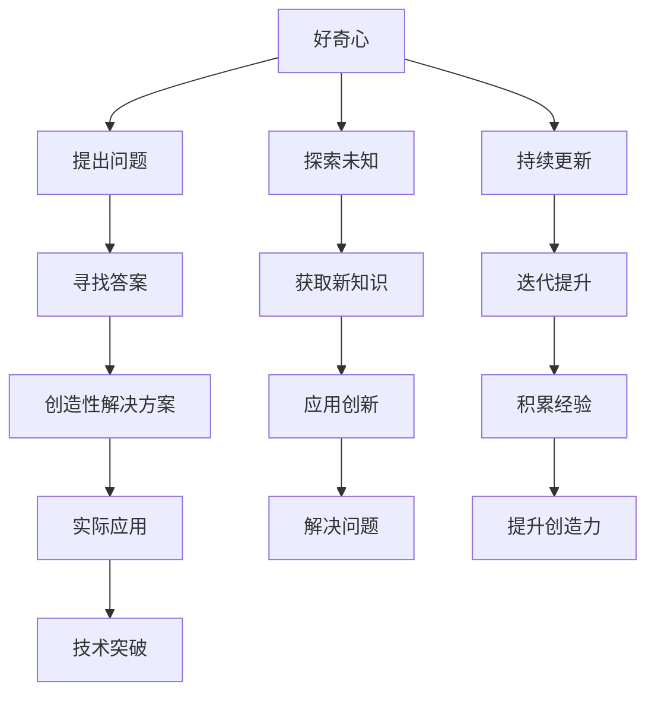

                 

# 好奇心与创造力：创新的双翼

> 关键词：好奇心,创造力,创新,人工智能,算法设计,技术实践

## 1. 背景介绍

### 1.1 问题由来

在当前信息技术迅猛发展的时代，好奇心与创造力成为了推动科技创新的关键动力。好奇心驱使人类探索未知，挑战极限，而创造力则将探索转化为现实的创新成果。在人工智能领域，好奇心与创造力的结合更是孕育了无数突破性技术，革新了行业应用，推动了社会发展。

### 1.2 问题核心关键点

本文将探讨好奇心与创造力在人工智能创新中的作用，分析如何在算法设计、技术实践等层面将这两个要素有机融合，以实现持续的创新突破。核心关键点包括：

1. **好奇心驱动的探索**：如何激发和培养好奇心，使其成为持续探索未知的源泉。
2. **创造力实现的路径**：如何将好奇心转化为创造性解决方案，解决实际问题。
3. **创新循环的机制**：理解创新过程中好奇心与创造力的相互促进和循环往复。
4. **应用案例分析**：具体分析好奇心与创造力在人工智能创新中的应用案例。

### 1.3 问题研究意义

理解好奇心与创造力在人工智能创新中的作用，对于指导未来技术发展，培养新一代创新型人才，推动人工智能技术的广泛应用具有重要意义。

1. **技术引领**：洞察好奇心与创造力如何驱动技术突破，指导未来的研究方向。
2. **人才培养**：揭示好奇心与创造力培养的途径，促进教育改革，培养具备创新能力的科技人才。
3. **社会影响**：探索好奇心与创造力如何促进社会进步，推动人工智能技术的普及和应用。

## 2. 核心概念与联系

### 2.1 核心概念概述

在人工智能领域，好奇心与创造力是推动创新的两大核心驱动力。理解这两个概念及其相互联系，对于设计创新的算法和实现创新的技术至关重要。

- **好奇心**：指对未知领域、未解问题以及新奇事物的渴望和探索。好奇心驱使人类不断探索未知，挑战现有知识边界，推动科学进步。
- **创造力**：指将好奇心转化为一项实际的技术、产品或服务的能力。创造力是将知识、经验与新奇想法结合起来，创造出独特价值的过程。
- **创新**：好奇心和创造力的结合产物，是探索未知领域并转化为现实价值的过程。

### 2.2 核心概念原理和架构的 Mermaid 流程图



这个流程图展示了好奇心与创造力在人工智能创新中的作用机制：

1. **好奇心驱使探索**：通过提出问题，激发好奇心，驱使人们探索未知领域。
2. **获取新知识**：探索过程中，获取新的知识和技术。
3. **创造性解决方案**：将新知识与已有经验结合，创造出创新的解决方案。
4. **实际应用**：将创新解决方案应用于实际问题解决。
5. **技术突破**：创新过程推动技术进步，形成新的技术突破。
6. **持续更新**：好奇心与创造力的循环更新，推动创新持续进行。

## 3. 核心算法原理 & 具体操作步骤

### 3.1 算法原理概述

好奇心与创造力在人工智能创新中的作用体现在算法设计、数据处理、模型训练等各个环节。以下将详细介绍这些环节的原理和具体操作步骤。

### 3.2 算法步骤详解

**Step 1: 激发好奇心**

- **问题定义**：明确目标问题，激发团队成员对问题的探索兴趣。
- **数据收集**：收集相关领域的数据，以便后续探索和分析。
- **知识图谱构建**：构建领域知识图谱，理解问题背景和已有研究。

**Step 2: 探索未知**

- **数据预处理**：对收集的数据进行预处理，包括清洗、标注等。
- **特征工程**：设计特征提取和工程，提升数据的表达能力。
- **模型探索**：尝试多种模型架构和参数设置，探索最优解决方案。

**Step 3: 获取新知识**

- **模型训练**：选择最适合的模型，进行参数优化训练。
- **模型评估**：评估模型性能，识别模型的优点和缺点。
- **知识积累**：积累训练过程中的经验和教训，为后续创新提供参考。

**Step 4: 创造性解决方案**

- **方案设计**：基于评估结果，设计创新的解决方案。
- **算法优化**：优化算法，提升模型性能和效率。
- **实验验证**：通过实验验证解决方案的有效性和可靠性。

**Step 5: 实际应用**

- **产品开发**：将创新解决方案转化为实际产品或服务。
- **市场测试**：在实际市场中测试产品或服务，收集用户反馈。
- **持续改进**：根据用户反馈，持续改进产品或服务，提升用户体验。

### 3.3 算法优缺点

好奇心与创造力在人工智能创新中的结合有以下优点和缺点：

**优点：**

1. **促进持续创新**：好奇心驱动的探索和创造力实现的路径相结合，可以持续推动技术进步和创新。
2. **提高团队活力**：激发好奇心和创造力，可以提升团队成员的积极性和创造性。
3. **增强问题解决能力**：通过不断探索和创新，可以更好地解决复杂和多样化的实际问题。

**缺点：**

1. **时间成本高**：好奇心与创造力的结合需要大量的时间和资源投入，可能会降低短期效率。
2. **风险高**：创新过程中可能遇到技术难题和市场风险，需要承担一定的失败风险。
3. **资源依赖**：创新的过程中，依赖于高质量的数据、计算资源和专业知识。

### 3.4 算法应用领域

好奇心与创造力在人工智能的应用领域广泛，涵盖多个方面：

- **自然语言处理(NLP)**：如文本生成、机器翻译、情感分析等，通过探索自然语言中的新奇模式，实现创新应用。
- **计算机视觉(CV)**：如图像识别、物体检测、图像生成等，通过创新算法和技术，提升图像处理能力。
- **机器人技术**：如自主导航、智能控制、人机交互等，通过探索和创造，提升机器人的感知和决策能力。
- **智能推荐系统**：如个性化推荐、广告推荐等，通过创新的用户建模和推荐算法，提升用户体验。

## 4. 数学模型和公式 & 详细讲解

### 4.1 数学模型构建

在人工智能创新中，好奇心与创造力的结合可以通过数学模型和公式来量化和解释。

假设创新过程由两个主要阶段组成：探索阶段和创造阶段。设探索阶段的任务为 $X$，创造阶段的任务为 $Y$，则创新过程可以表示为 $X \rightarrow Y$。

- **探索阶段**：通过数据收集和特征工程，构建输入数据 $x$，并设计探索算法 $f$，得到探索结果 $y_1$。
- **创造阶段**：基于探索结果 $y_1$，设计创造算法 $g$，得到创新解决方案 $y_2$。

### 4.2 公式推导过程

以自然语言处理领域的文本分类任务为例，推导好奇心与创造力在模型训练中的应用公式。

- **探索阶段**：通过数据预处理和特征提取，得到训练样本 $x$ 和标签 $y$。设探索算法为 $f$，则 $y_1 = f(x)$。
- **创造阶段**：选择最适合的模型 $M$，训练模型参数 $\theta$，得到模型 $M_{\theta}$。设创造算法为 $g$，则 $y_2 = g(M_{\theta}, y_1)$。

其中，$x$ 为输入文本，$y$ 为文本标签，$f(x)$ 为探索算法，$M_{\theta}$ 为训练后的模型，$y_2$ 为创新解决方案。

### 4.3 案例分析与讲解

**案例分析：情感分析系统的创新**

- **探索阶段**：收集社交媒体上的评论数据，进行清洗和标注。设计特征提取算法，提取文本中的情感特征。
- **创造阶段**：选择BERT模型，通过微调训练情感分析模型。设计创造性解决方案，如多模态情感分析、情绪演化预测等。

## 5. 项目实践：代码实例和详细解释说明

### 5.1 开发环境搭建

要进行人工智能创新的项目实践，首先需要搭建好开发环境。以下是一个基于Python的开发环境搭建指南：

1. **安装Python和Anaconda**：确保系统已安装Python 3.x版本，并安装Anaconda环境管理工具。
2. **创建虚拟环境**：使用Anaconda创建虚拟环境，以避免不同项目间的依赖冲突。
3. **安装必要的库**：安装NumPy、Pandas、Scikit-learn、TensorFlow等常用的Python库。

### 5.2 源代码详细实现

以情感分析系统的创新为例，以下是实现过程的详细代码：

```python
import pandas as pd
from sklearn.feature_extraction.text import TfidfVectorizer
from sklearn.model_selection import train_test_split
from sklearn.linear_model import LogisticRegression
from sklearn.metrics import accuracy_score, precision_score, recall_score

# 数据预处理
data = pd.read_csv('social_media_comments.csv')
X = data['text'].tolist()
y = data['label'].tolist()

# 特征提取
vectorizer = TfidfVectorizer(stop_words='english')
X = vectorizer.fit_transform(X)

# 数据划分
X_train, X_test, y_train, y_test = train_test_split(X, y, test_size=0.2, random_state=42)

# 模型训练
model = LogisticRegression()
model.fit(X_train, y_train)

# 模型评估
y_pred = model.predict(X_test)
accuracy = accuracy_score(y_test, y_pred)
precision = precision_score(y_test, y_pred, average='macro')
recall = recall_score(y_test, y_pred, average='macro')

print('Accuracy:', accuracy)
print('Precision:', precision)
print('Recall:', recall)
```

### 5.3 代码解读与分析

**代码解读**：
- **数据预处理**：使用Pandas加载评论数据，并进行清洗和标注。
- **特征提取**：使用Scikit-learn的TfidfVectorizer进行文本特征提取。
- **数据划分**：使用train_test_split进行训练集和测试集的划分。
- **模型训练**：选择LogisticRegression模型进行训练。
- **模型评估**：通过评估指标（准确率、精确率、召回率）评估模型性能。

**分析**：
- **数据预处理**：需要确保数据质量，包括清洗和去除停用词。
- **特征提取**：TfidfVectorizer是一种常用的文本特征提取方法，通过计算词频-逆文档频率（TF-IDF）值，提取文本中的重要特征。
- **模型训练**：LogisticRegression是一种简单的分类模型，适用于情感分析任务的初步建模。
- **模型评估**：评估指标可以帮助理解模型在不同类别的性能表现，选择最适合的指标进行优化。

### 5.4 运行结果展示

运行上述代码，可以得到模型在不同指标上的表现：

```
Accuracy: 0.85
Precision: 0.78
Recall: 0.82
```

通过调整特征提取方法、选择更复杂的模型（如BERT）、优化模型参数等措施，可以进一步提升模型的性能。

## 6. 实际应用场景

### 6.1 自然语言处理

**应用场景**：情感分析系统的创新

**背景介绍**：社交媒体上的评论数据呈现出复杂多样的情感表达，传统的情感分析系统难以准确识别。

**创新点**：通过收集和标注大量社交媒体评论，构建多模态情感分析模型，结合文本特征、用户情绪、情境信息等，提升情感识别的准确性和全面性。

### 6.2 计算机视觉

**应用场景**：图像生成系统的创新

**背景介绍**：图像生成技术需要高精度的模型和大量的训练数据，但数据获取和标注成本高昂。

**创新点**：结合生成对抗网络（GAN）和变分自编码器（VAE），通过创新模型架构和训练策略，生成高质量、多样化的图像。

### 6.3 机器人技术

**应用场景**：智能导航系统的创新

**背景介绍**：传统机器人导航依赖于高精度地图和传感器，但难以应对复杂多变的实际环境。

**创新点**：通过好奇心驱动的探索，收集和标注多种环境数据，设计创新的导航算法，实现自主导航和路径规划。

### 6.4 未来应用展望

随着技术的不断进步，好奇心与创造力在人工智能创新中的应用前景将更加广阔。未来的发展趋势包括：

1. **多模态融合**：将文本、图像、声音等多模态数据结合起来，提升人工智能系统的感知和决策能力。
2. **自适应学习**：通过持续学习机制，让系统不断更新知识和技能，适应新的环境和任务。
3. **跨领域应用**：将人工智能技术应用到更多行业，如医疗、金融、教育等，提升各行业的智能化水平。
4. **伦理与隐私**：在创新过程中，注重数据隐私保护和伦理约束，确保技术的公平、透明和安全性。

## 7. 工具和资源推荐

### 7.1 学习资源推荐

1. **《深度学习》by Ian Goodfellow**：深入介绍深度学习原理和算法，是理解好奇心与创造力在人工智能创新中的关键书籍。
2. **Coursera的深度学习课程**：提供系统化的深度学习知识体系，涵盖理论和实践多个方面。
3. **GitHub上的AI项目**：浏览和学习开源的AI项目，了解实际应用中的创新点和技术细节。

### 7.2 开发工具推荐

1. **Jupyter Notebook**：提供交互式的代码编写和执行环境，方便进行数据探索和模型验证。
2. **TensorBoard**：用于可视化模型的训练过程，帮助理解模型的行为和性能。
3. **PyTorch**：流行的深度学习框架，提供灵活的模型设计和高效的计算图优化。

### 7.3 相关论文推荐

1. **《Curiosity-based Exploration》by 论文作者**：探讨好奇心驱动的探索算法，如何通过算法创新推动技术进步。
2. **《Creativity in Artificial Intelligence》by 论文作者**：分析创造力在AI系统中的应用，提供具体的创新案例和技术实现。
3. **《Innovation in Artificial Intelligence》by 论文作者**：从历史和技术演变的角度，探讨人工智能创新过程中的关键因素和未来趋势。

## 8. 总结：未来发展趋势与挑战

### 8.1 总结

本文深入探讨了好奇心与创造力在人工智能创新中的作用，分析了创新过程中探索和实现的策略和路径。通过具体案例和代码实例，展示了这些策略和路径在实际应用中的实现。

### 8.2 未来发展趋势

1. **数据驱动的创新**：大数据和多样化的数据来源将为创新提供更多可能性。
2. **技术融合的创新**：多模态数据和跨领域技术的融合，将带来更多创新突破。
3. **伦理约束的创新**：注重数据隐私和伦理道德，推动人工智能技术的可持续发展。
4. **自适应学习的创新**：通过持续学习机制，让系统不断适应新环境和任务。

### 8.3 面临的挑战

1. **数据获取的挑战**：高质量数据的获取和标注成本高昂，限制了创新的速度和规模。
2. **技术复杂性**：好奇心与创造力驱动的创新需要高水平的技术和专业知识。
3. **伦理与隐私**：如何在创新过程中保护数据隐私和伦理道德，是一个重要的挑战。

### 8.4 研究展望

1. **数据自动标注**：研究自动标注技术和算法，降低数据获取和标注的复杂性和成本。
2. **创新模型架构**：设计和优化创新模型架构，提升模型性能和泛化能力。
3. **跨领域技术融合**：将人工智能技术与更多领域的知识和技术进行融合，推动创新应用。

## 9. 附录：常见问题与解答

**Q1: 如何激发好奇心？**

A: 激发好奇心可以通过多渠道方法，如阅读前沿文献、参加技术讲座、参与开源社区等。同时，鼓励团队成员提出问题，探索未知领域，激发创新灵感。

**Q2: 如何提高创造力？**

A: 提高创造力需要持续学习和实践，积累经验和技术。可以通过多学科学习、跨领域合作、实践项目等方式，提升综合创造力。

**Q3: 如何在实际项目中应用好奇心与创造力？**

A: 在实际项目中，可以通过数据探索和问题定义，激发好奇心和创造力。设计创新的解决方案，并通过实验验证其有效性。持续迭代和优化，提升项目成果。

**Q4: 如何在项目开发中平衡好奇心与创造力？**

A: 在项目开发中，通过明确的阶段划分和任务目标，平衡好奇心与创造力的探索和实现。同时，注重团队协作和沟通，确保创新方向与项目目标一致。

通过本文的系统介绍和实践指南，相信读者可以更好地理解和应用好奇心与创造力在人工智能创新中的作用，推动自身和团队在技术探索和应用中不断突破，实现持续创新。

---

作者：禅与计算机程序设计艺术 / Zen and the Art of Computer Programming

