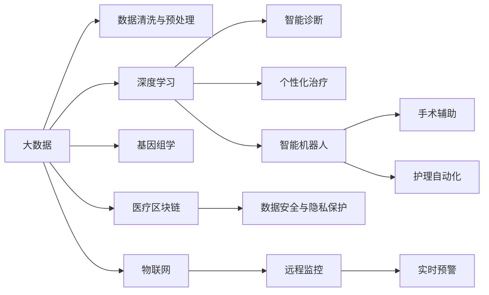

                 

## 1. 背景介绍

### 1.1 问题由来

医疗科技的创新是近年来受到广泛关注的一个热点领域。随着大数据、人工智能、物联网等技术的发展，医疗科技正逐步从传统的以经验为主导的模式，向以数据和技术驱动的模式转变。尤其是在新冠疫情的推动下，各国政府和企业纷纷投入大量资源，利用技术手段提升医疗服务质量，加速疾病预防、诊断和治疗等各个环节的智能化、数字化进程。

在这样一个背景下，如何利用技术能力进行医疗科技创新，成为了一个具有广泛研究价值的重要课题。本节将对医疗科技创新的背景和意义进行介绍，明确医疗科技创新的目标和方向。

### 1.2 问题核心关键点

医疗科技创新的核心在于如何利用先进的技术手段，提升医疗服务的质量和效率。当前，主要的创新方向包括：

- **疾病预防**：通过数据分析和建模，预测疾病的爆发趋势，提前采取预防措施。
- **智能诊断**：利用深度学习、计算机视觉等技术，辅助医生进行疾病诊断和影像分析。
- **个性化治疗**：通过基因组学、大数据分析等技术，为每个患者量身定制个性化的治疗方案。
- **医疗资源优化**：利用AI技术优化医院运营管理，提高医疗资源的利用效率。

医疗科技创新的成功与否，关键在于能否解决实际医疗问题，提升患者的治疗效果和生活质量。因此，本节将详细探讨如何利用技术能力实现这些目标。

### 1.3 问题研究意义

医疗科技创新的研究意义主要体现在以下几个方面：

1. **提高医疗服务质量**：利用技术手段，可以实现更精准的疾病预测、诊断和治疗，从而提高患者的治愈率和生存率。
2. **降低医疗成本**：智能化、数字化的医疗服务可以减少人力成本和时间成本，提升医疗资源的利用效率。
3. **推动健康医疗行业发展**：通过技术创新，可以带动医疗器械、药品、健康管理等多个领域的发展，促进产业升级。
4. **应对公共卫生挑战**：在新冠疫情等公共卫生事件中，技术手段可以发挥重要作用，提高应对能力和效率。

总之，医疗科技创新的研究不仅具有重要的学术价值，也具有重大的社会意义。通过对技术的深度应用和优化，可以有效解决医疗领域面临的诸多问题，推动医疗行业的全面升级。

## 2. 核心概念与联系

### 2.1 核心概念概述

医疗科技创新涉及多个关键概念，包括但不限于：

- **大数据**：通过收集、分析和应用大量的医疗数据，挖掘有价值的信息，支持医疗决策。
- **人工智能**：利用机器学习和深度学习等技术，辅助医生进行诊断和治疗。
- **物联网(IoT)**：通过连接医疗设备和传感器，实现对患者健康状况的实时监测和远程监控。
- **基因组学**：通过分析基因组数据，揭示疾病的遗传机制，为个性化治疗提供依据。
- **医疗区块链**：利用区块链技术，确保医疗数据的安全和隐私保护。
- **智能机器人**：利用自动化技术，辅助手术、护理等工作，提高医疗服务的智能化水平。

这些概念之间相互联系，共同构成了医疗科技创新的技术体系。通过理解这些核心概念，可以更好地把握医疗科技创新的本质和方法。

### 2.2 核心概念原理和架构的 Mermaid 流程图(Mermaid 流程节点中不要有括号、逗号等特殊字符)



这个流程图展示了医疗科技创新的核心概念及其相互关系。大数据是基础，通过数据清洗与预处理，支持深度学习模型的训练和应用。深度学习可以用于智能诊断和个性化治疗，同时智能机器人可以辅助手术和护理工作。基因组学和医疗区块链分别提供了数据和隐私保护的解决方案。物联网实现了实时监控和预警功能。这些概念共同构成了医疗科技创新的技术框架。

## 3. 核心算法原理 & 具体操作步骤

### 3.1 算法原理概述

医疗科技创新的核心算法原理可以归结为以下几个方面：

1. **数据驱动的决策支持**：通过收集和分析医疗数据，提供有价值的信息和建议，辅助医生进行决策。
2. **深度学习的智能诊断**：利用深度学习模型，对医疗影像、病历等数据进行分析，辅助医生进行诊断。
3. **基因组学的个性化治疗**：通过基因组学分析，揭示疾病的遗传机制，为患者量身定制个性化治疗方案。
4. **物联网的实时监测与预警**：利用物联网技术，实时监测患者的健康状况，及时发现异常并发出预警。
5. **医疗区块链的数据安全与隐私保护**：通过区块链技术，确保医疗数据的安全性和隐私保护。
6. **智能机器人的辅助治疗**：利用机器人技术，提高手术和护理的智能化水平。

这些算法原理共同构成了医疗科技创新的技术基础，是实现技术创新的关键。

### 3.2 算法步骤详解

医疗科技创新的一般步骤包括：

1. **数据收集与预处理**：收集与医疗相关的数据，包括电子病历、影像数据、基因组数据等，并进行清洗、标注和预处理。
2. **模型训练与优化**：利用深度学习模型对数据进行训练和优化，提高模型的准确性和泛化能力。
3. **智能应用开发**：将训练好的模型集成到医疗应用中，实现疾病预测、智能诊断、个性化治疗等功能。
4. **系统部署与优化**：将系统部署到实际医疗环境中，进行测试和优化，确保系统的稳定性和可靠性。
5. **效果评估与迭代**：定期评估系统的效果，进行必要的迭代和优化，提升系统的性能。

### 3.3 算法优缺点

医疗科技创新在带来诸多好处的同时，也存在一些缺点：

**优点**：
1. **提升医疗服务质量**：通过技术手段，可以实现更精准的诊断和治疗，提升患者的治愈率和生存率。
2. **降低医疗成本**：智能化、数字化的医疗服务可以减少人力成本和时间成本，提升医疗资源的利用效率。
3. **推动健康医疗行业发展**：通过技术创新，可以带动医疗器械、药品、健康管理等多个领域的发展，促进产业升级。

**缺点**：
1. **数据隐私和安全问题**：医疗数据涉及患者隐私，如果处理不当，可能导致数据泄露和安全问题。
2. **技术依赖性强**：医疗科技创新的效果依赖于技术的成熟度和应用效果，如果技术出现问题，可能导致系统失效。
3. **伦理和法律问题**：医疗科技创新的应用需要遵守伦理和法律规定，如果处理不当，可能导致法律纠纷和伦理争议。

### 3.4 算法应用领域

医疗科技创新的应用领域非常广泛，主要包括：

- **智能影像分析**：利用深度学习模型对医疗影像进行分析，辅助医生进行疾病诊断。
- **电子病历管理**：通过大数据分析，提供有价值的医疗信息支持，辅助医生进行诊断和治疗。
- **个性化治疗**：通过基因组学分析，为每个患者量身定制个性化的治疗方案。
- **手术辅助机器人**：利用机器人技术，提高手术的精度和安全性，减少手术风险。
- **健康管理**：利用物联网技术，实时监测患者的健康状况，提供个性化的健康建议。
- **远程医疗**：通过远程监控和诊疗，提升医疗服务的可及性和便利性。

## 4. 数学模型和公式 & 详细讲解 & 举例说明

### 4.1 数学模型构建

医疗科技创新涉及多个数学模型，包括但不限于：

- **回归模型**：用于疾病预测和健康管理，如线性回归、逻辑回归等。
- **分类模型**：用于疾病诊断和分类，如支持向量机(SVM)、随机森林(Random Forest)等。
- **聚类模型**：用于患者分组和健康管理，如K-means聚类、层次聚类等。
- **时间序列模型**：用于疾病预测和趋势分析，如ARIMA模型、LSTM模型等。
- **图网络模型**：用于患者和疾病之间的关联分析，如GNN模型等。

这些数学模型通过不同的算法原理和计算方式，支持医疗科技创新的各个环节。

### 4.2 公式推导过程

以回归模型为例，进行简单的公式推导过程。

假设有一个线性回归模型 $y=f(x;\theta)=\theta_0+\theta_1x_1+\theta_2x_2+\cdots+\theta_nx_n$，其中 $\theta=(\theta_0,\theta_1,\theta_2,\cdots,\theta_n)^T$。给定训练集 $D=\{(x_i,y_i)\}_{i=1}^N$，其中 $x_i=(x_{i1},x_{i2},\cdots,x_{in})^T$，$y_i\in\mathbb{R}$。

最小二乘法下的回归系数求解公式为：

$$
\theta = \mathop{\arg\min}_{\theta} \sum_{i=1}^N (y_i-f(x_i;\theta))^2
$$

将 $f(x_i;\theta)$ 代入上式，得：

$$
\theta = \mathop{\arg\min}_{\theta} \sum_{i=1}^N (y_i-\theta_0-\theta_1x_{i1}-\theta_2x_{i2}-\cdots-\theta_nx_{in})^2
$$

利用求导数的方法，可以得到最优回归系数 $\theta$ 的求解公式：

$$
\theta = (X^TX)^{-1}X^Ty
$$

其中 $X=(\mathbf{1},x_1,x_2,\cdots,x_n)^T$，$y=(y_1,y_2,\cdots,y_n)^T$。

### 4.3 案例分析与讲解

以疾病预测为例，进行详细案例分析。

假设有一个医院，需要预测某种疾病的爆发趋势。医院收集了过去10年的月度数据，包括气温、湿度、空气质量等环境因素，以及患者数量和病情数据。通过数据分析，发现气温和湿度对疾病爆发有显著影响。

利用回归模型，可以对未来的疾病爆发趋势进行预测。首先，将气温、湿度、空气质量等环境因素作为输入特征，将患者数量和病情数据作为目标变量。其次，利用线性回归模型，对历史数据进行训练和预测。最后，根据预测结果，提前采取预防措施，降低疾病的爆发风险。

## 5. 项目实践：代码实例和详细解释说明

### 5.1 开发环境搭建

在进行医疗科技创新项目开发前，需要准备好开发环境。以下是使用Python进行TensorFlow开发的环境配置流程：

1. 安装Anaconda：从官网下载并安装Anaconda，用于创建独立的Python环境。

2. 创建并激活虚拟环境：
```bash
conda create -n tf-env python=3.8 
conda activate tf-env
```

3. 安装TensorFlow：根据CUDA版本，从官网获取对应的安装命令。例如：
```bash
conda install tensorflow
```

4. 安装各类工具包：
```bash
pip install numpy pandas scikit-learn matplotlib tqdm jupyter notebook ipython
```

完成上述步骤后，即可在`tf-env`环境中开始医疗科技创新项目的开发。

### 5.2 源代码详细实现

我们以智能影像分析为例，给出使用TensorFlow进行深度学习模型训练的PyTorch代码实现。

首先，定义数据处理函数：

```python
import numpy as np
import tensorflow as tf
from tensorflow.keras.preprocessing.image import ImageDataGenerator

def load_and_preprocess_data(data_dir, batch_size=32, shuffle=True):
    train_data = ImageDataGenerator(
        rescale=1./255,
        rotation_range=20,
        width_shift_range=0.2,
        height_shift_range=0.2,
        horizontal_flip=True
    )
    train_generator = train_data.flow_from_directory(
        data_dir,
        target_size=(256, 256),
        batch_size=batch_size,
        class_mode='categorical',
        shuffle=shuffle
    )
    return train_generator

# 定义模型
def create_model():
    model = tf.keras.Sequential([
        tf.keras.layers.Conv2D(32, (3, 3), activation='relu', input_shape=(256, 256, 3)),
        tf.keras.layers.MaxPooling2D((2, 2)),
        tf.keras.layers.Conv2D(64, (3, 3), activation='relu'),
        tf.keras.layers.MaxPooling2D((2, 2)),
        tf.keras.layers.Conv2D(128, (3, 3), activation='relu'),
        tf.keras.layers.MaxPooling2D((2, 2)),
        tf.keras.layers.Flatten(),
        tf.keras.layers.Dense(64, activation='relu'),
        tf.keras.layers.Dense(2, activation='softmax')
    ])
    return model
```

然后，定义训练和评估函数：

```python
from tensorflow.keras.callbacks import EarlyStopping

def train_model(model, train_data, validation_data, epochs=10, batch_size=32):
    early_stopping = EarlyStopping(patience=3, restore_best_weights=True)
    model.compile(optimizer='adam', loss='categorical_crossentropy', metrics=['accuracy'])
    model.fit(train_data, validation_data=validation_data, epochs=epochs, batch_size=batch_size, callbacks=[early_stopping])
    model.save_weights('best_model.h5')

def evaluate_model(model, test_data, batch_size=32):
    test_loss, test_acc = model.evaluate(test_data, batch_size=batch_size)
    print('Test Loss:', test_loss)
    print('Test Accuracy:', test_acc)
```

最后，启动训练流程并在测试集上评估：

```python
train_data = load_and_preprocess_data('train_data')
validation_data = load_and_preprocess_data('validation_data')
test_data = load_and_preprocess_data('test_data')

model = create_model()

train_model(model, train_data, validation_data)
evaluate_model(model, test_data)
```

以上就是使用TensorFlow进行深度学习模型训练的完整代码实现。可以看到，TensorFlow提供了丰富的工具和函数，可以高效地实现模型的训练和评估。

### 5.3 代码解读与分析

让我们再详细解读一下关键代码的实现细节：

**load_and_preprocess_data函数**：
- 定义了一个ImageDataGenerator，用于数据增强和预处理。
- 利用该生成器，生成一个批次的数据，包含图像数据、标签数据等。

**create_model函数**：
- 定义了一个多层卷积神经网络模型，用于对医疗影像进行分类。
- 模型包括多个卷积层、池化层、全连接层等，用于提取特征并进行分类。

**train_model函数**：
- 定义了一个EarlyStopping回调函数，用于防止过拟合。
- 利用模型的compile方法，设置优化器、损失函数和评估指标。
- 使用fit方法进行模型训练，并设置验证集和回调函数。

**evaluate_model函数**：
- 使用evaluate方法在测试集上评估模型性能，输出测试损失和准确率。

**训练流程**：
- 加载训练数据、验证数据和测试数据。
- 创建模型并进行训练。
- 在验证集上评估模型性能，保存最佳模型权重。
- 在测试集上评估模型性能，输出最终结果。

可以看到，TensorFlow提供了便捷高效的工具，可以显著提升医疗科技创新项目的开发效率。开发者可以利用TensorFlow提供的丰富函数和API，快速实现模型的训练和评估。

## 6. 实际应用场景

### 6.1 智能影像分析

智能影像分析是医疗科技创新的重要应用场景之一。通过深度学习技术，可以对医疗影像进行自动化分析和诊断，提高诊断的准确性和效率。

具体而言，可以利用卷积神经网络(CNN)等深度学习模型，对医学影像进行分类、分割和检测。例如，可以对X光片、CT扫描、MRI等影像进行肿瘤检测、器官分割、病理分析等。这不仅能够显著提升医生的工作效率，还能减少误诊率，提高诊断质量。

### 6.2 电子病历管理

电子病历管理是医疗科技创新的另一个重要应用场景。通过大数据技术，可以对电子病历进行分析和挖掘，提供有价值的医疗信息支持。

具体而言，可以利用自然语言处理(NLP)技术，对电子病历中的文本数据进行结构化处理，提取有用的临床信息。例如，可以对病历中的症状、检查结果、诊断结论等进行分类和关联分析，生成健康报告和风险评估。这不仅能够帮助医生快速了解患者的病史和治疗情况，还能为医院管理提供决策支持。

### 6.3 个性化治疗

个性化治疗是医疗科技创新的重要目标之一。通过基因组学和大数据分析，可以为每个患者量身定制个性化的治疗方案。

具体而言，可以利用基因组测序技术，对患者的基因数据进行分析和比对，发现潜在的疾病基因和突变点。例如，可以利用机器学习模型，对基因数据进行分类和关联分析，生成个性化的治疗方案和药物推荐。这不仅能够提高治疗效果，还能减少副作用和不良反应，提升患者的生命质量。

### 6.4 未来应用展望

随着医疗科技创新的不断推进，未来的应用场景将会更加广泛和深入。以下是一些未来的应用展望：

- **远程医疗**：通过远程监控和诊疗，提升医疗服务的可及性和便利性。
- **健康监测**：利用物联网技术，实时监测患者的健康状况，提供个性化的健康建议。
- **智能手术**：利用机器人技术，提高手术的精度和安全性，减少手术风险。
- **药物研发**：利用大数据和AI技术，加速新药的发现和研发过程。
- **公共卫生管理**：利用AI技术，监测和预测疫情爆发趋势，提供决策支持。

总之，医疗科技创新的未来应用场景非常广泛，可以涵盖医疗服务的各个环节，提升医疗服务的质量和效率。

## 7. 工具和资源推荐

### 7.1 学习资源推荐

为了帮助开发者系统掌握医疗科技创新的理论基础和实践技巧，这里推荐一些优质的学习资源：

1. **《深度学习与医疗应用》系列博文**：由深度学习专家撰写，深入浅出地介绍了深度学习在医疗领域的应用，包括智能诊断、电子病历管理、个性化治疗等。

2. **Coursera《机器学习在医疗中的应用》课程**：斯坦福大学开设的在线课程，涵盖了机器学习在医疗领域的多个应用，如疾病预测、智能诊断、电子病历管理等。

3. **《医疗数据分析与统计》书籍**：详细介绍了医疗数据分析的原理和方法，包括回归分析、分类分析、聚类分析等。

4. **Kaggle医疗数据集**：提供丰富的医疗数据集，如X光片、MRI影像、电子病历等，供开发者进行研究和竞赛。

5. **TensorFlow医疗应用指南**：TensorFlow官方提供的医疗应用指南，详细介绍了TensorFlow在医疗领域的应用，包括模型训练、数据处理、系统部署等。

通过对这些资源的学习实践，相信你一定能够快速掌握医疗科技创新的精髓，并用于解决实际的医疗问题。

### 7.2 开发工具推荐

高效的开发离不开优秀的工具支持。以下是几款用于医疗科技创新开发的常用工具：

1. **TensorFlow**：基于Python的开源深度学习框架，适合大规模工程应用。提供丰富的API和工具，支持深度学习模型的训练和部署。

2. **PyTorch**：基于Python的开源深度学习框架，灵活易用，适合研究实验。提供自动微分和动态计算图等功能，支持复杂的模型结构和算法。

3. **Jupyter Notebook**：基于Web的交互式编程环境，适合数据处理、模型训练和结果展示。提供丰富的扩展工具和插件，支持代码共享和协作。

4. **Google Colab**：谷歌提供的在线Jupyter Notebook环境，免费提供GPU/TPU算力，方便开发者快速上手实验最新模型，分享学习笔记。

5. **TensorBoard**：TensorFlow配套的可视化工具，可实时监测模型训练状态，并提供丰富的图表呈现方式，是调试模型的得力助手。

合理利用这些工具，可以显著提升医疗科技创新项目的开发效率，加快创新迭代的步伐。

### 7.3 相关论文推荐

医疗科技创新涉及的学术研究非常广泛，以下是几篇奠基性的相关论文，推荐阅读：

1. **《利用深度学习进行医疗影像分析》**：介绍深度学习在医疗影像分析中的应用，如X光片分类、肿瘤检测等。

2. **《大数据在电子病历管理中的应用》**：探讨大数据技术在电子病历管理和健康监测中的应用，如症状分类、风险评估等。

3. **《基因组学在个性化治疗中的应用》**：介绍基因组测序技术在个性化治疗中的应用，如基因组关联分析、药物推荐等。

4. **《医疗人工智能的伦理和法律问题》**：讨论医疗人工智能在应用过程中面临的伦理和法律问题，如数据隐私、公平性等。

5. **《深度学习在疾病预测中的应用》**：介绍深度学习在疾病预测中的应用，如时间序列预测、回归模型等。

这些论文代表了大数据和深度学习在医疗科技创新中的应用方向，值得仔细研读。

## 8. 总结：未来发展趋势与挑战

### 8.1 研究成果总结

医疗科技创新在近年来取得了显著进展，主要体现在以下几个方面：

1. **技术进步**：深度学习、大数据、物联网等技术的不断发展，为医疗科技创新提供了强大的技术支持。
2. **应用广泛**：医疗科技创新的应用领域覆盖了疾病预测、智能诊断、个性化治疗等多个环节，提升了医疗服务的质量和效率。
3. **商业化进程**：越来越多的医疗科技公司进入市场，推动了医疗科技创新的商业化和产业化进程。
4. **伦理和社会影响**：医疗科技创新的应用带来了诸多伦理和社会问题，需要进一步研究和规范。

### 8.2 未来发展趋势

展望未来，医疗科技创新的发展趋势包括：

1. **技术融合**：深度学习、大数据、人工智能等技术的融合，将进一步提升医疗服务的智能化水平。
2. **跨学科合作**：跨学科的合作将推动医疗科技创新的突破，如数据科学、生物信息学、医学工程等领域的协同研究。
3. **全球化应用**：医疗科技创新的应用将逐步扩展到全球范围内，提升全球医疗服务的质量和可及性。
4. **智能化手术**：智能化手术机器人和系统将广泛应用于外科手术领域，提高手术的精度和安全性。
5. **健康监测**：物联网技术将广泛应用于健康监测和远程医疗，实现实时监控和预警。
6. **个性化治疗**：基因组学和AI技术将推动个性化治疗的发展，提升患者的生命质量。

### 8.3 面临的挑战

尽管医疗科技创新取得了显著进展，但仍面临诸多挑战：

1. **数据隐私和安全**：医疗数据涉及患者隐私，如果处理不当，可能导致数据泄露和安全问题。
2. **技术复杂性**：深度学习和大数据技术复杂度高，需要高水平的工程师和技术团队进行开发和维护。
3. **伦理和法律问题**：医疗科技创新的应用需要遵守伦理和法律规定，如果处理不当，可能导致法律纠纷和伦理争议。
4. **系统可靠性**：医疗科技创新的系统需要高可靠性和稳定性，否则可能导致误诊和医疗事故。
5. **用户接受度**：新技术的应用需要用户的接受和信任，否则难以大规模推广。

### 8.4 研究展望

面对医疗科技创新的诸多挑战，未来的研究需要在以下几个方面寻求新的突破：

1. **数据隐私和安全**：开发更加安全的数据加密和隐私保护技术，确保医疗数据的安全性和隐私性。
2. **技术可扩展性**：研究易于扩展和部署的技术架构，提升系统的灵活性和可扩展性。
3. **伦理和法律规范**：制定伦理和法律规范，确保医疗科技创新的应用符合伦理和法律要求。
4. **系统可靠性**：研究系统的鲁棒性和可靠性，确保医疗科技创新的系统稳定运行。
5. **用户接受度**：通过教育和宣传，提升用户对新技术的接受度和信任度，推动新技术的应用。

通过不断探索和创新，克服医疗科技创新的挑战，将使其更好地服务于医疗领域，提升医疗服务的质量和效率。

## 9. 附录：常见问题与解答

**Q1：如何选择合适的医疗数据集？**

A: 选择合适的医疗数据集是医疗科技创新的重要步骤。以下是一些选择医疗数据集的建议：

1. **数据质量**：优先选择高质量的数据集，数据应具有代表性和可靠性。
2. **数据规模**：选择数据规模较大的数据集，有助于训练更准确的模型。
3. **数据多样性**：选择包含多种类型数据的数据集，如影像数据、电子病历等，有助于提升模型的泛化能力。
4. **数据可得性**：选择公开可得的医疗数据集，如Kaggle、PubMed等，有助于避免数据获取困难和伦理问题。

**Q2：医疗科技创新的应用场景有哪些？**

A: 医疗科技创新的应用场景非常广泛，包括但不限于以下几个方面：

1. **智能影像分析**：利用深度学习技术对医疗影像进行分类、分割和检测，如X光片、CT扫描、MRI等。
2. **电子病历管理**：利用大数据技术对电子病历进行分析和挖掘，提取有用的临床信息，生成健康报告和风险评估。
3. **个性化治疗**：利用基因组学和大数据分析，为每个患者量身定制个性化的治疗方案。
4. **手术辅助机器人**：利用机器人技术提高手术的精度和安全性。
5. **健康监测**：利用物联网技术实时监测患者的健康状况，提供个性化的健康建议。
6. **远程医疗**：通过远程监控和诊疗，提升医疗服务的可及性和便利性。

**Q3：如何设计医疗科技创新的系统架构？**

A: 设计医疗科技创新的系统架构，需要考虑以下几个关键因素：

1. **数据管理**：建立完善的数据管理和存储机制，确保数据的完整性和安全性。
2. **模型训练**：选择合适的深度学习模型，进行训练和优化，提升模型的准确性和泛化能力。
3. **应用集成**：将训练好的模型集成到医疗应用中，实现疾病预测、智能诊断、个性化治疗等功能。
4. **系统部署**：将系统部署到实际医疗环境中，进行测试和优化，确保系统的稳定性和可靠性。
5. **用户界面**：设计友好易用的用户界面，方便医生和患者使用医疗科技创新系统。

总之，医疗科技创新的系统架构需要考虑数据、模型、应用、部署和用户界面等多个方面，合理设计才能确保系统的性能和效果。

**Q4：医疗科技创新的伦理和法律问题有哪些？**

A: 医疗科技创新的应用涉及诸多伦理和法律问题，以下是一些主要问题：

1. **数据隐私和安全**：医疗数据涉及患者隐私，如果处理不当，可能导致数据泄露和安全问题。
2. **公平性和可访问性**：医疗科技创新的应用需要确保公平性和可访问性，避免对某些群体造成不公平待遇。
3. **算法透明性和可解释性**：医疗科技创新的算法需要具有透明性和可解释性，确保医生和患者能够理解其决策过程。
4. **责任和法律风险**：医疗科技创新的应用需要明确责任和法律风险，避免因系统故障导致医疗事故。

**Q5：医疗科技创新的应用需要遵循哪些伦理和法律规范？**

A: 医疗科技创新的应用需要遵循以下伦理和法律规范：

1. **数据隐私保护**：遵守《数据隐私保护法》等法律法规，确保医疗数据的隐私和安全。
2. **公平性和可访问性**：确保医疗科技创新的应用具有公平性和可访问性，避免对某些群体造成不公平待遇。
3. **算法透明性和可解释性**：确保医疗科技创新的算法具有透明性和可解释性，确保医生和患者能够理解其决策过程。
4. **责任和法律风险**：明确医疗科技创新的责任和法律风险，避免因系统故障导致医疗事故。

总之，医疗科技创新的应用需要遵循伦理和法律规范，确保系统的公平性、透明性和安全性。

---

作者：禅与计算机程序设计艺术 / Zen and the Art of Computer Programming

