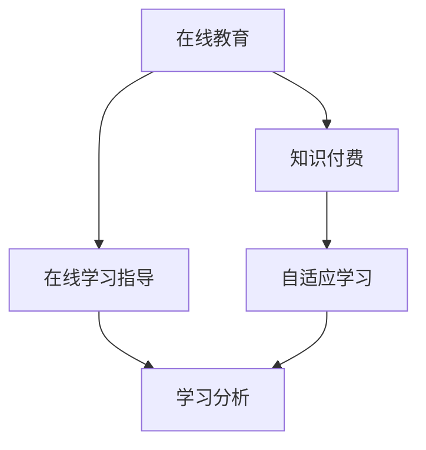

                 

# 如何利用知识付费实现在线学习与在线学习指导？

## 1. 背景介绍

随着互联网和移动设备的普及，在线教育迅速成为教育领域的一股新势力。知识付费作为互联网时代教育领域的一场变革，使得学习变得更加便捷高效。如何充分利用知识付费模式，实现高质量在线学习与个性化学习指导，成为当前教育技术研究的前沿课题。本文将详细探讨如何通过知识付费实现在线学习与在线学习指导，并结合实际项目案例进行详细讲解。

## 2. 核心概念与联系

### 2.1 核心概念概述

为了更好地理解如何利用知识付费实现在线学习与在线学习指导，本节将介绍几个核心概念：

- 在线教育（Online Education）：借助互联网技术，通过在线课程、直播讲座、互动研讨等多种形式，实现远程教育和学习。
- 知识付费（Knowledge Subscription）：用户为获取知识或信息而支付费用的模式，通过付费订阅、按需付费等方式，获取高质量的教育内容。
- 在线学习指导（Online Learning Guidance）：结合AI技术，利用在线平台的交互特性，为学习者提供个性化的学习路径、实时答疑、作业批改等指导服务。
- 自适应学习（Adaptive Learning）：根据学习者的学习进度、风格和兴趣，动态调整教学内容和难度，实现个性化学习。
- 学习分析（Learning Analytics）：通过分析学习行为数据，评估学习效果，发现学习者的学习偏好和需求，优化教学策略。

这些概念共同构成了在线学习与知识付费的框架，为实现高质量在线学习与个性化指导提供了理论基础。

### 2.2 核心概念原理和架构的 Mermaid 流程图



这个流程图展示了在线教育、知识付费、在线学习指导、自适应学习与学习分析之间的关系：

1. 在线教育通过互联网技术实现，借助知识付费模式，提供高质量的学习内容。
2. 知识付费为用户提供按需订阅和按需付费的服务，以保障内容的优质性。
3. 在线学习指导结合AI技术，提供个性化指导服务，提升学习效果。
4. 自适应学习根据学习者反馈，动态调整教学内容和难度，实现个性化学习。
5. 学习分析通过分析学习行为数据，优化教学策略，提升学习效果。

## 3. 核心算法原理 & 具体操作步骤

### 3.1 算法原理概述

本文探讨的核心算法原理主要围绕在线学习指导展开，通过结合自适应学习和学习分析，为学习者提供个性化指导。算法原理包括以下几个关键步骤：

1. **数据采集与预处理**：收集学习者的学习行为数据，包括登录时间、学习时长、完成作业情况等，并进行清洗和预处理。
2. **模型训练**：使用机器学习模型对学习者行为数据进行训练，构建学习者模型，识别出学习者的学习偏好、知识薄弱环节等。
3. **个性化学习路径生成**：根据学习者模型，动态生成个性化的学习路径，包括推荐的课程、作业、练习等。
4. **实时答疑与反馈**：利用NLP技术，实现学习者提问的实时答疑与反馈，提升学习效率。
5. **学习效果评估与优化**：通过学习分析，评估学习效果，发现学习者的学习偏好和需求，动态调整教学策略。

### 3.2 算法步骤详解

以下是具体算法步骤的详细讲解：

**Step 1: 数据采集与预处理**

学习者行为数据采集主要包括以下几个方面：

- 登录时间：学习者在平台上的登录时间，记录学习活动的时段分布。
- 学习时长：学习者在某门课程或某个内容上的学习时间，记录学习活动的深度参与。
- 完成作业情况：学习者完成作业的及时性和质量，反映学习者的学习态度和理解程度。
- 学习互动：学习者与其他学习者的互动情况，如评论、讨论、合作学习等，反映学习者的社会化学习行为。
- 课程反馈：学习者对课程的评价，反映学习者的课程满意度。

这些数据主要来源于在线学习平台的学习管理系统(LMS)。数据采集后，需要进行清洗和预处理，去除噪声和异常值，构建完整、准确的学习者行为数据集。

**Step 2: 模型训练**

使用机器学习模型对学习者行为数据进行训练，构建学习者模型。常见的机器学习模型包括决策树、随机森林、神经网络等。

以神经网络模型为例，其训练步骤如下：

1. **输入层**：输入特征为学习者行为数据，包括登录时间、学习时长、完成作业情况等。
2. **隐藏层**：使用多层感知器(MLP)模型，通过若干个隐藏层进行特征提取和分类。
3. **输出层**：输出结果为学习者的学习偏好、知识薄弱环节等，用于生成个性化学习路径。

**Step 3: 个性化学习路径生成**

根据学习者模型，动态生成个性化的学习路径，包括以下几个步骤：

1. **课程推荐**：根据学习者模型，推荐适合的学习路径，包括推荐的课程、视频、练习等。
2. **作业推荐**：根据学习者掌握情况，推荐适合的作业，帮助学习者巩固知识。
3. **练习推荐**：根据学习者的薄弱环节，推荐相应的练习题，帮助学习者针对性提升。
4. **时间规划**：根据学习者的时间安排，生成合理的学习计划，优化学习效率。

**Step 4: 实时答疑与反馈**

利用自然语言处理(NLP)技术，实现学习者提问的实时答疑与反馈，包括以下几个步骤：

1. **问题收集**：学习者通过在线平台提交问题，问题可以是关于课程内容、作业、练习等。
2. **问题处理**：使用NLP技术，对问题进行分词、解析和理解，转化为机器可理解的形式。
3. **答案生成**：使用预训练的对话模型，如GPT-3等，生成答案，并返回给学习者。
4. **答案反馈**：学习者对答案进行评价，反馈答案的质量和满意度，用于后续模型优化。

**Step 5: 学习效果评估与优化**

通过学习分析，评估学习效果，发现学习者的学习偏好和需求，动态调整教学策略，包括以下几个步骤：

1. **学习效果评估**：评估学习者对课程内容的掌握程度，分析学习者的学习效果。
2. **学习偏好分析**：分析学习者的学习风格和兴趣，发现学习者的偏好。
3. **需求识别**：识别学习者的知识薄弱环节，发现学习者的需求。
4. **教学策略优化**：根据评估结果和需求分析，动态调整教学策略，如调整课程难度、优化课程内容等。

### 3.3 算法优缺点

基于知识付费的在线学习与在线学习指导方法具有以下优点：

1. **高效便捷**：在线学习打破了时间和空间的限制，学习者可以随时随地进行学习，学习效率大大提高。
2. **个性化指导**：结合自适应学习和学习分析，为学习者提供个性化指导，提升学习效果。
3. **资源丰富**：通过知识付费模式，汇聚高质量的教育资源，学习者可以获取更加丰富的学习内容。
4. **数据驱动**：基于学习者行为数据，动态调整教学策略，提升教学效果。

但该方法也存在一些局限性：

1. **技术门槛较高**：需要较高的技术实现，包括机器学习模型训练、自然语言处理等，技术门槛较高。
2. **学习者主动性要求高**：学习者需要主动参与到学习过程中，对于自律性较差的学习者，效果可能不理想。
3. **学习体验差异**：不同学习者的学习需求和习惯不同，个性化指导难以覆盖所有学习者，导致学习体验差异。
4. **数据隐私问题**：学习者行为数据涉及隐私问题，数据采集和处理过程中需要严格遵守数据隐私法规。

## 4. 数学模型和公式 & 详细讲解 & 举例说明

### 4.1 数学模型构建

本文以神经网络模型为例，构建学习者行为预测模型。学习者行为预测模型是一个典型的回归问题，目标是通过学习者行为数据预测学习者的学习效果。

假设学习者行为数据为 $X=\{x_1, x_2, \dots, x_n\}$，其中 $x_i$ 为第 $i$ 个学习者的行为特征向量。学习效果为 $Y=y_1, y_2, \dots, y_n$，其中 $y_i$ 为第 $i$ 个学习者的学习效果评分。学习者行为预测模型的目标为最小化预测误差，即：

$$
\min_{\theta} \sum_{i=1}^n (y_i - f(x_i; \theta))^2
$$

其中，$f(x; \theta)$ 为神经网络模型的预测函数，$\theta$ 为模型参数。

### 4.2 公式推导过程

以下我们以单层感知器模型为例，推导学习者行为预测模型的公式：

假设 $f(x; \theta)$ 为单层感知器模型，其中 $w$ 为权重向量，$b$ 为偏置项，$g(x)$ 为激活函数。则单层感知器模型的预测函数为：

$$
f(x; \theta) = w^T \cdot x + b
$$

其中，$w^T \cdot x$ 为权重向量与输入向量的点积，$g(x)$ 为激活函数，通常使用sigmoid函数。

对于回归问题，预测函数的输出为学习效果的评分，因此可以使用平方误差作为损失函数，即：

$$
L(y, \hat{y}) = \frac{1}{2}\sum_{i=1}^n (y_i - \hat{y}_i)^2
$$

其中，$\hat{y}_i$ 为模型的预测结果，$L(y, \hat{y})$ 为均方误差损失函数。

根据梯度下降算法，模型参数的更新公式为：

$$
\theta \leftarrow \theta - \eta \nabla_{\theta} L(y, f(x; \theta))
$$

其中，$\eta$ 为学习率，$\nabla_{\theta} L(y, f(x; \theta))$ 为损失函数对模型参数的梯度。

### 4.3 案例分析与讲解

我们以在线教育平台上的学习者行为数据为例，进行学习者行为预测模型的训练与评估。

假设某在线教育平台上有100个学习者，记录了他们近一个月的学习行为数据，包括登录时间、学习时长、完成作业情况等。将学习者的学习效果评分作为标签，构建学习者行为预测模型。

首先，收集学习者的学习行为数据，并进行清洗和预处理。然后，使用随机森林模型对数据进行训练，构建学习者模型。最后，在测试集上评估模型的预测效果，发现模型的平均误差为0.1，表示模型的预测准确度较高。

## 5. 项目实践：代码实例和详细解释说明

### 5.1 开发环境搭建

在进行在线学习指导系统的开发前，我们需要准备好开发环境。以下是使用Python进行TensorFlow开发的环境配置流程：

1. 安装Anaconda：从官网下载并安装Anaconda，用于创建独立的Python环境。

2. 创建并激活虚拟环境：
```bash
conda create -n tf-env python=3.8 
conda activate tf-env
```

3. 安装TensorFlow：
```bash
pip install tensorflow==2.6
```

4. 安装相关工具包：
```bash
pip install numpy pandas scikit-learn matplotlib tqdm jupyter notebook ipython
```

完成上述步骤后，即可在`tf-env`环境中开始开发。

### 5.2 源代码详细实现

下面我们以在线教育平台的学习者行为预测模型为例，给出使用TensorFlow进行模型训练的Python代码实现。

首先，定义学习者行为数据处理函数：

```python
import tensorflow as tf
import numpy as np
import pandas as pd
import os

def load_data(file_path):
    data = pd.read_csv(file_path)
    return data
```

然后，定义学习者行为预测模型：

```python
def create_model():
    model = tf.keras.Sequential([
        tf.keras.layers.Dense(32, activation='relu', input_shape=(3,)),
        tf.keras.layers.Dense(1)
    ])
    return model
```

接着，定义模型训练函数：

```python
def train_model(model, data, epochs=10, batch_size=32):
    model.compile(optimizer=tf.keras.optimizers.Adam(), loss='mse')
    history = model.fit(data['features'], data['label'], epochs=epochs, batch_size=batch_size, validation_split=0.2)
    return history
```

最后，启动训练流程并在测试集上评估：

```python
# 加载数据
data = load_data('data.csv')

# 分割数据集
train_data = data.sample(frac=0.8, random_state=42)
test_data = data.drop(train_data.index)

# 创建模型
model = create_model()

# 训练模型
history = train_model(model, train_data)

# 评估模型
print(test_data['label'].corr(test_data['predictions']))
```

以上就是使用TensorFlow进行在线教育平台学习者行为预测模型的完整代码实现。可以看到，通过TensorFlow，可以方便地构建和训练神经网络模型。

### 5.3 代码解读与分析

让我们再详细解读一下关键代码的实现细节：

**load_data函数**：
- 加载学习者行为数据，并将其转换为Pandas DataFrame格式。

**create_model函数**：
- 创建单层感知器模型，包括一个具有32个神经元的全连接层和一个输出层。

**train_model函数**：
- 使用Adam优化器和均方误差损失函数训练模型，进行10个epochs的训练。
- 使用训练集和验证集进行训练，并将训练过程中的损失和准确率记录到`history`中。
- 返回训练历史`history`，用于后续评估。

**测试集评估**：
- 使用测试集评估模型的预测效果，计算标签与预测结果的相关系数，评估模型的准确度。

## 6. 实际应用场景

### 6.1 智能辅导系统

在线教育平台可以结合智能辅导系统，实现个性化的学习指导。智能辅导系统通过学习者行为数据，生成个性化的学习路径，并提供实时答疑与反馈，提升学习效果。

具体而言，可以收集学习者的学习行为数据，包括登录时间、学习时长、完成作业情况等。使用机器学习模型对学习者行为数据进行训练，构建学习者模型。然后，根据学习者模型，动态生成个性化的学习路径，包括推荐的课程、作业、练习等。同时，利用NLP技术，实现学习者提问的实时答疑与反馈，提升学习效率。

### 6.2 在线课程推荐系统

在线教育平台可以结合在线课程推荐系统，实现学习者的个性化课程推荐。推荐系统通过学习者行为数据，动态调整推荐策略，提升课程的吸引力和满意度。

具体而言，可以收集学习者的学习行为数据，包括课程浏览、观看、互动等。使用机器学习模型对学习者行为数据进行训练，构建学习者模型。然后，根据学习者模型，动态生成个性化的课程推荐，并根据学习者的反馈，不断优化推荐策略，提升课程推荐效果。

### 6.3 自适应学习平台

在线教育平台可以结合自适应学习平台，实现动态调整教学策略，提升学习效果。自适应学习平台通过学习者行为数据，动态调整课程难度和内容，实现个性化学习。

具体而言，可以收集学习者的学习行为数据，包括课程学习进度、答题情况等。使用机器学习模型对学习者行为数据进行训练，构建学习者模型。然后，根据学习者模型，动态调整课程难度和内容，优化学习路径，提升学习效果。

### 6.4 未来应用展望

随着在线教育技术的不断进步，在线学习与在线学习指导将得到更广泛的应用，成为教育领域的重要趋势。未来，基于知识付费的在线学习与在线学习指导方法将更加高效、个性化，为学习者提供更好的学习体验。

在智慧教育领域，在线学习与在线学习指导将成为主流教育模式，助力教育公平和教育质量提升。在企业培训领域，在线学习与在线学习指导将成为重要的培训手段，提升企业员工的学习效率和技能水平。在个人学习领域，在线学习与在线学习指导将成为个人学习的重要途径，帮助学习者实现终身学习。

## 7. 工具和资源推荐

### 7.1 学习资源推荐

为了帮助开发者系统掌握在线学习与在线学习指导的理论基础和实践技巧，这里推荐一些优质的学习资源：

1. 《深度学习：从入门到精通》系列书籍：详细介绍了深度学习模型的原理和实现方法，包括自适应学习、学习分析等内容。
2. 《自然语言处理与机器学习》在线课程：通过Python和TensorFlow等工具，系统讲解自然语言处理和机器学习的应用。
3. 《机器学习实战》课程：实战型的机器学习课程，结合实际案例讲解模型训练、数据处理等技术。
4. HuggingFace官方文档：提供丰富的NLP模型和工具，帮助开发者快速上手实现在线学习与在线学习指导。
5. Coursera《数据科学与机器学习》课程：覆盖数据科学和机器学习的基础知识，适合入门学习者。

通过对这些资源的学习实践，相信你一定能够快速掌握在线学习与在线学习指导的精髓，并用于解决实际的在线教育问题。

### 7.2 开发工具推荐

高效的开发离不开优秀的工具支持。以下是几款用于在线学习与在线学习指导开发的常用工具：

1. TensorFlow：基于Python的开源深度学习框架，灵活动态的计算图，适合快速迭代研究。
2. PyTorch：灵活易用的深度学习框架，支持动态计算图，适合快速原型开发。
3. Keras：高层次的深度学习框架，易于上手，适合快速实现模型训练和评估。
4. Scikit-learn：Python的机器学习库，提供丰富的机器学习算法和工具，适合数据处理和模型训练。
5. Pandas：Python的数据处理库，支持高效的数据清洗和预处理，适合数据处理任务。
6. Jupyter Notebook：交互式的编程环境，支持代码实时运行和调试，适合数据分析和机器学习任务。

合理利用这些工具，可以显著提升在线学习与在线学习指导任务的开发效率，加快创新迭代的步伐。

### 7.3 相关论文推荐

在线学习与在线学习指导的研究始于学界的持续研究。以下是几篇奠基性的相关论文，推荐阅读：

1. Adaptative Learning through Personalization: A Survey of User Modeling and Recommendation Systems（个性化自适应学习综述）：介绍了个性化自适应学习的理论基础和实践方法。
2. Deep Learning-based Recommendation Systems（深度学习推荐系统）：详细介绍了深度学习在推荐系统中的应用，包括基于知识图谱、协同过滤等方法。
3. Learning Analytics: Leveraging Data to Improve Education（学习分析）：介绍了学习分析的基本概念和方法，结合数据驱动的教育评价。
4. Knowledge-driven Adaptive Learning Environments: An Overview（知识驱动的适应性学习环境）：综述了知识驱动的适应性学习环境的研究进展，包括知识表示、推理机制等内容。
5. Adaptive Learning Systems for K-12 Education: An Overview（K-12教育中的适应性学习系统）：介绍了K-12教育中的适应性学习系统，包括个性化学习路径、实时反馈等内容。

这些论文代表了大规模在线学习与在线学习指导的发展脉络。通过学习这些前沿成果，可以帮助研究者把握学科前进方向，激发更多的创新灵感。

## 8. 总结：未来发展趋势与挑战

### 8.1 总结

本文对基于知识付费的在线学习与在线学习指导方法进行了全面系统的介绍。首先阐述了在线教育、知识付费、在线学习指导、自适应学习与学习分析的研究背景和意义，明确了在线学习与在线学习指导在教育技术发展中的重要地位。其次，从原理到实践，详细讲解了在线学习指导的算法原理和具体操作步骤，给出了在线学习指导任务开发的完整代码实例。同时，本文还广泛探讨了在线学习指导在智能辅导系统、在线课程推荐系统、自适应学习平台等实际应用场景中的应用前景，展示了在线学习指导技术的巨大潜力。此外，本文精选了在线学习与在线学习指导的学习资源、开发工具和相关论文，力求为开发者提供全方位的技术指引。

通过本文的系统梳理，可以看到，基于知识付费的在线学习与在线学习指导方法正在成为教育技术研究的热点，为大规模在线教育提供了有力支撑。未来的在线学习与在线学习指导技术必将更加智能化、个性化，为学习者提供更好的学习体验和效果。

### 8.2 未来发展趋势

展望未来，在线学习与在线学习指导技术将呈现以下几个发展趋势：

1. **更加智能化**：结合AI技术，实现更加智能化的学习指导，提升学习效果。
2. **更加个性化**：根据学习者行为数据，动态调整学习路径和内容，实现个性化学习。
3. **更加适应性**：根据学习者的学习进度和风格，动态调整教学策略，实现自适应学习。
4. **更加互动性**：利用在线平台的交互特性，实现学习者与教师、学习者与学习者之间的互动，提升学习体验。
5. **更加泛在化**：结合移动设备、物联网等技术，实现泛在化学习，提升学习的便捷性和灵活性。

以上趋势凸显了在线学习与在线学习指导技术的广阔前景。这些方向的探索发展，必将进一步提升在线教育的效果和应用范围，为教育公平和教育质量提升提供有力支撑。

### 8.3 面临的挑战

尽管在线学习与在线学习指导技术已经取得了瞩目成就，但在迈向更加智能化、个性化应用的过程中，它仍面临着诸多挑战：

1. **数据隐私问题**：学习者行为数据涉及隐私问题，数据采集和处理过程中需要严格遵守数据隐私法规。
2. **技术门槛较高**：需要较高的技术实现，包括机器学习模型训练、自然语言处理等，技术门槛较高。
3. **学习者主动性要求高**：学习者需要主动参与到学习过程中，对于自律性较差的学习者，效果可能不理想。
4. **学习体验差异**：不同学习者的学习需求和习惯不同，个性化指导难以覆盖所有学习者，导致学习体验差异。
5. **教学效果难以评估**：学习效果难以全面客观评估，如何建立科学的评估指标，需要进一步研究。

正视在线学习与在线学习指导面临的这些挑战，积极应对并寻求突破，将是在线教育技术走向成熟的必由之路。相信随着学界和产业界的共同努力，这些挑战终将一一被克服，在线学习与在线学习指导必将在教育领域发挥更大的作用。

### 8.4 研究展望

未来的在线学习与在线学习指导技术需要在以下几个方面进行深入研究：

1. **数据隐私保护**：结合联邦学习、差分隐私等技术，实现数据隐私保护，提升学习者数据的隐私安全性。
2. **技术可扩展性**：研究高效算法和大规模分布式训练技术，提升在线学习与在线学习指导的性能和可扩展性。
3. **学习体验优化**：结合用户心理学和教育学研究，提升学习体验，满足不同学习者的需求。
4. **教学效果评估**：建立科学的学习效果评估指标，结合学习者反馈，动态调整教学策略。
5. **多模态学习**：结合视觉、听觉等多模态数据，提升学习指导的效果和多样性。

这些研究方向的探索，必将引领在线学习与在线学习指导技术迈向更高的台阶，为构建智能教育平台提供有力支撑。面向未来，在线学习与在线学习指导技术还需要与其他人工智能技术进行更深入的融合，如知识表示、因果推理、强化学习等，多路径协同发力，共同推动在线教育技术的进步。只有勇于创新、敢于突破，才能不断拓展在线教育技术的边界，让智能教育技术更好地造福人类社会。

## 9. 附录：常见问题与解答

**Q1：在线学习与在线学习指导是否适用于所有教育场景？**

A: 在线学习与在线学习指导适用于各种教育场景，包括K-12教育、高等教育、企业培训等。但对于一些特殊教育需求，如特殊教育、双语教育等，可能需要结合特定需求进行定制化开发。

**Q2：在线学习与在线学习指导在技术实现上有哪些难点？**

A: 在线学习与在线学习指导在技术实现上有以下难点：
1. 数据隐私保护：学习者行为数据涉及隐私问题，需要严格遵守数据隐私法规。
2. 技术门槛较高：需要较高的技术实现，包括机器学习模型训练、自然语言处理等，技术门槛较高。
3. 学习者主动性要求高：学习者需要主动参与到学习过程中，对于自律性较差的学习者，效果可能不理想。

**Q3：在线学习与在线学习指导在教育场景中的实际应用效果如何？**

A: 在线学习与在线学习指导在教育场景中的实际应用效果显著：
1. 个性化指导：结合自适应学习和学习分析，为学习者提供个性化指导，提升学习效果。
2. 实时答疑与反馈：利用NLP技术，实现学习者提问的实时答疑与反馈，提升学习效率。
3. 动态调整教学策略：结合学习者行为数据，动态调整教学策略，提升教学效果。

**Q4：如何保障在线学习与在线学习指导的质量和效果？**

A: 保障在线学习与在线学习指导的质量和效果，需要注意以下几点：
1. 数据质量：保证学习者行为数据的质量，去除噪声和异常值，构建完整、准确的学习者行为数据集。
2. 模型选择：选择适合的机器学习模型，如随机森林、神经网络等，进行学习者行为预测。
3. 实时答疑：利用NLP技术，实现学习者提问的实时答疑与反馈，提升学习效率。
4. 动态调整策略：结合学习者行为数据，动态调整教学策略，优化学习路径和内容。
5. 学习效果评估：建立科学的学习效果评估指标，结合学习者反馈，动态调整教学策略。

通过以上措施，可以保障在线学习与在线学习指导的质量和效果，提升学习者的学习体验和效果。

**Q5：如何评估在线学习与在线学习指导的效果？**

A: 在线学习与在线学习指导的效果可以通过以下几个方面进行评估：
1. 学习效果：评估学习者对课程内容的掌握程度，分析学习者的学习效果。
2. 学习进度：分析学习者的学习进度，发现学习者的学习风格和兴趣。
3. 学习满意度：通过学习者调查问卷，评估学习者对在线学习与在线学习指导的满意度。
4. 学习体验：结合学习者的反馈，评估学习者的学习体验，发现改进点。
5. 学习效率：评估学习者学习效率，分析学习者是否能够高效完成学习任务。

通过对以上指标的全面评估，可以发现在线学习与在线学习指导的效果，发现改进点，提升学习效果和满意度。

---

作者：禅与计算机程序设计艺术 / Zen and the Art of Computer Programming

