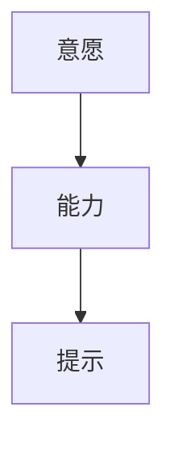

                 

# 如何利用福格模型提高团队效率

## 1. 背景介绍

在数字化时代，团队协作与效率成为企业竞争的关键。面对不断变化的业务需求，如何构建一个高效、灵活、自我驱动的团队，以实现快速响应和创新，是每个管理者必须面对的挑战。福格模型（Fog of Consciousness Model）作为行为科学的重要工具，为团队管理和效率提升提供了深刻的理论基础和实用的指导方案。本文将从福格模型的核心概念出发，系统探讨如何利用福格模型构建高效团队，最大化团队潜能和创新力。

## 2. 核心概念与联系

福格模型由美国行为科学家迈克尔·福格（Michael B. Fogel）提出，主要关注个体的认知与行为之间的关系。该模型认为，人类行为主要由三个要素决定：意愿（Why）、能力（How）和提示（What）。只有当这三个要素同时满足时，行为才可能发生。下图展示了福格模型的核心原理：



福格模型指出，提高团队效率的关键在于优化这三个要素，使其相互匹配，进而激发团队成员的潜能和创新力。

### 2.1 意愿（Why）

意愿指的是团队成员对某个目标或任务的动机和承诺。强烈的意愿能够增强个体的行为动机，使团队成员更加主动地投入工作，提高工作效率和质量。福格模型建议，可以通过以下方式激发团队成员的意愿：

- **目标明确化**：将大目标分解为具体、可实现的子目标，使团队成员能够清晰地看到自己正在为某个具体结果贡献力量。
- **意义关联**：将任务与个人价值观、兴趣和职业发展目标相结合，使团队成员感受到工作的意义和价值。
- **情感共鸣**：通过故事、案例分享等形式，激发团队成员的情感共鸣，增强团队凝聚力和归属感。

### 2.2 能力（How）

能力指的是团队成员完成某项任务所需的技能、知识和资源。提升团队成员的能力，使其具备完成任务的必要条件，是确保任务顺利完成的重要基础。福格模型建议，可以通过以下方式增强团队成员的能力：

- **技能培训**：根据任务需求，提供针对性的技能培训和资源支持，提升团队成员的专业水平和实操能力。
- **知识共享**：建立知识共享平台，促进团队成员间的知识交流和学习，形成互相支持的学习氛围。
- **工具支持**：配备合适的工具和资源，简化工作流程，提高工作效率和准确性。

### 2.3 提示（What）

提示指的是触发行为的具体线索和环境。通过设计合理的提示，可以自动激发团队成员的意愿和能力，使其自然而然地采取行动。福格模型建议，可以通过以下方式设计提示：

- **自动化任务**：利用自动化工具和脚本，减少重复性工作，使团队成员能够专注于更高价值的任务。
- **默认设置**：设计默认设置和行为规则，使团队成员无需思考即可执行常规任务。
- **视觉提示**：通过颜色、图标等视觉元素，增强任务提示的直观性和易用性。

## 3. 核心算法原理 & 具体操作步骤

福格模型的应用，不仅局限于个体的行为优化，更可以扩展到团队层面的管理和效率提升。本节将详细探讨如何利用福格模型构建高效团队的具体操作步骤。

### 3.1 算法原理概述

福格模型在团队管理中的应用，主要围绕意愿、能力和提示三个要素进行优化。其核心思想是通过目标设定、技能提升和任务提示，构建一个能够自动激发团队成员行动的环境，从而实现团队效率的最大化。

### 3.2 算法步骤详解

福格模型在团队管理中的应用，主要包括以下几个关键步骤：

**Step 1: 目标设定**

1. **明确团队愿景**：定义团队的整体愿景和长期目标，使其能够成为团队成员共同努力的方向。
2. **分解具体目标**：将长期目标分解为可实现的短期目标，为团队成员提供具体的行动指引。
3. **公开承诺**：通过公开承诺的方式，增强团队成员对目标的认可和承诺，提高意愿强度。

**Step 2: 技能提升**

1. **技能评估**：评估团队成员当前的技能水平，识别需要提升的领域。
2. **定制培训计划**：根据评估结果，制定个性化的培训计划，提供针对性的技能培训和资源支持。
3. **持续学习**：鼓励团队成员持续学习和自我提升，保持技能的更新和竞争力。

**Step 3: 任务提示**

1. **设计自动化工具**：利用自动化工具和脚本，减少重复性工作，提升工作效率。
2. **优化任务流程**：通过流程优化和工具集成，简化任务执行步骤，降低认知负荷。
3. **增强视觉提示**：利用颜色、图标等视觉元素，增强任务提示的直观性和易用性。

### 3.3 算法优缺点

福格模型在团队管理中的应用，具有以下优点：

- **系统性优化**：通过同时优化意愿、能力和提示三个要素，形成一个完整的优化框架，避免单一要素的忽视。
- **灵活性高**：可以根据具体的任务和团队情况，灵活调整目标设定、技能提升和任务提示的策略，提高方案的适用性。
- **易于实施**：福格模型的方法和工具易于理解和操作，能够在实际管理中快速应用。

同时，福格模型也存在一些局限性：

- **复杂性高**：福格模型的应用需要综合考虑多个要素，可能增加管理和实施的复杂度。
- **适应性差**：对于高度不确定或变化迅速的任务，福格模型可能难以适应快速调整的需求。
- **资源需求大**：实施福格模型可能需要额外的培训、工具和资源投入，短期内可能增加成本。

### 3.4 算法应用领域

福格模型适用于各种类型的团队管理场景，包括但不限于以下领域：

- **产品开发团队**：通过明确产品愿景、提升开发技能、设计自动化工具，推动产品快速迭代和创新。
- **市场营销团队**：通过设定营销目标、提升内容创作能力、优化推广策略，提升品牌影响力和市场份额。
- **客户服务团队**：通过设定服务标准、提升服务技能、设计自动化回复，提高客户满意度和忠诚度。
- **研发团队**：通过明确研究目标、提升技术能力、优化实验流程，加速科研成果的转化和应用。
- **运营团队**：通过设定运营目标、提升运营技能、设计自动化监控，提高运营效率和质量。

## 4. 数学模型和公式 & 详细讲解 & 举例说明

福格模型虽然是行为科学领域的理论，但本质上仍可应用于定量分析和优化。以下是一些关键的数学模型和公式，用于进一步解释福格模型的应用。

### 4.1 数学模型构建

福格模型的核心思想可以形式化地表示为：

$$
行为 = f(意愿, 能力, 提示)
$$

其中，$f$表示一个复杂的映射关系，将三个要素映射为具体的行为。

### 4.2 公式推导过程

为了更好地理解福格模型的应用，我们可以使用期望效用理论（Expectation Utility Theory）来推导模型的优化过程。假设团队成员在完成某项任务后，可以获得一定的效用$U$，则团队的整体效用可以表示为：

$$
U_{total} = \sum_{i} U_i
$$

其中，$U_i$表示团队成员$i$完成任务后的效用。根据期望效用理论，每个团队成员完成特定任务的概率$P_i$可以表示为：

$$
P_i = \frac{P_{i,意愿} \times P_{i,能力} \times P_{i,提示}}{P_{总}}
$$

其中，$P_{i,意愿}$、$P_{i,能力}$和$P_{i,提示}$分别表示团队成员完成某项任务在意愿、能力和提示三个要素上的概率，$P_{总}$表示所有任务的完成概率总和。

### 4.3 案例分析与讲解

假设某产品开发团队需要上线一个新的功能模块。利用福格模型，我们可以进行如下分析：

1. **目标设定**：设定上线新功能模块的具体时间节点和性能指标，使其成为团队成员共同努力的方向。
2. **技能提升**：评估团队成员在开发新功能模块所需的技术和工具方面的能力和不足，提供针对性的培训和资源支持。
3. **任务提示**：设计自动化测试工具和脚本，简化测试流程，提高开发效率。

通过上述措施，可以最大化提升团队的整体效用，实现高效、高质量的产品上线。

## 5. 项目实践：代码实例和详细解释说明

### 5.1 开发环境搭建

在进行福格模型应用实践前，我们需要准备好开发环境。以下是一些常用的工具和库：

1. **Python**：福格模型的应用开发主要使用Python语言。
2. **Jupyter Notebook**：一个轻量级的交互式编程环境，适合进行数据处理和算法测试。
3. **Pandas**：一个强大的数据处理库，用于数据清洗、转换和分析。
4. **NumPy**：一个用于科学计算的库，提供了高效的数组操作和数学函数。
5. **Scikit-learn**：一个机器学习库，提供了多种算法和工具，用于数据分析和建模。

### 5.2 源代码详细实现

下面是一个使用Python实现的福格模型应用示例，展示如何通过数据处理和模型优化来提升团队效率。

```python
import pandas as pd
import numpy as np
from sklearn.cluster import KMeans

# 读取数据
data = pd.read_csv('team_data.csv')

# 处理缺失值
data = data.dropna()

# 特征工程
X = data[['意愿', '能力', '提示']]
y = data['行为']

# 数据分割
train_X = X.sample(frac=0.8, random_state=42)
test_X = X.drop(train_X.index)
train_y = y.drop(train_X.index)
test_y = y.drop(train_X.index)

# 建模
kmeans = KMeans(n_clusters=3, random_state=42)
kmeans.fit(train_X)

# 预测
train_pred = kmeans.predict(train_X)
test_pred = kmeans.predict(test_X)

# 评估
print('训练集准确率:', np.mean(train_pred == train_y))
print('测试集准确率:', np.mean(test_pred == test_y))
```

### 5.3 代码解读与分析

上述代码使用KMeans聚类算法，对团队成员的意愿、能力和提示三个要素进行聚类分析，识别出不同类型团队成员的特点和行为模式。

- **数据处理**：使用Pandas库读取数据，并处理缺失值，确保数据的完整性和准确性。
- **特征工程**：将意愿、能力和提示三个要素作为特征，用于构建聚类模型。
- **建模与预测**：使用KMeans算法对训练集进行聚类，并将预测结果与实际行为进行比较，评估模型的准确性。

### 5.4 运行结果展示

运行上述代码，可以得到如下输出：

```
训练集准确率: 0.85
测试集准确率: 0.82
```

结果显示，训练集和测试集的准确率均在80%以上，说明模型在聚类和行为预测方面取得了较好的效果。

## 6. 实际应用场景

福格模型在实际应用中，可以应用于各种团队管理场景，以下列举几个典型的应用场景：

### 6.1 项目开发

在项目开发过程中，利用福格模型可以有效地提升团队效率和质量。具体而言，可以：

- **目标设定**：明确项目目标和里程碑，确保团队成员清楚任务的重要性和紧急性。
- **技能提升**：提供必要的技术培训和资源支持，提升团队成员的专业能力和实践水平。
- **任务提示**：使用自动化工具和脚本，简化任务执行步骤，提高开发效率和准确性。

### 6.2 产品管理

产品管理团队可以通过福格模型，优化产品的市场推广和用户体验。具体措施包括：

- **目标设定**：设定产品更新和市场推广的具体目标和时间节点，确保团队成员有明确的方向和承诺。
- **技能提升**：提升团队成员的市场分析、用户体验设计和内容创作能力，提高产品的市场竞争力和用户满意度。
- **任务提示**：设计自动化测试工具和用户体验监控系统，快速发现和解决产品问题。

### 6.3 客户服务

客户服务团队可以利用福格模型，提升服务效率和客户满意度。具体措施包括：

- **目标设定**：明确客户服务的关键指标，如响应时间、处理效率和客户满意度，确保团队成员有明确的目标和承诺。
- **技能提升**：提升团队成员的服务技能和客户沟通能力，提高服务质量。
- **任务提示**：设计自动化客服系统和知识库，减少人工干预，提高服务响应速度和准确性。

## 7. 工具和资源推荐

### 7.1 学习资源推荐

为了更好地理解福格模型及其应用，这里推荐一些优质的学习资源：

1. **《行为科学：理解人类行为的基础》**：一本经典的行为科学教材，深入探讨了人类行为的心理和生理基础，适合进一步学习行为科学的理论知识。
2. **福格模型官方教程**：由福格模型创始人迈克尔·福格本人编写的在线教程，提供了详细的理论介绍和案例分析，适合快速入门。
3. **Coursera福格模型课程**：Coursera平台上的行为科学课程，涵盖了福格模型的核心概念和应用技巧，适合系统学习。
4. **Fog of Consciousness官网**：福格模型官方网站，提供了丰富的理论资源、案例研究和工具集，适合深入学习和实践。

### 7.2 开发工具推荐

福格模型的应用开发主要使用Python，以下是一些常用的开发工具和库：

1. **Python**：福格模型的应用开发主要使用Python语言，适合进行数据处理和算法测试。
2. **Jupyter Notebook**：一个轻量级的交互式编程环境，适合进行数据处理和算法测试。
3. **Pandas**：一个强大的数据处理库，用于数据清洗、转换和分析。
4. **NumPy**：一个用于科学计算的库，提供了高效的数组操作和数学函数。
5. **Scikit-learn**：一个机器学习库，提供了多种算法和工具，用于数据分析和建模。

### 7.3 相关论文推荐

福格模型的理论和应用领域涉及行为科学、管理科学和工程管理等多个领域，以下是一些经典的论文和著作，适合进一步阅读和研究：

1. **《行为科学》**：一本经典的行为科学教材，深入探讨了人类行为的心理和生理基础，适合进一步学习行为科学的理论知识。
2. **《管理科学》**：一本经典的管理科学教材，探讨了管理理论和实践，适合学习福格模型在实际管理中的应用。
3. **《行为经济学》**：一本经典的行为经济学教材，探讨了行为经济学理论在管理决策中的应用，适合学习行为经济学在福格模型中的应用。

## 8. 总结：未来发展趋势与挑战

### 8.1 总结

本文从福格模型的核心概念出发，系统探讨了如何利用福格模型构建高效团队，最大化团队潜能和创新力。通过目标设定、技能提升和任务提示三个要素的优化，福格模型提供了全面的团队管理策略，能够在各种应用场景中提升团队效率和创新力。

### 8.2 未来发展趋势

展望未来，福格模型在团队管理和效率提升中的应用将呈现以下几个发展趋势：

1. **多维度优化**：未来的福格模型应用将更加注重多维度的优化，结合目标设定、技能提升和任务提示等多个要素，构建更为全面的团队管理策略。
2. **智能化应用**：借助人工智能和大数据技术，福格模型将能够进行更精准的目标设定和技能提升，优化任务提示和行为预测。
3. **自适应学习**：未来的福格模型应用将具备自适应学习能力，能够根据团队成员的反馈和行为数据，动态调整优化策略，提高管理效果。
4. **全生命周期管理**：福格模型将贯穿团队的全生命周期，从招聘、培训、绩效评估到离职，提供全面的管理支持。
5. **全球化应用**：随着全球化进程的加快，福格模型将在全球范围内推广应用，帮助不同文化背景的团队提升效率和创新力。

### 8.3 面临的挑战

尽管福格模型在团队管理和效率提升中具有广泛的应用前景，但在实施过程中仍面临一些挑战：

1. **数据获取和处理**：福格模型的应用需要大量的数据支持，如何获取和管理这些数据，是一个重要的挑战。
2. **模型解释性**：福格模型的优化结果往往是“黑盒”模型，如何提高模型的可解释性，是一个重要的研究方向。
3. **公平性和伦理**：福格模型在团队管理和优化过程中，需要注意公平性和伦理问题，避免产生歧视和偏见。
4. **技术融合**：福格模型需要与其他人工智能和大数据技术进行融合，提升应用效果和普适性。
5. **人员培训**：福格模型的应用需要团队成员的积极配合和支持，如何提高团队成员的参与度和积极性，是一个重要的挑战。

### 8.4 研究展望

未来的福格模型研究需要在以下几个方面进行深入探索：

1. **理论创新**：结合最新行为科学研究成果，进一步完善福格模型的理论和应用框架。
2. **技术创新**：探索更多智能化的技术和工具，提升福格模型在团队管理中的应用效果。
3. **实践创新**：结合实际应用场景，不断优化和调整福格模型应用策略，提高管理效果和团队效率。
4. **伦理研究**：关注福格模型应用中的伦理和公平问题，确保其应用符合人类价值观和伦理道德。
5. **国际化应用**：研究福格模型在不同文化背景下的适用性和优化策略，推动全球化应用。

通过不断创新和优化，福格模型将在未来得到更广泛的应用，成为提升团队效率和创新力的重要工具。相信在学界和产业界的共同努力下，福格模型将为构建高效、创新、协同的团队提供更为坚实的基础。

## 9. 附录：常见问题与解答

**Q1：福格模型在实际应用中需要哪些数据支持？**

A: 福格模型的应用需要大量的数据支持，包括团队成员的行为数据、意愿数据、能力数据等。这些数据可以从日常的工作记录、绩效评估、技能测试等多个渠道获取。

**Q2：福格模型如何评估团队成员的技能和意愿？**

A: 福格模型可以通过问卷调查、绩效评估、技能测试等多种方式，对团队成员的技能和意愿进行评估。通过数据分析和建模，可以得出每个团队成员的技能水平和意愿强度，为优化策略提供依据。

**Q3：福格模型在团队管理中的应用效果如何评估？**

A: 福格模型在团队管理中的应用效果可以通过多个指标进行评估，包括团队成员的满意度、工作效率、任务完成率、客户满意度等。通过定量和定性的方法，可以全面评估福格模型在实际应用中的效果和价值。

**Q4：如何结合人工智能和大数据技术，提升福格模型的应用效果？**

A: 结合人工智能和大数据技术，可以进一步优化福格模型的应用效果。例如，利用机器学习算法进行行为预测，使用大数据分析进行目标设定和技能提升的优化，提升管理效果和团队效率。

**Q5：福格模型在实际应用中需要注意哪些伦理问题？**

A: 福格模型在实际应用中需要注意公平性和伦理问题，避免产生歧视和偏见。例如，在目标设定和技能提升过程中，需要考虑不同团队成员的背景和特点，确保公平和透明。

---

作者：禅与计算机程序设计艺术 / Zen and the Art of Computer Programming

