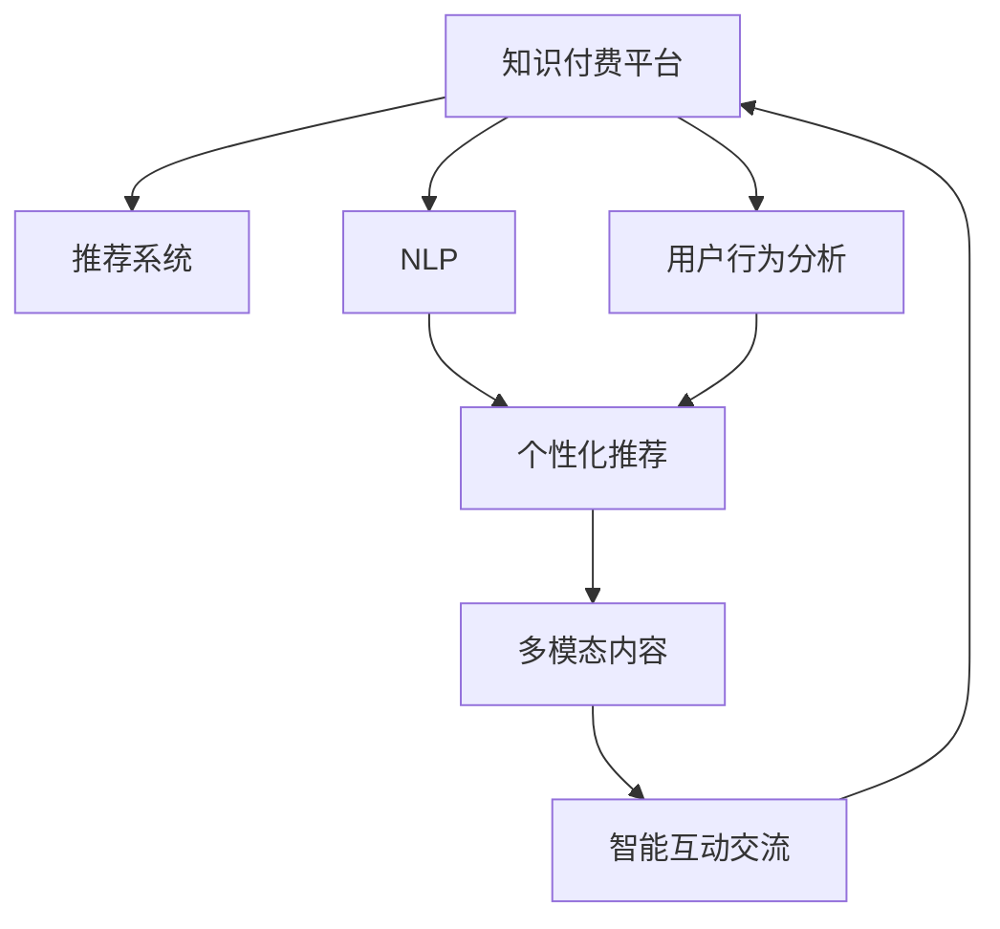

                 

# 如何提高知识付费产品的用户体验

在数字化时代，知识付费产品正逐渐成为主流学习渠道。其便捷性、高质量内容和个性化推荐等特性，深受广大用户喜爱。然而，随着竞争的加剧，用户对产品的要求也在不断提高。为满足用户需求，打造更加人性化和智能化的产品体验，本文将详细探讨如何通过技术手段提升知识付费产品的用户体验。

## 1. 背景介绍

### 1.1 问题由来

随着互联网技术的快速发展，知识付费行业呈现爆炸式增长。但随之而来的是同质化竞争、内容质量参差不齐、用户体验不佳等问题，导致了部分用户流失。为应对这些挑战，提升产品竞争力，知识付费平台纷纷在个性化推荐、互动交流、社区化构建等方面进行了大量探索。然而，如何系统性提升用户体验，将数据、算法、设计等元素有效融合，仍是一个值得深入研究的问题。

### 1.2 问题核心关键点

本文聚焦于以下几个核心关键点，探索如何通过技术手段改善知识付费产品的用户体验：

- **数据驱动个性化推荐**：通过用户行为数据，个性化推荐符合用户兴趣和需求的内容，提升内容获取效率和满意度。
- **智能互动交流**：利用自然语言处理、语音识别等技术，实现智能问答、对话生成等互动交流功能，提升用户粘性。
- **社区化构建**：通过用户反馈和互动数据，构建用户社区，促进用户间的知识分享和互助，增强用户归属感。
- **多模态内容呈现**：利用视频、音频、图像等多模态内容，丰富用户体验，提升学习效果。
- **用户行为监测与分析**：通过行为数据监测与分析，理解用户需求和行为模式，持续优化产品设计。

## 2. 核心概念与联系

### 2.1 核心概念概述

为更好地理解提升知识付费产品用户体验的技术手段，本文将介绍以下几个核心概念及其相互联系：

- **知识付费平台**：以在线付费形式提供知识内容的学习平台，如网易云课堂、得到、知乎live等。
- **推荐系统**：基于用户行为和内容特征，自动推荐相关内容的技术，如协同过滤、基于内容的推荐、矩阵分解等。
- **自然语言处理(NLP)**：涉及语音识别、文本分类、情感分析、对话生成等技术，提升产品的互动性和智能化水平。
- **用户行为分析**：通过用户行为数据挖掘和分析，理解用户需求和行为模式，优化产品设计和功能。
- **多模态内容**：利用视频、音频、图像等多模态内容，丰富学习体验，提升用户满意度。

这些核心概念通过以下Mermaid流程图，展示了它们之间的联系：



这个流程图展示了大语言模型和微调的基本框架，通过推荐系统实现个性化内容推荐，通过NLP技术提升互动交流的智能化水平，通过用户行为分析优化产品设计和功能，通过多模态内容丰富用户体验，最终构建一个完整的知识付费平台。

## 3. 核心算法原理 & 具体操作步骤

### 3.1 算法原理概述

提升知识付费产品用户体验的技术手段，可以归纳为以下几个主要算法原理：

1. **协同过滤推荐**：基于用户行为数据，通过寻找相似用户，推荐其喜欢的内容。

2. **基于内容的推荐**：分析内容特征，如文本关键词、主题标签等，推荐相似主题的内容。

3. **深度学习推荐模型**：如DeepFM、DNN、RNN等，通过多层神经网络学习用户行为和内容特征，提升推荐精度。

4. **NLP技术**：如BERT、GPT等预训练语言模型，进行文本分类、情感分析、对话生成等，提升互动交流的智能化水平。

5. **用户行为分析**：通过用户行为数据挖掘和分析，理解用户需求和行为模式，优化产品设计和功能。

6. **多模态内容呈现**：利用视频、音频、图像等多模态内容，丰富用户体验，提升学习效果。

7. **个性化推荐**：通过个性化推荐算法，根据用户偏好和行为，推荐符合用户需求的内容。

### 3.2 算法步骤详解

以下是对每个算法步骤的详细讲解：

1. **协同过滤推荐**

   - **步骤一**：收集用户行为数据，如浏览、点击、评分等。
   
   - **步骤二**：计算用户间的相似度，如余弦相似度、皮尔逊相关系数等。
   
   - **步骤三**：基于相似度，推荐用户喜欢的内容。
   
   - **步骤四**：周期性更新相似度矩阵，保持推荐精度。

2. **基于内容的推荐**

   - **步骤一**：提取内容特征，如关键词、主题标签等。
   
   - **步骤二**：计算内容相似度，如余弦相似度、TF-IDF等。
   
   - **步骤三**：根据用户兴趣和内容相似度，推荐相关内容。
   
   - **步骤四**：实时更新内容特征，保持推荐精度。

3. **深度学习推荐模型**

   - **步骤一**：构建深度学习模型，如DeepFM、DNN、RNN等。
   
   - **步骤二**：收集用户行为数据和内容特征，作为训练样本。
   
   - **步骤三**：训练深度学习模型，学习用户行为和内容特征。
   
   - **步骤四**：使用训练好的模型进行内容推荐。

4. **NLP技术**

   - **步骤一**：使用预训练语言模型，如BERT、GPT等，进行文本分类、情感分析、对话生成等。
   
   - **步骤二**：训练小样本数据，优化模型参数。
   
   - **步骤三**：将模型应用到产品中，提升互动交流的智能化水平。

5. **用户行为分析**

   - **步骤一**：收集用户行为数据，如浏览、点击、评分等。
   
   - **步骤二**：分析用户行为模式，理解用户需求。
   
   - **步骤三**：根据用户行为数据，优化产品设计和功能。
   
   - **步骤四**：周期性监测用户行为，持续优化产品。

6. **多模态内容呈现**

   - **步骤一**：收集视频、音频、图像等多模态内容。
   
   - **步骤二**：构建多模态内容库，丰富学习资源。
   
   - **步骤三**：根据用户偏好，推荐多模态内容。
   
   - **步骤四**：优化内容呈现方式，提升用户体验。

7. **个性化推荐**

   - **步骤一**：收集用户偏好数据，如浏览历史、评分等。
   
   - **步骤二**：根据用户偏好，推荐相关内容。
   
   - **步骤三**：实时更新推荐模型，保持推荐精度。
   
   - **步骤四**：优化推荐算法，提升推荐效果。

### 3.3 算法优缺点

提升知识付费产品用户体验的算法，主要存在以下优缺点：

**优点**：

- **个性化推荐**：通过数据分析和模型优化，能够提升内容的精准度，满足用户个性化需求。

- **智能互动**：利用NLP技术，提升互动交流的智能化水平，增加用户粘性。

- **多模态内容**：丰富学习资源，提升用户体验。

- **用户行为分析**：理解用户需求和行为模式，优化产品设计和功能。

- **快速迭代**：通过实时数据反馈和模型优化，能够快速调整产品策略，提升用户体验。

**缺点**：

- **数据隐私**：收集和分析用户行为数据，可能涉及隐私问题，需注意合规性和保护。

- **模型复杂度**：深度学习模型训练复杂度高，需较长时间和计算资源。

- **多模态内容的成本**：多模态内容制作和存储成本高，需合理控制。

- **算法复杂性**：算法复杂度较高，需专业知识和技能，可能存在误用和误导。

## 4. 数学模型和公式 & 详细讲解

### 4.1 数学模型构建

本节将使用数学语言对提升知识付费产品用户体验的技术手段进行更加严格的刻画。

记知识付费平台为 $P$，用户行为数据为 $D$，推荐系统为 $R$，内容库为 $C$。用户对内容 $c$ 的评分表示为 $r_{uc}$。用户 $u$ 和内容 $c$ 之间的相似度表示为 $s_{uc}$。

定义推荐系统的目标函数为：

$$
\min_{\theta} \sum_{u,c \in D} (r_{uc} - \theta_u^T s_{uc})^2
$$

其中 $\theta_u$ 为用户 $u$ 的推荐参数，$s_{uc}$ 为用户 $u$ 和内容 $c$ 的相似度表示。

### 4.2 公式推导过程

**协同过滤推荐公式推导**：

$$
\min_{\theta} \sum_{u,c \in D} (r_{uc} - \theta_u^T \sum_{v \in D} \frac{s_{vc}}{\sigma(s_{vc})} \theta_v)^2
$$

其中 $\sigma$ 为相似度函数，如余弦相似度、皮尔逊相关系数等。

**基于内容的推荐公式推导**：

$$
\min_{\theta} \sum_{u,c \in D} (r_{uc} - \theta_u^T f(c)^T)^2
$$

其中 $f(c)$ 为内容特征向量，如关键词、主题标签等。

**深度学习推荐模型公式推导**：

$$
\min_{\theta} \sum_{u,c \in D} (r_{uc} - \theta^T f(u,c)^T)^2
$$

其中 $\theta$ 为深度学习模型参数，$f(u,c)$ 为用户行为和内容特征的表示。

### 4.3 案例分析与讲解

以一个具体的推荐系统为例，进行详细讲解。

**案例背景**：

某知识付费平台收集了用户行为数据 $D$，如浏览历史、评分等。平台希望通过推荐系统 $R$，为用户 $u$ 推荐相关内容 $c$。

**步骤一**：构建协同过滤推荐模型，计算用户间的相似度 $s_{uv}$。

**步骤二**：根据相似度，计算用户 $u$ 对内容 $c$ 的评分预测值 $p_{uc}$。

**步骤三**：计算推荐误差 $e_{uc} = r_{uc} - p_{uc}$。

**步骤四**：最小化推荐误差，更新相似度矩阵。

通过以上步骤，平台可以不断优化推荐系统，提升推荐精度。

## 5. 项目实践：代码实例和详细解释说明

### 5.1 开发环境搭建

在进行推荐系统开发前，我们需要准备好开发环境。以下是使用Python进行TensorFlow开发的环境配置流程：

1. 安装Anaconda：从官网下载并安装Anaconda，用于创建独立的Python环境。

2. 创建并激活虚拟环境：
```bash
conda create -n tf-env python=3.8 
conda activate tf-env
```

3. 安装TensorFlow：根据CUDA版本，从官网获取对应的安装命令。例如：
```bash
conda install tensorflow -c conda-forge -c pytorch -c tensorflow -c anaconda
```

4. 安装各类工具包：
```bash
pip install numpy pandas scikit-learn matplotlib tqdm jupyter notebook ipython
```

完成上述步骤后，即可在`tf-env`环境中开始推荐系统开发。

### 5.2 源代码详细实现

下面我们以推荐系统开发为例，给出使用TensorFlow和Keras构建推荐模型的PyTorch代码实现。

首先，定义推荐系统模型：

```python
from tensorflow.keras.layers import Input, Embedding, Dot, Dense, Model
from tensorflow.keras.optimizers import Adam

def collaborative_filtering_model(num_users, num_items, embed_dim=100):
    user_input = Input(shape=(num_items,), name='user_input')
    item_input = Input(shape=(num_items,), name='item_input')

    # 用户和物品的嵌入层
    user_embedding = Embedding(input_dim=num_users, output_dim=embed_dim)(user_input)
    item_embedding = Embedding(input_dim=num_items, output_dim=embed_dim)(item_input)

    # 相似度矩阵
    dot_product = Dot(axes=2, normalize=True)([user_embedding, item_embedding])
    
    # 输出层
    output = Dense(1, activation='sigmoid')(dot_product)
    
    model = Model(inputs=[user_input, item_input], outputs=output)
    model.compile(optimizer=Adam(), loss='binary_crossentropy', metrics=['accuracy'])

    return model
```

然后，定义数据处理函数：

```python
def load_data(num_users, num_items, num_samples):
    user_ids = np.random.randint(0, num_users, size=num_samples)
    item_ids = np.random.randint(0, num_items, size=num_samples)
    rating = np.random.normal(loc=3, scale=0.5, size=num_samples)

    return pd.DataFrame({
        'user_id': user_ids,
        'item_id': item_ids,
        'rating': rating
    })
```

接着，训练模型并评估效果：

```python
# 加载数据
data = load_data(num_users=1000, num_items=1000, num_samples=10000)

# 训练模型
model = collaborative_filtering_model(num_users=1000, num_items=1000)
model.fit(x=[data['user_id'], data['item_id']], y=data['rating'], epochs=10, batch_size=128)

# 评估模型
test_data = load_data(num_users=1000, num_items=1000, num_samples=1000)
y_pred = model.predict([test_data['user_id'], test_data['item_id']])
print(classification_report(test_data['rating'], y_pred))
```

以上就是使用TensorFlow构建协同过滤推荐模型的完整代码实现。可以看到，利用Keras实现推荐模型非常简单，开发者可以专注于模型设计和优化。

### 5.3 代码解读与分析

让我们再详细解读一下关键代码的实现细节：

**协同过滤推荐模型**：

- 利用Embedding层对用户和物品进行向量表示。
- 通过Dot层计算用户和物品之间的相似度。
- 输出层进行评分预测，使用sigmoid激活函数输出0-1之间的评分。
- 使用Adam优化器和二分类交叉熵损失函数训练模型。

**数据处理函数**：

- 随机生成用户ID、物品ID和评分，模拟真实数据。
- 将数据封装成Pandas DataFrame格式，方便TensorFlow读取。

**模型训练和评估**：

- 加载训练数据和测试数据，输入模型进行预测。
- 使用classification_report函数，输出模型预测结果的准确率、召回率和F1-score等指标。

可以看到，利用TensorFlow和Keras，可以快速构建并训练推荐系统模型。开发者可以根据具体需求，灵活调整模型结构，进行优化调参。

## 6. 实际应用场景

### 6.1 智能互动交流

利用NLP技术，平台可以实现智能问答、对话生成等互动交流功能，提升用户粘性。

以智能问答为例，平台收集用户提问数据 $D$，使用BERT等预训练语言模型进行文本分类，识别问题类型。然后，使用GPT等模型生成答案，并与用户进行对话交流。

**具体流程**：

1. 收集用户提问数据 $D$。
2. 使用BERT等预训练模型进行文本分类，识别问题类型。
3. 使用GPT等模型生成答案。
4. 与用户进行对话交流。

通过以上流程，平台可以不断优化问答系统，提升互动交流的智能化水平。

### 6.2 社区化构建

通过用户反馈和互动数据，平台可以构建用户社区，促进用户间的知识分享和互助，增强用户归属感。

以知识社区为例，平台收集用户学习数据 $D$，构建用户画像 $P$，使用协同过滤推荐算法，推荐相关用户和内容。然后，用户可以在社区中进行知识分享、交流和互助。

**具体流程**：

1. 收集用户学习数据 $D$，构建用户画像 $P$。
2. 使用协同过滤推荐算法，推荐相关用户和内容。
3. 用户进行知识分享、交流和互助。

通过以上流程，平台可以构建活跃的用户社区，促进用户间的知识交流和互助，增强用户归属感。

### 6.3 多模态内容呈现

利用视频、音频、图像等多模态内容，平台可以丰富学习资源，提升用户体验。

以视频课程为例，平台收集视频数据 $V$，使用卷积神经网络进行图像特征提取，使用循环神经网络进行视频特征提取，使用文本分类模型进行课程分类。然后，根据用户偏好，推荐多模态内容。

**具体流程**：

1. 收集视频数据 $V$。
2. 使用卷积神经网络进行图像特征提取。
3. 使用循环神经网络进行视频特征提取。
4. 使用文本分类模型进行课程分类。
5. 根据用户偏好，推荐多模态内容。

通过以上流程，平台可以丰富学习资源，提升用户体验。

### 6.4 未来应用展望

随着推荐系统和NLP技术的不断发展，未来知识付费产品将更加智能化、个性化。以下是一些未来应用展望：

1. **智能学习助手**：结合推荐系统和NLP技术，构建智能学习助手，根据用户学习进度和偏好，自动推荐相关内容。

2. **个性化学习路径**：根据用户学习数据和行为模式，构建个性化学习路径，提升学习效果和用户体验。

3. **智能知识图谱**：构建知识图谱，提升内容结构的连通性和可理解性，增强用户对知识的掌握。

4. **互动学习平台**：结合推荐系统和互动交流功能，构建互动学习平台，提升用户参与度和互动效果。

5. **多模态学习平台**：结合多模态内容呈现，构建多模态学习平台，提升学习效果和用户满意度。

## 7. 工具和资源推荐

### 7.1 学习资源推荐

为了帮助开发者系统掌握知识付费产品的技术实现，这里推荐一些优质的学习资源：

1. 《推荐系统实战》：一本书全面介绍推荐系统的原理和实现方法，涵盖协同过滤、基于内容的推荐、深度学习推荐模型等。

2. 《自然语言处理入门》：一本书全面介绍自然语言处理的基本概念和技术，涵盖分词、词性标注、句法分析、情感分析等。

3. 《TensorFlow实战》：一本实战指南，介绍如何使用TensorFlow构建和优化推荐系统、问答系统等。

4. 《Keras实战》：一本实战指南，介绍如何使用Keras构建和优化深度学习模型。

5. 《用户行为分析与个性化推荐》：一篇综述性文章，全面介绍用户行为分析和个性化推荐的方法和实现。

通过对这些资源的学习实践，相信你一定能够快速掌握知识付费产品的技术实现，并用于解决实际的NLP问题。

### 7.2 开发工具推荐

高效的开发离不开优秀的工具支持。以下是几款用于知识付费产品开发的常用工具：

1. Python：Python语言简单易学，具有强大的数据处理和科学计算能力，是NLP和推荐系统开发的首选语言。

2. TensorFlow：由Google主导开发的开源深度学习框架，生产部署方便，适合大规模工程应用。

3. PyTorch：基于Python的开源深度学习框架，灵活动态的计算图，适合快速迭代研究。

4. Keras：基于TensorFlow的高级神经网络API，使用简单，快速实现深度学习模型。

5. Jupyter Notebook：一个开源的Web应用程序，支持Python、R、LaTeX等多种语言，适合数据科学和机器学习研究。

合理利用这些工具，可以显著提升知识付费产品开发的效率，加快创新迭代的步伐。

### 7.3 相关论文推荐

知识付费产品的发展源于学界的持续研究。以下是几篇奠基性的相关论文，推荐阅读：

1. Collaborative Filtering for Implicit Feedback Datasets：提出协同过滤算法，解决隐式反馈数据的推荐问题。

2. Neural Image Caption Generation with Visual Attention：提出使用注意力机制的图像描述生成模型，提升多模态内容的呈现效果。

3. A Neural Attention-Based Approach to Cold-Start Recommendation：提出使用注意力机制的冷启动推荐算法，解决新用户和新物品推荐问题。

4. Attention is All You Need：提出Transformer结构，开启了NLP领域的预训练大模型时代。

5. Neural Machine Translation by Jointly Learning to Align and Translate：提出使用注意力机制的机器翻译模型，提升多语言翻译的准确性和流畅性。

这些论文代表了大语言模型微调技术的发展脉络。通过学习这些前沿成果，可以帮助研究者把握学科前进方向，激发更多的创新灵感。

## 8. 总结：未来发展趋势与挑战

### 8.1 总结

本文对如何提升知识付费产品的用户体验进行了全面系统的介绍。首先阐述了提升用户体验的技术手段，明确了协同过滤推荐、NLP技术、用户行为分析、多模态内容、个性化推荐等方法的关键作用。其次，从原理到实践，详细讲解了推荐系统的构建过程，给出了推荐系统开发的完整代码实例。同时，本文还广泛探讨了知识付费产品未来的发展方向和应用前景，展示了知识付费产品的广阔发展空间。

通过本文的系统梳理，可以看到，利用技术手段提升知识付费产品用户体验，是大数据、人工智能等技术应用的重要方向。这些方向的探索发展，必将进一步提升知识付费产品的智能化水平，为数字化教育带来新的可能性。

### 8.2 未来发展趋势

展望未来，知识付费产品的发展趋势将呈现以下几个方向：

1. **智能化水平提升**：推荐系统和NLP技术的不断优化，将提升知识付费产品的智能化水平，使用户获取信息更加精准高效。

2. **个性化体验增强**：结合用户行为分析和个性化推荐算法，提升用户个性化体验，满足用户多样化需求。

3. **多模态内容融合**：结合多模态内容呈现，提升学习效果和用户体验。

4. **互动交流优化**：结合智能问答、对话生成等互动交流功能，提升用户参与度和互动效果。

5. **社区化构建**：构建知识社区，促进用户间的知识分享和互助，增强用户归属感。

6. **全场景应用**：结合云计算、物联网等技术，实现知识付费产品在教育、医疗、娱乐等全场景应用。

7. **多领域融合**：结合智慧城市、智能家居等技术，实现知识付费产品在更多领域的融合应用。

以上趋势凸显了知识付费产品的发展潜力，这些方向的探索发展，必将进一步提升知识付费产品的智能化水平，为数字化教育带来新的可能性。

### 8.3 面临的挑战

尽管知识付费产品的发展前景广阔，但在迈向更加智能化、普适化应用的过程中，仍面临诸多挑战：

1. **数据隐私问题**：收集和分析用户行为数据，可能涉及隐私问题，需注意合规性和保护。

2. **算法复杂度**：推荐系统和NLP技术的算法复杂度较高，需专业知识和技能，可能存在误用和误导。

3. **多模态内容的成本**：多模态内容制作和存储成本高，需合理控制。

4. **互动交流的智能化水平**：NLP技术在智能问答、对话生成等方面仍需进一步提升，以更好地满足用户需求。

5. **社区化的构建和管理**：知识社区的构建和管理需要大量时间精力，需有效吸引用户并保持活跃。

6. **个性化推荐的精度和效率**：个性化推荐的精度和效率是提升用户体验的关键，需不断优化模型和算法。

7. **多领域融合的技术难度**：知识付费产品在多个领域的应用，需要综合多种技术手段，实现多领域的协同优化。

这些挑战需要不断探索和解决，才能真正实现知识付费产品的大规模落地应用。

### 8.4 研究展望

面对知识付费产品面临的挑战，未来的研究需要在以下几个方面寻求新的突破：

1. **数据隐私保护**：研究和探索如何保护用户隐私，同时获取高质量的用户行为数据，平衡数据隐私和业务需求。

2. **算法优化和优化**：研究和探索如何优化推荐系统和NLP算法，提升算法的精度和效率，减少误用和误导。

3. **多模态内容管理**：研究和探索如何管理多模态内容，提高内容的可获取性和可用性。

4. **互动交流智能化**：研究和探索如何提升NLP技术在智能问答、对话生成等方面的智能化水平，更好地满足用户需求。

5. **社区化构建和管理**：研究和探索如何构建和管理知识社区，提高用户参与度和互动效果。

6. **个性化推荐优化**：研究和探索如何优化个性化推荐算法，提升推荐的精度和效率，更好地满足用户个性化需求。

7. **多领域融合技术**：研究和探索如何综合多种技术手段，实现知识付费产品在多个领域的应用。

这些研究方向的探索，必将引领知识付费产品迈向更高的台阶，为数字化教育带来新的可能性。面向未来，知识付费产品需要更多跨领域的协同创新，才能真正实现智能化、普适化的应用。

## 9. 附录：常见问题与解答

**Q1：如何平衡推荐精度和模型复杂度？**

A: 在推荐系统和NLP模型中，模型的复杂度和推荐精度是一对矛盾体。为平衡推荐精度和模型复杂度，可以采取以下措施：

1. **模型裁剪**：去除不必要的层和参数，减小模型尺寸，加快推理速度。

2. **模型压缩**：利用稀疏化、量化等技术，优化模型结构，减少计算资源占用。

3. **正则化**：使用L2正则、Dropout等技术，防止过拟合，提升模型泛化能力。

4. **数据增强**：通过数据增强、对抗训练等技术，提升模型鲁棒性和泛化能力。

5. **模型融合**：结合多个模型进行融合，提升推荐精度和模型泛化能力。

**Q2：如何提升智能问答系统的智能化水平？**

A: 提升智能问答系统的智能化水平，可以从以下几个方面进行优化：

1. **数据集选择**：选择多样化和高质量的问答数据集，训练模型时充分覆盖各种问题类型。

2. **预训练模型**：使用预训练模型如BERT、GPT等，进行文本分类和生成。

3. **模型优化**：利用深度学习模型如Transformer、LSTM等，提升模型的精度和效果。

4. **多轮对话**：结合多轮对话机制，提升问答系统的交互效果。

5. **上下文理解**：使用上下文编码器，提升问答系统的上下文理解能力。

6. **知识图谱**：结合知识图谱，提升问答系统的知识整合能力。

**Q3：如何提高知识社区的用户参与度和互动效果？**

A: 提高知识社区的用户参与度和互动效果，可以从以下几个方面进行优化：

1. **内容质量**：提供高质量和有价值的内容，吸引用户参与讨论。

2. **社区管理**：制定社区规则，构建良好的社区氛围，鼓励用户积极参与互动。

3. **推荐算法**：使用个性化推荐算法，推荐用户感兴趣的内容和用户，增加用户粘性。

4. **互动功能**：结合智能问答、对话生成等互动功能，提升用户互动效果。

5. **社区激励**：提供社区激励措施，如积分、奖励等，鼓励用户积极参与互动。

**Q4：如何优化个性化推荐算法的效率和效果？**

A: 优化个性化推荐算法的效率和效果，可以从以下几个方面进行优化：

1. **算法选择**：选择合适的推荐算法，如协同过滤、深度学习推荐模型等，根据具体任务选择。

2. **数据预处理**：对数据进行特征工程和预处理，提升数据质量和模型效果。

3. **模型压缩**：利用模型压缩技术，优化模型结构，提升模型效率。

4. **多模型融合**：结合多个模型进行融合，提升推荐精度和模型泛化能力。

5. **实时计算**：利用实时计算技术，提升推荐系统的响应速度和效果。

6. **数据更新**：定期更新数据，保持推荐系统的时效性和准确性。

**Q5：如何在多模态内容呈现中提升用户体验？**

A: 在多模态内容呈现中提升用户体验，可以从以下几个方面进行优化：

1. **内容丰富性**：提供多样化的内容形式，如视频、音频、图像等，满足用户的多样化需求。

2. **交互效果**：结合多模态内容，提升内容的交互效果，增强用户参与感。

3. **学习路径**：结合学习路径设计，提升用户的知识掌握效果。

4. **个性化推荐**：使用个性化推荐算法，推荐用户感兴趣的内容，提升用户体验。

5. **技术融合**：结合技术手段，如自然语言处理、语音识别等，提升内容的多模态呈现效果。

这些措施的实施，将有效提升知识付费产品的用户体验，帮助用户更好地学习和掌握知识。

