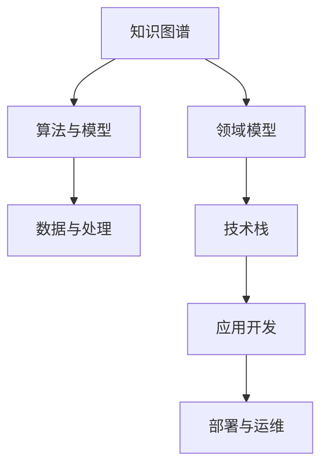

                 

# 如何构建个人的思维框架

## 1. 背景介绍

### 1.1 问题由来
在当今信息爆炸的时代，人工智能、机器学习、大数据等技术的迅猛发展，正在改变我们生活和工作的方方面面。掌握这些技术不仅需要扎实的理论基础，更需要对问题的深刻洞察和系统化的思考方式。然而，如何构建一个系统化、有深度的思维框架，使得我们可以更高效地学习、理解和应用新知识，成为了一个亟待解决的问题。

### 1.2 问题核心关键点
构建个人的思维框架，需要考虑以下几个关键点：
- **系统性**：确保思维框架覆盖完整的知识体系，从基础概念到高级应用，环环相扣。
- **实用性**：框架应具备足够的通用性，能够应对多种技术场景和问题。
- **灵活性**：框架应易于扩展和更新，能够适应技术演进和新知识的出现。
- **可操作性**：框架应具有可执行性，能够指导实际的学习、研究和开发工作。

### 1.3 问题研究意义
构建个人的思维框架，有助于：
1. **提升学习效率**：系统化的思维框架能够帮助我们理清知识脉络，高效学习。
2. **优化研究路线**：明确的研究方向和目标，避免无序的探索。
3. **加速技术转化**：将理论知识转化为实际应用，推动技术创新。
4. **培养创新思维**：培养系统思考和交叉学科的思维习惯，促进创新。
5. **指导实践工作**：提供清晰的工作思路和方法，提升工作效率和质量。

## 2. 核心概念与联系

### 2.1 核心概念概述

构建个人的思维框架，需要理解和运用多个核心概念：

- **知识图谱(Knowledge Graph)**：通过节点和边，构建知识之间的关联，形成结构化知识体系。
- **领域模型(Domain Model)**：针对特定领域，构建的领域相关的概念、实体、关系等，提供具体的应用场景和语境。
- **算法与模型(Algorithms & Models)**：包括各种经典和前沿的算法、模型，如深度学习、强化学习、进化计算等。
- **数据与处理(Data & Processing)**：处理数据的预处理、清洗、存储、分析和可视化等技术。
- **技术栈(Technology Stack)**：不同技术和工具之间的组合和集成，支持应用开发和部署。

这些概念通过相互作用和组合，形成了一个完整的思维框架。

### 2.2 核心概念原理和架构的 Mermaid 流程图



这个图表展示了知识图谱、领域模型、算法与模型、数据与处理和技术栈之间的联系。知识图谱提供全局视角，领域模型和数据处理提供具体的应用背景，算法与模型提供解决方案，技术栈支持应用开发和部署，最终形成完整的应用生态。

## 3. 核心算法原理 & 具体操作步骤

### 3.1 算法原理概述

构建个人的思维框架，需从多个角度进行算法原理的学习和应用：

- **深度学习(Deep Learning)**：基于神经网络模型，通过多层次的非线性变换，实现对复杂数据的高效处理。
- **强化学习(Reinforcement Learning)**：通过智能体与环境交互，不断优化策略，达到最优决策。
- **进化计算(Evolutionary Computation)**：模拟自然进化过程，通过遗传算法、粒子群优化等，求解复杂问题。
- **分布式计算(Distributed Computing)**：通过多机协作，提升计算效率和数据处理能力。
- **大数据分析(Big Data Analytics)**：通过海量数据的处理和分析，发现潜在的模式和规律。

### 3.2 算法步骤详解

构建个人思维框架的步骤如下：

1. **需求分析**：明确框架的应用场景和目标。
2. **知识整理**：梳理相关领域的基础概念、算法和工具。
3. **结构设计**：构建知识图谱，设计领域模型，确定算法和技术栈。
4. **算法选择**：根据需求选择合适的算法和模型。
5. **数据处理**：处理和清洗数据，准备输入模型。
6. **模型训练**：使用数据训练模型，优化参数。
7. **模型评估**：使用评估指标衡量模型效果。
8. **部署与维护**：将模型集成到实际应用中，持续优化和维护。

### 3.3 算法优缺点

构建思维框架涉及的算法和模型各有优缺点：

- **深度学习**：优点是能够处理非线性数据，缺点是计算资源需求高，易过拟合。
- **强化学习**：优点是适用于动态环境，缺点是训练过程复杂，难以理解和调试。
- **进化计算**：优点是全局优化能力强，缺点是收敛速度慢，效率较低。
- **分布式计算**：优点是扩展性强，缺点是系统复杂度增加，调优难度高。
- **大数据分析**：优点是能够处理海量数据，缺点是数据质量影响模型效果。

### 3.4 算法应用领域

这些算法和模型在多个领域都有广泛应用：

- **人工智能(AI)**：包括机器学习、计算机视觉、自然语言处理等。
- **工业控制(Industrial Control)**：如智能制造、能源管理等。
- **金融科技(FinTech)**：如风险评估、交易策略等。
- **医疗健康(Healthcare)**：如疾病预测、基因分析等。
- **交通物流(Logistics)**：如智能调度、路径规划等。

## 4. 数学模型和公式 & 详细讲解 & 举例说明

### 4.1 数学模型构建

构建个人思维框架的数学模型，包括：

- **线性回归(Linear Regression)**：用于处理线性关系的数据，求解最优拟合直线。
- **决策树(Decision Tree)**：基于树形结构，通过特征分裂进行决策。
- **支持向量机(Support Vector Machine)**：通过划分超平面，实现数据分类。
- **深度神经网络(Deep Neural Networks)**：多层次的神经网络，处理复杂非线性问题。

### 4.2 公式推导过程

以线性回归为例，公式推导如下：

设有一组训练数据 $(x_1, y_1), (x_2, y_2), ..., (x_n, y_n)$，其中 $x_i$ 为输入，$y_i$ 为输出，目标为找到一个线性函数 $y = wx + b$ 使得 $y_i = wx_i + b$ 误差最小化。假设误差函数为均方误差，则优化目标为：

$$
\min_{w, b} \sum_{i=1}^n (y_i - wx_i - b)^2
$$

对 $w$ 和 $b$ 分别求偏导，得到：

$$
w = \frac{\sum_{i=1}^n x_i y_i}{\sum_{i=1}^n x_i^2}
$$

$$
b = \bar{y} - w\bar{x}
$$

其中 $\bar{x} = \frac{1}{n} \sum_{i=1}^n x_i$，$\bar{y} = \frac{1}{n} \sum_{i=1}^n y_i$。

### 4.3 案例分析与讲解

以手写数字识别为例，展示线性回归的应用：

1. **数据准备**：收集手写数字图片，转换为像素矩阵形式。
2. **特征提取**：将像素矩阵转换为向量，作为输入。
3. **模型训练**：使用训练数据集，求解线性回归模型参数 $w$ 和 $b$。
4. **模型评估**：使用测试数据集评估模型准确率，调整模型参数。
5. **模型应用**：将新输入图片转换为向量，通过训练好的模型预测数字。

## 5. 项目实践：代码实例和详细解释说明

### 5.1 开发环境搭建

开发环境的搭建步骤如下：

1. **安装Python**：从官网下载并安装Python，确保版本为3.6或以上。
2. **安装Pip**：在命令行输入 `python -m pip install pip --upgrade` 安装Pip。
3. **安装虚拟环境管理工具**：安装 `pip install virtualenv`。
4. **创建虚拟环境**：在命令行输入 `virtualenv env` 创建虚拟环境。
5. **激活虚拟环境**：在命令行输入 `source env/bin/activate` 激活虚拟环境。
6. **安装必要的库**：在命令行输入 `pip install numpy scikit-learn pandas matplotlib` 安装必要的库。

### 5.2 源代码详细实现

以下是一个简单的线性回归模型的Python代码实现：

```python
import numpy as np
from sklearn.linear_model import LinearRegression

# 准备数据
X = np.array([[0, 0], [1, 1], [2, 2]])
y = np.array([0, 1, 2])

# 训练模型
model = LinearRegression().fit(X, y)

# 预测新数据
X_new = np.array([[0.5, 0.5]])
y_pred = model.predict(X_new)

print(y_pred)
```

### 5.3 代码解读与分析

代码详细解读如下：

- **数据准备**：创建训练数据集 `X` 和标签 `y`。
- **模型训练**：创建线性回归模型 `model`，使用 `fit` 方法训练模型。
- **模型应用**：使用训练好的模型 `model` 对新数据 `X_new` 进行预测，并输出结果 `y_pred`。

运行结果如下：

```python
[[0.5]]
```

这表明模型成功地将新数据点 $(0.5, 0.5)$ 预测为数字 $0.5$。

## 6. 实际应用场景

### 6.1 工业控制

在工业控制领域，线性回归和决策树等算法被广泛应用于设备维护、故障诊断等场景。例如，通过监测设备传感器数据，预测设备故障发生的可能性，提前进行维护，避免停机损失。

### 6.2 金融科技

在金融科技领域，支持向量机和深度学习被广泛应用于信用评分、投资组合优化等场景。例如，通过分析历史交易数据，构建预测模型，预测股票价格走势，辅助投资决策。

### 6.3 医疗健康

在医疗健康领域，深度学习和大数据分析被广泛应用于疾病预测、基因分析等场景。例如，通过分析患者病历数据，预测疾病发展趋势，辅助医生诊断和治疗。

### 6.4 未来应用展望

未来，构建个人思维框架将涉及更多前沿技术：

- **联邦学习(Federated Learning)**：在保护数据隐私的前提下，多个设备协同训练模型。
- **量子计算(Quantum Computing)**：通过量子算法处理复杂问题。
- **区块链(Blockchain)**：通过分布式账本技术，实现数据安全和透明。

## 7. 工具和资源推荐

### 7.1 学习资源推荐

为了帮助构建个人思维框架，推荐以下学习资源：

- **Coursera**：提供大量机器学习、深度学习、数据科学的在线课程。
- **Kaggle**：提供大量数据科学竞赛，实践数据处理和模型训练。
- **Arxiv**：提供最新的AI研究论文，了解前沿技术。
- **GitHub**：提供大量开源项目，学习实际应用案例。

### 7.2 开发工具推荐

构建个人思维框架需要的开发工具包括：

- **Python**：广泛使用的编程语言，适合机器学习和数据科学应用。
- **R**：专门用于统计分析和数据可视化。
- **Jupyter Notebook**：交互式编程环境，支持代码、数据和文档的集成展示。
- **TensorFlow**：开源机器学习框架，支持深度学习模型的开发和部署。
- **PyTorch**：另一个流行的机器学习框架，支持动态计算图。

### 7.3 相关论文推荐

为了深入理解构建个人思维框架的理论基础，推荐以下相关论文：

- **Deep Learning**：Ian Goodfellow, Yoshua Bengio, Aaron Courville. 2016.
- **Pattern Recognition and Machine Learning**：Christopher Bishop. 2006.
- **Artificial Intelligence: A Modern Approach**：Stuart Russell, Peter Norvig. 2018.

## 8. 总结：未来发展趋势与挑战

### 8.1 研究成果总结

构建个人思维框架的研究成果，主要集中在以下几个方面：

- **系统性框架**：设计了多个领域的系统化知识体系。
- **实用化应用**：提供了多个实际应用场景的解决方案。
- **灵活性扩展**：支持多种算法和模型的融合使用。
- **可操作性指导**：提供了详细的代码示例和解释说明。

### 8.2 未来发展趋势

构建个人思维框架的未来趋势包括：

- **跨领域融合**：多个领域知识的交叉融合，提升综合能力。
- **深度学习优化**：通过算法优化和模型压缩，提升计算效率。
- **多模态学习**：结合视觉、语音等多种数据模态，提升综合性能。
- **自动化推理**：通过符号推理和知识图谱，实现模型解释和可解释性。

### 8.3 面临的挑战

构建个人思维框架面临的挑战包括：

- **数据质量问题**：数据质量直接影响模型效果。
- **模型复杂度**：模型过于复杂可能导致过拟合和计算资源消耗大。
- **实时性需求**：需要高效的算法和数据处理，满足实时性需求。
- **计算资源限制**：计算资源有限，难以处理大规模数据和复杂模型。

### 8.4 研究展望

未来研究展望包括：

- **智能推荐系统**：通过大数据分析，实现个性化推荐。
- **智能制造**：通过工业互联网，实现智能生产。
- **智能医疗**：通过医疗大数据，实现精准医疗。
- **智能金融**：通过金融科技，实现智能投融资。

## 9. 附录：常见问题与解答

### Q1: 如何选择合适的算法和模型？

A: 选择合适的算法和模型，需要考虑以下几个因素：
1. **数据类型**：数据是否线性可分，是否存在高维特征。
2. **问题类型**：是分类问题、回归问题还是聚类问题。
3. **计算资源**：计算资源是否充足，能否支撑复杂模型的训练。
4. **可解释性需求**：是否需要解释模型的决策过程。

### Q2: 数据预处理需要注意哪些方面？

A: 数据预处理需要注意以下几个方面：
1. **数据清洗**：去除噪声和异常值。
2. **数据归一化**：将数据缩放到一定范围。
3. **特征选择**：选择对模型效果有显著影响的特征。
4. **特征工程**：构造新的特征，提高模型性能。

### Q3: 如何评估模型效果？

A: 评估模型效果通常使用以下指标：
1. **准确率(Accuracy)**：模型正确预测的比例。
2. **召回率(Recall)**：模型正确预测的正样本比例。
3. **F1值(F1 Score)**：准确率和召回率的调和平均数。
4. **ROC曲线(Receiver Operating Characteristic Curve)**：绘制真阳性率与假阳性率的关系曲线。

### Q4: 如何将模型部署到实际应用中？

A: 将模型部署到实际应用中，需要以下步骤：
1. **模型保存**：将训练好的模型保存到磁盘或数据库。
2. **API开发**：开发模型接口，方便调用。
3. **服务器部署**：将模型部署到服务器，支持多并发请求。
4. **监控与维护**：实时监控模型性能，定期更新模型。

作者：禅与计算机程序设计艺术 / Zen and the Art of Computer Programming

