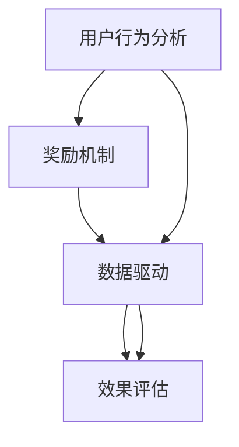

                 

# 如何进行有效的用户激励计划

> 关键词：用户激励计划,激励策略,用户行为分析,奖励机制,数据驱动

## 1. 背景介绍

在现代互联网应用中，用户激励计划（User Engagement Plan）已成为推动用户活跃、留存和转化的一大利器。无论是在电商平台、社交网络，还是在在线游戏、教育平台，激励机制都起着至关重要的作用。有效的用户激励计划可以显著提升用户参与度、满意度，增加业务收益，甚至在关键时刻挽救濒临失活的产品。然而，制定和执行一套真正有效的用户激励计划并非易事。本文将深入探讨用户激励计划的核心理念、设计原则、常用方法及其应用案例，帮助你构建出一套行之有效的激励机制。

## 2. 核心概念与联系

### 2.1 核心概念概述

用户激励计划是指通过一系列策略和措施，激励用户进行更多互动、增加使用频率、提升用户留存和转化的一种营销手段。有效的用户激励计划不仅能提升用户的满意度和忠诚度，还能为产品带来更多价值。

### 2.2 核心概念之间的联系

用户激励计划的核心概念之间存在着紧密的联系，如下：

- **用户行为分析**：通过对用户行为数据的分析，了解用户的兴趣、需求、习惯，为制定激励计划提供依据。
- **奖励机制**：设计适当的奖励形式（如积分、优惠券、虚拟物品等），以吸引用户进行特定行为。
- **数据驱动**：利用数据分析和A/B测试等方法，不断优化激励策略，确保其效果最大化。
- **效果评估**：通过设置明确的KPI（关键绩效指标），如用户活跃度、留存率、转化率等，评估激励计划的成效，并进行持续优化。

### 2.3 核心概念图示



以上图示展示了用户激励计划中各个核心概念之间的逻辑联系，通过循环迭代，不断优化激励机制，达到提升用户参与度的目标。

## 3. 核心算法原理 & 具体操作步骤

### 3.1 算法原理概述

用户激励计划的原理可以归纳为以下几个步骤：

1. **数据收集与处理**：收集用户行为数据，通过数据清洗、特征提取等技术进行处理。
2. **用户行为建模**：建立用户行为模型，预测用户未来的行为和需求。
3. **激励策略设计**：根据用户行为模型，设计适当的激励策略，以最大化用户的参与度和满意度。
4. **效果评估与优化**：通过KPI指标评估激励策略的效果，根据评估结果进行策略优化。

### 3.2 算法步骤详解

#### 3.2.1 数据收集与处理

数据收集与处理是激励计划的基础，其关键步骤包括：

- **数据来源**：日志数据、用户调研、社交媒体互动等。
- **数据清洗**：去除噪声、填补缺失值、处理异常值等。
- **特征提取**：选择与用户行为相关的特征，如登录频率、购买次数、浏览时间等。
- **数据存储与处理**：选择合适的数据库和数据处理工具，如Hadoop、Spark、MySQL等。

#### 3.2.2 用户行为建模

用户行为建模的目的是通过对用户历史行为的分析，预测用户未来的行为和需求。常用方法包括：

- **分类模型**：如决策树、随机森林、逻辑回归等，用于预测用户是否会进行某一行为。
- **回归模型**：如线性回归、多项式回归等，用于预测用户行为的频次或程度。
- **协同过滤**：如基于用户的协同过滤、基于物品的协同过滤等，用于发现用户的兴趣和偏好。

#### 3.2.3 激励策略设计

激励策略设计是用户激励计划的核心，其关键步骤包括：

- **奖励形式选择**：选择合适的奖励形式，如积分、优惠券、虚拟物品等。
- **奖励发放时机**：确定奖励发放的最佳时机，如在用户完成某一行为后立即发放，或在特定时间节点定期发放。
- **奖励发放条件**：设计奖励发放的条件，如用户达到一定的使用时长或购买金额。
- **奖励发放数量**：确定奖励的数量，既要吸引用户，又要控制成本。

#### 3.2.4 效果评估与优化

效果评估与优化是确保激励计划效果的关键步骤，其关键步骤包括：

- **KPI设定**：根据业务目标设定关键绩效指标，如用户活跃度、留存率、转化率等。
- **效果评估**：通过A/B测试等方法，评估激励策略的效果。
- **数据驱动优化**：根据评估结果，调整激励策略，不断优化以提升效果。

### 3.3 算法优缺点

#### 3.3.1 优点

1. **提升用户参与度**：通过合理的激励策略，显著提升用户的参与度和满意度。
2. **增加业务收益**：有效的激励计划能够增加用户的消费和转化，提升业务收益。
3. **降低用户流失率**：通过持续的激励和关怀，降低用户流失率，提升用户留存。

#### 3.3.2 缺点

1. **成本高**：设计和实施激励计划需要投入大量的人力和财力。
2. **数据需求大**：需要收集和处理大量的用户行为数据，数据收集和处理成本较高。
3. **效果不确定**：不同用户对激励策略的响应差异较大，难以准确预测。

### 3.4 算法应用领域

用户激励计划广泛应用于多个领域，包括但不限于：

- **电商平台**：通过优惠券、积分等激励用户购买更多商品。
- **社交网络**：通过奖励积分、礼物等激励用户增加互动。
- **在线教育**：通过积分、勋章等激励用户完成课程和测试。
- **在线游戏**：通过虚拟物品、称号等激励用户进行游戏行为。

## 4. 数学模型和公式 & 详细讲解 & 举例说明

### 4.1 数学模型构建

用户激励计划的数学模型主要涉及以下几个方面：

- **用户行为模型**：$P(U_i|X)$，表示用户$i$进行某一行为$U$的概率，其中$X$为用户行为特征。
- **奖励策略模型**：$R(U_i)$，表示用户$i$完成行为$U$后获得的奖励。
- **效果评估模型**：$E(U_i|P(U_i|X),R(U_i))$，表示激励策略的效果，如用户活跃度、留存率等。

### 4.2 公式推导过程

以电商平台为例，用户行为模型可以表示为：

$$
P(U_i|X) = \frac{P(U_i|X)P(X)}{P(X)}
$$

其中$P(X)$为用户行为特征$X$的概率。

奖励策略模型可以表示为：

$$
R(U_i) = 
\begin{cases}
r_1 & \text{如果} \quad U_i \text{为购买行为} \\
r_2 & \text{如果} \quad U_i \text{为评价行为} \\
0 & \text{否则}
\end{cases}
$$

其中$r_1$和$r_2$分别为购买和评价行为的奖励值。

效果评估模型可以表示为：

$$
E(U_i|P(U_i|X),R(U_i)) = \sum_{U_i} P(U_i|X)R(U_i)
$$

### 4.3 案例分析与讲解

以某在线教育平台为例，通过分析用户的历史行为数据，发现用户在完成课程测试时，获得积分和勋章的激励效果显著。因此，设计了以下激励策略：

1. **行为建模**：使用决策树模型，预测用户完成测试的概率。
2. **激励策略设计**：用户完成测试后，奖励10个积分和1个“学习之星”勋章。
3. **效果评估**：通过A/B测试，发现该激励策略提升了用户的活跃度和测试完成率。

## 5. 项目实践：代码实例和详细解释说明

### 5.1 开发环境搭建

#### 5.1.1 环境准备

首先需要搭建Python开发环境，并准备必要的数据处理和机器学习库。

1. **安装Python**：选择适合的操作系统版本，如Windows、Linux或macOS。
2. **安装Anaconda**：安装Anaconda并创建虚拟环境。
3. **安装必要的库**：
   - 数据处理库：Pandas、NumPy等。
   - 机器学习库：Scikit-learn、TensorFlow等。
   - 数据可视化库：Matplotlib、Seaborn等。

#### 5.1.2 数据准备

数据准备是用户激励计划的重要环节，包括以下步骤：

1. **数据收集**：通过API或日志文件收集用户行为数据。
2. **数据清洗**：处理缺失值、异常值等。
3. **特征提取**：选择合适的特征，如用户ID、行为时间、行为类型等。
4. **数据存储**：将处理后的数据存储到数据库中，如MySQL、Hadoop等。

### 5.2 源代码详细实现

以电商平台为例，以下是一个简单的激励策略实现代码：

```python
import pandas as pd
from sklearn.ensemble import RandomForestClassifier
from sklearn.metrics import accuracy_score

# 加载数据
data = pd.read_csv('user_behavior.csv')

# 特征工程
features = ['user_id', 'behavior_time', 'behavior_type', 'is_completed']
X = data[features]
y = data['is_completed']

# 建立模型
model = RandomForestClassifier()
model.fit(X, y)

# 预测用户行为
predictions = model.predict(X)

# 计算准确率
accuracy = accuracy_score(y, predictions)
print('模型准确率为:', accuracy)

# 设计激励策略
if predictions[i]:
    reward = '积分10分 + 勋章“学习之星”'
else:
    reward = '无奖励'

# 发送奖励
send_reward(reward)
```

### 5.3 代码解读与分析

以上代码展示了用户激励计划的基本流程：

- **数据加载**：使用Pandas库加载用户行为数据。
- **特征工程**：选择与用户行为相关的特征，构建训练集和测试集。
- **模型训练**：使用随机森林模型对用户行为进行预测。
- **激励策略设计**：根据预测结果设计激励策略，发送奖励。

## 6. 实际应用场景

### 6.1 电商平台

电商平台通过优惠券、积分等激励策略，显著提升用户的购买和复购率。例如，淘宝通过优惠券和积分奖励，提升用户的购买次数和消费金额。

### 6.2 社交网络

社交网络通过点赞、评论、分享等行为奖励，增加用户的活跃度和互动频率。例如，Facebook通过点赞数和评论数发放虚拟货币，激励用户增加互动。

### 6.3 在线教育

在线教育平台通过积分、勋章等激励用户完成课程和测试。例如，Coursera通过完成课程测试后发放积分和勋章，激励用户完成课程学习。

### 6.4 在线游戏

在线游戏通过虚拟物品、称号等激励用户进行游戏行为。例如，王者荣耀通过完成任务获得虚拟物品和称号，激励用户进行游戏。

## 7. 工具和资源推荐

### 7.1 学习资源推荐

1. **《用户行为分析与数据挖掘》**：详细介绍了用户行为分析的基本原理和常用方法，适合初学者入门。
2. **Coursera《数据科学专业证书》**：由知名大学和公司提供的数据科学课程，涵盖数据处理、机器学习、用户行为分析等多个方面。
3. **《机器学习实战》**：介绍了机器学习算法的实现和应用，包括分类、回归、聚类等。

### 7.2 开发工具推荐

1. **Python**：灵活的脚本语言，适合数据分析和机器学习。
2. **Anaconda**：用于创建和管理虚拟环境，方便不同项目之间的隔离。
3. **TensorFlow**：强大的深度学习框架，支持分布式计算和模型优化。

### 7.3 相关论文推荐

1. **《用户行为分析与数据挖掘》**：深入探讨用户行为分析的理论和实践，适合理论研究者阅读。
2. **《机器学习实战》**：介绍机器学习算法的实现和应用，适合实践开发者阅读。
3. **《深度学习在用户行为分析中的应用》**：探讨深度学习算法在用户行为分析中的应用，适合进阶读者阅读。

## 8. 总结：未来发展趋势与挑战

### 8.1 研究成果总结

用户激励计划是推动用户参与度的重要手段，已经广泛应用于多个领域。通过合理的激励策略，显著提升了用户的活跃度、满意度，增加了业务收益。然而，激励计划的实施需要大量的数据和资源投入，且效果具有不确定性。

### 8.2 未来发展趋势

未来，用户激励计划的发展趋势如下：

1. **数据驱动**：更多地依赖数据驱动，通过A/B测试、因果推断等方法，优化激励策略。
2. **个性化激励**：根据用户行为数据，设计个性化的激励策略，提升用户体验。
3. **跨平台整合**：不同平台之间的数据整合和激励策略协同，提升整体用户体验。
4. **实时优化**：实时监测用户行为，根据用户反馈不断优化激励策略。

### 8.3 面临的挑战

尽管用户激励计划已取得显著成效，但仍面临以下挑战：

1. **数据隐私**：收集和处理用户行为数据时，需严格遵守隐私保护法规。
2. **数据质量**：数据收集和处理过程中，需确保数据质量和一致性。
3. **激励策略优化**：需持续优化激励策略，以适应用户行为的变化。

### 8.4 研究展望

未来的研究应从以下方向进行：

1. **数据隐私保护**：研究如何在数据收集和处理中保护用户隐私。
2. **激励策略优化**：研究如何通过机器学习和深度学习，设计更有效的激励策略。
3. **多平台整合**：研究如何跨平台整合数据和激励策略，提升整体用户体验。
4. **实时优化**：研究如何在实时监测用户行为的基础上，优化激励策略。

## 9. 附录：常见问题与解答

**Q1: 如何评估用户激励计划的效果？**

A: 用户激励计划的效果评估主要通过以下指标进行：

1. **用户活跃度**：如日活跃用户数（DAU）、月活跃用户数（MAU）等。
2. **用户留存率**：如新用户留存率、次新用户留存率等。
3. **用户转化率**：如新用户购买率、次新用户购买率等。

**Q2: 如何设计个性化的激励策略？**

A: 个性化激励策略的设计需要结合用户行为数据，进行以下步骤：

1. **用户画像**：建立用户画像，了解用户的兴趣和偏好。
2. **行为分析**：分析用户的行为数据，识别出用户的敏感点和兴趣点。
3. **激励设计**：根据用户画像和行为分析结果，设计个性化的激励策略。

**Q3: 如何处理数据隐私问题？**

A: 处理数据隐私问题需要遵循以下几个原则：

1. **合法合规**：遵守相关法律法规，如GDPR、CCPA等。
2. **最小化收集**：只收集必要的用户数据，避免过度收集。
3. **数据匿名化**：对用户数据进行匿名化处理，防止信息泄露。

作者：禅与计算机程序设计艺术 / Zen and the Art of Computer Programming

