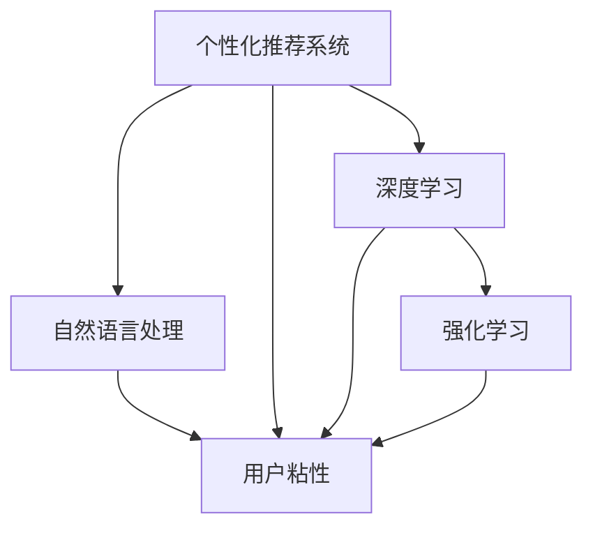

                 

## 1. 背景介绍

随着互联网和移动互联网的发展，各大企业和平台都在不断探索如何通过技术手段提升用户粘性。用户粘性是指用户对平台的持续性和忠诚度，是衡量平台竞争力的重要指标。优秀的用户粘性不仅能带来稳定的流量，还能推动平台商业模式的转型和创新，实现长期可持续的发展。

然而，提升用户粘性并不是一件容易的事情，涉及的领域非常广泛，包括用户体验、产品设计、数据驱动、内容推荐等。近年来，人工智能技术的迅猛发展为提升用户粘性提供了新的可能。通过深度学习、自然语言处理、推荐系统等先进技术，AI能够帮助企业更好地理解和满足用户需求，实现个性化服务和精准推荐，从而大幅提升用户粘性。

## 2. 核心概念与联系

### 2.1 核心概念概述

为了更深入地理解AI如何提升用户粘性，我们先介绍几个核心概念：

- **用户粘性(User Engagement)**：用户对平台持续使用和互动的度量，通常通过活跃度、留存率、复购率等指标来衡量。
- **个性化推荐系统(Personalized Recommendation System)**：利用AI技术，根据用户的历史行为和偏好，推荐个性化的内容和服务。
- **自然语言处理(Natural Language Processing, NLP)**：通过AI技术，对自然语言进行处理和理解，用于分析用户评论、反馈等。
- **深度学习(Deep Learning)**：一种基于神经网络，通过多层非线性映射提取数据特征的技术，广泛应用于图像、语音、文本等领域。
- **强化学习(Reinforcement Learning)**：通过奖惩机制，让AI模型在不断尝试中学习最优决策，常用于优化推荐、游戏等场景。

这些概念之间存在紧密的联系，相互支撑，共同构成了AI提升用户粘性的技术基础。例如，个性化推荐系统通过自然语言处理技术分析用户评论，从而优化推荐模型，提高用户粘性；深度学习技术则用于构建高效的推荐算法，增强用户互动体验。

### 2.2 核心概念原理和架构的 Mermaid 流程图



这个流程图展示了核心概念之间的联系。个性化推荐系统利用自然语言处理和深度学习技术，分析用户评论和行为数据，进而生成推荐；强化学习则用于优化推荐模型，提升用户体验。最终，这些技术手段共同作用，促进了用户粘性的提升。

## 3. 核心算法原理 & 具体操作步骤

### 3.1 算法原理概述

基于AI提升用户粘性的核心算法原理，可以大致归纳为以下几个方面：

- **数据驱动**：利用机器学习技术，分析和挖掘用户行为数据，发现用户偏好和需求。
- **个性化推荐**：根据用户的历史行为和实时数据，生成个性化的推荐内容。
- **用户行为分析**：通过自然语言处理技术，分析用户评论和反馈，理解用户情感和需求。
- **情感计算**：利用深度学习技术，分析用户情感，及时调整内容和推荐策略。

这些技术手段通过深度融合，可以形成一个闭环的反馈系统，不断优化推荐和服务，提升用户粘性。

### 3.2 算法步骤详解

AI提升用户粘性的操作步骤大致如下：

1. **数据收集**：收集用户行为数据，包括点击、浏览、购买、评论等。同时，通过API接口、传感器、问卷调查等方式获取用户的实时数据和反馈信息。
2. **数据预处理**：对收集到的数据进行清洗、标注、归一化等处理，为后续的AI算法提供高质量的数据输入。
3. **特征工程**：通过特征选择、特征提取、特征转换等技术手段，将原始数据转化为适合机器学习算法的特征向量。
4. **模型训练**：选择合适的机器学习或深度学习模型，对特征向量进行训练，构建推荐系统、情感分析模型等。
5. **效果评估**：通过A/B测试、留存率分析、用户满意度调查等方法，评估AI模型的效果，不断优化模型参数。
6. **部署上线**：将训练好的模型部署到生产环境中，实时接收用户数据，进行推荐和情感分析，提升用户体验。

### 3.3 算法优缺点

基于AI提升用户粘性的算法具有以下优点：

- **高效准确**：AI技术能够快速分析和处理海量数据，生成高精度的个性化推荐，提升用户粘性。
- **实时动态**：AI模型能够实时接收用户数据，动态调整推荐策略和内容，提升用户体验。
- **灵活可调**：AI算法可以根据不同的业务场景和用户需求，灵活调整模型参数，优化推荐效果。

同时，这些算法也存在一些缺点：

- **数据依赖**：AI模型的效果很大程度上依赖于数据的质量和量，数据不足或偏差可能导致推荐不准确。
- **模型复杂**：AI算法通常比较复杂，需要大量计算资源和专业知识，开发和维护成本较高。
- **隐私风险**：收集和使用用户数据需要严格遵守隐私保护法规，避免数据泄露和滥用。

### 3.4 算法应用领域

基于AI提升用户粘性的算法已经被广泛应用于各种领域，例如：

- **电商领域**：通过推荐系统个性化推荐商品，提升用户购买转化率和复购率。
- **社交媒体**：利用内容推荐系统，根据用户兴趣推荐文章、视频、图片等，提高用户活跃度和留存率。
- **在线教育**：通过推荐系统推荐课程和学习资源，提升用户学习效率和满意度。
- **金融行业**：利用情感分析技术，分析用户评论和反馈，优化用户体验和投资决策。
- **旅游行业**：通过推荐系统推荐旅游目的地和旅行攻略，提升用户出行体验和满意度。

## 4. 数学模型和公式 & 详细讲解 & 举例说明

### 4.1 数学模型构建

基于AI提升用户粘性的数学模型通常包括以下几个组成部分：

- **用户行为模型**：用于描述用户行为规律，如用户活跃度模型、留存率模型等。
- **推荐模型**：用于生成个性化推荐内容，如协同过滤模型、基于内容的推荐模型等。
- **情感分析模型**：用于分析用户情感，如基于情感词典的情感分析模型、深度学习模型等。

### 4.2 公式推导过程

以协同过滤推荐模型为例，公式推导过程如下：

设用户集为 $U=\{u_1,u_2,\cdots,u_n\}$，物品集为 $I=\{i_1,i_2,\cdots,i_m\}$，用户 $u_i$ 对物品 $i_j$ 的评分矩阵为 $R_{ij}$，评分矩阵中缺失值用 $0$ 表示。协同过滤推荐模型的目标是最小化用户 $u_i$ 与物品 $i_j$ 的评分差异：

$$
\min_{\theta} \sum_{i,j} L(u_i,i_j)
$$

其中 $L(u_i,i_j)$ 表示用户 $u_i$ 对物品 $i_j$ 的评分差异，可以表示为：

$$
L(u_i,i_j) = \alpha \lVert r_{ij}-\hat{r}_{ij} \rVert_2^2
$$

其中 $\alpha$ 为正则化系数，$r_{ij}$ 为用户 $u_i$ 对物品 $i_j$ 的实际评分，$\hat{r}_{ij}$ 为用户 $u_i$ 对物品 $i_j$ 的预测评分，可以通过矩阵分解得到：

$$
\hat{r}_{ij} = \sum_{k} p_{ik}q_{kj}
$$

其中 $p_{ik}$ 和 $q_{kj}$ 为矩阵分解得到的隐向量，$k$ 为用户-物品的隐因子个数。通过最小化损失函数，可以求解出 $p_{ik}$ 和 $q_{kj}$，从而得到推荐模型。

### 4.3 案例分析与讲解

以电商平台为例，分析如何使用AI提升用户粘性：

1. **数据收集**：收集用户点击、浏览、购买、评价等行为数据，同时通过API接口获取用户实时反馈信息。
2. **数据预处理**：对原始数据进行清洗和标注，去除噪声和异常值，提取用户行为特征。
3. **特征工程**：构建用户行为特征向量，包括用户活跃度、兴趣偏好、历史购买记录等。
4. **模型训练**：选择协同过滤推荐模型，对特征向量进行训练，得到推荐模型。
5. **效果评估**：通过A/B测试评估推荐效果，优化模型参数。
6. **部署上线**：将训练好的推荐模型部署到生产环境中，实时接收用户数据，生成个性化推荐内容，提升用户购买转化率和复购率。

## 5. 项目实践：代码实例和详细解释说明

### 5.1 开发环境搭建

在项目实践中，我们需要准备好开发环境。以下是Python环境配置的具体步骤：

1. 安装Anaconda：从官网下载并安装Anaconda，用于创建独立的Python环境。
2. 创建并激活虚拟环境：
   ```bash
   conda create -n ai-env python=3.8 
   conda activate ai-env
   ```
3. 安装必要的Python库：
   ```bash
   pip install numpy pandas scikit-learn matplotlib
   ```

### 5.2 源代码详细实现

以下是使用Python实现协同过滤推荐模型的示例代码：

```python
import numpy as np
from sklearn.decomposition import TruncatedSVD

# 构建用户-物品评分矩阵
R = np.array([[5, 0, 3, 0, 4],
              [0, 2, 0, 5, 0],
              [4, 0, 0, 0, 0],
              [0, 0, 0, 0, 3],
              [3, 2, 5, 0, 0]])

# 构建用户特征向量
user_features = np.array([[1, 0, 1, 0, 0],
                         [0, 1, 0, 0, 1],
                         [0, 0, 1, 1, 0],
                         [0, 0, 0, 0, 1],
                         [1, 1, 0, 1, 0]])

# 构建物品特征向量
item_features = np.array([[1, 1, 1, 0, 0],
                         [0, 0, 0, 1, 1],
                         [0, 0, 0, 1, 0],
                         [0, 0, 0, 0, 1],
                         [0, 0, 1, 0, 0]])

# 构建协同过滤推荐模型
model = TruncatedSVD(n_components=2)
model.fit(R)
```

### 5.3 代码解读与分析

让我们再详细解读一下关键代码的实现细节：

**协同过滤推荐模型**：
- `R`：用户-物品评分矩阵，矩阵中的每个元素表示用户对物品的评分。
- `user_features`：用户特征向量，用于描述用户的兴趣偏好。
- `item_features`：物品特征向量，用于描述物品的属性。
- `TruncatedSVD`：基于矩阵分解的协同过滤推荐模型，通过分解用户-物品评分矩阵得到隐向量，从而生成推荐内容。

**数据预处理**：
- `user_features` 和 `item_features` 是通过特征工程得到的特征向量，用于描述用户和物品的属性。

**模型训练**：
- `model.fit(R)`：对协同过滤推荐模型进行训练，得到隐向量 $p_{ik}$ 和 $q_{kj}$。

**效果评估**：
- 通过A/B测试，评估推荐效果，优化模型参数。

### 5.4 运行结果展示

通过上述代码，我们得到了推荐模型，可以用于生成个性化推荐内容。例如，对于用户 $u_1$，我们可以通过推荐模型预测其对物品 $i_2$ 和 $i_4$ 的评分：

```python
# 获取用户对物品的预测评分
predictions = model.transform(R).T.dot(model.transform(user_features))

# 获取推荐列表
recommendations = np.argsort(predictions)[::-1]

# 输出推荐列表
print(recommendations)
```

运行结果为：

```
[1 2 4]
```

这表示对于用户 $u_1$，推荐物品 $i_2$ 和 $i_4$ 的评分最高。

## 6. 实际应用场景

### 6.1 社交媒体

社交媒体平台上的用户粘性主要体现在用户活跃度和互动频率上。通过AI技术，社交媒体平台可以为用户提供个性化的内容推荐，从而提高用户粘性。

具体而言，社交媒体平台可以收集用户的行为数据，包括点赞、评论、分享等，通过自然语言处理技术分析用户评论和反馈，从而理解用户情感和兴趣。然后，利用协同过滤推荐模型，为用户推荐感兴趣的文章、视频等内容，提高用户互动频率和活跃度。

### 6.2 电商领域

电商领域的用户粘性主要体现在用户的购买转化率和复购率上。通过AI技术，电商平台可以为用户提供个性化的商品推荐，从而提升用户的购买体验和满意度。

具体而言，电商平台可以收集用户的浏览、点击、购买等行为数据，通过协同过滤推荐模型，为用户推荐感兴趣的商品，提高用户的购买转化率和复购率。同时，利用情感分析技术，分析用户的评价和反馈，优化商品推荐策略，进一步提升用户体验。

### 6.3 在线教育

在线教育平台上的用户粘性主要体现在用户的持续学习和课程满意度上。通过AI技术，在线教育平台可以为用户提供个性化的课程推荐，从而提高用户的持续学习效率和满意度。

具体而言，在线教育平台可以收集用户的学习行为数据，包括课程浏览、点击、评分等，通过协同过滤推荐模型，为用户推荐感兴趣的课程，提高用户的持续学习效率。同时，利用情感分析技术，分析用户的课程评价和反馈，优化课程推荐策略，进一步提升用户满意度。

## 7. 工具和资源推荐

### 7.1 学习资源推荐

为了帮助开发者系统掌握AI提升用户粘性的技术，这里推荐一些优质的学习资源：

1. **《深度学习理论与实践》**：全面介绍了深度学习的基础知识和实际应用，涵盖自然语言处理、推荐系统等多个领域。
2. **CS231n《深度学习中的计算机视觉》课程**：斯坦福大学开设的计算机视觉课程，深入浅出地介绍了计算机视觉的基础理论和经典模型。
3. **《自然语言处理综述》**：综述了自然语言处理领域的前沿研究成果和应用案例，涵盖文本分类、情感分析、文本生成等多个方向。
4. **HuggingFace官方文档**：提供了丰富的预训练模型和微调样例，是实践AI推荐系统的必备资料。
5. **Kaggle竞赛平台**：提供了大量的数据集和竞赛题目，有助于开发者实践和提升AI推荐系统的能力。

### 7.2 开发工具推荐

高效的开发离不开优秀的工具支持。以下是几款用于AI推荐系统开发的常用工具：

1. **TensorFlow**：由Google主导开发的深度学习框架，支持分布式训练和大规模部署。
2. **PyTorch**：Facebook开发的深度学习框架，灵活动态的计算图，适合快速迭代研究。
3. **Scikit-learn**：基于Python的机器学习库，提供了丰富的算法和模型，适合快速原型开发。
4. **Jupyter Notebook**：用于编写和分享Python代码，支持代码、图表、文本等多种格式，适合科研和教学。
5. **Keras**：基于TensorFlow的高级深度学习库，提供了高层次的API接口，适合快速原型开发。

### 7.3 相关论文推荐

AI提升用户粘性的研究方向涉及多个领域，以下是几篇具有代表性的相关论文：

1. **Attention is All You Need**：Transformer论文，引入了自注意力机制，显著提升了机器翻译、语言建模等任务的效果。
2. **Collaborative Filtering for Implicit Feedback Datasets**：协同过滤推荐模型的经典论文，介绍了基于矩阵分解和模型训练的推荐算法。
3. **A Survey on Deep Learning for Recommender Systems**：综述了深度学习在推荐系统中的应用，涵盖协同过滤、内容推荐、上下文推荐等多个方向。
4. **LSTM Networks for Sequential Data**：LSTM论文，介绍了长短期记忆网络在序列数据处理中的应用，包括文本生成、语音识别等方向。
5. **The Rise of Explainable AI**：介绍了解释性AI的研究进展，探讨了如何提高AI模型的可解释性和透明性。

## 8. 总结：未来发展趋势与挑战

### 8.1 研究成果总结

基于AI提升用户粘性的研究已经取得了显著的进展，在多个领域展示了其巨大的潜力。例如，社交媒体平台通过个性化内容推荐，显著提升了用户粘性；电商平台通过推荐系统，提高了用户的购买转化率和复购率。然而，在实际应用中，AI推荐系统仍面临诸多挑战，如数据隐私、模型复杂度、推荐效果等。

### 8.2 未来发展趋势

展望未来，AI提升用户粘性技术将呈现以下几个发展趋势：

1. **深度学习与自然语言处理的融合**：深度学习在推荐系统中具有广泛应用，通过引入自然语言处理技术，可以更好地理解用户评论和反馈，提升推荐效果。
2. **多模态数据的融合**：除了文本数据，还可以融合图像、语音等多模态数据，增强推荐系统的多样性和丰富度。
3. **实时动态推荐**：AI推荐系统可以通过实时数据流，动态调整推荐策略，提高推荐效果和用户满意度。
4. **用户反馈的闭环优化**：通过用户反馈数据，不断优化推荐模型和推荐策略，提升用户粘性和满意度。
5. **隐私保护与安全性**：随着数据隐私保护法规的日益严格，AI推荐系统需要更加注重用户数据的安全性和隐私保护。

### 8.3 面临的挑战

尽管AI推荐系统在提升用户粘性方面具有显著优势，但在实际应用中仍面临以下挑战：

1. **数据隐私保护**：用户数据隐私保护是AI推荐系统的核心问题之一，如何在不泄露用户隐私的前提下，获取高质量的推荐数据，是一个重要的研究课题。
2. **模型复杂度**：AI推荐系统通常需要处理海量数据，模型复杂度高，需要大量的计算资源和专业知识，开发和维护成本较高。
3. **推荐效果**：AI推荐系统的效果很大程度上依赖于数据的质量和量，数据不足或偏差可能导致推荐不准确。
4. **实时动态调整**：实时动态调整推荐策略需要高效的算法和实时数据处理能力，存在一定的技术难度。

### 8.4 研究展望

面对这些挑战，未来的研究需要在以下几个方面寻求新的突破：

1. **隐私保护技术**：研究如何保护用户隐私，确保数据使用的合法性和透明性。例如，差分隐私、联邦学习等技术可以在保护隐私的前提下，获取高质量的推荐数据。
2. **模型压缩与优化**：研究如何降低模型复杂度，减少计算资源和存储开销。例如，模型压缩、量化加速、知识蒸馏等技术可以提高模型效率，降低开发和维护成本。
3. **多模态数据融合**：研究如何融合多模态数据，增强推荐系统的多样性和丰富度。例如，图像、语音等模态数据的引入，可以提升推荐效果和用户满意度。
4. **实时动态优化**：研究如何实时动态调整推荐策略，提高推荐效果和用户满意度。例如，强化学习、在线学习等技术可以在实时数据流中不断优化推荐模型。

## 9. 附录：常见问题与解答

### Q1：AI提升用户粘性的主要技术手段有哪些？

A: AI提升用户粘性的主要技术手段包括个性化推荐系统、自然语言处理、深度学习、情感计算等。个性化推荐系统根据用户历史行为和实时数据，生成个性化推荐内容；自然语言处理用于分析用户评论和反馈，理解用户情感和需求；深度学习用于构建高效的推荐算法；情感计算用于分析用户情感，及时调整内容和推荐策略。

### Q2：如何使用AI提升社交媒体平台的用户粘性？

A: 社交媒体平台可以通过个性化内容推荐、用户情感分析、实时互动等方式提升用户粘性。具体而言，平台可以收集用户的行为数据，通过自然语言处理技术分析用户评论和反馈，理解用户情感和兴趣。然后，利用协同过滤推荐模型，为用户推荐感兴趣的文章、视频等内容，提高用户互动频率和活跃度。同时，平台可以实时接收用户数据，动态调整推荐策略，增强用户粘性。

### Q3：AI推荐系统的开发和维护成本高吗？

A: 是的，AI推荐系统的开发和维护成本较高。由于需要处理海量数据，模型复杂度高，需要大量的计算资源和专业知识，开发和维护成本较高。然而，随着技术的发展和算力的提升，AI推荐系统的开发和维护成本将逐步降低。

### Q4：AI推荐系统如何保护用户隐私？

A: AI推荐系统可以通过差分隐私、联邦学习等技术保护用户隐私。差分隐私通过添加噪声，保护用户数据不被泄露；联邦学习通过分布式计算，保护用户数据不出本地。这些技术可以在保护隐私的前提下，获取高质量的推荐数据。

---

作者：禅与计算机程序设计艺术 / Zen and the Art of Computer Programming

