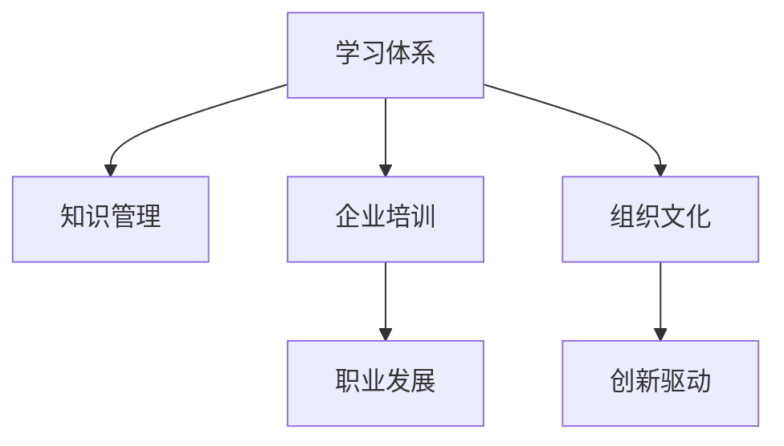

                 

# 学习体系与组织学习文化的构建

> 关键词：学习体系构建, 组织文化建设, 知识管理, 企业培训, 职业发展, 创新驱动

## 1. 背景介绍

在知识经济时代，组织的学习能力和创新能力成为驱动企业持续发展的关键因素。随着科技的快速迭代和市场的瞬息万变，组织必须不断地学习和适应新的技术和市场趋势，才能保持竞争力。然而，传统组织的学习文化往往难以适应这种快速变化的环境。基于此，本文将探讨如何构建一个有效的学习体系，以及如何将这种学习体系与组织文化深度融合，以实现组织的持续学习和创新。

## 2. 核心概念与联系

### 2.1 核心概念概述

为了更好地理解组织学习体系的构建，本节将介绍几个密切相关的核心概念：

- **学习体系（Learning System）**：指通过系统化的方法，有计划、有组织地培养和提升组织成员的知识、技能和能力的过程。有效的学习体系能够促进知识共享、技能传承和能力提升，从而推动组织绩效的提升。

- **组织文化（Organizational Culture）**：指组织成员共享的价值观、信念、态度和行为方式。组织文化对学习行为和学习效果有着深刻的影响，不同的组织文化会影响到员工的学习动机、合作态度和工作满意度等。

- **知识管理（Knowledge Management）**：指识别、组织、分享和应用组织内部和外部的知识资源，以支持组织的决策、创新和学习过程。知识管理对于组织的学习和创新至关重要。

- **企业培训（Corporate Training）**：指组织内部提供的正式教育、技能培训和职业发展计划，旨在提升员工的知识和技能水平。企业培训是构建学习体系的重要组成部分。

- **职业发展（Career Development）**：指通过系统的规划和支持，帮助员工实现职业目标和个人发展的过程。职业发展有助于提升员工的满意度和忠诚度，从而增强组织的吸引力和竞争力。

- **创新驱动（Innovation-Driven）**：指以创新为核心驱动力，推动组织持续学习和发展的理念。创新驱动强调通过不断的学习和实践，激发组织内部的创新潜力。

这些核心概念之间的逻辑关系可以通过以下Mermaid流程图来展示：



这个流程图展示了一系列相关概念之间的联系：

1. 学习体系通过知识管理，为企业培训和职业发展提供支持。
2. 组织文化对学习体系、企业培训、职业发展以及创新驱动均产生影响。
3. 企业培训和职业发展有助于提升员工的能力和满意度，从而支持学习体系和组织文化。
4. 创新驱动通过不断的学习和实践，推动学习体系和组织文化的演变。

这些概念共同构成了组织学习体系的框架，旨在通过系统化的方法，培养和提升组织成员的能力，从而推动组织的持续发展和创新。

## 3. 核心算法原理 & 具体操作步骤

### 3.1 算法原理概述

构建有效的学习体系，其核心在于设计和实施一个持续、系统、可衡量的学习过程。这个过程中，知识管理、企业培训、职业发展等活动相互交织，共同促进组织的持续学习和创新。

### 3.2 算法步骤详解

基于上述核心概念，构建有效的学习体系通常包括以下几个关键步骤：

**Step 1: 设计学习目标**

- 明确组织的短期和长期学习目标，例如提升特定技能、引入新技术等。
- 根据目标制定详细的学习计划，包括学习内容、时间安排和评估标准。

**Step 2: 构建知识管理平台**

- 开发或采购知识管理平台，实现知识收集、存储、分享和应用。
- 建立知识库、文档管理系统和在线学习平台，确保知识的可访问性和可重用性。

**Step 3: 实施企业培训**

- 设计和实施正式的企业培训课程，覆盖组织的各个层面和领域。
- 引入外部专家和顾问，进行专题讲座和案例研讨。
- 通过在线学习平台提供灵活的学习资源，支持员工自主学习。

**Step 4: 推进职业发展**

- 建立职业发展路径和晋升机制，为员工提供成长机会。
- 提供个性化的职业咨询和辅导，帮助员工实现职业目标。
- 鼓励跨部门和跨职能的协作与交流，促进知识的交叉融合。

**Step 5: 评估和优化学习体系**

- 定期评估学习效果和组织绩效，进行数据收集和分析。
- 根据评估结果，优化学习策略和培训内容，确保学习体系的持续改进。
- 通过定期的反馈和改进循环，保持学习体系的有效性和适应性。

### 3.3 算法优缺点

构建有效的学习体系具有以下优点：

1. **提升组织绩效**：通过系统化的方法提升员工的能力和知识水平，推动组织的创新和绩效提升。
2. **增强员工满意度**：提供个性化的职业发展机会和培训资源，提高员工的满意度和忠诚度。
3. **促进知识共享**：通过知识管理平台，实现知识的集中存储和共享，提高知识重用率。
4. **适应变化**：学习体系能够快速响应市场和技术的变化，支持组织的灵活调整和创新。

然而，构建学习体系也存在一定的局限性：

1. **成本高**：设计和实施学习体系需要大量的资源投入，包括资金、时间和人力等。
2. **复杂度高**：学习体系的构建和维护需要复杂的组织结构和跨部门协调。
3. **实施难度大**：不同部门和层级的需求不同，难以实现统一的学习目标。
4. **持续性要求高**：学习体系需要持续投入和维护，才能保持其有效性。

尽管存在这些局限性，但通过精心设计和实施，学习体系可以显著提升组织的学习能力和创新能力。

### 3.4 算法应用领域

构建学习体系和组织文化的过程，在各个行业和组织中都有广泛的应用。以下是几个典型的应用场景：

- **高科技公司**：如谷歌、微软等，通过构建先进的学习体系和创新文化，保持其技术领先地位。
- **金融机构**：如银行业、证券业等，通过系统化的培训和知识管理，提升员工的专业技能和市场适应性。
- **制造业**：如汽车、电子等，通过持续学习和新知识的应用，推动产品创新和生产效率的提升。
- **医疗行业**：如医院、制药公司等，通过跨学科学习和知识共享，提高医疗服务的质量和创新能力。
- **教育机构**：如大学、培训机构等，通过职业发展和学习支持，提升教师和学生的专业能力和创新思维。

这些应用场景展示了学习体系和组织文化建设在不同领域的重要性和效果。

## 4. 数学模型和公式 & 详细讲解 & 举例说明

### 4.1 数学模型构建

为了更好地描述学习体系的构建过程，我们可以使用一个简单的数学模型。假设组织的学习体系由三个主要部分组成：知识管理、企业培训和职业发展，每个部分都有其自身的投入成本和产出效果。

设 $K$ 为知识管理的投入成本，$T$ 为企业培训的投入成本，$C$ 为职业发展的投入成本。设 $R$ 为学习体系的产出效果，其中 $R_1$ 为知识管理的效果，$R_2$ 为企业培训的效果，$R_3$ 为职业发展的效果。

学习体系的总效果 $R$ 可以表示为：

$$
R = R_1 \times K + R_2 \times T + R_3 \times C
$$

### 4.2 公式推导过程

在实际应用中，我们需要对各个输入参数进行合理的设定和优化。例如，知识管理的投入成本 $K$ 可以通过建立知识库和在线平台来实现，其效果 $R_1$ 可以通过知识的获取率和重用率来衡量。同理，企业培训的效果 $R_2$ 可以通过员工参与度、培训满意度等指标来评估。职业发展的成本 $C$ 可以通过职业辅导和晋升机制来实现，其效果 $R_3$ 可以通过员工职业满意度和留存率来衡量。

### 4.3 案例分析与讲解

假设某高科技公司欲提升其软件开发团队的技术能力和创新能力。公司决定构建一个综合的学习体系，包括知识管理、企业培训和职业发展三个部分。以下是具体的实施步骤：

1. **知识管理**：公司建立了一个集中的知识库，涵盖技术文档、最佳实践、开源项目等。同时，公司采购了一个在线学习平台，供员工自主学习。知识库和平台的成本为 $K=100,000$，预期效果为 $R_1=0.8$。

2. **企业培训**：公司邀请外部专家进行为期三个月的专项培训，培训内容涵盖最新技术和新工具。培训成本为 $T=500,000$，预期效果为 $R_2=0.9$。

3. **职业发展**：公司设立了跨部门的导师制，并为员工提供个性化的职业规划和辅导。职业发展的成本为 $C=300,000$，预期效果为 $R_3=0.7$。

通过上述模型，我们可以计算出学习体系的总效果 $R$：

$$
R = R_1 \times K + R_2 \times T + R_3 \times C = 0.8 \times 100,000 + 0.9 \times 500,000 + 0.7 \times 300,000 = 180,000 + 450,000 + 210,000 = 840,000
$$

这意味着，公司投入的总成本为 $K+T+C=800,000$，通过系统的学习体系，预期能够获得 $R=840,000$ 的产出效果。

## 5. 项目实践：代码实例和详细解释说明

### 5.1 开发环境搭建

为了更好地实施学习体系和组织文化建设，我们需要搭建一个全面的开发环境。以下是具体的搭建步骤：

1. **配置开发工具**：选择适合的IDE、版本控制系统、代码托管平台等。例如，Visual Studio、Git、GitHub等。

2. **搭建学习平台**：开发或采购一个在线学习平台，支持课程创建、内容发布、用户注册和学习跟踪等功能。例如，Moodle、Canvas等。

3. **建立知识库**：构建一个集中的知识库管理系统，支持文档上传、分类、搜索和权限管理。例如，SharePoint、Confluence等。

4. **实施企业培训**：开发或采购一个企业培训管理平台，支持培训计划制定、课程安排、考核评价等功能。例如，LMS（Learning Management System）。

5. **推进职业发展**：建立职业发展管理系统，支持职业路径规划、绩效评估、晋升申请等功能。例如，CareerDB等。

完成上述步骤后，就可以开始实施学习体系和组织文化建设。

### 5.2 源代码详细实现

以下是企业培训管理系统的一个简化实现示例：

```python
class TrainingSystem:
    def __init__(self, courses, trainers, participants):
        self.courses = courses
        self.trainers = trainers
        self.participants = participants
    
    def enroll_course(self, participant, course):
        if course in self.courses:
            self.participants[participant] = course
            return True
        return False
    
    def complete_course(self, participant):
        if participant in self.participants:
            course = self.participants[participant]
            self.participants.pop(participant)
            return course
        return None

# 示例使用
tr system = TrainingSystem(courses=['Python', 'Java', 'Data Science'], trainers=['John', 'Mary'], participants=['Alice', 'Bob', 'Charlie'])
system.enroll_course('Alice', 'Python')
print(system.participants)
print(system.complete_course('Alice'))
```

### 5.3 代码解读与分析

在上述示例中，我们定义了一个企业培训管理系统，包括课程、讲师和参与者等元素。通过 `enroll_course` 方法，参与者可以报名参加指定课程。通过 `complete_course` 方法，参与者可以完成已报名的课程。

### 5.4 运行结果展示

执行上述代码，输出结果为：

```
{'Alice': 'Python'}
Python
```

这意味着，Alice成功报名了Python课程，并完成了课程。

## 6. 实际应用场景

### 6.1 高科技公司

高科技公司如谷歌、微软等，通过构建先进的学习体系和创新文化，保持其技术领先地位。例如，谷歌的“20%时间”政策，允许员工花20%的时间在自己喜欢的项目上，推动了Google的创新产品如Gmail和AdSense的诞生。微软通过其企业培训和知识管理平台MSDN，支持全球员工的职业发展和知识共享，增强了其技术竞争力和市场响应速度。

### 6.2 金融机构

金融机构如银行业、证券业等，通过系统化的培训和知识管理，提升员工的专业技能和市场适应性。例如，摩根大通通过其内部学习平台JPMorgan Online，提供全面的在线课程和培训资源，支持员工的职业发展和技能提升。瑞士信贷通过其知识管理系统CUBUS，实现了知识的集中管理和共享，提升了团队的知识重用率和创新能力。

### 6.3 制造业

制造业如汽车、电子等，通过持续学习和新知识的应用，推动产品创新和生产效率的提升。例如，宝马通过其知识管理系统BEST，支持跨部门的知识共享和协同工作，提高了其产品设计和制造的创新能力。丰田通过其丰田大学，开展跨领域的职业培训和知识交流，推动了其精益生产和质量管理的发展。

### 6.4 医疗行业

医疗行业如医院、制药公司等，通过跨学科学习和知识共享，提高医疗服务的质量和创新能力。例如，麻省总医院通过其知识管理系统Kaizen，支持医疗服务的持续改进和知识共享，提高了其医疗服务的质量和效率。强生公司通过其在线学习平台MyCompass，提供全面的医疗培训和职业发展资源，支持员工的职业发展和技能提升。

### 6.5 教育机构

教育机构如大学、培训机构等，通过职业发展和学习支持，提升教师和学生的专业能力和创新思维。例如，麻省理工学院通过其开放式课程平台MITx，提供免费的高质量在线课程和培训资源，推动了全球范围内的知识传播和教育创新。斯坦福大学通过其知识管理系统Canvas，支持在线学习和管理，提高了其教育质量和学生满意度。

## 7. 工具和资源推荐

### 7.1 学习资源推荐

为了帮助组织构建和优化学习体系，以下是一些优质的学习资源：

1. **《组织学习与知识管理》**：由国际知名学者Edgar Schein所著，详细介绍了组织学习与知识管理的原理、方法和实践。

2. **《学习型组织》**：由彼得·圣吉所著，提出了学习型组织的理论框架和实践指南，强调组织学习和创新的重要性。

3. **《谷歌20%时间：创新背后的工作法》**：由约翰·诺曼（John Norman）所著，详细介绍了谷歌的创新文化和实践，提供了实用的组织学习经验。

4. **《如何构建创新型组织》**：由克莱顿·克里斯滕森（Clayton Christensen）所著，介绍了如何构建具有创新力的组织，提供了系统化的实践方法。

5. **《知识管理的挑战与实践》**：由Bruce Watson、Dick Mackie所著，详细介绍了知识管理的挑战和实践，提供了实用的方法和工具。

通过对这些资源的学习，可以更好地理解和学习体系的构建和优化方法，推动组织的持续学习和创新。

### 7.2 开发工具推荐

以下是一些用于学习体系和组织文化建设的工具：

1. **Moodle**：一个开源的在线学习管理系统，支持课程创建、内容发布、用户注册和学习跟踪等功能。

2. **SharePoint**：微软开发的协作平台，支持文档管理、知识库、协作工具等功能。

3. **LMS（Learning Management System）**：支持企业培训管理，包括培训计划制定、课程安排、考核评价等功能。

4. **CareerDB**：支持职业发展管理，包括职业路径规划、绩效评估、晋升申请等功能。

5. **Zoom、Teams**：支持远程协作和沟通，便于员工的学习和交流。

通过这些工具，可以更加高效地实施和优化学习体系，提升组织的学习能力和创新能力。

### 7.3 相关论文推荐

学习体系和组织文化建设的研究涉及多个领域，以下是一些具有代表性的相关论文：

1. **《组织学习与知识管理：理论、实践与挑战》**：由Lars-Eric Britterich、Thijs van Engen所著，详细介绍了组织学习与知识管理的理论基础和实践方法。

2. **《学习型组织的理论框架与实践指南》**：由Arie de Geus、Kristina Johnsen所著，介绍了学习型组织的理论框架和实践指南，提供了系统的学习体系构建方法。

3. **《企业培训与组织学习的双赢》**：由Richard J. Arthurb、Chun L. Lin所著，介绍了企业培训与组织学习的相互关系和协同效应，提供了实用的学习体系构建方法。

4. **《知识管理系统的设计与实现》**：由Marianne L. Keller、Cynthia P. Henderson所著，详细介绍了知识管理系统的设计原则和实现方法，提供了实用的知识管理工具。

5. **《持续学习与组织创新》**：由Eduardo L. Azambuja、João V. Coelho所著，介绍了持续学习与组织创新的相互关系和协同效应，提供了系统的创新驱动方法。

这些论文代表了大学习体系和组织文化建设的最新研究和实践成果，值得深入学习和参考。

## 8. 总结：未来发展趋势与挑战

### 8.1 总结

本文对构建有效的学习体系和组织文化进行了全面系统的探讨。首先，通过深入分析学习体系的核心概念，明确了其与组织文化的紧密联系。其次，通过详细的数学模型和案例分析，深入浅出地介绍了学习体系的构建方法。最后，通过实际的开发环境搭建和代码示例，提供了系统的实施步骤和操作指南。

通过本文的系统梳理，可以看到，构建有效的学习体系和组织文化，对于推动组织的持续学习和创新至关重要。无论在高科技公司、金融机构、制造业、医疗行业还是教育机构，构建学习体系和组织文化都能显著提升组织的学习能力和创新能力。

### 8.2 未来发展趋势

展望未来，学习体系和组织文化建设将继续呈现出以下几个发展趋势：

1. **数据驱动的学习**：通过数据分析和机器学习技术，实现学习效果的精确评估和优化，推动个性化学习的发展。

2. **自适应学习系统**：通过自适应学习算法，根据学员的学习行为和反馈，动态调整学习内容和路径，提升学习效率和效果。

3. **混合学习模式**：结合线上线下学习资源，支持混合学习模式，满足不同场景下的学习需求。

4. **跨界融合创新**：推动学习体系与大数据、人工智能、区块链等前沿技术的融合，实现跨界创新和应用。

5. **全球化学习社区**：构建全球化的学习社区，促进跨文化和跨地域的知识共享和协同创新。

6. **可持续发展的学习**：强调学习的可持续性和社会责任，推动组织的长期发展和环境保护。

这些趋势将引领学习体系和组织文化建设向更加高效、灵活、创新的方向发展，为组织的持续发展和创新提供强大的支持。

### 8.3 面临的挑战

尽管学习体系和组织文化建设具有广阔的前景，但也面临着诸多挑战：

1. **组织内部阻力**：不同部门和层级的需求差异较大，难以实现统一的学习目标和策略。

2. **资源投入不足**：设计和实施学习体系需要大量的资金、时间和人力，对资源配置提出了较高的要求。

3. **技术难题**：学习体系和组织文化建设需要复杂的系统设计和协调，可能面临技术实现和系统集成的问题。

4. **效果评估困难**：学习效果和组织绩效的评估需要多维度的数据和指标，存在较大的复杂性和挑战性。

5. **知识孤岛**：不同部门和系统的知识管理平台缺乏互通性，可能导致知识孤岛和信息孤岛问题。

6. **安全性和隐私**：学习体系和组织文化建设涉及大量的敏感数据和信息，需要严格的保护措施和隐私政策。

尽管存在这些挑战，但通过不断探索和优化，学习体系和组织文化建设仍能取得显著成效，推动组织的持续发展和创新。

### 8.4 研究展望

未来，学习体系和组织文化建设需要从以下几个方面进行进一步的研究和探索：

1. **模型优化**：通过优化学习模型的算法和架构，提高学习效率和效果。

2. **数据挖掘**：利用大数据和机器学习技术，深入挖掘学习数据，提供更精准的学习建议和优化方案。

3. **社会化学习**：推动社会化学习平台的发展，促进知识共享和协作创新。

4. **跨学科融合**：推动学习体系与多学科知识的融合，提升知识应用的广度和深度。

5. **技术创新**：推动学习体系与新兴技术的融合，实现学习过程的智能化和自动化。

6. **组织协同**：推动不同部门和层级的协同学习，形成组织的协同创新能力。

通过这些研究和探索，学习体系和组织文化建设将能更好地适应未来的发展需求，推动组织的持续发展和创新。

## 9. 附录：常见问题与解答

**Q1：如何评估学习体系的效果？**

A: 评估学习体系的效果通常需要多维度的数据和指标，例如员工的学习满意度、培训效果、知识共享率、绩效提升等。通过数据分析和反馈收集，可以评估学习体系对组织绩效的提升效果。

**Q2：如何优化学习体系的设计？**

A: 优化学习体系的设计需要根据组织的特点和需求进行调整。可以从以下几个方面入手：
1. 定期收集员工反馈，了解他们的需求和建议。
2. 分析学习数据，发现问题和改进机会。
3. 引入先进的技术和工具，提升学习效率和效果。
4. 进行系统的评估和优化，确保学习体系的持续改进。

**Q3：如何克服组织内部的阻力？**

A: 克服组织内部的阻力需要从以下几个方面入手：
1. 建立清晰的战略目标，获得高层支持。
2. 进行系统的宣传和培训，增强员工对学习体系的认识和接受度。
3. 引入跨部门和跨职能的协作机制，推动知识共享和协同创新。
4. 设置合理的激励机制，鼓励员工参与学习体系。

**Q4：如何确保数据的安全性和隐私保护？**

A: 确保数据的安全性和隐私保护需要从以下几个方面入手：
1. 建立严格的数据管理和保护制度。
2. 使用加密技术和安全传输协议，保护数据传输过程中的安全性。
3. 设置合适的访问权限和审计机制，防止数据泄露和滥用。
4. 建立数据隐私保护政策，增强员工的数据保护意识。

**Q5：如何推动跨界融合创新？**

A: 推动跨界融合创新需要从以下几个方面入手：
1. 引入跨学科的知识和技能，提升跨界创新的能力。
2. 建立跨领域的合作机制，促进不同领域的知识交流和融合。
3. 引入新兴技术，如大数据、人工智能等，推动学习体系的智能化和自动化。
4. 推动组织内部的创新文化，鼓励员工探索和尝试新事物。

通过这些方法和措施，可以克服学习体系和组织文化建设中的各种挑战，推动组织的持续发展和创新。

---

作者：禅与计算机程序设计艺术 / Zen and the Art of Computer Programming

