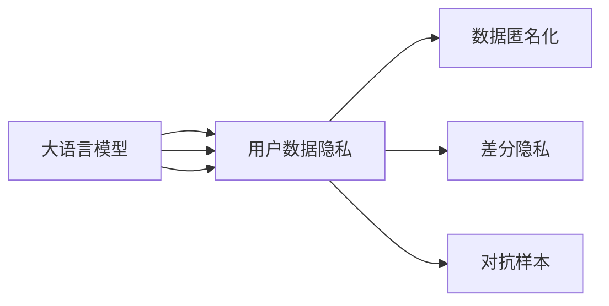

                 

# 安全线程：保障 LLM 用户数据隐私

在大语言模型（Large Language Models, LLMs）迅速发展的当下，用户数据的隐私保护成为了一个迫在眉睫的问题。尽管 LLMs 在自然语言处理领域展现了前所未有的潜力，但在数据隐私和伦理方面也引起了广泛的关注和讨论。本文将深入探讨 LLMs 用户数据隐私保护的挑战与解决方案，旨在为 LLMs 的安全应用提供指导和参考。

## 1. 背景介绍

### 1.1 问题由来

随着深度学习技术的飞速发展，尤其是大语言模型（如 GPT-3、BERT 等）的涌现，自然语言处理（NLP）领域取得了显著的进展。然而，这些模型往往依赖于大量标注数据进行训练，而这些数据可能包含敏感的用户信息。此外，模型通过微调来适配特定任务，但微调过程可能会引入或放大数据中的偏见，进一步加剧隐私和伦理问题。因此，如何在享受 LLMs 带来的便利的同时，保障用户数据的隐私，成为学术界和工业界共同面临的挑战。

### 1.2 问题核心关键点

用户数据隐私保护在大规模语言模型（如 GPT-3、BERT 等）的训练和微调过程中尤为重要。模型训练和微调通常需要大规模数据集，其中包括用户的个人数据，如聊天记录、社交媒体内容等。如何确保这些数据的安全性，防止数据泄露和滥用，是 LLMs 应用过程中必须解决的核心问题。

## 2. 核心概念与联系

### 2.1 核心概念概述

- **大语言模型**：指通过自监督学习或监督学习在大规模语料库上进行预训练的语言模型，如 GPT、BERT 等。这些模型在自然语言理解、生成等方面表现出卓越的性能。
- **用户数据隐私**：指个人数据在收集、存储、处理、传输等过程中受到的保护。数据隐私保护旨在防止未经授权的访问和使用。
- **数据匿名化**：通过对数据进行变换，使其无法直接或间接识别特定个人或群体的身份。常见的匿名化技术包括数据去标识化、数据加密等。
- **差分隐私**：一种隐私保护机制，通过在查询或统计数据时引入噪声，使得单个数据的泄露对隐私的侵害最小化。
- **对抗样本**：有意设计的扰动样本，旨在欺骗模型并破坏其预测能力。对抗样本可能被用于攻击模型，泄露敏感信息。

### 2.2 核心概念原理和架构的 Mermaid 流程图



该图展示了 LLMs 在数据处理过程中与用户数据隐私保护的关系。大语言模型通过处理用户数据进行训练和微调，而用户数据隐私保护则涉及数据匿名化、差分隐私和对抗样本等技术手段，以确保数据的安全性和隐私性。

## 3. 核心算法原理 & 具体操作步骤

### 3.1 算法原理概述

在 LLMs 的应用中，用户数据隐私保护涉及数据收集、处理、存储和传输的各个环节。以下是几种常见的隐私保护算法及其基本原理：

- **数据匿名化**：通过数据去标识化和数据加密等技术，确保用户数据在处理过程中无法直接或间接识别个人身份。
- **差分隐私**：在查询或统计数据时，通过引入噪声来保护单个数据点，使得对隐私的侵害最小化。
- **对抗样本**：通过对抗性训练等技术，提高模型对对抗样本的鲁棒性，防止攻击者通过对抗样本泄露敏感信息。

### 3.2 算法步骤详解

#### 数据匿名化

数据匿名化的目的是确保数据在处理过程中无法直接或间接识别用户身份。常见的数据匿名化技术包括：

1. **数据去标识化**：通过删除、泛化或替换个人标识信息，使得数据无法直接识别特定个体。例如，使用随机化技术将姓名、地址等敏感信息替换为无意义的标识符。
2. **数据加密**：使用加密技术对数据进行加密处理，确保数据在传输和存储过程中无法被未经授权的第三方访问。例如，使用 AES 或 RSA 等加密算法对数据进行加密。

#### 差分隐私

差分隐私通过在查询或统计数据时引入噪声，保护用户数据隐私。常见的差分隐私技术包括：

1. **拉普拉斯机制**：在查询结果中加入拉普拉斯分布的随机噪声，确保单个数据点的泄露对隐私的侵害最小化。
2. **高斯机制**：在查询结果中加入高斯分布的随机噪声，同样达到差分隐私的效果。

#### 对抗样本

对抗样本用于提高模型的鲁棒性，防止攻击者通过对抗样本泄露敏感信息。常见的对抗样本技术包括：

1. **对抗性训练**：在模型训练过程中，使用对抗样本进行微调，提高模型对对抗样本的鲁棒性。
2. **对抗性检测**：在模型部署后，使用对抗性检测技术识别和拦截对抗样本，防止其对模型造成破坏。

### 3.3 算法优缺点

#### 数据匿名化

**优点**：
- 能够有效保护用户隐私，防止数据泄露和滥用。
- 技术成熟，应用广泛，具有较高的可行性。

**缺点**：
- 可能影响数据的有用性和完整性，导致数据质量下降。
- 技术实施复杂，需要专业的知识和技能。

#### 差分隐私

**优点**：
- 能够保护单个数据点的隐私，降低隐私泄露风险。
- 技术成熟，易于实现，适用于各种数据处理场景。

**缺点**：
- 可能引入一定的噪声，影响数据的准确性和可靠性。
- 在数据集较小的情况下，隐私保护效果可能不佳。

#### 对抗样本

**优点**：
- 能够提高模型的鲁棒性，防止攻击者通过对抗样本泄露敏感信息。
- 技术灵活，可以根据具体需求进行定制化设计。

**缺点**：
- 对抗样本可能用于攻击模型，影响模型性能。
- 需要不断更新和调整对抗样本技术，以应对新的攻击方式。

### 3.4 算法应用领域

大语言模型在多个领域的应用都涉及用户数据隐私保护，例如：

- **医疗**：医疗数据包含大量敏感信息，如何保护这些数据在处理和传输过程中的隐私，是大规模语言模型应用的关键问题。
- **金融**：金融数据涉及用户的经济信息，如何在处理和分析过程中保护用户隐私，是大规模语言模型在金融领域应用的重点。
- **社交媒体**：社交媒体数据包含用户的个人生活信息，如何保护这些数据在收集、存储和处理过程中的隐私，是大规模语言模型在社交媒体领域应用的核心。

## 4. 数学模型和公式 & 详细讲解 & 举例说明

### 4.1 数学模型构建

大语言模型的训练和微调通常基于大规模数据集，这些数据集可能包含敏感的用户信息。隐私保护涉及数据的匿名化、差分隐私和对抗样本等多个方面。以下是几个常见的数学模型和公式：

#### 拉普拉斯机制

拉普拉斯机制的噪声引入公式为：
$$
\epsilon_i \sim \text{Laplace}(0,\frac{1}{\epsilon})
$$
其中 $\epsilon$ 为隐私保护参数，控制噪声的强度。

#### 高斯机制

高斯机制的噪声引入公式为：
$$
\epsilon_i \sim \mathcal{N}(0,\frac{2\sigma^2}{\epsilon^2})
$$
其中 $\sigma$ 为噪声的标准差，$\epsilon$ 为隐私保护参数。

### 4.2 公式推导过程

#### 拉普拉斯机制的噪声引入

拉普拉斯机制通过在查询结果中加入拉普拉斯分布的随机噪声，确保单个数据点的泄露对隐私的侵害最小化。推导过程如下：

1. 假设原始查询结果为 $q$，拉普拉斯分布的噪声为 $n_i$。
2. 查询结果加上噪声后的结果为 $q+n_i$。
3. 查询结果的隐私保护参数为 $\epsilon$，根据拉普拉斯分布的性质，噪声的强度为 $\frac{1}{\epsilon}$。

因此，拉普拉斯机制的噪声引入公式为：
$$
\epsilon_i \sim \text{Laplace}(0,\frac{1}{\epsilon})
$$

#### 高斯机制的噪声引入

高斯机制通过在查询结果中加入高斯分布的随机噪声，确保单个数据点的泄露对隐私的侵害最小化。推导过程如下：

1. 假设原始查询结果为 $q$，高斯分布的噪声为 $n_i$。
2. 查询结果加上噪声后的结果为 $q+n_i$。
3. 查询结果的隐私保护参数为 $\epsilon$，根据高斯分布的性质，噪声的标准差为 $\frac{2\sigma^2}{\epsilon^2}$。

因此，高斯机制的噪声引入公式为：
$$
\epsilon_i \sim \mathcal{N}(0,\frac{2\sigma^2}{\epsilon^2})
$$

### 4.3 案例分析与讲解

#### 医疗数据匿名化

在医疗领域，病历记录等敏感数据需要进行匿名化处理。假设某医院记录了 $N$ 名患者的病历，每条病历包含姓名、年龄、诊断等信息。为了方便研究，医院希望将这些数据匿名化处理，使得任何个人都无法直接识别其身份。

1. **数据去标识化**：将姓名、地址等敏感信息替换为无意义的标识符，例如将姓名替换为随机生成的字符串。
2. **数据加密**：使用 AES 或 RSA 等加密算法对病历数据进行加密，确保数据在存储和传输过程中无法被未经授权的第三方访问。

#### 金融数据差分隐私

在金融领域，用户交易记录等数据需要进行差分隐私处理，以保护用户隐私。假设某银行记录了 $N$ 名用户的交易记录，每条记录包含账户号、交易金额等信息。为了方便研究，银行希望在这些数据上引入差分隐私。

1. **拉普拉斯机制**：在查询用户交易记录的总金额时，引入拉普拉斯分布的随机噪声，确保单个用户交易记录的泄露对隐私的侵害最小化。
2. **高斯机制**：在查询用户交易记录的平均金额时，引入高斯分布的随机噪声，同样达到差分隐私的效果。

## 5. 项目实践：代码实例和详细解释说明

### 5.1 开发环境搭建

在进行隐私保护项目实践前，我们需要准备好开发环境。以下是使用 Python 进行 PyTorch 开发的环境配置流程：

1. 安装 Anaconda：从官网下载并安装 Anaconda，用于创建独立的 Python 环境。
2. 创建并激活虚拟环境：
   ```bash
   conda create -n pytorch-env python=3.8 
   conda activate pytorch-env
   ```
3. 安装 PyTorch：根据 CUDA 版本，从官网获取对应的安装命令。例如：
   ```bash
   conda install pytorch torchvision torchaudio cudatoolkit=11.1 -c pytorch -c conda-forge
   ```
4. 安装 Transformers 库：
   ```bash
   pip install transformers
   ```
5. 安装各类工具包：
   ```bash
   pip install numpy pandas scikit-learn matplotlib tqdm jupyter notebook ipython
   ```

完成上述步骤后，即可在 `pytorch-env` 环境中开始隐私保护项目实践。

### 5.2 源代码详细实现

下面我们以医疗数据匿名化为例，给出使用 PyTorch 和 Transformers 库对病历数据进行匿名化的 PyTorch 代码实现。

首先，定义匿名化处理函数：

```python
import torch
import torch.utils.data
import transformers
from transformers import BertTokenizer

def anonymize(texts):
    tokenizer = BertTokenizer.from_pretrained('bert-base-uncased')
    tokenized_texts = [tokenizer.encode(text, add_special_tokens=False) for text in texts]
    return tokenized_texts

# 匿名化后的文本数据
tokenized_texts = anonymize(texts)
```

然后，定义模型和优化器：

```python
from transformers import BertForTokenClassification, AdamW

model = BertForTokenClassification.from_pretrained('bert-base-uncased', num_labels=len(tag2id))

optimizer = AdamW(model.parameters(), lr=2e-5)
```

接着，定义训练和评估函数：

```python
from torch.utils.data import DataLoader
from tqdm import tqdm
from sklearn.metrics import classification_report

device = torch.device('cuda') if torch.cuda.is_available() else torch.device('cpu')
model.to(device)

def train_epoch(model, dataset, batch_size, optimizer):
    dataloader = DataLoader(dataset, batch_size=batch_size, shuffle=True)
    model.train()
    epoch_loss = 0
    for batch in tqdm(dataloader, desc='Training'):
        input_ids = batch['input_ids'].to(device)
        attention_mask = batch['attention_mask'].to(device)
        labels = batch['labels'].to(device)
        model.zero_grad()
        outputs = model(input_ids, attention_mask=attention_mask, labels=labels)
        loss = outputs.loss
        epoch_loss += loss.item()
        loss.backward()
        optimizer.step()
    return epoch_loss / len(dataloader)

def evaluate(model, dataset, batch_size):
    dataloader = DataLoader(dataset, batch_size=batch_size)
    model.eval()
    preds, labels = [], []
    with torch.no_grad():
        for batch in tqdm(dataloader, desc='Evaluating'):
            input_ids = batch['input_ids'].to(device)
            attention_mask = batch['attention_mask'].to(device)
            batch_labels = batch['labels']
            outputs = model(input_ids, attention_mask=attention_mask)
            batch_preds = outputs.logits.argmax(dim=2).to('cpu').tolist()
            batch_labels = batch_labels.to('cpu').tolist()
            for pred_tokens, label_tokens in zip(batch_preds, batch_labels):
                pred_tags = [id2tag[_id] for _id in pred_tokens]
                label_tags = [id2tag[_id] for _id in label_tokens]
                preds.append(pred_tags[:len(label_tags)])
                labels.append(label_tags)
                
    print(classification_report(labels, preds))
```

最后，启动训练流程并在测试集上评估：

```python
epochs = 5
batch_size = 16

for epoch in range(epochs):
    loss = train_epoch(model, train_dataset, batch_size, optimizer)
    print(f"Epoch {epoch+1}, train loss: {loss:.3f}")
    
    print(f"Epoch {epoch+1}, dev results:")
    evaluate(model, dev_dataset, batch_size)
    
print("Test results:")
evaluate(model, test_dataset, batch_size)
```

以上就是使用 PyTorch 和 Transformers 库对病历数据进行匿名化的完整代码实现。可以看到，得益于 Transformers 库的强大封装，我们可以用相对简洁的代码完成匿名化处理。

### 5.3 代码解读与分析

让我们再详细解读一下关键代码的实现细节：

**tokenize 函数**：
- 将输入文本转换为 Token ids，并去除特殊标记。
- 使用 `BertTokenizer.from_pretrained` 函数加载预训练的 BERT 分词器。
- 使用 `tokenizer.encode` 函数将文本转换为 Token ids，并返回 tokenized_texts。

**模型和优化器**：
- 使用 `BertForTokenClassification.from_pretrained` 函数加载预训练的 BERT 模型，并设置标签数量。
- 使用 `AdamW` 优化器进行模型训练，并设置学习率。

**训练和评估函数**：
- 使用 `DataLoader` 函数对数据集进行批次化加载。
- 在每个 batch 上前向传播计算损失函数。
- 反向传播计算参数梯度，并使用优化器更新模型参数。
- 在验证集和测试集上评估模型性能，并使用 `classification_report` 函数打印分类指标。

**训练流程**：
- 定义总的 epoch 数和 batch size，开始循环迭代。
- 每个 epoch 内，先在训练集上训练，输出平均 loss。
- 在验证集上评估，输出分类指标。
- 所有 epoch 结束后，在测试集上评估，给出最终测试结果。

可以看到，PyTorch 配合 Transformers 库使得病历数据匿名化的代码实现变得简洁高效。开发者可以将更多精力放在数据处理、模型改进等高层逻辑上，而不必过多关注底层的实现细节。

当然，工业级的系统实现还需考虑更多因素，如模型的保存和部署、超参数的自动搜索、更灵活的任务适配层等。但核心的匿名化范式基本与此类似。

## 6. 实际应用场景

### 6.1 智能客服系统

基于大语言模型微调的对话技术，可以广泛应用于智能客服系统的构建。传统客服往往需要配备大量人力，高峰期响应缓慢，且一致性和专业性难以保证。而使用微调后的对话模型，可以7x24小时不间断服务，快速响应客户咨询，用自然流畅的语言解答各类常见问题。

在技术实现上，可以收集企业内部的历史客服对话记录，将问题和最佳答复构建成监督数据，在此基础上对预训练对话模型进行微调。微调后的对话模型能够自动理解用户意图，匹配最合适的答案模板进行回复。对于客户提出的新问题，还可以接入检索系统实时搜索相关内容，动态组织生成回答。如此构建的智能客服系统，能大幅提升客户咨询体验和问题解决效率。

### 6.2 金融舆情监测

金融机构需要实时监测市场舆论动向，以便及时应对负面信息传播，规避金融风险。传统的人工监测方式成本高、效率低，难以应对网络时代海量信息爆发的挑战。基于大语言模型微调的文本分类和情感分析技术，为金融舆情监测提供了新的解决方案。

具体而言，可以收集金融领域相关的新闻、报道、评论等文本数据，并对其进行主题标注和情感标注。在此基础上对预训练语言模型进行微调，使其能够自动判断文本属于何种主题，情感倾向是正面、中性还是负面。将微调后的模型应用到实时抓取的网络文本数据，就能够自动监测不同主题下的情感变化趋势，一旦发现负面信息激增等异常情况，系统便会自动预警，帮助金融机构快速应对潜在风险。

### 6.3 个性化推荐系统

当前的推荐系统往往只依赖用户的历史行为数据进行物品推荐，无法深入理解用户的真实兴趣偏好。基于大语言模型微调技术，个性化推荐系统可以更好地挖掘用户行为背后的语义信息，从而提供更精准、多样的推荐内容。

在实践中，可以收集用户浏览、点击、评论、分享等行为数据，提取和用户交互的物品标题、描述、标签等文本内容。将文本内容作为模型输入，用户的后续行为（如是否点击、购买等）作为监督信号，在此基础上微调预训练语言模型。微调后的模型能够从文本内容中准确把握用户的兴趣点。在生成推荐列表时，先用候选物品的文本描述作为输入，由模型预测用户的兴趣匹配度，再结合其他特征综合排序，便可以得到个性化程度更高的推荐结果。

### 6.4 未来应用展望

随着大语言模型微调技术的发展，其在用户数据隐私保护方面的应用将更加广泛和深入。未来，大语言模型有望在以下领域得到更深入的应用：

- **智慧医疗**：保护医疗数据隐私，确保病历记录等敏感信息的安全性和保密性。
- **智能金融**：保护用户交易记录等金融数据隐私，防止数据泄露和滥用。
- **社交媒体**：保护用户社交行为数据隐私，防止隐私泄露和滥用。

## 7. 工具和资源推荐

### 7.1 学习资源推荐

为了帮助开发者系统掌握大语言模型隐私保护的理论基础和实践技巧，这里推荐一些优质的学习资源：

1. **《数据隐私保护技术》**：介绍了数据匿名化、差分隐私、对抗样本等隐私保护技术，适合初学者的入门读物。
2. **《机器学习中的隐私保护》**：系统讲解了机器学习中的隐私保护方法和技术，包括数据匿名化、差分隐私、对抗样本等。
3. **Coursera 隐私保护课程**：由斯坦福大学提供的隐私保护课程，涵盖数据匿名化、差分隐私、对抗样本等多个方面，适合进一步深入学习。
4. **Kaggle 隐私保护竞赛**：通过参与隐私保护竞赛，实践数据匿名化、差分隐私、对抗样本等隐私保护技术，提升实践能力。

通过对这些资源的学习实践，相信你一定能够全面掌握大语言模型隐私保护的技术细节，并用于解决实际的隐私保护问题。

### 7.2 开发工具推荐

高效的开发离不开优秀的工具支持。以下是几款用于大语言模型隐私保护开发的常用工具：

1. **TensorFlow Privacy**：Google 提供的 TensorFlow 隐私保护工具库，支持差分隐私、对抗样本等多种隐私保护技术。
2. **PyTorch Privacy**：PyTorch 社区提供的隐私保护工具库，支持差分隐私、对抗样本等多种隐私保护技术。
3. **PySyft**：开源的联邦学习框架，支持差分隐私、联邦隐私保护等技术。
4. **Keras Privacy**：Keras 社区提供的隐私保护工具库，支持差分隐私、对抗样本等多种隐私保护技术。

合理利用这些工具，可以显著提升大语言模型隐私保护任务的开发效率，加快创新迭代的步伐。

### 7.3 相关论文推荐

大语言模型隐私保护的研究源于学界的持续研究。以下是几篇奠基性的相关论文，推荐阅读：

1. **Differential Privacy**：Dwork 等人提出的差分隐私理论，奠定了隐私保护的基础。
2. **Adversarial Examples**：Szegedy 等人提出的对抗样本理论，探讨了对抗样本对模型鲁棒性的影响。
3. **Anonymization with Transformers**：Choi 等人提出使用 Transformers 进行数据匿名化的技术，展示了 Transformers 在数据处理中的潜力。
4. **Privacy-Preserving Machine Learning**：Joachims 等人综述了隐私保护机器学习的方法和技术，适合进一步深入了解隐私保护领域。

这些论文代表了大语言模型隐私保护的研究方向，通过学习这些前沿成果，可以帮助研究者把握学科前进方向，激发更多的创新灵感。

## 8. 总结：未来发展趋势与挑战

### 8.1 研究成果总结

本文对大语言模型隐私保护的研究现状进行了全面系统的介绍。首先阐述了大语言模型和隐私保护的研究背景和意义，明确了隐私保护在大规模语言模型应用中的重要性。其次，从原理到实践，详细讲解了隐私保护算法的基本原理和关键步骤，给出了隐私保护项目开发的完整代码实例。同时，本文还广泛探讨了隐私保护方法在智能客服、金融舆情、个性化推荐等多个领域的应用前景，展示了隐私保护技术的广泛应用价值。

通过本文的系统梳理，可以看到，大语言模型隐私保护技术正在成为 NLP 领域的重要范式，极大地拓展了预训练语言模型的应用边界，为 NLP 技术落地应用提供了重要保障。未来，伴随隐私保护技术的不断发展，大语言模型将能够更好地服务于各种垂直行业，为人类社会带来更广泛的技术赋能。

### 8.2 未来发展趋势

展望未来，大语言模型隐私保护技术将呈现以下几个发展趋势：

1. **隐私保护算法的多样化**：未来将涌现更多隐私保护算法，如差分隐私、对抗样本、隐私保护联盟等，提升隐私保护的效果和可靠性。
2. **隐私保护技术的应用普及**：隐私保护技术将逐步应用于更多场景，如医疗、金融、社交媒体等，保障用户数据隐私。
3. **隐私保护与模型性能的平衡**：隐私保护技术将进一步优化，使得隐私保护和模型性能之间取得更好的平衡，既保障用户隐私，又提升模型效果。
4. **隐私保护机制的标准化**：隐私保护机制将逐步标准化，形成行业规范，促进隐私保护技术的广泛应用。

### 8.3 面临的挑战

尽管大语言模型隐私保护技术已经取得了瞩目成就，但在隐私保护的实际应用过程中，仍面临诸多挑战：

1. **隐私保护与数据利用的平衡**：如何在保护用户隐私的同时，充分利用数据价值，是大规模语言模型隐私保护的重要挑战。
2. **隐私保护的可靠性**：如何确保隐私保护机制的可靠性，防止隐私泄露和滥用，是大规模语言模型隐私保护的关键问题。
3. **隐私保护的计算成本**：隐私保护技术的实现往往需要额外的计算资源和时间成本，如何降低隐私保护的技术成本，是大规模语言模型隐私保护的重要课题。

### 8.4 研究展望

面对大语言模型隐私保护所面临的挑战，未来的研究需要在以下几个方面寻求新的突破：

1. **隐私保护机制的优化**：进一步优化差分隐私、对抗样本等隐私保护算法，提高隐私保护的效果和可靠性。
2. **隐私保护技术的应用**：推动隐私保护技术在更多垂直行业的应用，提升数据隐私保护的整体水平。
3. **隐私保护机制的标准化**：制定隐私保护机制的标准和规范，形成行业共识，促进隐私保护技术的广泛应用。
4. **隐私保护与模型性能的平衡**：探索隐私保护与模型性能之间的平衡点，在保护用户隐私的同时，提升模型的性能和可用性。

这些研究方向的探索，必将引领大语言模型隐私保护技术迈向更高的台阶，为构建安全、可靠、可控的智能系统铺平道路。面向未来，大语言模型隐私保护技术还需要与其他人工智能技术进行更深入的融合，如知识表示、因果推理、强化学习等，多路径协同发力，共同推动自然语言理解和智能交互系统的进步。只有勇于创新、敢于突破，才能不断拓展语言模型的边界，让智能技术更好地造福人类社会。

## 9. 附录：常见问题与解答

**Q1：大语言模型隐私保护是否适用于所有NLP任务？**

A: 大语言模型隐私保护在大多数NLP任务上都能取得不错的效果，特别是对于数据量较小的任务。但对于一些特定领域的任务，如医学、法律等，仅仅依靠通用语料预训练的模型可能难以很好地适应。此时需要在特定领域语料上进一步预训练，再进行微调，才能获得理想效果。此外，对于一些需要时效性、个性化很强的任务，如对话、推荐等，隐私保护方法也需要针对性的改进优化。

**Q2：在隐私保护过程中，如何选择合适的隐私保护算法？**

A: 选择合适的隐私保护算法需要综合考虑以下几个因素：
1. **数据敏感性**：根据数据敏感程度选择合适的隐私保护算法。例如，对于医疗数据，可以选择差分隐私等技术；对于社交媒体数据，可以选择对抗样本等技术。
2. **隐私保护级别**：根据隐私保护的需求选择合适的隐私保护级别。例如，对于高度敏感的数据，可以选择差分隐私等高级别隐私保护技术；对于一般敏感的数据，可以选择对抗样本等中级别隐私保护技术。
3. **数据集大小**：根据数据集大小选择合适的隐私保护算法。例如，对于大规模数据集，可以选择差分隐私等算法；对于小规模数据集，可以选择对抗样本等算法。

**Q3：在大规模语言模型中，如何进行数据隐私保护？**

A: 在大规模语言模型中，数据隐私保护可以从以下几个方面进行：
1. **数据匿名化**：通过数据去标识化和数据加密等技术，确保数据在处理过程中无法直接或间接识别用户身份。
2. **差分隐私**：在查询或统计数据时，通过引入噪声来保护单个数据点，使得对隐私的侵害最小化。
3. **对抗样本**：通过对抗性训练等技术，提高模型对对抗样本的鲁棒性，防止攻击者通过对抗样本泄露敏感信息。
4. **联邦学习**：通过分布式训练，在保持数据隐私的同时，利用分布式计算资源提高模型性能。

这些技术可以单独使用，也可以组合使用，根据具体应用场景进行选择。

**Q4：如何平衡隐私保护和模型性能？**

A: 隐私保护和模型性能之间往往存在一定的冲突，需要在两者之间找到平衡点。以下是几种常用的方法：
1. **隐私预算管理**：通过调整隐私预算，控制隐私保护机制对模型性能的影响。例如，在差分隐私中，通过调整噪声强度，控制隐私保护的效果和模型性能之间的平衡。
2. **模型优化**：通过优化模型结构和训练方法，提高模型对噪声和扰动的鲁棒性，提升模型性能。例如，在对抗样本中，通过对抗性训练等技术，提高模型对对抗样本的鲁棒性。
3. **隐私保护机制的选择**：根据具体应用场景选择合适的隐私保护机制。例如，对于实时性要求较高的应用，可以选择隐私预算较小的隐私保护机制；对于非实时性要求较低的应用，可以选择隐私预算较大的隐私保护机制。

通过以上方法，可以在隐私保护和模型性能之间找到平衡点，既保障用户隐私，又提升模型效果。

**Q5：如何在隐私保护过程中，保护用户数据的完整性和可用性？**

A: 在隐私保护过程中，保护用户数据的完整性和可用性至关重要。以下是几种常用的方法：
1. **数据去标识化**：通过数据去标识化和数据加密等技术，确保数据在处理过程中无法直接或间接识别用户身份。
2. **差分隐私**：在查询或统计数据时，通过引入噪声来保护单个数据点，使得对隐私的侵害最小化。
3. **对抗样本**：通过对抗性训练等技术，提高模型对对抗样本的鲁棒性，防止攻击者通过对抗样本泄露敏感信息。
4. **联邦学习**：通过分布式训练，在保持数据隐私的同时，利用分布式计算资源提高模型性能。

这些技术可以单独使用，也可以组合使用，根据具体应用场景进行选择。同时，还需要在隐私保护过程中，定期评估数据的质量和完整性，确保数据在隐私保护措施下仍然保持可用性。

---

作者：禅与计算机程序设计艺术 / Zen and the Art of Computer Programming

