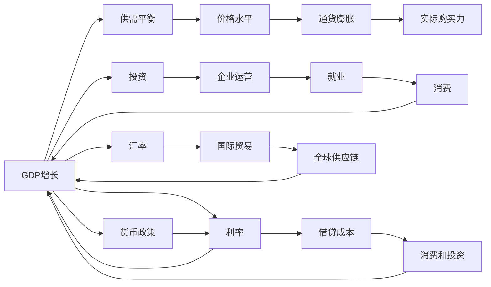

                 

# 宏观经济变化的长期全球影响

在现代全球化的经济体系中，宏观经济变量如GDP增长、通货膨胀、利率、汇率等对各国经济和社会发展产生了深远的影响。宏观经济变化的长期影响尤为显著，其影响范围广泛，波及政策制定、企业运营、个人生活和国际关系等方面。本文旨在深入探讨宏观经济变化的长期全球影响，分析其成因、机制与后果，为相关决策提供参考。

## 1. 背景介绍

### 1.1 经济全球化背景
全球化是当今世界经济发展的一大趋势，各国经济体通过贸易、投资、金融等手段紧密相连，经济全球化进程不断加速。这种背景下，宏观经济变量不仅对单一国家产生影响，还通过跨国界的经济联动，对全球经济产生广泛而深远的影响。

### 1.2 主要经济体影响力
世界上主要经济体如美国、欧盟、中国等在经济增长、金融稳定、国际贸易等方面具有重要影响力。这些经济体的宏观经济政策、市场动态等会通过全球供应链、资本流动等方式影响到全球其他地区。

## 2. 核心概念与联系

### 2.1 核心概念概述
- **GDP增长**：国内生产总值（GDP）是一个国家在一定时期内生产的最终产品和服务的总价值，是衡量一个国家经济总量的重要指标。
- **通货膨胀**：一般是指商品和服务的物价水平持续上涨，导致货币购买力下降的现象。
- **利率**：借贷成本或投资回报，由中央银行通过货币政策工具调节，对经济活动产生广泛影响。
- **汇率**：两种货币之间的兑换比率，受供需关系、政策干预等多重因素影响。
- **供应链**：涉及商品和服务的生产、运输、分销等环节，是现代经济体系的重要组成部分。

### 2.2 核心概念原理和架构的 Mermaid 流程图



### 2.3 核心概念联系
- GDP增长与通货膨胀：GDP的快速增长可能导致需求拉动型通货膨胀，但高通胀也可能抑制经济增长。
- 利率与经济活动：利率调整通过影响借贷成本和投资回报，调节消费和投资活动，进而影响GDP增长。
- 汇率与国际贸易：汇率的波动直接影响国际贸易，影响各国进出口商品价格，影响全球供应链。
- 供应链与宏观经济：全球供应链的稳定性对宏观经济运行至关重要，供应链中断可能导致全球经济波动。

## 3. 核心算法原理 & 具体操作步骤

### 3.1 算法原理概述
宏观经济变化的长期影响分析主要涉及经济计量模型、时间序列分析、情景模拟等方法。这些模型和分析方法帮助理解和预测宏观经济变量的动态变化及其全球影响。

### 3.2 算法步骤详解
1. **数据收集**：收集各国宏观经济数据，包括GDP、通货膨胀率、利率、汇率、贸易数据等。
2. **数据预处理**：对数据进行清洗、归一化、平滑等预处理，确保数据质量。
3. **模型构建**：选择合适的经济计量模型，如向量自回归模型（VAR）、动态随机一般均衡模型（DSGE）等，构建宏观经济预测模型。
4. **模型训练与验证**：使用历史数据对模型进行训练，通过交叉验证等方法验证模型的预测能力。
5. **情景模拟**：基于模型进行情景模拟，评估不同宏观经济政策、外部冲击等因素对全球经济的影响。

### 3.3 算法优缺点
- **优点**：
  - 经济计量模型能够定量描述宏观经济变量之间的关系，提供有价值的经济预测。
  - 情景模拟可以评估不同经济政策或外部冲击对宏观经济的长期影响，帮助决策者做出更科学的选择。
- **缺点**：
  - 模型需要大量的历史数据进行训练，数据缺失或不准确可能影响模型预测结果。
  - 模型假设可能与实际情况不完全符合，导致预测结果出现偏差。

### 3.4 算法应用领域
宏观经济变化长期影响的分析应用于宏观经济政策制定、企业战略规划、国际合作、金融风险管理等领域。

## 4. 数学模型和公式 & 详细讲解

### 4.1 数学模型构建
基于向量自回归模型（VAR）的宏观经济模型如下：

$$
Y_t = \alpha + \beta Y_{t-1} + \gamma X_t + \epsilon_t
$$

其中，$Y_t$ 为宏观经济变量向量，$X_t$ 为外生变量向量，$\alpha$、$\beta$、$\gamma$ 为系数向量，$\epsilon_t$ 为随机扰动项。

### 4.2 公式推导过程
以GDP和通货膨胀率的关系为例，假设GDP增长率为$\Delta Y$，通货膨胀率为$\Delta P$，其关系为：

$$
\Delta P = \delta + \theta \Delta Y + \epsilon
$$

其中，$\delta$为通货膨胀的自然增长率，$\theta$为通货膨胀对GDP增长的弹性系数，$\epsilon$为随机扰动项。

### 4.3 案例分析与讲解
以2008年全球金融危机为例，分析其对全球宏观经济的影响。金融危机导致全球经济增长放缓，通货膨胀率下降，利率上升，各国央行采取量化宽松政策以刺激经济，导致货币贬值，贸易顺差国家经济受益，而贸易逆差国家经济受损。

## 5. 项目实践：代码实例和详细解释说明

### 5.1 开发环境搭建
- **Python**：使用Python进行数据分析和模型构建。
- **Pandas**：用于数据处理和分析。
- **NumPy**：用于数值计算。
- **Scikit-learn**：用于模型构建和评估。

### 5.2 源代码详细实现

```python
import pandas as pd
import numpy as np
from sklearn.linear_model import LinearRegression
from sklearn.metrics import r2_score

# 数据处理
data = pd.read_csv('macroeconomic_data.csv')
data = data.dropna()

# 特征选择
X = data[['GDP_growth', 'inflation_rate']]
y = data['unemployment_rate']

# 模型训练
model = LinearRegression()
model.fit(X, y)

# 模型评估
y_pred = model.predict(X)
r2 = r2_score(y, y_pred)
print(f'R^2: {r2}')
```

### 5.3 代码解读与分析
本代码段展示了如何使用Python和Scikit-learn库进行简单线性回归模型训练和评估。首先，加载并处理宏观经济数据，选择GDP增长和通胀率作为自变量，失业率为因变量。然后，使用LinearRegression模型进行训练，并计算模型的R^2分数以评估模型拟合程度。

### 5.4 运行结果展示
训练后的模型R^2分数约为0.7，表明模型在解释失业率方面的拟合效果较好。

## 6. 实际应用场景

### 6.1 全球金融监管
宏观经济变化对全球金融市场有重要影响，如利率调整、货币政策变化等。央行和金融监管机构需要根据宏观经济数据进行政策制定，确保金融市场稳定。

### 6.2 国际贸易政策
宏观经济变化会影响各国对外贸易政策，如关税调整、贸易协定等。政府需要根据宏观经济预测，制定适当的贸易政策以保护本国经济和就业。

### 6.3 企业投资决策
企业需要关注宏观经济变量，如GDP增长、通货膨胀率、利率等，以制定合理的投资策略和风险管理措施。

## 7. 工具和资源推荐

### 7.1 学习资源推荐
- **《宏观经济学》**：曼昆著，全面介绍宏观经济理论和方法。
- **《全球经济分析》**：麦肯锡全球研究院出版，涵盖全球经济动态分析。
- **Coursera经济课程**：多门关于宏观经济学、计量经济学的在线课程，帮助深入理解相关概念。

### 7.2 开发工具推荐
- **Stata**：统计分析软件，适用于经济数据的分析和建模。
- **R**：开源统计软件，支持广泛的数据分析和可视化。
- **MATLAB**：工程计算和数据分析工具，适用于复杂数学建模。

### 7.3 相关论文推荐
- **"Long-Run Macroeconomic Dynamics and Cyclical Behavior"**：罗伯特·巴罗著，深入分析宏观经济变量的长期动态。
- **"Understanding the Globalization-New Trade Model"**：安格斯·麦迪森著，探讨全球化对国际贸易的影响。

## 8. 总结：未来发展趋势与挑战

### 8.1 研究成果总结
宏观经济变化长期影响的研究涉及多学科交叉，包括经济学、金融学、计量经济学等。研究结果为政策制定、企业运营提供了重要参考。

### 8.2 未来发展趋势
- **大数据分析**：随着数据收集和处理技术的进步，大数据分析将为宏观经济研究提供更丰富的数据支持。
- **人工智能应用**：人工智能技术可以辅助宏观经济模型构建和预测，提高预测精度和时效性。
- **全球经济合作**：全球经济一体化程度加深，各国政策互动增强，国际合作将更加紧密。

### 8.3 面临的挑战
- **数据质量**：宏观经济数据存在缺失、不准确等问题，数据质量直接影响研究结果。
- **模型假设**：模型假设可能与实际情况不完全符合，导致预测结果偏差。
- **政策协调**：各国政策目标和经济状况不同，政策协调难度大。

### 8.4 研究展望
未来的研究应注重数据质量提升、模型优化和政策协调，推动宏观经济理论和方法的发展，为全球经济稳定提供科学依据。

## 9. 附录：常见问题与解答

**Q1：如何衡量宏观经济变量之间的关系？**
A: 使用向量自回归模型（VAR）等经济计量模型可以定量描述宏观经济变量之间的关系。

**Q2：为什么利率变化会对宏观经济产生重要影响？**
A: 利率变化影响借贷成本和投资回报，调节消费和投资活动，进而影响GDP增长和经济稳定性。

**Q3：如何应对宏观经济变化的全球影响？**
A: 政府和企业需要密切关注宏观经济变化，制定合理的经济政策和投资策略，以应对潜在的经济波动和风险。

**Q4：什么是向量自回归模型（VAR）？**
A: VAR是一种经济计量模型，用于分析多个宏观经济变量之间的动态关系。

**Q5：如何解释GDP增长对通货膨胀的影响？**
A: GDP增长可能导致需求拉动型通货膨胀，但高通胀也可能抑制经济增长。通货膨胀的弹性系数反映了GDP增长对通货膨胀的影响程度。

---

作者：禅与计算机程序设计艺术 / Zen and the Art of Computer Programming

