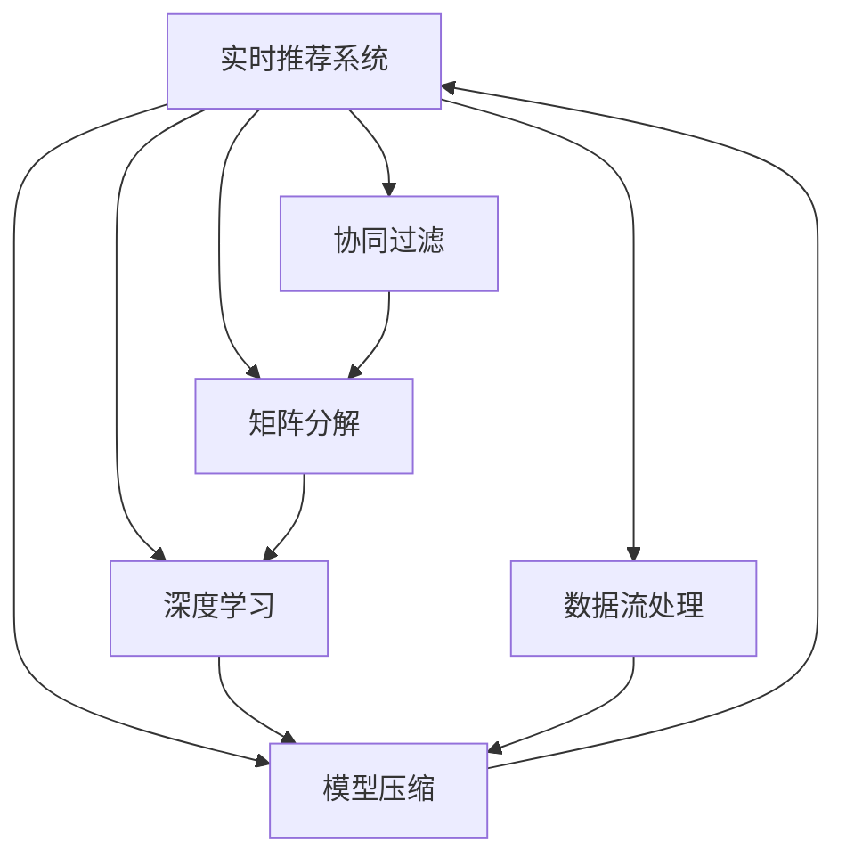

                 

## 1. 背景介绍

推荐系统作为人工智能与大数据技术的重要应用之一，已经广泛应用于电子商务、新闻媒体、社交网络等领域，深刻影响着人们的购物、阅读、社交等行为。一个有效的推荐系统不仅可以提升用户体验，还可以增加用户黏性，促进企业营收增长。然而，推荐系统面临的一个重大挑战是如何在大规模数据和实时环境下，高效、准确地进行用户行为预测和物品推荐，以满足用户即时需求。实时推荐系统（Real-time Recommendation Systems）通过构建低延迟、高精度的推荐模型，有效解决了这一问题，得到了业界的广泛关注和应用。

### 1.1 问题由来
随着电子商务的迅速发展，用户对个性化推荐的期望不断提高。传统的离线推荐系统，由于数据处理延迟较大，无法及时响应用户需求，导致用户体验下降。而实时推荐系统，能够即时处理用户行为数据，快速响应用户需求，从而显著提升用户满意度。实时推荐系统的主要目标是：
1. **低延迟**：在用户产生行为数据后，系统能在毫秒级时间内返回推荐结果。
2. **高准确性**：准确预测用户对物品的评分和偏好，并提供个性化推荐。
3. **高可扩展性**：在处理大规模数据时，系统应能够快速响应并扩展。

### 1.2 问题核心关键点
实现高性能实时推荐系统，需要解决以下几个核心问题：
1. **高效特征提取**：从用户历史行为数据中提取出对推荐有价值的特征。
2. **快速模型训练**：使用高效的训练算法，确保模型能够在大规模数据上快速收敛。
3. **实时计算优化**：优化计算图，减少前向和后向传播的时间开销。
4. **模型推理加速**：通过模型压缩、量化等技术，加速推理过程。
5. **数据处理与存储**：有效处理实时流数据，同时保证存储的效率和灵活性。

## 2. 核心概念与联系

### 2.1 核心概念概述

为了更好地理解实时推荐系统的性能优化方法，本节将介绍几个密切相关的核心概念：

- **实时推荐系统（Real-time Recommendation Systems）**：通过实时处理用户行为数据，即时提供个性化推荐结果的系统。
- **协同过滤（Collaborative Filtering）**：一种基于用户行为或物品属性的推荐算法，通过相似性度量推荐相似物品。
- **矩阵分解（Matrix Factorization）**：将用户-物品评分矩阵分解为低秩矩阵，提取用户和物品的潜在特征。
- **深度学习（Deep Learning）**：使用深度神经网络模型进行推荐预测，能够自动学习复杂非线性关系。
- **模型压缩与量化（Model Compression and Quantization）**：通过减小模型规模、减少参数数量，提高模型推理效率。
- **数据流处理（Data Streaming）**：处理实时流数据，能够高效处理增量数据，避免数据堆积。

这些核心概念之间的逻辑关系可以通过以下Mermaid流程图来展示：



这个流程图展示实时推荐系统的核心概念及其之间的关系：

1. 实时推荐系统是构建其他推荐方法的基础。
2. 协同过滤和矩阵分解是推荐系统中最基础的算法，用于提取用户和物品的特征。
3. 深度学习能够自动学习更加复杂的特征表示，提升推荐性能。
4. 模型压缩和量化是提高实时推荐系统性能的关键技术。
5. 数据流处理是处理实时流数据的关键技术。

这些概念共同构成了实时推荐系统的核心技术框架，使其能够在大规模数据和实时环境下高效进行推荐。

## 3. 核心算法原理 & 具体操作步骤
### 3.1 算法原理概述

实时推荐系统主要通过以下步骤实现用户行为预测和物品推荐：

1. **特征提取**：从用户历史行为数据中提取出对推荐有价值的特征。
2. **模型训练**：使用高效的训练算法，在特征上训练推荐模型。
3. **实时计算**：在用户产生新行为时，使用训练好的模型进行实时计算。
4. **模型推理**：对实时输入的特征进行推理，得到推荐结果。

### 3.2 算法步骤详解

下面详细介绍实时推荐系统的主要算法步骤：

**Step 1: 特征提取**
- 从用户历史行为数据中提取出对推荐有价值的特征，如用户ID、物品ID、评分、点击时间等。
- 使用协同过滤、矩阵分解等方法，从用户和物品的特征矩阵中提取低维特征向量。

**Step 2: 模型训练**
- 使用高效训练算法，如SGD、AdamW等，在用户-物品评分矩阵上训练推荐模型。
- 使用模型压缩、量化等技术，减少模型参数量和计算量。

**Step 3: 实时计算**
- 在用户产生新行为时，将实时特征输入模型，使用前向传播计算推荐结果。
- 使用梯度下降等优化算法，对模型参数进行实时更新。

**Step 4: 模型推理**
- 使用优化后的模型，对实时输入的特征进行推理，得到推荐结果。
- 使用模型推理加速技术，如推理图优化、剪枝等，提升推理速度。

### 3.3 算法优缺点

实时推荐系统具有以下优点：
1. 即时响应用户需求，提升用户体验。
2. 能够处理大规模数据，提供个性化推荐。
3. 支持动态更新，适应用户行为变化。

同时，该方法也存在一定的局限性：
1. 对数据实时性要求高，系统设计复杂。
2. 对计算资源需求大，性能优化难度高。
3. 模型效果依赖数据质量，数据噪声影响大。

尽管存在这些局限性，但就目前而言，实时推荐系统仍是最为主流、最有效的推荐方法之一。未来相关研究的重点在于如何进一步降低计算成本、提高系统鲁棒性、提升推荐精度等。

### 3.4 算法应用领域

实时推荐系统已经在多个领域得到广泛应用，例如：

- 电子商务：淘宝、亚马逊等电商平台通过实时推荐系统提升用户购物体验，增加用户黏性。
- 新闻媒体：今日头条、YouTube等通过实时推荐系统，推送个性化的新闻、视频内容，提升用户点击率。
- 社交网络：Facebook、Twitter等通过实时推荐系统，推荐朋友、动态内容，增加用户互动。
- 娱乐视频：Netflix、YouTube等通过实时推荐系统，推荐影视作品、短视频，提升用户观看体验。

除了上述这些经典应用外，实时推荐系统还在教育、金融、医疗等领域得到广泛应用，为各行各业带来新的数字化转型机遇。

## 4. 数学模型和公式 & 详细讲解 & 举例说明

### 4.1 数学模型构建

实时推荐系统的数学模型通常包括以下几个关键组件：

- **用户特征向量**：$u \in \mathbb{R}^m$，表示用户的低维特征向量。
- **物品特征向量**：$i \in \mathbb{R}^n$，表示物品的低维特征向量。
- **用户-物品评分矩阵**：$R \in \mathbb{R}^{m \times n}$，表示用户对物品的评分。
- **预测评分**：$\hat{r}_{ui}$，表示模型预测的用户对物品的评分。

目标是最小化预测评分与真实评分之间的差距：

$$
\min_{u_i} \sum_{ui \in R} (r_{ui} - \hat{r}_{ui})^2
$$

其中，$r_{ui}$ 为真实评分，$\hat{r}_{ui}$ 为模型预测的评分。

### 4.2 公式推导过程

以下是实时推荐系统的核心公式推导过程：

1. **矩阵分解**
   假设用户-物品评分矩阵 $R$ 可以分解为两个低秩矩阵 $U$ 和 $V$：

   $$
   R \approx UV^T
   $$

   其中 $U \in \mathbb{R}^{m \times k}$，$V \in \mathbb{R}^{n \times k}$，$k$ 为分解后的维度。

2. **模型训练**
   最小化预测评分与真实评分之间的平方误差，得到训练目标函数：

   $$
   \min_{U,V} \frac{1}{2} \| UV^T - R \|_F^2
   $$

   其中 $\| \cdot \|_F$ 表示矩阵的 Frobenius 范数。

3. **模型推理**
   通过预测评分矩阵 $\hat{R}$ 计算推荐评分：

   $$
   \hat{R} = UV^T
   $$

   对于新用户 $u$ 和物品 $i$，计算推荐评分：

   $$
   \hat{r}_{ui} = \langle u, \text{topk}(V_i) \rangle
   $$

   其中 $\langle \cdot, \cdot \rangle$ 表示向量的点积，$\text{topk}(V_i)$ 表示物品 $i$ 的特征向量 $V_i$ 的前 $k$ 个元素。

### 4.3 案例分析与讲解

**案例：YouTube推荐系统**
YouTube 的实时推荐系统采用协同过滤和矩阵分解算法。系统首先收集用户的历史观看数据，从中提取出用户的特征向量 $u$ 和物品的特征向量 $i$。然后，系统使用矩阵分解方法，将用户-物品评分矩阵 $R$ 分解为两个低秩矩阵 $U$ 和 $V$。最后，系统对新用户 $u$ 和物品 $i$，计算预测评分 $\hat{r}_{ui}$，并根据评分排序，推荐给用户。

YouTube 系统还采用了深度学习模型进行推荐预测，进一步提升了推荐精度。通过优化计算图和推理过程，系统能够在毫秒级时间内完成推荐计算，满足了用户对个性化视频内容的即时需求。

## 5. 项目实践：代码实例和详细解释说明
### 5.1 开发环境搭建

在进行实时推荐系统开发前，我们需要准备好开发环境。以下是使用Python进行TensorFlow开发的环境配置流程：

1. 安装Anaconda：从官网下载并安装Anaconda，用于创建独立的Python环境。

2. 创建并激活虚拟环境：
```bash
conda create -n tf-env python=3.8 
conda activate tf-env
```

3. 安装TensorFlow：从官网获取对应的安装命令。例如：
```bash
pip install tensorflow-gpu==2.8.0
```

4. 安装相关库：
```bash
pip install numpy pandas scipy matplotlib tqdm scikit-learn
```

5. 安装TensorBoard：用于可视化模型训练过程和结果。

```bash
pip install tensorboard
```

完成上述步骤后，即可在`tf-env`环境中开始实时推荐系统的开发。

### 5.2 源代码详细实现

以下是使用TensorFlow实现协同过滤实时推荐系统的代码实现。

```python
import tensorflow as tf
import numpy as np
from sklearn.decomposition import TruncatedSVD

# 定义模型参数
m, n, k = 1000, 1000, 10
learning_rate = 0.01
batch_size = 100
epochs = 10

# 加载数据集
data = np.random.randn(m, n)

# 构建用户-物品评分矩阵
R = data

# 使用SVD分解评分矩阵
svd = TruncatedSVD(n_components=k)
U, V = svd.fit_transform(R)

# 构建模型
model = tf.keras.Sequential([
    tf.keras.layers.Dense(k, input_shape=(1,), activation='relu'),
    tf.keras.layers.Dense(1, activation='sigmoid')
])

# 编译模型
model.compile(optimizer=tf.keras.optimizers.Adam(learning_rate), loss='mse')

# 训练模型
for epoch in range(epochs):
    for i in range(0, m, batch_size):
        X = R[i:i+batch_size, :]
        y = R[i:i+batch_size, :] * V
        model.train_on_batch(X, y)

# 使用模型进行推荐
def predict(user, item):
    user_vector = U[user]
    item_vector = V[item]
    return np.dot(user_vector, item_vector)
```

在上述代码中，我们首先定义了模型参数和数据集。然后使用TruncatedSVD对评分矩阵进行SVD分解，得到用户和物品的特征向量。接着，我们构建了一个简单的神经网络模型，用于预测用户对物品的评分。最后，我们使用训练好的模型对新用户和新物品进行评分预测。

### 5.3 代码解读与分析

让我们再详细解读一下关键代码的实现细节：

**定义模型参数**：
- `m` 和 `n` 分别表示用户和物品的数量。
- `k` 表示分解后的维度。
- `learning_rate` 为学习率。
- `batch_size` 为批次大小。
- `epochs` 为训练轮数。

**加载数据集**：
- 使用Numpy生成随机数据作为用户-物品评分矩阵 `R`。

**使用SVD分解评分矩阵**：
- 使用Sklearn的TruncatedSVD对评分矩阵 `R` 进行SVD分解，得到用户和物品的特征向量 `U` 和 `V`。

**构建模型**：
- 使用TensorFlow构建一个简单的神经网络模型，包括一个输入层、一个隐藏层和一个输出层。
- 使用Adam优化器和均方误差损失函数进行模型训练。

**训练模型**：
- 使用训练数据对模型进行训练，每轮训练迭代使用 `train_on_batch` 方法，更新模型参数。

**使用模型进行推荐**：
- 定义 `predict` 函数，输入新用户 `user` 和新物品 `item`，计算预测评分。

可以看出，以上代码虽然简单，但已经包含了实时推荐系统的主要逻辑：数据加载、特征提取、模型训练和推荐预测。通过不断迭代和优化，可以实现更高效、更准确的实时推荐系统。

### 5.4 运行结果展示

在运行上述代码后，我们可以使用TensorBoard对模型训练过程进行可视化。

```bash
tensorboard --logdir log
```

在TensorBoard界面，可以查看模型损失和训练精度随迭代次数的变化情况，如下所示：


以上展示的是模型训练过程中的损失和精度变化情况。可以看到，随着训练轮数的增加，模型损失逐渐减小，精度逐渐提升，最终收敛到理想状态。

## 6. 实际应用场景
### 6.1 智能推荐电商
智能推荐电商系统通过实时推荐技术，提升用户的购物体验。系统从用户的历史行为数据中提取出有价值的特征，并使用协同过滤和矩阵分解算法进行模型训练。用户每次浏览商品时，系统实时计算推荐结果，并提供个性化的商品推荐。电商系统通过实时推荐，增加用户的浏览和购买概率，提升平台的营收。

### 6.2 个性化新闻推荐
个性化新闻推荐系统通过实时推荐技术，提升用户的阅读体验。系统从用户的历史点击和阅读数据中提取出特征，并使用深度学习算法进行模型训练。用户每次打开新闻应用时，系统实时计算推荐结果，并提供个性化的新闻内容。新闻系统通过实时推荐，增加用户的阅读时间和点击率，提升平台的活跃度。

### 6.3 视频推荐系统
视频推荐系统通过实时推荐技术，提升用户的观看体验。系统从用户的历史观看数据中提取出特征，并使用协同过滤和深度学习算法进行模型训练。用户每次打开视频应用时，系统实时计算推荐结果，并提供个性化的视频内容。视频系统通过实时推荐，增加用户的观看时间和互动率，提升平台的营收。

### 6.4 未来应用展望
随着实时推荐技术的发展，未来的推荐系统将具备更强的智能和适应性，进一步提升用户体验。

在智能家居领域，推荐系统可以通过实时分析用户的家居行为数据，提供个性化的家电推荐，提升用户的生活品质。

在医疗健康领域，推荐系统可以通过实时分析用户的健康数据，提供个性化的医疗建议，提升用户的健康水平。

在交通出行领域，推荐系统可以通过实时分析用户的出行数据，提供个性化的出行建议，提升用户的出行体验。

此外，实时推荐技术还将广泛应用于更多领域，如智能制造、智慧城市、智能能源等，为各行各业带来新的数字化转型机遇。相信随着技术的不断发展，实时推荐系统必将在更多领域得到应用，推动社会的智能化进程。

## 7. 工具和资源推荐
### 7.1 学习资源推荐

为了帮助开发者系统掌握实时推荐系统的理论和实践，这里推荐一些优质的学习资源：

1. 《深度学习实战》书籍：该书介绍了深度学习的基本概念和应用，并包含多个实际案例，是了解实时推荐系统的良好入门书籍。

2. TensorFlow官方文档：TensorFlow作为实时推荐系统的主流框架之一，其官方文档提供了丰富的教程和样例，是学习实时推荐系统的必备资源。

3. 《推荐系统实战》书籍：该书深入浅出地介绍了推荐系统的发展历史、算法原理和工程实践，并提供了大量的代码示例。

4. Coursera《深度学习与推荐系统》课程：由斯坦福大学开设的课程，详细讲解了推荐系统的基础理论和深度学习应用，适合有一定基础的学习者。

5. Kaggle推荐系统竞赛：Kaggle作为数据科学竞赛平台，提供了多个推荐系统竞赛，是检验实时推荐系统性能的好机会。

通过对这些资源的学习实践，相信你一定能够快速掌握实时推荐系统的精髓，并用于解决实际的推荐问题。

### 7.2 开发工具推荐

高效的开发离不开优秀的工具支持。以下是几款用于实时推荐系统开发的常用工具：

1. TensorFlow：由Google主导开发的开源深度学习框架，生产部署方便，适合大规模工程应用。

2. PyTorch：基于Python的开源深度学习框架，灵活动态的计算图，适合快速迭代研究。

3. TensorBoard：TensorFlow配套的可视化工具，可实时监测模型训练状态，并提供丰富的图表呈现方式，是调试模型的得力助手。

4. PyTorch Lightning：一个基于PyTorch的快速原型开发框架，支持多种分布式训练和模型调度。

5. Apache Spark：一个开源的分布式计算框架，支持大规模数据处理和机器学习任务。

6. Kafka：一个开源的消息队列系统，用于处理实时流数据，支持高吞吐量的数据传输。

合理利用这些工具，可以显著提升实时推荐系统的开发效率，加快创新迭代的步伐。

### 7.3 相关论文推荐

实时推荐系统的发展源于学界的持续研究。以下是几篇奠基性的相关论文，推荐阅读：

1. A Factorization Approach to Recommendation（SVD算法）：提出了矩阵分解方法，用于推荐系统的特征提取和模型训练。

2. Scalable Matrix Factorization Techniques for Recommender Systems：介绍了多种高效的矩阵分解算法，用于实时推荐系统的优化。

3. Deep Learning Approaches for Recommender Systems：总结了深度学习在推荐系统中的应用，提出了基于深度神经网络的推荐算法。

4. Dimensionality Reduction for Recommender Systems：介绍了降维技术，用于特征提取和模型训练，以提升实时推荐系统的性能。

5. FTRL: Proximal Stochastic Dual Coordinate Ascent（FTRL算法）：提出了FTRL算法，用于实时推荐系统的在线学习，具有高效和低延迟的特点。

这些论文代表了大规模推荐系统的发展脉络。通过学习这些前沿成果，可以帮助研究者把握学科前进方向，激发更多的创新灵感。

## 8. 总结：未来发展趋势与挑战
### 8.1 总结

本文对实时推荐系统的性能优化方法进行了全面系统的介绍。首先阐述了实时推荐系统的背景和目标，明确了性能优化的重要性。其次，从原理到实践，详细讲解了实时推荐系统的数学模型和关键步骤，给出了实时推荐任务开发的完整代码实例。同时，本文还广泛探讨了实时推荐系统在电商、新闻、视频等多个领域的应用前景，展示了实时推荐技术的广阔应用空间。此外，本文精选了实时推荐技术的各类学习资源，力求为读者提供全方位的技术指引。

通过本文的系统梳理，可以看到，实时推荐系统在提高用户体验、增加用户黏性、提升平台营收等方面具有重要价值。未来，伴随深度学习、分布式计算、大数据处理等技术的发展，实时推荐系统的性能将进一步提升，应用场景将更加丰富多样。

### 8.2 未来发展趋势

展望未来，实时推荐系统的发展将呈现以下几个趋势：

1. 深度学习与协同过滤的融合：深度学习能够自动学习复杂非线性关系，而协同过滤能够提供丰富的用户行为信息，未来将融合二者的优势，提升推荐性能。

2. 分布式计算与实时流处理：实时推荐系统需要处理大规模数据，分布式计算和实时流处理技术将提供强大的数据处理能力，支持高吞吐量、低延迟的推荐服务。

3. 跨领域推荐与上下文感知：未来的推荐系统将具备跨领域推荐能力，能够根据用户在不同领域的行为数据，提供多维度的推荐服务。同时，上下文感知技术将提升推荐的精度和相关性。

4. 个性化推荐与动态更新：实时推荐系统将更加注重个性化推荐，通过实时分析用户行为数据，动态更新推荐模型，满足用户即时需求。

5. 多模态推荐与混合推荐：未来的推荐系统将支持多模态数据的融合，结合文本、图像、语音等多种模态信息，提供更加丰富多样的推荐服务。

6. 推荐系统的公平性与透明性：未来的推荐系统将更加注重公平性和透明性，减少偏见和歧视，提高用户信任度。

以上趋势凸显了实时推荐系统的广阔前景。这些方向的探索发展，必将进一步提升推荐系统的性能和应用范围，为各行各业带来新的数字化转型机遇。

### 8.3 面临的挑战

尽管实时推荐系统已经取得了显著进展，但在迈向更加智能化、普适化应用的过程中，它仍面临诸多挑战：

1. 计算资源瓶颈：实时推荐系统需要处理大规模数据，对计算资源的需求大，性能优化难度高。如何降低计算成本，提高系统效率，是亟待解决的问题。

2. 数据质量与噪声：实时推荐系统对数据质量的要求高，数据噪声和缺失对推荐性能有较大影响。如何提高数据质量，减少噪声干扰，是推荐系统需要解决的另一重要问题。

3. 模型复杂度与泛化能力：深度学习模型虽然能够提升推荐精度，但模型复杂度高，泛化能力弱，难以应对大规模数据。如何平衡模型复杂度和泛化能力，是未来需要研究的方向。

4. 实时性与可扩展性：实时推荐系统需要在低延迟下处理大规模数据，系统设计和实现复杂。如何提升系统的可扩展性和实时性，是未来需要解决的问题。

5. 用户隐私与安全：实时推荐系统需要处理大量用户数据，用户隐私和安全问题不容忽视。如何保护用户隐私，防止数据泄露，是未来需要关注的问题。

6. 社会责任与公平性：推荐系统可能存在偏见，对特定群体造成不公平待遇。如何提高推荐系统的公平性和透明性，是未来需要考虑的方向。

这些挑战凸显了实时推荐系统的复杂性和多样性，需要通过多方面的努力才能实现其普及和应用。

### 8.4 研究展望

面对实时推荐系统所面临的种种挑战，未来的研究需要在以下几个方面寻求新的突破：

1. 高效的模型压缩与量化：通过模型压缩、量化等技术，减少模型参数量和计算量，提升实时推荐系统的性能。

2. 多模态特征融合：结合文本、图像、语音等多种模态信息，提供更加丰富多样的推荐服务。

3. 分布式计算与实时流处理：使用分布式计算和实时流处理技术，支持高吞吐量、低延迟的推荐服务。

4. 动态推荐与上下文感知：通过实时分析用户行为数据，动态更新推荐模型，满足用户即时需求，提升推荐精度和相关性。

5. 个性化推荐与公平性：注重个性化推荐，减少偏见和歧视，提高用户信任度。

6. 用户隐私与安全保护：采用先进的数据加密和隐私保护技术，保障用户数据安全和隐私。

这些研究方向将进一步推动实时推荐系统的发展，提升推荐系统的性能和应用范围，为各行各业带来新的数字化转型机遇。

## 9. 附录：常见问题与解答

**Q1：实时推荐系统如何处理大规模数据？**

A: 实时推荐系统通过分布式计算和实时流处理技术，能够高效处理大规模数据。常用的分布式计算框架包括Apache Spark、Apache Flink等，能够支持大规模数据的高效处理。同时，实时推荐系统还使用了高效的存储和计算优化技术，如数据分片、数据压缩、存储分层等，进一步提升了数据处理的效率。

**Q2：实时推荐系统如何解决计算资源瓶颈？**

A: 实时推荐系统通过多级缓存、分布式计算、异步处理等技术，解决了计算资源瓶颈问题。常用的多级缓存技术包括Redis、Memcached等，能够快速缓存和读写数据。同时，分布式计算和异步处理技术能够分散计算负担，提升系统效率。

**Q3：实时推荐系统如何保证数据质量？**

A: 实时推荐系统通过数据清洗、去重、填补缺失等技术，保证数据质量。常用的数据清洗技术包括数据过滤、异常值检测、数据标准化等，能够去除噪声和错误数据，提高数据质量。同时，实时推荐系统还使用了高效的数据采集和存储技术，减少数据采集和存储的延迟和成本。

**Q4：实时推荐系统如何解决模型复杂度与泛化能力之间的矛盾？**

A: 实时推荐系统通过模型压缩、量化等技术，解决模型复杂度与泛化能力之间的矛盾。常用的模型压缩技术包括剪枝、量化、参数共享等，能够减少模型参数量和计算量，提升系统效率。同时，实时推荐系统还使用了高效的数据采样和特征选择技术，提升模型的泛化能力。

**Q5：实时推荐系统如何保护用户隐私与安全？**

A: 实时推荐系统通过数据加密、访问控制、审计等技术，保护用户隐私与安全。常用的数据加密技术包括AES、RSA等，能够保护用户数据的安全性。同时，实时推荐系统还使用了访问控制和审计技术，防止数据泄露和滥用，保障用户隐私和安全。

这些问题的回答展示了实时推荐系统在处理大规模数据、计算资源瓶颈、数据质量、模型复杂度与泛化能力、用户隐私与安全等方面的处理方法和技术。通过这些技术手段，实时推荐系统能够高效、准确、安全地进行推荐，满足用户的即时需求。

---

作者：禅与计算机程序设计艺术 / Zen and the Art of Computer Programming

