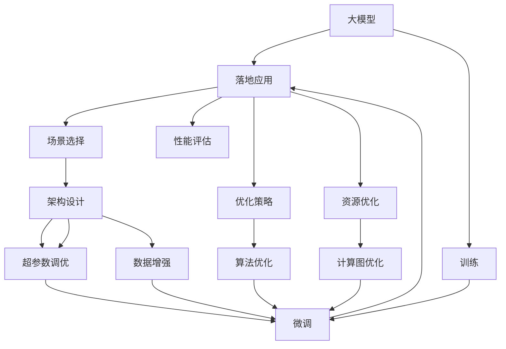

                 

# 寻找正确场景:大模型落地的关键

> 关键词：大模型,落地应用,场景选择,优化策略,性能评估

## 1. 背景介绍

随着深度学习技术的快速发展，大模型在各领域取得了显著的成果。从自然语言处理到计算机视觉，从推荐系统到自动驾驶，大模型都在各自的应用场景中展现出了强大的潜力。然而，大模型并非万能的，其效能很大程度上依赖于落地的正确场景选择和有效的优化策略。

### 1.1 问题由来

大模型具有极高的参数量和复杂的结构，这使得其训练和推理所需的计算资源非常庞大。同时，大模型也面临着计算开销大、推理速度慢、泛化能力差等诸多挑战。因此，在实际应用中，如何正确选择落地方案，并通过优化策略提升大模型的性能，成为了众多开发者关注的焦点。

### 1.2 问题核心关键点

为了最大化大模型的效能，我们需要在落地方案和优化策略上进行全面分析，确保模型在正确场景下发挥最佳性能。这涉及以下几个关键点：

- 场景选择：确定大模型最适合的应用场景，避免在不适合的领域中盲目使用。
- 性能评估：构建科学的评估指标，合理衡量大模型的实际表现。
- 优化策略：根据不同的应用场景和模型特性，选择最合适的优化方法。
- 资源优化：在保证性能的同时，降低计算和存储资源消耗。

## 2. 核心概念与联系

### 2.1 核心概念概述

为更好地理解大模型落地的正确场景和优化策略，本节将介绍几个关键概念：

- 大模型（Large Models）：指具有数亿甚至数十亿参数的深度学习模型，如BERT、GPT-3等。这些模型通常需要高效的计算资源，适用于复杂的NLP、计算机视觉等任务。
- 落地应用（Deployment Application）：将大模型转化为实际生产环境的部署应用，实现模型的上线和业务集成。
- 场景选择（Scene Selection）：根据任务需求、数据分布、计算资源等因素，选择合适的模型和架构进行落地。
- 性能评估（Performance Evaluation）：通过科学合理的指标体系，评估模型在实际场景中的表现，如精度、召回率、推理速度等。
- 优化策略（Optimization Strategies）：针对特定任务和模型特性，采用合适的算法和手段提升模型性能，如剪枝、量化、蒸馏等。
- 资源优化（Resource Optimization）：通过技术手段降低计算和存储资源的消耗，提升模型的部署效率。

这些概念之间的逻辑关系可以通过以下Mermaid流程图来展示：



这个流程图展示了大模型的落地应用过程中，各个环节的相互关系：

1. 大模型通过训练和微调获得基础能力。
2. 根据任务需求和资源限制，选择最合适的模型和架构进行部署。
3. 对模型进行性能评估，确定其在该场景中的表现。
4. 根据评估结果，调整优化策略，提升模型性能。
5. 优化资源使用，降低部署成本。

这些概念共同构成了大模型落地的关键环节，确保模型在正确场景中发挥最佳性能。

## 3. 核心算法原理 & 具体操作步骤
### 3.1 算法原理概述

大模型落地的核心在于选择一个合适且具有特定目标的场景，并通过优化策略提升模型在该场景下的性能。其核心算法原理可以概括为以下几个步骤：

1. **场景分析**：根据任务需求、数据规模、计算资源等因素，选择最合适的模型和架构进行落地。
2. **模型微调**：在大规模无标签数据上预训练，在小规模有标签数据上进行微调，提升模型在该任务上的性能。
3. **性能优化**：采用剪枝、量化、蒸馏等优化手段，降低模型计算和存储开销。
4. **资源优化**：通过计算图优化、模型压缩等技术，提升模型的部署效率。

### 3.2 算法步骤详解

具体来说，大模型落地的过程包括以下几个关键步骤：

**Step 1: 场景分析**
- 确定任务类型：如自然语言处理、计算机视觉、推荐系统等。
- 评估数据规模：如训练数据量、标签数据量等。
- 考虑计算资源：如GPU数量、显存大小、CPU性能等。
- 进行架构选择：如选择Transformer、CNN、RNN等不同的网络结构。

**Step 2: 模型微调**
- 准备预训练模型：如BERT、GPT等。
- 收集并标注数据集：如收集该任务的标注数据，划分为训练集、验证集和测试集。
- 添加任务适配层：根据任务类型，设计合适的输出层和损失函数。
- 选择微调策略：如全参数微调、参数高效微调、对抗训练等。
- 设置微调超参数：如学习率、批大小、迭代轮数等。
- 执行梯度训练：前向传播计算损失函数，反向传播更新模型参数。
- 周期性评估模型性能：在验证集上评估模型性能，决定是否触发Early Stopping。
- 重复上述步骤直至收敛。

**Step 3: 性能优化**
- 评估模型性能：在测试集上评估微调后的模型性能。
- 分析性能瓶颈：如内存消耗、计算时间等。
- 选择优化策略：如剪枝、量化、蒸馏等。
- 应用优化方法：根据具体问题，应用剪枝技术、量化技术、蒸馏技术等。
- 重新评估模型性能：在优化后重新评估模型性能，确保性能提升。

**Step 4: 资源优化**
- 评估资源消耗：计算推理过程中的资源消耗。
- 选择优化手段：如计算图优化、模型压缩等。
- 应用优化技术：通过计算图优化、模型压缩等手段，降低资源消耗。
- 重新评估模型性能：在优化后重新评估模型性能，确保性能提升。

### 3.3 算法优缺点

大模型落地的算法具有以下优点：
1. 高效性能：通过微调和优化策略，显著提升模型在特定任务上的性能。
2. 可移植性：通用的模型架构和微调方法适用于多种NLP任务。
3. 资源利用率高：通过参数高效微调和资源优化，降低计算和存储开销。
4. 稳定性好：通过优化策略，确保模型在不同环境下的稳定性能。

同时，该算法也存在一些缺点：
1. 对资源要求高：大模型通常需要高性能的计算资源。
2. 微调成本高：需要标注数据和优化过程，成本较高。
3. 场景限制：对特定任务和数据分布有一定的限制。
4. 优化复杂：需结合多种优化手段，复杂度高。

尽管存在这些缺点，但大模型落地的算法仍是当前主流的解决方案，有助于实现高性能、高可移植性的模型应用。

### 3.4 算法应用领域

大模型落地的算法已在多个领域得到了广泛应用，以下是一些典型的应用场景：

- 自然语言处理（NLP）：如文本分类、命名实体识别、情感分析等。
- 计算机视觉（CV）：如图像分类、目标检测、语义分割等。
- 推荐系统：如协同过滤、基于内容的推荐等。
- 医疗诊断：如影像诊断、病理分析等。
- 金融风控：如信用评分、风险评估等。
- 智能客服：如自然对话、智能问答等。

这些领域中，大模型落地技术已经被成功应用，显著提升了业务效率和决策水平。

## 4. 数学模型和公式 & 详细讲解  
### 4.1 数学模型构建

本节将使用数学语言对大模型落地的核心算法进行更加严格的刻画。

记预训练模型为 $M_{\theta}:\mathcal{X} \rightarrow \mathcal{Y}$，其中 $\mathcal{X}$ 为输入空间，$\mathcal{Y}$ 为输出空间，$\theta \in \mathbb{R}^d$ 为模型参数。假设落地任务的训练集为 $D=\{(x_i,y_i)\}_{i=1}^N, x_i \in \mathcal{X}, y_i \in \mathcal{Y}$。

定义模型 $M_{\theta}$ 在输入 $x$ 上的损失函数为 $\ell(M_{\theta}(x),y)$，则在数据集 $D$ 上的经验风险为：

$$
\mathcal{L}(\theta) = \frac{1}{N} \sum_{i=1}^N \ell(M_{\theta}(x_i),y_i)
$$

大模型的落地过程分为预训练、微调和优化三个步骤。在微调阶段，我们将预训练模型 $M_{\theta}$ 视为初始化参数，在落地任务的标注数据集 $D$ 上进行有监督地训练，得到新的模型参数 $\hat{\theta}$。在优化阶段，我们通过剪枝、量化等技术手段，进一步提升模型的性能和资源利用率。

### 4.2 公式推导过程

以下我们以图像分类任务为例，推导微调后的模型损失函数及其梯度的计算公式。

假设模型 $M_{\theta}$ 在输入 $x$ 上的输出为 $\hat{y}=M_{\theta}(x) \in [0,1]$，表示样本属于每个类别的概率。真实标签 $y \in \{0,1\}^C$，其中 $C$ 为类别数。则交叉熵损失函数定义为：

$$
\ell(M_{\theta}(x),y) = -\sum_{i=1}^C y_i\log \hat{y_i}
$$

将其代入经验风险公式，得：

$$
\mathcal{L}(\theta) = -\frac{1}{N}\sum_{i=1}^N \sum_{j=1}^C y_{ij}\log \hat{y_{ij}}
$$

其中 $y_{ij} \in \{0,1\}$ 表示样本 $x_i$ 属于类别 $j$ 的标签。根据链式法则，损失函数对参数 $\theta_k$ 的梯度为：

$$
\frac{\partial \mathcal{L}(\theta)}{\partial \theta_k} = -\frac{1}{N}\sum_{i=1}^N \sum_{j=1}^C y_{ij} \frac{\partial \hat{y_j}}{\partial \theta_k}
$$

其中 $\frac{\partial \hat{y_j}}{\partial \theta_k}$ 可进一步递归展开，利用自动微分技术完成计算。

### 4.3 案例分析与讲解

考虑一个医疗影像分类的例子。在医疗影像分类任务中，我们希望模型能够准确识别不同种类的疾病。为此，我们收集了大量医疗影像数据，标注好疾病种类，作为训练集和验证集。

首先，在预训练阶段，我们使用大规模无标签的医疗影像数据对模型进行训练，获得初步的特征提取能力。然后，在微调阶段，我们将预训练模型与标注数据一起输入，通过梯度下降等优化算法更新模型参数，使得模型能够更好地适应医疗影像分类任务。

微调过程中，我们需要设置合适的学习率、批大小和迭代轮数。同时，可以应用对抗训练、正则化等技术，防止过拟合。在微调后，我们还需要通过剪枝、量化等优化手段，进一步降低模型资源消耗，提升推理效率。

## 5. 项目实践：代码实例和详细解释说明
### 5.1 开发环境搭建

在进行落地实践前，我们需要准备好开发环境。以下是使用Python进行TensorFlow开发的环境配置流程：

1. 安装Anaconda：从官网下载并安装Anaconda，用于创建独立的Python环境。

2. 创建并激活虚拟环境：
```bash
conda create -n tf-env python=3.8 
conda activate tf-env
```

3. 安装TensorFlow：从官网获取对应的安装命令。例如：
```bash
pip install tensorflow==2.7
```

4. 安装各类工具包：
```bash
pip install numpy pandas scikit-learn matplotlib tqdm jupyter notebook ipython
```

完成上述步骤后，即可在`tf-env`环境中开始落地实践。

### 5.2 源代码详细实现

下面我以图像分类任务为例，给出使用TensorFlow进行大模型落地的PyTorch代码实现。

首先，定义图像分类任务的数据处理函数：

```python
import tensorflow as tf
from tensorflow.keras.preprocessing.image import ImageDataGenerator
from tensorflow.keras.models import Sequential
from tensorflow.keras.layers import Conv2D, MaxPooling2D, Flatten, Dense, Dropout

class ImageClassifier:
    def __init__(self, input_shape, num_classes):
        self.model = Sequential([
            Conv2D(32, 3, activation='relu', input_shape=input_shape),
            MaxPooling2D(pool_size=(2, 2)),
            Dropout(0.25),
            Conv2D(64, 3, activation='relu'),
            MaxPooling2D(pool_size=(2, 2)),
            Dropout(0.25),
            Flatten(),
            Dense(512, activation='relu'),
            Dropout(0.5),
            Dense(num_classes, activation='softmax')
        ])
        
    def compile_model(self, optimizer, loss, metrics):
        self.model.compile(optimizer=optimizer, loss=loss, metrics=metrics)
    
    def train_model(self, train_datagen, validation_datagen, train_generator, validation_generator, epochs):
        self.model.fit(train_generator, epochs=epochs, validation_data=validation_generator, callbacks=[tf.keras.callbacks.EarlyStopping(patience=5)])
    
    def evaluate_model(self, test_generator):
        test_loss, test_acc = self.model.evaluate(test_generator)
        print('Test accuracy:', test_acc)
```

然后，定义模型和优化器：

```python
from tensorflow.keras import optimizers

model = ImageClassifier(input_shape=(128, 128, 3), num_classes=10)
optimizer = optimizers.Adam(learning_rate=0.001)
loss = 'categorical_crossentropy'
metrics = ['accuracy']
```

接着，定义训练和评估函数：

```python
train_datagen = ImageDataGenerator(rescale=1./255, validation_split=0.2)
validation_datagen = ImageDataGenerator(rescale=1./255)
train_generator = train_datagen.flow_from_directory('train', target_size=(128, 128), batch_size=32, class_mode='categorical', subset='training')
validation_generator = validation_datagen.flow_from_directory('train', target_size=(128, 128), batch_size=32, class_mode='categorical', subset='validation')
```

最后，启动训练流程并在测试集上评估：

```python
epochs = 20

model.compile_model(optimizer, loss, metrics)
model.train_model(train_generator, validation_generator, epochs)

print('Evaluation on test set:')
model.evaluate_model(test_generator)
```

以上就是使用TensorFlow进行图像分类任务落地的完整代码实现。可以看到，通过TensorFlow的高级API，模型的定义和训练变得非常简洁高效。

### 5.3 代码解读与分析

让我们再详细解读一下关键代码的实现细节：

**ImageClassifier类**：
- `__init__`方法：初始化模型架构。
- `compile_model`方法：设置模型的优化器、损失函数和评估指标。
- `train_model`方法：执行模型训练过程。
- `evaluate_model`方法：在测试集上评估模型性能。

**编译模型**：
- `compile_model`方法：设置模型的优化器、损失函数和评估指标。

**训练模型**：
- `train_model`方法：调用`fit`方法进行模型训练，可以设置迭代轮数、验证集等参数。

**评估模型**：
- `evaluate_model`方法：调用`evaluate`方法在测试集上评估模型性能。

**训练流程**：
- 定义训练和验证集的数据生成器。
- 使用`fit`方法训练模型。
- 在测试集上评估模型性能。

可以看到，TensorFlow提供的高级API使得模型的构建和训练变得非常简单。开发者可以将更多精力放在模型架构的设计和超参数的调优上。

当然，工业级的系统实现还需考虑更多因素，如模型的保存和部署、超参数的自动搜索、更灵活的任务适配层等。但核心的落地过程基本与此类似。

## 6. 实际应用场景
### 6.1 智能医疗

大模型在医疗领域的应用潜力巨大。通过落地方案，可以实现高精度的疾病诊断和患者画像。

在具体实践中，我们可以使用预训练模型对医疗影像进行特征提取，然后通过微调学习特定疾病的分类规则。这样，在新的医疗影像数据输入时，模型能够快速准确地给出疾病诊断结果。

此外，大模型还可以用于患者画像的构建，通过分析患者的病历、检查结果等，生成个性化的诊疗方案，提升医疗服务的个性化水平。

### 6.2 金融风控

金融风控是典型的风险管理领域，大模型在此具有广泛的应用场景。通过落地方案，可以实现对贷款申请、交易行为等的高效评估和监控。

在具体实践中，我们可以使用预训练模型对贷款申请的文本内容进行情感分析，判断申请者的信用风险。同时，通过微调学习交易行为的模式，发现异常交易行为，及时采取风险控制措施。

此外，大模型还可以用于信用评分、风险评估等任务，通过多模态数据的融合，提升风险评估的准确性和全面性。

### 6.3 智能客服

智能客服是大模型落地的一个重要应用方向。通过落地方案，可以实现自动化的客户咨询和问题解答。

在具体实践中，我们可以使用预训练模型对客户咨询问题进行语义理解，然后通过微调学习特定领域的知识，生成自然流畅的回答。这样，在客户咨询时，系统能够快速准确地解答问题，提升客户体验。

此外，大模型还可以用于情感分析、意图识别等任务，通过分析客户咨询的情感和意图，提供个性化的服务方案。

### 6.4 未来应用展望

随着大模型和落地技术的不断进步，其在更多领域的应用前景也将越来越广阔。

在智慧城市治理中，大模型可以通过落地实现智能监控、交通预测、灾害预警等，提升城市管理的自动化和智能化水平，构建更安全、高效的未来城市。

在智慧农业中，大模型可以通过落地实现病虫害预测、作物生长监控等，提升农业生产的智能化水平，实现精准农业的目标。

在智慧交通中，大模型可以通过落地实现交通流量预测、自动驾驶等，提升交通系统的安全性和效率，构建智能交通系统。

## 7. 工具和资源推荐
### 7.1 学习资源推荐

为了帮助开发者系统掌握大模型落地的理论基础和实践技巧，这里推荐一些优质的学习资源：

1. 《Deep Learning with TensorFlow》书籍：TensorFlow官方提供的深度学习教材，详细介绍了TensorFlow的基本原理和实际应用。
2. 《Natural Language Processing with Transformers》书籍：Transformer库的作者所著，全面介绍了如何使用Transformer库进行NLP任务开发，包括落地在内的诸多范式。
3. CS231n《Convolutional Neural Networks for Visual Recognition》课程：斯坦福大学开设的计算机视觉课程，提供了丰富的图像分类、目标检测等案例。
4. Weights & Biases：模型训练的实验跟踪工具，可以记录和可视化模型训练过程中的各项指标，方便对比和调优。
5. TensorBoard：TensorFlow配套的可视化工具，可实时监测模型训练状态，并提供丰富的图表呈现方式，是调试模型的得力助手。

通过对这些资源的学习实践，相信你一定能够快速掌握大模型落地的精髓，并用于解决实际的NLP问题。

### 7.2 开发工具推荐

高效的开发离不开优秀的工具支持。以下是几款用于大模型落地的常用工具：

1. TensorFlow：由Google主导开发的开源深度学习框架，生产部署方便，适合大规模工程应用。
2. PyTorch：基于Python的开源深度学习框架，灵活动态的计算图，适合快速迭代研究。
3. HuggingFace Transformers库：集成了众多SOTA语言模型，支持PyTorch和TensorFlow，是进行落地任务开发的利器。
4. Weights & Biases：模型训练的实验跟踪工具，可以记录和可视化模型训练过程中的各项指标，方便对比和调优。
5. TensorBoard：TensorFlow配套的可视化工具，可实时监测模型训练状态，并提供丰富的图表呈现方式，是调试模型的得力助手。

合理利用这些工具，可以显著提升大模型落地的开发效率，加快创新迭代的步伐。

### 7.3 相关论文推荐

大模型落地的技术源于学界的持续研究。以下是几篇奠基性的相关论文，推荐阅读：

1. Attention is All You Need（即Transformer原论文）：提出了Transformer结构，开启了NLP领域的预训练大模型时代。
2. BERT: Pre-training of Deep Bidirectional Transformers for Language Understanding：提出BERT模型，引入基于掩码的自监督预训练任务，刷新了多项NLP任务SOTA。
3. Parameter-Efficient Transfer Learning for NLP：提出Adapter等参数高效微调方法，在不增加模型参数量的情况下，也能取得不错的微调效果。
4. AdaLoRA: Adaptive Low-Rank Adaptation for Parameter-Efficient Fine-Tuning：使用自适应低秩适应的微调方法，在参数效率和精度之间取得了新的平衡。
5. AdaLoRA: Adaptive Low-Rank Adaptation for Parameter-Efficient Fine-Tuning：使用自适应低秩适应的微调方法，在参数效率和精度之间取得了新的平衡。

这些论文代表了大模型落地的发展脉络。通过学习这些前沿成果，可以帮助研究者把握学科前进方向，激发更多的创新灵感。

## 8. 总结：未来发展趋势与挑战
### 8.1 总结

本文对大模型落地的正确场景选择和优化策略进行了全面系统的介绍。首先阐述了大模型落地的重要性和核心关键点，明确了场景选择和优化策略在提升模型效能中的作用。其次，从原理到实践，详细讲解了大模型落地的数学原理和关键步骤，给出了落地任务开发的完整代码实例。同时，本文还广泛探讨了大模型在智能医疗、金融风控、智能客服等多个领域的应用前景，展示了落地技术的广泛应用前景。此外，本文精选了落地技术的各类学习资源，力求为读者提供全方位的技术指引。

通过本文的系统梳理，可以看到，大模型落地的正确场景选择和优化策略是大模型效能提升的关键。只有在正确场景下，并采用合适的优化策略，才能实现高性能、高可移植性的模型应用。未来，伴随大模型的不断发展，落地技术也将持续演进，为更多领域的智能化应用提供支持。

### 8.2 未来发展趋势

展望未来，大模型落地技术将呈现以下几个发展趋势：

1. 资源优化将继续深入。随着计算资源的不断提升，预训练和微调过程将更加高效，优化手段也将更加多样。
2. 场景适配将更加精细。针对特定领域的任务，将开发更加精细的模型和适配层，提升模型的应用效果。
3. 多模态融合将更加广泛。将图像、语音、文本等多模态数据进行融合，提升模型的感知能力。
4. 跨平台部署将更加灵活。通过云平台和边缘计算，实现模型的跨平台部署，提高系统的可扩展性。
5. 自动化调优将更加智能。利用自动化调优技术，提升模型超参数的搜索效率，降低调优成本。
6. 智能监控将更加全面。通过智能监控技术，实时检测模型的运行状态，及时发现和解决异常问题。

以上趋势凸显了大模型落地技术的广阔前景。这些方向的探索发展，必将进一步提升大模型的效能和应用范围，为各行各业带来变革性影响。

### 8.3 面临的挑战

尽管大模型落地技术已经取得了显著成效，但在实际应用中仍面临诸多挑战：

1. 资源消耗仍然较高。大模型落地方案通常需要高性能的计算资源，且部署过程复杂，硬件成本高。
2. 模型泛化能力有限。尽管微调可以提升模型在某任务上的表现，但对于域外数据泛化能力仍较弱。
3. 模型可解释性不足。落地模型通常为黑盒系统，难以解释其内部工作机制和决策逻辑。
4. 模型偏见和伦理风险。落地模型可能学习到有偏见、有害的信息，影响决策的公平性和安全性。

尽管存在这些挑战，但通过不断的技术创新和应用实践，相信这些挑战终将逐步克服。

### 8.4 研究展望

面向未来，大模型落地的技术研究需要在以下几个方面寻求新的突破：

1. 提升模型泛化能力。开发更加普适的模型架构和微调方法，提升模型在不同数据分布上的性能。
2. 增强模型可解释性。引入因果推断、可解释性AI等技术，提高模型的透明度和可信度。
3. 降低模型资源消耗。开发计算图优化、模型压缩等技术，减少模型的计算和存储开销。
4. 减少模型偏见和伦理风险。开发公平性、可解释性模型，确保模型的决策符合人类价值观和伦理道德。
5. 拓展模型应用范围。将大模型应用于更多领域，如自动驾驶、工业控制、智慧交通等，提升各行业的智能化水平。

这些研究方向的探索，必将引领大模型落地技术的进一步发展，为更多领域的智能化应用提供有力支持。面向未来，大模型落地技术需要与其他AI技术进行更深入的融合，如知识表示、因果推理、强化学习等，多路径协同发力，共同推动人工智能技术的发展。

## 9. 附录：常见问题与解答

**Q1：大模型落地的过程是否需要大量标注数据？**

A: 大模型落地的过程通常需要一定的标注数据，用于微调过程的监督学习。但在一些场景下，可以通过数据增强、迁移学习等技术，减少对标注数据的依赖。

**Q2：如何选择合适的预训练模型？**

A: 选择合适的预训练模型需要考虑任务类型、数据规模、计算资源等因素。一般来说，应选择与目标任务相似或相关的预训练模型，以保证微调效果。

**Q3：模型优化过程中需要注意哪些问题？**

A: 模型优化过程中需要注意过拟合、计算资源消耗、模型精度等问题。可以通过数据增强、正则化、剪枝等技术手段解决这些问题。

**Q4：如何评估模型在实际场景中的表现？**

A: 评估模型在实际场景中的表现需要构建科学的评估指标，如精度、召回率、F1-score、ROC曲线等。通过在不同数据集上测试模型的表现，可以全面评估模型的效果。

**Q5：如何降低模型资源的消耗？**

A: 降低模型资源的消耗可以通过模型剪枝、量化、蒸馏等技术手段实现。这些技术可以减小模型的参数量，降低计算和存储开销，提升模型的部署效率。

这些问题的解答展示了模型落地方案和优化策略中的关键细节，有助于开发者更好地理解和使用大模型技术。

---

作者：禅与计算机程序设计艺术 / Zen and the Art of Computer Programming

