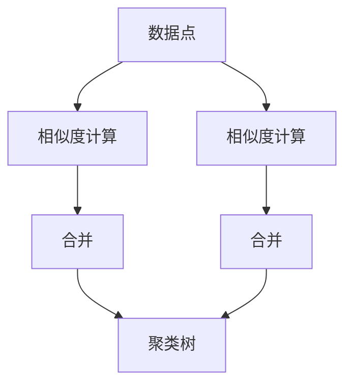

                 

## 1. 背景介绍

层次聚类（Hierarchical Clustering）是一种经典的无监督学习算法，用于对数据集进行分群或分类。与常见的K-Means等划分聚类算法不同，层次聚类可以形成一棵“聚类树”（Dendrogram），显示数据点之间的相似性关系。

层次聚类适用于无标签数据集，旨在寻找数据点之间的内在结构，并产生一个层次化的聚类树。应用场景包括市场细分、图像分割、文本分类、生物信息学等。

## 2. 核心概念与联系

### 2.1 核心概念概述

层次聚类的核心思想是将相似的数据点不断合并成一个更大的聚类，直到所有数据点都被包含在一个聚类中。它包含两种策略：

1. **聚合（Agglomerative）**：自下而上，从每个单独的点开始，逐步将它们合并成越来越大的聚类。
2. **分裂（Divisive）**：自上而下，从整个数据集开始，逐步将其分割成越来越小的聚类。

聚合策略更常用，它的关键步骤是计算相似度，然后决定哪些点应该被合并。常用的相似度计算方法包括余弦相似度、欧式距离、曼哈顿距离等。

### 2.2 核心概念原理和架构的 Mermaid 流程图



这个图展示了层次聚类的基本流程：首先计算数据点之间的相似度，然后根据相似度决定合并哪些数据点，逐步形成一个聚类树。

## 3. 核心算法原理 & 具体操作步骤

### 3.1 算法原理概述

层次聚类的主要流程如下：

1. **初始化**：将每个数据点看作一个独立的聚类。
2. **合并聚类**：计算当前所有聚类的相似度，选择最优的聚类对进行合并。
3. **更新树形结构**：记录每次合并的聚类对，形成聚类树。
4. **迭代直至终止**：重复步骤2和3，直到所有数据点都在同一个聚类中，或达到预设的聚类数目。

### 3.2 算法步骤详解

**Step 1: 初始化聚类树**

将每个数据点看作一个独立的聚类，形成初始的聚类树。每个聚类包含一个数据点，聚类之间的相似度为0。

**Step 2: 计算相似度**

计算当前所有聚类的相似度，可以使用以下公式：

$$
s(A, B) = \frac{|A \cap B|}{|A| + |B| - |A \cap B|}
$$

其中 $s(A, B)$ 表示聚类A和聚类B之间的相似度，$|A|$ 和 $|B|$ 分别表示聚类A和聚类B的大小。

**Step 3: 合并聚类**

选择相似度最高的两个聚类进行合并，并更新聚类树。合并后聚类的大小为合并前两个聚类的大小之和，相似度为合并前两个聚类的相似度的最小值。

**Step 4: 迭代直至终止**

重复步骤2和步骤3，直到所有数据点都在同一个聚类中，或达到预设的聚类数目。

### 3.3 算法优缺点

#### 3.3.1 优点

1. **易于理解**：层次聚类算法原理简单，易于理解和实现。
2. **无需预设聚类数目**：不像K-Means需要预设聚类数目，层次聚类可以形成任意聚类数目。
3. **可视化结果**：可以直观地展示聚类树，帮助理解数据点之间的相似性关系。

#### 3.3.2 缺点

1. **计算复杂度高**：随着数据集增大，计算相似度和合并聚类的次数呈指数增长，时间复杂度较高。
2. **局部最优解**：层次聚类可能陷入局部最优解，无法找到全局最优解。
3. **对噪声敏感**：数据中的噪声点可能会影响聚类的准确性。

### 3.4 算法应用领域

层次聚类在多个领域中都有广泛应用，包括但不限于：

1. **市场细分**：将消费者分为不同群体，以便进行个性化营销。
2. **图像分割**：将图像中的像素分为不同的区域，用于图像压缩、图像识别等。
3. **文本分类**：将文档分为不同的主题类别，用于信息检索、情感分析等。
4. **生物信息学**：将基因序列分为不同的类别，用于基因表达分析、疾病诊断等。

## 4. 数学模型和公式 & 详细讲解 & 举例说明

### 4.1 数学模型构建

层次聚类的数学模型基于树的构建和调整，每个聚类可以看作树上的一个节点。树中的每个节点表示一个聚类，节点的左右子树表示合并前两个聚类。

### 4.2 公式推导过程

设数据集 $D$ 中有 $n$ 个数据点，每个数据点 $x_i$ 的维度为 $d$。设当前数据集中的聚类数为 $k$，聚类树为 $T$。

1. **相似度计算**：

   $$
   s(A, B) = \frac{|A \cap B|}{|A| + |B| - |A \cap B|}
   $$

2. **合并聚类**：

   设聚类A和聚类B的相似度为 $s(A, B)$，选择A和B进行合并后，新的聚类 $C$ 的相似度为 $\min(s(A, B), s(A, C_1), s(B, C_2))$，其中 $C_1$ 和 $C_2$ 是合并前A和B的子聚类。

### 4.3 案例分析与讲解

假设有一个包含5个数据点的数据集 $D = \{(x_1, x_2, x_3, x_4, x_5)\}$，每个数据点的坐标为：

- $x_1 = (1, 2, 3)$
- $x_2 = (2, 3, 4)$
- $x_3 = (3, 4, 5)$
- $x_4 = (4, 5, 6)$
- $x_5 = (5, 6, 7)$

1. **初始化聚类树**：

   ```
   A(1)   B(2)   C(3)   D(4)   E(5)
    |
   F(1-2)  G(2-3)  H(3-4)  I(4-5)
     |
    J(1-2-3-4-5)
   ```

2. **计算相似度**：

   $$
   s(A, B) = \frac{|A \cap B|}{|A| + |B| - |A \cap B|} = \frac{0}{1 + 2 - 0} = 0
   $$

   $$
   s(A, C) = \frac{|A \cap C|}{|A| + |C| - |A \cap C|} = \frac{1}{3 + 2 - 1} = \frac{1}{4}
   $$

   $$
   s(B, D) = \frac{|B \cap D|}{|B| + |D| - |B \cap D|} = \frac{1}{3 + 2 - 1} = \frac{1}{4}
   $$

   $$
   s(C, E) = \frac{|C \cap E|}{|C| + |E| - |C \cap E|} = \frac{1}{4 + 1 - 1} = \frac{1}{4}
   $$

3. **合并聚类**：

   根据相似度，合并A和B，得到新的聚类F。此时树形结构为：

   ```
   A(1)   B(2)   C(3)   D(4)   E(5)
    |
   F(1-2)  G(2-3)  H(3-4)  I(4-5)
     |
    J(1-2-3-4-5)
   ```

4. **重复步骤2和3**：

   - 相似度 $s(A, C) = \frac{2}{6 + 4 - 2} = \frac{1}{4}$
   - 相似度 $s(A, B) = 0$
   - 合并C和D，得到新的聚类H。此时树形结构为：

     ```
     A(1)   B(2)   C(3-4)   D(5)
       |
      E(1-2-3-4-5)
     |
    J(1-2-3-4-5)
     ```

   - 相似度 $s(A, C) = \frac{3}{6 + 3 - 3} = \frac{1}{2}$
   - 相似度 $s(A, B) = 0$
   - 合并E和J，得到新的聚类J。此时树形结构为：

     ```
     A(1)   B(2)   C(3-4)   D(5)
       |
      E(1-2-3-4-5)
     |
    J(1-2-3-4-5-6-7)
     ```

   最终，所有的数据点都在同一个聚类中，得到最终聚类树：

   ```
     A(1)   B(2)   C(3-4)   D(5)
       |
      E(1-2-3-4-5-6-7)
     |
    J(1-2-3-4-5-6-7)
     ```

## 5. 项目实践：代码实例和详细解释说明

### 5.1 开发环境搭建

要实现层次聚类算法，需要使用Python编程语言，并调用相关的数学库如SciPy、NumPy等。

1. 安装Python和相关库：

   ```bash
   sudo apt-get install python3
   sudo pip3 install scipy numpy matplotlib
   ```

2. 创建Python虚拟环境：

   ```bash
   python3 -m venv myenv
   source myenv/bin/activate
   ```

### 5.2 源代码详细实现

以下是一个简单的层次聚类算法的Python代码实现，使用递归方式计算相似度和合并聚类。

```python
import numpy as np
import scipy.spatial.distance as distance

class HierarchicalClustering:
    def __init__(self, X, metric='euclidean', method='agglomerative'):
        self.X = X
        self.metric = metric
        self.method = method
        self.dist_matrix = np.zeros((X.shape[0], X.shape[0]))
        self.clusters = np.arange(X.shape[0])

    def calculate_distances(self):
        for i in range(self.X.shape[0]):
            for j in range(i+1, self.X.shape[0]):
                self.dist_matrix[i][j] = distance.euclidean(self.X[i], self.X[j])
                self.dist_matrix[j][i] = self.dist_matrix[i][j]

    def merge_clusters(self, i, j, distance):
        self.clusters = np.where(self.clusters == i, j, self.clusters)
        self.clusters = np.where(self.clusters == j, i, self.clusters)

    def agglomerative_clustering(self, n_clusters):
        self.calculate_distances()
        for i in range(self.X.shape[0]):
            for j in range(i+1, self.X.shape[0]):
                if self.method == 'agglomerative':
                    if distance <= distance[i][j]:
                        self.merge_clusters(i, j, distance)
                elif self.method == 'divisive':
                    if distance >= distance[i][j]:
                        self.merge_clusters(i, j, distance)

        self.n_clusters = n_clusters
        self.clusters = np.where(self.clusters < self.n_clusters, np.arange(self.n_clusters), -1)
        self.clusters = self.clusters.reshape((-1, self.n_clusters))

    def get_clusters(self):
        return self.clusters

# 示例数据
X = np.array([[1, 2], [2, 3], [3, 4], [4, 5], [5, 6]])

# 初始化聚类
hc = HierarchicalClustering(X)

# 执行层次聚类
hc.agglomerative_clustering(n_clusters=2)

# 获取聚类结果
print(hc.get_clusters())
```

### 5.3 代码解读与分析

**HierarchicalClustering类**：

- `__init__`方法：初始化数据集、相似度计算方法、聚合策略。
- `calculate_distances`方法：计算所有数据点之间的相似度，存入距离矩阵中。
- `merge_clusters`方法：根据相似度将两个聚类合并为一个。
- `agglomerative_clustering`方法：迭代地合并聚类，直到达到预设的聚类数目。
- `get_clusters`方法：获取最终的聚类结果。

**示例数据**：

- `X`：包含5个数据点的二维数组。

**代码实现**：

- `HierarchicalClustering(X)`：初始化聚类对象。
- `calculate_distances()`：计算相似度矩阵。
- `merge_clusters(i, j, distance)`：根据相似度合并聚类。
- `agglomerative_clustering(n_clusters)`：迭代合并聚类，直到达到预设的聚类数目。
- `get_clusters()`：获取最终的聚类结果。

## 6. 实际应用场景

### 6.1 市场细分

层次聚类可以用于市场细分，将消费者分为不同群体，以便进行个性化营销。在零售业中，商家可以根据消费者的消费行为、购买习惯等因素，将他们分为不同的消费群体，制定相应的营销策略。

### 6.2 图像分割

层次聚类可以用于图像分割，将图像中的像素分为不同的区域。例如，在医学影像分析中，可以分割出肿瘤区域，以便进行进一步的诊断和治疗。

### 6.3 文本分类

层次聚类可以用于文本分类，将文档分为不同的主题类别。例如，在新闻分类中，可以将新闻文章分为政治、体育、娱乐等类别，方便用户浏览和阅读。

### 6.4 未来应用展望

未来，层次聚类将在更多领域中得到应用，为数据挖掘和数据分析提供新的工具。

1. **生物学**：将基因序列分为不同的类别，用于基因表达分析、疾病诊断等。
2. **环境监测**：将环境数据分为不同的类别，用于污染检测、气象预测等。
3. **社交网络分析**：将社交网络中的用户分为不同的群体，用于社会行为分析、社区建设等。

## 7. 工具和资源推荐

### 7.1 学习资源推荐

为了帮助开发者系统掌握层次聚类的理论基础和实践技巧，这里推荐一些优质的学习资源：

1. 《Machine Learning Yearning》：Andrew Ng所著，详细介绍了机器学习算法的理论基础和应用实践。
2. Coursera《Machine Learning》课程：由Andrew Ng主讲的经典课程，涵盖各种机器学习算法，包括层次聚类。
3. Scikit-learn官方文档：SciPy和NumPy的官方文档，提供了丰富的示例和接口，方便实现层次聚类算法。

### 7.2 开发工具推荐

1. Jupyter Notebook：交互式编程环境，方便展示计算过程和可视化结果。
2. Matplotlib：数据可视化库，可以绘制聚类树和聚类结果的散点图。
3. Scikit-learn：开源机器学习库，提供了实现层次聚类的函数和接口。

### 7.3 相关论文推荐

1. "A Tutorial on the Application of Hierarchical Clustering" by T.C. Rogers (1972)：详细介绍了层次聚类的原理和应用。
2. "Hierarchical Clustering in R" by Paul Lucas (2015)：介绍了使用R语言实现层次聚类的步骤和方法。
3. "Hierarchical Clustering Algorithms" by I.S. Dhillon (2001)：综述了各种层次聚类算法及其优缺点。

## 8. 总结：未来发展趋势与挑战

### 8.1 研究成果总结

层次聚类作为一种经典的无监督学习算法，在多个领域中得到了广泛应用。其主要优点在于无需预设聚类数目，可以形成任意聚类数目，并且具有直观的聚类树可视化结果。然而，它也存在计算复杂度高、对噪声敏感等缺点。

### 8.2 未来发展趋势

未来，层次聚类将在多个领域中得到更广泛的应用，发展趋势包括：

1. **算法优化**：研究更高效的相似度计算方法和聚类合并策略，降低计算复杂度。
2. **并行化**：利用并行计算技术，提高算法在大数据集上的运行效率。
3. **应用扩展**：将层次聚类与其他机器学习算法结合，如聚类增强、回归预测等，提高算法的应用范围。

### 8.3 面临的挑战

尽管层次聚类在多个领域中得到了广泛应用，但也面临一些挑战：

1. **计算复杂度高**：随着数据集增大，计算相似度和合并聚类的次数呈指数增长，时间复杂度较高。
2. **局部最优解**：层次聚类可能陷入局部最优解，无法找到全局最优解。
3. **对噪声敏感**：数据中的噪声点可能会影响聚类的准确性。

### 8.4 研究展望

未来的研究需要在以下几个方面寻求新的突破：

1. **快速算法**：研究更高效的层次聚类算法，减少计算复杂度，提高算法在大数据集上的运行效率。
2. **并行计算**：利用并行计算技术，实现层次聚类的并行化，提高算法的运行效率。
3. **改进方法**：研究改进的层次聚类方法，如密度聚类、谱聚类等，提高算法的鲁棒性和应用范围。

这些研究方向的探索，必将引领层次聚类技术迈向更高的台阶，为数据挖掘和数据分析提供更强大的工具。

## 9. 附录：常见问题与解答

**Q1: 层次聚类的计算复杂度是多少？**

A: 层次聚类的计算复杂度主要取决于数据集的规模和相似度计算方法。假设数据集包含n个数据点，计算相似度的时间复杂度为O(n^2)，合并聚类的时间复杂度为O(n)，因此总的时间复杂度为O(n^3)。

**Q2: 层次聚类的应用场景有哪些？**

A: 层次聚类的应用场景包括市场细分、图像分割、文本分类、生物信息学等。例如，在市场细分中，可以用于消费者群体的划分，以便进行个性化营销。

**Q3: 层次聚类与K-Means的区别是什么？**

A: 层次聚类与K-Means的区别在于：
1. 层次聚类不需要预设聚类数目，而K-Means需要预设聚类数目。
2. 层次聚类可以形成任意聚类数目，而K-Means只能形成预设的聚类数目。
3. 层次聚类的聚类结果具有树形结构，可以直观地展示数据点之间的相似性关系，而K-Means的聚类结果是一个矩阵，难以直观展示。

**Q4: 层次聚类在计算相似度时应该如何处理缺失值？**

A: 在计算相似度时，通常需要将缺失值删除或填补。一种常用的方法是使用均值填补法，即将缺失值替换为所在列的平均值。另一种方法是使用插值法，如线性插值、多项式插值等，填补缺失值。

**Q5: 层次聚类的聚类数目应该如何确定？**

A: 层次聚类的聚类数目通常是通过观察聚类树来确定的。一般来说，应该选择能够让聚类树看起来“自然”的聚类数目，而不是固定的数值。例如，如果聚类树的分支比较平均，聚类数目可能比较合适；如果分支比较稀疏，可能需要更多的聚类数目。

---

作者：禅与计算机程序设计艺术 / Zen and the Art of Computer Programming

