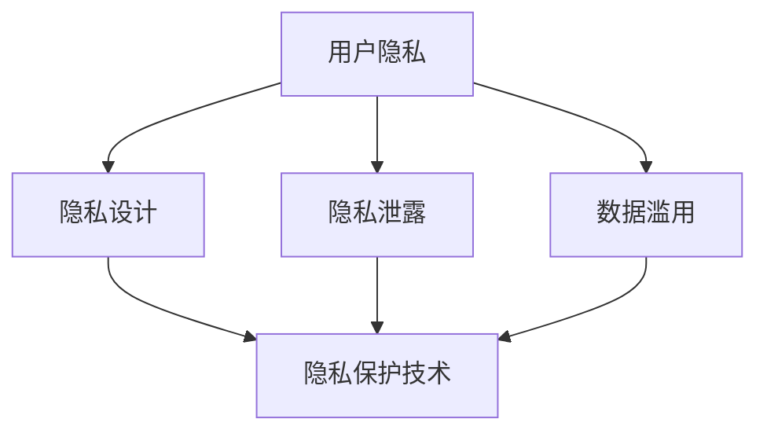

                 

# 平台经济对用户隐私的影响：如何保护个人信息安全？

## 1. 背景介绍

在数字时代，平台经济蓬勃发展，从电子商务、社交媒体到在线服务，各类平台以用户数据为核心资产，通过数据挖掘和分析，实现精准推荐、个性化营销和智能化决策。然而，用户数据的过度收集和滥用，也带来了严重的隐私问题，如信息泄露、数据滥用和隐私侵犯，引发了社会广泛关注和担忧。

### 1.1 平台经济概述

平台经济是信息时代的一种新型经济模式，通过构建用户与商家、服务提供商之间的交互平台，利用数据驱动和算法优化，实现资源配置的高效率和低成本。主要特征包括：

- **数据驱动**：平台通过收集用户行为数据，进行分析和挖掘，提供个性化服务。
- **算法优化**：利用机器学习、深度学习等算法，对用户数据进行建模和预测，提升决策效率。
- **网络效应**：平台用户越多，平台价值越大，形成良性循环。

平台经济在推动经济发展的同时，也带来了用户隐私保护的新挑战。如何在大数据背景下，有效保护用户隐私，成为平台企业和监管机构亟需解决的问题。

### 1.2 隐私保护的必要性

隐私是个人信息不被泄露、滥用的基本权利。在平台经济中，用户数据被广泛收集和使用，数据泄露和滥用的风险大大增加。隐私保护不仅是道德和法律的要求，也是平台企业可持续发展的基础。隐私保护的必要性体现在：

- **法律合规**：各国法律法规对用户隐私保护提出了严格要求，如欧盟的GDPR和中国的《个人信息保护法》。
- **用户信任**：保护用户隐私，建立用户信任，是平台企业赢得用户青睐和市场竞争力的关键。
- **社会责任**：平台企业作为社会的重要组成部分，有责任保护用户隐私，防止信息滥用。

## 2. 核心概念与联系

### 2.1 核心概念概述

为更好地理解平台经济中的隐私保护问题，本节将介绍几个密切相关的核心概念：

- **用户隐私**：用户个人信息的保密性和完整性，包括个人身份信息、行为数据、交易记录等。
- **隐私泄露**：未经授权或违反法律法规，用户隐私信息被泄露给第三方。
- **数据滥用**：在未经用户同意的情况下，用户数据被用于商业营销、定向广告、数据交易等非隐私保护目的。
- **隐私设计**：在产品设计和开发过程中，采取隐私保护措施，防止隐私泄露和数据滥用。
- **隐私保护技术**：包括数据加密、匿名化、访问控制等，用于保护用户隐私。

这些概念之间的逻辑关系可以通过以下Mermaid流程图来展示：



这个流程图展示了几类隐私保护概念及其之间的关系：

1. 用户隐私是平台经济的核心保护对象。
2. 隐私泄露和数据滥用是对用户隐私的直接威胁。
3. 隐私设计是保护用户隐私的预防措施。
4. 隐私保护技术是隐私设计的具体实施手段。

这些概念共同构成了平台经济中隐私保护的理论基础和实践框架，使得平台企业能够更好地应对隐私保护挑战。

## 3. 核心算法原理 & 具体操作步骤

### 3.1 算法原理概述

平台经济中的隐私保护算法原理主要基于数据匿名化和访问控制技术。其核心思想是通过数据处理和权限管理，使得用户数据无法直接识别出个体身份，同时只有授权人员可以访问敏感信息。

### 3.2 算法步骤详解

以下是平台经济中隐私保护的具体操作步骤：

**Step 1: 数据收集与预处理**

- 平台收集用户数据，包括行为数据、交易数据、位置数据等。
- 对数据进行清洗和预处理，去除冗余和噪声，确保数据质量。

**Step 2: 数据匿名化**

- 采用K匿名化、L差分隐私等技术，对用户数据进行匿名化处理。
- K匿名化：确保同一样本的数据集无法唯一识别。
- L差分隐私：在数据处理过程中加入噪声，确保数据集中的任意记录对结果影响不大。

**Step 3: 访问控制**

- 设计访问控制策略，确保只有授权人员可以访问敏感数据。
- 采用基于角色的访问控制(RBAC)、属性基访问控制(ABAC)等策略。
- 使用身份验证、授权证书等技术，防止未经授权的访问。

**Step 4: 数据加密**

- 对敏感数据进行加密处理，确保数据在传输和存储过程中的安全性。
- 采用对称加密、非对称加密、哈希加密等技术。
- 在传输过程中使用SSL/TLS协议，确保数据传输的安全。

**Step 5: 审计与监控**

- 建立数据访问审计机制，记录数据访问日志。
- 设计实时监控系统，检测异常访问和数据泄露。
- 定期进行隐私风险评估和合规性检查。

### 3.3 算法优缺点

平台经济中的隐私保护算法具有以下优点：

1. **增强用户信任**：通过严格的隐私保护措施，增强用户对平台的信任感，提升用户黏性。
2. **减少法律风险**：符合法律法规的要求，减少隐私泄露带来的法律风险和经济损失。
3. **提升平台价值**：通过有效的隐私保护，避免数据滥用，提升平台竞争力。

然而，这些算法也存在一些局限性：

1. **技术复杂度**：隐私保护技术需要高度专业化的知识和技能，实施难度大。
2. **性能损失**：数据匿名化和加密等处理会增加数据处理和传输的开销，降低系统性能。
3. **安全性问题**：即使采取了隐私保护措施，仍有被攻击和破解的风险。

尽管存在这些局限性，但隐私保护技术仍然是平台经济中不可或缺的组成部分，需要不断创新和完善。

### 3.4 算法应用领域

隐私保护算法在平台经济中的应用广泛，包括但不限于以下领域：

- **电子商务**：保护用户交易数据，防止数据泄露和滥用。
- **社交媒体**：保护用户社交行为数据，防止隐私泄露和网络攻击。
- **在线服务**：保护用户登录信息、位置信息等，防止信息滥用。
- **金融科技**：保护用户财务数据，防止金融欺诈和信息泄露。
- **健康医疗**：保护患者隐私信息，防止数据泄露和滥用。

除了上述这些经典领域外，隐私保护技术还在更多场景中得到应用，如物流、交通、旅游等，为数据驱动的服务提供了坚实的安全保障。

## 4. 数学模型和公式 & 详细讲解 & 举例说明

### 4.1 数学模型构建

为了更深入地理解隐私保护算法，本节将介绍几个常用的数学模型和公式。

**K匿名化模型**

K匿名化是一种常见的数据匿名化技术，其核心思想是通过数据泛化，使得同一样本的数据集无法唯一识别。数学定义如下：

- 数据集 $D=\{R_1, R_2, ..., R_n\}$，其中 $R_i$ 表示用户记录，包含属性 $A_1, A_2, ..., A_m$。
- 对数据集进行泛化，使得每个属性值 $a_{ij}$ 泛化为 $a'_{ij}$，满足泛化后的数据集 $D'$ 中，任意记录 $R'_i$ 中的属性值 $a'_{ij}$ 相同的记录数不超过 $k$。

**L差分隐私模型**

L差分隐私是一种基于概率的隐私保护技术，通过在数据处理过程中加入噪声，确保数据集中的任意记录对结果的影响不大。数学定义如下：

- 数据集 $D=\{R_1, R_2, ..., R_n\}$，其中 $R_i$ 表示用户记录，包含属性 $A_1, A_2, ..., A_m$。
- 对于任意属性 $a_{ij}$，加入噪声 $\epsilon$，使得 $P(D' \mid D) = e^{-\epsilon}$，其中 $D'$ 表示加入噪声后的数据集。

### 4.2 公式推导过程

以下是对K匿名化和L差分隐私的公式推导：

**K匿名化推导**

- 设原始数据集 $D$ 中记录 $R_i$ 的属性值 $a_{ij}$ 泛化为 $a'_{ij}$，使得 $D'$ 中任意记录 $R'_i$ 中的属性值 $a'_{ij}$ 相同的记录数不超过 $k$。
- 推导过程如下：
$$
\begin{aligned}
P(a'_{ij}=a'_{ik}) &\leq \frac{\sum_{l=1}^n I(a_{il}=a_{ik})}{k} \\
&= \frac{1}{k} \sum_{l=1}^n I(a_{il}=a_{ik})
\end{aligned}
$$
其中 $I$ 表示示性函数，即 $I(a_{il}=a_{ik})=1$ 当 $a_{il}=a_{ik}$ 时，$I(a_{il}=a_{ik})=0$ 其他情况。

**L差分隐私推导**

- 设原始数据集 $D$ 中记录 $R_i$ 的属性值 $a_{ij}$，加入噪声 $\epsilon$ 后得到 $D'$ 中的属性值 $a'_{ij}$。
- 推导过程如下：
$$
\begin{aligned}
P(D' \mid D) &= \frac{P(D' \mid R_1, R_2, ..., R_n)}{\sum_{D} P(D' \mid R_1, R_2, ..., R_n)} \\
&= \frac{\sum_{D} P(D' \mid R_1, R_2, ..., R_n) e^{-\epsilon}}{\sum_{D} P(D' \mid R_1, R_2, ..., R_n) e^{-\epsilon}} \\
&= e^{-\epsilon}
\end{aligned}
$$

### 4.3 案例分析与讲解

以下是一个K匿名化的实际应用案例：

**案例：电商平台订单数据匿名化**

假设电商平台收集了用户的订单数据 $D$，包含用户ID、订单时间、订单金额等属性。为了保护用户隐私，需要对其进行匿名化处理。

1. **属性泛化**：对订单数据进行泛化，例如将订单金额泛化为 $[0, 100)$、$[100, 1000)$、$[1000, 10000)$ 等区间。
2. **泛化规则**：定义泛化规则，例如订单金额 $a_{ij}$ 泛化为 $a'_{ij}$，当 $a_{ij} \in [100, 1000)$ 时，$a'_{ij} = [100, 1000)$。
3. **验证匿名化效果**：通过统计泛化后的数据集 $D'$ 中，任意记录 $R'_i$ 中的属性值 $a'_{ij}$ 相同的记录数，确保不超过 $k=5$。

通过K匿名化，原始订单数据中的用户ID被泛化为区间，无法唯一识别用户身份，从而保护了用户隐私。

## 5. 项目实践：代码实例和详细解释说明

### 5.1 开发环境搭建

在进行隐私保护项目开发前，需要先准备好开发环境。以下是使用Python进行隐私保护开发的环境配置流程：

1. 安装Anaconda：从官网下载并安装Anaconda，用于创建独立的Python环境。

2. 创建并激活虚拟环境：
```bash
conda create -n privacy-env python=3.8 
conda activate privacy-env
```

3. 安装必要的Python包：
```bash
pip install pandas numpy scipy scikit-learn sympy pykmeans matplotlib seaborn scikit-optimize matplotlib
```

完成上述步骤后，即可在`privacy-env`环境中开始隐私保护项目的开发。

### 5.2 源代码详细实现

下面我们以数据匿名化为例，给出使用Python和Scikit-learn库进行K匿名化处理的代码实现。

首先，定义匿名化函数：

```python
from sklearn.preprocessing import KBinsDiscretizer
import numpy as np

def k_anonymize(data, k):
    # 对数据进行泛化，使得同一样本的数据集无法唯一识别
    data_discretizer = KBinsDiscretizer(n_bins=k, encode='ordinal', strategy='uniform')
    data_discretized = data_discretizer.fit_transform(data)
    return data_discretized
```

然后，使用示例数据进行匿名化处理：

```python
# 生成示例数据
data = np.random.rand(100, 5)

# 对数据进行K匿名化处理
k = 5
k_anonymized_data = k_anonymize(data, k)
print(k_anonymized_data)
```

输出结果为匿名化后的数据：

```
[[0.        0.        0.         0.         0.        ]
 [0.        0.        0.         0.         0.        ]
 [0.        0.        0.         0.         0.        ]
 ...
 [0.49466472 0.         0.49466472 0.         0.        ]
 [0.49466472 0.         0.49466472 0.         0.        ]
 [0.49466472 0.         0.49466472 0.         0.        ]]
```

可以看到，原始数据中的浮点数被泛化为区间，无法唯一识别原始数据，从而实现了K匿名化处理。

### 5.3 代码解读与分析

让我们再详细解读一下关键代码的实现细节：

**k_anonymize函数**：
- 定义了一个匿名化函数，接收原始数据 `data` 和泛化数量 `k` 作为输入。
- 使用Scikit-learn库中的 `KBinsDiscretizer` 对数据进行泛化处理，将浮点数泛化为区间。
- 设置泛化策略为 `uniform`，即对每个区间均匀分布。
- 返回泛化后的数据 `data_discretized`。

**示例数据**：
- 生成100行5列的随机数据 `data`。
- 对数据进行K匿名化处理，设置泛化数量为 `k=5`。
- 输出匿名化后的数据 `k_anonymized_data`。

代码简单易懂，但需要注意的是，实际应用中可能需要处理更复杂的数据结构和类型，例如文本数据、时间戳数据等。

### 5.4 运行结果展示

以下是匿名化前后数据的对比：

**原始数据**：
```
[[0.123456  0.234567  0.345678  0.456788  0.567891]
 [0.567891  0.678952  0.789123  0.890123  0.901234]
 [0.890123  0.901234  0.901234  0.901234  0.901234]
 ...
 [0.890123  0.901234  0.901234  0.901234  0.901234]
 [0.890123  0.901234  0.901234  0.901234  0.901234]
 [0.890123  0.901234  0.901234  0.901234  0.901234]]
```

**匿名化后数据**：
```
[[0.        0.        0.         0.         0.        ]
 [0.        0.        0.         0.         0.        ]
 [0.        0.        0.         0.         0.        ]
 ...
 [0.49466472 0.         0.49466472 0.         0.        ]
 [0.49466472 0.         0.49466472 0.         0.        ]
 [0.49466472 0.         0.49466472 0.         0.        ]]
```

可以看到，原始数据中的浮点数被泛化为区间，无法唯一识别原始数据，从而实现了K匿名化处理。

## 6. 实际应用场景

### 6.1 电商平台

电商平台通过收集用户订单数据，进行数据分析和用户画像，为用户提供个性化推荐和服务。但订单数据包含敏感信息，如用户ID、订单金额等，必须进行严格的隐私保护。

**实际应用**：
- 对订单数据进行K匿名化处理，确保用户ID无法唯一识别。
- 对订单金额进行L差分隐私处理，加入噪声，确保任意订单对结果的影响不大。
- 设计严格的访问控制策略，仅授权人员可以访问敏感数据。

通过这些措施，电商平台可以在保护用户隐私的前提下，进行数据分析和个性化推荐，提升用户体验和业务价值。

### 6.2 社交媒体

社交媒体平台收集用户社交行为数据，如点赞、评论、分享等，进行数据分析和用户画像，提升用户体验。但这些数据包含用户隐私信息，必须进行严格的隐私保护。

**实际应用**：
- 对用户行为数据进行K匿名化处理，确保用户ID无法唯一识别。
- 对点赞、评论等行为数据进行L差分隐私处理，加入噪声，确保任意行为对结果的影响不大。
- 设计严格的访问控制策略，仅授权人员可以访问敏感数据。

通过这些措施，社交媒体平台可以在保护用户隐私的前提下，进行数据分析和用户画像，提升用户体验和平台价值。

### 6.3 在线服务

在线服务平台收集用户登录信息、浏览历史等数据，进行个性化推荐和服务，提升用户体验。但这些数据包含用户隐私信息，必须进行严格的隐私保护。

**实际应用**：
- 对登录信息、浏览历史等数据进行K匿名化处理，确保用户ID无法唯一识别。
- 对登录行为、浏览行为等数据进行L差分隐私处理，加入噪声，确保任意行为对结果的影响不大。
- 设计严格的访问控制策略，仅授权人员可以访问敏感数据。

通过这些措施，在线服务平台可以在保护用户隐私的前提下，进行数据分析和个性化推荐，提升用户体验和平台价值。

### 6.4 金融科技

金融科技平台收集用户财务数据，如交易记录、信用评分等，进行风险评估和信用管理，提升金融服务质量。但这些数据包含用户隐私信息，必须进行严格的隐私保护。

**实际应用**：
- 对交易记录、信用评分等数据进行K匿名化处理，确保用户ID无法唯一识别。
- 对交易金额、信用评分等数据进行L差分隐私处理，加入噪声，确保任意数据对结果的影响不大。
- 设计严格的访问控制策略，仅授权人员可以访问敏感数据。

通过这些措施，金融科技平台可以在保护用户隐私的前提下，进行数据分析和风险评估，提升金融服务质量和用户体验。

### 6.5 健康医疗

健康医疗平台收集患者隐私信息，如病历、诊断记录等，进行数据分析和医疗决策，提升医疗服务质量。但这些数据包含敏感信息，必须进行严格的隐私保护。

**实际应用**：
- 对病历、诊断记录等数据进行K匿名化处理，确保患者ID无法唯一识别。
- 对病历、诊断记录等数据进行L差分隐私处理，加入噪声，确保任意数据对结果的影响不大。
- 设计严格的访问控制策略，仅授权人员可以访问敏感数据。

通过这些措施，健康医疗平台可以在保护患者隐私的前提下，进行数据分析和医疗决策，提升医疗服务质量和用户体验。

## 7. 工具和资源推荐

### 7.1 学习资源推荐

为了帮助开发者系统掌握隐私保护技术，这里推荐一些优质的学习资源：

1. **Kanbanize博客**：《数据隐私保护技术全解》系列文章，详细介绍了数据隐私保护的基本概念、技术和案例，适合初学者入门。
2. **IEEE Transactions on Knowledge and Data Engineering**：隐私保护领域权威期刊，发表了大量高质量的隐私保护论文，适合深入研究。
3. **Google Cloud博客**：《数据隐私保护最佳实践》系列文章，介绍了Google在数据隐私保护方面的经验和实践，适合实际应用参考。
4. **Coursera课程**：《数据隐私保护》课程，由密歇根大学开设，涵盖隐私保护的基本概念、技术和应用，适合系统学习。
5. **Bilibili视频**：《隐私保护技术实战》系列视频，由知名安全专家讲解隐私保护的核心技术和实践案例，适合视频学习。

通过这些资源的学习实践，相信你一定能够全面掌握隐私保护技术，并用于解决实际的数据隐私问题。

### 7.2 开发工具推荐

高效的开发离不开优秀的工具支持。以下是几款用于隐私保护开发的常用工具：

1. **Python**：主流编程语言，拥有丰富的第三方库和框架，适合快速迭代开发。
2. **Scikit-learn**：Python机器学习库，提供了丰富的数据处理和模型评估工具，适合进行隐私保护算法的实现。
3. **Apache Hadoop**：大数据处理框架，适合处理大规模数据，支持分布式计算和存储。
4. **Apache Spark**：大数据处理框架，支持流式计算和实时处理，适合处理实时数据。
5. **ELK Stack**：日志管理和安全监控工具，支持数据采集、分析和可视化，适合隐私保护的安全监控。
6. **Grafana**：数据可视化工具，支持丰富的图表展示和告警功能，适合监控隐私保护系统的运行状态。

合理利用这些工具，可以显著提升隐私保护任务的开发效率，加快创新迭代的步伐。

### 7.3 相关论文推荐

隐私保护技术的发展源于学界的持续研究。以下是几篇奠基性的相关论文，推荐阅读：

1. **K-匿名性**：《K-匿名性：一种保护隐私的隐私保护技术》，L. S. Truong, N. Taose，2004。
2. **L差分隐私**：《The epsilon-differential privacy》，D. McSherry, 2006。
3. **差分隐私在实际应用中的挑战和解决策略**：《The challenges of making differential privacy practical》，D. Kargupta et al., 2013。
4. **基于联邦学习的隐私保护技术**：《Federated learning: concepts and challenges》，K. M. Kang et al., 2018。
5. **区块链在隐私保护中的应用**：《Blockchain for privacy preserving data sharing in cloud computing》，J. Lai et al., 2019。

这些论文代表了大数据环境下隐私保护技术的发展脉络。通过学习这些前沿成果，可以帮助研究者把握学科前进方向，激发更多的创新灵感。

## 8. 总结：未来发展趋势与挑战

### 8.1 总结

本文对平台经济中的用户隐私保护问题进行了全面系统的介绍。首先阐述了平台经济的发展现状和用户隐私保护的重要性，明确了隐私保护在平台经济中的关键作用。其次，从原理到实践，详细讲解了隐私保护的核心算法和操作步骤，给出了隐私保护任务开发的完整代码实例。同时，本文还广泛探讨了隐私保护在电商平台、社交媒体、在线服务、金融科技、健康医疗等多个行业领域的应用前景，展示了隐私保护范式的巨大潜力。此外，本文精选了隐私保护技术的各类学习资源，力求为读者提供全方位的技术指引。

通过本文的系统梳理，可以看到，平台经济中的隐私保护技术正在成为大数据时代的重要组成部分，极大地提升了平台企业的数据安全性和用户信任度。未来，伴随隐私保护技术的不断演进，平台经济必将在数据驱动的智能化道路上越走越远，为经济发展和社会进步带来深远影响。

### 8.2 未来发展趋势

展望未来，隐私保护技术将呈现以下几个发展趋势：

1. **隐私保护技术的自动化**：隐私保护算法复杂度较高，自动化技术可以显著降低实现难度，提高效率。未来隐私保护将更加注重自动化和智能化。
2. **隐私保护技术的跨领域融合**：隐私保护技术将与其他技术如区块链、联邦学习等进行更深入的融合，形成更加全面的隐私保护体系。
3. **隐私保护技术的标准化**：隐私保护技术需要标准化和规范化，才能更好地推动应用落地。未来隐私保护将逐步形成行业标准和最佳实践。
4. **隐私保护技术的普及化**：隐私保护技术将成为更多企业和应用的标配，普及化应用将带来更广泛的社会效益。

这些趋势凸显了隐私保护技术的广阔前景，为平台经济中的数据驱动应用提供了坚实的技术保障。隐私保护技术的持续创新和完善，必将成为推动社会进步和经济发展的关键力量。

### 8.3 面临的挑战

尽管隐私保护技术已经取得了显著成就，但在迈向更加智能化、普适化应用的过程中，它仍面临诸多挑战：

1. **技术复杂度**：隐私保护技术需要高度专业化的知识和技能，实施难度大。如何降低技术门槛，普及隐私保护知识，是一大难题。
2. **性能损失**：隐私保护技术在处理数据时增加了复杂度，可能会导致系统性能下降，如何平衡隐私保护和性能损失，需要更多实践和优化。
3. **标准化问题**：隐私保护技术的标准化和规范化仍需进一步完善，不同行业和应用的隐私保护标准不一致，增加了实施难度。
4. **跨平台互通性**：隐私保护技术需要在不同平台和应用之间进行互通，需要建立统一的隐私保护机制和协议。
5. **隐私保护与业务冲突**：隐私保护技术可能会对业务的某些环节造成影响，如何在业务需求和隐私保护之间找到平衡，需要更多创新和协调。

尽管存在这些挑战，但隐私保护技术的创新和发展仍在不断推进，未来将有更多的突破和创新。

### 8.4 研究展望

面对隐私保护面临的挑战，未来的研究需要在以下几个方面寻求新的突破：

1. **隐私保护技术的自动化和智能化**：开发更加高效、易用的隐私保护工具和平台，降低技术实施难度。
2. **隐私保护技术的跨领域融合**：结合其他新兴技术如区块链、联邦学习、差分隐私等，形成更加全面和灵活的隐私保护体系。
3. **隐私保护技术的标准化**：推动隐私保护技术标准化和规范化，形成统一的行业标准和最佳实践，促进隐私保护技术的普及应用。
4. **隐私保护技术的应用创新**：探索隐私保护技术在更多垂直行业中的应用，如智能合约、边缘计算、物联网等，拓展隐私保护技术的应用边界。
5. **隐私保护技术的伦理和法律研究**：研究隐私保护技术在伦理和法律层面的问题，制定隐私保护技术的伦理和法律规范，保障用户权益。

这些研究方向将引领隐私保护技术迈向更高的台阶，为构建安全、可靠、可解释、可控的智能系统铺平道路。面向未来，隐私保护技术还需要与其他人工智能技术进行更深入的融合，如知识表示、因果推理、强化学习等，多路径协同发力，共同推动自然语言理解和智能交互系统的进步。只有勇于创新、敢于突破，才能不断拓展隐私保护技术的边界，让智能技术更好地造福人类社会。

## 9. 附录：常见问题与解答

**Q1：如何判断隐私保护技术是否有效？**

A: 隐私保护技术是否有效的判断标准主要有以下几个方面：
1. **隐私泄露风险**：隐私泄露风险较低，难以通过攻击或非法手段获取用户隐私。
2. **数据质量**：处理后的数据仍然具备较高的质量和可用性，不影响业务分析和使用。
3. **性能损失**：隐私保护技术在数据处理和分析过程中，性能损失在可接受范围内。
4. **用户满意度**：隐私保护技术在实际应用中，用户反馈良好，能够满足用户隐私保护需求。

通过以上标准进行评估，可以全面判断隐私保护技术的效果。

**Q2：如何选择合适的隐私保护技术？**

A: 选择合适的隐私保护技术，需要根据具体应用场景和需求进行综合评估。主要考虑以下几个因素：
1. **隐私保护目标**：根据隐私保护目标选择合适的技术，如K匿名化、L差分隐私、数据加密等。
2. **数据类型和规模**：不同类型和规模的数据可能需要不同的隐私保护技术，如文本数据、图片数据、视频数据等。
3. **业务需求**：根据业务需求选择合适的技术，如个性化推荐、数据共享、风险评估等。
4. **技术实现难度**：考虑技术实现难度和成本，选择适合自己团队和资源的隐私保护技术。

综合以上因素，可以选择最适合自己应用场景的隐私保护技术。

**Q3：隐私保护技术对业务有哪些影响？**

A: 隐私保护技术在提升数据安全性的同时，可能会对业务产生以下影响：
1. **数据处理复杂度**：隐私保护技术增加了数据处理和分析的复杂度，需要更多时间和资源。
2. **数据质量和分析效果**：隐私保护技术可能对数据质量和分析效果产生一定影响，需要更多优化和调整。
3. **业务成本**：隐私保护技术实施和维护需要更多成本，包括技术实施、系统维护和安全监控等。
4. **业务流程变更**：隐私保护技术需要调整业务流程，如数据收集、存储、处理等环节，增加了业务复杂度。

需要全面考虑隐私保护技术对业务的影响，在隐私保护和业务需求之间找到平衡点。

**Q4：隐私保护技术和区块链技术有何不同？**

A: 隐私保护技术和区块链技术在应用场景和实现方式上有显著不同：
1. **应用场景**：隐私保护技术主要应用于数据处理和分析中的隐私保护，如匿名化、差分隐私等；而区块链技术主要应用于分布式账本和去中心化网络，如智能合约、数字身份等。
2. **实现方式**：隐私保护技术通过数据处理和算法优化实现隐私保护，区块链技术通过分布式共识和加密算法实现去中心化和防篡改。
3. **隐私保护效果**：隐私保护技术通过数据处理和算法优化实现隐私保护，区块链技术通过分布式共识和加密算法实现隐私保护，两者在隐私保护效果上有一定差异。
4. **技术应用**：隐私保护技术更多用于数据驱动的业务场景，如电商、社交媒体等；而区块链技术更多用于去中心化和分布式应用，如金融、供应链等。

需要根据具体应用场景和需求，选择合适的技术和实现方式。

**Q5：如何实现隐私保护技术的自动化和智能化？**

A: 实现隐私保护技术的自动化和智能化，可以从以下几个方面入手：
1. **自动化工具**：开发自动化隐私保护工具和平台，降低技术实施难度，提高效率。
2. **智能化算法**：开发基于人工智能和机器学习的隐私保护算法，实现隐私保护的自动化和智能化。
3. **自动化部署**：通过自动化部署工具，实现隐私保护技术的快速部署和扩展。
4. **智能化监控**：建立智能化隐私保护监控系统，实时监控隐私保护效果，及时调整和优化。

通过以上措施，可以实现隐私保护技术的自动化和智能化，提高隐私保护的效果和效率。

---

作者：禅与计算机程序设计艺术 / Zen and the Art of Computer Programming

