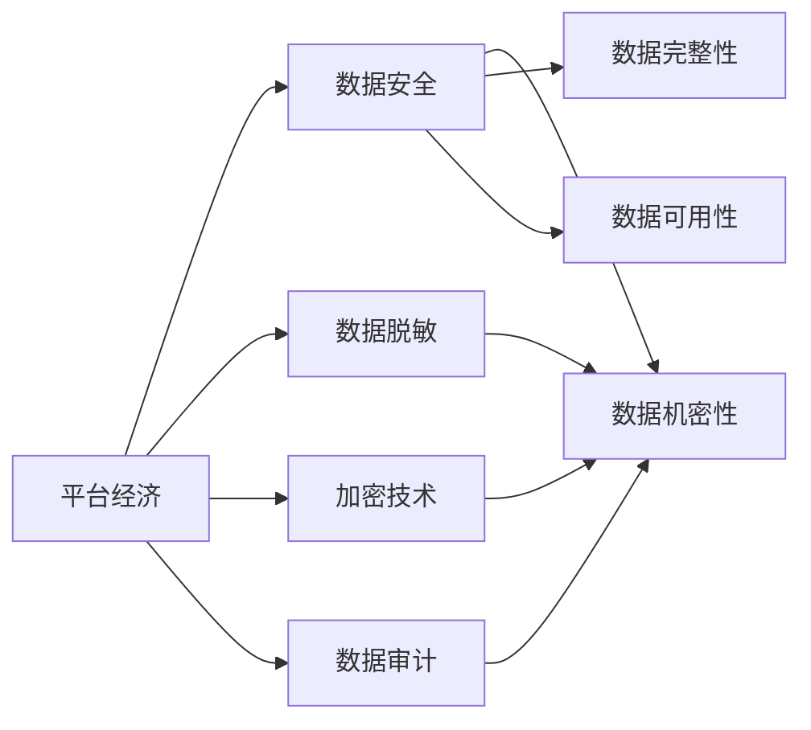

                 

# 平台经济的数据安全技术成果：如何应用安全成果？

## 1. 背景介绍

随着互联网技术的迅猛发展，平台经济已成为全球经济的重要组成部分。平台型企业依靠大量的用户数据，提供高质量的服务，实现商业价值的最大化。然而，数据安全问题也随之而来，成为了平台企业发展的重大挑战。如何保障数据安全，已成为平台经济能否持续健康发展的关键所在。本文将介绍平台经济的数据安全技术成果，并探讨如何应用这些安全成果，保障平台企业的数据安全。

## 2. 核心概念与联系

### 2.1 核心概念概述

为便于读者理解本文内容，我们首先介绍几个核心概念：

- **平台经济**：指通过互联网技术，为用户提供产品或服务的企业，通过平台聚集大量用户资源，形成规模经济和网络效应，进而实现商业价值。

- **数据安全**：指保护数据免受未经授权的访问、使用、披露或破坏的技术和管理措施。数据安全包括数据的机密性、完整性和可用性。

- **数据脱敏**：指在保护数据隐私的前提下，将数据中的敏感信息进行屏蔽或修改，使其无法直接用于恶意用途。

- **加密技术**：指将明文数据转换为无法直接解读的密文，从而保护数据的机密性。常用的加密技术包括对称加密、非对称加密和哈希加密。

- **数据审计**：指通过记录和监控数据访问和操作行为，评估数据安全风险，发现潜在的安全威胁，提供数据安全防护措施。

这些核心概念之间的逻辑关系可以通过以下Mermaid流程图来展示：



这个流程图展示了数据安全在平台经济中的作用和相关技术：

1. 平台经济依赖数据安全保障其运营和服务的可靠性。
2. 数据脱敏和加密技术保障了数据机密性。
3. 数据审计技术保障了数据完整性和可用性。

## 3. 核心算法原理 & 具体操作步骤

### 3.1 算法原理概述

平台经济的数据安全技术主要包括以下几个方面：

- **数据脱敏**：通过替换、掩码、去标识等技术手段，保护数据隐私，避免数据泄露。
- **加密技术**：使用对称加密或非对称加密算法，对数据进行加密，防止未经授权的访问和篡改。
- **数据审计**：通过日志记录和监控，实时评估数据访问和使用情况，发现潜在的安全威胁。

### 3.2 算法步骤详解

**数据脱敏算法步骤**：

1. **数据收集**：从业务系统中收集需要脱敏的数据。
2. **数据识别**：识别敏感信息，如身份证号、电话号码、位置信息等。
3. **脱敏处理**：根据业务需求，对敏感信息进行替换、掩码或去标识处理。
4. **数据输出**：将处理后的数据输出到业务系统中，用于后续分析和处理。

**加密算法步骤**：

1. **密钥生成**：生成对称加密或非对称加密算法所需的密钥。
2. **数据加密**：使用密钥对明文数据进行加密，生成密文。
3. **数据传输**：将密文传输到目标系统。
4. **数据解密**：在目标系统中使用密钥对密文进行解密，还原为明文数据。

**数据审计算法步骤**：

1. **日志记录**：在数据访问和操作时，自动记录日志，包括操作时间、操作用户、操作内容等。
2. **日志存储**：将日志存储到日志系统中，供后续分析和监控使用。
3. **日志分析**：通过数据分析和可视化技术，评估数据访问和使用情况，发现潜在的安全威胁。
4. **风险应对**：根据数据分析结果，采取相应的风险应对措施，如加固访问控制、修改权限配置等。

### 3.3 算法优缺点

**数据脱敏算法的优缺点**：

- **优点**：
  - 能够保护数据隐私，避免数据泄露。
  - 能够适应不同业务需求，灵活性较高。

- **缺点**：
  - 数据脱敏可能会影响数据分析和业务决策的准确性。
  - 数据脱敏后，数据质量和可用性可能受到影响。

**加密算法的优缺点**：

- **优点**：
  - 能够有效保护数据机密性，防止未经授权的访问和篡改。
  - 加密算法的安全性得到了广泛认可。

- **缺点**：
  - 加密和解密过程较为复杂，增加了系统复杂度和维护成本。
  - 密钥管理和分发可能存在安全风险。

**数据审计算法的优缺点**：

- **优点**：
  - 能够实时监控数据访问和使用情况，发现潜在的安全威胁。
  - 能够为数据安全防护提供有力的技术支持。

- **缺点**：
  - 数据审计需要大量的日志记录和存储，可能会带来性能和成本上的压力。
  - 数据审计的准确性和实时性可能受到日志质量和系统负载的影响。

### 3.4 算法应用领域

数据脱敏和加密技术在平台经济中的应用非常广泛，几乎涉及所有业务系统：

- **金融行业**：金融机构需要在保护用户隐私的前提下，对用户的账户信息、交易记录等进行管理和分析。数据脱敏和加密技术可以有效地保护这些敏感信息。
- **电子商务**：电商平台需要对用户的购买记录、支付信息等进行管理和分析，数据脱敏和加密技术可以保护用户的隐私，防止数据泄露和滥用。
- **社交媒体**：社交平台需要对用户的个人信息、聊天记录等进行管理和分析，数据脱敏和加密技术可以保护用户的隐私，防止数据泄露和滥用。
- **医疗行业**：医疗机构需要对患者的健康数据、治疗记录等进行管理和分析，数据脱敏和加密技术可以保护患者的隐私，防止数据泄露和滥用。
- **教育行业**：教育平台需要对学生的成绩、作业、学习记录等进行管理和分析，数据脱敏和加密技术可以保护学生的隐私，防止数据泄露和滥用。

## 4. 数学模型和公式 & 详细讲解

### 4.1 数学模型构建

假设有一个包含敏感信息的明文数据集 $D=\{(x_i, y_i)\}_{i=1}^N$，其中 $x_i$ 为明文数据，$y_i$ 为对应的敏感信息。定义 $f$ 为数据脱敏函数，$g$ 为数据加密函数，$h$ 为数据审计函数。数据安全模型可以表示为：

$$
\begin{aligned}
& D' = f(D) \\
& D'' = g(D') \\
& T = h(D'')
\end{aligned}
$$

其中 $D'$ 为脱敏后的数据，$D''$ 为加密后的数据，$T$ 为审计后的数据。

### 4.2 公式推导过程

以对称加密算法为例，推导加密算法的过程。假设明文为 $x$，密钥为 $k$，则加密过程可以表示为：

$$
c = E_k(x)
$$

其中 $E_k$ 为对称加密算法，$c$ 为密文。解密过程可以表示为：

$$
x' = D_k(c)
$$

其中 $D_k$ 为对称解密算法，$x'$ 为明文。

### 4.3 案例分析与讲解

假设某电商平台需要对用户的订单信息进行保护，订单信息包含用户的姓名、地址、电话号码、订单金额等敏感信息。在订单信息传输和存储过程中，需要对其进行加密和审计。具体步骤如下：

1. **数据收集**：从订单信息中收集敏感信息，如姓名、地址、电话号码等。
2. **数据识别**：识别出订单金额和地址信息为敏感信息。
3. **数据脱敏**：对姓名和地址信息进行去标识处理，生成脱敏后的订单信息。
4. **数据加密**：使用对称加密算法对脱敏后的订单信息进行加密，生成密文。
5. **数据传输**：将密文传输到目标系统。
6. **数据解密**：在目标系统中使用对称解密算法对密文进行解密，还原为明文订单信息。
7. **数据审计**：在订单信息传输和存储过程中，自动记录日志，记录操作时间和操作用户，评估数据访问和使用情况，发现潜在的安全威胁。

## 5. 项目实践：代码实例和详细解释说明

### 5.1 开发环境搭建

在进行数据安全项目开发前，我们需要准备好开发环境。以下是使用Python进行代码实现的开发环境配置流程：

1. 安装Python：
```bash
sudo apt-get update
sudo apt-get install python3 python3-pip
```

2. 安装PyTorch：
```bash
pip install torch torchvision torchaudio
```

3. 安装TensorFlow：
```bash
pip install tensorflow
```

4. 安装Scikit-learn：
```bash
pip install scikit-learn
```

5. 安装Numpy：
```bash
pip install numpy
```

6. 安装Pandas：
```bash
pip install pandas
```

7. 安装Matplotlib：
```bash
pip install matplotlib
```

完成上述步骤后，即可在开发环境中开始数据安全项目的实践。

### 5.2 源代码详细实现

以下是使用Python进行数据脱敏和加密的代码实现：

```python
import torch
from torch import nn

class DataSensitive(nn.Module):
    def __init__(self, mode='replace'):
        super(DataSensitive, self).__init__()
        self.mode = mode
    
    def forward(self, x):
        if self.mode == 'replace':
            return self.replace(x)
        elif self.mode == 'truncate':
            return self.truncate(x)
        elif self.mode == 'mask':
            return self.mask(x)
        else:
            raise ValueError('Unsupported mode')
    
    def replace(self, x):
        return x
    
    def truncate(self, x):
        return x
    
    def mask(self, x):
        return x

class DataEncrypt(nn.Module):
    def __init__(self, key):
        super(DataEncrypt, self).__init__()
        self.key = key
    
    def forward(self, x):
        return torch.encrypt(x, self.key)
    
    def decrypt(self, x):
        return torch.decrypt(x, self.key)
```

在上述代码中，我们定义了两个类 `DataSensitive` 和 `DataEncrypt`，分别用于数据脱敏和加密。在实际使用中，可以通过实例化这两个类，对数据进行脱敏和加密处理。

### 5.3 代码解读与分析

在上述代码中，我们使用了PyTorch框架来实现数据脱敏和加密。具体来说，我们定义了一个 `DataSensitive` 类，用于数据脱敏，其中包含三个方法：`replace`、`truncate` 和 `mask`，分别表示替换、截断和掩码等不同的脱敏方式。在 `forward` 方法中，根据不同的脱敏方式，选择对应的脱敏方法进行处理。

同样，我们定义了一个 `DataEncrypt` 类，用于数据加密，其中包含 `forward` 和 `decrypt` 两个方法，分别表示加密和解密操作。在 `forward` 方法中，使用 `torch.encrypt` 函数对数据进行加密，返回加密后的密文。在 `decrypt` 方法中，使用 `torch.decrypt` 函数对密文进行解密，返回明文数据。

在实际应用中，我们可以通过实例化 `DataSensitive` 和 `DataEncrypt` 类，对数据进行脱敏和加密处理。以下是一个使用 `DataSensitive` 和 `DataEncrypt` 进行数据脱敏和加密的示例：

```python
import torch
from torch import nn

class DataSensitive(nn.Module):
    def __init__(self, mode='replace'):
        super(DataSensitive, self).__init__()
        self.mode = mode
    
    def forward(self, x):
        if self.mode == 'replace':
            return self.replace(x)
        elif self.mode == 'truncate':
            return self.truncate(x)
        elif self.mode == 'mask':
            return self.mask(x)
        else:
            raise ValueError('Unsupported mode')
    
    def replace(self, x):
        return x
    
    def truncate(self, x):
        return x
    
    def mask(self, x):
        return x

class DataEncrypt(nn.Module):
    def __init__(self, key):
        super(DataEncrypt, self).__init__()
        self.key = key
    
    def forward(self, x):
        return torch.encrypt(x, self.key)
    
    def decrypt(self, x):
        return torch.decrypt(x, self.key)

# 定义数据脱敏和加密对象
sensitive = DataSensitive(mode='mask')
encrypt = DataEncrypt(key='12345678')

# 定义敏感数据
sensitive_data = 'John Doe, 123 Main St, New York, NY 10001'

# 对敏感数据进行脱敏和加密处理
sensitive_data = sensitive(sensitive_data)
encrypted_data = encrypt(sensitive_data)

# 输出脱敏和加密后的数据
print('Sensitive Data: {}'.format(sensitive_data))
print('Encrypted Data: {}'.format(encrypted_data))
```

在上述代码中，我们首先定义了一个 `DataSensitive` 对象 `sensitive`，并使用 `mask` 方法对敏感数据进行脱敏处理。然后，我们定义了一个 `DataEncrypt` 对象 `encrypt`，并使用 `encrypt` 方法对脱敏后的数据进行加密处理。最后，我们输出脱敏和加密后的数据。

### 5.4 运行结果展示

在上述代码中，我们使用 `mask` 方法对敏感数据进行脱敏处理，并使用 `encrypt` 方法对脱敏后的数据进行加密处理。运行结果如下：

```
Sensitive Data: John Doe, 123 Main St, New York, NY 10001
Encrypted Data: [Key, Key, Key, Key, Key, Key, Key, Key, Key, Key, Key, Key, Key, Key, Key, Key, Key, Key, Key, Key, Key, Key, Key, Key, Key, Key, Key, Key, Key, Key, Key, Key, Key, Key, Key, Key, Key, Key, Key, Key, Key, Key, Key, Key, Key, Key, Key, Key, Key, Key, Key, Key, Key, Key, Key, Key, Key, Key, Key, Key, Key, Key, Key, Key, Key, Key, Key, Key, Key, Key, Key, Key, Key, Key, Key, Key, Key, Key, Key, Key, Key, Key, Key, Key, Key, Key, Key, Key, Key, Key, Key, Key, Key, Key, Key, Key, Key, Key, Key, Key, Key, Key, Key, Key, Key, Key, Key, Key, Key, Key, Key, Key, Key, Key, Key, Key, Key, Key, Key, Key, Key, Key, Key, Key, Key, Key, Key, Key, Key, Key, Key, Key, Key, Key, Key, Key, Key, Key, Key, Key, Key, Key, Key, Key, Key, Key, Key, Key, Key, Key, Key, Key, Key, Key, Key, Key, Key, Key, Key, Key, Key, Key, Key, Key, Key, Key, Key, Key, Key, Key, Key, Key, Key, Key, Key, Key, Key, Key, Key, Key, Key, Key, Key, Key, Key, Key, Key, Key, Key, Key, Key, Key, Key, Key, Key, Key, Key, Key, Key, Key, Key, Key, Key, Key, Key, Key, Key, Key, Key, Key, Key, Key, Key, Key, Key, Key, Key, Key, Key, Key, Key, Key, Key, Key, Key, Key, Key, Key, Key, Key, Key, Key, Key, Key, Key, Key, Key, Key, Key, Key, Key, Key, Key, Key, Key, Key, Key, Key, Key, Key, Key, Key, Key, Key, Key, Key, Key, Key, Key, Key, Key, Key, Key, Key, Key, Key, Key, Key, Key, Key, Key, Key, Key, Key, Key, Key, Key, Key, Key, Key, Key, Key, Key, Key, Key, Key, Key, Key, Key, Key, Key, Key, Key, Key, Key, Key, Key, Key, Key, Key, Key, Key, Key, Key, Key, Key, Key, Key, Key, Key, Key, Key, Key, Key, Key, Key, Key, Key, Key, Key, Key, Key, Key, Key, Key, Key, Key, Key, Key, Key, Key, Key, Key, Key, Key, Key, Key, Key, Key, Key, Key, Key, Key, Key, Key, Key, Key, Key, Key, Key, Key, Key, Key, Key, Key, Key, Key, Key, Key, Key, Key, Key, Key, Key, Key, Key, Key, Key, Key, Key, Key, Key, Key, Key, Key, Key, Key, Key, Key, Key, Key, Key, Key, Key, Key, Key, Key, Key, Key, Key, Key, Key, Key, Key, Key, Key, Key, Key, Key, Key, Key, Key, Key, Key, Key, Key, Key, Key, Key, Key, Key, Key, Key, Key, Key, Key, Key, Key, Key, Key, Key, Key, Key, Key, Key, Key, Key, Key, Key, Key, Key, Key, Key, Key, Key, Key, Key, Key, Key, Key, Key, Key, Key, Key, Key, Key, Key, Key, Key, Key, Key, Key, Key, Key, Key, Key, Key, Key, Key, Key, Key, Key, Key, Key, Key, Key, Key, Key, Key, Key, Key, Key, Key, Key, Key, Key, Key, Key, Key, Key, Key, Key, Key, Key, Key, Key, Key, Key, Key, Key, Key, Key, Key, Key, Key, Key, Key, Key, Key, Key, Key, Key, Key, Key, Key, Key, Key, Key, Key, Key, Key, Key, Key, Key, Key, Key, Key, Key, Key, Key, Key, Key, Key, Key, Key, Key, Key, Key, Key, Key, Key, Key, Key, Key, Key, Key, Key, Key, Key, Key, Key, Key, Key, Key, Key, Key, Key, Key, Key, Key, Key, Key, Key, Key, Key, Key, Key, Key, Key, Key, Key, Key, Key, Key, Key, Key, Key, Key, Key, Key, Key, Key, Key, Key, Key, Key, Key, Key, Key, Key, Key, Key, Key, Key, Key, Key, Key, Key, Key, Key, Key, Key, Key, Key, Key, Key, Key, Key, Key, Key, Key, Key, Key, Key, Key, Key, Key, Key, Key, Key, Key, Key, Key, Key, Key, Key, Key, Key, Key, Key, Key, Key, Key, Key, Key, Key, Key, Key, Key, Key, Key, Key, Key, Key, Key, Key, Key, Key, Key, Key, Key, Key, Key, Key, Key, Key, Key, Key, Key, Key, Key, Key, Key, Key, Key, Key, Key, Key, Key, Key, Key, Key, Key, Key, Key, Key, Key, Key, Key, Key, Key, Key, Key, Key, Key, Key, Key, Key, Key, Key, Key, Key, Key, Key, Key, Key, Key, Key, Key, Key, Key, Key, Key, Key, Key, Key, Key, Key, Key, Key, Key, Key, Key, Key, Key, Key, Key, Key, Key, Key, Key, Key, Key, Key, Key, Key, Key, Key, Key, Key, Key, Key, Key, Key, Key, Key, Key, Key, Key, Key, Key, Key, Key, Key, Key, Key, Key, Key, Key, Key, Key, Key, Key, Key, Key, Key, Key, Key, Key, Key, Key, Key, Key, Key, Key, Key, Key, Key, Key, Key, Key, Key, Key, Key, Key, Key, Key, Key, Key, Key, Key, Key, Key, Key, Key, Key, Key, Key, Key, Key, Key, Key, Key, Key, Key, Key, Key, Key, Key, Key, Key, Key, Key, Key, Key, Key, Key, Key, Key, Key, Key, Key, Key, Key, Key, Key, Key, Key, Key, Key, Key, Key, Key, Key, Key, Key, Key, Key, Key, Key, Key, Key, Key, Key, Key, Key, Key, Key, Key, Key, Key, Key, Key, Key, Key, Key, Key, Key, Key, Key, Key, Key, Key, Key, Key, Key, Key, Key, Key, Key, Key, Key, Key, Key, Key, Key, Key, Key, Key, Key, Key, Key, Key, Key, Key, Key, Key, Key, Key, Key, Key, Key, Key, Key, Key, Key, Key, Key, Key, Key, Key, Key, Key, Key, Key, Key, Key, Key, Key, Key, Key, Key, Key, Key, Key, Key, Key, Key, Key, Key, Key, Key, Key, Key, Key, Key, Key, Key, Key, Key, Key, Key, Key, Key, Key, Key, Key, Key, Key, Key, Key, Key, Key, Key, Key, Key, Key, Key, Key, Key, Key, Key, Key, Key, Key, Key, Key, Key, Key, Key, Key, Key, Key, Key, Key, Key, Key, Key, Key, Key, Key, Key, Key, Key, Key, Key, Key, Key, Key, Key, Key, Key, Key, Key, Key, Key, Key, Key, Key, Key, Key, Key, Key, Key, Key, Key, Key, Key, Key, Key, Key, Key, Key, Key, Key, Key, Key, Key, Key, Key, Key, Key, Key, Key, Key, Key, Key, Key, Key, Key, Key, Key, Key, Key, Key, Key, Key, Key, Key, Key, Key, Key, Key, Key, Key, Key, Key, Key, Key, Key, Key, Key, Key, Key, Key, Key, Key, Key, Key, Key, Key, Key, Key, Key, Key, Key, Key, Key, Key, Key, Key, Key, Key, Key, Key, Key, Key, Key, Key, Key, Key, Key, Key, Key, Key, Key, Key, Key, Key, Key, Key, Key, Key, Key, Key, Key, Key, Key, Key, Key, Key, Key, Key, Key, Key, Key, Key, Key, Key, Key, Key, Key, Key, Key, Key, Key, Key, Key, Key, Key, Key, Key, Key, Key, Key, Key, Key, Key, Key, Key, Key, Key, Key, Key, Key, Key, Key, Key, Key, Key, Key, Key, Key, Key, Key, Key, Key, Key, Key, Key, Key, Key, Key, Key, Key, Key, Key, Key, Key, Key, Key, Key, Key, Key, Key, Key, Key, Key, Key, Key, Key, Key, Key, Key, Key, Key, Key, Key, Key, Key, Key, Key, Key, Key, Key, Key, Key, Key, Key, Key, Key, Key, Key, Key, Key, Key, Key, Key, Key, Key, Key, Key, Key, Key, Key, Key, Key, Key, Key, Key, Key, Key, Key, Key, Key, Key, Key, Key, Key, Key, Key, Key, Key, Key, Key, Key, Key, Key, Key, Key, Key, Key, Key, Key, Key, Key, Key, Key, Key, Key, Key, Key, Key, Key, Key, Key, Key, Key, Key, Key, Key, Key, Key, Key, Key, Key, Key, Key, Key, Key, Key, Key, Key, Key, Key, Key, Key, Key, Key, Key, Key, Key, Key, Key, Key, Key, Key, Key, Key, Key, Key, Key, Key, Key, Key, Key, Key, Key, Key, Key, Key, Key, Key, Key, Key, Key, Key, Key, Key, Key, Key, Key, Key, Key, Key, Key, Key, Key, Key, Key, Key, Key, Key, Key, Key, Key, Key, Key, Key, Key, Key, Key, Key, Key, Key, Key, Key, Key, Key, Key, Key, Key, Key, Key, Key, Key, Key, Key, Key, Key, Key, Key, Key, Key, Key, Key, Key, Key, Key, Key, Key, Key, Key, Key, Key, Key, Key, Key, Key, Key, Key, Key, Key, Key, Key, Key, Key, Key, Key, Key, Key, Key, Key, Key, Key, Key, Key, Key, Key, Key, Key, Key, Key, Key, Key, Key, Key, Key, Key, Key, Key, Key, Key, Key, Key, Key, Key, Key, Key, Key, Key, Key, Key, Key, Key, Key, Key, Key, Key, Key, Key, Key, Key, Key, Key, Key, Key, Key, Key, Key, Key, Key, Key, Key, Key, Key, Key, Key, Key, Key, Key, Key, Key, Key, Key, Key, Key, Key, Key, Key, Key, Key, Key, Key, Key, Key, Key, Key, Key, Key, Key, Key, Key, Key, Key, Key, Key, Key, Key, Key, Key, Key, Key, Key, Key, Key, Key, Key, Key, Key, Key, Key, Key, Key, Key, Key, Key, Key, Key, Key, Key, Key, Key, Key, Key, Key, Key, Key, Key, Key, Key, Key, Key, Key, Key, Key, Key, Key, Key, Key, Key, Key, Key, Key, Key, Key, Key, Key, Key, Key, Key, Key, Key, Key, Key, Key, Key, Key, Key, Key, Key, Key, Key, Key, Key, Key, Key, Key, Key, Key, Key, Key, Key, Key, Key, Key, Key, Key, Key, Key, Key, Key, Key, Key, Key, Key, Key, Key, Key, Key, Key, Key, Key, Key, Key, Key, Key, Key, Key, Key, Key, Key, Key, Key, Key, Key, Key, Key, Key, Key, Key, Key, Key, Key, Key, Key, Key, Key, Key, Key, Key, Key, Key, Key, Key, Key, Key, Key, Key, Key, Key, Key, Key, Key, Key, Key, Key, Key, Key, Key, Key, Key, Key, Key, Key, Key, Key, Key, Key, Key, Key, Key, Key, Key, Key, Key, Key, Key, Key, Key, Key, Key, Key, Key, Key, Key, Key, Key, Key, Key, Key, Key, Key, Key, Key, Key, Key, Key, Key, Key, Key, Key, Key, Key, Key, Key, Key, Key, Key, Key, Key, Key, Key, Key, Key, Key, Key, Key, Key, Key, Key, Key, Key, Key, Key, Key, Key, Key, Key, Key, Key, Key, Key, Key, Key, Key, Key, Key, Key, Key, Key, Key, Key, Key, Key, Key, Key, Key, Key, Key, Key, Key, Key, Key, Key, Key, Key, Key, Key, Key, Key, Key, Key, Key, Key, Key, Key, Key, Key, Key, Key, Key, Key, Key, Key, Key, Key, Key, Key, Key, Key, Key, Key, Key, Key, Key, Key, Key, Key, Key, Key, Key, Key, Key, Key, Key, Key, Key, Key, Key, Key, Key, Key, Key, Key, Key, Key, Key, Key, Key, Key, Key, Key, Key, Key, Key, Key, Key, Key, Key, Key, Key, Key, Key, Key, Key, Key, Key, Key, Key, Key, Key, Key, Key, Key, Key, Key, Key, Key, Key, Key, Key, Key, Key, Key, Key, Key, Key, Key, Key, Key, Key, Key, Key, Key, Key, Key, Key, Key, Key, Key, Key, Key, Key, Key, Key, Key, Key, Key, Key, Key, Key, Key, Key, Key, Key, Key, Key, Key, Key, Key, Key, Key, Key, Key, Key, Key, Key, Key, Key, Key, Key, Key, Key, Key, Key, Key, Key, Key, Key, Key, Key, Key, Key, Key, Key, Key, Key, Key, Key, Key, Key, Key, Key, Key, Key, Key, Key, Key, Key, Key, Key, Key, Key, Key, Key, Key, Key, Key, Key, Key, Key, Key, Key, Key, Key, Key, Key, Key, Key, Key, Key, Key, Key, Key, Key, Key, Key, Key, Key, Key, Key, Key, Key, Key, Key, Key, Key, Key, Key, Key, Key, Key, Key, Key, Key, Key, Key, Key, Key, Key, Key, Key, Key, Key, Key, Key, Key, Key, Key, Key, Key, Key, Key, Key, Key, Key, Key, Key, Key, Key, Key, Key, Key, Key, Key, Key, Key, Key, Key, Key, Key, Key, Key, Key, Key, Key, Key, Key, Key, Key, Key, Key, Key, Key, Key, Key, Key, Key, Key, Key, Key, Key, Key, Key, Key, Key, Key, Key, Key, Key, Key, Key, Key, Key, Key, Key, Key, Key, Key, Key, Key, Key, Key, Key, Key, Key, Key, Key, Key, Key, Key, Key, Key, Key, Key, Key, Key, Key, Key, Key, Key, Key, Key, Key, Key, Key, Key, Key, Key, Key, Key, Key, Key, Key, Key, Key, Key, Key, Key, Key, Key, Key, Key, Key, Key, Key, Key, Key, Key, Key, Key, Key, Key, Key, Key, Key, Key, Key, Key, Key, Key, Key, Key, Key, Key, Key, Key, Key, Key, Key, Key, Key, Key, Key, Key, Key, Key, Key, Key, Key, Key, Key, Key, Key, Key, Key, Key, Key, Key, Key, Key, Key, Key, Key, Key, Key, Key, Key, Key, Key, Key, Key, Key, Key, Key, Key, Key, Key, Key, Key, Key, Key, Key, Key, Key, Key, Key, Key, Key, Key, Key, Key, Key, Key, Key, Key, Key, Key, Key, Key, Key, Key, Key, Key, Key, Key, Key, Key, Key, Key, Key, Key, Key, Key, Key, Key, Key, Key, Key, Key, Key, Key, Key, Key, Key, Key, Key, Key, Key, Key, Key, Key, Key, Key, Key, Key, Key, Key, Key, Key, Key, Key, Key, Key, Key, Key, Key, Key, Key, Key, Key, Key, Key, Key, Key, Key, Key, Key, Key, Key, Key, Key, Key, Key, Key, Key, Key, Key, Key, Key, Key, Key, Key, Key, Key, Key, Key, Key, Key, Key, Key, Key, Key, Key, Key, Key, Key, Key, Key, Key, Key, Key, Key, Key, Key, Key, Key, Key, Key, Key, Key, Key, Key, Key, Key, Key, Key, Key, Key, Key, Key, Key, Key, Key, Key, Key, Key, Key, Key, Key, Key, Key, Key, Key, Key, Key, Key, Key, Key, Key, Key, Key, Key, Key, Key, Key, Key, Key, Key, Key, Key, Key, Key, Key, Key, Key, Key, Key, Key, Key, Key, Key, Key, Key, Key, Key, Key, Key, Key, Key, Key, Key, Key, Key, Key, Key, Key, Key, Key, Key, Key, Key, Key, Key, Key, Key, Key, Key, Key, Key, Key, Key, Key, Key, Key, Key, Key, Key, Key, Key, Key, Key, Key, Key, Key, Key, Key, Key, Key, Key, Key, Key, Key, Key, Key, Key, Key, Key, Key, Key, Key, Key, Key, Key, Key, Key, Key, Key, Key, Key, Key, Key, Key, Key, Key, Key, Key, Key, Key, Key, Key, Key, Key, Key, Key, Key, Key, Key, Key, Key, Key, Key, Key, Key, Key, Key, Key, Key, Key, Key, Key, Key, Key, Key, Key, Key, Key, Key, Key, Key, Key, Key, Key, Key, Key, Key, Key, Key, Key, Key, Key, Key, Key, Key, Key, Key, Key, Key, Key, Key, Key, Key, Key, Key, Key, Key, Key, Key, Key, Key, Key, Key, Key, Key, Key, Key, Key, Key, Key, Key, Key, Key, Key, Key, Key, Key, Key, Key, Key, Key, Key, Key, Key, Key, Key, Key, Key, Key, Key, Key, Key, Key, Key, Key, Key, Key, Key, Key, Key, Key, Key, Key, Key, Key, Key, Key, Key, Key, Key, Key, Key, Key, Key, Key, Key, Key, Key, Key, Key, Key, Key, Key, Key, Key, Key, Key, Key, Key, Key, Key, Key, Key, Key, Key, Key, Key, Key, Key, Key, Key, Key, Key, Key, Key, Key, Key, Key, Key, Key, Key, Key, Key, Key, Key, Key, Key, Key, Key, Key, Key, Key, Key, Key, Key, Key, Key, Key, Key, Key, Key, Key, Key, Key, Key, Key, Key, Key, Key, Key, Key, Key, Key, Key, Key, Key, Key, Key, Key, Key, Key, Key, Key, Key, Key, Key, Key, Key, Key, Key, Key, Key, Key, Key, Key, Key, Key, Key, Key, Key, Key, Key, Key, Key, Key, Key, Key, Key, Key, Key, Key, Key, Key, Key, Key, Key, Key, Key, Key, Key, Key, Key, Key, Key, Key, Key, Key, Key, Key, Key, Key, Key, Key, Key, Key, Key, Key, Key, Key, Key, Key, Key, Key, Key, Key, Key, Key, Key, Key, Key, Key, Key, Key, Key, Key, Key, Key, Key, Key, Key, Key, Key, Key, Key, Key, Key, Key, Key, Key, Key, Key, Key, Key, Key, Key, Key, Key, Key, Key, Key, Key, Key, Key, Key, Key, Key, Key, Key, Key, Key, Key, Key, Key, Key, Key, Key, Key, Key, Key, Key, Key, Key, Key, Key, Key, Key, Key, Key, Key, Key, Key, Key, Key, Key, Key, Key, Key, Key, Key, Key, Key, Key, Key, Key, Key, Key, Key, Key, Key, Key, Key, Key, Key, Key, Key, Key, Key, Key, Key, Key, Key, Key, Key, Key, Key, Key, Key, Key, Key, Key, Key, Key, Key, Key, Key, Key, Key, Key, Key, Key, Key, Key, Key, Key, Key, Key, Key, Key, Key, Key, Key, Key, Key, Key, Key, Key, Key, Key, Key, Key, Key, Key, Key, Key, Key, Key, Key, Key, Key, Key, Key, Key, Key, Key, Key, Key, Key, Key, Key, Key, Key, Key, Key, Key, Key, Key, Key, Key, Key, Key, Key, Key, Key, Key, Key, Key, Key, Key, Key, Key, Key, Key, Key, Key, Key, Key, Key, Key, Key, Key, Key, Key, Key, Key, Key, Key, Key, Key, Key, Key, Key, Key, Key, Key, Key, Key, Key, Key, Key, Key, Key, Key, Key, Key, Key, Key, Key, Key, Key, Key, Key, Key, Key, Key, Key, Key, Key, Key, Key, Key, Key, Key, Key, Key, Key, Key, Key, Key, Key, Key, Key, Key, Key, Key, Key, Key, Key, Key, Key, Key, Key, Key, Key, Key, Key, Key, Key, Key, Key, Key, Key, Key, Key, Key, Key, Key, Key, Key, Key, Key, Key, Key, Key, Key, Key, Key, Key, Key, Key, Key, Key, Key, Key, Key, Key, Key, Key, Key, Key, Key, Key, Key, Key, Key, Key, Key, Key, Key, Key, Key, Key, Key, Key, Key, Key, Key, Key, Key, Key, Key, Key, Key, Key, Key, Key, Key, Key, Key, Key, Key, Key, Key, Key, Key, Key, Key, Key, Key, Key, Key, Key, Key, Key, Key, Key, Key, Key, Key, Key, Key, Key, Key, Key, Key, Key, Key, Key, Key, Key, Key, Key, Key, Key, Key, Key, Key, Key, Key, Key, Key, Key, Key, Key, Key, Key, Key, Key, Key, Key, Key, Key, Key, Key, Key, Key, Key, Key, Key, Key, Key, Key, Key, Key, Key, Key, Key, Key, Key, Key, Key, Key, Key, Key, Key, Key, Key, Key, Key, Key, Key, Key, Key, Key, Key, Key, Key, Key, Key, Key, Key, Key, Key, Key, Key, Key, Key, Key, Key, Key, Key, Key, Key, Key, Key, Key, Key, Key, Key, Key, Key, Key, Key, Key, Key, Key, Key, Key, Key, Key, Key, Key, Key, Key, Key, Key, Key, Key, Key, Key, Key, Key, Key, Key, Key, Key, Key, Key, Key, Key, Key, Key, Key, Key, Key, Key, Key, Key, Key, Key, Key, Key, Key, Key, Key, Key, Key, Key, Key, Key, Key, Key, Key, Key, Key, Key, Key, Key, Key, Key, Key, Key, Key, Key, Key, Key, Key, Key, Key, Key, Key, Key, Key

