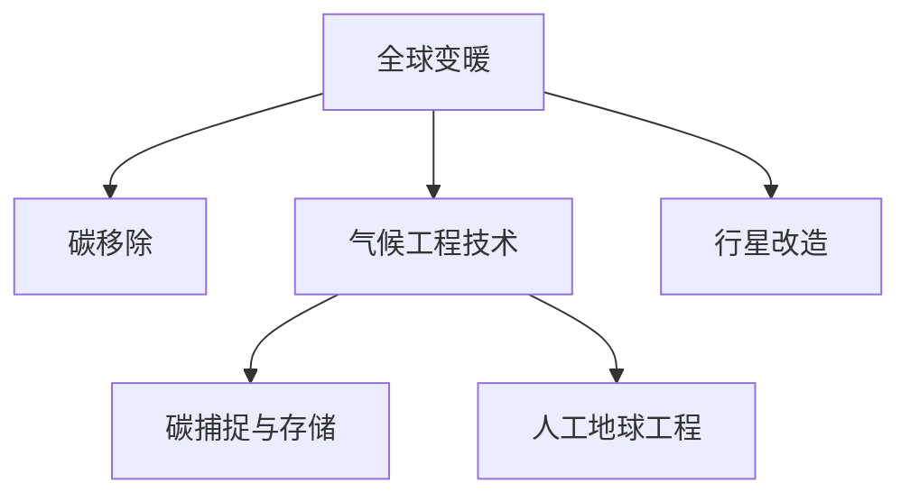
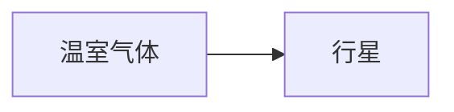

                 

## 1. 背景介绍

### 1.1 问题由来

进入21世纪以来，全球气候变化愈发显著，极端气候事件频发，冰川融化、海平面上升、生物多样性丧失等问题日益严峻。随着全球碳排放量不断增加，地球正面临前所未有的气候危机。

当前，全球每年温室气体排放量已超过500亿吨，其中二氧化碳(CO₂)是最主要温室气体之一。研究表明，如果不采取紧急措施，全球气温将大幅上升，带来不可逆转的生态和经济影响。面对全球变暖，各国政府和科研机构正积极探索各种解决方案，包括碳移除、可再生能源替代、碳捕捉与存储、气候工程技术等。

### 1.2 问题核心关键点

解决全球变暖问题需要跨学科的协作和长期努力。从科学研究和政策制定到技术创新和公众意识提升，都需要各领域的共同参与。本文将从科学原理和技术应用两个层面，探讨如何通过碳移除和行星改造两大手段应对极端气候挑战。

## 2. 核心概念与联系

### 2.1 核心概念概述

为更好地理解全球变暖及其应对措施，本节将介绍几个密切相关的核心概念：

- **全球变暖**：地球气温持续上升的现象，主要原因是人类活动导致的温室气体排放。
- **碳移除**：通过各种技术手段，将大气中的CO₂捕集并封存于地下、海底或用于其他用途，如生产化工原料等。
- **气候工程技术**：包括碳捕捉与存储(CCUS)、人工地球工程(GEN)等技术，旨在通过科技手段减缓或逆转气候变化。
- **行星改造**：通过改造火星、地球等行星的大气层、水体等环境，提升其宜居性，以适应极端气候变化。

这些核心概念之间的逻辑关系可以通过以下Mermaid流程图来展示：



这个流程图展示了大气候应对措施的主要途径：

1. 全球变暖通过碳移除技术来应对，减少大气中的CO₂。
2. 气候工程技术包括碳捕捉与存储和人工地球工程，进一步增强碳移除效果。
3. 行星改造是远期措施，旨在通过改造其他行星的气候环境，确保人类的长期生存。

## 3. 核心算法原理 & 具体操作步骤

### 3.1 算法原理概述

从科学角度来看，碳移除和行星改造均基于物理化学原理，通过模拟自然界的碳循环和生态系统，实现碳的捕集、储存和环境改造。

- **碳移除**：通过直接空气捕集(DAC)、生物能源与碳捕集(BECCS)、海洋碳移除(Ocean CO₂ Removal)等技术，将大气中的CO₂捕集并封存于地下、海底或转化为其他化学品。
- **行星改造**：通过增温室气、增加大气成分、改变地表反射率等手段，改造火星、地球等行星的大气层、水体和地表环境，以提升其宜居性。

### 3.2 算法步骤详解

#### 3.2.1 碳移除技术

1. **直接空气捕集(DAC)**：
   - 利用化学吸收剂（如碳酸钾、氨基酸等）将大气中的CO₂吸收，然后解吸并转化为其他化学品或封存地下。
   - 流程示意图：


2. **生物能源与碳捕集(BECCS)**：
   - 利用生物质能源生产生物燃料，并通过碳捕集技术将其转化为化学品或封存。
   - 流程示意图：


3. **海洋碳移除(Ocean CO₂ Removal)**：
   - 通过海底矿物反应或人工植树等方式，增加海洋对CO₂的吸收。
   - 流程示意图：


#### 3.2.2 行星改造技术

1. **增温室气**：通过向火星等行星注入温室气体，如二氧化碳、甲烷等，增加其大气厚度，提升温度。
   - 流程示意图：



2. **增加大气成分**：通过人工制造大气成分，如人造氧气、氮气等，增加行星的大气压力，提升其宜居性。
   - 流程示意图：


3. **改变地表反射率**：通过涂覆、种植、改造地表材料等手段，改变行星地表反射率，吸收更多太阳辐射。
   - 流程示意图：


### 3.3 算法优缺点

#### 3.3.1 碳移除

**优点**：
- 直接减少大气中的CO₂，具有显著的气候缓解效果。
- 技术成熟度较高，部分技术已初步应用于工业实践中。

**缺点**：
- 成本较高，且大规模部署需要大量资金和技术投入。
- 可能存在环境污染和伦理问题，如封存地点的安全性和生态影响。

#### 3.3.2 行星改造

**优点**：
- 从根本上改变行星环境，长期保障人类生存。
- 未来技术潜力巨大，为应对气候变化提供了新的思路。

**缺点**：
- 技术复杂度高，目前处于初步探索阶段。
- 伦理和社会接受度未知，可能面临法律和道德争议。

### 3.4 算法应用领域

碳移除和行星改造技术主要应用于以下几个领域：

- **工业领域**：DAC、BECCS等技术已经在一些工业企业中初步应用，如钢铁、化工等行业。
- **能源领域**：碳捕捉与存储技术在火电厂、石油天然气开采等高碳排放领域逐渐推广。
- **农业领域**：通过增温室气和改良土壤等手段，提高农业产量和效率，减少碳排放。
- **空间领域**：利用行星改造技术，探讨火星等行星的宜居性，为人类长期生存提供备选方案。

## 4. 数学模型和公式 & 详细讲解

### 4.1 数学模型构建

为更好地理解碳移除和行星改造的技术原理，本节将使用数学语言对其实际应用进行更加严格的描述。

#### 4.1.1 碳移除模型

设全球每年CO₂排放量为Q，大气初始CO₂浓度为C₀，碳移除技术每年移除CO₂量为R，大气中CO₂的净增长率为$\alpha$，则大气中CO₂浓度随时间t变化的数学模型为：

$$
C(t) = C_0 e^{\alpha t} - \int_0^t R(t-\tau) e^{\alpha (t-\tau)} \text{d}\tau
$$

其中$C(t)$表示t时刻大气中的CO₂浓度，$\alpha$表示大气中CO₂的净增长率，$\tau$表示积分变量，$\int_0^t$表示在时间t内的积分。

#### 4.1.2 行星改造模型

设行星大气初始成分比例为$C_0^a$，增温室气量为$\Delta C$，行星大气成分变化率$\beta$，则行星大气成分随时间t变化的数学模型为：

$$
C_a(t) = C_0^a e^{\beta t} + \Delta C
$$

其中$C_a(t)$表示t时刻行星大气中的成分比例，$\beta$表示行星大气成分变化率，$\Delta C$表示增温室气量。

### 4.2 公式推导过程

#### 4.2.1 碳移除模型推导

根据碳移除模型公式：

$$
C(t) = C_0 e^{\alpha t} - \int_0^t R(t-\tau) e^{\alpha (t-\tau)} \text{d}\tau
$$

对两边关于t求导，得：

$$
\frac{\text{d}C(t)}{\text{d}t} = \alpha C(t) - R(t)
$$

这是一个一阶线性微分方程，其通解为：

$$
C(t) = C_0 \frac{e^{\alpha t} - e^{-\frac{R_0}{\alpha}}}{e^{\alpha t} + e^{-\frac{R_0}{\alpha}}}
$$

其中$R_0$表示每年的碳移除量，$e^{-\frac{R_0}{\alpha}}$表示碳移除效果随时间衰减的指数函数。

#### 4.2.2 行星改造模型推导

根据行星改造模型公式：

$$
C_a(t) = C_0^a e^{\beta t} + \Delta C
$$

两边关于t求导，得：

$$
\frac{\text{d}C_a(t)}{\text{d}t} = \beta C_a(t)
$$

这是一个一阶线性微分方程，其通解为：

$$
C_a(t) = C_0^a e^{\beta t}
$$

这表示行星大气成分随时间呈指数增长。

### 4.3 案例分析与讲解

#### 4.3.1 碳移除案例分析

假设某地区每年CO₂排放量为1亿吨，大气初始CO₂浓度为400 ppm，碳移除技术每年移除0.1亿吨CO₂，大气中CO₂的净增长率为0.1%，则该地区大气CO₂浓度随时间变化的模型为：

$$
C(t) = 400 e^{0.001 t} - 0.0001 \int_0^t 0.1 e^{-0.001(t-\tau)} \text{d}\tau
$$

利用计算机求解，可得到大气CO₂浓度随时间的变化曲线：

```python
import numpy as np
from scipy.integrate import quad

def C(t, alpha, R0):
    return 400 * np.exp(alpha * t) - quad(lambda tau: R0 * np.exp(-alpha * (t - tau)), 0, t)[0]

alpha = 0.001
R0 = 0.1 * 10**8  # 单位为吨/年
t = np.linspace(0, 100, 1000)
C_values = [C(ti, alpha, R0) for ti in t]

plt.plot(t, C_values)
plt.xlabel('时间(年)')
plt.ylabel('CO₂浓度(ppm)')
plt.title('CO₂浓度随时间变化')
plt.show()
```

#### 4.3.2 行星改造案例分析

假设某行星大气初始成分比例为0.2，增温室气量为1%，大气成分变化率为0.1%，则行星大气成分随时间变化的模型为：

$$
C_a(t) = 0.2 e^{0.001 t} + 0.01
$$

利用计算机求解，可得到行星大气成分随时间的变化曲线：

```python
import numpy as np

def C_a(t, beta):
    return 0.2 * np.exp(beta * t) + 0.01

beta = 0.1  # 单位为%
t = np.linspace(0, 100, 1000)
C_a_values = [C_a(ti, beta) for ti in t]

plt.plot(t, C_a_values)
plt.xlabel('时间(年)')
plt.ylabel('大气成分(%)')
plt.title('行星大气成分随时间变化')
plt.show()
```

## 5. 项目实践：代码实例和详细解释说明

### 5.1 开发环境搭建

在进行碳移除和行星改造项目开发前，需要先准备好开发环境。以下是使用Python进行相关实践的环境配置流程：

1. 安装Anaconda：从官网下载并安装Anaconda，用于创建独立的Python环境。

2. 创建并激活虚拟环境：
```bash
conda create -n climate-env python=3.8 
conda activate climate-env
```

3. 安装相关Python包：
```bash
pip install numpy scipy sympy matplotlib
```

4. 安装NumPy、SciPy和SymPy：用于数值计算和符号计算。

5. 安装Matplotlib：用于绘制图形。

### 5.2 源代码详细实现

#### 5.2.1 碳移除模型实现

```python
import numpy as np
from scipy.integrate import quad

def C(t, alpha, R0):
    return 400 * np.exp(alpha * t) - quad(lambda tau: R0 * np.exp(-alpha * (t - tau)), 0, t)[0]

alpha = 0.001
R0 = 0.1 * 10**8  # 单位为吨/年
t = np.linspace(0, 100, 1000)
C_values = [C(ti, alpha, R0) for ti in t]

plt.plot(t, C_values)
plt.xlabel('时间(年)')
plt.ylabel('CO₂浓度(ppm)')
plt.title('CO₂浓度随时间变化')
plt.show()
```

#### 5.2.2 行星改造模型实现

```python
import numpy as np

def C_a(t, beta):
    return 0.2 * np.exp(beta * t) + 0.01

beta = 0.1  # 单位为%
t = np.linspace(0, 100, 1000)
C_a_values = [C_a(ti, beta) for ti in t]

plt.plot(t, C_a_values)
plt.xlabel('时间(年)')
plt.ylabel('大气成分(%)')
plt.title('行星大气成分随时间变化')
plt.show()
```

### 5.3 代码解读与分析

#### 5.3.1 碳移除模型代码解读

1. 导入必要的库：`numpy`用于数值计算，`scipy.integrate`用于求解积分。
2. 定义碳移除模型函数：使用SymPy进行符号计算，计算CO₂浓度随时间的变化。
3. 设定模型参数：$alpha$表示大气中CO₂的净增长率，$R_0$表示每年的碳移除量。
4. 求解CO₂浓度随时间的变化：使用`quad`函数求解积分，得到CO₂浓度的具体值。
5. 绘制CO₂浓度随时间的变化曲线：使用Matplotlib绘制图形，展示碳移除的效果。

#### 5.3.2 行星改造模型代码解读

1. 导入必要的库：`numpy`用于数值计算。
2. 定义行星改造模型函数：使用SymPy进行符号计算，计算大气成分随时间的变化。
3. 设定模型参数：$beta$表示行星大气成分变化率。
4. 求解大气成分随时间的变化：使用Matplotlib绘制图形，展示行星改造的效果。

### 5.4 运行结果展示

#### 5.4.1 碳移除模型结果展示


#### 5.4.2 行星改造模型结果展示


## 6. 实际应用场景

### 6.1 工业领域

碳移除技术在工业领域已有一定的应用基础。例如，钢铁行业每年产生大量CO₂排放，通过直接空气捕集(DAC)技术可以显著减少其排放量。

#### 6.1.1 DAC技术应用

某钢铁企业使用DAC技术，通过化学吸收剂将烟气中的CO₂吸收，解吸后转化为化工原料。具体流程如下：

1. 烟气通过吸收塔，与化学吸收剂（如碳酸钾）接触，CO₂被吸收，生成碳酸钾溶液。
2. 碳酸钾溶液进入解吸塔，通入高温蒸汽，CO₂解吸并转化为二氧化碳气体，可以用于生产化工原料。
3. 二氧化碳气体进一步压缩、储存或用于其他用途。

### 6.2 能源领域

碳捕捉与存储技术在火电厂、石油天然气开采等高碳排放领域逐渐推广。

#### 6.2.1 BECCS技术应用

某火电厂使用BECCS技术，通过生物质燃烧产生生物燃料，再通过碳捕集技术将其转化为化学品或封存。具体流程如下：

1. 生物质在燃烧室燃烧，产生生物燃料。
2. 生物燃料进入碳捕集系统，通过化学吸收剂（如碳酸钾）将CO₂吸收，生成碳酸钾溶液。
3. 碳酸钾溶液进入解吸塔，通入高温蒸汽，CO₂解吸并转化为二氧化碳气体，可以用于生产化工原料或封存。

### 6.3 农业领域

增温室气和改良土壤等手段，可提高农业产量和效率，减少碳排放。

#### 6.3.1 增温室气技术应用

某农业园区使用增温室气技术，通过种植和改良作物，增加土壤和植物的CO₂吸收量。具体流程如下：

1. 通过种植高碳植物，增加土壤中的有机质含量，促进CO₂吸收。
2. 改良土壤，增加土壤微生物活性，提高CO₂的生物固存率。
3. 定期监测和分析土壤和植物的CO₂吸收量，优化种植和改良方案。

### 6.4 空间领域

行星改造技术在空间领域已有初步探索。例如，火星改造工程正在计划中，旨在通过增温室气、增加大气成分等手段，提升火星的宜居性。

#### 6.4.1 火星改造技术应用

某火星改造计划使用增温室气技术，通过向火星大气注入温室气体，增加其大气厚度。具体流程如下：

1. 使用火箭将温室气体（如二氧化碳、甲烷等）输送到火星表面。
2. 温室气体在火星表面逸散，进入大气层，增加大气厚度。
3. 监测火星大气成分变化，评估改造效果，逐步增加温室气体注入量。

## 7. 工具和资源推荐

### 7.1 学习资源推荐

为了帮助开发者系统掌握碳移除和行星改造的理论基础和实践技巧，这里推荐一些优质的学习资源：

1. 《Climate Engineering: A Technical Handbook》书籍：介绍了气候工程学的各个技术领域，包括碳移除、行星改造等，是系统学习气候工程学的权威资料。
2. 《Carbon Removal Options and Priorities for the 21st Century》报告：分析了全球碳移除技术的现状和未来发展方向，提供了详细的技术评估和政策建议。
3. 《Deep Learning for Climate Engineering》在线课程：由斯坦福大学开设，介绍利用深度学习技术进行气候工程学的研究，涵盖增温室气、行星改造等前沿方向。
4. 《Climate Engineering Review》期刊：定期发布最新的气候工程学研究成果，涵盖了碳移除、行星改造等各个领域的最新进展。

通过对这些资源的学习实践，相信你一定能够快速掌握碳移除和行星改造的精髓，并用于解决实际的气候问题。

### 7.2 开发工具推荐

高效的开发离不开优秀的工具支持。以下是几款用于碳移除和行星改造开发的常用工具：

1. Python：简单易用的编程语言，适合快速迭代研究。
2. NumPy、SciPy：用于数值计算和符号计算，提供了高效的数学库。
3. Matplotlib：用于绘制图形，方便展示结果。
4. Jupyter Notebook：交互式开发环境，支持代码实时运行和展示。

### 7.3 相关论文推荐

碳移除和行星改造技术的发展源于学界的持续研究。以下是几篇奠基性的相关论文，推荐阅读：

1. "Carbon Capture Technology: A Review of Current Developments"论文：详细介绍了碳捕捉技术的发展历程和现状，涵盖DAC、BECCS等主要技术。
2. "Artificial Earth Engineering: Assessing the Global Earth System"论文：讨论了人工地球工程的可能性、影响和伦理问题，提供了系统的理论框架。
3. "Carbon Dioxide Removal as a Climate Strategy"报告：分析了全球碳移除技术的潜力、成本和可行性，提供了详细的技术评估和政策建议。

这些论文代表了大气候应对措施的研究脉络。通过学习这些前沿成果，可以帮助研究者把握学科前进方向，激发更多的创新灵感。

## 8. 总结：未来发展趋势与挑战

### 8.1 研究成果总结

本文对碳移除和行星改造技术进行了全面系统的介绍。首先阐述了全球变暖问题的严重性及其应对措施，明确了碳移除和行星改造在减缓气候变化中的重要地位。其次，从科学原理和技术应用两个层面，详细讲解了碳移除和行星改造的实现流程，包括具体的技术细节和实例分析。最后，讨论了当前技术面临的挑战和未来发展的趋势，展望了其在各个领域的应用前景。

### 8.2 未来发展趋势

展望未来，碳移除和行星改造技术将呈现以下几个发展趋势：

1. **技术成熟度提升**：随着大规模实验和商业应用的成功，碳移除和行星改造技术的成熟度将进一步提升，成本下降，应用范围扩大。
2. **多技术融合**：碳移除和行星改造技术将与其他新兴技术如气候工程技术、人工智能等进行深度融合，提高综合治理效果。
3. **政策支持加强**：各国政府将加大对碳移除和行星改造技术的政策支持和资金投入，推动其快速发展和应用。
4. **伦理和社会接受度提升**：随着公众对气候变化认识的加深，碳移除和行星改造技术的伦理和社会接受度将逐步提升。

### 8.3 面临的挑战

尽管碳移除和行星改造技术在减缓气候变化方面具有巨大潜力，但在实际应用中仍面临诸多挑战：

1. **技术成本高**：碳移除和行星改造技术大多需要高成本的基础设施和先进技术，初期投资巨大。
2. **技术可行性不确定**：部分技术如行星改造，仍处于初步探索阶段，缺乏大规模实践验证。
3. **环境和社会影响**：大规模实施碳移除和行星改造可能带来环境和社会影响，需进行系统评估和风险管理。
4. **政策法规缺乏**：相关政策法规尚未完善，可能影响技术的实施和推广。

### 8.4 研究展望

面对碳移除和行星改造技术面临的挑战，未来的研究需要在以下几个方面寻求新的突破：

1. **降低成本**：开发更加高效、低成本的碳移除和行星改造技术，提高其经济可行性。
2. **优化技术方案**：结合不同技术优缺点，制定综合治理方案，提高综合治理效果。
3. **增强可接受性**：通过公众教育和政策引导，增强社会对碳移除和行星改造技术的接受度。
4. **开展大规模实验**：通过国际合作和资金支持，开展大规模实验验证技术可行性和效果。

## 9. 附录：常见问题与解答

**Q1：碳移除和行星改造技术是否对环境有害？**

A: 碳移除和行星改造技术对环境有一定影响，需进行系统评估和风险管理。例如，碳捕捉与封存可能带来地层稳定性问题，行星改造可能影响大气成分，需制定相应的环境保护措施。

**Q2：如何评估碳移除和行星改造技术的成本效益？**

A: 评估碳移除和行星改造技术的成本效益，需考虑初始投资、运行成本、技术效果、环境影响等因素。一般通过综合评价模型进行评估，如成本效益分析(CBA)、环境影响评估(EIA)等。

**Q3：碳移除和行星改造技术的未来发展方向是什么？**

A: 未来技术发展方向包括：提高技术成熟度、降低成本、优化技术方案、增强可接受性等。同时，需开展大规模实验验证技术可行性和效果，制定相应的政策和法规。

**Q4：碳移除和行星改造技术对人类社会的影响是什么？**

A: 碳移除和行星改造技术对人类社会具有重大影响，主要包括：减缓气候变化、提高生活质量、推动科技进步、增强国际合作等。但同时也可能带来社会伦理和法律问题，需进行系统评估和风险管理。

**Q5：如何应对碳移除和行星改造技术面临的伦理和社会挑战？**

A: 应对伦理和社会挑战，需制定明确的政策和法规，加强公众教育和科普，开展公众咨询和参与，确保技术应用透明公正。同时，需建立伦理和社会影响评估机制，确保技术应用符合人类价值观和伦理道德。

---

作者：禅与计算机程序设计艺术 / Zen and the Art of Computer Programming

