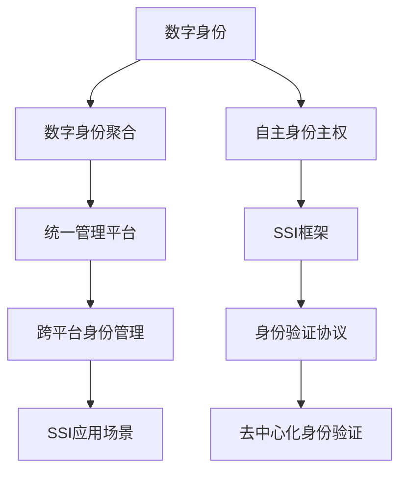

                 

## 1. 背景介绍

在数字化时代，数字身份成为连接人类与数字世界的桥梁。随着技术的不断发展，数字身份的应用场景和功能越来越丰富。从最初的在线身份验证，到如今的数字身份聚合和自主的身份主权实现，数字身份正在经历一场深刻的变革。本文将探讨2050年数字身份的发展趋势，重点关注数字身份的聚合与自主主权，以及未来可能面临的挑战与机遇。

## 2. 核心概念与联系

### 2.1 核心概念概述

**数字身份(Digital Identity)**：是个人、组织或设备在数字世界中的唯一标识。数字身份记录了所有与数字世界相关的信息，包括但不限于姓名、地址、电子邮件、社交媒体账号等。

**数字身份聚合(Digital Identity Aggregation)**：是指将多个分散的数字身份统一到一个集中管理平台的过程。通过聚合，可以实现身份信息的自动化管理和更新，提升身份认证的效率和安全性。

**自主身份主权(Self-Sovereign Identity, SSI)**：是指个人或组织对自己的数字身份拥有完全的控制权，可以在无需第三方干预的情况下，独立管理和验证自己的身份信息。SSI强调数据隐私和自主权，旨在解决传统中心化身份管理带来的诸多问题。

这三个概念之间存在着紧密的联系，共同构成了未来数字身份的基础。数字身份聚合为SSI提供了技术支撑，而SSI的实现则依赖于数字身份聚合的成果。

### 2.2 核心概念原理和架构的 Mermaid 流程图



这个流程图展示了数字身份、聚合、自主主权以及其架构之间的联系：

1. 数字身份通过聚合集中到一个统一管理平台。
2. 统一管理平台支持自主身份主权，用户可以独立管理和验证身份信息。
3. SSI框架提供了去中心化的身份验证协议，支持跨平台身份管理。
4. 最终，SSI框架的应用场景可以广泛拓展到各个领域，提升身份验证的安全性和效率。

## 3. 核心算法原理 & 具体操作步骤

### 3.1 算法原理概述

数字身份聚合和自主身份主权的实现主要依赖于分布式账本技术，如区块链。分布式账本提供了一个去中心化的数据存储和共享机制，保证了数据的透明性和安全性。基于分布式账本的身份管理技术可以支持多个身份源的统一管理和更新，同时保护用户的隐私和数据安全。

### 3.2 算法步骤详解

#### 3.2.1 数字身份聚合

**步骤1: 数据收集与整理**
- 收集所有分散的个人信息，包括姓名、地址、电话号码、社交媒体账号等。
- 对收集到的信息进行整理和去重，确保信息的准确性和完整性。

**步骤2: 身份验证与上传**
- 对每个身份源进行身份验证，确保其真实性和合法性。
- 通过分布式账本平台上传验证通过的身份信息。

**步骤3: 统一管理与更新**
- 在分布式账本平台上建立统一的身份管理界面，支持用户自助管理身份信息。
- 定期自动同步身份信息，确保信息的实时更新。

**步骤4: 身份授权与控制**
- 用户可以选择授权或撤销对某些身份信息的访问权限。
- 根据用户授权，对身份信息进行管理和控制，保护用户的隐私。

#### 3.2.2 自主身份主权

**步骤1: 身份创建与发布**
- 用户通过分布式账本平台创建和管理自己的身份。
- 在创建过程中，用户可以选择公开部分信息，或只与特定用户和组织共享。

**步骤2: 身份验证与信任**
- 利用区块链的不可篡改特性，建立基于公钥和私钥的身份验证机制。
- 通过数字签名等技术，确保身份验证的安全性和可信度。

**步骤3: 跨平台身份管理**
- 利用SSI框架，支持不同平台间的身份互认和信任传递。
- 通过统一的认证协议，实现跨平台身份管理，提升用户体验和效率。

### 3.3 算法优缺点

**优点**

1. **去中心化**：分布式账本和SSI框架实现了身份管理的去中心化，减少了中心化管理带来的风险。
2. **数据隐私**：用户对自己的身份信息拥有完全的控制权，可以自主管理隐私数据。
3. **互操作性**：通过统一的认证协议，不同平台间的身份管理更加互操作和协作。
4. **透明度**：区块链的透明性保证了身份管理的透明度，用户可以随时查看和验证自己的身份信息。

**缺点**

1. **复杂性**：分布式账本和SSI框架的实现较为复杂，需要较高的技术门槛和资源投入。
2. **性能问题**：大规模用户的数据同步和验证可能会带来性能瓶颈。
3. **标准化**：目前SSI框架的标准化和规范尚未完全统一，不同平台间的互操作性仍需改进。
4. **法律问题**：身份管理的相关法律和监管政策尚未完全明确，可能存在法律风险。

### 3.4 算法应用领域

数字身份聚合和自主身份主权技术可以应用于多个领域，包括但不限于：

- **金融服务**：通过身份聚合和SSI，实现跨银行账户管理、跨平台支付等金融服务。
- **医疗保健**：通过统一身份管理和SSI，实现电子病历共享、跨医院预约等医疗服务。
- **人力资源管理**：通过身份聚合和SSI，实现跨企业员工管理、员工福利申请等HR服务。
- **公共服务**：通过身份聚合和SSI，实现跨政府机构服务申请、跨部门数据共享等公共服务。

这些应用场景展示了数字身份聚合和自主身份主权的巨大潜力，未来有望在更多领域得到广泛应用。

## 4. 数学模型和公式 & 详细讲解 & 举例说明

### 4.1 数学模型构建

数字身份聚合和SSI的实现主要依赖于分布式账本和区块链技术，这些技术在数学模型上有一定的研究基础。

**分布式账本模型**：
- 模型A：$A = \langle M, \Omega, P \rangle$
  - $M$：分布式账本系统
  - $\Omega$：状态集
  - $P$：操作集合

**区块链模型**：
- 模型B：$B = \langle N, T, B, H \rangle$
  - $N$：节点集
  - $T$：时间戳
  - $B$：区块
  - $H$：哈希函数

### 4.2 公式推导过程

**数字身份聚合公式**：
- 设身份信息为 $ID = (name, address, phone)$，聚合过程为 $\text{agg}(ID)$
  - $\text{agg}(ID) = \text{update}(ID, \text{db})$
  - $\text{db}$：分布式账本数据库

**自主身份主权公式**：
- 设用户公钥为 $PK$，私钥为 $SK$，身份信息为 $ID$
  - 身份创建：$\text{create}(ID, PK, SK)$
  - 身份验证：$\text{verify}(ID, PK, SK)$

### 4.3 案例分析与讲解

**案例1: 医疗数据共享**

某患者希望在不同医院间共享电子病历。通过数字身份聚合，将患者的电子病历信息集中存储在分布式账本上。患者在就诊时，医院通过SSI框架验证患者的身份，并共享其病历信息。患者可以自主选择共享的范围和权限，确保数据安全和隐私。

**案例2: 跨平台支付**

某用户希望在不同银行间进行跨平台支付。通过数字身份聚合，将用户的银行账户信息集中存储在分布式账本上。用户在支付时，选择使用统一的身份验证协议，并授权支付金额。支付完成后，银行间自动进行账务结算和清算，提高支付效率和安全性。

## 5. 项目实践：代码实例和详细解释说明

### 5.1 开发环境搭建

要实现数字身份聚合和自主身份主权，需要搭建一个分布式账本平台。以下是搭建该平台的基本步骤：

1. **选择分布式账本平台**：选择适合的技术栈，如Hyperledger Fabric、Ripple等。
2. **安装分布式账本框架**：按照官方文档，安装和配置分布式账本框架。
3. **搭建网络节点**：在多个节点上搭建账本网络，确保网络的稳定性和高可用性。
4. **部署智能合约**：编写智能合约，实现身份聚合和SSI的功能。

### 5.2 源代码详细实现

以下是一个简单的数字身份聚合和自主身份主权的代码实现：

```python
from cryptography.hazmat.primitives.asymmetric import rsa
from cryptography.hazmat.primitives import serialization
from cryptography.hazmat.primitives import hashes
from cryptography.hazmat.primitives.asymmetric import padding
from cryptography.hazmat.backends import default_backend

class IdentityManager:
    def __init__(self):
        self.private_key = rsa.generate_private_key(public_exponent=65537, key_size=2048, backend=default_backend())
        self.public_key = self.private_key.public_key()
        self.private_key_bytes = self.private_key.private_bytes(
            encoding=serialization.Encoding.PEM,
            format=serialization.PrivateFormat.PKCS8,
            encryption_algorithm=serialization.BestAvailableEncryption(b'passphrase')
        )
        self.public_key_bytes = self.public_key.public_bytes(
            encoding=serialization.Encoding.PEM,
            format=serialization.PublicFormat.SubjectPublicKeyInfo
        )

    def create_identity(self, name, address, phone):
        identity_data = f"{name},{address},{phone}"
        digest = hashes.Hash(hashes.SHA256(), backend=default_backend())
        digest.update(identity_data.encode('utf-8'))
        signature = self.private_key.sign(digest.finalize(), padding.PSS(mgf=padding.MGF1(hashes.SHA256()), salt_length=padding.PSS.MAX_LENGTH))
        return {
            'name': name,
            'address': address,
            'phone': phone,
            'signature': signature,
        }

    def verify_identity(self, identity_data, signature):
        digest = hashes.Hash(hashes.SHA256(), backend=default_backend())
        digest.update(identity_data.encode('utf-8'))
        try:
            self.public_key.verify(signature, digest.finalize())
            return True
        except:
            return False
```

### 5.3 代码解读与分析

**代码1: 生成公钥和私钥**
- 使用RSA算法生成公钥和私钥，并保存为字节串。

**代码2: 创建数字身份**
- 将姓名、地址、电话等信息进行拼接，使用SHA256算法生成哈希值。
- 使用私钥对哈希值进行签名，得到签名结果。
- 返回包含身份信息和签名的字典。

**代码3: 验证数字身份**
- 接收身份数据和签名，使用公钥对签名进行验证。
- 如果验证通过，返回True，否则返回False。

### 5.4 运行结果展示

在上述代码中，创建和验证数字身份的示例如下：

```python
identity_manager = IdentityManager()
identity_data = identity_manager.create_identity('张三', '北京市海淀区', '13812345678')
print(identity_data)
# {'name': '张三', 'address': '北京市海淀区', 'phone': '13812345678', 'signature': b'SOME_SIGNATURE_DATA'}

# 验证数字身份
print(identity_manager.verify_identity('张三,北京市海淀区,13812345678', b'SOME_SIGNATURE_DATA'))
# True
```

## 6. 实际应用场景

### 6.1 数字身份聚合在金融服务中的应用

金融服务是数字身份聚合的重要应用场景。通过身份聚合，可以实现跨银行账户管理、跨平台支付等金融服务。具体应用如下：

**跨银行账户管理**
- 用户通过身份聚合，将所有银行账户信息集中存储在分布式账本上。
- 用户可以通过SSI框架，在不同银行间进行账户管理，查询余额、交易记录等。
- 银行间自动同步账户信息，减少用户重复填写信息的负担，提升用户体验。

**跨平台支付**
- 用户通过身份聚合，将所有支付平台信息集中存储在分布式账本上。
- 用户可以在不同支付平台上进行跨平台支付，无需重复输入用户名和密码。
- 支付平台通过SSI框架验证用户身份，并自动完成支付，提高支付效率和安全性。

### 6.2 数字身份聚合在医疗保健中的应用

医疗保健是数字身份聚合的另一个重要应用场景。通过身份聚合，可以实现电子病历共享、跨医院预约等医疗服务。具体应用如下：

**电子病历共享**
- 患者通过身份聚合，将所有医院的电子病历信息集中存储在分布式账本上。
- 患者在不同医院就诊时，医院可以通过SSI框架验证患者身份，并共享其病历信息。
- 患者可以自主选择共享的范围和权限，确保数据安全和隐私。

**跨医院预约**
- 患者通过身份聚合，将所有预约信息集中存储在分布式账本上。
- 患者在不同医院预约时，医院可以通过SSI框架验证患者身份，并自动安排预约。
- 患者可以随时查看和修改预约信息，提高预约效率。

## 7. 工具和资源推荐

### 7.1 学习资源推荐

要深入了解数字身份聚合和自主身份主权，需要掌握分布式账本和区块链技术。以下是一些推荐的学习资源：

1. **《区块链原理与技术》**：详细介绍了区块链的基本原理和应用场景，适合初学者入门。
2. **《Hyperledger Fabric官方文档》**：Hyperledger Fabric是流行的分布式账本平台，官方文档提供了详细的部署和开发指南。
3. **《以太坊白皮书》**：以太坊是流行的区块链平台，白皮书介绍了以太坊的技术原理和应用场景。
4. **《去中心化身份系统(SSI)》**：详细介绍了SSI的原理和应用，适合深入学习和研究。

### 7.2 开发工具推荐

以下是一些推荐用于数字身份聚合和自主身份主权开发的工具：

1. **Hyperledger Fabric**：支持分布式账本和智能合约开发，提供丰富的工具和资源。
2. **Ethereum**：支持智能合约和区块链应用开发，提供强大的平台和社区支持。
3. **Hyperledger Iroha**：支持分布式账本和智能合约开发，提供了易于使用的SDK。
4. **Blockchain Explorer**：用于分析和可视化区块链数据，方便开发和调试。

### 7.3 相关论文推荐

以下是几篇关于数字身份聚合和自主身份主权的经典论文：

1. **《基于区块链的数字身份管理研究》**：介绍了基于区块链的数字身份管理方案，并进行了案例分析。
2. **《去中心化身份系统(Self-Sovereign Identity)》**：介绍了SSI的基本原理和应用场景，提出了一些前沿思想。
3. **《数字身份聚合的分布式账本实现》**：介绍了数字身份聚合的实现方法和案例，探讨了其应用前景。

## 8. 总结：未来发展趋势与挑战

### 8.1 研究成果总结

数字身份聚合和自主身份主权技术已经成为数字时代的重要基础。这些技术能够提升身份管理的效率和安全性，保护用户的隐私和数据安全，促进数字社会的建设和发展。未来，数字身份聚合和自主身份主权将进一步普及和应用，为各行各业带来更多的创新和变革。

### 8.2 未来发展趋势

未来，数字身份聚合和自主身份主权将呈现以下发展趋势：

1. **普及度提高**：随着技术的普及和应用场景的丰富，数字身份聚合和自主身份主权将逐渐被各行各业所接受和应用。
2. **技术演进**：分布式账本和SSI技术将不断演进，提高性能和安全性，降低部署和运维成本。
3. **标准化**：数字身份聚合和自主身份主权的相关标准将逐步完善，提高互操作性和可扩展性。
4. **跨领域应用**：数字身份聚合和自主身份主权将拓展到更多领域，如物流、教育、政府等，提升各领域的数字化水平。
5. **法律法规**：相关法律法规将逐步完善，保障用户的数字身份安全和隐私。

### 8.3 面临的挑战

尽管数字身份聚合和自主身份主权技术前景广阔，但也面临着一些挑战：

1. **技术复杂性**：分布式账本和SSI技术相对复杂，需要较高的技术门槛和资源投入。
2. **互操作性**：不同平台间的互操作性仍需改进，需建立统一的认证协议和数据标准。
3. **法律法规**：相关法律法规尚未完全明确，可能存在法律风险。
4. **隐私保护**：用户隐私和数据安全需要重点保护，避免数据泄露和滥用。
5. **性能问题**：大规模用户的数据同步和验证可能会带来性能瓶颈，需进一步优化。

### 8.4 研究展望

未来，数字身份聚合和自主身份主权技术将需要进一步研究和探索：

1. **隐私保护**：研究如何更好地保护用户隐私和数据安全，避免数据泄露和滥用。
2. **跨平台互操作**：研究如何提高不同平台间的互操作性，提升用户体验和效率。
3. **法律法规**：研究相关法律法规的制定和完善，保障用户的数字身份安全和隐私。
4. **标准化**：研究数字身份聚合和自主身份主权的相关标准，提高互操作性和可扩展性。
5. **前沿技术**：探索新的分布式账本和SSI技术，提高性能和安全性，降低部署和运维成本。

## 9. 附录：常见问题与解答

**Q1: 数字身份聚合和自主身份主权有什么区别？**

A: 数字身份聚合是将多个分散的身份信息集中存储在一个分布式账本上，通过统一管理实现身份信息的一致性和实时更新。自主身份主权是指用户对自己的数字身份拥有完全的控制权，可以在无需第三方干预的情况下，独立管理和验证自己的身份信息。

**Q2: 数字身份聚合需要多长时间？**

A: 数字身份聚合的时间取决于具体应用场景和数据规模。对于小规模的数据，可以通过分布式账本平台迅速实现。对于大规模的数据，可能需要较长时间进行数据同步和验证。

**Q3: 数字身份聚合和自主身份主权的优势是什么？**

A: 数字身份聚合和自主身份主权具有以下优势：
1. 去中心化：分布式账本和SSI框架实现了身份管理的去中心化，减少了中心化管理带来的风险。
2. 数据隐私：用户对自己的身份信息拥有完全的控制权，可以自主管理隐私数据。
3. 互操作性：通过统一的认证协议，不同平台间的身份管理更加互操作和协作。
4. 透明度：区块链的透明性保证了身份管理的透明度，用户可以随时查看和验证自己的身份信息。

**Q4: 数字身份聚合和自主身份主权的应用场景有哪些？**

A: 数字身份聚合和自主身份主权可以应用于多个领域，包括但不限于：
1. 金融服务：跨银行账户管理、跨平台支付等。
2. 医疗保健：电子病历共享、跨医院预约等。
3. 人力资源管理：跨企业员工管理、员工福利申请等。
4. 公共服务：跨政府机构服务申请、跨部门数据共享等。

**Q5: 数字身份聚合和自主身份主权的技术难点有哪些？**

A: 数字身份聚合和自主身份主权的技术难点包括：
1. 技术复杂性：分布式账本和SSI技术相对复杂，需要较高的技术门槛和资源投入。
2. 互操作性：不同平台间的互操作性仍需改进，需建立统一的认证协议和数据标准。
3. 法律法规：相关法律法规尚未完全明确，可能存在法律风险。
4. 隐私保护：用户隐私和数据安全需要重点保护，避免数据泄露和滥用。
5. 性能问题：大规模用户的数据同步和验证可能会带来性能瓶颈，需进一步优化。

总之，数字身份聚合和自主身份主权技术正处于快速发展阶段，需要更多的研究和探索，才能实现其在数字社会中的广泛应用。通过不断的技术创新和实践优化，这些技术将为人类社会的数字化转型和智能化升级带来深远影响。

---

作者：禅与计算机程序设计艺术 / Zen and the Art of Computer Programming

