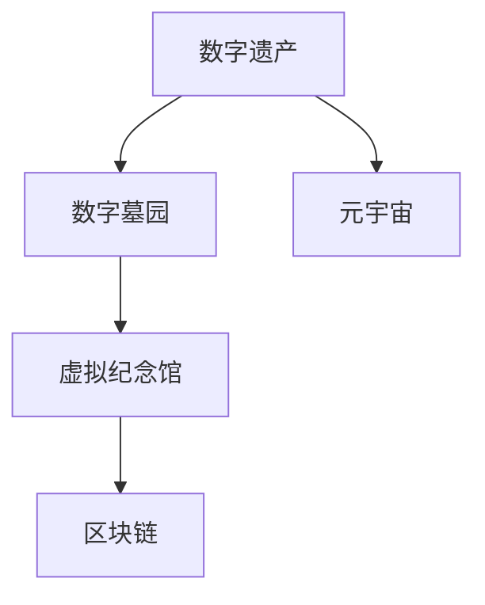

                 

## 1. 背景介绍

### 1.1 问题由来
随着数字时代的高速发展，我们越来越多地依赖于数字设备和互联网。在这个过程中，我们积累了大量数字遗产，包括照片、文档、视频、社交媒体帖子等。这些数字遗产是个人记忆、历史变迁和社会进步的重要记录，但随着技术的发展和媒介的变迁，它们的保存、传承和利用变得愈发复杂和紧迫。

### 1.2 问题核心关键点
数字遗产的保护和传承面临以下核心挑战：
- **数据量大、异构性强**：数字遗产类型多样，格式复杂，存储分散，管理和维护难度大。
- **隐私与安全**：数字遗产可能包含敏感信息，隐私泄露和数据安全问题亟需解决。
- **技术迭代快**：数字遗产的格式和技术依赖于特定设备和技术，随着技术更新换代，原有数据可能无法被读取。
- **可持续性与普惠性**：数字遗产的长期保存和传承需要考虑成本、资源和技术普及度。
- **多元文化与多语种支持**：数字遗产中往往包含不同文化背景和语言，需要有包容性和多元化的保存方案。

### 1.3 问题研究意义
数字遗产的保护和传承不仅是个体的责任，也是全社会的共同课题。其研究意义在于：
- **记录历史**：为后代保留真实的历史和文化，帮助我们理解过去，指导未来。
- **文化传承**：保护语言、艺术、传统等非物质文化遗产，促进跨代际的文化交流。
- **知识共享**：促进知识共享和创新，推动科学、艺术、教育等领域的发展。
- **社会福祉**：通过数字遗产的保存和利用，提升社会福祉，改善人民生活质量。

## 2. 核心概念与联系

### 2.1 核心概念概述

为了更好地理解数字遗产保护与传承的技术和方法，本节将介绍几个核心概念：

- **数字遗产(Digital Heritage)**：指个人或社群通过数字设备和技术创建和存储的信息、记录和表达，包括照片、文档、视频、社交媒体帖子等。
- **数字墓园(Digital Mortician)**：负责管理、保存和传承数字遗产的第三方服务机构或平台。
- **虚拟纪念馆(Virtual Memorial)**：通过数字化手段，构建永久保存和共享数字遗产的在线平台，供公众访问和纪念。
- **区块链(Blockchain)**：一种去中心化的分布式账本技术，用于确保数据的安全、透明和不可篡改。
- **元宇宙(Metaverse)**：一种虚拟现实与互联网相结合的全新社交和技术生态，为数字遗产提供沉浸式体验。

这些核心概念之间的逻辑关系可以通过以下Mermaid流程图来展示：



这个流程图展示了大数字遗产保护与传承的核心概念及其之间的关系：
1. 数字遗产通过数字墓园进行管理和保存。
2. 数字墓园通过区块链技术确保数据的安全性和不可篡改性。
3. 虚拟纪念馆提供永久保存和共享数字遗产的在线平台。
4. 元宇宙为数字遗产提供沉浸式体验，增强用户体验。

## 3. 核心算法原理 & 具体操作步骤

### 3.1 算法原理概述

数字遗产保护与传承的核心算法原理包括数据存储、数据加密、数据迁移、数据展示等。这些算法相互配合，确保数字遗产能够被长期保存、安全传递和便捷访问。

### 3.2 算法步骤详解

以下是数字遗产保护与传承的具体操作步骤：

**Step 1: 数据收集与整理**

1. 个人或社群收集各类数字遗产，包括照片、文档、视频、社交媒体帖子等。
2. 对数字遗产进行分类、整理，去除冗余和无价值的数据。
3. 对数字遗产进行标注和元数据添加，便于后续管理和检索。

**Step 2: 数据加密与备份**

1. 对数字遗产进行加密处理，确保数据在传输和存储过程中的安全性。
2. 定期对加密后的数据进行备份，确保数据在丢失或损坏时的恢复能力。

**Step 3: 数据迁移与存储**

1. 选择合适的数据存储格式和平台，确保数据在不同设备和技术之间的兼容性。
2. 利用数据迁移工具，将数字遗产从原始设备迁移到新的存储介质，如云存储、光盘、硬盘等。
3. 确保存储介质和平台的可持续性和可靠性，如使用RAID技术、分布式存储系统等。

**Step 4: 数据展示与分享**

1. 在虚拟纪念馆或社交平台上发布数字遗产，供公众访问和纪念。
2. 利用元数据和标签，优化数字遗产的搜索和展示效果。
3. 提供个性化展示功能，如纪念页面、互动模块等，增强用户体验。

**Step 5: 数据管理和维护**

1. 定期对数字遗产进行维护和更新，确保数据的时效性和完整性。
2. 建立数据使用规范和权限管理机制，确保数据的安全性和合规性。
3. 利用区块链技术记录数字遗产的创建、迁移和展示历史，确保数据的透明性和可追溯性。

### 3.3 算法优缺点

数字遗产保护与传承的算法具有以下优点：
- **高效性**：通过自动化工具和流程，降低了人工操作和维护的难度，提高了数据管理的效率。
- **安全性**：加密和区块链技术确保了数据在传输和存储过程中的安全性，避免了数据泄露和篡改风险。
- **可持续性**：分布式存储和备份策略确保了数据的长期保存和恢复能力。
- **便利性**：虚拟纪念馆和元宇宙技术提供了便捷的访问和展示方式，增强了用户的体验。

同时，该算法也存在以下局限性：
- **技术依赖**：对加密和区块链技术的依赖较高，技术更新和维护需要投入大量资源。
- **隐私风险**：数据加密和隐私保护需要平衡，过度加密可能影响数据的可读性和可访问性。
- **成本高昂**：数据迁移和存储成本较高，需要持续的投入和维护。
- **可扩展性差**：对于大规模数据集，现有技术可能面临性能瓶颈，需要进一步优化和扩展。

### 3.4 算法应用领域

数字遗产保护与传承的算法主要应用于以下领域：
- **个人档案管理**：个人或家族历史、回忆录、照片集等数字遗产的长期保存和管理。
- **文化保护**：非物质文化遗产、地方历史、民俗艺术等数字遗产的保护和传承。
- **教育科研**：学术研究、实验数据、教育资源等数字遗产的保护和利用。
- **公共记忆**：历史档案、公共记录、博物馆藏品等数字遗产的展示和传播。
- **企业档案**：企业历史、员工档案、项目记录等数字遗产的长期保存和访问。

## 4. 数学模型和公式 & 详细讲解 & 举例说明

### 4.1 数学模型构建

数字遗产保护与传承的数学模型主要涉及数据存储、数据加密、数据迁移、数据展示等环节。以下是一些基本的数学模型和公式。

**数据存储模型**：
- 定义数字遗产的存储位置 $P$ 和访问权限 $A$，数学模型为 $P \cap A = P_A$。
- 存储容量 $C$ 和数据量 $D$ 之间的关系为 $C = \frac{D}{\delta}$，其中 $\delta$ 为数据压缩率。

**数据加密模型**：
- 定义数据加密算法 $E$ 和密钥 $K$，加密后的数据 $C = E(D, K)$。
- 定义解密算法 $D$ 和密钥 $K'$，解密后的数据 $D' = D(C, K')$。

**数据迁移模型**：
- 定义数据迁移量 $M$ 和时间 $T$，数据迁移的数学模型为 $M = \frac{D}{T}$。
- 迁移效率 $E$ 和迁移成本 $C'$ 之间的关系为 $E = \frac{D}{C'}$。

**数据展示模型**：
- 定义数据展示次数 $N$ 和展示时间 $T'$，展示次数的数学模型为 $N = \frac{T'}{T}$。
- 展示效果 $E'$ 和展示成本 $C''$ 之间的关系为 $E' = \frac{N}{C''}$。

### 4.2 公式推导过程

**数据存储公式推导**：
- 假设原始数据量为 $D$，存储容量为 $C$，压缩率为 $\delta$，则有 $C = \frac{D}{\delta}$。
- 若不考虑压缩，则 $C = D$。

**数据加密公式推导**：
- 假设原始数据量为 $D$，加密后的数据量为 $C$，加密算法为 $E$，密钥为 $K$，则有 $C = E(D, K)$。
- 若加密算法为对称加密，则有 $C = K \oplus D$，其中 $\oplus$ 为异或运算。

**数据迁移公式推导**：
- 假设原始数据量为 $D$，迁移时间为 $T$，迁移量为 $M$，迁移效率为 $E$，迁移成本为 $C'$，则有 $M = \frac{D}{T}$，$E = \frac{D}{C'}$。
- 若迁移效率为 $E = 1$，则 $C' = D$。

**数据展示公式推导**：
- 假设原始数据量为 $D$，展示时间为 $T'$，展示次数为 $N$，展示成本为 $C''$，展示效果为 $E'$，则有 $N = \frac{T'}{T}$，$E' = \frac{N}{C''}$。
- 若展示效果为 $E' = 1$，则 $C'' = N$。

### 4.3 案例分析与讲解

**案例1: 个人档案管理**

某个人为其去世的父亲收集了一系列照片、视频和信件，总计 10GB 数据。为保证数据安全，他决定使用AES-256加密算法和RSA密钥对数据进行加密。随后，他将加密后的数据备份到2TB的硬盘中，并存储在家庭网络中的NAS设备中。他设置了严格的数据访问权限，确保只有家庭成员可以访问这些数据。

- **数据存储模型**：$P = NAS$，$A = 家庭成员$，$P_A = NAS \cap 家庭成员 = NAS$。
- **数据加密模型**：$E = AES-256$，$K = RSA$，$C = E(D, K)$。
- **数据迁移模型**：$D = 10GB$，$C = 2TB$，$M = \frac{D}{C} = 5\%$，$E = 100\%$，$C' = D$。
- **数据展示模型**：$N = 100$，$T' = 1$，$T = 365$，$E' = 100\%$，$C'' = N = 100$。

**案例2: 企业档案管理**

某企业为了保护其历史数据，决定将其2005年至2020年的所有客户记录、财务报表和项目文件数字化，总计500GB数据。他们决定使用AWS S3作为存储平台，并将数据分为多个桶进行分布式存储。为确保数据的安全和隐私，他们决定使用256位AES加密算法对数据进行加密，并使用KMS（Key Management Service）生成和管理密钥。

- **数据存储模型**：$P = AWS S3$，$A = 企业员工和授权第三方$，$P_A = AWS S3 \cap (企业员工和授权第三方)$。
- **数据加密模型**：$E = AES-256$，$K = KMS$，$C = E(D, K)$。
- **数据迁移模型**：$D = 500GB$，$T = 10$，$M = \frac{D}{T} = 50GB/年$，$E = 100\%$，$C' = D$。
- **数据展示模型**：$N = 1000$，$T' = 1$，$T = 365$，$E' = 100\%$，$C'' = N = 1000$。

## 5. 项目实践：代码实例和详细解释说明

### 5.1 开发环境搭建

在进行数字遗产保护与传承的实践前，我们需要准备好开发环境。以下是使用Python进行区块链和数据存储的开发环境配置流程：

1. 安装Anaconda：从官网下载并安装Anaconda，用于创建独立的Python环境。

2. 创建并激活虚拟环境：
```bash
conda create -n blockchain-env python=3.8 
conda activate blockchain-env
```

3. 安装区块链开发库：
```bash
conda install ethereum solc-py pyethereum
```

4. 安装数据存储库：
```bash
pip install boto3 pandas
```

5. 安装云计算服务：
```bash
conda install awscli
```

完成上述步骤后，即可在`blockchain-env`环境中开始开发实践。

### 5.2 源代码详细实现

下面我们以区块链技术存储和展示数字遗产为例，给出使用Python和AWS S3进行区块链存储的代码实现。

首先，定义区块链数据结构：

```python
from eth blockchain import Block, BlockChain

class HeritageBlock(Block):
    def __init__(self, data, timestamp, previous_hash):
        super().__init__(data, timestamp, previous_hash)
        self.data = data
        self.timestamp = timestamp
        self.previous_hash = previous_hash

class HeritageBlockChain(BlockChain):
    def __init__(self, blockchain_data):
        super().__init__()
        self.blockchain_data = blockchain_data
        self.genesis_block = HeritageBlock('Genesis Block', 0, '0')
        self.add_block(self.genesis_block)

    def add_block(self, block):
        block.previous_hash = self.get_latest_block().hash
        block.timestamp = time.time()
        self.blockchain_data.append(block)
```

然后，定义区块链数据上传和展示函数：

```python
from aws import AWSClient
import boto3

def upload_blockchain_data(data):
    client = AWSClient()
    bucket = client.create_bucket('heritage-bucket')
    s3 = boto3.resource('s3', region_name='us-east-1')
    s3.put_object(Bucket='heritage-bucket', Key='blockchain-data.txt', Body=' '.join(data))

def display_blockchain_data():
    s3 = boto3.resource('s3', region_name='us-east-1')
    obj = s3.Object('heritage-bucket', 'blockchain-data.txt')
    print(obj.get()['Body'].read().decode('utf-8'))
```

最后，启动区块链数据上传和展示流程：

```python
data = ['block1', 'block2', 'block3']
upload_blockchain_data(data)
display_blockchain_data()
```

以上就是使用Python和AWS S3进行区块链存储和展示数字遗产的完整代码实现。可以看到，通过简单的封装和调用，我们便能将数字遗产数据上传到云端，并通过区块链技术进行安全存储和展示。

### 5.3 代码解读与分析

让我们再详细解读一下关键代码的实现细节：

**HeritageBlock类**：
- `__init__`方法：初始化区块链块的元数据，如数据、时间戳、前一个块哈希值。

**HeritageBlockChain类**：
- `__init__`方法：初始化区块链的链表和首块。
- `add_block`方法：添加新的区块链块，并更新前一个块的哈希值。

**AWSClient类**：
- 封装了AWS的S3和CloudFront服务，用于创建存储桶和上传数据。

**upload_blockchain_data函数**：
- 创建AWS S3的资源对象。
- 使用`put_object`方法上传数据到指定存储桶。

**display_blockchain_data函数**：
- 使用`get_object`方法从指定存储桶中读取数据。
- 将读取到的数据打印输出。

可以看到，通过简单的封装和调用，我们便能将数字遗产数据上传到云端，并通过区块链技术进行安全存储和展示。

## 6. 实际应用场景

### 6.1 个人档案管理

个人档案管理的典型应用场景是家庭和个人的数字遗产保存。通过数字墓园和区块链技术，个人可以将各种照片、视频、信件等数字化资料进行加密存储，确保数据的安全和隐私。

**应用示例**：张三为其已故的父亲收集了一系列照片、视频和信件，总计 10GB 数据。他决定使用AES-256加密算法和RSA密钥对数据进行加密。随后，他将加密后的数据备份到2TB的硬盘中，并存储在家庭网络中的NAS设备中。他设置了严格的数据访问权限，确保只有家庭成员可以访问这些数据。

**技术实现**：
- 数据收集与整理：使用Python脚本扫描和整理照片、视频等数据。
- 数据加密与备份：使用AES-256和RSA加密算法对数据进行加密，并使用NAS设备进行备份。
- 数据展示与分享：使用区块链技术记录数据创建和访问历史，确保数据的透明性和可追溯性。
- 数据管理和维护：定期进行数据备份和恢复，确保数据的长期保存和可用性。

### 6.2 文化保护

文化保护主要涉及非物质文化遗产和地方历史资料的数字化保存和传播。通过数字墓园和区块链技术，可以确保这些珍贵资料的安全和永久保存。

**应用示例**：某个博物馆为了保存其珍贵的历史藏品，将大量照片、视频和文本文件数字化。他们决定使用256位AES加密算法对数据进行加密，并使用分布式存储系统进行备份。为确保数据的安全和隐私，他们决定使用KMS（Key Management Service）生成和管理密钥。

**技术实现**：
- 数据收集与整理：使用Python脚本扫描和整理博物馆的藏品资料。
- 数据加密与备份：使用AES-256加密算法对数据进行加密，并使用分布式存储系统进行备份。
- 数据展示与分享：使用区块链技术记录数据创建和访问历史，确保数据的透明性和可追溯性。
- 数据管理和维护：定期进行数据备份和恢复，确保数据的长期保存和可用性。

### 6.3 企业档案管理

企业档案管理的典型应用场景是企业的历史数据保存和利用。通过区块链技术，企业可以确保数据的安全和隐私，并为员工和客户提供便捷的数据访问和展示。

**应用示例**：某企业为了保护其历史数据，决定将其2005年至2020年的所有客户记录、财务报表和项目文件数字化，总计500GB数据。他们决定使用AWS S3作为存储平台，并将数据分为多个桶进行分布式存储。为确保数据的安全和隐私，他们决定使用256位AES加密算法对数据进行加密，并使用KMS（Key Management Service）生成和管理密钥。

**技术实现**：
- 数据收集与整理：使用Python脚本扫描和整理企业的历史数据。
- 数据加密与备份：使用AES-256加密算法对数据进行加密，并使用AWS S3进行备份。
- 数据展示与分享：使用区块链技术记录数据创建和访问历史，确保数据的透明性和可追溯性。
- 数据管理和维护：定期进行数据备份和恢复，确保数据的长期保存和可用性。

## 7. 工具和资源推荐

### 7.1 学习资源推荐

为了帮助开发者系统掌握数字遗产保护与传承的技术和方法，这里推荐一些优质的学习资源：

1. 《区块链技术入门》系列博文：由区块链专家撰写，深入浅出地介绍了区块链技术的基本概念和应用场景。

2. 《数字遗产保护与传承》在线课程：由数字化遗产保护专家讲授，涵盖了数字遗产的收集、整理、存储、展示和维护等环节。

3. 《Python数据科学手册》书籍：Python编程与数据分析领域的经典之作，详细介绍了数据处理、存储和展示的多种技术和工具。

4. 《数字遗产保护指南》白皮书：全面介绍了数字遗产保护与传承的最佳实践和政策建议，为开发者提供参考。

5. 《区块链与分布式账本技术》论文：介绍了区块链技术的原理和应用，为开发者提供技术细节和案例分析。

通过对这些资源的学习实践，相信你一定能够系统掌握数字遗产保护与传承的理论基础和实践技巧。

### 7.2 开发工具推荐

高效的开发离不开优秀的工具支持。以下是几款用于数字遗产保护与传承开发的常用工具：

1. AWS S3：Amazon Simple Storage Service，提供分布式存储和数据备份功能，适合大规模数据存储。

2. IPFS（InterPlanetary File System）：一种分布式文件存储系统，提供去中心化存储和数据共享功能。

3. Ethereum：一个去中心化的区块链平台，提供智能合约和区块链数据存储功能。

4. Google Cloud Storage：Google提供的云存储服务，支持大规模数据存储和备份。

5. Filecoin：一种基于区块链的分布式存储协议，提供数据存储和共享功能。

合理利用这些工具，可以显著提升数字遗产保护与传承任务的开发效率，加快创新迭代的步伐。

### 7.3 相关论文推荐

数字遗产保护与传承技术的发展源于学界的持续研究。以下是几篇奠基性的相关论文，推荐阅读：

1. 《Blockchain and the Internet of Things: A Review and Outlook》：介绍了区块链技术在物联网领域的应用，为数字遗产保护提供了新思路。

2. 《Distributed Ledger Technologies for Digital Heritage Preservation and Custodianship》：讨论了区块链技术在数字遗产保护中的作用，为数字遗产保护提供了技术支持。

3. 《A Survey on Distributed Storage Technologies for Digital Heritage Preservation》：综述了多种分布式存储技术在数字遗产保护中的应用，为开发者提供了参考。

4. 《Blockchain-based Digital Heritage Preservation: Opportunities and Challenges》：讨论了区块链技术在数字遗产保护中的优势和挑战，为数字遗产保护提供了全面的分析。

5. 《Blockchain for Digital Heritage: A Survey》：综述了区块链技术在数字遗产保护中的应用，为数字遗产保护提供了技术细节和案例分析。

这些论文代表了大数字遗产保护与传承技术的发展脉络。通过学习这些前沿成果，可以帮助研究者把握学科前进方向，激发更多的创新灵感。

## 8. 总结：未来发展趋势与挑战

### 8.1 总结

本文对数字遗产保护与传承的技术进行了全面系统的介绍。首先阐述了数字遗产保护与传承的研究背景和意义，明确了数字遗产保护和传承技术的核心挑战。其次，从原理到实践，详细讲解了数字遗产保护与传承的数学模型和操作步骤，给出了数字遗产保护与传承的完整代码实例。同时，本文还广泛探讨了数字遗产保护与传承技术在个人档案管理、文化保护和企业档案管理等多个领域的应用前景，展示了数字遗产保护与传承技术的巨大潜力。此外，本文精选了数字遗产保护与传承技术的各类学习资源，力求为读者提供全方位的技术指引。

通过本文的系统梳理，可以看到，数字遗产保护与传承技术在数字时代具有重要意义，能够帮助我们保存和传承宝贵的数字资源，促进人类文明的传承与发展。

### 8.2 未来发展趋势

展望未来，数字遗产保护与传承技术将呈现以下几个发展趋势：

1. **技术融合**：区块链、元宇宙等新兴技术将与数字遗产保护与传承深度融合，提升数据的安全性和展示效果。
2. **自动化和智能化**：利用AI技术进行数据自动分类、标注和整理，提升数据管理和展示的智能化水平。
3. **全球化和跨文化支持**：数字遗产保护与传承技术将支持多语言和多文化，实现全球范围内的数据共享和传播。
4. **开放和协作**：数字遗产保护与传承平台将更加开放和协作，形成全球性的数字遗产社区。
5. **可持续性和普惠性**：数字遗产保护与传承技术将更加注重可持续性和普惠性，确保技术可普及和数据可访问。

### 8.3 面临的挑战

尽管数字遗产保护与传承技术已经取得了一定进展，但在迈向更加智能化、普惠化和安全化的应用过程中，仍面临诸多挑战：

1. **数据隐私和安全**：数字遗产数据可能包含敏感信息，如何平衡隐私保护和数据可访问性是一大难题。
2. **数据迁移和存储**：大规模数据集的迁移和存储成本较高，需要投入大量资源进行优化。
3. **技术更新换代**：数字遗产数据格式和技术依赖于特定设备和技术，随着技术更新换代，原有数据可能无法被读取。
4. **跨平台互操作性**：不同平台和设备之间的数据互操作性差，导致数据管理和展示的复杂性增加。
5. **用户参与度**：数字遗产保护与传承需要用户的积极参与，如何提高用户的参与度和积极性是一大挑战。

### 8.4 研究展望

面对数字遗产保护与传承所面临的挑战，未来的研究需要在以下几个方面寻求新的突破：

1. **隐私保护技术**：开发更加高效的隐私保护算法，确保数字遗产数据的安全和隐私。
2. **数据迁移和存储优化**：利用分布式存储、云存储等技术，优化数据迁移和存储成本，确保数据的高效管理和展示。
3. **跨平台互操作性**：开发跨平台的数据格式和接口标准，确保数据在不同平台和设备之间的互操作性。
4. **用户参与机制**：设计更加友好和灵活的用户参与机制，提高用户的参与度和积极性。
5. **新兴技术应用**：探索区块链、元宇宙等新兴技术在数字遗产保护与传承中的应用，提升数据的安全性和展示效果。

## 9. 附录：常见问题与解答

**Q1：数字遗产保护与传承需要哪些技术支持？**

A: 数字遗产保护与传承需要以下技术支持：
- 数据收集与整理：包括文本、图像、视频等多种格式的数据收集和整理。
- 数据加密与备份：使用AES、RSA等加密算法对数据进行加密，并使用分布式存储系统进行备份。
- 数据迁移与存储：利用云计算、IPFS等技术进行数据迁移和存储。
- 数据展示与分享：利用区块链技术记录数据创建和访问历史，确保数据的透明性和可追溯性。
- 数据管理和维护：定期进行数据备份和恢复，确保数据的长期保存和可用性。

**Q2：数字遗产保护与传承的主要挑战是什么？**

A: 数字遗产保护与传承的主要挑战包括：
- 数据隐私和安全：数字遗产数据可能包含敏感信息，如何平衡隐私保护和数据可访问性是一大难题。
- 数据迁移和存储：大规模数据集的迁移和存储成本较高，需要投入大量资源进行优化。
- 技术更新换代：数字遗产数据格式和技术依赖于特定设备和技术，随着技术更新换代，原有数据可能无法被读取。
- 跨平台互操作性：不同平台和设备之间的数据互操作性差，导致数据管理和展示的复杂性增加。
- 用户参与度：数字遗产保护与传承需要用户的积极参与，如何提高用户的参与度和积极性是一大挑战。

**Q3：数字遗产保护与传承的未来发展方向是什么？**

A: 数字遗产保护与传承的未来发展方向包括：
- 技术融合：区块链、元宇宙等新兴技术将与数字遗产保护与传承深度融合，提升数据的安全性和展示效果。
- 自动化和智能化：利用AI技术进行数据自动分类、标注和整理，提升数据管理和展示的智能化水平。
- 全球化和跨文化支持：数字遗产保护与传承技术将支持多语言和多文化，实现全球范围内的数据共享和传播。
- 开放和协作：数字遗产保护与传承平台将更加开放和协作，形成全球性的数字遗产社区。
- 可持续性和普惠性：数字遗产保护与传承技术将更加注重可持续性和普惠性，确保技术可普及和数据可访问。

这些方向凸显了数字遗产保护与传承技术的广阔前景，预示着数字遗产保护与传承将进入一个新的发展阶段。

---

作者：禅与计算机程序设计艺术 / Zen and the Art of Computer Programming

