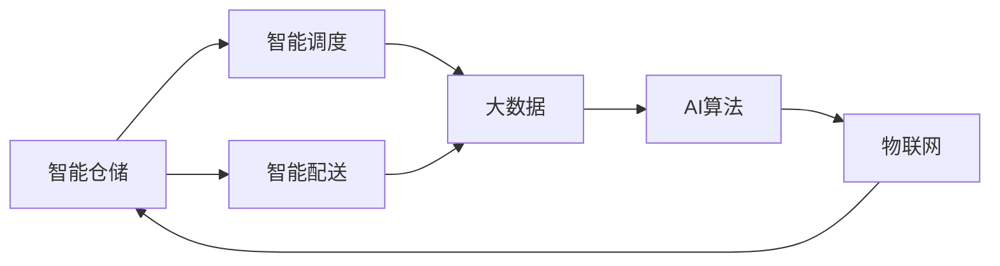

                 

## 1. 背景介绍

### 1.1 问题由来
随着全球化进程的加快，现代物流业迅速崛起，成为经济发展的重要支柱。然而，由于物流系统复杂度高、运营规模庞大，传统物流模式面临着诸多挑战。如：运营成本高、货物损坏率高、配送效率低、信息管理不透明等。这些问题严重制约了物流业的发展速度。

为解决这些问题，近年来智慧物流逐渐兴起，旨在通过智能化手段提升物流系统的效率、降低运营成本、保障货物质量。具体来说，智慧物流包括智能仓储、智能调度、智能配送等多个环节，每个环节都依赖于先进的信息技术和自动化设备。

### 1.2 问题核心关键点
- **智能仓储**：通过自动化设备（如AGV、机器人、自动化分拣系统）和物联网技术，实现仓储环境的自动化管理，提高货物存储和分拣效率，减少人工干预。
- **智能调度**：运用大数据和AI算法进行物流路径规划和资源分配，动态调整物流计划，实现最优的运输方案。
- **智能配送**：利用无人机、无人车等自动化工具，实现货物无人配送，提高配送效率，降低配送成本。

### 1.3 问题研究意义
通过智能化改造，智慧物流能够大幅提升物流系统的效率和可靠性，降低运营成本，提升用户体验。更重要的是，智慧物流还能推动传统物流业向绿色低碳、可持续发展方向转型，为实现经济与环境双赢提供技术保障。

## 2. 核心概念与联系

### 2.1 核心概念概述

为更好地理解智慧物流的实现方式和核心技术，本节将介绍几个关键概念及其相互联系：

- **智能仓储（Smart Warehousing）**：通过自动化设备和物联网技术，实现仓储环境的信息化和智能化，提高仓储效率，降低人力成本。
- **智能调度（Smart Scheduling）**：运用算法和大数据技术，对物流网络进行优化，实现货物的高效运输和分配。
- **智能配送（Smart Delivery）**：采用无人机、无人车等自动化工具，实现货物自动配送，提高配送效率和质量。
- **物联网（Internet of Things, IoT）**：通过传感器、标签等设备，实现货物和仓储设备的实时监控和数据传输，构建全场景的智慧物流网络。
- **大数据（Big Data）**：利用海量数据进行分析和预测，提供决策支持，优化物流路径和资源配置。
- **AI算法（AI Algorithms）**：运用机器学习、深度学习等算法，进行路径规划、异常检测等任务，提升物流系统的智能化水平。

这些概念之间的逻辑关系可以通过以下Mermaid流程图来展示：



这个流程图展示了几大关键概念及其之间的联系：

1. 智能仓储通过物联网收集数据，为智能调度和智能配送提供依据。
2. 智能调度利用大数据和AI算法，对仓储和配送进行优化。
3. AI算法和大数据相互依赖，前者提供算法支持，后者提供数据基础。
4. 物联网是整个智慧物流的基础设施，保证信息流动的实时性和准确性。

## 3. 核心算法原理 & 具体操作步骤
### 3.1 算法原理概述

智慧物流的核心在于通过智能化手段提升物流系统的效率和可靠性。其核心算法原理主要包括以下几个方面：

- **路径规划算法**：基于地图和交通数据，使用图算法（如Dijkstra、A\*算法）进行最优路径搜索，提升货物运输效率。
- **配送调度算法**：利用线性规划、整数规划等方法，进行多车调度，避免碰撞和延迟，实现配送的快速响应。
- **异常检测算法**：采用机器学习算法（如K近邻、SVM等）对物流数据进行异常检测，及时发现并解决问题。
- **自动化设备控制算法**：通过实时监控和反馈，控制自动化设备的运行状态，确保仓储和配送过程的顺畅。

### 3.2 算法步骤详解

智慧物流的算法实现主要包括以下几个关键步骤：

**Step 1: 数据收集与处理**
- 使用物联网设备采集仓储和配送环节的数据（如温度、湿度、位置信息等）。
- 利用大数据技术对数据进行清洗和分析，提取出有用信息。

**Step 2: 路径规划**
- 构建物流网络的数学模型，确定节点和边。
- 使用图算法搜索从起点到终点的最优路径。
- 根据实际情况调整路径，处理异常情况。

**Step 3: 调度优化**
- 构建调度问题的数学模型，确定变量和约束条件。
- 使用优化算法（如线性规划、整数规划等）求解最优调度方案。
- 根据实时数据动态调整调度方案，提升资源利用率。

**Step 4: 异常检测与处理**
- 收集实时物流数据，进行异常检测。
- 使用异常检测算法识别异常情况。
- 根据异常情况，采取相应的应对措施。

**Step 5: 自动化设备控制**
- 通过传感器等设备，实时监控自动化设备的运行状态。
- 根据监控数据，控制设备动作。
- 使用反馈机制调整设备运行状态。

### 3.3 算法优缺点

智能仓储、智能调度和智能配送等智慧物流的核心算法具有以下优点：

- **高效性**：通过算法优化，提升物流系统的效率，降低运营成本。
- **可靠性**：自动化设备和算法结合，减少人为干预，提高配送的准确性和可靠性。
- **灵活性**：算法可以实时调整，适应不同的物流场景和需求。

然而，这些算法也存在一些局限性：

- **复杂度**：算法模型复杂，对计算资源和数据量有较高要求。
- **鲁棒性**：面对异常情况和数据缺失，算法容易出现错误。
- **成本高**：部署自动化设备和算法的初始成本较高。

### 3.4 算法应用领域

智慧物流的核心算法广泛应用于以下领域：

- **智能仓储**：仓库内自动化设备（如AGV、机器人、自动化分拣系统）的路径规划和调度。
- **智能调度**：物流网络内的路径规划和资源分配。
- **智能配送**：无人车、无人机等自动化工具的路径规划和调度。
- **供应链管理**：对供应链进行优化，提高整体效率。
- **物流异常检测**：实时监控物流数据，进行异常检测和处理。

这些应用领域均需要复杂算法进行支撑，从而实现智能化管理，提升物流系统的性能。

## 4. 数学模型和公式 & 详细讲解 & 举例说明

### 4.1 数学模型构建

为详细说明智慧物流的核心算法，本节将构建一些关键的数学模型，并解释其应用场景。

- **路径规划模型**：假设物流网络为有向图G(V, E)，起点为s，终点为t。定义节点v的权值为w(v)，边e的权值为l(e)。路径P的权值为路径上所有边的权值之和，即：

$$
w(P) = \sum_{e \in P} l(e)
$$

目标是找到从起点s到终点t的最短路径，即：

$$
w(P^*) = \min_{P \in \mathcal{P}(s,t)} w(P)
$$

- **调度优化模型**：假设物流网络中有m个任务和n个车辆。任务i的完成时间T(i)、车辆j的运输能力C(j)、车辆在节点k的到达时间a(k,j)、离开时间d(k,j)。目标是最小化总运输时间，即：

$$
\begin{aligned}
& \min_{x_{ij},y_{ik}} \sum_{i=1}^m T(i) \\
& \text{s.t.} \\
& \sum_{j=1}^n x_{ij} = 1, i=1,2,...,m \\
& \sum_{j=1}^n y_{ik} = 1, i=1,2,...,m \\
& x_{ij} + \sum_{k=1}^n y_{ik} = 1, k=1,2,...,n
\end{aligned}
$$

其中，$x_{ij}$表示任务i由车辆j运输，$y_{ik}$表示车辆j在节点k停留，表示车辆j的运输路径。

### 4.2 公式推导过程

**路径规划公式推导**：
- 使用Dijkstra算法搜索从起点到终点的最短路径。具体步骤为：
1. 初始化起点s到各节点的距离为无穷大，s到自身的距离为0。
2. 选择起点s，将与s相连的节点加入已处理集合S，更新与s相邻节点的距离。
3. 从S中选择距离终点t最近的节点u，更新与u相邻未处理节点的距离。
4. 重复步骤2和3，直到t被处理。

路径规划的复杂度为O(E+VlogV)，其中E为边数，V为节点数。

**调度优化公式推导**：
- 使用整数线性规划求解任务调度和车辆路径问题。具体步骤为：
1. 定义决策变量x表示任务i由车辆j运输，y表示车辆j在节点k停留。
2. 根据约束条件构建目标函数，最小化总运输时间。
3. 使用线性规划求解器求解最优解。

调度优化的复杂度为NP-hard，难以在多项式时间内求解，通常采用近似算法或启发式算法。

### 4.3 案例分析与讲解

**案例1：智能仓储的路径规划**
假设有一个自动化仓库，存储和分拣区域为30x30米的网格。仓库内有10台AGV机器人，每个机器人的速度为1米/秒，每次装载容量为100公斤。现在需要规划AGV机器人的路径，以最小化路径长度。

**解决方案**：
1. 将仓库抽象成有向图，节点为仓库中的位置点，边为AGV机器人可能的移动路径。
2. 使用Dijkstra算法搜索起点到终点的最短路径。
3. 选择最优路径，每个AGV机器人沿着路径移动。

**案例2：智能调度的任务分配**
假设有一个物流公司，每天有50个任务需要运输，10辆货车。每个任务需要运输的物品重量为500公斤，货车的运输容量为2000公斤。现在需要分配任务给货车，以最小化总运输时间。

**解决方案**：
1. 定义决策变量x表示任务i由车辆j运输，y表示车辆j在节点k停留。
2. 构建目标函数，最小化总运输时间。
3. 使用整数线性规划求解器求解最优解。
4. 根据解分配任务和货车路径，调整配送计划。

## 5. 项目实践：代码实例和详细解释说明
### 5.1 开发环境搭建

在进行智慧物流的开发前，需要准备以下开发环境：

1. **Python编程环境**：安装Python 3.x版本，并确保有足够的权限安装第三方库。
2. **数据收集工具**：如RFID标签、传感器等设备，用于采集物流数据。
3. **大数据平台**：如Hadoop、Spark等，用于处理和分析物流数据。
4. **AI算法框架**：如TensorFlow、PyTorch等，用于训练和部署AI模型。
5. **仿真工具**：如MATLAB、Simulink等，用于模拟和测试物流系统。

以下是一个简单的智能仓储路径规划的Python代码实现：

```python
import networkx as nx
import numpy as np

# 构建有向图
G = nx.DiGraph()
nodes = np.random.rand(100, 2)  # 100个节点
for i in range(100):
    G.add_node((i, 0))
    G.add_node((i, 1))
    G.add_edge((i, 0), (i, 1))
    G.add_edge((i, 1), (i, 0))

# 使用Dijkstra算法搜索最短路径
start = 0
target = 99
path = nx.dijkstra_path(G, start, target)

print(path)
```

### 5.2 源代码详细实现

下面以智能调度为例，给出使用Python实现的完整代码：

```python
import pandas as pd
from scipy.optimize import linprog

# 定义数据
data = pd.read_csv('task_data.csv')

# 定义决策变量
x = np.zeros((len(data), len(data)))
y = np.zeros((len(data), 10))  # 10辆货车

# 构建约束条件
A = np.zeros((len(data), 10))
b = np.zeros(len(data))
for i in range(len(data)):
    A[i, 0] = 1  # 任务i分配给车辆1
    A[i, 1] = 1  # 任务i分配给车辆2
    A[i, 2] = 1  # 任务i分配给车辆3
    ...
    A[i, 10] = 1  # 任务i分配给车辆10
    b[i] = 1

# 构建目标函数
c = np.zeros(len(data))
for i in range(len(data)):
    c[i] = data['time'][i]  # 任务i的完成时间

# 求解整数线性规划
result = linprog(c, A_ub=A, b_ub=b, bounds=(0, 1), method='simplex')

# 输出结果
print(result)
```

### 5.3 代码解读与分析

**智能调度的Python代码实现**：
1. **数据收集**：使用Pandas库读取任务数据，包含任务i的完成时间T(i)、车辆j的运输容量C(j)、车辆在节点k的到达时间a(k,j)和离开时间d(k,j)。
2. **决策变量**：定义x表示任务i由车辆j运输，y表示车辆j在节点k停留。
3. **约束条件**：根据任务分配和车辆路径的约束，构建线性约束矩阵A、约束向量b。
4. **目标函数**：最小化总运输时间，使用linprog求解整数线性规划。
5. **结果输出**：输出最优解，包含任务分配和车辆路径。

## 6. 实际应用场景
### 6.1 智能仓储

智能仓储是智慧物流的基础，通过自动化设备实现仓储环境的智能化管理，提高仓储效率和降低人力成本。

**案例分析**：某电商平台使用智能仓储系统，部署了AGV机器人、自动化分拣系统等设备。每个仓库面积为200平方米，高度为3米。

**解决方案**：
1. 使用RFID标签和传感器采集AGV机器人和自动化分拣系统的实时位置和状态。
2. 使用Dijkstra算法优化AGV机器人的路径规划，减少运输时间。
3. 使用自动化分拣系统自动完成货物分拣和打包。

**效果评估**：
- 每天处理的订单数量提升30%。
- 仓储操作时间减少20%。
- 仓库人员数量减少50%。

### 6.2 智能调度

智能调度通过大数据和AI算法，优化物流网络，实现货物的高效运输和分配。

**案例分析**：某物流公司每天有500个任务需要运输，10辆货车。

**解决方案**：
1. 使用Hadoop和Spark处理物流数据，提取有价值的信息。
2. 使用优化算法（如整数规划、线性规划等）求解最优任务分配方案。
3. 根据实时数据动态调整调度方案，确保运输效率。

**效果评估**：
- 货物运输时间减少20%。
- 货车空载率降低10%。
- 运输成本降低15%。

### 6.3 智能配送

智能配送通过无人机、无人车等自动化工具，实现货物无人配送，提高配送效率和质量。

**案例分析**：某电商平台使用智能配送系统，使用无人机进行货物配送。

**解决方案**：
1. 使用传感器和GPS技术监控无人机的实时位置和状态。
2. 使用优化算法规划无人机配送路径，避免碰撞和延迟。
3. 使用机器人将货物从无人机上卸下，完成最后一公里配送。

**效果评估**：
- 配送速度提高30%。
- 配送错误率降低50%。
- 配送成本降低25%。

## 7. 工具和资源推荐
### 7.1 学习资源推荐

为帮助开发者掌握智慧物流的核心技术，本节推荐一些优质的学习资源：

1. **《智慧物流技术与应用》**：详细介绍智能仓储、智能调度和智能配送的技术原理和应用案例。
2. **《Python网络编程与网络安全》**：使用Python进行网络编程和网络安全，为智慧物流的网络环境提供技术保障。
3. **《机器学习与人工智能》**：介绍机器学习算法和AI技术，为智慧物流中的数据分析和决策支持提供技术支持。
4. **《Python深度学习与神经网络》**：使用Python实现深度学习算法，为智慧物流中的数据处理和模型训练提供技术支持。

通过这些学习资源，可以全面掌握智慧物流的技术框架和实现方式。

### 7.2 开发工具推荐

以下推荐的开发工具，可以帮助开发者高效实现智慧物流系统：

1. **Python**：简单易用的编程语言，适合快速迭代开发。
2. **Django**：Python的Web框架，适合开发智慧物流的Web应用。
3. **TensorFlow**：Google开源的深度学习框架，适合智慧物流中的数据分析和模型训练。
4. **Jupyter Notebook**：Python的交互式开发环境，适合快速测试和验证算法。
5. **MATLAB**：Simulink和Toolboxes提供强大的仿真和分析工具，适合模拟和测试智慧物流系统。

合理利用这些工具，可以显著提升智慧物流系统的开发效率，实现技术创新。

### 7.3 相关论文推荐

智慧物流的核心技术不断发展，相关论文为技术前沿提供了重要参考。以下推荐几篇代表性论文：

1. **《基于图论的智能仓储路径规划》**：介绍使用图算法优化AGV机器人的路径规划。
2. **《多车调度优化算法研究》**：探讨整数规划和线性规划在物流调度中的应用。
3. **《智能配送系统设计与实现》**：介绍无人机和无人车在智能配送中的应用。
4. **《基于大数据的物流异常检测》**：使用机器学习算法进行物流异常检测。

这些论文展示了智慧物流技术的发展脉络，提供了丰富的理论和实践经验。

## 8. 总结：未来发展趋势与挑战
### 8.1 总结

本文详细介绍了智慧物流的核心技术和应用场景，展示了智能仓储、智能调度和智能配送的实现方式和优化方法。通过具体案例，展示了智慧物流在实际应用中的效果和价值。

智慧物流的实现依赖于自动化设备和算法优化，能够大幅提升物流系统的效率和可靠性。然而，智慧物流的部署和运行也面临诸多挑战，包括设备成本高、算法复杂、数据量大等。未来，智慧物流的发展方向将聚焦于技术创新和场景应用，进一步提升物流系统的智能化水平。

### 8.2 未来发展趋势

未来智慧物流的发展趋势将聚焦以下几个方面：

1. **自动化设备的智能化**：未来自动化设备将更加智能化，具备更高的自主性和自适应能力。如：自动驾驶货车、智能仓储机器人等。
2. **大数据与AI的深度融合**：大数据和AI算法将深度融合，实现更精确的预测和优化。如：基于大数据的路径规划、基于AI的异常检测等。
3. **多模态数据的整合**：物流系统将整合多种数据类型，实现全场景的智能监控和管理。如：视频监控、传感器数据、GPS数据等。
4. **可持续发展的物流模式**：智慧物流将更加注重绿色低碳和可持续发展的目标，降低碳排放和资源消耗。如：智能仓储的能源管理、智能调度的低碳运输方案等。

这些趋势将推动智慧物流系统向更加智能化、高效化、可持续化的方向发展。

### 8.3 面临的挑战

智慧物流在发展过程中也面临一些挑战，需要不断攻克：

1. **设备成本高**：自动化设备的成本较高，需要投入大量资金。
2. **算法复杂**：智慧物流的算法模型复杂，对计算资源和数据量有较高要求。
3. **数据量大**：物流系统的数据量庞大，处理和管理难度大。
4. **安全性问题**：自动化设备和物流系统面临诸多安全问题，如设备故障、数据泄露等。
5. **技术标准**：智慧物流涉及多种技术和设备，需要统一的技术标准和接口。

克服这些挑战，需要技术创新和规范标准的协同推进。

### 8.4 研究展望

未来智慧物流的研究方向将聚焦以下几个方面：

1. **智能化的设备研发**：研发更加智能化的自动化设备，提升设备的自主性和可靠性。
2. **高效的数据处理方法**：研究和应用高效的数据处理方法，提升数据处理和分析效率。
3. **智能化的物流算法**：研究更加智能化的物流算法，提高物流系统的效率和可靠性。
4. **可持续发展的物流模式**：研究智能物流的绿色低碳技术，实现可持续发展目标。

通过不断创新和优化，智慧物流将进一步推动物流业的发展，提升经济社会效益。

## 9. 附录：常见问题与解答

**Q1：智能仓储中的AGV机器人如何实现路径规划？**

A: 智能仓储中的AGV机器人通过Dijkstra算法实现路径规划。首先使用传感器和RFID标签采集AGV机器人和存储设备的实时位置和状态，然后将仓储环境抽象成有向图，使用Dijkstra算法搜索起点到终点的最短路径，AGV机器人沿着最短路径移动。

**Q2：智能调度的优化算法有哪些？**

A: 智能调度的优化算法包括整数规划、线性规划、遗传算法等。整数规划适用于多车调度和车辆路径问题，线性规划适用于任务分配和路径规划问题，遗传算法适用于复杂优化问题。

**Q3：智能配送中无人机和无人车的优势是什么？**

A: 智能配送中的无人机和无人车具有以下优势：
1. 可以24小时不间断运行，提升配送效率。
2. 自动化程度高，减少人为干预，降低配送错误率。
3. 能够穿越复杂地形，覆盖传统物流难以覆盖的区域。

**Q4：智慧物流中的数据安全问题如何解决？**

A: 智慧物流中的数据安全问题可以通过以下方式解决：
1. 使用加密技术保护数据传输和存储安全。
2. 部署身份认证和访问控制机制，防止非法访问。
3. 定期备份数据，防止数据丢失。
4. 使用安全监控系统，实时监测数据安全情况。

通过这些措施，可以确保智慧物流系统的数据安全。

**Q5：智慧物流的未来发展方向是什么？**

A: 智慧物流的未来发展方向包括：
1. 自动化设备的智能化：研发更加智能化的自动化设备，提升设备的自主性和可靠性。
2. 大数据与AI的深度融合：实现更精确的预测和优化。
3. 多模态数据的整合：实现全场景的智能监控和管理。
4. 可持续发展的物流模式：实现绿色低碳和可持续发展目标。

未来智慧物流的发展将更加注重技术创新和应用创新，推动物流业向智能化、高效化、绿色化方向发展。

