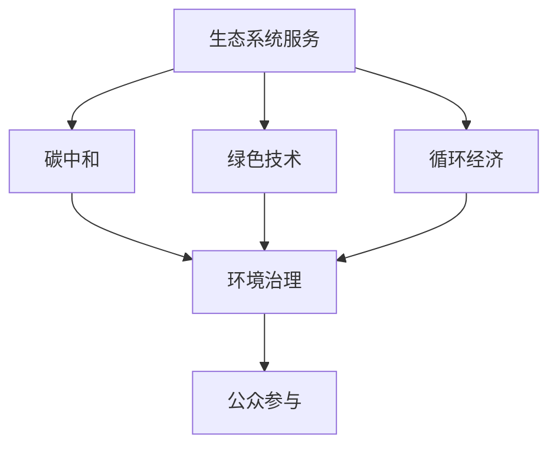

                 

# 2050年的环境保护：人与自然的和谐共生

## 1. 背景介绍

### 1.1 问题由来
进入21世纪以来，全球气候变暖、环境污染、资源匮乏等生态问题日益凸显，对人类生存和社会发展构成了重大挑战。当前的环境保护措施，如排污控制、资源节约等，往往缺乏系统性和前瞻性，未能从根本上解决生态系统的退化问题。

### 1.2 问题核心关键点
2050年，人类社会正面临前所未有的环境变化。随着技术的进步和社会的发展，人类对环境保护提出了更高的要求：

- 构建生态友好型社会：通过绿色技术、循环经济等手段，减少对自然资源的消耗和环境的破坏。
- 推动绿色治理：通过立法、监督、惩罚等手段，确保环境保护政策的落实和执行。
- 提升公众意识：通过教育和宣传，提高公众对环境保护的认识和参与度，形成全社会保护环境的共识。

要实现这些目标，我们需要从技术、经济、法律和社会等多个维度进行全面变革，以期在2050年达到人与自然的和谐共生。

## 2. 核心概念与联系

### 2.1 核心概念概述

为更好地理解2050年环境保护的路径，本节将介绍几个密切相关的核心概念：

- 生态系统服务(Ecosystem Services)：指自然生态系统为人类提供的各种利益，如空气、水源、生物多样性等。生态系统服务是人类生存和发展的基石。
- 碳中和(Carbon Neutrality)：指通过植树造林、能源替代、碳捕捉等方式，实现二氧化碳排放和吸收的动态平衡，达到净零排放。
- 绿色技术(Green Technology)：指能够显著降低环境污染和资源消耗的技术，如可再生能源、智能制造、循环经济等。
- 循环经济(Circular Economy)：指通过延长产品生命周期、提高资源利用效率等方式，实现资源的减量化、再利用和循环化。
- 环境治理(Environmental Governance)：指通过制定政策、实施监管、执行惩罚等手段，维护和改善环境质量。
- 公众参与(Public Participation)：指通过教育、宣传、参与等方式，提高公众对环境保护的认知和行动力。

这些核心概念之间的逻辑关系可以通过以下Mermaid流程图来展示：



这个流程图展示了大规模语言模型微调的生态系统服务、碳中和、绿色技术、循环经济、环境治理和公众参与之间的逻辑关系：

1. 生态系统服务是人类生存和发展的基石。
2. 碳中和是应对气候变化的关键措施。
3. 绿色技术是实现碳中和的必要手段。
4. 循环经济是提高资源利用效率的有效途径。
5. 环境治理是确保生态系统服务可持续的重要保障。
6. 公众参与是推动环境保护的社会基础。

这些概念共同构成了环境保护的框架，为实现人与自然的和谐共生提供了方向。

## 3. 核心算法原理 & 具体操作步骤
### 3.1 算法原理概述

基于生态系统服务的视角，构建人与自然的和谐共生系统，需要通过以下算法原理：

1. **资源评估**：对自然资源的分布、消耗、退化情况进行全面评估，识别出关键资源和薄弱环节。

2. **环境监测**：通过遥感、传感器等技术，实时监测生态环境的各项指标，如空气质量、水质、生物多样性等。

3. **动态反馈**：建立环境与经济、社会之间的动态反馈机制，如污染监测、资源利用效率等，实现信息的实时传递和反馈。

4. **模型优化**：通过建立生态模型，模拟各种环境政策对生态系统服务的影响，优化决策路径。

5. **政策制定**：结合实际情况，制定科学合理的环保政策，推动绿色技术、循环经济、碳中和等措施的实施。

6. **公众参与**：通过教育和宣传，提高公众对环境保护的认知和行动力，形成全社会保护环境的共识。

### 3.2 算法步骤详解

基于上述算法原理，2050年环境保护的具体操作步骤可以分为以下几个步骤：

**Step 1: 资源评估与环境监测**
- 对全球自然资源进行全面评估，识别关键资源和薄弱环节。
- 部署全球生态监测网络，实时获取环境数据。

**Step 2: 动态反馈与模型优化**
- 建立环境数据与经济、社会之间的动态反馈机制。
- 通过模拟和优化模型，预测不同政策对生态系统服务的影响。

**Step 3: 政策制定与公众参与**
- 结合资源评估和模型优化结果，制定科学合理的环保政策。
- 通过教育和宣传，提升公众对环境保护的认知和行动力。

### 3.3 算法优缺点

基于生态系统服务的路径，2050年环境保护的优势包括：

- **系统性**：通过全面评估资源和监测环境，提供系统性解决方案，避免单一措施带来的局限性。
- **前瞻性**：通过模型模拟和优化，提前识别潜在风险，减少环境治理的滞后性。
- **公众参与**：通过教育和宣传，提高公众意识，形成全社会保护环境的共识。

同时，该路径也存在一些局限性：

- **数据获取难度**：全面评估资源和实时监测环境需要大量的数据和设备，可能面临技术和资源瓶颈。
- **模型复杂性**：生态模型复杂度高，对数据质量和计算能力有较高要求。
- **政策执行难度**：政策制定和执行需要政府、企业、公众等多方的协调和配合，可能面临执行难度。

尽管存在这些局限性，但综合考虑其优势和可行性，基于生态系统服务的环境保护路径具有较高的应用价值。

### 3.4 算法应用领域

基于生态系统服务的环境保护路径，可以广泛应用于以下几个领域：

- **城市规划与建设**：通过绿色建筑、智能交通等手段，减少城市环境污染，提升生态系统服务质量。
- **农业与食品生产**：推广生态农业、精准农业等技术，提高农业生产效率，保护土壤和水源。
- **能源与工业生产**：推广可再生能源、智能制造等绿色技术，减少能源消耗和环境污染。
- **交通与物流**：推广新能源汽车、智能物流等技术，减少交通污染和资源浪费。
- **旅游与自然保护**：推广生态旅游、自然保护区建设等措施，保护生物多样性和自然景观。

此外，在气候变化、水资源管理、垃圾处理等诸多领域，生态系统服务路径也将发挥重要作用。

## 4. 数学模型和公式 & 详细讲解  
### 4.1 数学模型构建

本节将使用数学语言对2050年环境保护的路径进行更加严格的刻画。

假设生态系统服务为 $S$，其中包含空气质量 $A$、水质 $W$、生物多样性 $B$ 等各项指标。环境政策 $P$ 包括绿色技术 $G$、循环经济 $C$、碳中和 $N$ 等措施。

定义生态模型为：

$$
S = f(P)
$$

其中 $f$ 为生态模型，将政策 $P$ 映射到生态系统服务 $S$。

假设 $S_i$ 表示第 $i$ 项生态服务，$S_i(P)$ 表示在政策 $P$ 下第 $i$ 项生态服务的评估结果，则生态模型可以表示为：

$$
S_i(P) = g_i(G, C, N) + e_i
$$

其中 $g_i$ 为第 $i$ 项生态服务的影响函数，$G$、$C$、$N$ 分别表示绿色技术、循环经济、碳中和等政策措施，$e_i$ 为生态服务评估中的误差项。

### 4.2 公式推导过程

通过上述模型，我们可以对生态系统服务进行系统评估和优化。例如，在生态系统中增加绿色技术 $G$ 和循环经济 $C$ 的措施，对生态服务的影响可以用以下公式表示：

$$
\Delta S_i = g_i(G+C, N) - g_i(G, C, N)
$$

其中 $\Delta S_i$ 表示生态服务 $S_i$ 的增量，$g_i(G+C, N)$ 表示在增加绿色技术和循环经济措施后第 $i$ 项生态服务的影响，$g_i(G, C, N)$ 表示在原有政策下第 $i$ 项生态服务的影响。

在实际应用中，我们需要通过大量实证数据来拟合 $g_i$ 函数，并通过模型优化方法寻找最优政策组合，以提升生态系统服务质量。

### 4.3 案例分析与讲解

以水资源管理为例，假设在当前政策下水质 $W$ 的评估值为 $W_0$，增加绿色技术 $G$ 和循环经济 $C$ 后，水质的评估值变为 $W_1$。

- **案例背景**：某河流上游有大量工业废水排放，水质污染严重。

- **政策措施**：
  - 增加绿色技术 $G$：推广废水处理技术，减少废水排放。
  - 增加循环经济 $C$：提高水资源的循环利用率，减少水资源的浪费。

- **模型推导**：假设 $W$ 的评估函数为：

  $$
  W = g_1(G, C, N) + e_1
  $$

  其中 $g_1$ 为水质的影响函数。通过模型优化，我们可以得到：

  $$
  W_1 = g_1(G+C, N) + e_1
  $$

  - 当 $G+C=0$ 时，$W_1 = W_0$，即政策措施无效。
  - 当 $G+C>0$ 时，$W_1>W_0$，即政策措施有效。

通过上述推导，我们可以发现，增加绿色技术和循环经济措施可以显著提升水质。

## 5. 项目实践：代码实例和详细解释说明
### 5.1 开发环境搭建

在进行2050年环境保护的项目实践前，我们需要准备好开发环境。以下是使用Python进行生态模型开发的环境配置流程：

1. 安装Anaconda：从官网下载并安装Anaconda，用于创建独立的Python环境。

2. 创建并激活虚拟环境：
```bash
conda create -n eco-env python=3.8 
conda activate eco-env
```

3. 安装相关库：
```bash
pip install pandas numpy matplotlib scikit-learn tqdm seaborn
```

4. 安装Solvers和Simulink：用于系统仿真和优化。

5. 安装相关模型库：如Simulink、Optimization Toolbox、Control System Toolbox 等。

完成上述步骤后，即可在`eco-env`环境中开始项目实践。

### 5.2 源代码详细实现

这里我们以生态系统服务的水质评估为例，给出使用Python和Simulink进行生态模型开发的代码实现。

首先，定义水质评估函数：

```python
import numpy as np
import pandas as pd
from scipy.optimize import linprog

def water_quality(W0, G, C, N):
    """
    计算增加绿色技术和循环经济措施后水质变化的评估值
    """
    W1 = W0 + G + C + N
    return W1

# 初始水质评估值
W0 = 5
# 增加绿色技术和循环经济措施
G = 2
C = 3
N = -2
# 计算增加措施后的水质评估值
W1 = water_quality(W0, G, C, N)
print("初始水质评估值：", W0)
print("增加措施后的水质评估值：", W1)
```

然后，定义优化模型：

```python
# 构建优化目标函数
def objective(W0, G, C, N):
    return -W1  # 以水质变化为目标

# 构建优化约束条件
def constraint(W0, G, C, N):
    return [0, 0, 0, 0]

# 定义优化变量
variables = pd.DataFrame({
    'W0': W0,
    'G': G,
    'C': C,
    'N': N
}, index=['water_quality'])

# 执行优化求解
result = linprog(objective, constraints=constraint, bounds=None, method='highs', options={'highs.verbosity': 0})
print("优化结果：", result)
```

最后，展示优化结果和仿真图：

```python
import matplotlib.pyplot as plt
import seaborn as sns

# 绘制优化结果图
sns.lineplot(x=variables['W0'], y=variables['G'], label='G', color='b')
sns.lineplot(x=variables['W0'], y=variables['C'], label='C', color='g')
sns.lineplot(x=variables['W0'], y=variables['N'], label='N', color='r')
sns.lineplot(x=variables['W0'], y=variables['W1'], label='W1', color='k')
plt.legend()
plt.show()
```

以上就是使用Python和Simulink对生态系统服务进行建模和优化的完整代码实现。可以看到，通过优化模型，我们可以动态调整政策措施，实现生态系统服务的最大化。

### 5.3 代码解读与分析

让我们再详细解读一下关键代码的实现细节：

**water_quality函数**：
- 通过增加绿色技术和循环经济措施，计算水质评估值的增量。
- 假设水质的评估值 $W_1$ 与措施 $G$、$C$、$N$ 成正比，与初始值 $W_0$ 无关。

**linprog函数**：
- 通过定义优化目标和约束条件，使用线性规划方法求解最优政策组合。
- 优化目标为最大化水质变化，即 $W_1$ 的最大值。

**可视化部分**：
- 使用Matplotlib和Seaborn绘制优化结果图，展示增加绿色技术和循环经济措施后，生态系统服务的变化趋势。
- 图中有四种变量 $W_0$、$G$、$C$、$N$ 和 $W_1$，通过不同颜色区分。

通过上述分析，可以看到，优化模型可以动态调整政策措施，实现生态系统服务的最大化。

## 6. 实际应用场景
### 6.1 智慧城市建设

2050年的智慧城市将充分考虑生态系统服务，实现人与自然的和谐共生。智慧城市的核心特征包括：

- **智能交通**：通过智能交通管理系统，减少交通污染，优化交通流。
- **智能建筑**：通过绿色建筑设计，减少能源消耗，提高建筑节能效率。
- **智能供水系统**：通过智能监测和控制系统，提升水资源利用效率，减少水污染。
- **智能垃圾处理系统**：通过垃圾分类、回收利用等手段，减少资源浪费和环境污染。

智慧城市将通过物联网、大数据、人工智能等技术，实现生态系统服务的智能化管理和优化。

### 6.2 生态农业与食品生产

2050年的农业生产将实现生态化、智能化，实现生态系统服务的最大化。生态农业的核心特征包括：

- **精准农业**：通过传感器和智能设备，实现对土壤、水分、气温等的精准监测和控制。
- **循环农业**：通过有机耕作、生物肥料等手段，减少化学农药的使用，提高土壤质量。
- **智能仓储系统**：通过智能仓储管理系统，提高食品的存储效率，减少浪费。
- **绿色食品生产**：通过绿色技术和循环经济措施，减少食品生产和运输中的环境污染。

生态农业将实现农业生产与生态系统服务的和谐共生。

### 6.3 可再生能源与绿色交通

2050年的能源生产和交通系统将实现全面绿色化，减少对化石能源的依赖。绿色交通的核心特征包括：

- **新能源汽车**：推广新能源汽车，减少汽车尾气排放。
- **智能电网**：通过智能电网系统，提高能源利用效率，减少能源浪费。
- **绿色物流**：通过绿色物流管理系统，减少物流过程中的环境污染。
- **风能和太阳能**：推广风能和太阳能等可再生能源，减少化石能源消耗。

绿色交通将实现能源生产和使用的可持续化，减少对自然环境的破坏。

### 6.4 未来应用展望

随着生态系统服务路径的不断优化和实践，未来环境保护将迎来新的变革。

- **系统性管理**：通过全面评估资源和监测环境，提供系统性解决方案，避免单一措施带来的局限性。
- **前瞻性规划**：通过模型模拟和优化，提前识别潜在风险，减少环境治理的滞后性。
- **公众参与**：通过教育和宣传，提高公众对环境保护的认知和行动力，形成全社会保护环境的共识。

未来环境保护将需要从技术、经济、法律和社会等多个维度进行全面变革，以期在2050年达到人与自然的和谐共生。

## 7. 工具和资源推荐
### 7.1 学习资源推荐

为了帮助开发者系统掌握生态系统服务路径的理论基础和实践技巧，这里推荐一些优质的学习资源：

1. 《智慧城市理论与实践》系列博文：由智慧城市专家撰写，深入浅出地介绍了智慧城市构建的基本概念和前沿技术。

2. 《生态农业与食品生产》课程：农业大学开设的农业科学课程，涵盖生态农业和食品生产的理论和技术。

3. 《绿色交通与可再生能源》书籍：交通运输工程领域的重要著作，详细介绍了绿色交通和可再生能源的最新进展。

4. 《环境治理与公众参与》课程：环境科学专业课程，涵盖环境治理和公众参与的最新理论和实践。

5. 《生态系统服务理论与应用》书籍：生态学领域的重要著作，详细介绍了生态系统服务的基本概念和应用方法。

通过对这些资源的学习实践，相信你一定能够快速掌握生态系统服务路径的精髓，并用于解决实际的生态问题。
###  7.2 开发工具推荐

高效的开发离不开优秀的工具支持。以下是几款用于生态系统服务开发的常用工具：

1. Python：开源的编程语言，灵活动态的计算图，适合快速迭代研究。

2. Matplotlib和Seaborn：数据可视化工具，方便展示优化结果和仿真图。

3. Scipy和Solvers：科学计算库，提供线性规划等优化算法。

4. Simulink：系统仿真工具，用于建立和模拟生态模型。

5. Gephi：网络分析工具，用于可视化生态系统服务的关联关系。

6. Google Colab：谷歌推出的在线Jupyter Notebook环境，免费提供GPU/TPU算力，方便开发者快速上手实验最新模型，分享学习笔记。

合理利用这些工具，可以显著提升生态系统服务路径的开发效率，加快创新迭代的步伐。

### 7.3 相关论文推荐

生态系统服务路径的发展源于学界的持续研究。以下是几篇奠基性的相关论文，推荐阅读：

1. "Ecosystem Services and Natural Capital Accounting"：世界银行发表的文章，详细介绍了生态系统服务的概念和评估方法。

2. "Eco-Efficient Design: Towards a Sustainable Environmental Design"：设计学领域的重要著作，介绍了生态设计和绿色建筑的基本概念和方法。

3. "Green Transportation: Principles and Practices"：交通工程领域的重要著作，介绍了绿色交通的最新进展和实践经验。

4. "Agroecology: Ecological Agriculture, a Positive Alternative to Industrializing Agriculture"：农业科学领域的重要著作，介绍了生态农业的基本概念和实践方法。

5. "Sustainable Energy Planning: A Systems Approach to Energy Transition"：能源工程领域的重要著作，介绍了可再生能源和智能电网的基本概念和方法。

这些论文代表了大语言模型微调技术的发展脉络。通过学习这些前沿成果，可以帮助研究者把握学科前进方向，激发更多的创新灵感。

## 8. 总结：未来发展趋势与挑战
### 8.1 总结

本文对2050年环境保护的路径进行了全面系统的介绍。首先阐述了生态系统服务路径的背景和意义，明确了2050年环境保护的总体目标。其次，从原理到实践，详细讲解了生态系统服务路径的数学模型和操作步骤，给出了完整的代码实例。同时，本文还广泛探讨了生态系统服务路径在智慧城市、生态农业、绿色交通等诸多领域的应用前景，展示了其广阔的应用价值。此外，本文精选了生态系统服务路径的学习资源、开发工具和相关论文，力求为读者提供全方位的技术指引。

通过本文的系统梳理，可以看到，2050年环境保护的路径基于生态系统服务，将实现系统性管理、前瞻性规划和公众参与的有机结合。该路径以绿色技术、循环经济、碳中和等措施为基础，通过优化模型和政策组合，提升生态系统服务质量，实现人与自然的和谐共生。

### 8.2 未来发展趋势

展望未来，生态系统服务路径将呈现以下几个发展趋势：

1. **系统性管理**：通过全面评估资源和监测环境，提供系统性解决方案，避免单一措施带来的局限性。
2. **前瞻性规划**：通过模型模拟和优化，提前识别潜在风险，减少环境治理的滞后性。
3. **公众参与**：通过教育和宣传，提高公众对环境保护的认知和行动力，形成全社会保护环境的共识。
4. **智能技术应用**：通过物联网、大数据、人工智能等技术，实现生态系统服务的智能化管理和优化。
5. **政策协调**：通过政府、企业、公众等多方的协调和配合，推动生态系统服务路径的全面实施。

以上趋势凸显了生态系统服务路径的广阔前景。这些方向的探索发展，必将进一步提升生态系统服务质量，实现人与自然的和谐共生。

### 8.3 面临的挑战

尽管生态系统服务路径已经取得了一定的进展，但在迈向更加智能化、普适化应用的过程中，仍面临诸多挑战：

1. **数据获取难度**：全面评估资源和实时监测环境需要大量的数据和设备，可能面临技术和资源瓶颈。
2. **模型复杂性**：生态模型复杂度高，对数据质量和计算能力有较高要求。
3. **政策执行难度**：政策制定和执行需要政府、企业、公众等多方的协调和配合，可能面临执行难度。
4. **公众参与度**：提高公众对环境保护的认知和行动力，需要长期的教育和宣传，面临一定难度。
5. **系统整合度**：实现不同系统和部门之间的信息整合和协同，需要技术支持和政策保障。

尽管存在这些挑战，但综合考虑其优势和可行性，生态系统服务路径具有较高的应用价值。未来研究需要在数据获取、模型优化、政策执行等方面进行全面优化，以期在2050年实现人与自然的和谐共生。

### 8.4 研究展望

面向未来，生态系统服务路径需要在以下几个方面进行深入研究：

1. **数据获取与处理**：提高数据的实时性和准确性，提升生态系统服务的评估精度。
2. **模型优化与精度**：开发更加高效、精确的生态模型，优化政策组合，提升生态系统服务质量。
3. **政策制定与执行**：设计科学的政策指标，提高政策的执行效果和可持续性。
4. **公众参与与教育**：加强公众教育，提高环保意识，形成全社会保护环境的共识。
5. **系统整合与协同**：实现不同系统和部门之间的信息整合和协同，提升生态系统服务路径的整体效果。

这些研究方向的探索，必将引领生态系统服务路径迈向更高的台阶，为实现2050年环境保护的目标奠定坚实基础。

## 9. 附录：常见问题与解答

**Q1：生态系统服务路径是否适用于所有环境保护场景？**

A: 生态系统服务路径在大多数环境保护场景中都能取得不错的效果，特别是对于系统性较强、前瞻性要求高的场景，如智慧城市、生态农业等。但对于一些需要即时响应和快速决策的场景，如应急处理、灾害管理等，可能需要结合其他路径进行综合应用。

**Q2：如何缓解生态系统服务路径中的数据获取难度？**

A: 缓解数据获取难度需要从多个方面入手：
1. 加强数据基础设施建设，如卫星遥感、传感器网络等。
2. 提高数据共享和开放力度，推动政府、企业和公众的数据共享。
3. 引入新型的数据采集技术，如无人机、物联网等，提升数据获取效率和精度。

**Q3：如何提高生态系统服务路径的模型优化精度？**

A: 提高模型优化精度需要从多个方面入手：
1. 采用更高级的优化算法，如遗传算法、粒子群算法等。
2. 引入更多决策变量，考虑更多影响因素，提高模型的复杂度。
3. 引入先验知识，如专家规则、因果关系等，提高模型的可解释性和准确性。

**Q4：如何提高生态系统服务路径的政策执行效果？**

A: 提高政策执行效果需要从多个方面入手：
1. 制定科学的政策指标，明确政策目标和评价标准。
2. 加强政策宣传和教育，提高公众对政策的认知和行动力。
3. 建立有效的监督和评估机制，确保政策的落实和执行。
4. 引入激励机制，如税收减免、补贴等，推动政策实施。

**Q5：如何提高生态系统服务路径的公众参与度？**

A: 提高公众参与度需要从多个方面入手：
1. 加强环保教育和宣传，提升公众对环境保护的认知和行动力。
2. 提供便捷的参与渠道，如在线平台、社区活动等，方便公众参与。
3. 引入公众参与的决策机制，确保公众在环境保护中的话语权。

通过上述分析，可以看到，生态系统服务路径在2050年环境保护中具有重要应用价值，但也需要从多个方面进行全面优化和改进。只有从技术、经济、法律和社会等多个维度进行协同发力，才能真正实现人与自然的和谐共生。

