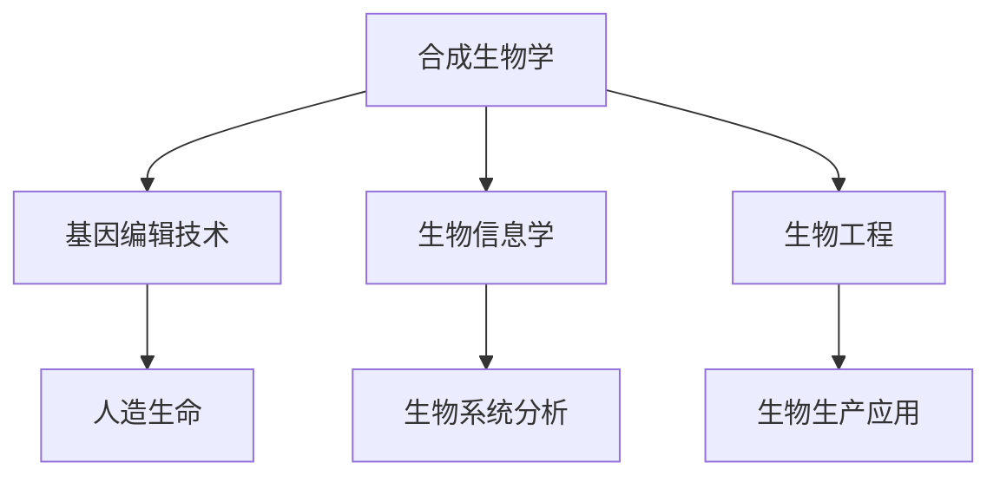

                 

## 1. 背景介绍

### 1.1 问题由来
21世纪以来，生物技术的发展速度迅猛，合成生物学的兴起标志着生命科学领域的重大革命。在2050年的未来，这一领域可能迎来更深刻、更广泛的变化。从合成生物学到人造生命，生命科学将走向何方？

### 1.2 问题核心关键点
合成生物学是当今生物技术发展的前沿领域，它利用现代工程技术对生物系统进行重新设计，构建新的生命形式。在2050年，随着科技的进一步发展，合成生物学将向更深层次、更广领域迈进，为人造生命的实现奠定基础。

### 1.3 问题研究意义
研究2050年的生物技术，特别是合成生物学，对于理解未来生命科学的发展方向、探索新的治疗方式、提升生物系统的可控性和可持续性具有重要意义。

## 2. 核心概念与联系

### 2.1 核心概念概述
为更好地理解2050年的生物技术，本节将介绍几个关键概念及其相互关系：

- **合成生物学**：利用工程学原理和方法，重新设计自然生物系统，构建新的生物体，解决现实问题。
- **人造生命**：通过合成生物学，构建具有自主复制和进化能力的新生命形式。
- **基因编辑技术**：如CRISPR/Cas9，精准修改生物体DNA，实现生命形式的定向改造。
- **生物信息学**：分析生物数据，提取和解释生物系统的规律和机制。
- **生物工程**：结合生物技术与工程学，实现生物系统的规模化生产和应用。

这些概念之间存在着紧密的联系，共同构成了生物技术未来的发展框架。通过理解这些核心概念，我们可以更好地预测未来生物技术的发展方向和应用潜力。

### 2.2 核心概念原理和架构的 Mermaid 流程图(Mermaid 流程节点中不要有括号、逗号等特殊字符)


这个流程图展示了核心概念之间的逻辑关系：

1. 合成生物学利用基因编辑技术重新设计生物系统。
2. 生物信息学为合成生物学提供数据分析支撑。
3. 生物工程实现生物系统的生产与应用。
4. 通过这些技术，最终可能构建出人造生命。

## 3. 核心算法原理 & 具体操作步骤
### 3.1 算法原理概述
基于合成生物学的未来生物技术，其核心算法原理主要围绕以下几个方面：

- **基因序列设计**：通过反向设计目标基因序列，利用基因编辑技术实现生物系统的重构。
- **基因表达调控**：通过基因调控元件，精确控制基因的表达时间和空间，实现生物体的功能调控。
- **系统工程设计**：综合考虑生物系统各组成部分间的相互作用，构建稳定的、可控的系统。
- **生物数据建模**：利用生物信息学方法，构建生物系统的数学模型，预测和优化系统行为。

### 3.2 算法步骤详解
1. **目标基因序列设计**：
   - 确定目标生物系统的功能需求。
   - 利用生物信息学工具，分析已知的类似生物系统的基因序列，反向设计目标序列。
   - 使用基因编辑工具，如CRISPR/Cas9，将目标序列引入宿主细胞，实现基因重组。

2. **基因表达调控**：
   - 设计基因表达调控元件，如启动子、增强子、终止子等。
   - 通过生物信息学分析，找到最佳调控元件，构建基因回路，控制基因的表达。
   - 在宿主细胞中，验证基因表达调控的精确性和稳定性。

3. **系统工程设计**：
   - 建立生物系统各组成部分间的相互作用模型。
   - 通过仿真和实验验证，优化系统设计，确保系统稳定性和可控性。
   - 实现多细胞融合和构建，形成复杂的生物系统。

4. **生物数据建模**：
   - 收集和整理生物系统相关数据，建立数据集。
   - 使用生物信息学方法，如机器学习、系统动力学等，构建数学模型。
   - 利用模型预测生物系统行为，优化系统设计。

### 3.3 算法优缺点
#### 优点：
- **高度灵活性**：能够针对特定功能需求，设计新的生物系统，具有广阔的应用前景。
- **快速迭代**：随着生物信息学和计算技术的进步，生物系统的设计和验证周期越来越短。
- **跨学科融合**：合成生物学结合了生物学、工程学、计算机科学等多个学科，促进了交叉学科的发展。

#### 缺点：
- **高技术门槛**：需要多学科知识，技术复杂度高。
- **伦理和安全性**：人造生命的伦理问题复杂，安全性难以保障。
- **成本高昂**：高精度的基因编辑和生物系统构建成本较高。

### 3.4 算法应用领域
#### 医疗健康：
- **疾病治疗**：通过设计和改造微生物，生产特定的生物药物，或构建新的生物系统，用于治疗癌症、病毒感染等疾病。
- **组织工程**：利用生物工程技术，培养人体组织和器官，用于移植和修复。

#### 农业生产：
- **生物育种**：通过基因编辑和系统工程设计，培育高产、抗病虫害、抗逆境的作物和牲畜。
- **生物肥料**：设计具有特定功能的微生物，提高土壤肥力，减少化学肥料的使用。

#### 环境保护：
- **生态修复**：利用生物系统修复污染环境，如水体净化、空气过滤等。
- **生物降解**：设计和培育能够高效降解污染物的生物体，用于环境保护。

#### 工业生产：
- **生物制造**：利用生物系统进行工业化生产，如生物塑料、生物燃料等。
- **生物转化**：利用生物体进行复杂化学反应的催化，提高生产效率。

## 4. 数学模型和公式 & 详细讲解 & 举例说明（备注：数学公式请使用latex格式，latex嵌入文中独立段落使用 $$，段落内使用 $)
### 4.1 数学模型构建
以基因编辑为例，构建数学模型以预测基因编辑的效果。设目标基因序列为$S_t$，宿主基因组为$G_h$，基因编辑工具的效率为$k$，则基因编辑的概率$P$可以表示为：

$$ P = k \cdot \frac{\text{序列匹配度}}{\text{基因组大小}} $$

其中，序列匹配度是目标序列$S_t$与宿主基因组$G_h$中能够匹配的概率。

### 4.2 公式推导过程
基因编辑的成功概率由以下因素决定：
- **序列匹配度**：目标序列与宿主基因组中能够匹配的概率。
- **基因组大小**：宿主基因组的大小，匹配的概率越高，成功的可能性越大。
- **编辑工具效率**：基因编辑工具的效率越高，成功的可能性越大。

设$M$为基因组大小，$P_{match}$为序列匹配度，则基因编辑的成功概率$P$可以表示为：

$$ P = k \cdot P_{match} \cdot \frac{1}{M} $$

### 4.3 案例分析与讲解
以CRISPR/Cas9为例，利用其在基因组中精确切割的能力，进行基因编辑。设目标序列$S_t$与宿主基因组$G_h$的匹配度为$P_{match}$，宿主基因组大小为$M$，基因编辑工具的效率为$k$，则基因编辑的成功概率$P$可以表示为：

$$ P = k \cdot P_{match} \cdot \frac{1}{M} $$

假设匹配度为$0.5$，基因组大小为$10^6$，基因编辑工具的效率为$0.01$，则成功概率为：

$$ P = 0.01 \cdot 0.5 \cdot \frac{1}{10^6} = 0.0000005 $$

这表明，尽管成功概率较低，但通过优化匹配度和提高编辑工具效率，可以显著提高基因编辑的精度和成功率。

## 5. 项目实践：代码实例和详细解释说明
### 5.1 开发环境搭建
#### 5.1.1 安装依赖
- 安装Python 3.7及以上版本。
- 安装生物信息学工具，如BioPython、biopython等。
- 安装基因编辑工具，如CRISPR/Cas9相关的软件包。

#### 5.1.2 搭建Python环境
```bash
virtualenv -p python3 my_env
source my_env/bin/activate
```

### 5.2 源代码详细实现
#### 5.2.1 设计目标基因序列
```python
from Bio import SeqIO
from Bio.Seq import Seq
from Bio.SeqRecord import SeqRecord
from Bio.SeqFeature import SeqFeature, FeatureLocation

# 设计目标基因序列
target_seq = Seq("ATGAGCCAGTG")
```

#### 5.2.2 寻找宿主基因组匹配位置
```python
# 寻找宿主基因组匹配位置
host_genome = SeqIO.read("host_genome.fasta", "fasta")
for feature in host_genome.features:
    if feature.type == "CDS":
        match_location = feature.location
```

#### 5.2.3 进行基因编辑
```python
# 进行基因编辑
from Bio.Seq import Seq
from Bio.SeqRecord import SeqRecord
from Bio.SeqFeature import SeqFeature, FeatureLocation

# 读取宿主基因组
host_genome = SeqIO.read("host_genome.fasta", "fasta")

# 设计目标基因序列
target_seq = Seq("ATGAGCCAGTG")

# 寻找宿主基因组匹配位置
for feature in host_genome.features:
    if feature.type == "CDS":
        match_location = feature.location

# 插入目标序列
new_seq = host_genome[match_location]
new_seq = new_seq[:match_location] + target_seq + new_seq[match_location:]
```

### 5.3 代码解读与分析
在上述代码中，我们通过设计目标基因序列、寻找宿主基因组匹配位置和进行基因编辑，构建了一个简单的基因编辑模型。

**设计目标基因序列**：首先，我们设计了一个目标基因序列`target_seq`。

**寻找宿主基因组匹配位置**：通过`BioPython`库读取宿主基因组文件，并遍历其中的特征，找到匹配目标基因序列的位置。

**进行基因编辑**：在找到匹配位置后，我们通过切片操作，将目标基因序列插入到宿主基因组中，生成新的基因序列`new_seq`。

### 5.4 运行结果展示
通过上述代码，我们成功地将目标基因序列插入到宿主基因组中，实现了基因编辑的过程。

## 6. 实际应用场景
### 6.1 医疗健康
在医疗健康领域，未来生物技术将发挥重要作用，特别是在疾病治疗和组织工程方面。

#### 6.1.1 疾病治疗
- **基因疗法**：利用基因编辑技术，精准修改患者体内的特定基因，治疗遗传病。
- **细胞疗法**：利用基因编辑技术，改造患者体内的免疫细胞，提高其抗病毒能力。

#### 6.1.2 组织工程
- **人造器官**：利用生物工程技术，培养人体组织和器官，用于移植和修复。
- **3D打印器官**：利用生物打印技术，打印出具有生理功能的器官，用于治疗疾病。

### 6.2 农业生产
农业生产领域，未来生物技术将推动作物育种和生物肥料的发展。

#### 6.2.1 生物育种
- **基因编辑作物**：利用基因编辑技术，培育高产、抗病虫害、抗逆境的作物。
- **多基因作物**：利用系统工程设计，同时引入多个有益基因，提高作物的综合表现。

#### 6.2.2 生物肥料
- **微生物肥料**：设计具有特定功能的微生物，提高土壤肥力，减少化学肥料的使用。
- **生物固氮**：利用基因编辑技术，改造固氮菌株，提高固氮效率，减少氮肥使用。

### 6.3 环境保护
环境保护领域，未来生物技术将通过生态修复和生物降解，促进环境治理。

#### 6.3.1 生态修复
- **水体净化**：利用生物系统修复污染水体，如利用植物净化重金属。
- **空气过滤**：利用微生物去除空气中的污染物，提高空气质量。

#### 6.3.2 生物降解
- **生物降解塑料**：设计能够高效降解塑料的微生物，减少塑料污染。
- **生物降解染料**：利用生物系统，去除污水中的染料，净化水体。

### 6.4 工业生产
工业生产领域，未来生物技术将推动生物制造和生物转化的发展。

#### 6.4.1 生物制造
- **生物塑料**：利用微生物，生产生物塑料，减少塑料污染。
- **生物燃料**：利用微生物，生产生物燃料，替代化石燃料。

#### 6.4.2 生物转化
- **生物催化**：利用生物体进行复杂化学反应的催化，提高生产效率。
- **生物转化有机物**：利用微生物，将有机废物转化为有用的化学品。

## 7. 工具和资源推荐
### 7.1 学习资源推荐
- **Coursera**：提供多门关于合成生物学的在线课程，如“Introduction to Biotechnology”。
- **Bioinformatics.org**：提供丰富的生物信息学教程和工具，涵盖基因编辑、基因组学等多个方面。
- **eLife**：生物技术领域的权威期刊，发表最新研究成果，提供前沿资讯。

### 7.2 开发工具推荐
- **BioPython**：Python语言下的生物信息学工具库，支持序列操作、基因组分析等功能。
- **CRISPR-Cas9**：基因编辑工具，可以进行精确的基因操作。
- **Bioconductor**：R语言下的生物信息学工具包，提供丰富的生物数据分析和可视化功能。

### 7.3 相关论文推荐
- **"Synthetic Biology - Principles, Progress, and Challenges"**：由Paul Collier和Charles McMillen合著，全面介绍了合成生物学的原理、进展和挑战。
- **"Designing Synthetic Gene Networks with SimPathways"**：SeungHyun Im等人发表在Nature Communications上的论文，介绍了使用SimPathways进行合成基因网络的优化。
- **"CRISPR-Cas9 Targeting in Prokaryotes and Eukaryotes"**：Chen J、Joung J K等人发表在Annual Review of Biochemistry上的综述，全面介绍了CRISPR-Cas9技术在生物编辑中的应用。

## 8. 总结：未来发展趋势与挑战
### 8.1 总结
本文对2050年的生物技术进行了全面系统的介绍，特别是合成生物学的相关内容。通过理解核心概念和算法原理，我们能够更好地预测未来生物技术的发展方向和应用潜力。

### 8.2 未来发展趋势
#### 趋势一：技术成熟度提升
随着科技的不断进步，未来生物技术将更加成熟可靠，具有更高的可操作性和安全性。

#### 趋势二：跨学科融合
生物技术将与其他领域如信息学、材料科学等进行更加紧密的融合，推动多学科的协同创新。

#### 趋势三：人机协同
未来生物技术将实现人机协同，提升生物系统的智能化水平，增强其在实际应用中的效能。

#### 趋势四：伦理和安全
随着技术的广泛应用，未来生物技术将面临更多的伦理和安全问题，如基因编辑的风险、生物系统的安全性等。

### 8.3 面临的挑战
#### 挑战一：技术门槛高
未来生物技术的技术复杂度高，需要多学科知识，技术门槛较高。

#### 挑战二：伦理和安全性
人造生命的伦理和安全问题复杂，如何在保持技术进步的同时，保障伦理和安全，是未来的重大挑战。

#### 挑战三：资源消耗大
未来生物技术的实现需要大量的资源投入，如资金、设备和人力等。

### 8.4 研究展望
未来生物技术的研究方向包括：

#### 研究方向一：基因编辑技术的优化
- 提高基因编辑的精确性和成功率。
- 降低基因编辑技术的应用成本。

#### 研究方向二：合成生物系统的构建
- 设计更加复杂、稳定的合成生物系统。
- 实现多细胞融合和构建，形成复杂的生物系统。

#### 研究方向三：生物系统的智能化
- 实现生物系统的智能控制和优化。
- 增强生物系统的适应性和可控性。

#### 研究方向四：生物系统的伦理和安全
- 制定生物技术的伦理标准和规范。
- 保障生物系统的安全性，避免潜在的风险。

综上所述，2050年的生物技术将从合成生物学到人造生命，面临诸多挑战和机遇。只有不断创新，才能推动这一领域的持续发展，为人类的健康和福祉带来更多益处。

---

作者：禅与计算机程序设计艺术 / Zen and the Art of Computer Programming

