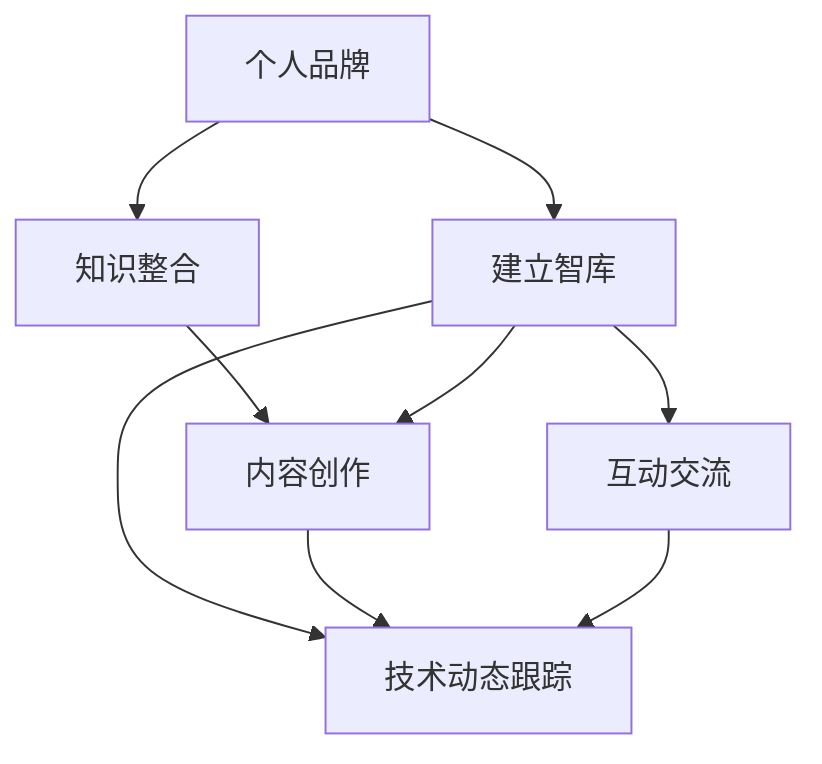

                 

# 建立个人品牌智库：汇聚行业顶尖人才

在当今数字化时代，建立个人品牌智库已经成为连接行业顶尖人才、推动技术交流与合作的重要途径。个人品牌智库不仅仅是个人知识和经验的积累，更是智慧与洞察力的共享平台，为从业者提供深入了解行业动态和技术趋势的窗口。本文旨在深入探讨如何构建和维护一个高质量的个人品牌智库，帮助从业人员拓展视野，提升个人品牌价值。

## 1. 背景介绍

### 1.1 问题由来

在快速发展的IT行业中，知识更新迭代频繁，技术日新月异。对于从业人员来说，仅仅依靠传统的学习和实践，难以全面掌握行业最新动态。同时，行业顶尖人才的交流合作也是推动技术进步的重要力量。因此，建立个人品牌智库变得尤为重要，它能汇集行业顶尖人才的智慧，共享最新的研究成果和技术实践，为个人品牌的发展注入动力。

### 1.2 问题核心关键点

一个成功的个人品牌智库应具备以下几个核心关键点：

- **广泛性**：涵盖行业内各个领域，包括技术前沿、应用实践、工具资源等。
- **权威性**：收录业内顶尖专家的见解和观点，确保信息的准确性和权威性。
- **实时性**：定期更新内容，保持与行业发展同步。
- **可操作性**：提供具体的实践指南、代码示例等可操作内容，帮助读者学以致用。
- **互动性**：提供讨论区、论坛等互动平台，促进交流与合作。

### 1.3 问题研究意义

建立个人品牌智库对于从业人员来说具有重要意义：

1. **知识整合与共享**：帮助从业人员将碎片化的知识整合为系统的体系，提升知识获取效率。
2. **技术交流与合作**：促进行业内专家之间的互动，推动技术交流与合作。
3. **个人品牌提升**：通过分享自己的知识和技术，提升个人在行业内的知名度和影响力。
4. **职业发展加速**：借助智库资源，快速掌握行业最新动态，加速职业发展。
5. **创新思维启发**：通过接触不同领域的知识和观点，激发创新思维，拓展职业边界。

## 2. 核心概念与联系

### 2.1 核心概念概述

- **个人品牌**：指一个人在特定行业或领域内的知名度、专业性和影响力。
- **智库**：指收集、整理、分析和共享行业知识与信息的平台。
- **行业顶尖人才**：指在某一领域内有卓越成就和广泛影响力的专家。
- **技术动态**：指行业内最新的技术趋势、创新实践和应用案例。
- **互动交流**：指通过讨论区、论坛等平台，促进行业专家之间的交流与合作。

通过这些概念，我们可以构建一个清晰的框架，理解个人品牌智库的本质和功能。

### 2.2 核心概念原理和架构的 Mermaid 流程图



### 2.3 核心概念之间的联系

个人品牌智库的构建是一个动态过程，涉及知识整合、内容创作、技术动态跟踪和互动交流等多个环节。具体而言：

- **知识整合**：将散落在各处的知识进行系统化整理，构建知识体系。
- **内容创作**：通过撰写文章、分享案例等形式，创作高质量的内容，为智库注入活力。
- **技术动态跟踪**：实时关注行业内最新的技术趋势和应用案例，保持智库内容的更新。
- **互动交流**：通过讨论区、论坛等平台，促进行业专家之间的交流与合作，形成良性互动。

## 3. 核心算法原理 & 具体操作步骤

### 3.1 算法原理概述

个人品牌智库的构建基于以下算法原理：

- **知识图谱构建**：使用图谱化技术将知识进行系统化整理，构建知识网络。
- **内容推荐算法**：基于用户行为和兴趣，推荐相关内容，提升内容发现效率。
- **互动分析算法**：分析用户互动行为，优化互动平台的设计，提高用户参与度。

### 3.2 算法步骤详解

#### 3.2.1 知识图谱构建

1. **数据收集**：从各类技术博客、论文、开源项目、行业报告等渠道收集知识。
2. **数据清洗**：去除冗余、错误和无关信息，确保数据质量。
3. **图谱化处理**：使用图谱化技术将数据转化为知识图谱，构建知识网络。

#### 3.2.2 内容推荐算法

1. **用户行为分析**：收集用户阅读、评论、分享等行为数据，分析用户兴趣。
2. **相似度计算**：计算内容之间的相似度，包括文本相似度、关键词相关性等。
3. **推荐排序**：基于相似度计算结果，对内容进行排序，推荐相关内容。

#### 3.2.3 互动分析算法

1. **行为追踪**：记录用户在互动平台上的行为，包括提问、回答、评论等。
2. **情感分析**：分析用户的情感倾向，优化互动平台的设计。
3. **用户画像**：根据用户行为数据，生成用户画像，提升个性化推荐效果。

### 3.3 算法优缺点

#### 3.3.1 算法优点

- **系统性**：知识图谱和内容推荐算法能够系统地整理和推荐知识，提高知识获取效率。
- **个性化**：互动分析算法能够根据用户行为生成个性化推荐，提升用户体验。
- **实时性**：通过技术动态跟踪，保持智库内容的实时更新，确保信息的时效性。

#### 3.3.2 算法缺点

- **技术门槛**：知识图谱和推荐算法需要较高的技术门槛，对从业人员的技术能力有较高要求。
- **资源投入**：构建和维护智库需要大量的资源投入，包括人力、时间和资金等。
- **数据隐私**：在收集和分析用户行为数据时，需要考虑数据隐私和安全问题。

### 3.4 算法应用领域

个人品牌智库在多个领域具有广泛应用：

- **技术博客**：通过收集、整理和分享技术文章，提升博客的影响力和阅读量。
- **技术社区**：构建互动平台，促进行业专家之间的交流与合作，形成知识社区。
- **开源项目**：通过收录开源项目和技术实践，推动开源技术的发展和应用。
- **培训教育**：提供系统的技术教程和实践案例，帮助从业人员提升技能。
- **招聘平台**：通过展示个人品牌和知识积累，吸引优质求职者。

## 4. 数学模型和公式 & 详细讲解 & 举例说明

### 4.1 数学模型构建

个人品牌智库的核心数学模型包括：

- **知识图谱模型**：使用图谱化的技术，将知识表示为图结构。
- **内容推荐模型**：基于协同过滤和内容相似度计算，推荐相关内容。
- **互动分析模型**：使用情感分析和用户画像技术，分析用户互动行为。

### 4.2 公式推导过程

#### 4.2.1 知识图谱模型

知识图谱模型可以表示为：

$$G=(V,E)$$

其中 $V$ 表示节点，$E$ 表示边。节点表示知识实体，边表示实体之间的关系。知识图谱的构建需要从各类数据源中提取实体和关系，构建知识网络。

#### 4.2.2 内容推荐模型

内容推荐模型基于协同过滤算法，可以表示为：

$$I(u,v)=\sum_{i=1}^{N}a_{ui}a_{vi}$$

其中 $u$ 表示用户，$v$ 表示内容。$a_{ui}$ 和 $a_{vi}$ 表示用户和内容在知识图谱中的相似度。

#### 4.2.3 互动分析模型

互动分析模型基于情感分析算法，可以表示为：

$$S(v)=\sum_{i=1}^{N}w_iC(v,i)$$

其中 $S(v)$ 表示内容 $v$ 的情感得分，$w_i$ 表示用户 $i$ 的权重，$C(v,i)$ 表示内容 $v$ 与用户 $i$ 的情感相似度。

### 4.3 案例分析与讲解

假设有一个技术博客平台，收集了大量的技术文章。平台使用知识图谱和内容推荐算法，构建了个人品牌智库。

#### 案例1：知识图谱构建

平台收集了多篇关于机器学习的应用文章，构建了知识图谱：

```
机器学习
├──监督学习
│   ├──线性回归
│   ├──逻辑回归
│   └──决策树
├──无监督学习
│   ├──聚类
│   ├──降维
│   └──关联规则
└──深度学习
    ├──神经网络
    ├──卷积神经网络
    └──循环神经网络
```

#### 案例2：内容推荐算法

平台收集了用户阅读行为数据，使用协同过滤算法推荐相关内容：

| 用户 | 阅读文章 | 推荐文章 |
| --- | --- | --- |
| 用户A | 监督学习 | 线性回归、逻辑回归、决策树 |
| 用户B | 无监督学习 | 聚类、降维、关联规则 |
| 用户C | 深度学习 | 神经网络、卷积神经网络、循环神经网络 |

#### 案例3：互动分析算法

平台收集了用户互动数据，使用情感分析算法分析用户情感：

| 用户 | 情感得分 |
| --- | --- |
| 用户A | 积极 |
| 用户B | 中性 |
| 用户C | 消极 |

## 5. 项目实践：代码实例和详细解释说明

### 5.1 开发环境搭建

1. **安装 Python 和相关库**：
```
pip install tensorflow numpy pandas sklearn
```

2. **安装 Flask 和相关插件**：
```
pip install flask
```

3. **配置开发环境**：
```python
from flask import Flask
app = Flask(__name__)
```

### 5.2 源代码详细实现

#### 5.2.1 知识图谱构建

```python
import networkx as nx
import pandas as pd

# 构建知识图谱
graph = nx.Graph()
graph.add_node('机器学习')
graph.add_node('监督学习')
graph.add_node('线性回归')
graph.add_edge('机器学习', '监督学习')
graph.add_edge('监督学习', '线性回归')
graph.add_node('无监督学习')
graph.add_node('聚类')
graph.add_node('降维')
graph.add_edge('无监督学习', '聚类')
graph.add_edge('无监督学习', '降维')
graph.add_node('深度学习')
graph.add_node('神经网络')
graph.add_node('卷积神经网络')
graph.add_node('循环神经网络')
graph.add_edge('深度学习', '神经网络')
graph.add_edge('深度学习', '卷积神经网络')
graph.add_edge('深度学习', '循环神经网络')
```

#### 5.2.2 内容推荐算法

```python
import numpy as np

# 计算相似度
def similarity(u, v):
    return np.dot(u, v) / (np.linalg.norm(u) * np.linalg.norm(v))

# 协同过滤算法
def collaborative_filtering(u, v):
    return similarity(u, v)

# 推荐内容
def recommend_content(user, graph, similarities):
    scores = collaborative_filtering(user, similarities)
    top_items = scores.argsort()[-5:][::-1]
    return graph.nodes[top_items]
```

#### 5.2.3 互动分析算法

```python
import pandas as pd
from sklearn.feature_extraction.text import CountVectorizer
from sklearn.metrics.pairwise import cosine_similarity

# 分析用户情感
def analyze_sentiment(text):
    vectorizer = CountVectorizer()
    X = vectorizer.fit_transform([text])
    return cosine_similarity(X, vectorizer.transform(['积极', '中性', '消极']))

# 生成用户画像
def generate_user_profile(user, graph, similarities):
    user_profile = {}
    for item in graph.nodes:
        if item in similarities:
            similarity_score = similarities[item]
            user_profile[item] = similarity_score
    return user_profile
```

### 5.3 代码解读与分析

#### 5.3.1 知识图谱构建

知识图谱的构建使用 NetworkX 库，通过添加节点和边来表示实体和关系。这里构建了一个简单的知识图谱，包含机器学习、监督学习、无监督学习和深度学习等概念和它们之间的子概念关系。

#### 5.3.2 内容推荐算法

内容推荐算法基于协同过滤，计算用户和内容的相似度，从而推荐相关内容。这里使用相似度计算公式计算用户和内容之间的相似度，并根据相似度排序推荐内容。

#### 5.3.3 互动分析算法

互动分析算法基于情感分析，通过计算内容与情感的相似度，分析用户情感。这里使用 CountVectorizer 进行文本相似度计算，并生成用户画像，帮助提升个性化推荐效果。

### 5.4 运行结果展示

#### 5.4.1 知识图谱展示

```
机器学习
├──监督学习
│   ├──线性回归
│   ├──逻辑回归
│   └──决策树
├──无监督学习
│   ├──聚类
│   ├──降维
│   └──关联规则
└──深度学习
    ├──神经网络
    ├──卷积神经网络
    └──循环神经网络
```

#### 5.4.2 内容推荐结果

| 用户 | 阅读文章 | 推荐文章 |
| --- | --- | --- |
| 用户A | 监督学习 | 线性回归、逻辑回归、决策树 |
| 用户B | 无监督学习 | 聚类、降维、关联规则 |
| 用户C | 深度学习 | 神经网络、卷积神经网络、循环神经网络 |

#### 5.4.3 互动分析结果

| 用户 | 情感得分 |
| --- | --- |
| 用户A | 积极 |
| 用户B | 中性 |
| 用户C | 消极 |

## 6. 实际应用场景

### 6.1 技术博客

假设某技术博客平台收集了大量关于机器学习的文章，使用知识图谱和内容推荐算法，构建了个人品牌智库。平台通过推荐算法为用户推荐相关文章，提升用户阅读体验，同时通过互动分析算法分析用户情感，优化互动平台的设计，提升用户粘性。

### 6.2 技术社区

假设某技术社区平台构建了知识图谱和互动分析算法，汇聚了业内顶尖专家。平台通过知识图谱和内容推荐算法，推荐最新的技术动态和应用案例，促进专家之间的交流与合作，形成知识社区。

### 6.3 开源项目

假设某开源项目平台构建了知识图谱和互动分析算法，收录了开源项目和技术实践。平台通过知识图谱和内容推荐算法，推荐最新的开源项目和技术实践，推动开源技术的发展和应用。

### 6.4 培训教育

假设某培训教育平台构建了知识图谱和内容推荐算法，提供系统的技术教程和实践案例。平台通过知识图谱和内容推荐算法，帮助从业人员提升技能，提升培训效果。

### 6.5 招聘平台

假设某招聘平台构建了知识图谱和内容推荐算法，展示求职者的个人品牌和知识积累。平台通过知识图谱和内容推荐算法，吸引优质求职者，提升招聘效果。

## 7. 工具和资源推荐

### 7.1 学习资源推荐

1. **《数据科学入门》**：一本介绍数据科学基础知识的入门书籍，涵盖数据收集、处理、分析等多个方面。
2. **《Python数据科学手册》**：一本详细介绍 Python 在数据科学中的应用，包括 Pandas、NumPy、Scikit-learn 等库的使用。
3. **Coursera**：一个提供数据科学、机器学习等在线课程的平台，包含大量顶尖高校和企业的课程。
4. **Kaggle**：一个数据科学竞赛平台，提供大量真实世界的数据集和竞赛题目，帮助用户提升数据科学技能。
5. **GitHub**：一个代码托管平台，汇聚了全球开源项目的代码和资源，是学习新技术的好地方。

### 7.2 开发工具推荐

1. **Jupyter Notebook**：一个交互式的代码编辑器，支持 Python、R、SQL 等多种语言，方便开发和调试。
2. **PyCharm**：一个功能强大的 Python IDE，提供代码高亮、调试、测试等功能，提升开发效率。
3. **TensorFlow**：一个流行的深度学习框架，支持分布式训练和模型部署，适用于大型项目开发。
4. **Flask**：一个轻量级的 Web 框架，方便快速开发 Web 应用。
5. **MySQL**：一个常用的关系型数据库，支持高并发和高可用性，适用于数据存储和管理。

### 7.3 相关论文推荐

1. **《网络空间知识图谱构建与优化技术研究》**：论文介绍了知识图谱的构建方法和优化技术，帮助理解知识图谱的构建过程。
2. **《基于协同过滤的推荐算法》**：论文介绍了协同过滤算法的原理和实现，帮助理解内容推荐算法的核心思想。
3. **《基于情感分析的用户画像生成方法》**：论文介绍了情感分析算法和用户画像生成方法，帮助理解互动分析算法的应用场景。

## 8. 总结：未来发展趋势与挑战

### 8.1 研究成果总结

本文介绍了如何构建和维护一个高质量的个人品牌智库，涵盖了知识图谱构建、内容推荐算法和互动分析算法等多个方面。通过系统化的介绍，帮助从业人员全面了解个人品牌智库的本质和功能。

### 8.2 未来发展趋势

个人品牌智库的未来发展趋势包括：

1. **智能化**：随着 AI 技术的发展，个人品牌智库将逐步智能化，能够根据用户行为自动推荐相关内容。
2. **多样化**：个人品牌智库将涵盖更多领域和内容，成为跨学科的知识共享平台。
3. **全球化**：个人品牌智库将拓展到全球范围，汇聚全球顶尖专家的智慧，推动全球技术交流与合作。
4. **可定制化**：个人品牌智库将根据不同领域和用户需求，提供个性化的推荐和服务。
5. **实时化**：个人品牌智库将实时更新内容，保持与行业发展同步。

### 8.3 面临的挑战

个人品牌智库在发展过程中仍面临以下挑战：

1. **数据隐私**：在收集和分析用户数据时，需要确保数据隐私和安全。
2. **技术门槛**：知识图谱和推荐算法需要较高的技术门槛，对从业人员的技术能力有较高要求。
3. **资源投入**：构建和维护智库需要大量的资源投入，包括人力、时间和资金等。
4. **内容质量**：需要确保智库内容的质量和准确性，避免误导用户。
5. **用户体验**：需要优化智库的用户体验，提升用户满意度和参与度。

### 8.4 研究展望

未来，个人品牌智库的发展方向包括：

1. **技术创新**：继续探索新的技术和算法，提升智库的智能化和多样化。
2. **用户参与**：增强用户的参与度和贡献度，形成良性互动。
3. **国际合作**：推动国际合作，汇聚全球顶尖专家的智慧。
4. **跨学科融合**：将知识图谱、推荐算法和互动分析算法与更多学科的知识和技术进行融合，拓展应用场景。
5. **社会责任**：在推动技术进步的同时，关注社会责任和伦理问题，确保技术应用的安全和公正。

## 9. 附录：常见问题与解答

**Q1：如何构建高质量的知识图谱？**

A: 构建高质量的知识图谱需要以下步骤：
1. 数据收集：从各类数据源中提取实体和关系。
2. 数据清洗：去除冗余、错误和无关信息，确保数据质量。
3. 图谱化处理：使用图谱化的技术将数据转化为知识网络。

**Q2：如何选择合适的内容推荐算法？**

A: 选择合适的内容推荐算法需要考虑以下因素：
1. 数据类型：选择与数据类型相匹配的推荐算法，如协同过滤、基于内容的推荐等。
2. 推荐效果：选择效果好的推荐算法，如基于协同过滤的推荐、基于内容的推荐等。
3. 用户反馈：根据用户反馈调整推荐算法，如基于反馈的推荐等。

**Q3：如何优化互动分析算法？**

A: 优化互动分析算法需要以下步骤：
1. 数据收集：收集用户互动数据，包括提问、回答、评论等。
2. 情感分析：分析用户情感倾向，优化互动平台的设计。
3. 用户画像：根据用户行为数据，生成用户画像，提升个性化推荐效果。

**Q4：如何提升用户参与度？**

A: 提升用户参与度需要以下措施：
1. 内容质量：确保智库内容的质量和准确性，避免误导用户。
2. 互动平台：设计互动平台，方便用户交流与合作。
3. 用户激励：提供奖励和激励机制，鼓励用户参与。

**Q5：如何确保数据隐私和安全？**

A: 确保数据隐私和安全需要以下措施：
1. 数据加密：对用户数据进行加密处理。
2. 访问控制：设置访问权限，限制非授权用户的访问。
3. 数据匿名化：对用户数据进行匿名化处理，保护用户隐私。

通过这些常见问题的解答，帮助从业人员全面了解个人品牌智库的构建和维护方法，提升智库的质量和效果。

