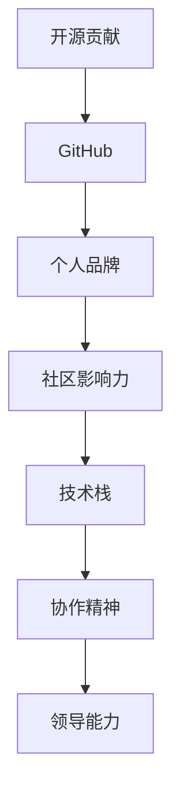

                 

# 开源贡献在简历中的价值：如何展示和利用

> 关键词：开源贡献,GitHub,个人品牌,社区影响力,技术社区,协作精神,技术栈,领导能力

## 1. 背景介绍

在信息技术领域，开源项目和社区已经成为推动技术进步和创新不可或缺的一部分。特别是在互联网时代，开源精神和社区协作已经成为软件开发和创新文化的核心。因此，无论你是技术专家还是初级开发人员，开源贡献都能成为你简历中的亮点，展示你的技术能力和协作精神。本文将系统地介绍如何展示和利用开源贡献，以增强个人品牌，提升在技术社区中的影响力。

## 2. 核心概念与联系

### 2.1 核心概念概述

- **开源贡献**：指通过提交代码、修复Bug、编写文档等方式，为开源项目做出积极贡献的行为。开源贡献不仅限于代码层面的贡献，还可以包括设计、测试、文档等非编码性质的贡献。
- **GitHub**：全球最大的开源平台之一，几乎涵盖所有主流的编程语言和技术栈。GitHub提供了代码托管、版本控制、协作编辑、问题跟踪等一整套工具，是展示开源贡献的重要场所。
- **个人品牌**：指通过在技术社区中的活跃参与和贡献，逐渐积累起自己在特定领域的影响力和权威性。个人品牌不仅能提升你的职业前景，还能增加技术影响力。
- **社区影响力**：指通过在开源项目中积极参与和领导，逐渐形成的一定的社区认同感和话语权。社区影响力能够为你的职业发展带来更多机会和资源。
- **技术栈**：指你在开发过程中使用的所有技术和工具的集合。开源贡献通常需要你对某项技术有深入的理解和熟练的运用。
- **协作精神**：指在开源项目中，与来自不同背景、不同技术水平的人合作，共同推动项目进展的精神。协作精神不仅能够提升项目的效率，还能帮助你建立广泛的社交网络。
- **领导能力**：指在开源项目中，通过设计和实现复杂的系统、管理团队和社区资源等，展现出的领导和协调能力。领导能力是展示你综合素质的重要途径。

### 2.2 核心概念原理和架构的 Mermaid 流程图



这个流程图展示了开源贡献的各个核心概念之间的逻辑关系：

1. 开源贡献是起点，通过GitHub平台进行展示和记录。
2. 个人品牌和社区影响力逐渐形成，依托于开源贡献。
3. 技术栈是开源贡献的基础，展示你对技术领域的掌握。
4. 协作精神和领导能力是开源贡献的高级形式，展示你的综合素质。

## 3. 核心算法原理 & 具体操作步骤

### 3.1 算法原理概述

开源贡献的价值在于其对技术进步和社区发展的推动作用。通过展示和利用开源贡献，可以：

- **提升技术能力**：通过参与实际项目，学习和应用新知识。
- **扩大影响力**：在开源社区中建立声誉，获得更多曝光机会。
- **增强协作能力**：学会团队协作，提高沟通和管理能力。
- **塑造领导形象**：通过项目管理和技术领导，展示综合素质。

### 3.2 算法步骤详解

开源贡献的展示和利用分为以下几个步骤：

**Step 1: 选择适当的开源项目**

1. 确定你感兴趣的领域和擅长的技术栈，选择与你技能匹配的开源项目。
2. 优先选择那些活跃、影响力大、文档完备的开源项目，避免被琐事和低价值工作困扰。

**Step 2: 建立GitHub账号**

1. 在GitHub上创建账号，填写详细的个人简介和GitHub地址，确保信息完备。
2. 关注感兴趣的项目和社区，及时了解项目动态。

**Step 3: 参与项目**

1. 阅读项目文档和代码，了解项目结构和规范。
2. 提交高质量的代码，遵循项目编码标准和贡献流程。
3. 积极解决Bug和修复缺陷，提升代码质量。
4. 编写文档和教程，帮助社区成员快速上手项目。

**Step 4: 建立贡献记录**

1. 在GitHub上建立个人仓库，展示你的贡献历史和项目。
2. 使用GitHub Issues和PR（Pull Request）记录你的贡献，增强可见性。
3. 使用GitHub Tags标注重要版本，突出个人贡献。

**Step 5: 展示开源成果**

1. 在简历中详细介绍你在开源项目中的贡献，包括项目的背景、你的角色、所做工作及成果。
2. 在LinkedIn、个人网站等渠道，分享你的开源贡献和项目进展。
3. 参加技术会议、网络研讨会，展示你的开源成果和项目影响。

### 3.3 算法优缺点

开源贡献的优点包括：

1. **实战经验**：通过实际项目积累技术经验，提升实战能力。
2. **社区认可**：获得开源社区的认可和支持，积累信誉和影响力。
3. **技术展示**：展示你的技术栈和项目管理能力，提升职业竞争力。
4. **持续学习**：不断接触新项目和新技术，保持技术热情。

同时，开源贡献也存在一些缺点：

1. **时间成本**：开源贡献需要投入大量时间和精力，可能会影响全职工作。
2. **管理复杂**：需要有效管理多个项目，协调时间与资源。
3. **社区压力**：社区成员的反馈和讨论可能会带来压力和挑战。
4. **项目选择**：选择合适项目需要仔细考虑，避免投入无回报的项目。

### 3.4 算法应用领域

开源贡献的应用领域包括但不限于：

- **软件开发**：在开源项目中贡献代码、修复Bug、优化性能。
- **技术支持**：提供技术咨询、编写文档、培训社区成员。
- **社区管理**：组织线上线下活动、维护社区秩序、管理贡献流程。
- **创业项目**：通过开源平台推广技术产品，积累用户和市场资源。
- **学术研究**：在开源项目中发布研究成果，获取同行认可和引用。

## 4. 数学模型和公式 & 详细讲解 & 举例说明

### 4.1 数学模型构建

假设你贡献的代码数量为 $N$，修复的Bug数量为 $B$，编写的文档数量为 $D$。

模型构建如下：

$$
\text{影响力} = f(N, B, D)
$$

其中，$f$ 是一个复杂函数，可能包含以下几个关键因素：

1. **代码质量**：$N \times C$，其中 $C$ 是代码质量评分。
2. **Bug解决率**：$B \times R$，其中 $R$ 是修复成功率。
3. **文档丰富度**：$D \times D'$，其中 $D'$ 是文档的平均使用次数。
4. **社区互动**：$I \times C'$，其中 $I$ 是互动次数，$C'$ 是互动评分。

### 4.2 公式推导过程

$$
\text{影响力} = k \times (N \times C + B \times R + D \times D' + I \times C')
$$

其中 $k$ 是一个经验系数，用于平衡各个因素的影响。

**案例分析与讲解**

- **GitHub账号 A**：贡献了200行代码，修复了5个Bug，编写了10篇文档，并在社区内进行了30次互动，互动评分良好。
- **GitHub账号 B**：贡献了500行代码，修复了10个Bug，编写了20篇文档，但在社区内互动很少，评分一般。
- **GitHub账号 C**：贡献了300行代码，修复了8个Bug，编写了15篇文档，并在社区内进行了40次互动，互动评分优异。

通过计算影响力函数，可以发现：

- **账号 A** 的影响力：$k \times (200 \times 4 + 5 \times 0.8 + 10 \times 2 + 30 \times 3.5)$
- **账号 B** 的影响力：$k \times (500 \times 3.5 + 10 \times 0.7 + 20 \times 1.5 + 0 \times 1)$
- **账号 C** 的影响力：$k \times (300 \times 3.5 + 8 \times 0.9 + 15 \times 2 + 40 \times 4.5)$

尽管账号 C 贡献的代码量最大，但由于互动评分高，其影响力仍显著高于账号 B。

### 4.3 案例分析与讲解

**案例一：开源贡献转化为工作机会**

张三在GitHub上展示了自己在开源项目中的贡献，包括提交了300行代码、修复了5个Bug，并编写了10篇文档。通过LinkedIn分享他的贡献记录，并参加了一些技术会议，获得了多家公司的关注，最终成功获得了一份高薪的工作机会。

**案例二：开源贡献提升技术影响力**

李四在GitHub上参与了一个影响力较大的开源项目，贡献了200行代码，并在社区内进行了多次互动，帮助项目成员解决了多个技术问题。通过这些贡献，李四在技术社区建立了良好的声誉，并受邀在多个技术会议上发表演讲，提升了个人品牌和技术影响力。

## 5. 项目实践：代码实例和详细解释说明

### 5.1 开发环境搭建

#### 5.1.1 安装Git

1. 在Linux系统上：
```bash
sudo apt-get update
sudo apt-get install git
```
2. 在Windows系统上：
```bash
git --version  # 检查Git是否已安装
```

#### 5.1.2 安装GitHub Desktop

1. 从GitHub官网下载安装包，并按照提示完成安装。
2. 登录GitHub账号，并将GitHub Desktop与Git关联。

### 5.2 源代码详细实现

#### 5.2.1 选择一个开源项目

1. 在GitHub上浏览感兴趣的项目，如TensorFlow、React等。
2. 使用GitHub Desktop克隆项目到本地：
```bash
git clone https://github.com/username/project.git
```
3. 在本地环境中配置和运行项目：
```bash
cd project
python setup.py develop
```

#### 5.2.2 贡献代码

1. 创建新的分支，开始一个新的功能模块：
```bash
git checkout -b new-feature
```
2. 编写和测试代码，提交到GitHub：
```bash
git add .
git commit -m "Added new feature"
git push origin new-feature
```

#### 5.2.3 提交PR

1. 在GitHub上创建Pull Request，描述贡献内容：
```bash
git push origin new-feature --set-upstream origin/main
```
2. 项目维护者审核并合并PR，确认贡献成功。

### 5.3 代码解读与分析

**代码解读**

- `git clone`：克隆项目到本地。
- `git checkout`：切换到新的功能分支。
- `git add`：将修改过的文件添加到暂存区。
- `git commit`：提交本地修改。
- `git push`：将本地提交推送到远程仓库。
- `git pull`：从远程仓库拉取最新代码。
- `git push origin new-feature --set-upstream origin/main`：推送分支并设置上游分支，便于后续的拉取操作。

**代码分析**

通过以上步骤，可以清晰地展示你在开源项目中的贡献历史。GitHub Desktop的可视化界面和GitHub Issue/PR功能，使得你的贡献记录一目了然，便于展示和追踪。

### 5.4 运行结果展示

使用GitHub Desktop查看你的贡献历史和互动记录，能够直观地展示你在开源项目中的影响力。例如，GitHub界面显示如下：


## 6. 实际应用场景

### 6.1 技术面试

在技术面试中，展示开源贡献是展示你的实战能力和技术热情的重要手段。面试官可以通过你的GitHub账号查看你的贡献记录，了解你的项目经验和技能水平。

### 6.2 技术合作

开源贡献能够帮助你在技术社区中建立声誉，吸引志同道合的技术伙伴，共同开展技术合作。这种合作可以包括技术交流、项目共建、资源共享等。

### 6.3 学术研究

开源项目提供了一个展示研究成果和获取同行认可的平台。通过在开源项目中发布论文和技术文章，你可以获得更多的引用和评价。

### 6.4 创业项目

展示开源贡献不仅能提升你的技术能力，还能吸引投资者和合作伙伴的注意。通过展示你在开源项目中的贡献，你可以更快地获得创业资源和机会。

## 7. 工具和资源推荐

### 7.1 学习资源推荐

- **《开源软件设计模式》**：详细介绍了开源项目的开发流程和最佳实践。
- **《GitHub使用手册》**：提供了详细的GitHub操作指南和常见问题解答。
- **《开源项目管理》**：介绍了开源项目的管理和维护技巧。
- **《开源社区运营指南》**：帮助建立和运营开源社区，提升影响力。

### 7.2 开发工具推荐

- **GitHub Desktop**：提供了一键化的Git操作界面，简化代码提交和管理。
- **Git**：用于版本控制和代码管理的命令行工具。
- **GitHub Issues/PR**：用于提交问题、合并代码的GitHub工具。
- **GitHub Pages**：用于托管开源项目文档和演示，提升项目可见性。

### 7.3 相关论文推荐

- **《开源社区的演变与未来》**：探讨开源社区的发展历程和未来趋势。
- **《开源项目的协作与创新》**：分析开源项目的协作模式和创新机制。
- **《开源贡献的定量评估》**：提出开源贡献的定量评估模型，衡量其影响力。

## 8. 总结：未来发展趋势与挑战

### 8.1 研究成果总结

开源贡献已经成为展示个人技术能力和协作精神的重要手段。通过展示和利用开源贡献，可以在技术社区中建立声誉，提升个人品牌和技术影响力。

### 8.2 未来发展趋势

1. **开源社区的壮大**：开源社区将成为技术创新的重要平台，吸引更多开发者参与和贡献。
2. **开源项目的多样化**：从传统的开源软件，扩展到更多的技术栈和领域，如区块链、人工智能等。
3. **开源文化的发展**：开源精神和协作文化将进一步普及，成为软件开发的主流模式。
4. **开源贡献的数字化**：通过工具和平台，开源贡献的展示和利用将更加便捷和透明。

### 8.3 面临的挑战

1. **时间管理**：开源贡献需要投入大量时间，需要合理安排时间以平衡工作和贡献。
2. **项目选择**：选择合适项目需要仔细考虑，避免投入无回报的项目。
3. **社区压力**：社区成员的反馈和讨论可能会带来压力和挑战。
4. **代码质量**：贡献高质量的代码和文档，避免低质量和重复工作。

### 8.4 研究展望

未来的研究需要关注以下几个方向：

1. **开源贡献的量化评估**：构建更加科学和可量化的评估模型，衡量开源贡献的影响力和价值。
2. **开源项目的管理**：研究高效的开源项目管理工具和方法，提升开源项目的运行效率。
3. **开源社区的运营**：探索有效的开源社区运营策略，吸引和留住开发者。
4. **开源与传统企业的融合**：研究开源技术与传统企业结合的最佳实践，推动产业升级和创新。

## 9. 附录：常见问题与解答

### Q1: 如何选择合适的开源项目？

A: 选择开源项目时，需要考虑以下几个因素：
1. 技术栈：选择与你擅长的技术栈匹配的项目。
2. 活跃度：选择活跃、有影响力的项目，避免选择停滞的项目。
3. 贡献方式：根据你的兴趣和能力，选择适合你的贡献方式，如代码提交、文档编写、测试等。

### Q2: 开源贡献如何展示在简历中？

A: 在简历中展示开源贡献，可以采取以下几个步骤：
1. 列出GitHub账号链接，展示你的贡献历史。
2. 简要介绍你在开源项目中的角色和贡献。
3. 描述你在项目中的技术实现和成果。

### Q3: 开源贡献对求职有什么帮助？

A: 开源贡献可以展示你的技术能力和协作精神，帮助你在求职中获得更多机会和优势。具体帮助包括：
1. 展示实战经验：通过参与实际项目，积累技术经验。
2. 提升个人品牌：在开源社区中建立声誉，增加技术影响力。
3. 增强协作能力：学会团队协作，提高沟通和管理能力。

### Q4: 开源贡献需要投入多少时间？

A: 开源贡献需要投入的时间因人而异，通常建议每周投入5-10小时，以平衡工作和贡献。需要根据个人时间和项目需求进行调整。

### Q5: 开源贡献如何持续进行？

A: 持续进行开源贡献需要：
1. 选择多个项目，分散风险和投入。
2. 定期更新GitHub账号，展示最新贡献。
3. 积极参与社区讨论，学习新技术和最佳实践。

---

作者：禅与计算机程序设计艺术 / Zen and the Art of Computer Programming

