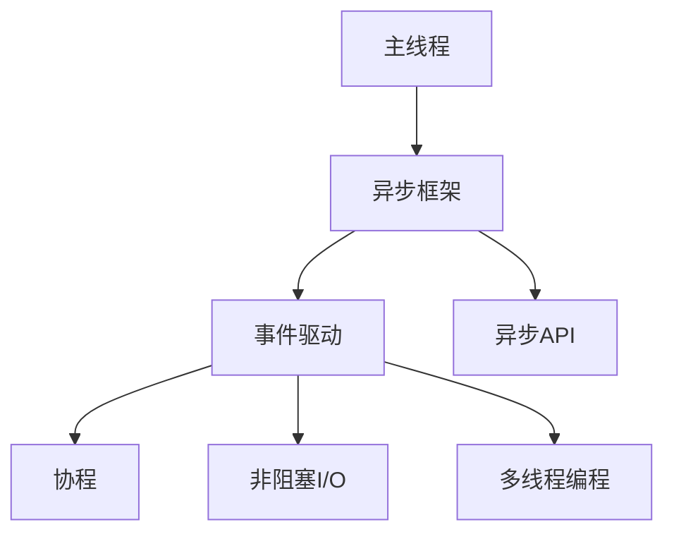

                 

# 异步处理技术的最佳实践

> 关键词：异步处理, 多线程编程, 非阻塞I/O, 协程, 事件驱动, 异步框架, Python, Java

## 1. 背景介绍

在现代计算机系统中，数据处理任务变得日益复杂多样，单一线程顺序执行已无法满足高并发、低延迟等需求。异步处理技术（Asynchronous Programming）应运而生，通过非阻塞I/O和多线程编程实现并发执行，极大地提升了系统性能和响应速度。本文将系统梳理异步处理技术的核心概念和最佳实践，为开发者提供详尽的指导。

## 2. 核心概念与联系

### 2.1 核心概念概述

异步处理技术是一种提高系统吞吐量和响应速度的重要手段。其核心思想是将耗时的I/O操作（如读写文件、网络请求等）交由后台线程或协程处理，而主线程继续执行其他任务，从而实现并发执行。

以下是异步处理中几个关键概念的概述：

- **多线程编程**：使用多个线程并行执行任务，实现系统级别的并发。
- **非阻塞I/O**：通过套接字等API调用，使I/O操作在等待时不会阻塞主线程，从而实现并发执行。
- **协程**：轻量级线程，在同一线程内执行，通过`yield`关键字实现任务切换，灵活高效。
- **事件驱动**：通过注册事件处理函数，监听并响应用户输入或系统事件，实现高效的并发处理。
- **异步框架**：提供底层异步API和高级抽象，简化异步编程，如Python的`asyncio`、Java的`Netty`。

### 2.2 核心概念原理和架构的 Mermaid 流程图(Mermaid 流程节点中不要有括号、逗号等特殊字符)



异步处理架构的核心为异步框架。该框架提供了一系列底层的异步API，通过事件驱动、协程、非阻塞I/O等方式，实现高效的异步编程。以下是异步处理的基本流程：

1. 主线程启动并注册事件处理函数。
2. 异步框架通过协程调度器，管理协程的创建和切换。
3. 协程通过`yield`关键字实现任务切换，等待I/O操作完成。
4. I/O操作通过非阻塞套接字等方式，实现异步执行。
5. 主线程继续执行其他任务，同时协程在后台执行I/O操作。
6. I/O操作完成后，触发回调函数，协程继续执行。

## 3. 核心算法原理 & 具体操作步骤

### 3.1 算法原理概述

异步处理的核心算法原理是事件驱动模型和协程调度。事件驱动模型通过监听和响应I/O事件，实现非阻塞并发执行。协程调度器通过动态切换协程，保证高效并发处理。

### 3.2 算法步骤详解

以下是异步处理的详细步骤：

1. **启动异步框架**：创建异步框架实例，设置初始配置。
2. **创建协程**：使用协程函数定义任务逻辑，创建协程对象。
3. **调度协程**：将协程加入异步框架的调度器中，启动协程执行。
4. **监听事件**：通过事件驱动机制，监听I/O事件，执行回调函数。
5. **I/O操作**：通过非阻塞I/O操作，异步读取数据或发送消息。
6. **任务切换**：协程在I/O操作期间，通过`yield`关键字切换任务，继续执行其他协程。
7. **处理结果**：I/O操作完成后，触发回调函数，处理异步返回的数据或消息。

### 3.3 算法优缺点

异步处理的优点包括：

- **高并发性能**：通过异步执行I/O操作，主线程无需等待I/O，实现了高效并发。
- **低延迟**：I/O操作通过非阻塞方式执行，减少了任务切换和上下文保存的开销。
- **可伸缩性**：异步处理可以动态调整任务数，实现高效的资源利用。

缺点包括：

- **编程复杂**：异步编程需要熟悉协程、事件驱动等技术，需要较高的编程水平。
- **资源占用**：大量协程的创建和切换，增加了系统资源消耗。
- **调试困难**：协程的隐式切换和异步编程的复杂性，增加了调试难度。

### 3.4 算法应用领域

异步处理技术广泛应用于以下几个领域：

- **高并发系统**：如Web服务器、即时通讯、网络游戏等，需要高效处理大量并发请求。
- **实时数据处理**：如数据分析、流计算、实时监控等，需要快速处理海量数据流。
- **网络应用**：如网络爬虫、文件下载、网络代理等，需要高效读写网络数据。
- **I/O密集型任务**：如数据库查询、文件读写、打印服务等，需要高效处理I/O操作。

## 4. 数学模型和公式 & 详细讲解 & 举例说明

### 4.1 数学模型构建

异步处理的数学模型基于事件驱动模型，通过事件的发生和处理，实现任务的并发执行。事件驱动模型的核心是事件队列和事件处理器。

设事件队列为$E$，事件处理器为$P$，事件处理函数为$f$。事件处理器$P$通过事件队列$E$，接收事件并执行对应的处理函数$f$。异步处理的任务模型为$T=P+E+f$。

### 4.2 公式推导过程

设事件队列$E$包含$n$个事件，事件处理器$P$处理事件的速度为$v$，事件处理函数$f$的执行时间为$t$。则事件驱动模型的执行时间$T$可以推导如下：

$$
T = \sum_{i=1}^{n} \frac{t}{v}
$$

其中，$\frac{t}{v}$表示处理一个事件所需的时间。事件驱动模型的时间复杂度为$O(n)$，即事件数线性增加。

### 4.3 案例分析与讲解

以Web服务器为例，分析异步处理的性能提升：

假设Web服务器处理一个请求需要$T$秒。如果采用同步处理，每个请求将阻塞主线程，系统吞吐量为$N/T$。而采用异步处理，I/O操作通过非阻塞套接字实现，主线程继续执行其他任务，系统吞吐量变为$N/T + N/I$，其中$I$为I/O操作的速度。显然，异步处理可以显著提升系统吞吐量和响应速度。

## 5. 项目实践：代码实例和详细解释说明

### 5.1 开发环境搭建

异步处理技术的开发环境搭建主要涉及以下工具：

1. **Python**：异步处理的标准库为`asyncio`，提供了高效的异步编程框架。
2. **Java**：异步处理的标准库为`java.util.concurrent`，提供了丰富的线程和并发工具。
3. **C++**：异步处理的标准库为`Boost.Asio`，提供了高效的网络和I/O操作库。

### 5.2 源代码详细实现

以下是一个Python的异步处理示例，使用`asyncio`框架处理Web请求：

```python
import asyncio
import aiohttp

async def fetch(url):
    async with aiohttp.ClientSession() as session:
        async with session.get(url) as response:
            return await response.text()

async def main():
    tasks = []
    for url in urls:
        task = asyncio.create_task(fetch(url))
        tasks.append(task)
    responses = await asyncio.gather(*tasks)
    # 处理所有响应结果

if __name__ == '__main__':
    urls = ['https://www.example.com', 'https://www.example.org']
    asyncio.run(main())
```

### 5.3 代码解读与分析

以上代码使用`asyncio`框架异步处理多个Web请求。`asyncio.create_task`创建协程任务，并加入到任务队列中。`asyncio.gather`等待所有协程任务完成后，返回所有结果。`async with`语句自动管理资源的创建和释放，提高了代码的可读性和健壮性。

## 6. 实际应用场景

### 6.1 Web服务器

异步处理技术在Web服务器中的应用非常广泛。通过异步处理HTTP请求，可以显著提升服务器的吞吐量和响应速度。常见的异步Web框架包括Tornado、Django Async、FastAPI等。

### 6.2 实时数据处理

异步处理技术在实时数据处理中的应用也非常常见。通过异步读取数据流和处理数据，可以实现高效的流式处理。常见的异步数据处理工具包括Apache Kafka、Apache Flink等。

### 6.3 网络应用

异步处理技术在网络应用中也有广泛应用。通过异步读写网络数据，可以实现高效的网络通信。常见的异步网络库包括Twisted、TNetty等。

### 6.4 未来应用展望

随着异步处理技术的不断演进，未来将有更多的应用场景得以实现。异步处理将在以下几个方面继续发挥重要作用：

- **微服务架构**：异步处理技术支持微服务架构的高效通信，实现高效的微服务协作。
- **物联网**：异步处理技术支持大规模物联网设备的低延迟、高并发通信，实现高效的设备协同。
- **智能家居**：异步处理技术支持智能家居设备的实时响应和高效通信，实现高效的智能控制。

## 7. 工具和资源推荐

### 7.1 学习资源推荐

异步处理技术的深入学习可以从以下几个资源入手：

1. **《Asyncio官方文档》**：提供了详细的异步编程指南和示例代码，是入门和深入学习的必备资料。
2. **《Java并发编程实战》**：经典并发编程书籍，涵盖线程、锁、并发集合等核心概念，是Java程序员必读。
3. **《Python异步编程实战》**：专注于Python异步编程的实战指南，涵盖异步框架、协程、异步I/O等核心技术。
4. **《C++ Concurrency in Action》**：深入讲解C++异步编程，涵盖协程、Future、Promise等核心概念。

### 7.2 开发工具推荐

异步处理技术的开发工具推荐以下几款：

1. **Python**：异步处理的标准库为`asyncio`，提供了高效的异步编程框架。
2. **Java**：异步处理的标准库为`java.util.concurrent`，提供了丰富的线程和并发工具。
3. **C++**：异步处理的标准库为`Boost.Asio`，提供了高效的网络和I/O操作库。

### 7.3 相关论文推荐

异步处理技术的研究成果丰富多样，以下是几篇经典论文推荐：

1. **《Event-Driven Concurrency》**：介绍事件驱动模型的核心思想和设计原则，是异步处理技术的基础读物。
2. **《Asynchronous Python Programming》**：详细介绍Python异步编程的实现机制和最佳实践，是异步编程的入门指南。
3. **《Netty: High-Performance I/O Framework》**：介绍Java异步I/O框架Netty的设计和实现，是异步编程的优秀范例。

## 8. 总结：未来发展趋势与挑战

### 8.1 研究成果总结

异步处理技术在提升系统性能和响应速度方面具有显著优势，广泛应用于高并发、实时处理等场景。异步处理技术经历了多年的发展，已形成较为成熟的技术体系和丰富的应用实践。

### 8.2 未来发展趋势

异步处理技术将向以下几个方向继续发展：

- **深度集成**：异步处理技术将与人工智能、物联网等新兴技术深度融合，实现更高效、更智能的解决方案。
- **多核优化**：异步处理技术将利用多核处理器，进一步提升并发性能和资源利用效率。
- **自动化调优**：异步处理技术将通过自动化调优工具，实现高效的性能优化和资源管理。

### 8.3 面临的挑战

异步处理技术在发展过程中仍面临一些挑战：

- **编程复杂性**：异步编程需要掌握协程、事件驱动等技术，增加了编程难度和复杂性。
- **资源占用**：大量协程的创建和切换，增加了系统资源消耗。
- **调试困难**：协程的隐式切换和异步编程的复杂性，增加了调试难度。

### 8.4 研究展望

未来的研究应关注以下几个方面：

- **简化编程模型**：通过更高级的抽象和工具，简化异步编程的复杂性，降低开发门槛。
- **优化资源利用**：利用多核处理器、异步线程池等技术，优化资源利用效率，减少系统开销。
- **增强可解释性**：通过可解释性工具和可视化手段，增强异步编程的可解释性和可维护性。

## 9. 附录：常见问题与解答

**Q1: 异步处理和同步处理有什么区别？**

A: 异步处理和同步处理的主要区别在于I/O操作的执行方式。同步处理等待I/O操作完成后，才能继续执行后续任务，而异步处理则允许主线程继续执行其他任务，I/O操作在后台执行，实现了并发执行。

**Q2: 异步处理能否替代同步处理？**

A: 异步处理在处理I/O密集型任务时，能够显著提升系统性能和响应速度，适用于高并发、低延迟等场景。但在CPU密集型任务中，同步处理可能更高效。因此，需要根据具体任务特点选择合适的处理方式。

**Q3: 异步处理如何保证线程安全？**

A: 异步处理通过协程的隐式切换，避免了线程间的数据竞争问题。同时，可以通过线程局部存储、互斥锁等机制，保证线程安全。异步框架也提供了丰富的线程安全工具和最佳实践，开发者需要谨慎使用。

**Q4: 异步处理能否处理所有类型的任务？**

A: 异步处理适用于I/O密集型任务和需要高并发的场景。但对于CPU密集型任务，同步处理可能更高效。因此，开发者需要根据具体任务特点选择合适的处理方式。

**Q5: 异步处理如何优化性能？**

A: 异步处理可以通过以下几个方面优化性能：
1. 使用异步框架提供的高级API，简化编程复杂性。
2. 利用多核处理器，提升并发性能。
3. 通过自动化调优工具，优化资源利用效率。
4. 使用协程池、线程池等机制，减少系统开销。

通过系统梳理异步处理技术的核心概念和最佳实践，本文为开发者提供了详尽的指导，帮助其在实际应用中更高效地实现异步编程，提升系统性能和响应速度。相信异步处理技术在未来将发挥更大的作用，助力开发者构建高效、健壮的计算机系统。

---

作者：禅与计算机程序设计艺术 / Zen and the Art of Computer Programming

