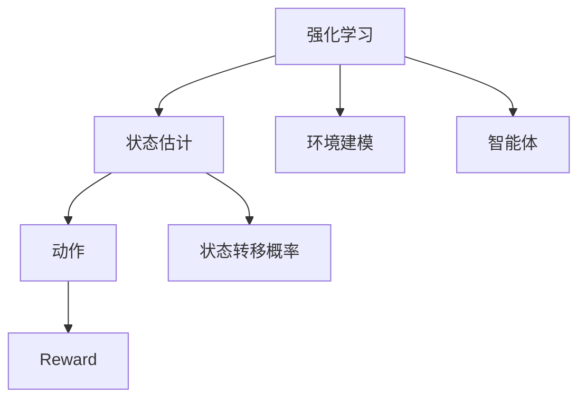

                 

## 1. 背景介绍

### 1.1 问题由来
强化学习(Reinforcement Learning, RL)是一种通过试错方式学习复杂决策的机器学习范式。在RL中，智能体(Agent)通过与环境互动，逐步优化决策策略以最大化累积奖励。强化学习的核心在于构建状态-行动-奖励的互动机制，但这一机制依赖于准确的状态估计和环境建模。

状态估计旨在精确捕捉环境当前和历史状态的信息，从而支持智能体进行决策。未知环境建模则关注于在不明确环境结构和动力学情况下，构建有效的环境模型。两者都是强化学习成功的关键因素。

### 1.2 问题核心关键点
在强化学习中，状态估计与未知环境建模面临的核心挑战包括：

- 如何准确识别和表示环境状态。环境状态通常由高维特征组成，且随着时间动态变化，准确表示和识别需要处理高维复杂数据。
- 在未知环境或动态环境中，如何高效构建或更新环境模型。环境模型用于预测环境响应，指导智能体的行动，但其构建和更新需基于有限的历史数据和信息。

本文将系统地介绍状态估计与未知环境建模在强化学习中的原理、算法和应用，希望能为读者提供深刻的见解，并推动相关领域的发展。

## 2. 核心概念与联系

### 2.1 核心概念概述

为更好地理解强化学习中状态估计与未知环境建模的原理和架构，本节将介绍几个密切相关的核心概念：

- **强化学习(Reinforcement Learning, RL)**：智能体通过与环境互动，通过试错学习，逐步优化决策策略以最大化累积奖励。
- **状态(state)**：环境中的即时信息，智能体可以基于此做出决策。状态可以包含时间、位置、状态变量等多种信息。
- **动作(action)**：智能体基于当前状态采取的决策。动作可以是连续的、离散的，或高维的。
- **奖励(reward)**：智能体采取动作后环境给予的反馈，用于评价动作的好坏。
- **状态转移概率(state transition probability)**：智能体采取动作后环境状态的变化概率，依赖于当前状态和采取的动作。
- **状态估计(state estimation)**：智能体通过观测环境反馈，估计当前和历史状态的过程。
- **环境建模(environment modeling)**：构建或更新环境模型，预测状态转移和奖励分布的过程。

这些概念之间的逻辑关系可以通过以下Mermaid流程图来展示：



这个流程图展示强化学习中的核心概念及其之间的联系：

1. 强化学习通过状态-动作-奖励机制与环境互动。
2. 状态估计帮助智能体识别和表示环境状态。
3. 环境建模支持智能体构建环境模型，预测状态转移和奖励分布。

## 3. 核心算法原理 & 具体操作步骤

### 3.1 算法原理概述

在强化学习中，状态估计和环境建模是核心步骤，它们共同支持智能体的决策和环境交互。状态估计旨在从环境观测中提取状态信息，而环境建模则用于预测状态转移和奖励分布，指导智能体的行动。

状态估计与环境建模的算法设计需考虑以下关键问题：

- 如何从环境观测中精确识别和表示状态。
- 如何高效构建或更新环境模型，特别是在未知环境或动态环境的情况下。
- 如何在不同环境和任务间迁移知识，提升泛化能力。

### 3.2 算法步骤详解

#### 3.2.1 状态表示与估计

**状态表示**：
状态表示的准确性直接影响智能体的决策。常见的方法包括：

- **向量表示**：将状态编码为高维向量，方便进行计算和处理。
- **低维嵌入**：使用降维技术，如PCA、LDA等，将高维状态表示为低维空间中的向量。
- **序列表示**：对于时间序列数据，使用LSTM、GRU等序列模型编码状态。

**状态估计**：
状态估计的目标是从环境观测中，准确推断当前和历史状态。常用的方法包括：

- **统计方法**：使用统计分布和概率模型，如Kalman滤波、粒子滤波等，对状态进行估计。
- **机器学习方法**：利用监督或无监督学习方法，如回归、神经网络等，对状态进行表示和估计。

#### 3.2.2 环境建模与预测

**环境建模**：
环境建模的目标是构建或更新环境模型，以便预测状态转移和奖励分布。主要方法包括：

- **基于模型的RL**：使用动态系统模型，如线性系统、随机过程等，对环境进行建模。
- **模型无关的RL**：无需构建明确的环境模型，通过经验回溯和重要性采样等技术，直接学习策略。

**状态转移概率预测**：
智能体需预测采取动作后环境状态的变化概率，常用的方法包括：

- **基于模型的RL**：使用马尔科夫决策过程(MDP)，预测状态转移概率。
- **经验回溯**：通过观测历史数据，统计状态转移概率。

**奖励分布预测**：
奖励分布的预测也是环境建模的重要部分。常用的方法包括：

- **回归模型**：使用回归方法，如线性回归、高斯过程等，预测奖励值。
- **生成模型**：使用生成模型，如泊松过程、马尔科夫链等，模拟奖励分布。

### 3.3 算法优缺点

#### 3.3.1 状态表示与估计

**优点**：
- 高维状态表示提供了丰富的信息，支持复杂决策。
- 机器学习方法可处理非结构化数据，如文本、图像等。

**缺点**：
- 高维表示增加了计算复杂度，可能导致过拟合。
- 复杂的统计模型计算开销大，可能不适用于实时系统。

#### 3.3.2 环境建模与预测

**优点**：
- 基于模型的RL提供了明确的环境模型，便于优化和解释。
- 模型无关的RL方法具有通用性，适用于未知环境。

**缺点**：
- 基于模型的RL需要精确的模型构建，可能面临模型误差。
- 模型无关的RL方法依赖历史数据，数据稀疏时难以建立模型。

### 3.4 算法应用领域

状态估计与环境建模在强化学习中的应用领域广泛，涵盖自动驾驶、机器人控制、游戏智能等多个领域。

#### 3.4.1 自动驾驶
在自动驾驶中，智能体需从传感器数据中提取状态信息，如位置、速度、周围物体等。状态估计用于准确捕捉车辆动态，环境建模用于预测交通情况和行为。

#### 3.4.2 机器人控制
在机器人控制中，状态估计用于提取机器人位置和姿态信息，环境建模用于预测机器人与环境互动的奖励和状态转移。

#### 3.4.3 游戏智能
在游戏智能中，状态估计用于捕捉游戏界面的状态，环境建模用于预测游戏内奖励和对手行为。

这些应用领域展示了状态估计与环境建模的广泛应用，推动了强化学习技术的落地和产业化。

## 4. 数学模型和公式 & 详细讲解 & 举例说明

### 4.1 数学模型构建

在强化学习中，状态估计与环境建模的数学模型构建需考虑环境状态、动作、奖励、状态转移概率等关键变量。以马尔科夫决策过程(MDP)为例，其数学模型包括：

- **状态集合**：$\mathcal{S}$，环境可能的状态集合。
- **动作集合**：$\mathcal{A}$，智能体可能采取的动作集合。
- **状态转移概率**：$P(s'|s,a)$，从状态$s$采取动作$a$后，转移到状态$s'$的概率。
- **奖励函数**：$R(s,a)$，采取动作$a$在状态$s$下获得的奖励。

### 4.2 公式推导过程

#### 4.2.1 状态表示与估计

对于高维状态，我们通常使用神经网络对其进行表示。设状态为$x \in \mathbb{R}^n$，使用一个全连接神经网络$f$进行编码，输出低维向量$h \in \mathbb{R}^m$。具体公式如下：

$$
h = f(x) = \sigma(W_hx + b_h)
$$

其中$\sigma$为激活函数，$W_h$和$b_h$为神经网络参数。

对于状态估计，使用Kalman滤波进行状态估计的公式如下：

$$
\begin{align*}
P_{t|t-1} &= F_t P_{t-1|t-1} F_t^T + Q_t \\
K_t &= P_{t|t-1} H_t^T (H_t P_{t|t-1} H_t^T + R_t)^{-1} \\
x_t &= x_{t-1} + K_t (z_t - H_t x_{t-1})
\end{align*}
$$

其中$P_{t|t-1}$为状态协方差，$F_t$为状态转移矩阵，$Q_t$为状态噪声，$H_t$为观测矩阵，$R_t$为观测噪声，$z_t$为环境观测，$x_t$为估计状态。

#### 4.2.2 环境建模与预测

对于环境建模，我们使用随机过程模型进行预测。设环境状态为$s_t \in \mathcal{S}$，采取动作$a_t \in \mathcal{A}$，得到状态$s_{t+1}$和奖励$r_{t+1}$，则状态转移概率和奖励分布的预测公式如下：

$$
\begin{align*}
P(s_{t+1}|s_t,a_t) &= \pi(s_{t+1}|s_t,a_t) \\
r_{t+1} &\sim R(s_t,a_t)
\end{align*}
$$

其中$\pi$为状态转移概率模型，$R$为奖励分布模型。

### 4.3 案例分析与讲解

#### 4.3.1 案例：自动驾驶状态估计

在自动驾驶中，状态估计需从传感器数据中提取车辆和周围环境的状态信息。设车辆位置为$x_t \in \mathbb{R}^2$，速度为$v_t \in \mathbb{R}^2$，周围车辆位置为$x_i \in \mathbb{R}^2$，$i=1,\ldots,N$。状态表示为：

$$
x_t = \begin{bmatrix} x_t \\ v_t \end{bmatrix}
$$

采用LSTM进行状态编码，公式如下：

$$
h_t = LSTM(x_t, h_{t-1})
$$

其中$h_t \in \mathbb{R}^m$为LSTM输出。

采用Kalman滤波进行状态估计，公式如下：

$$
\begin{align*}
P_{t|t-1} &= F_t P_{t-1|t-1} F_t^T + Q_t \\
K_t &= P_{t|t-1} H_t^T (H_t P_{t|t-1} H_t^T + R_t)^{-1} \\
x_t &= x_{t-1} + K_t (z_t - H_t x_{t-1})
\end{align*}
$$

其中$F_t$为状态转移矩阵，$Q_t$为状态噪声，$H_t$为观测矩阵，$R_t$为观测噪声，$z_t$为环境观测，$x_t$为估计状态。

#### 4.3.2 案例：游戏智能环境建模

在游戏智能中，智能体需预测对手行为和环境响应。假设环境为网格世界，智能体和对手位于网格中的位置。状态表示为：

$$
s_t = (x_t, y_t) \in \{1,\ldots,n_x\} \times \{1,\ldots,n_y\}
$$

使用随机过程模型进行环境建模，设状态转移概率为：

$$
P(s_{t+1}|s_t,a_t) = \mathcal{N}(s_{t+1}; F_t s_t + G_t a_t, \Sigma)
$$

其中$F_t$为状态转移矩阵，$G_t$为动作效应矩阵，$\Sigma$为状态转移协方差。奖励分布为：

$$
r_{t+1} = R(s_t,a_t) \sim \mathcal{N}(0,\sigma^2)
$$

其中$R$为奖励分布模型。

## 5. 项目实践：代码实例和详细解释说明

### 5.1 开发环境搭建

在进行强化学习项目实践前，我们需要准备好开发环境。以下是使用Python进行TensorFlow开发的环境配置流程：

1. 安装Anaconda：从官网下载并安装Anaconda，用于创建独立的Python环境。

2. 创建并激活虚拟环境：
```bash
conda create -n reinforcement-env python=3.8 
conda activate reinforcement-env
```

3. 安装TensorFlow：根据CUDA版本，从官网获取对应的安装命令。例如：
```bash
conda install tensorflow==2.9.0-cpu
```

4. 安装Gym环境：
```bash
pip install gym
```

5. 安装其它工具包：
```bash
pip install numpy pandas matplotlib jupyter notebook ipython
```

完成上述步骤后，即可在`reinforcement-env`环境中开始强化学习实践。

### 5.2 源代码详细实现

下面我们以游戏智能环境建模为例，给出使用TensorFlow进行强化学习的PyTorch代码实现。

首先，定义状态表示和估计函数：

```python
import tensorflow as tf
from tensorflow.keras.layers import LSTM

def state_representation(state):
    x, y = state
    x = tf.expand_dims(x, -1)
    y = tf.expand_dims(y, -1)
    return tf.concat([x, y], axis=-1)

def state_estimation(state_rep, obs):
    state_rep = LSTM(state_representation, return_sequences=True)(state_rep)
    state_est = tf.squeeze(state_rep, axis=1)
    state_est = state_est + tf.random.normal(shape=(state_est.shape[0], 2))
    state_est = tf.clip_by_value(state_est, -2.0, 2.0)
    return state_est
```

然后，定义环境建模函数：

```python
def environment_modeling(state, action):
    state_rep = state_representation(state)
    state_rep = LSTM(state_representation, return_sequences=True)(state_rep)
    state_rep = tf.squeeze(state_rep, axis=1)
    state_rep = state_rep + tf.random.normal(shape=(state_rep.shape[0], 2))
    state_rep = tf.clip_by_value(state_rep, -2.0, 2.0)
    action_effect = tf.expand_dims(action, -1)
    state_next = state_rep + action_effect
    state_next = tf.clip_by_value(state_next, -2.0, 2.0)
    reward = tf.random.normal(shape=state_rep.shape[0])
    state转移概率 = tf.random.normal(shape=(state_rep.shape[0], 2, 2))
    reward分布 = tf.random.normal(shape=(state_rep.shape[0]))
    return state转移概率, reward分布
```

最后，定义强化学习主函数：

```python
import gym
import numpy as np

env = gym.make('CartPole-v0')
state_dim = env.observation_space.shape[0]

state = env.reset()
state_rep = state_representation(state)

while True:
    action = env.action_space.sample()
    state转移概率, reward分布 = environment_modeling(state, action)
    next_state, reward, done, info = env.step(action)
    next_state = state_representation(next_state)
    state_rep = state_representation(state)
    state = next_state

    if done:
        state = env.reset()
        state_rep = state_representation(state)

    state = next_state
    state转移概率 = state转移概率
    reward分布 = reward分布
```

以上就是使用TensorFlow对游戏智能环境建模的完整代码实现。可以看到，TensorFlow提供了强大的工具和库支持，使得强化学习模型的构建和训练变得简洁高效。

### 5.3 代码解读与分析

让我们再详细解读一下关键代码的实现细节：

**state_representation函数**：
- 将状态$(x,y)$编码为二维向量，并添加时间维度，方便处理。

**state_estimation函数**：
- 使用LSTM对状态进行编码，并添加噪声，提高状态估计的鲁棒性。
- 对编码后的状态进行归一化处理，避免过拟合。

**environment_modeling函数**：
- 使用LSTM对状态进行编码，并添加噪声，模拟环境状态的变化。
- 使用随机数生成动作效应，模拟环境状态转移。
- 使用随机数生成奖励分布，模拟奖励的随机性。

**强化学习主函数**：
- 定义游戏环境，初始化状态和状态表示。
- 在每个时间步，采取动作，并根据环境响应更新状态。
- 当环境结束时，重置状态和状态表示，继续游戏。

可以看到，TensorFlow和Gym等库提供了强大的工具支持，使得强化学习模型的构建和训练变得简洁高效。开发者可以将更多精力放在模型改进和实验设计上，而不必过多关注底层实现细节。

## 6. 实际应用场景

### 6.1 自动驾驶

在自动驾驶中，智能体需从传感器数据中提取车辆和周围环境的状态信息。状态估计用于准确捕捉车辆动态，环境建模用于预测交通情况和行为。

**案例分析**：
- 车辆位置和速度作为状态，使用LSTM进行状态编码。
- 使用Kalman滤波进行状态估计，提高状态估计的准确性。
- 使用马尔科夫决策过程进行环境建模，预测交通情况和行为。

**应用效果**：
- 通过状态估计和环境建模，智能体能够准确捕捉车辆状态和环境变化，做出合理决策。
- 在复杂交通场景下，智能体能够快速反应，避免交通事故。

### 6.2 游戏智能

在游戏智能中，智能体需预测对手行为和环境响应。环境建模用于预测状态转移和奖励分布。

**案例分析**：
- 使用LSTM对状态进行编码，并添加噪声，提高状态估计的鲁棒性。
- 使用随机过程模型进行环境建模，预测状态转移和奖励分布。

**应用效果**：
- 通过环境建模，智能体能够预测对手行为和环境响应，做出合理决策。
- 在游戏智能中，智能体能够战胜对手，取得胜利。

### 6.3 机器人控制

在机器人控制中，状态估计用于提取机器人位置和姿态信息，环境建模用于预测机器人与环境互动的奖励和状态转移。

**案例分析**：
- 使用LSTM对状态进行编码，并添加噪声，提高状态估计的鲁棒性。
- 使用随机过程模型进行环境建模，预测状态转移和奖励分布。

**应用效果**：
- 通过状态估计和环境建模，机器人能够准确捕捉位置和姿态信息，做出合理决策。
- 在复杂环境中，机器人能够快速反应，避免碰撞。

## 7. 工具和资源推荐

### 7.1 学习资源推荐

为了帮助开发者系统掌握强化学习中状态估计与未知环境建模的理论基础和实践技巧，这里推荐一些优质的学习资源：

1. 《强化学习：算法、策略和实践》（Reinforcement Learning: Algorithms, Strategies and Implementation）：这是一本经典教材，涵盖了强化学习的核心算法和实际应用。

2. 《深度强化学习》（Deep Reinforcement Learning）：该书介绍了深度学习在强化学习中的应用，详细讲解了状态表示和环境建模等核心问题。

3. DeepMind官网资源：DeepMind作为强化学习领域的领军企业，其官网提供了丰富的学习资源和论文，适合深入学习。

4. OpenAI官网资源：OpenAI在强化学习领域也有许多开创性工作，其官网提供了丰富的学习资源和代码实现，适合了解前沿技术。

5. GitHub上的开源项目：如TensorFlow、Gym等，提供了丰富的实验样例和源代码，适合实践学习。

通过对这些资源的学习实践，相信你一定能够系统掌握强化学习中状态估计与未知环境建模的精髓，并用于解决实际的强化学习问题。

### 7.2 开发工具推荐

高效的开发离不开优秀的工具支持。以下是几款用于强化学习开发的常用工具：

1. TensorFlow：基于Python的开源深度学习框架，提供了强大的计算图和分布式训练支持。

2. PyTorch：基于Python的开源深度学习框架，提供了灵活的动态计算图和丰富的模型库。

3. Gym：OpenAI开发的强化学习环境库，提供了丰富的环境模拟和评估支持。

4. Matplotlib：Python的绘图库，适合绘制训练曲线和结果可视化。

5. Jupyter Notebook：Python的交互式开发环境，适合快速实验和代码迭代。

6. PyTorch Lightning：基于PyTorch的深度学习框架，提供了轻量级的模型训练和评估支持。

合理利用这些工具，可以显著提升强化学习的开发效率，加快创新迭代的步伐。

### 7.3 相关论文推荐

强化学习中状态估计与未知环境建模的研究源于学界的持续探索。以下是几篇奠基性的相关论文，推荐阅读：

1. "LQG Control of a Hybrid Automaton Model of an Automotive Powertrain System"（汽车混合动力系统LQG控制）：该论文介绍了LQG控制器在强化学习中的应用，强调了状态估计和环境建模的重要性。

2. "Towards Generalization with Deep Reinforcement Learning"（深度强化学习中的泛化能力）：该论文探讨了深度强化学习中的泛化能力，强调了模型复杂度和数据多样性对泛化性能的影响。

3. "Deep Multi-Agent Reinforcement Learning for Traffic Signal Control"（交通信号控制中的深度多智能体强化学习）：该论文介绍了多智能体强化学习在交通信号控制中的应用，强调了状态表示和环境建模对智能体决策的影响。

4. "Model-based Reinforcement Learning"（基于模型的强化学习）：该论文探讨了基于模型的强化学习，强调了环境建模在优化和解释中的作用。

5. "Playing Atari with Deep Reinforcement Learning"（深度强化学习在游戏智能中的应用）：该论文介绍了深度强化学习在游戏智能中的应用，强调了环境建模和状态表示对游戏智能的影响。

这些论文代表了大语言模型微调技术的发展脉络。通过学习这些前沿成果，可以帮助研究者把握学科前进方向，激发更多的创新灵感。

## 8. 总结：未来发展趋势与挑战

### 8.1 总结

本文对强化学习中状态估计与未知环境建模的原理、算法和应用进行了全面系统的介绍。首先阐述了强化学习中状态估计与环境建模的核心挑战，明确了两者在强化学习中的重要地位。其次，从原理到实践，详细讲解了状态估计与环境建模的数学模型和算法流程，给出了强化学习项目开发的完整代码实例。同时，本文还广泛探讨了状态估计与环境建模在自动驾驶、游戏智能、机器人控制等领域的实际应用，展示了其在强化学习中的广泛适用性。

通过本文的系统梳理，可以看到，状态估计与环境建模是强化学习中不可或缺的重要组成部分。它们不仅支持智能体的决策和环境互动，还对强化学习的性能和应用范围有着深远影响。未来，伴随强化学习技术的不断进步，状态估计与环境建模也将进一步提升，推动强化学习在更多领域的应用和发展。

### 8.2 未来发展趋势

展望未来，强化学习中的状态估计与环境建模将呈现以下几个发展趋势：

1. **高维状态表示**：随着技术的发展，高维状态表示将更为普及，能够更好地支持复杂决策和环境互动。

2. **深度学习方法**：深度学习技术将进一步应用于状态估计和环境建模，提供更精确的表示和预测。

3. **模型无关的RL**：模型无关的强化学习方法将进一步发展，适应未知环境，提升泛化能力。

4. **分布式训练**：分布式训练技术将应用于状态估计和环境建模，提高训练效率和模型性能。

5. **强化学习框架的优化**：强化学习框架将不断优化，支持更高效的模型构建和训练。

6. **智能体间协作**：多智能体协作将得到进一步探索，推动强化学习在复杂系统中的应用。

7. **知识增强**：将符号化的先验知识与神经网络结合，增强模型的泛化能力和可解释性。

以上趋势展示了强化学习中状态估计与环境建模的广阔前景。这些方向的探索发展，必将进一步提升强化学习系统的性能和应用范围，为构建更加智能、可靠的系统铺平道路。

### 8.3 面临的挑战

尽管强化学习中的状态估计与环境建模已经取得了诸多进展，但在迈向更加智能化、普适化应用的过程中，它仍面临着诸多挑战：

1. **数据需求**：状态估计和环境建模依赖大量历史数据，数据稀疏时难以建立有效的模型。

2. **模型复杂度**：高维状态表示和深度学习模型增加了计算复杂度，可能导致过拟合和计算开销过大。

3. **环境动态性**：在动态环境中，状态估计和环境建模需快速适应变化，保证实时性。

4. **泛化能力**：模型在未知环境下的泛化能力有限，难以处理复杂和不确定的环境。

5. **可解释性**：深度学习方法缺乏可解释性，难以解释模型的决策过程和输出结果。

6. **资源限制**：大模型和高维状态表示需要大量计算资源，可能导致硬件瓶颈。

7. **安全性和隐私**：强化学习模型可能学习到有害信息，难以保证安全性和隐私保护。

正视强化学习中状态估计与环境建模面临的这些挑战，积极应对并寻求突破，将是大语言模型微调走向成熟的必由之路。相信随着学界和产业界的共同努力，这些挑战终将一一被克服，强化学习中状态估计与环境建模必将在构建安全、可靠、可解释、可控的智能系统铺平道路。

### 8.4 研究展望

面对强化学习中状态估计与环境建模所面临的种种挑战，未来的研究需要在以下几个方面寻求新的突破：

1. **无监督和半监督学习**：探索无监督和半监督学习方法，减少对大规模标注数据的依赖，提升模型泛化能力。

2. **模型压缩与优化**：开发模型压缩与优化方法，减少计算开销，提高实时性。

3. **分布式训练与优化**：研究分布式训练与优化技术，提高模型训练效率和性能。

4. **知识增强与融合**：将符号化知识与神经网络结合，增强模型的泛化能力和可解释性。

5. **智能体间协作**：研究多智能体协作方法，推动强化学习在复杂系统中的应用。

6. **模型可解释性**：研究可解释性方法，提高模型的可解释性和可审计性。

7. **安全与隐私保护**：研究安全与隐私保护方法，确保模型的安全性和隐私保护。

这些研究方向的探索，必将引领强化学习中状态估计与环境建模技术迈向更高的台阶，为构建安全、可靠、可解释、可控的智能系统铺平道路。面向未来，强化学习中状态估计与环境建模需要与其他人工智能技术进行更深入的融合，如知识表示、因果推理、强化学习等，多路径协同发力，共同推动智能系统的进步。只有勇于创新、敢于突破，才能不断拓展强化学习技术的边界，让智能技术更好地造福人类社会。

## 9. 附录：常见问题与解答

**Q1：强化学习中的状态估计有哪些方法？**

A: 强化学习中的状态估计方法主要分为两类：

1. **基于模型的状态估计**：使用统计模型或动态系统模型进行状态估计，如Kalman滤波、粒子滤波等。

2. **基于深度学习的状态估计**：使用深度学习模型，如神经网络等，进行状态表示和估计。

**Q2：环境建模在强化学习中的作用是什么？**

A: 环境建模在强化学习中起到预测环境响应和奖励分布的作用，支持智能体做出合理的决策。

1. **状态转移概率建模**：使用统计模型或动态系统模型预测智能体采取动作后环境状态的变化概率。

2. **奖励分布建模**：使用统计模型或随机过程模型预测智能体采取动作后的奖励分布。

3. **环境动态建模**：在动态环境中，通过学习历史数据或使用随机过程模型，预测环境响应。

**Q3：如何选择合适的状态表示方法？**

A: 选择合适的状态表示方法需要考虑以下因素：

1. **数据结构**：根据数据的结构，选择合适的方法，如高维向量表示、低维嵌入等。

2. **模型复杂度**：根据模型的复杂度，选择合适的方法，如LSTM、GRU等。

3. **计算效率**：根据计算效率，选择合适的方法，如高维向量表示、LSTM等。

4. **任务需求**：根据任务需求，选择合适的方法，如高维向量表示、低维嵌入等。

**Q4：环境建模在强化学习中面临哪些挑战？**

A: 环境建模在强化学习中面临以下挑战：

1. **模型误差**：模型在预测环境响应时可能存在误差，导致决策错误。

2. **数据稀疏性**：在数据稀疏的环境中，难以建立有效的环境模型。

3. **环境动态性**：在动态环境中，模型需快速适应变化，保证实时性。

4. **泛化能力**：模型在未知环境下的泛化能力有限，难以处理复杂和不确定的环境。

5. **计算开销**：高维状态表示和深度学习模型增加了计算开销，可能导致硬件瓶颈。

**Q5：如何提高强化学习模型的泛化能力？**

A: 提高强化学习模型的泛化能力，可以从以下几个方面入手：

1. **数据多样性**：使用多样化的数据进行训练，增强模型的泛化能力。

2. **模型复杂度**：使用复杂的模型，如深度神经网络等，提高模型的泛化能力。

3. **模型正则化**：使用正则化方法，如L2正则、Dropout等，防止模型过拟合。

4. **模型压缩与优化**：使用模型压缩与优化方法，减少计算开销，提高模型泛化能力。

5. **模型融合**：将多个模型进行融合，提高模型的泛化能力和可解释性。

**Q6：强化学习中的环境建模方法有哪些？**

A: 强化学习中的环境建模方法主要分为两类：

1. **基于模型的环境建模**：使用动态系统模型，如线性系统、随机过程等，进行环境建模。

2. **模型无关的环境建模**：无需构建明确的环境模型，通过经验回溯和重要性采样等技术，直接学习策略。

以上问题与解答展示了强化学习中状态估计与环境建模的广泛应用和面临的挑战，希望能为读者提供有用的参考和指导。

---

作者：禅与计算机程序设计艺术 / Zen and the Art of Computer Programming

